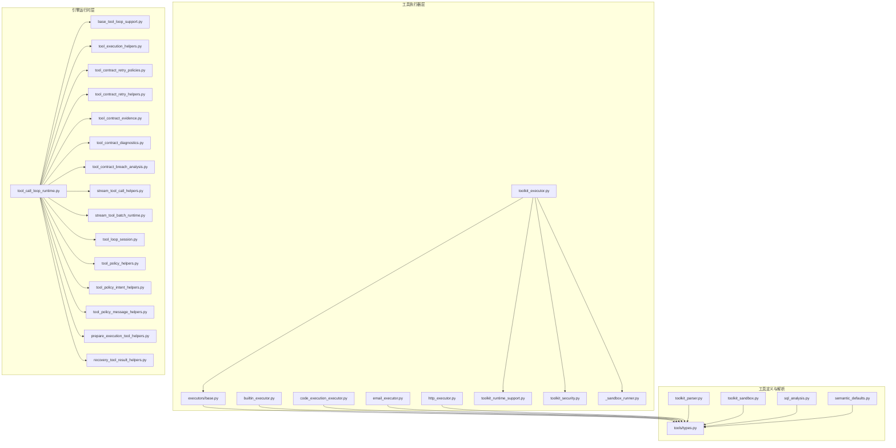
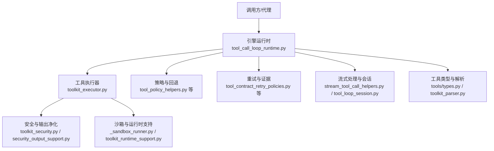
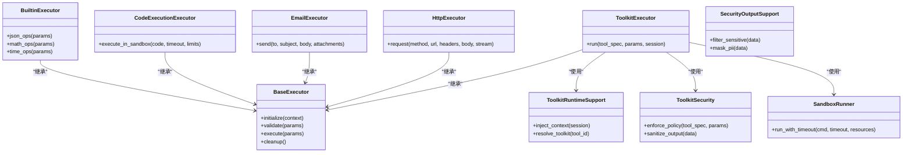
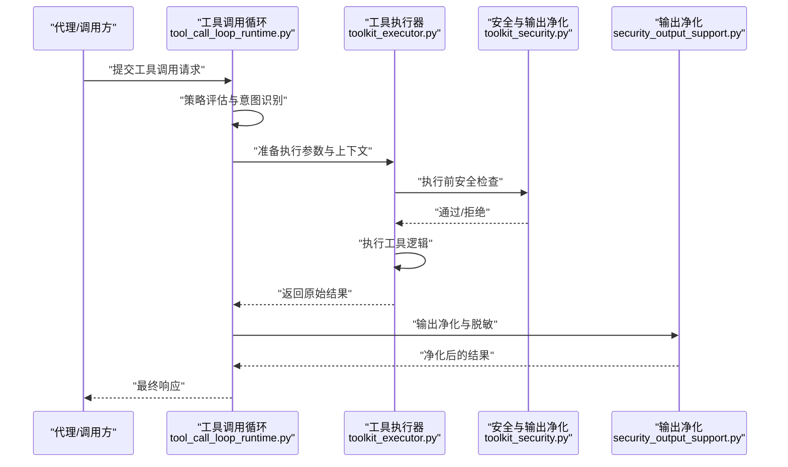
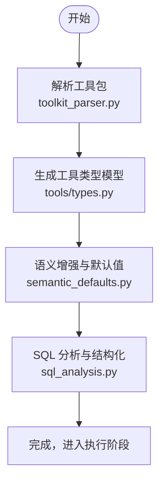
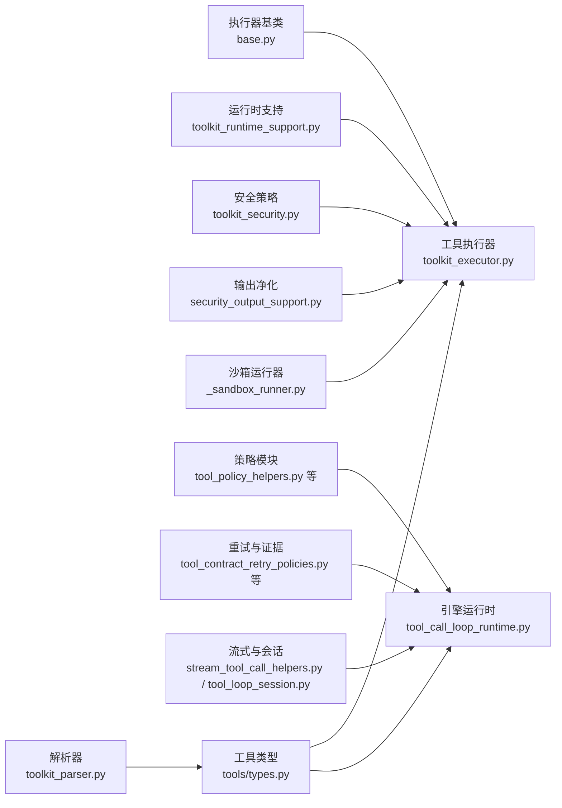

# 工具组件

<cite>
**本文引用的文件**
- [toolkit_executor.py](file://backend/app/ai/tools/executors/toolkit_executor.py)
- [base.py](file://backend/app/ai/tools/executors/base.py)
- [builtin_executor.py](file://backend/app/ai/tools/executors/builtin_executor.py)
- [code_execution_executor.py](file://backend/app/ai/tools/executors/code_execution_executor.py)
- [email_executor.py](file://backend/app/ai/tools/executors/email_executor.py)
- [http_executor.py](file://backend/app/ai/tools/executors/http_executor.py)
- [toolkit_runtime_support.py](file://backend/app/ai/tools/executors/toolkit_runtime_support.py)
- [toolkit_security.py](file://backend/app/ai/tools/executors/toolkit_security.py)
- [_sandbox_runner.py](file://backend/app/ai/tools/executors/_sandbox_runner.py)
- [security_output_support.py](file://backend/app/ai/tools/security_output_support.py)
- [optimizer.py](file://backend/app/ai/tools/optimizer.py)
- [types.py](file://backend/app/ai/tools/types.py)
- [base_tool_loop_support.py](file://backend/app/ai/engine/base_tool_loop_support.py)
- [tool_call_loop_runtime.py](file://backend/app/ai/engine/tool_call_loop_runtime.py)
- [tool_execution_helpers.py](file://backend/app/ai/engine/tool_execution_helpers.py)
- [tool_contract_retry_policies.py](file://backend/app/ai/engine/tool_contract_retry_policies.py)
- [tool_contract_retry_helpers.py](file://backend/app/ai/engine/tool_contract_retry_helpers.py)
- [tool_contract_evidence.py](file://backend/app/ai/engine/tool_contract_evidence.py)
- [tool_contract_diagnostics.py](file://backend/app/ai/engine/tool_contract_diagnostics.py)
- [tool_contract_breach_analysis.py](file://backend/app/ai/engine/tool_contract_breach_analysis.py)
- [stream_tool_call_helpers.py](file://backend/app/ai/engine/stream_tool_call_helpers.py)
- [stream_tool_batch_runtime.py](file://backend/app/ai/engine/stream_tool_batch_runtime.py)
- [tool_loop_session.py](file://backend/app/ai/engine/tool_loop_session.py)
- [tool_policy_helpers.py](file://backend/app/ai/engine/tool_policy_helpers.py)
- [tool_policy_intent_helpers.py](file://backend/app/ai/engine/tool_policy_intent_helpers.py)
- [tool_policy_message_helpers.py](file://backend/app/ai/engine/tool_policy_message_helpers.py)
- [prepare_execution_tool_helpers.py](file://backend/app/ai/engine/prepare_execution_tool_helpers.py)
- [recovery_tool_result_helpers.py](file://backend/app/ai/engine/recovery_tool_result_helpers.py)
- [toolkit_parser.py](file://backend/app/ai/tools/toolkit_parser.py)
- [toolkit_sandbox.py](file://backend/app/ai/tools/sandbox.py)
- [sql_analysis.py](file://backend/app/ai/tools/sql_analysis.py)
- [semantic_defaults.py](file://backend/app/ai/tools/semantic_defaults.py)
- [types.py](file://backend/app/ai/engine/types.py)
</cite>

## 目录
1. [简介](#简介)
2. [项目结构](#项目结构)
3. [核心组件](#核心组件)
4. [架构总览](#架构总览)
5. [详细组件分析](#详细组件分析)
6. [依赖关系分析](#依赖关系分析)
7. [性能考量](#性能考量)
8. [故障排查指南](#故障排查指南)
9. [结论](#结论)
10. [附录](#附录)

## 简介
本文件聚焦于“工具组件”模块，系统化梳理其在身份显示、Markdown 渲染、附件详情等辅助能力上的设计与实现。该模块围绕“工具执行器（Executors）”与“引擎运行时（Engine Runtime）”两条主线展开：前者负责具体工具的调用与安全控制，后者负责工具调用流程编排、策略与重试、证据与诊断、流式处理与会话管理。文档同时覆盖可配置性、扩展性与复用策略，并给出性能优化、内存管理与资源清理建议，以及在不同业务场景下的应用模式与最佳实践。

## 项目结构
工具组件位于后端 AI 子系统中，主要分布在以下位置：
- 执行器层：tools/executors 下的各类执行器与支持模块
- 引擎层：ai/engine 下的工具调用循环、策略、重试、证据与诊断等
- 工具定义与解析：tools 目录下的类型、解析器、SQL 分析、语义默认值等
- 安全与输出净化：security_output_support、toolkit_security 等

**图表来源**
- [toolkit_executor.py](file://backend/app/ai/tools/executors/toolkit_executor.py)
- [base.py](file://backend/app/ai/tools/executors/base.py)
- [toolkit_runtime_support.py](file://backend/app/ai/tools/executors/toolkit_runtime_support.py)
- [toolkit_security.py](file://backend/app/ai/tools/executors/toolkit_security.py)
- [_sandbox_runner.py](file://backend/app/ai/tools/executors/_sandbox_runner.py)
- [tool_call_loop_runtime.py](file://backend/app/ai/engine/tool_call_loop_runtime.py)
- [base_tool_loop_support.py](file://backend/app/ai/engine/base_tool_loop_support.py)
- [tool_execution_helpers.py](file://backend/app/ai/engine/tool_execution_helpers.py)
- [tool_contract_retry_policies.py](file://backend/app/ai/engine/tool_contract_retry_policies.py)
- [tool_contract_retry_helpers.py](file://backend/app/ai/engine/tool_contract_retry_helpers.py)
- [tool_contract_evidence.py](file://backend/app/ai/engine/tool_contract_evidence.py)
- [tool_contract_diagnostics.py](file://backend/app/ai/engine/tool_contract_diagnostics.py)
- [tool_contract_breach_analysis.py](file://backend/app/ai/engine/tool_contract_breach_analysis.py)
- [stream_tool_call_helpers.py](file://backend/app/ai/engine/stream_tool_call_helpers.py)
- [stream_tool_batch_runtime.py](file://backend/app/ai/engine/stream_tool_batch_runtime.py)
- [tool_loop_session.py](file://backend/app/ai/engine/tool_loop_session.py)
- [tool_policy_helpers.py](file://backend/app/ai/engine/tool_policy_helpers.py)
- [tool_policy_intent_helpers.py](file://backend/app/ai/engine/tool_policy_intent_helpers.py)
- [tool_policy_message_helpers.py](file://backend/app/ai/engine/tool_policy_message_helpers.py)
- [prepare_execution_tool_helpers.py](file://backend/app/ai/engine/prepare_execution_tool_helpers.py)
- [recovery_tool_result_helpers.py](file://backend/app/ai/engine/recovery_tool_result_helpers.py)
- [toolkit_parser.py](file://backend/app/ai/tools/toolkit_parser.py)
- [toolkit_sandbox.py](file://backend/app/ai/tools/sandbox.py)
- [sql_analysis.py](file://backend/app/ai/tools/sql_analysis.py)
- [semantic_defaults.py](file://backend/app/ai/tools/semantic_defaults.py)
- [types.py](file://backend/app/ai/tools/types.py)

**章节来源**
- [toolkit_executor.py](file://backend/app/ai/tools/executors/toolkit_executor.py)
- [tool_call_loop_runtime.py](file://backend/app/ai/engine/tool_call_loop_runtime.py)

## 核心组件
- 工具执行器（Executors）
  - 基类与通用接口：定义工具执行的标准协议与生命周期钩子，确保各执行器的一致性与可替换性。
  - 内置执行器：面向常见工具（如 JSON 操作、数学运算、时间处理）的轻量实现，强调安全与可审计。
  - 代码执行执行器：对受限沙箱内的代码执行进行隔离与监控，支持超时、资源限制与输出净化。
  - 邮件执行器：封装邮件发送的参数校验、模板渲染与发送流程。
  - HTTP 执行器：封装 HTTP 请求的构建、认证、重试与响应处理。
  - 运行时支持与安全：提供工具调用上下文注入、权限校验、输出净化与安全策略落地。
- 引擎运行时（Engine Runtime）
  - 调用循环与策略：统一的工具调用循环，结合意图识别、消息策略与回退机制，保证在复杂场景下的稳定性。
  - 合同与诊断：对工具调用契约进行证据收集、重试策略与违规分析，支撑可观测性与合规性。
  - 流式处理与会话：支持流式工具调用与批量运行，维护会话状态与上下文一致性。
- 工具定义与解析
  - 解析器与类型：对工具包（Toolkit）进行解析，生成标准化的工具描述与参数模型。
  - 语义默认值与 SQL 分析：为工具调用提供语义增强与 SQL 结构化分析能力，提升工具使用的准确性与安全性。

**章节来源**
- [base.py](file://backend/app/ai/tools/executors/base.py)
- [builtin_executor.py](file://backend/app/ai/tools/executors/builtin_executor.py)
- [code_execution_executor.py](file://backend/app/ai/tools/executors/code_execution_executor.py)
- [email_executor.py](file://backend/app/ai/tools/executors/email_executor.py)
- [http_executor.py](file://backend/app/ai/tools/executors/http_executor.py)
- [toolkit_runtime_support.py](file://backend/app/ai/tools/executors/toolkit_runtime_support.py)
- [toolkit_security.py](file://backend/app/ai/tools/executors/toolkit_security.py)
- [security_output_support.py](file://backend/app/ai/tools/security_output_support.py)
- [toolkit_executor.py](file://backend/app/ai/tools/executors/toolkit_executor.py)
- [tool_call_loop_runtime.py](file://backend/app/ai/engine/tool_call_loop_runtime.py)
- [base_tool_loop_support.py](file://backend/app/ai/engine/base_tool_loop_support.py)
- [tool_execution_helpers.py](file://backend/app/ai/engine/tool_execution_helpers.py)
- [tool_contract_retry_policies.py](file://backend/app/ai/engine/tool_contract_retry_policies.py)
- [tool_contract_retry_helpers.py](file://backend/app/ai/engine/tool_contract_retry_helpers.py)
- [tool_contract_evidence.py](file://backend/app/ai/engine/tool_contract_evidence.py)
- [tool_contract_diagnostics.py](file://backend/app/ai/engine/tool_contract_diagnostics.py)
- [tool_contract_breach_analysis.py](file://backend/app/ai/engine/tool_contract_breach_analysis.py)
- [stream_tool_call_helpers.py](file://backend/app/ai/engine/stream_tool_call_helpers.py)
- [stream_tool_batch_runtime.py](file://backend/app/ai/engine/stream_tool_batch_runtime.py)
- [tool_loop_session.py](file://backend/app/ai/engine/tool_loop_session.py)
- [tool_policy_helpers.py](file://backend/app/ai/engine/tool_policy_helpers.py)
- [tool_policy_intent_helpers.py](file://backend/app/ai/engine/tool_policy_intent_helpers.py)
- [tool_policy_message_helpers.py](file://backend/app/ai/engine/tool_policy_message_helpers.py)
- [prepare_execution_tool_helpers.py](file://backend/app/ai/engine/prepare_execution_tool_helpers.py)
- [recovery_tool_result_helpers.py](file://backend/app/ai/engine/recovery_tool_result_helpers.py)
- [toolkit_parser.py](file://backend/app/ai/tools/toolkit_parser.py)
- [toolkit_sandbox.py](file://backend/app/ai/tools/sandbox.py)
- [sql_analysis.py](file://backend/app/ai/tools/sql_analysis.py)
- [semantic_defaults.py](file://backend/app/ai/tools/semantic_defaults.py)
- [types.py](file://backend/app/ai/tools/types.py)

## 架构总览
工具组件采用“执行器 + 引擎”的分层架构：
- 执行器层负责具体工具的调用与安全控制，通过统一基类与运行时支持实现可插拔与可审计。
- 引擎层负责工具调用的编排、策略、重试、证据与诊断，以及流式与会话管理。
- 工具定义与解析层提供工具包解析、类型建模与语义增强，确保工具调用的正确性与安全性。

**图表来源**
- [tool_call_loop_runtime.py](file://backend/app/ai/engine/tool_call_loop_runtime.py)
- [toolkit_executor.py](file://backend/app/ai/tools/executors/toolkit_executor.py)
- [toolkit_security.py](file://backend/app/ai/tools/executors/toolkit_security.py)
- [security_output_support.py](file://backend/app/ai/tools/security_output_support.py)
- [_sandbox_runner.py](file://backend/app/ai/tools/executors/_sandbox_runner.py)
- [toolkit_runtime_support.py](file://backend/app/ai/tools/executors/toolkit_runtime_support.py)
- [tool_policy_helpers.py](file://backend/app/ai/engine/tool_policy_helpers.py)
- [tool_contract_retry_policies.py](file://backend/app/ai/engine/tool_contract_retry_policies.py)
- [stream_tool_call_helpers.py](file://backend/app/ai/engine/stream_tool_call_helpers.py)
- [tool_loop_session.py](file://backend/app/ai/engine/tool_loop_session.py)
- [types.py](file://backend/app/ai/tools/types.py)
- [toolkit_parser.py](file://backend/app/ai/tools/toolkit_parser.py)

## 详细组件分析

### 工具执行器（Executors）
- 基类与接口
  - 统一的工具执行协议，定义初始化、参数校验、执行与收尾的生命周期钩子，便于扩展新执行器与替换旧实现。
- 内置执行器
  - 面向 JSON 操作、数学运算、时间处理等常见工具，强调最小权限与可审计日志。
- 代码执行执行器
  - 在受限沙箱内执行用户代码，结合超时、资源限制与输出净化，防止恶意或高风险操作。
- 邮件执行器
  - 封装邮件发送流程，包括参数校验、模板渲染与发送结果记录。
- HTTP 执行器
  - 封装 HTTP 请求构建、认证、重试与响应处理，支持流式响应与错误恢复。
- 运行时支持与安全
  - 提供上下文注入、权限校验、输出净化与安全策略落地，确保工具调用的安全边界。

**图表来源**
- [base.py](file://backend/app/ai/tools/executors/base.py)
- [toolkit_executor.py](file://backend/app/ai/tools/executors/toolkit_executor.py)
- [builtin_executor.py](file://backend/app/ai/tools/executors/builtin_executor.py)
- [code_execution_executor.py](file://backend/app/ai/tools/executors/code_execution_executor.py)
- [email_executor.py](file://backend/app/ai/tools/executors/email_executor.py)
- [http_executor.py](file://backend/app/ai/tools/executors/http_executor.py)
- [toolkit_runtime_support.py](file://backend/app/ai/tools/executors/toolkit_runtime_support.py)
- [toolkit_security.py](file://backend/app/ai/tools/executors/toolkit_security.py)
- [security_output_support.py](file://backend/app/ai/tools/security_output_support.py)
- [_sandbox_runner.py](file://backend/app/ai/tools/executors/_sandbox_runner.py)

**章节来源**
- [base.py](file://backend/app/ai/tools/executors/base.py)
- [toolkit_executor.py](file://backend/app/ai/tools/executors/toolkit_executor.py)
- [builtin_executor.py](file://backend/app/ai/tools/executors/builtin_executor.py)
- [code_execution_executor.py](file://backend/app/ai/tools/executors/code_execution_executor.py)
- [email_executor.py](file://backend/app/ai/tools/executors/email_executor.py)
- [http_executor.py](file://backend/app/ai/tools/executors/http_executor.py)
- [toolkit_runtime_support.py](file://backend/app/ai/tools/executors/toolkit_runtime_support.py)
- [toolkit_security.py](file://backend/app/ai/tools/executors/toolkit_security.py)
- [security_output_support.py](file://backend/app/ai/tools/security_output_support.py)
- [_sandbox_runner.py](file://backend/app/ai/tools/executors/_sandbox_runner.py)

### 引擎运行时（Engine Runtime）
- 调用循环与策略
  - 统一的工具调用循环，结合意图识别、消息策略与回退机制，保证在复杂场景下的稳定性。
- 合同与诊断
  - 对工具调用契约进行证据收集、重试策略与违规分析，支撑可观测性与合规性。
- 流式处理与会话
  - 支持流式工具调用与批量运行，维护会话状态与上下文一致性。
- 准备与恢复
  - 在执行前准备工具参数与上下文，在执行失败时进行结果恢复与回滚。

**图表来源**
- [tool_call_loop_runtime.py](file://backend/app/ai/engine/tool_call_loop_runtime.py)
- [toolkit_executor.py](file://backend/app/ai/tools/executors/toolkit_executor.py)
- [toolkit_security.py](file://backend/app/ai/tools/executors/toolkit_security.py)
- [security_output_support.py](file://backend/app/ai/tools/security_output_support.py)

**章节来源**
- [tool_call_loop_runtime.py](file://backend/app/ai/engine/tool_call_loop_runtime.py)
- [base_tool_loop_support.py](file://backend/app/ai/engine/base_tool_loop_support.py)
- [tool_execution_helpers.py](file://backend/app/ai/engine/tool_execution_helpers.py)
- [tool_contract_retry_policies.py](file://backend/app/ai/engine/tool_contract_retry_policies.py)
- [tool_contract_retry_helpers.py](file://backend/app/ai/engine/tool_contract_retry_helpers.py)
- [tool_contract_evidence.py](file://backend/app/ai/engine/tool_contract_evidence.py)
- [tool_contract_diagnostics.py](file://backend/app/ai/engine/tool_contract_diagnostics.py)
- [tool_contract_breach_analysis.py](file://backend/app/ai/engine/tool_contract_breach_analysis.py)
- [stream_tool_call_helpers.py](file://backend/app/ai/engine/stream_tool_call_helpers.py)
- [stream_tool_batch_runtime.py](file://backend/app/ai/engine/stream_tool_batch_runtime.py)
- [tool_loop_session.py](file://backend/app/ai/engine/tool_loop_session.py)
- [tool_policy_helpers.py](file://backend/app/ai/engine/tool_policy_helpers.py)
- [tool_policy_intent_helpers.py](file://backend/app/ai/engine/tool_policy_intent_helpers.py)
- [tool_policy_message_helpers.py](file://backend/app/ai/engine/tool_policy_message_helpers.py)
- [prepare_execution_tool_helpers.py](file://backend/app/ai/engine/prepare_execution_tool_helpers.py)
- [recovery_tool_result_helpers.py](file://backend/app/ai/engine/recovery_tool_result_helpers.py)

### 工具定义与解析
- 解析器与类型
  - 对工具包（Toolkit）进行解析，生成标准化的工具描述与参数模型，便于执行器与引擎层统一消费。
- 语义默认值与 SQL 分析
  - 为工具调用提供语义增强与 SQL 结构化分析能力，提升工具使用的准确性与安全性。

**图表来源**
- [toolkit_parser.py](file://backend/app/ai/tools/toolkit_parser.py)
- [types.py](file://backend/app/ai/tools/types.py)
- [semantic_defaults.py](file://backend/app/ai/tools/semantic_defaults.py)
- [sql_analysis.py](file://backend/app/ai/tools/sql_analysis.py)

**章节来源**
- [toolkit_parser.py](file://backend/app/ai/tools/toolkit_parser.py)
- [types.py](file://backend/app/ai/tools/types.py)
- [semantic_defaults.py](file://backend/app/ai/tools/semantic_defaults.py)
- [sql_analysis.py](file://backend/app/ai/tools/sql_analysis.py)

## 依赖关系分析
- 执行器层依赖
  - 执行器基类与运行时支持：所有执行器均依赖统一基类与运行时支持模块，确保一致的生命周期与上下文注入。
  - 安全与输出净化：执行器在执行前后调用安全策略与输出净化，形成闭环。
  - 沙箱：代码执行执行器依赖沙箱运行器以实现隔离与资源限制。
- 引擎层依赖
  - 策略与回退：引擎层依赖策略模块进行意图识别与消息策略，保障在异常情况下的稳健性。
  - 重试与证据：合约重试与证据模块为引擎层提供可观测性与合规性支撑。
  - 流式与会话：流式处理与会话模块为引擎层提供状态管理与增量输出能力。
- 工具定义与解析
  - 类型与解析：引擎层与执行器层共享工具类型与解析结果，确保跨层一致性。

**图表来源**
- [base.py](file://backend/app/ai/tools/executors/base.py)
- [toolkit_executor.py](file://backend/app/ai/tools/executors/toolkit_executor.py)
- [toolkit_runtime_support.py](file://backend/app/ai/tools/executors/toolkit_runtime_support.py)
- [toolkit_security.py](file://backend/app/ai/tools/executors/toolkit_security.py)
- [security_output_support.py](file://backend/app/ai/tools/security_output_support.py)
- [_sandbox_runner.py](file://backend/app/ai/tools/executors/_sandbox_runner.py)
- [tool_call_loop_runtime.py](file://backend/app/ai/engine/tool_call_loop_runtime.py)
- [tool_policy_helpers.py](file://backend/app/ai/engine/tool_policy_helpers.py)
- [tool_contract_retry_policies.py](file://backend/app/ai/engine/tool_contract_retry_policies.py)
- [stream_tool_call_helpers.py](file://backend/app/ai/engine/stream_tool_call_helpers.py)
- [tool_loop_session.py](file://backend/app/ai/engine/tool_loop_session.py)
- [toolkit_parser.py](file://backend/app/ai/tools/toolkit_parser.py)
- [types.py](file://backend/app/ai/tools/types.py)

**章节来源**
- [base.py](file://backend/app/ai/tools/executors/base.py)
- [toolkit_executor.py](file://backend/app/ai/tools/executors/toolkit_executor.py)
- [toolkit_runtime_support.py](file://backend/app/ai/tools/executors/toolkit_runtime_support.py)
- [toolkit_security.py](file://backend/app/ai/tools/executors/toolkit_security.py)
- [security_output_support.py](file://backend/app/ai/tools/security_output_support.py)
- [_sandbox_runner.py](file://backend/app/ai/tools/executors/_sandbox_runner.py)
- [tool_call_loop_runtime.py](file://backend/app/ai/engine/tool_call_loop_runtime.py)
- [tool_policy_helpers.py](file://backend/app/ai/engine/tool_policy_helpers.py)
- [tool_contract_retry_policies.py](file://backend/app/ai/engine/tool_contract_retry_policies.py)
- [stream_tool_call_helpers.py](file://backend/app/ai/engine/stream_tool_call_helpers.py)
- [tool_loop_session.py](file://backend/app/ai/engine/tool_loop_session.py)
- [toolkit_parser.py](file://backend/app/ai/tools/toolkit_parser.py)
- [types.py](file://backend/app/ai/tools/types.py)

## 性能考量
- 可配置性
  - 执行器超时、资源限制与重试策略可通过配置项调整，以适配不同工具的性能特征与 SLA 要求。
  - 输出净化与安全策略可按需启用或关闭，平衡安全与性能。
- 扩展性
  - 通过执行器基类与运行时支持模块，新增工具执行器的成本较低；策略与回退模块支持灵活扩展。
- 复用策略
  - 工具类型与解析结果在引擎层与执行器层共享，避免重复解析与类型转换。
  - 沙箱与运行时支持模块可被多个执行器复用，降低重复实现成本。
- 性能优化
  - 使用流式处理与批量运行减少等待时间与内存占用。
  - 在执行前进行参数校验与安全检查，减少无效执行次数。
- 内存管理与资源清理
  - 执行器生命周期钩子确保资源释放与上下文清理。
  - 沙箱运行器在超时或异常时自动回收资源。
- 最佳实践
  - 对高风险工具（如代码执行）设置严格的超时与资源限制。
  - 在工具调用链路中启用重试与证据收集，提升系统韧性与可观测性。

[本节为通用指导，无需列出具体文件来源]

## 故障排查指南
- 安全与输出净化
  - 若出现敏感信息泄露或输出异常，检查安全策略与输出净化模块的配置与日志。
- 重试与证据
  - 若工具调用失败，查看重试策略与证据收集模块的日志，定位失败原因与修复点。
- 合同与诊断
  - 使用合同诊断与违规分析模块，快速识别工具调用中的不合规行为与潜在风险。
- 流式与会话
  - 若出现流式输出中断或会话状态异常，检查流式处理与会话管理模块的状态同步与错误恢复逻辑。

**章节来源**
- [toolkit_security.py](file://backend/app/ai/tools/executors/toolkit_security.py)
- [security_output_support.py](file://backend/app/ai/tools/security_output_support.py)
- [tool_contract_retry_policies.py](file://backend/app/ai/engine/tool_contract_retry_policies.py)
- [tool_contract_retry_helpers.py](file://backend/app/ai/engine/tool_contract_retry_helpers.py)
- [tool_contract_evidence.py](file://backend/app/ai/engine/tool_contract_evidence.py)
- [tool_contract_diagnostics.py](file://backend/app/ai/engine/tool_contract_diagnostics.py)
- [tool_contract_breach_analysis.py](file://backend/app/ai/engine/tool_contract_breach_analysis.py)
- [stream_tool_call_helpers.py](file://backend/app/ai/engine/stream_tool_call_helpers.py)
- [tool_loop_session.py](file://backend/app/ai/engine/tool_loop_session.py)

## 结论
工具组件通过“执行器 + 引擎”的分层设计，实现了工具调用的可插拔、可审计与可扩展。执行器层专注于安全与隔离，引擎层专注于策略、重试、证据与流式处理。配合工具定义与解析层，形成从类型建模到执行落地的完整闭环。在实际业务中，应根据工具特性合理配置超时与资源限制，启用重试与证据收集，并利用流式与会话能力提升用户体验与系统韧性。

[本节为总结性内容，无需列出具体文件来源]

## 附录
- 工具类型与模型
  - 工具类型与模型由解析器生成并在引擎层与执行器层共享，确保跨层一致性。
- 语义增强与 SQL 分析
  - 通过语义默认值与 SQL 分析提升工具使用的准确性与安全性。
- 引擎类型
  - 引擎层类型定义与工具类型相互映射，支撑工具调用的编排与控制。

**章节来源**
- [types.py](file://backend/app/ai/tools/types.py)
- [types.py](file://backend/app/ai/engine/types.py)
- [semantic_defaults.py](file://backend/app/ai/tools/semantic_defaults.py)
- [sql_analysis.py](file://backend/app/ai/tools/sql_analysis.py)
- [toolkit_parser.py](file://backend/app/ai/tools/toolkit_parser.py)