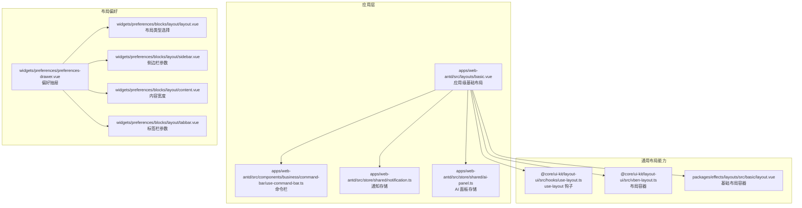
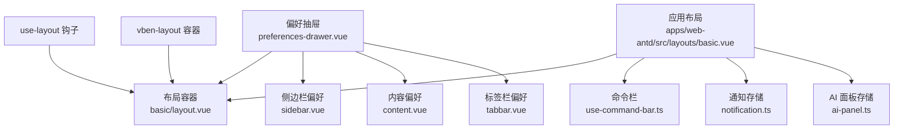
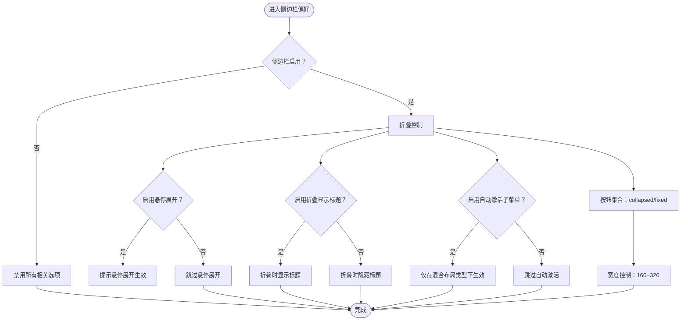
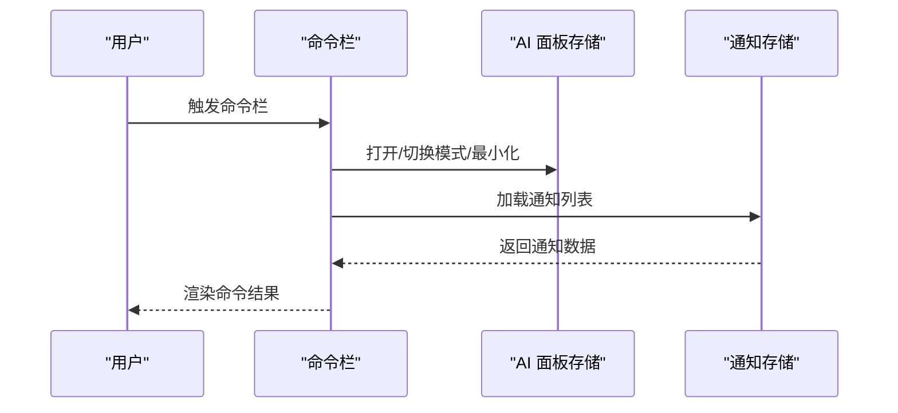
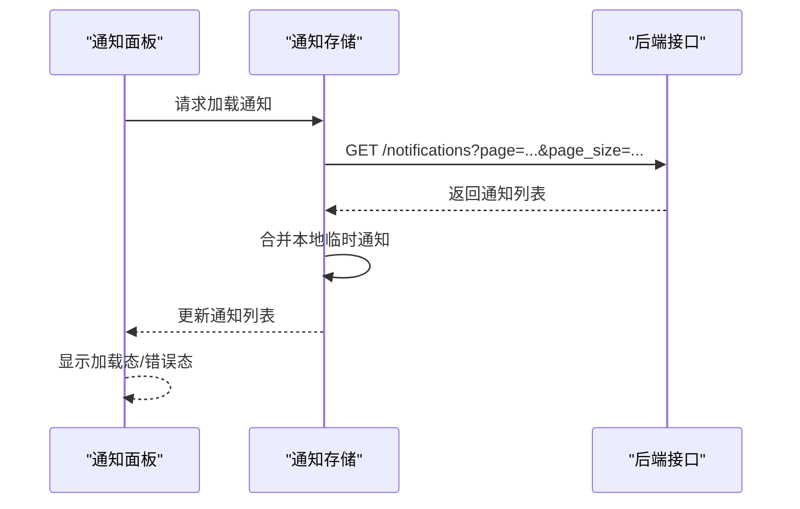
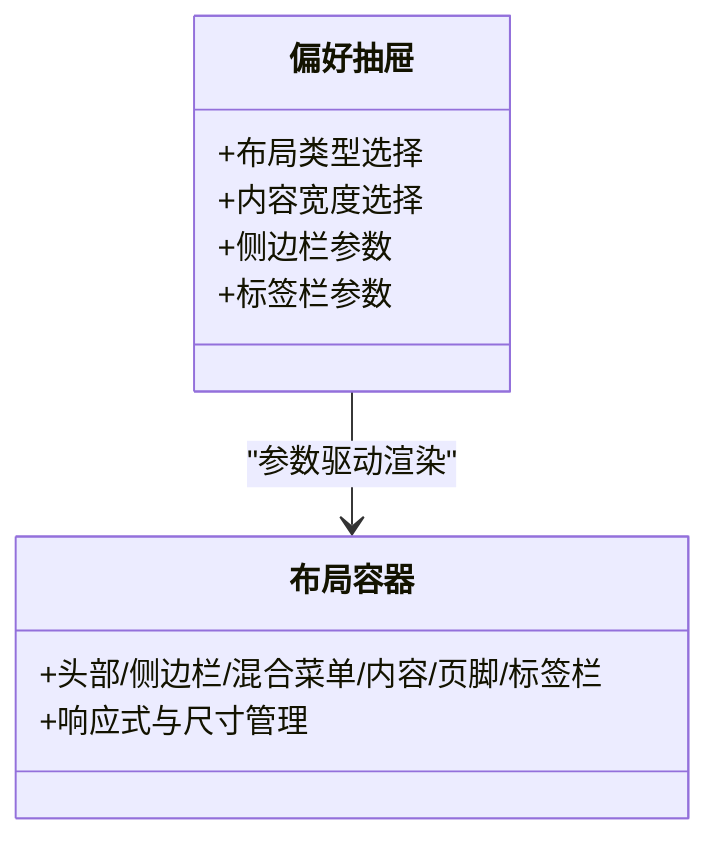
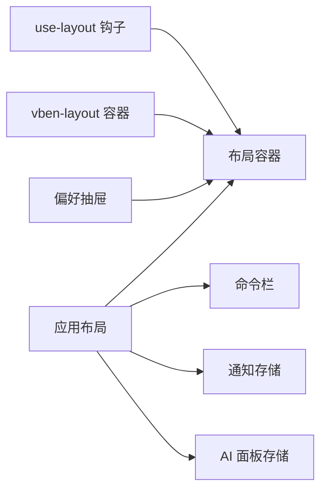

# 布局组件

<cite>
**本文引用的文件**
- [basic/layout.vue](file://frontend/packages/effects/layouts/src/basic/layout.vue)
- [sidebar.vue](file://frontend/packages/effects/layouts/src/widgets/preferences/blocks/layout/sidebar.vue)
- [layout.vue（布局偏好）](file://frontend/packages/effects/layouts/src/widgets/preferences/blocks/layout/layout.vue)
- [content.vue](file://frontend/packages/effects/layouts/src/widgets/preferences/blocks/layout/content.vue)
- [tabbar.vue](file://frontend/packages/effects/layouts/src/widgets/preferences/blocks/layout/tabbar.vue)
- [preferences-drawer.vue](file://frontend/packages/effects/layouts/src/widgets/preferences/preferences-drawer.vue)
- [use-layout.ts](file://frontend/packages/@core/ui-kit/layout-ui/src/hooks/use-layout.ts)
- [vben-layout.ts](file://frontend/packages/@core/ui-kit/layout-ui/src/vben-layout.ts)
- [basic.vue（应用布局）](file://frontend/apps/web-antd/src/layouts/basic.vue)
- [notification.ts](file://frontend/apps/web-antd/src/store/shared/notification.ts)
- [ai-panel.ts](file://frontend/apps/web-antd/src/store/shared/ai-panel.ts)
- [use-command-bar.ts](file://frontend/apps/web-antd/src/components/business/command-bar/use-command-bar.ts)
</cite>

## 目录
1. [简介](#简介)
2. [项目结构](#项目结构)
3. [核心组件](#核心组件)
4. [架构总览](#架构总览)
5. [组件详解](#组件详解)
6. [依赖关系分析](#依赖关系分析)
7. [性能考量](#性能考量)
8. [故障排查指南](#故障排查指南)
9. [结论](#结论)
10. [附录](#附录)

## 简介
本技术文档聚焦于布局组件模块，系统性阐述侧边栏面板、命令栏、通知面板等布局相关组件的设计架构与实现要点。内容覆盖响应式设计、尺寸调整与位置管理、嵌套模式与层级管理、视觉层次、性能优化、动画与交互体验，以及复杂布局场景下的组件协调与状态同步。

## 项目结构
布局体系由“应用层布局”和“布局偏好配置”两部分构成：
- 应用层布局：在应用入口处统一装配基础布局容器、菜单、页脚、页头、标签栏等，并挂载命令栏、AI 聊天侧栏、通知面板等业务插件。
- 布局偏好配置：通过偏好抽屉提供布局类型、内容宽度、侧边栏参数、标签栏行为等可调参数，驱动布局运行时行为。

**图表来源**
- [basic.vue（应用布局）:616-659](file://frontend/apps/web-antd/src/layouts/basic.vue#L616-L659)
- [use-layout.ts](file://frontend/packages/@core/ui-kit/layout-ui/src/hooks/use-layout.ts)
- [vben-layout.ts](file://frontend/packages/@core/ui-kit/layout-ui/src/vben-layout.ts)
- [basic/layout.vue:234-416](file://frontend/packages/effects/layouts/src/basic/layout.vue#L234-L416)
- [preferences-drawer.vue:359-367](file://frontend/packages/effects/layouts/src/widgets/preferences/preferences-drawer.vue#L359-L367)
- [layout.vue（布局偏好）:1-86](file://frontend/packages/effects/layouts/src/widgets/preferences/blocks/layout/layout.vue#L1-L86)
- [sidebar.vue:1-100](file://frontend/packages/effects/layouts/src/widgets/preferences/blocks/layout/sidebar.vue#L1-L100)
- [content.vue:1-53](file://frontend/packages/effects/layouts/src/widgets/preferences/blocks/layout/content.vue#L1-L53)
- [tabbar.vue:52-94](file://frontend/packages/effects/layouts/src/widgets/preferences/blocks/layout/tabbar.vue#L52-L94)

**章节来源**
- [basic/layout.vue:234-416](file://frontend/packages/effects/layouts/src/basic/layout.vue#L234-L416)
- [preferences-drawer.vue:359-367](file://frontend/packages/effects/layouts/src/widgets/preferences/preferences-drawer.vue#L359-L367)

## 核心组件
- 基础布局容器：封装头部、侧边栏、混合菜单、内容区、页脚、标签栏等区域，支持多种布局类型切换与响应式行为。
- 侧边栏面板：控制可见性、折叠、悬停展开、标题显示、自动激活子菜单、按钮固定/折叠等。
- 命令栏：全局快捷入口，支持聊天开关、菜单过滤、提交与会话选择回调。
- 通知面板：异步加载通知列表、合并本地临时通知、错误兜底与加载态管理。
- AI 聊天侧栏：面板模式切换、最小化/恢复、全屏模式、消息队列与交互确认。
- 布局偏好抽屉：统一配置布局类型、内容宽度、侧边栏参数、标签栏行为等。

**章节来源**
- [basic/layout.vue:234-416](file://frontend/packages/effects/layouts/src/basic/layout.vue#L234-L416)
- [sidebar.vue:1-100](file://frontend/packages/effects/layouts/src/widgets/preferences/blocks/layout/sidebar.vue#L1-L100)
- [use-command-bar.ts](file://frontend/apps/web-antd/src/components/business/command-bar/use-command-bar.ts)
- [notification.ts:183-220](file://frontend/apps/web-antd/src/store/shared/notification.ts#L183-L220)
- [ai-panel.ts:339-378](file://frontend/apps/web-antd/src/store/shared/ai-panel.ts#L339-L378)
- [preferences-drawer.vue:359-367](file://frontend/packages/effects/layouts/src/widgets/preferences/preferences-drawer.vue#L359-L367)

## 架构总览
布局组件采用“容器-偏好-应用层”的分层架构：
- 容器层：提供布局骨架与渲染插槽，绑定主题、尺寸、模式等属性。
- 偏好层：通过抽屉集中管理布局参数，参数变化驱动容器层实时更新。
- 应用层：在路由根组件中装配容器与业务插件，处理事件回调与状态联动。

**图表来源**
- [preferences-drawer.vue:359-367](file://frontend/packages/effects/layouts/src/widgets/preferences/preferences-drawer.vue#L359-L367)
- [basic/layout.vue:234-416](file://frontend/packages/effects/layouts/src/basic/layout.vue#L234-L416)
- [sidebar.vue:1-100](file://frontend/packages/effects/layouts/src/widgets/preferences/blocks/layout/sidebar.vue#L1-L100)
- [content.vue:1-53](file://frontend/packages/effects/layouts/src/widgets/preferences/blocks/layout/content.vue#L1-L53)
- [tabbar.vue:52-94](file://frontend/packages/effects/layouts/src/widgets/preferences/blocks/layout/tabbar.vue#L52-L94)
- [basic.vue（应用布局）:616-659](file://frontend/apps/web-antd/src/layouts/basic.vue#L616-L659)
- [use-layout.ts](file://frontend/packages/@core/ui-kit/layout-ui/src/hooks/use-layout.ts)
- [vben-layout.ts](file://frontend/packages/@core/ui-kit/layout-ui/src/vben-layout.ts)

## 组件详解

### 侧边栏面板
- 功能点
  - 可见性与折叠：支持显隐、折叠、悬停展开、折叠时是否显示标题。
  - 自动激活子菜单：在特定布局类型下启用，提升导航连贯性。
  - 按钮行为：支持“折叠按钮”“固定按钮”的组合，影响工具条交互。
  - 尺寸调整：宽度范围约束，确保在不同屏幕下的可用性。
- 关键参数
  - enable/collapsed/expandOnHover/collapsedShowTitle/autoActivateChild/buttons/fixed/collapsedButton/width
- 响应式与层级
  - 折叠状态下通过 hover 展开提升移动端体验；按钮固定保证交互稳定性。
- 性能与交互
  - 使用模型双向绑定减少重渲染；按钮集合初始化在挂载阶段完成，避免重复计算。

**图表来源**
- [sidebar.vue:1-100](file://frontend/packages/effects/layouts/src/widgets/preferences/blocks/layout/sidebar.vue#L1-L100)

**章节来源**
- [sidebar.vue:1-100](file://frontend/packages/effects/layouts/src/widgets/preferences/blocks/layout/sidebar.vue#L1-L100)

### 命令栏
- 功能点
  - 全局快捷入口，支持聊天开关、菜单过滤、提交回调、会话选择回调。
  - 与应用布局模板插槽集成，按需渲染。
- 协作关系
  - 与 AI 面板存储协同，支持打开/关闭、切换模式、最小化/恢复等。
  - 与通知存储协作，支持从通知面板触发命令栏并回填上下文。

**图表来源**
- [use-command-bar.ts](file://frontend/apps/web-antd/src/components/business/command-bar/use-command-bar.ts)
- [ai-panel.ts:339-378](file://frontend/apps/web-antd/src/store/shared/ai-panel.ts#L339-L378)
- [notification.ts:183-220](file://frontend/apps/web-antd/src/store/shared/notification.ts#L183-L220)

**章节来源**
- [basic.vue（应用布局）:616-659](file://frontend/apps/web-antd/src/layouts/basic.vue#L616-L659)
- [use-command-bar.ts](file://frontend/apps/web-antd/src/components/business/command-bar/use-command-bar.ts)
- [notification.ts:183-220](file://frontend/apps/web-antd/src/store/shared/notification.ts#L183-L220)
- [ai-panel.ts:339-378](file://frontend/apps/web-antd/src/store/shared/ai-panel.ts#L339-L378)

### 通知面板
- 功能点
  - 异步加载通知列表，支持分类筛选、分页加载。
  - 合并本地临时通知（负 ID 表示未持久化推送），保证实时性与一致性。
  - 错误兜底与加载态管理，提升稳定性。
- 状态同步
  - 与应用布局模板插槽集成，通过 store 管理状态，避免跨组件重复请求。

**图表来源**
- [notification.ts:183-220](file://frontend/apps/web-antd/src/store/shared/notification.ts#L183-L220)

**章节来源**
- [notification.ts:183-220](file://frontend/apps/web-antd/src/store/shared/notification.ts#L183-L220)

### 布局偏好抽屉与参数联动
- 布局类型：支持侧边栏导航、双列侧边栏、水平头部、头部侧边栏、混合菜单、头部混合、全内容等。
- 内容宽度：宽/紧凑两种模式，图标化预设展示。
- 标签栏：可配置启用、持久化、最大数量、拖拽、滚轮切换、中键关闭、图标显示、更多按钮、最大化按钮、样式类型。
- 参数联动
  - 偏好抽屉通过 v-model 将参数写入布局容器，容器根据参数渲染对应区域与行为。
  - 在“全内容”布局下禁用导航相关设置，避免无效配置。

**图表来源**
- [preferences-drawer.vue:359-367](file://frontend/packages/effects/layouts/src/widgets/preferences/preferences-drawer.vue#L359-L367)
- [layout.vue（布局偏好）:1-86](file://frontend/packages/effects/layouts/src/widgets/preferences/blocks/layout/layout.vue#L1-L86)
- [content.vue:1-53](file://frontend/packages/effects/layouts/src/widgets/preferences/blocks/layout/content.vue#L1-L53)
- [tabbar.vue:52-94](file://frontend/packages/effects/layouts/src/widgets/preferences/blocks/layout/tabbar.vue#L52-L94)
- [basic/layout.vue:234-416](file://frontend/packages/effects/layouts/src/basic/layout.vue#L234-L416)

**章节来源**
- [preferences-drawer.vue:359-367](file://frontend/packages/effects/layouts/src/widgets/preferences/preferences-drawer.vue#L359-L367)
- [layout.vue（布局偏好）:1-86](file://frontend/packages/effects/layouts/src/widgets/preferences/blocks/layout/layout.vue#L1-L86)
- [content.vue:1-53](file://frontend/packages/effects/layouts/src/widgets/preferences/blocks/layout/content.vue#L1-L53)
- [tabbar.vue:52-94](file://frontend/packages/effects/layouts/src/widgets/preferences/blocks/layout/tabbar.vue#L52-L94)

## 依赖关系分析
- 容器与钩子
  - use-layout 钩子为布局容器提供响应式尺寸与模式管理，降低容器内部复杂度。
  - vben-layout 容器作为统一布局骨架，承载头部、侧边栏、内容等区域。
- 应用层与业务插件
  - 应用布局在模板中注入命令栏、AI 聊天侧栏、登录过期模态等插件，形成“容器+插件”的组合。
- 偏好与容器
  - 偏好抽屉将参数写入布局容器，容器根据参数决定渲染与行为，形成单向数据流。

**图表来源**
- [use-layout.ts](file://frontend/packages/@core/ui-kit/layout-ui/src/hooks/use-layout.ts)
- [vben-layout.ts](file://frontend/packages/@core/ui-kit/layout-ui/src/vben-layout.ts)
- [basic/layout.vue:234-416](file://frontend/packages/effects/layouts/src/basic/layout.vue#L234-L416)
- [basic.vue（应用布局）:616-659](file://frontend/apps/web-antd/src/layouts/basic.vue#L616-L659)

**章节来源**
- [use-layout.ts](file://frontend/packages/@core/ui-kit/layout-ui/src/hooks/use-layout.ts)
- [vben-layout.ts](file://frontend/packages/@core/ui-kit/layout-ui/src/vben-layout.ts)
- [basic/layout.vue:234-416](file://frontend/packages/effects/layouts/src/basic/layout.vue#L234-L416)
- [basic.vue（应用布局）:616-659](file://frontend/apps/web-antd/src/layouts/basic.vue#L616-L659)

## 性能考量
- 渲染优化
  - 使用 v-model 双向绑定减少不必要的 props 传递；在挂载阶段初始化按钮集合，避免重复计算。
  - 偏好抽屉集中管理参数，容器按需渲染，避免多处状态分散导致的重绘。
- 数据加载
  - 通知列表分页加载，首屏保留本地临时通知，提升感知速度与一致性。
  - 加载态与错误兜底，避免界面空白或异常闪烁。
- 交互体验
  - 折叠时悬停展开、按钮固定等策略，兼顾移动端与桌面端体验。
  - 标签栏可配置滚轮切换、拖拽排序等，满足高并发多任务场景。

[本节为通用指导，无需具体文件分析]

## 故障排查指南
- 通知加载失败
  - 现象：通知面板长时间处于加载态或报错。
  - 排查：检查 API 前缀是否正确、网络请求是否被拦截、后端返回格式是否符合预期。
  - 参考路径：[notification.ts:183-220](file://frontend/apps/web-antd/src/store/shared/notification.ts#L183-L220)
- 命令栏无响应
  - 现象：触发命令栏无输出或报错。
  - 排查：确认命令栏引用是否正确、回调函数是否绑定、聊天开关状态是否开启。
  - 参考路径：[basic.vue（应用布局）:616-659](file://frontend/apps/web-antd/src/layouts/basic.vue#L616-L659)、[use-command-bar.ts](file://frontend/apps/web-antd/src/components/business/command-bar/use-command-bar.ts)
- 侧边栏参数不生效
  - 现象：修改侧边栏宽度或按钮行为后未生效。
  - 排查：确认偏好抽屉参数已写入布局容器、布局类型是否支持该参数、组件是否重新渲染。
  - 参考路径：[sidebar.vue:1-100](file://frontend/packages/effects/layouts/src/widgets/preferences/blocks/layout/sidebar.vue#L1-L100)、[basic/layout.vue:234-416](file://frontend/packages/effects/layouts/src/basic/layout.vue#L234-L416)

**章节来源**
- [notification.ts:183-220](file://frontend/apps/web-antd/src/store/shared/notification.ts#L183-L220)
- [basic.vue（应用布局）:616-659](file://frontend/apps/web-antd/src/layouts/basic.vue#L616-L659)
- [use-command-bar.ts](file://frontend/apps/web-antd/src/components/business/command-bar/use-command-bar.ts)
- [sidebar.vue:1-100](file://frontend/packages/effects/layouts/src/widgets/preferences/blocks/layout/sidebar.vue#L1-L100)
- [basic/layout.vue:234-416](file://frontend/packages/effects/layouts/src/basic/layout.vue#L234-L416)

## 结论
本布局组件模块通过“容器-偏好-应用层”的清晰分层，实现了布局类型的灵活切换、参数化的尺寸与位置管理、以及插件化的业务扩展。配合响应式设计与状态同步机制，能够在复杂场景下保持良好的性能与交互体验。建议在后续迭代中持续关注参数联动的一致性与边界条件的健壮性。

[本节为总结性内容，无需具体文件分析]

## 附录
- 关键参数速览
  - 布局类型：sidebar-nav、sidebar-mixed-nav、header-nav、header-sidebar-nav、mixed-nav、header-mixed-nav、full-content
  - 内容宽度：wide、compact
  - 侧边栏：enable、collapsed、expandOnHover、collapsedShowTitle、autoActivateChild、buttons[collapsed/fixed]、width
  - 标签栏：enable、persist、maxCount、draggable、wheelable、middleClickToClose、showIcon、showMore、showMaximize、styleType

[本节为概览性内容，无需具体文件分析]