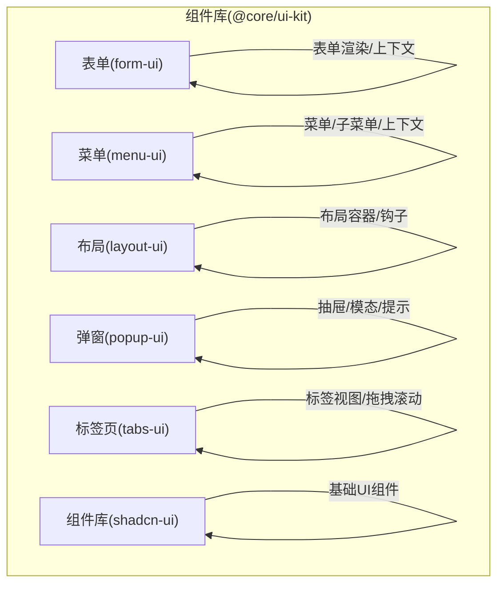
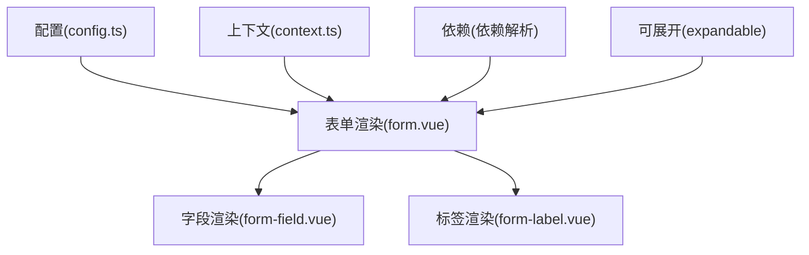
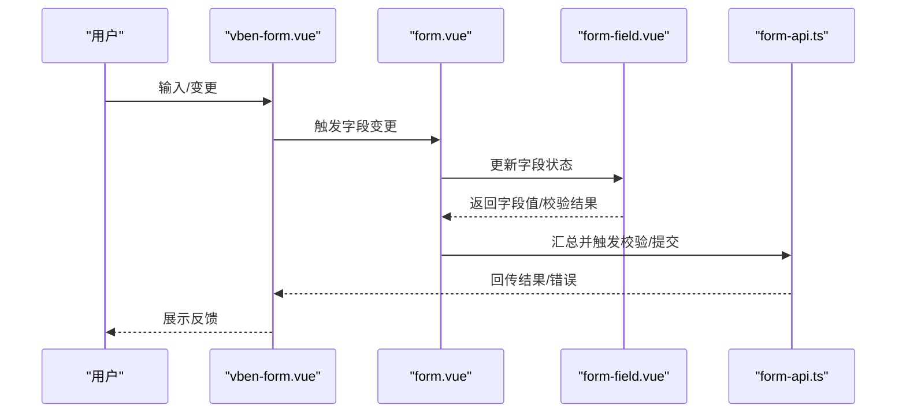
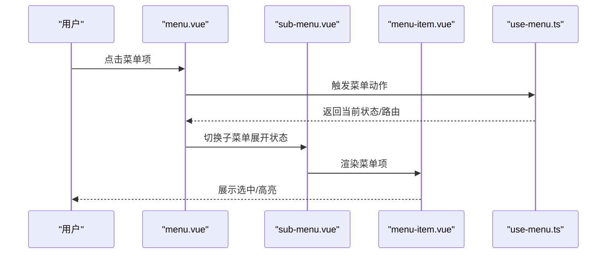
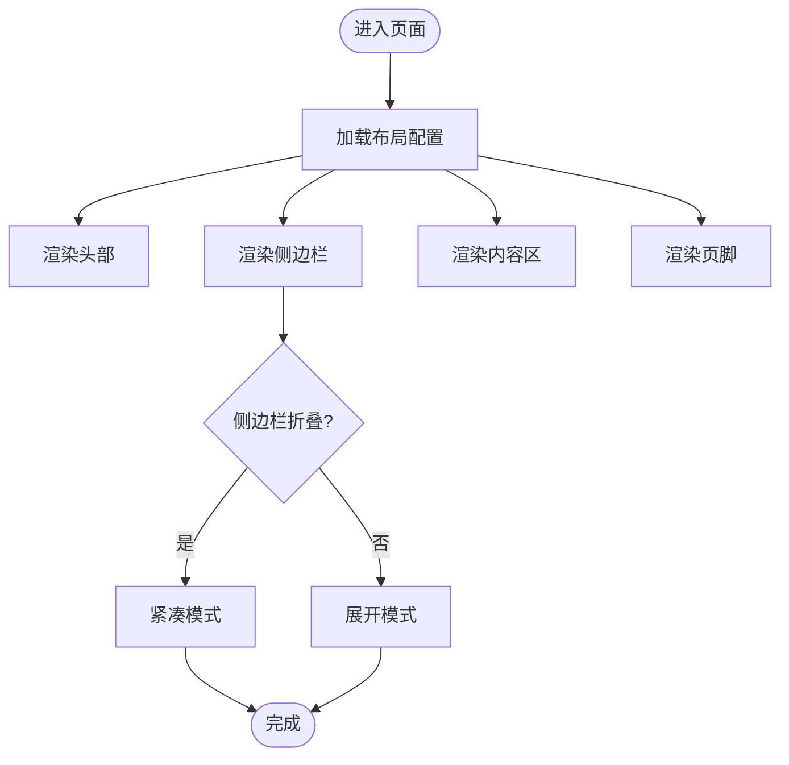
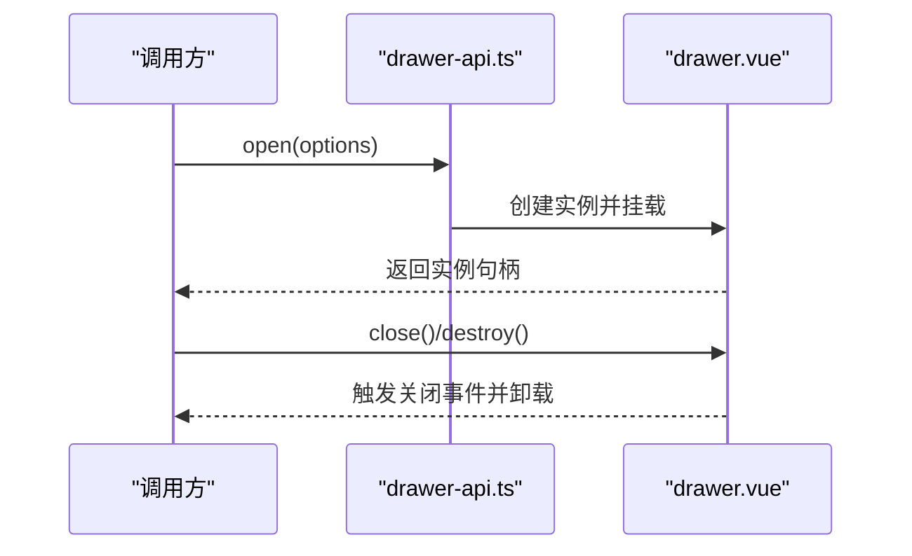
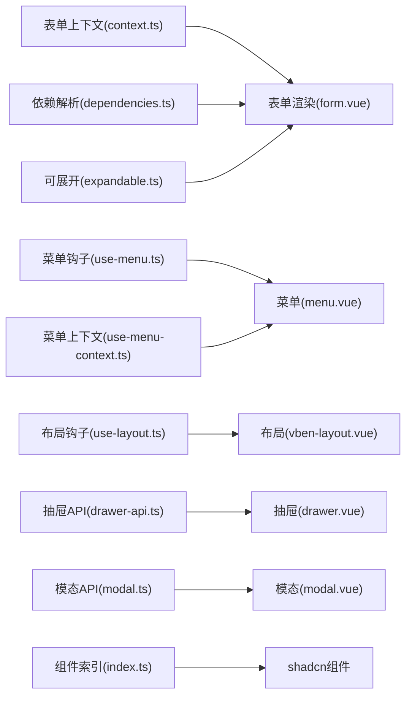

# 组件系统

<cite>
**本文引用的文件**
- [form.vue](file://frontend/packages/@core/ui-kit/form-ui/src/form-render/form.vue)
- [vben-form.vue](file://frontend/packages/@core/ui-kit/form-ui/src/vben-form.vue)
- [use-vben-form.vue](file://frontend/packages/@core/ui-kit/form-ui/src/use-vben-form.vue)
- [form-field.vue](file://frontend/packages/@core/ui-kit/form-ui/src/form-render/form-field.vue)
- [form-label.vue](file://frontend/packages/@core/ui-kit/form-ui/src/form-render/form-label.vue)
- [context.ts](file://frontend/packages/@core/ui-kit/form-ui/src/form-render/context.ts)
- [dependencies.ts](file://frontend/packages/@core/ui-kit/form-ui/src/form-render/dependencies.ts)
- [expandable.ts](file://frontend/packages/@core/ui-kit/form-ui/src/form-render/expandable.ts)
- [config.ts](file://frontend/packages/@core/ui-kit/form-ui/src/config.ts)
- [types.ts](file://frontend/packages/@core/ui-kit/form-ui/src/types.ts)
- [form-api.ts](file://frontend/packages/@core/ui-kit/form-ui/src/form-api.ts)
- [index.ts](file://frontend/packages/@core/ui-kit/form-ui/src/index.ts)
- [menu.vue](file://frontend/packages/@core/ui-kit/menu-ui/src/menu.vue)
- [sub-menu.vue](file://frontend/packages/@core/ui-kit/menu-ui/src/sub-menu.vue)
- [menu-item.vue](file://frontend/packages/@core/ui-kit/menu-ui/src/components/menu-item.vue)
- [use-menu.ts](file://frontend/packages/@core/ui-kit/menu-ui/src/hooks/use-menu.ts)
- [use-menu-context.ts](file://frontend/packages/@core/ui-kit/menu-ui/src/hooks/use-menu-context.ts)
- [vben-layout.vue](file://frontend/packages/@core/ui-kit/layout-ui/src/vben-layout.vue)
- [layout-header.vue](file://frontend/packages/@core/ui-kit/layout-ui/src/components/layout-header.vue)
- [layout-sidebar.vue](file://frontend/packages/@core/ui-kit/layout-ui/src/components/layout-sidebar.vue)
- [layout-content.vue](file://frontend/packages/@core/ui-kit/layout-ui/src/components/layout-content.vue)
- [layout-footer.vue](file://frontend/packages/@core/ui-kit/layout-ui/src/components/layout-footer.vue)
- [use-layout.ts](file://frontend/packages/@core/ui-kit/layout-ui/src/hooks/use-layout.ts)
- [drawer.vue](file://frontend/packages/@core/ui-kit/popup-ui/src/drawer/drawer.vue)
- [modal.vue](file://frontend/packages/@core/ui-kit/popup-ui/src/modal/modal.vue)
- [alert.vue](file://frontend/packages/@core/ui-kit/popup-ui/src/alert/alert.vue)
- [tabs-view.vue](file://frontend/packages/@core/ui-kit/tabs-ui/src/tabs-view.vue)
- [button.vue](file://frontend/packages/@core/ui-kit/shadcn-ui/src/components/button/button.vue)
- [input.vue](file://frontend/packages/@core/ui-kit/shadcn-ui/src/ui/input/Input.vue)
- [select.vue](file://frontend/packages/@core/ui-kit/shadcn-ui/src/ui/select/Select.vue)
- [dialog.vue](file://frontend/packages/@core/ui-kit/shadcn-ui/src/ui/dialog/Dialog.vue)
- [avatar.vue](file://frontend/packages/@core/ui-kit/shadcn-ui/src/components/avatar/avatar.vue)
- [breadcrumb.vue](file://frontend/packages/@core/ui-kit/shadcn-ui/src/components/breadcrumb/breadcrumb.vue)
- [tooltip.vue](file://frontend/packages/@core/ui-kit/shadcn-ui/src/components/tooltip/tooltip.vue)
- [back-top.vue](file://frontend/packages/@core/ui-kit/shadcn-ui/src/components/back-top/back-top.vue)
- [index.ts](file://frontend/packages/@core/ui-kit/shadcn-ui/src/index.ts)
</cite>

## 目录
1. [引言](#引言)
2. [项目结构](#项目结构)
3. [核心组件](#核心组件)
4. [架构总览](#架构总览)
5. [详细组件分析](#详细组件分析)
6. [依赖分析](#依赖分析)
7. [性能考虑](#性能考虑)
8. [故障排查指南](#故障排查指南)
9. [结论](#结论)
10. [附录](#附录)

## 引言
本文件面向Vue.js组件系统，聚焦于业务组件设计模式、通用组件实现与组件库组织结构，系统性文档化属性传递、事件处理与插槽使用方式，并总结组件复用策略、封装原则与性能优化要点。同时覆盖UI适配器组件、表单组件与表格组件（以表单渲染为核心）的设计实现，提供开发规范、测试策略与文档编写指南。

## 项目结构
组件系统位于前端工程的包管理目录下，采用多包（monorepo）组织形式，核心组件库集中于@core/ui-kit，按功能域拆分为表单、菜单、布局、弹窗、标签页与shadcn风格组件等子模块。各子模块均提供独立的构建配置与样式体系，便于按需引入与主题定制。

图表来源
- [index.ts](file://frontend/packages/@core/ui-kit/form-ui/src/index.ts)
- [index.ts](file://frontend/packages/@core/ui-kit/menu-ui/src/index.ts)
- [index.ts](file://frontend/packages/@core/ui-kit/layout-ui/src/index.ts)
- [index.ts](file://frontend/packages/@core/ui-kit/popup-ui/src/index.ts)
- [index.ts](file://frontend/packages/@core/ui-kit/tabs-ui/src/index.ts)
- [index.ts](file://frontend/packages/@core/ui-kit/shadcn-ui/src/index.ts)

章节来源
- [index.ts](file://frontend/packages/@core/ui-kit/form-ui/src/index.ts)
- [index.ts](file://frontend/packages/@core/ui-kit/menu-ui/src/index.ts)
- [index.ts](file://frontend/packages/@core/ui-kit/layout-ui/src/index.ts)
- [index.ts](file://frontend/packages/@core/ui-kit/popup-ui/src/index.ts)
- [index.ts](file://frontend/packages/@core/ui-kit/tabs-ui/src/index.ts)
- [index.ts](file://frontend/packages/@core/ui-kit/shadcn-ui/src/index.ts)

## 核心组件
- 表单组件：提供声明式表单配置、字段渲染、依赖联动与校验集成，支持上下文注入与API封装。
- 菜单组件：提供导航菜单、子菜单、徽标与滚动控制，配合上下文钩子实现状态管理。
- 布局组件：提供头部、侧边栏、内容区、页脚与标签栏的组合布局，内置布局状态钩子。
- 弹窗组件：提供抽屉、模态框与告警的API与组件形态，统一入口与生命周期管理。
- 标签页组件：提供标签视图、拖拽与滚动控制，支持多标签页场景。
- shadcn风格组件：提供按钮、输入、选择、对话框、头像、面包屑、提示等基础UI组件，遵循原子化设计。

章节来源
- [vben-form.vue](file://frontend/packages/@core/ui-kit/form-ui/src/vben-form.vue)
- [menu.vue](file://frontend/packages/@core/ui-kit/menu-ui/src/menu.vue)
- [vben-layout.vue](file://frontend/packages/@core/ui-kit/layout-ui/src/vben-layout.vue)
- [drawer.vue](file://frontend/packages/@core/ui-kit/popup-ui/src/drawer/drawer.vue)
- [modal.vue](file://frontend/packages/@core/ui-kit/popup-ui/src/modal/modal.vue)
- [tabs-view.vue](file://frontend/packages/@core/ui-kit/tabs-ui/src/tabs-view.vue)
- [button.vue](file://frontend/packages/@core/ui-kit/shadcn-ui/src/components/button/button.vue)

## 架构总览
组件库采用“配置驱动 + 渲染管线 + 上下文/钩子”的分层架构：
- 配置层：通过配置对象描述表单字段、布局与行为。
- 渲染层：根据配置动态生成字段、标签与辅助信息。
- 上下文层：提供全局或局部状态共享与依赖解析。
- 钩子层：封装布局、菜单等交互逻辑，降低组件耦合。
- 组合层：以组件组合实现复杂页面，如布局容器内嵌菜单与内容区。

图表来源
- [config.ts](file://frontend/packages/@core/ui-kit/form-ui/src/config.ts)
- [context.ts](file://frontend/packages/@core/ui-kit/form-ui/src/form-render/context.ts)
- [dependencies.ts](file://frontend/packages/@core/ui-kit/form-ui/src/form-render/dependencies.ts)
- [expandable.ts](file://frontend/packages/@core/ui-kit/form-ui/src/form-render/expandable.ts)
- [form.vue](file://frontend/packages/@core/ui-kit/form-ui/src/form-render/form.vue)
- [form-field.vue](file://frontend/packages/@core/ui-kit/form-ui/src/form-render/form-field.vue)
- [form-label.vue](file://frontend/packages/@core/ui-kit/form-ui/src/form-render/form-label.vue)

## 详细组件分析

### 表单组件（form-ui）
- 设计模式
  - 配置驱动：通过配置对象定义字段类型、校验规则、布局与依赖关系。
  - 渲染管线：将配置映射到具体字段组件，统一处理标签、帮助文本与错误展示。
  - 上下文注入：通过provide/inject在渲染树中传递表单上下文，支持跨层级依赖。
  - 可扩展：提供依赖解析与可展开逻辑，支持动态显示/隐藏与联动更新。
- 属性传递
  - 外部传入：表单配置、初始值、禁用状态、只读状态等。
  - 内部传递：字段级props由渲染层向下传递，保持单一职责。
- 事件处理
  - 字段级事件：如输入、变更、失焦等，统一汇聚至表单API。
  - 表单级事件：提交、重置、校验结果等，通过回调或事件总线暴露。
- 插槽使用
  - 字段插槽：允许自定义字段渲染内容。
  - 助手/标签插槽：用于扩展标签文案或帮助信息。
- 复用策略
  - 将通用逻辑下沉至渲染层与上下文层，减少重复实现。
  - 通过API封装统一对外接口，提升可测试性与可维护性。
- 性能优化
  - 按需渲染：仅渲染可见字段，避免一次性渲染大量控件。
  - 依赖追踪：基于依赖解析最小化重渲染范围。
  - 缓存策略：对静态配置与计算结果进行缓存。

图表来源
- [vben-form.vue](file://frontend/packages/@core/ui-kit/form-ui/src/vben-form.vue)
- [form.vue](file://frontend/packages/@core/ui-kit/form-ui/src/form-render/form.vue)
- [form-field.vue](file://frontend/packages/@core/ui-kit/form-ui/src/form-render/form-field.vue)
- [form-api.ts](file://frontend/packages/@core/ui-kit/form-ui/src/form-api.ts)

章节来源
- [vben-form.vue](file://frontend/packages/@core/ui-kit/form-ui/src/vben-form.vue)
- [use-vben-form.vue](file://frontend/packages/@core/ui-kit/form-ui/src/use-vben-form.vue)
- [form.vue](file://frontend/packages/@core/ui-kit/form-ui/src/form-render/form.vue)
- [form-field.vue](file://frontend/packages/@core/ui-kit/form-ui/src/form-render/form-field.vue)
- [form-label.vue](file://frontend/packages/@core/ui-kit/form-ui/src/form-render/form-label.vue)
- [context.ts](file://frontend/packages/@core/ui-kit/form-ui/src/form-render/context.ts)
- [dependencies.ts](file://frontend/packages/@core/ui-kit/form-ui/src/form-render/dependencies.ts)
- [expandable.ts](file://frontend/packages/@core/ui-kit/form-ui/src/form-render/expandable.ts)
- [config.ts](file://frontend/packages/@core/ui-kit/form-ui/src/config.ts)
- [types.ts](file://frontend/packages/@core/ui-kit/form-ui/src/types.ts)
- [form-api.ts](file://frontend/packages/@core/ui-kit/form-ui/src/form-api.ts)

### 菜单组件（menu-ui）
- 设计模式
  - 组合组件：菜单、子菜单、菜单项等组件协同工作，形成导航树。
  - 上下文钩子：通过use-menu与use-menu-context提供状态与行为抽象。
  - 可访问性：支持键盘导航与焦点管理。
- 属性传递
  - 菜单项：路由、图标、徽标、权限标识等。
  - 子菜单：折叠/展开状态、动画过渡等。
- 事件处理
  - 点击事件：路由跳转、展开/收起、选中状态切换。
  - 滚动事件：菜单滚动定位与可视区域管理。
- 插槽使用
  - 图标插槽：自定义菜单项图标。
  - 徽标插槽：自定义徽标内容与样式。
- 复用策略
  - 将状态逻辑抽取为钩子，组件仅负责渲染。
  - 提供统一的菜单类型与工具函数，便于扩展新菜单变体。
- 性能优化
  - 虚拟滚动：长列表菜单采用虚拟化策略。
  - 懒加载：子菜单按需渲染，减少初始开销。

图表来源
- [menu.vue](file://frontend/packages/@core/ui-kit/menu-ui/src/menu.vue)
- [sub-menu.vue](file://frontend/packages/@core/ui-kit/menu-ui/src/sub-menu.vue)
- [menu-item.vue](file://frontend/packages/@core/ui-kit/menu-ui/src/components/menu-item.vue)
- [use-menu.ts](file://frontend/packages/@core/ui-kit/menu-ui/src/hooks/use-menu.ts)
- [use-menu-context.ts](file://frontend/packages/@core/ui-kit/menu-ui/src/hooks/use-menu-context.ts)

章节来源
- [menu.vue](file://frontend/packages/@core/ui-kit/menu-ui/src/menu.vue)
- [sub-menu.vue](file://frontend/packages/@core/ui-kit/menu-ui/src/sub-menu.vue)
- [menu-item.vue](file://frontend/packages/@core/ui-kit/menu-ui/src/components/menu-item.vue)
- [use-menu.ts](file://frontend/packages/@core/ui-kit/menu-ui/src/hooks/use-menu.ts)
- [use-menu-context.ts](file://frontend/packages/@core/ui-kit/menu-ui/src/hooks/use-menu-context.ts)

### 布局组件（layout-ui）
- 设计模式
  - 容器组件：提供头部、侧边栏、内容区、页脚与标签栏的组合布局。
  - 响应式：根据屏幕尺寸与断点调整布局结构。
  - 主题适配：通过CSS变量与主题配置实现统一风格。
- 属性传递
  - 布局开关：侧边栏折叠、标签栏显隐、内容区滚动等。
  - 主题参数：颜色、字体、间距等。
- 事件处理
  - 布局变更：折叠/展开、切换主题、切换语言等。
  - 交互事件：滚动、点击、键盘快捷键等。
- 插槽使用
  - 自定义头部/侧边栏/页脚内容。
  - 标签栏插槽：自定义标签项渲染。
- 复用策略
  - 将布局状态与行为抽取为钩子，组件仅负责布局结构。
  - 提供布局API，统一管理布局状态与主题切换。
- 性能优化
  - 条件渲染：根据断点与权限条件渲染布局元素。
  - 懒加载：侧边栏与标签栏内容按需加载。

图表来源
- [vben-layout.vue](file://frontend/packages/@core/ui-kit/layout-ui/src/vben-layout.vue)
- [layout-header.vue](file://frontend/packages/@core/ui-kit/layout-ui/src/components/layout-header.vue)
- [layout-sidebar.vue](file://frontend/packages/@core/ui-kit/layout-ui/src/components/layout-sidebar.vue)
- [layout-content.vue](file://frontend/packages/@core/ui-kit/layout-ui/src/components/layout-content.vue)
- [layout-footer.vue](file://frontend/packages/@core/ui-kit/layout-ui/src/components/layout-footer.vue)
- [use-layout.ts](file://frontend/packages/@core/ui-kit/layout-ui/src/hooks/use-layout.ts)

章节来源
- [vben-layout.vue](file://frontend/packages/@core/ui-kit/layout-ui/src/vben-layout.vue)
- [layout-header.vue](file://frontend/packages/@core/ui-kit/layout-ui/src/components/layout-header.vue)
- [layout-sidebar.vue](file://frontend/packages/@core/ui-kit/layout-ui/src/components/layout-sidebar.vue)
- [layout-content.vue](file://frontend/packages/@core/ui-kit/layout-ui/src/components/layout-content.vue)
- [layout-footer.vue](file://frontend/packages/@core/ui-kit/layout-ui/src/components/layout-footer.vue)
- [use-layout.ts](file://frontend/packages/@core/ui-kit/layout-ui/src/hooks/use-layout.ts)

### 弹窗组件（popup-ui）
- 设计模式
  - API与组件双形态：提供API调用与组件直接渲染两种方式。
  - 生命周期管理：统一处理打开、关闭、销毁与遮罩层。
  - 可插拔：支持自定义内容、尺寸、动画与交互。
- 属性传递
  - 抽屉：标题、宽度、是否可拖拽、是否可遮罩关闭等。
  - 模态框：标题、尺寸、确认/取消按钮、是否可遮罩关闭等。
  - 告警：标题、内容、按钮文案与类型等。
- 事件处理
  - 打开/关闭事件：用于外部监听与副作用处理。
  - 确认/取消事件：表单类弹窗的提交流程。
- 插槽使用
  - 自定义内容插槽：允许传入任意内容。
  - 底部操作插槽：自定义底部按钮组。
- 复用策略
  - 使用API工厂统一创建与管理弹窗实例。
  - 提供通用的弹窗上下文，减少重复样板代码。
- 性能优化
  - 按需挂载：弹窗实例延迟挂载，减少初始DOM压力。
  - 销毁清理：确保关闭时清理事件与内存。

图表来源
- [drawer.vue](file://frontend/packages/@core/ui-kit/popup-ui/src/drawer/drawer.vue)
- [drawer-api.ts](file://frontend/packages/@core/ui-kit/popup-ui/src/drawer/drawer-api.ts)
- [modal.vue](file://frontend/packages/@core/ui-kit/popup-ui/src/modal/modal.vue)
- [modal.ts](file://frontend/packages/@core/ui-kit/popup-ui/src/modal/modal.ts)
- [alert.vue](file://frontend/packages/@core/ui-kit/popup-ui/src/alert/alert.vue)
- [alert.ts](file://frontend/packages/@core/ui-kit/popup-ui/src/alert/alert.ts)

章节来源
- [drawer.vue](file://frontend/packages/@core/ui-kit/popup-ui/src/drawer/drawer.vue)
- [drawer-api.ts](file://frontend/packages/@core/ui-kit/popup-ui/src/drawer/drawer-api.ts)
- [modal.vue](file://frontend/packages/@core/ui-kit/popup-ui/src/modal/modal.vue)
- [modal.ts](file://frontend/packages/@core/ui-kit/popup-ui/src/modal/modal.ts)
- [alert.vue](file://frontend/packages/@core/ui-kit/popup-ui/src/alert/alert.vue)
- [alert.ts](file://frontend/packages/@core/ui-kit/popup-ui/src/alert/alert.ts)

### 标签页组件（tabs-ui）
- 设计模式
  - 视图组件：提供标签视图与标签项渲染。
  - 拖拽与滚动：支持标签拖拽排序与滚动控制。
  - 工具钩子：提供拖拽与滚动的辅助逻辑。
- 属性传递
  - 标签数据：标题、唯一标识、可关闭、禁用等。
  - 视图配置：是否可拖拽、滚动步长、最大宽度等。
- 事件处理
  - 标签切换：激活标签变化。
  - 关闭标签：触发关闭回调。
  - 拖拽结束：触发排序回调。
- 插槽使用
  - 标签项插槽：自定义标签渲染。
  - 工具栏插槽：自定义工具按钮。
- 复用策略
  - 将拖拽与滚动逻辑抽取为独立钩子，组件仅负责渲染。
  - 提供标签视图API，统一管理标签集合与状态。
- 性能优化
  - 虚拟滚动：超长标签列表采用虚拟化。
  - 懒渲染：非激活标签延迟渲染其内容。

章节来源
- [tabs-view.vue](file://frontend/packages/@core/ui-kit/tabs-ui/src/tabs-view.vue)
- [use-tabs-drag.ts](file://frontend/packages/@core/ui-kit/tabs-ui/src/use-tabs-drag.ts)
- [use-tabs-view-scroll.ts](file://frontend/packages/@core/ui-kit/tabs-ui/src/use-tabs-view-scroll.ts)

### shadcn风格组件（shadcn-ui）
- 设计模式
  - 原子化组件：每个组件聚焦单一职责，易于组合。
  - 主题一致：通过设计令牌与样式变量保证视觉一致性。
  - 可扩展：提供组件变体与尺寸，满足多样化需求。
- 典型组件
  - 按钮：支持主次/危险/幽灵等变体与尺寸。
  - 输入：支持密码强度检测与可见性切换。
  - 选择：支持多选、搜索与清空。
  - 对话框：支持标题、描述、操作按钮与遮罩层。
  - 头像：支持占位与加载失败回退。
  - 面包屑：支持省略号与链接跳转。
  - 提示：支持帮助文本与悬停触发。
  - 回顶：支持滚动阈值与平滑回到顶部。
- 复用策略
  - 通过统一的组件索引导出，按需引入。
  - 提供组件类型与接口，便于扩展与替换。
- 性能优化
  - 组件懒加载：按需渲染与导入。
  - 样式隔离：避免全局污染，提升样式计算效率。

章节来源
- [button.vue](file://frontend/packages/@core/ui-kit/shadcn-ui/src/components/button/button.vue)
- [input.vue](file://frontend/packages/@core/ui-kit/shadcn-ui/src/ui/input/Input.vue)
- [select.vue](file://frontend/packages/@core/ui-kit/shadcn-ui/src/ui/select/Select.vue)
- [dialog.vue](file://frontend/packages/@core/ui-kit/shadcn-ui/src/ui/dialog/Dialog.vue)
- [avatar.vue](file://frontend/packages/@core/ui-kit/shadcn-ui/src/components/avatar/avatar.vue)
- [breadcrumb.vue](file://frontend/packages/@core/ui-kit/shadcn-ui/src/components/breadcrumb/breadcrumb.vue)
- [tooltip.vue](file://frontend/packages/@core/ui-kit/shadcn-ui/src/components/tooltip/tooltip.vue)
- [back-top.vue](file://frontend/packages/@core/ui-kit/shadcn-ui/src/components/back-top/back-top.vue)
- [index.ts](file://frontend/packages/@core/ui-kit/shadcn-ui/src/index.ts)

## 依赖分析
- 组件间依赖
  - 表单渲染依赖上下文、依赖解析与可展开逻辑。
  - 菜单组件依赖上下文钩子与工具函数。
  - 布局组件依赖布局钩子与主题配置。
  - 弹窗组件依赖API工厂与生命周期管理。
  - 标签页组件依赖拖拽与滚动钩子。
  - shadcn组件依赖设计令牌与样式变量。
- 外部依赖
  - Vue生态：Composition API、Provide/Inject、Teleport等。
  - 样式框架：Tailwind CSS与PostCSS。
  - 构建工具：Vite与打包配置。

图表来源
- [context.ts](file://frontend/packages/@core/ui-kit/form-ui/src/form-render/context.ts)
- [dependencies.ts](file://frontend/packages/@core/ui-kit/form-ui/src/form-render/dependencies.ts)
- [expandable.ts](file://frontend/packages/@core/ui-kit/form-ui/src/form-render/expandable.ts)
- [form.vue](file://frontend/packages/@core/ui-kit/form-ui/src/form-render/form.vue)
- [use-menu.ts](file://frontend/packages/@core/ui-kit/menu-ui/src/hooks/use-menu.ts)
- [use-menu-context.ts](file://frontend/packages/@core/ui-kit/menu-ui/src/hooks/use-menu-context.ts)
- [menu.vue](file://frontend/packages/@core/ui-kit/menu-ui/src/menu.vue)
- [use-layout.ts](file://frontend/packages/@core/ui-kit/layout-ui/src/hooks/use-layout.ts)
- [vben-layout.vue](file://frontend/packages/@core/ui-kit/layout-ui/src/vben-layout.vue)
- [drawer-api.ts](file://frontend/packages/@core/ui-kit/popup-ui/src/drawer/drawer-api.ts)
- [drawer.vue](file://frontend/packages/@core/ui-kit/popup-ui/src/drawer/drawer.vue)
- [modal.ts](file://frontend/packages/@core/ui-kit/popup-ui/src/modal/modal.ts)
- [modal.vue](file://frontend/packages/@core/ui-kit/popup-ui/src/modal/modal.vue)
- [index.ts](file://frontend/packages/@core/ui-kit/shadcn-ui/src/index.ts)

章节来源
- [context.ts](file://frontend/packages/@core/ui-kit/form-ui/src/form-render/context.ts)
- [dependencies.ts](file://frontend/packages/@core/ui-kit/form-ui/src/form-render/dependencies.ts)
- [expandable.ts](file://frontend/packages/@core/ui-kit/form-ui/src/form-render/expandable.ts)
- [form.vue](file://frontend/packages/@core/ui-kit/form-ui/src/form-render/form.vue)
- [use-menu.ts](file://frontend/packages/@core/ui-kit/menu-ui/src/hooks/use-menu.ts)
- [use-menu-context.ts](file://frontend/packages/@core/ui-kit/menu-ui/src/hooks/use-menu-context.ts)
- [menu.vue](file://frontend/packages/@core/ui-kit/menu-ui/src/menu.vue)
- [use-layout.ts](file://frontend/packages/@core/ui-kit/layout-ui/src/hooks/use-layout.ts)
- [vben-layout.vue](file://frontend/packages/@core/ui-kit/layout-ui/src/vben-layout.vue)
- [drawer-api.ts](file://frontend/packages/@core/ui-kit/popup-ui/src/drawer/drawer-api.ts)
- [drawer.vue](file://frontend/packages/@core/ui-kit/popup-ui/src/drawer/drawer.vue)
- [modal.ts](file://frontend/packages/@core/ui-kit/popup-ui/src/modal/modal.ts)
- [modal.vue](file://frontend/packages/@core/ui-kit/popup-ui/src/modal/modal.vue)
- [index.ts](file://frontend/packages/@core/ui-kit/shadcn-ui/src/index.ts)

## 性能考虑
- 渲染优化
  - 按需渲染：仅渲染可见字段与菜单项，减少DOM节点数量。
  - 虚拟化：长列表采用虚拟滚动，降低重排与重绘成本。
  - 缓存：对静态配置与计算结果进行缓存，避免重复计算。
- 事件与状态
  - 合理拆分状态：将布局、菜单与表单状态分离，避免全局状态风暴。
  - 防抖节流：对高频事件（如滚动、窗口大小变化）进行节流。
- 样式与主题
  - CSS变量：通过主题变量统一管理样式，减少样式切换成本。
  - Tailwind原子类：按需引入，避免样式冗余。
- 构建与打包
  - 组件懒加载：按需导入组件与API，减小首屏体积。
  - Tree-shaking：确保未使用的导出被移除，降低包体。

## 故障排查指南
- 表单问题
  - 字段不更新：检查字段是否正确注册到上下文，确认依赖解析是否生效。
  - 校验不触发：确认校验规则是否正确配置，事件绑定是否完整。
  - 插槽不生效：检查插槽名称与作用域插槽的使用是否正确。
- 菜单问题
  - 子菜单不展开：检查折叠状态与动画配置，确认上下文钩子是否正确初始化。
  - 徽标不显示：确认徽标插槽与数据绑定是否正确。
- 布局问题
  - 布局错位：检查断点配置与响应式规则，确认CSS变量是否正确应用。
  - 侧边栏无法折叠：检查布局钩子状态与事件绑定。
- 弹窗问题
  - 弹窗不出现：检查API调用与挂载时机，确认遮罩层与z-index设置。
  - 关闭后残留：确认销毁流程与事件清理是否执行。
- 标签页问题
  - 拖拽无效：检查拖拽钩子初始化与事件绑定。
  - 滚动异常：确认滚动钩子与容器高度计算。
- shadcn组件问题
  - 样式不生效：检查Tailwind配置与组件导入顺序。
  - 变体不匹配：确认组件变体与尺寸参数是否正确传入。

章节来源
- [form.vue](file://frontend/packages/@core/ui-kit/form-ui/src/form-render/form.vue)
- [form-field.vue](file://frontend/packages/@core/ui-kit/form-ui/src/form-render/form-field.vue)
- [menu.vue](file://frontend/packages/@core/ui-kit/menu-ui/src/menu.vue)
- [sub-menu.vue](file://frontend/packages/@core/ui-kit/menu-ui/src/sub-menu.vue)
- [vben-layout.vue](file://frontend/packages/@core/ui-kit/layout-ui/src/vben-layout.vue)
- [drawer.vue](file://frontend/packages/@core/ui-kit/popup-ui/src/drawer/drawer.vue)
- [modal.vue](file://frontend/packages/@core/ui-kit/popup-ui/src/modal/modal.vue)
- [tabs-view.vue](file://frontend/packages/@core/ui-kit/tabs-ui/src/tabs-view.vue)
- [button.vue](file://frontend/packages/@core/ui-kit/shadcn-ui/src/components/button/button.vue)

## 结论
该组件系统通过“配置驱动 + 渲染管线 + 上下文/钩子”的架构实现了高内聚、低耦合的组件设计。表单、菜单、布局、弹窗、标签页与shadcn风格组件覆盖了常见的业务场景，具备良好的可扩展性与可维护性。建议在实际开发中遵循统一的属性传递、事件处理与插槽使用规范，结合依赖分析与性能优化策略，持续提升组件质量与用户体验。

## 附录
- 开发规范
  - 组件命名：采用语义化命名，避免缩写；复合组件使用“前缀-组件名”格式。
  - 属性设计：优先使用受控属性，必要时提供默认值与类型约束。
  - 事件命名：采用动词短语，区分用户交互与系统事件。
  - 插槽命名：使用清晰的语义化名称，避免作用域混淆。
- 测试策略
  - 单元测试：针对组件逻辑与钩子进行单元测试，覆盖边界条件。
  - 集成测试：验证组件组合与上下文交互，确保端到端流程正确。
  - 可访问性测试：确保键盘导航与屏幕阅读器支持。
- 文档编写
  - API文档：记录属性、事件、插槽与方法的用途与示例。
  - 设计文档：说明组件设计理念、适用场景与最佳实践。
  - 示例文档：提供常见用法与进阶用法示例，便于快速上手。