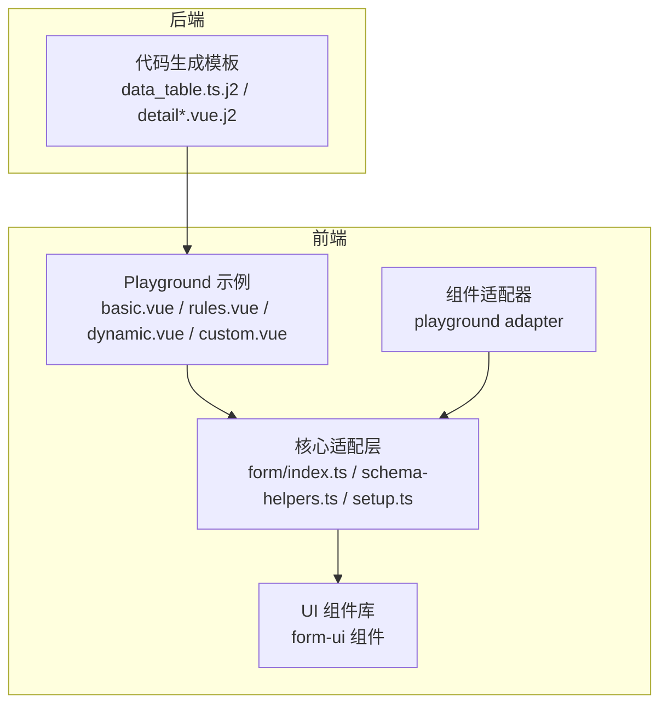
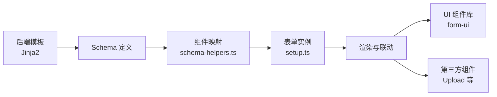
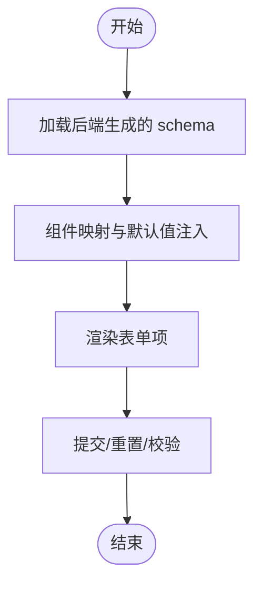
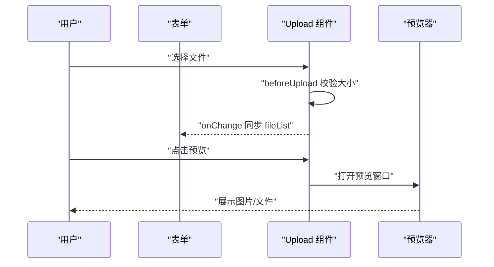
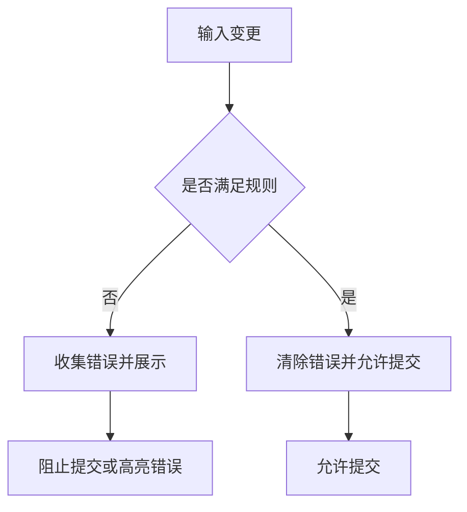
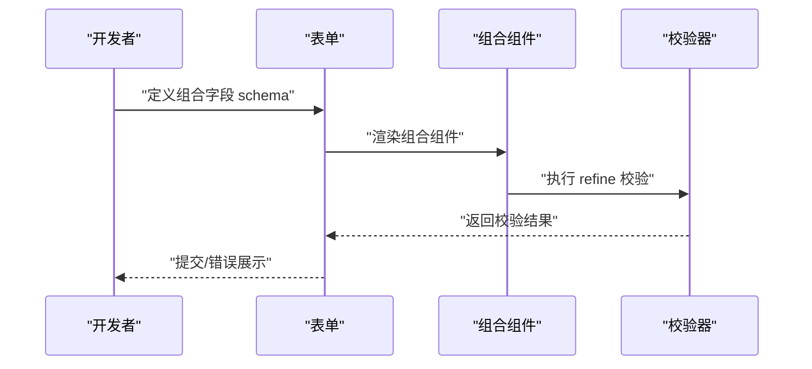

# 表单组件

<cite>
**本文引用的文件**
- [frontend/apps/web-antd/src/core/adapter/form/index.ts](file://frontend/apps/web-antd/src/core/adapter/form/index.ts)
- [frontend/apps/web-antd/src/core/adapter/form/schema-helpers.ts](file://frontend/apps/web-antd/src/core/adapter/form/schema-helpers.ts)
- [frontend/apps/web-antd/src/core/adapter/form/setup.ts](file://frontend/apps/web-antd/src/core/adapter/form/setup.ts)
- [frontend/packages/@core/ui-kit/form-ui/src/components/form-actions.vue](file://frontend/packages/@core/ui-kit/form-ui/src/components/form-actions.vue)
- [frontend/playground/src/views/examples/form/basic.vue](file://frontend/playground/src/views/examples/form/basic.vue)
- [frontend/playground/src/views/examples/form/custom.vue](file://frontend/playground/src/views/examples/form/custom.vue)
- [frontend/playground/src/views/examples/form/dynamic.vue](file://frontend/playground/src/views/examples/form/dynamic.vue)
- [frontend/playground/src/views/examples/form/rules.vue](file://frontend/playground/src/views/examples/form/rules.vue)
- [frontend/playground/src/views/examples/form/custom-layout.vue](file://frontend/playground/src/views/examples/form/custom-layout.vue)
- [frontend/playground/src/views/examples/form/modules/two-fields.vue](file://frontend/playground/src/views/examples/form/modules/two-fields.vue)
- [frontend/playground/src/adapter/component/index.ts](file://frontend/playground/src/adapter/component/index.ts)
- [backend/app/codegen/templates/frontend/data_table.ts.j2](file://backend/app/codegen/templates/frontend/data_table.ts.j2)
- [backend/app/codegen/templates/frontend/detail.vue.j2](file://backend/app/codegen/templates/frontend/detail.vue.j2)
- [backend/app/codegen/templates/frontend/detail_page.vue.j2](file://backend/app/codegen/templates/frontend/detail_page.vue.j2)
</cite>

## 目录
1. [引言](#引言)
2. [项目结构](#项目结构)
3. [核心组件](#核心组件)
4. [架构总览](#架构总览)
5. [组件详解](#组件详解)
6. [依赖关系分析](#依赖关系分析)
7. [性能考量](#性能考量)
8. [故障排查指南](#故障排查指南)
9. [结论](#结论)
10. [附录](#附录)

## 引言
本技术文档聚焦于表单组件系统，围绕配置表单、富文本编辑器、文件选择器等表单相关组件进行深入解析。内容涵盖表单验证机制、数据绑定策略、用户输入处理、可复用性设计、样式定制与响应式布局、性能优化、错误处理与用户体验改进，以及复杂表单场景下的组件组合与状态管理。

## 项目结构
前端采用基于 Vite 的多包工作区，表单能力主要由以下模块构成：
- 核心适配层：负责将声明式 schema 转换为可渲染的表单项，并提供表单生命周期与联动逻辑
- UI 组件库：提供通用的表单项容器与辅助控件（如 FormItem、FormLabel、FormMessage）
- Playground 示例：展示基础表单、动态表单、规则校验、自定义布局与组合组件等典型用法
- 后端模板：通过 Jinja2 模板生成前端表单 schema 与详情页展示逻辑，支撑配置表单与详情页联动

**图表来源**
- [frontend/apps/web-antd/src/core/adapter/form/index.ts](file://frontend/apps/web-antd/src/core/adapter/form/index.ts)
- [frontend/packages/@core/ui-kit/form-ui/src/components/form-actions.vue](file://frontend/packages/@core/ui-kit/form-ui/src/components/form-actions.vue)
- [frontend/playground/src/views/examples/form/basic.vue](file://frontend/playground/src/views/examples/form/basic.vue)
- [frontend/playground/src/adapter/component/index.ts](file://frontend/playground/src/adapter/component/index.ts)
- [backend/app/codegen/templates/frontend/data_table.ts.j2](file://backend/app/codegen/templates/frontend/data_table.ts.j2)

**章节来源**
- [frontend/apps/web-antd/src/core/adapter/form/index.ts](file://frontend/apps/web-antd/src/core/adapter/form/index.ts)
- [frontend/packages/@core/ui-kit/form-ui/src/components/form-actions.vue](file://frontend/packages/@core/ui-kit/form-ui/src/components/form-actions.vue)
- [frontend/playground/src/views/examples/form/basic.vue](file://frontend/playground/src/views/examples/form/basic.vue)
- [frontend/playground/src/adapter/component/index.ts](file://frontend/playground/src/adapter/component/index.ts)
- [backend/app/codegen/templates/frontend/data_table.ts.j2](file://backend/app/codegen/templates/frontend/data_table.ts.j2)

## 核心组件
- 声明式 Schema 驱动的表单引擎：通过 schema 描述字段类型、校验规则、默认值、依赖联动等，核心位于适配层
- 表单项容器与辅助控件：FormItem、FormLabel、FormMessage、FormDescription 提供一致的语义化与无障碍体验
- 动态表单与联动：支持运行时增删 schema、字段间依赖触发、条件渲染
- 文件上传与预览：封装 Upload 组件，提供尺寸限制、预览、占位符等增强能力
- 规则校验：结合 Zod 或字符串规则，支持必填、长度、数值范围、邮箱、自定义 refine 等
- 响应式布局：基于栅格系统与容器类，按屏幕尺寸自动调整列数

**章节来源**
- [frontend/apps/web-antd/src/core/adapter/form/schema-helpers.ts](file://frontend/apps/web-antd/src/core/adapter/form/schema-helpers.ts)
- [frontend/packages/@core/ui-kit/form-ui/src/components/form-actions.vue](file://frontend/packages/@core/ui-kit/form-ui/src/components/form-actions.vue)
- [frontend/playground/src/views/examples/form/dynamic.vue](file://frontend/playground/src/views/examples/form/dynamic.vue)
- [frontend/playground/src/views/examples/form/rules.vue](file://frontend/playground/src/views/examples/form/rules.vue)
- [frontend/playground/src/views/examples/form/basic.vue](file://frontend/playground/src/views/examples/form/basic.vue)

## 架构总览
表单系统采用“Schema 驱动 + 组件适配 + UI 容器”的分层架构：
- 上层：Playground 示例与业务页面，定义 schema 并消费表单 API
- 中层：核心适配层，负责 schema 解析、组件映射、联动与校验执行
- 下层：UI 组件库与第三方组件（Ant Design、Upload 等），提供渲染与交互
- 后端：模板生成前端 schema 与详情页展示，保证前后端一致性

**图表来源**
- [frontend/apps/web-antd/src/core/adapter/form/schema-helpers.ts](file://frontend/apps/web-antd/src/core/adapter/form/schema-helpers.ts)
- [frontend/apps/web-antd/src/core/adapter/form/setup.ts](file://frontend/apps/web-antd/src/core/adapter/form/setup.ts)
- [backend/app/codegen/templates/frontend/data_table.ts.j2](file://backend/app/codegen/templates/frontend/data_table.ts.j2)

## 组件详解

### 配置表单（Config Form）
- 设计要点
  - 通过后端模板生成 schema，确保字段类型、枚举值、国际化标签与后端一致
  - 支持默认值、必填、最大长度等约束在模板中统一注入
  - 详情页与编辑页共享同一套 schema，减少维护成本
- 关键实现
  - 模板根据字段类型生成对应组件与校验规则
  - 枚举值通过 options 注入，支持国际化 label
  - 文本域、数字域、布尔开关、下拉选择等均有内置映射
- 典型用法
  - 在业务页面中传入 schema，调用表单 API 进行提交与重置

**图表来源**
- [backend/app/codegen/templates/frontend/data_table.ts.j2](file://backend/app/codegen/templates/frontend/data_table.ts.j2)
- [backend/app/codegen/templates/frontend/detail.vue.j2](file://backend/app/codegen/templates/frontend/detail.vue.j2)
- [backend/app/codegen/templates/frontend/detail_page.vue.j2](file://backend/app/codegen/templates/frontend/detail_page.vue.j2)

**章节来源**
- [backend/app/codegen/templates/frontend/data_table.ts.j2](file://backend/app/codegen/templates/frontend/data_table.ts.j2)
- [backend/app/codegen/templates/frontend/detail.vue.j2](file://backend/app/codegen/templates/frontend/detail.vue.j2)
- [backend/app/codegen/templates/frontend/detail_page.vue.j2](file://backend/app/codegen/templates/frontend/detail_page.vue.j2)

### 富文本编辑器（WYSIWYG）
- 设计要点
  - 作为通用表单项接入表单体系，遵循统一的数据绑定与校验流程
  - 支持禁用、只读、占位符、高度控制等常见属性
  - 与表单联动：在依赖字段变化时动态启用/禁用
- 实现建议
  - 将富文本组件注册为 schema 的一种组件类型，统一走组件映射与渲染管线
  - 校验策略：支持空值校验、最小/最大长度校验、正则校验等

**章节来源**
- [frontend/apps/web-antd/src/core/adapter/form/schema-helpers.ts](file://frontend/apps/web-antd/src/core/adapter/form/schema-helpers.ts)
- [frontend/playground/src/views/examples/form/dynamic.vue](file://frontend/playground/src/views/examples/form/dynamic.vue)

### 文件选择器与上传（Upload）
- 设计要点
  - 基于 Upload 组件封装，提供尺寸限制、预览、占位符、禁用态等增强
  - 支持多文件与单文件模式，listType 决定展示风格
  - 与表单双向绑定，onChange 同步到 modelValue
- 关键实现
  - beforeUpload 校验文件大小，超限直接拦截并提示
  - onChange 同步 fileList 到表单值，移除 removed 状态的文件
  - onPreview 打开预览窗口，支持图片类型识别与批量预览
- 典型用法
  - 在 schema 中声明 Upload 组件，设置 accept、maxSize、maxCount、customRequest 等属性

**图表来源**
- [frontend/playground/src/adapter/component/index.ts](file://frontend/playground/src/adapter/component/index.ts)
- [frontend/playground/src/views/examples/form/basic.vue](file://frontend/playground/src/views/examples/form/basic.vue)

**章节来源**
- [frontend/playground/src/adapter/component/index.ts](file://frontend/playground/src/adapter/component/index.ts)
- [frontend/playground/src/views/examples/form/basic.vue](file://frontend/playground/src/views/examples/form/basic.vue)

### 表单验证机制
- 规则来源
  - 字符串规则：如 'required'、'selectRequired'
  - Zod 规则：支持链式校验、自定义 refine、数组长度与元素校验
- 执行时机
  - 失焦校验、提交时整体校验、依赖变更时触发局部校验
- 错误展示
  - 通过 FormMessage 组件统一展示错误文案，支持国际化

**图表来源**
- [frontend/playground/src/views/examples/form/rules.vue](file://frontend/playground/src/views/examples/form/rules.vue)
- [frontend/packages/@core/ui-kit/form-ui/src/components/form-actions.vue](file://frontend/packages/@core/ui-kit/form-ui/src/components/form-actions.vue)

**章节来源**
- [frontend/playground/src/views/examples/form/rules.vue](file://frontend/playground/src/views/examples/form/rules.vue)
- [frontend/packages/@core/ui-kit/form-ui/src/components/form-actions.vue](file://frontend/packages/@core/ui-kit/form-ui/src/components/form-actions.vue)

### 数据绑定策略与用户输入处理
- 双向绑定
  - 通过 modelValue 与 update:modelValue 实现 v-model 双向绑定
  - watch 监听外部值变化，同步到内部 fileList 或表单字段
- 输入处理
  - 组件内部统一处理 onChange/onBlur 等事件，更新表单值并触发校验
  - 对特殊组件（如 Upload）在 onChange 中过滤 removed 文件并回写值
- 依赖联动
  - 通过 dependencies.trigger 与 triggerFields 控制联动范围，避免过度重渲染

**章节来源**
- [frontend/playground/src/adapter/component/index.ts](file://frontend/playground/src/adapter/component/index.ts)
- [frontend/playground/src/views/examples/form/dynamic.vue](file://frontend/playground/src/views/examples/form/dynamic.vue)

### 可复用性设计、样式定制与响应式布局
- 可复用性
  - 通过组件映射与 schema 抽象，不同业务页面可共用同一套表单配置
  - 通用表单项容器（FormItem、FormLabel、FormMessage）提升一致性
- 样式定制
  - 通过 formItemClass、wrapperClass 等属性灵活定制布局与间距
  - 支持 col-span 类，实现细粒度的栅格布局控制
- 响应式布局
  - 基于 CSS Grid，md/lg 屏幕下自动调整列数，兼顾移动端体验

**章节来源**
- [frontend/playground/src/views/examples/form/custom.vue](file://frontend/playground/src/views/examples/form/custom.vue)
- [frontend/playground/src/views/examples/form/custom-layout.vue](file://frontend/playground/src/views/examples/form/custom-layout.vue)

### 复杂表单场景与状态管理
- 组合字段
  - 使用 markRaw 包裹自定义组件，支持数组型字段的组合输入与联合校验
  - 通过 refine 对数组元素进行条件校验，错误文案对齐到具体输入框下方
- 动态 schema
  - 运行时增删字段、设置默认值、切换禁用态
  - 通过 formApi.setState 更新 schema，保持表单状态与 UI 同步
- 详情页与编辑页联动
  - 后端模板生成的 schema 同时用于详情页展示与编辑页编辑，减少重复开发

**图表来源**
- [frontend/playground/src/views/examples/form/custom.vue](file://frontend/playground/src/views/examples/form/custom.vue)
- [frontend/playground/src/views/examples/form/modules/two-fields.vue](file://frontend/playground/src/views/examples/form/modules/two-fields.vue)

**章节来源**
- [frontend/playground/src/views/examples/form/custom.vue](file://frontend/playground/src/views/examples/form/custom.vue)
- [frontend/playground/src/views/examples/form/dynamic.vue](file://frontend/playground/src/views/examples/form/dynamic.vue)
- [frontend/playground/src/views/examples/form/modules/two-fields.vue](file://frontend/playground/src/views/examples/form/modules/two-fields.vue)

## 依赖关系分析
- 组件耦合
  - 表单适配层与 UI 组件库松耦合，通过 schema 与 props 通信
  - 第三方组件（Upload）通过适配器封装，隔离外部依赖变化
- 依赖链
  - schema -> 组件映射 -> 渲染 -> 事件回调 -> 表单值更新 -> 校验反馈
- 循环依赖
  - 未发现循环依赖迹象；各模块职责清晰，接口边界明确

**图表来源**
- [frontend/apps/web-antd/src/core/adapter/form/schema-helpers.ts](file://frontend/apps/web-antd/src/core/adapter/form/schema-helpers.ts)
- [frontend/apps/web-antd/src/core/adapter/form/setup.ts](file://frontend/apps/web-antd/src/core/adapter/form/setup.ts)

**章节来源**
- [frontend/apps/web-antd/src/core/adapter/form/schema-helpers.ts](file://frontend/apps/web-antd/src/core/adapter/form/schema-helpers.ts)
- [frontend/apps/web-antd/src/core/adapter/form/setup.ts](file://frontend/apps/web-antd/src/core/adapter/form/setup.ts)

## 性能考量
- 渲染优化
  - 使用 markRaw 包裹自定义组件，避免不必要的响应式追踪
  - 仅在必要字段上启用依赖联动，缩小触发范围
- 事件节流
  - 对高频输入（如文本框）可在组件内部做防抖，降低校验频率
- 计算与存储
  - 将枚举值与默认值在模板阶段注入，减少运行时计算
- 上传性能
  - beforeUpload 做本地尺寸校验，避免无效上传请求
  - 预览采用懒加载与缩略图策略，减少首屏压力

[本节为通用指导，无需列出章节来源]

## 故障排查指南
- 上传失败或被拦截
  - 检查 maxSize 是否设置合理，确认 beforeUpload 返回值
  - 确认 fileList 同步逻辑，避免 removed 状态文件参与提交
- 校验不生效
  - 确认规则书写正确，Zod refine 语法与数组长度校验无误
  - 检查依赖联动是否覆盖了相关字段
- 布局错乱
  - 检查 wrapperClass 与 col-span 类是否匹配当前屏幕尺寸
  - 确认栅格容器类与子项类的组合使用

**章节来源**
- [frontend/playground/src/adapter/component/index.ts](file://frontend/playground/src/adapter/component/index.ts)
- [frontend/playground/src/views/examples/form/rules.vue](file://frontend/playground/src/views/examples/form/rules.vue)
- [frontend/playground/src/views/examples/form/custom.vue](file://frontend/playground/src/views/examples/form/custom.vue)

## 结论
该表单组件系统以声明式 schema 为核心，结合 UI 容器与第三方组件，实现了高可复用、强扩展、易维护的表单解决方案。通过后端模板生成 schema，保障了前后端一致性；通过 Upload 适配器与丰富的校验策略，提升了文件处理与数据质量；通过动态 schema 与组合组件，满足复杂业务场景。建议在实际项目中进一步完善错误边界与性能监控，持续优化用户体验。

[本节为总结性内容，无需列出章节来源]

## 附录
- 最佳实践清单
  - 优先使用后端模板生成 schema，减少手写错误
  - 对自定义组件使用 markRaw 包裹，避免响应式开销
  - 合理划分依赖联动范围，避免全量重渲染
  - 为上传组件设置合理的 maxSize 与 accept，提升稳定性
  - 使用国际化文案与统一的错误展示组件，提升一致性

[本节为通用建议，无需列出章节来源]