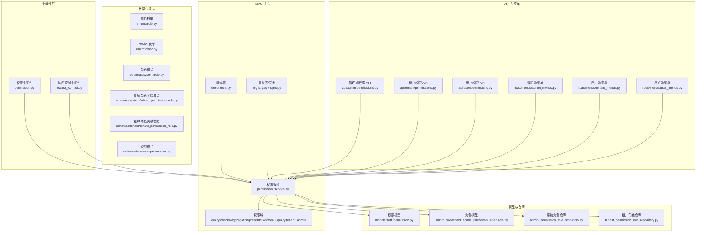
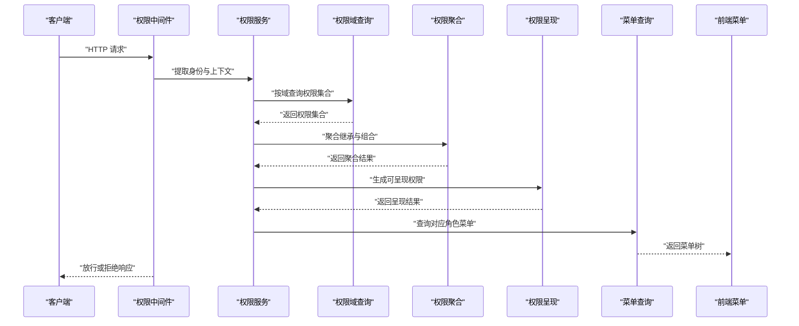
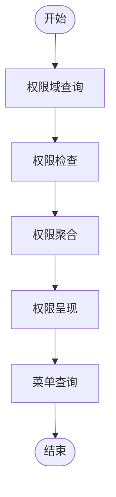
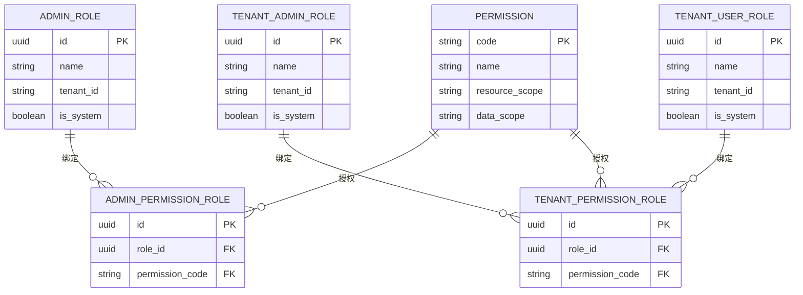
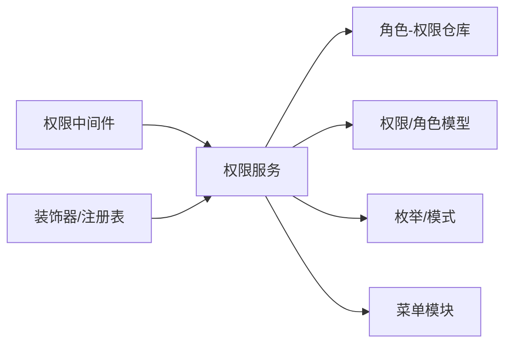

# 基于角色的路由

<cite>
**本文引用的文件**
- [backend/app/rbac/decorators.py](file://backend/app/rbac/decorators.py)
- [backend/app/rbac/registry.py](file://backend/app/rbac/registry.py)
- [backend/app/rbac/sync.py](file://backend/app/rbac/sync.py)
- [backend/app/rbac/services/permission_service.py](file://backend/app/rbac/services/permission_service.py)
- [backend/app/rbac/services/permission_domains/query.py](file://backend/app/rbac/services/permission_domains/query.py)
- [backend/app/rbac/services/permission_domains/checks.py](file://backend/app/rbac/services/permission_domains/checks.py)
- [backend/app/rbac/services/permission_domains/aggregation.py](file://backend/app/rbac/services/permission_domains/aggregation.py)
- [backend/app/rbac/services/permission_domains/presentation.py](file://backend/app/rbac/services/permission_domains/presentation.py)
- [backend/app/rbac/services/permission_domains/menu_query.py](file://backend/app/rbac/services/permission_domains/menu_query.py)
- [backend/app/rbac/services/permission_domains/tenant_admin.py](file://backend/app/rbac/services/permission_domains/tenant_admin.py)
- [backend/app/middleware/permission.py](file://backend/app/middleware/permission.py)
- [backend/app/middleware/access_control.py](file://backend/app/middleware/access_control.py)
- [backend/app/enums/rbac.py](file://backend/app/enums/rbac.py)
- [backend/app/enums/role.py](file://backend/app/enums/role.py)
- [backend/app/models/auth/permission.py](file://backend/app/models/auth/permission.py)
- [backend/app/models/auth/admin_role.py](file://backend/app/models/auth/admin_role.py)
- [backend/app/models/auth/tenant_admin_role.py](file://backend/app/models/auth/tenant_admin_role.py)
- [backend/app/models/auth/tenant_user_role.py](file://backend/app/models/auth/tenant_user_role.py)
- [backend/app/schemas/system/role.py](file://backend/app/schemas/system/role.py)
- [backend/app/schemas/system/admin_permission_role.py](file://backend/app/schemas/system/admin_permission_role.py)
- [backend/app/schemas/tenant/tenant_permission_role.py](file://backend/app/schemas/tenant/tenant_permission_role.py)
- [backend/app/schemas/common/permission.py](file://backend/app/schemas/common/permission.py)
- [backend/app/repositories/system/admin_permission_role_repository.py](file://backend/app/repositories/system/admin_permission_role_repository.py)
- [backend/app/repositories/tenant/tenant_permission_role_repository.py](file://backend/app/repositories/tenant/tenant_permission_role_repository.py)
- [backend/app/api/admin/permissions.py](file://backend/app/api/admin/permissions.py)
- [backend/app/api/tenant/permissions.py](file://backend/app/api/tenant/permissions.py)
- [backend/app/api/user/permissions.py](file://backend/app/api/user/permissions.py)
- [backend/app/api/tenant/permission_roles.py](file://backend/app/api/tenant/permission_roles.py)
- [backend/app/api/tenant/user_roles.py](file://backend/app/api/tenant/user_roles.py)
- [backend/app/rbac/menus/admin_menus.py](file://backend/app/rbac/menus/admin_menus.py)
- [backend/app/rbac/menus/tenant_menus.py](file://backend/app/rbac/menus/tenant_menus.py)
- [backend/app/rbac/menus/user_menus.py](file://backend/app/rbac/menus/user_menus.py)
- [backend/app/cache.py](file://backend/app/cache.py)
- [backend/app/core/data_permission.py](file://backend/app/core/data_permission.py)
</cite>

## 目录
1. [简介](#简介)
2. [项目结构](#项目结构)
3. [核心组件](#核心组件)
4. [架构总览](#架构总览)
5. [详细组件分析](#详细组件分析)
6. [依赖分析](#依赖分析)
7. [性能考虑](#性能考虑)
8. [故障排查指南](#故障排查指南)
9. [结论](#结论)
10. [附录](#附录)

## 简介
本技术文档围绕“基于角色的路由权限系统”展开，系统通过角色与权限的映射关系，结合中间件与服务层实现对路由的动态授权与菜单呈现。文档重点覆盖以下方面：
- 角色权限与路由的映射关系及动态路由生成
- 权限验证机制与数据域权限控制
- 管理员路由、租户路由、用户路由的配置差异
- 权限继承、角色组合与细粒度权限控制
- 权限缓存、权限更新与失效策略
- 性能优化与安全防护

## 项目结构
后端采用分层与领域驱动设计，RBAC相关能力集中在 rbac 子模块，并与中间件、模型、仓库、服务、API 层协同工作。

**图表来源**
- [backend/app/middleware/permission.py](file://backend/app/middleware/permission.py)
- [backend/app/middleware/access_control.py](file://backend/app/middleware/access_control.py)
- [backend/app/rbac/decorators.py](file://backend/app/rbac/decorators.py)
- [backend/app/rbac/registry.py](file://backend/app/rbac/registry.py)
- [backend/app/rbac/sync.py](file://backend/app/rbac/sync.py)
- [backend/app/rbac/services/permission_service.py](file://backend/app/rbac/services/permission_service.py)
- [backend/app/rbac/services/permission_domains/query.py](file://backend/app/rbac/services/permission_domains/query.py)
- [backend/app/rbac/services/permission_domains/checks.py](file://backend/app/rbac/services/permission_domains/checks.py)
- [backend/app/rbac/services/permission_domains/aggregation.py](file://backend/app/rbac/services/permission_domains/aggregation.py)
- [backend/app/rbac/services/permission_domains/presentation.py](file://backend/app/rbac/services/permission_domains/presentation.py)
- [backend/app/rbac/services/permission_domains/menu_query.py](file://backend/app/rbac/services/permission_domains/menu_query.py)
- [backend/app/rbac/services/permission_domains/tenant_admin.py](file://backend/app/rbac/services/permission_domains/tenant_admin.py)
- [backend/app/models/auth/permission.py](file://backend/app/models/auth/permission.py)
- [backend/app/models/auth/admin_role.py](file://backend/app/models/auth/admin_role.py)
- [backend/app/models/auth/tenant_admin_role.py](file://backend/app/models/auth/tenant_admin_role.py)
- [backend/app/models/auth/tenant_user_role.py](file://backend/app/models/auth/tenant_user_role.py)
- [backend/app/repositories/system/admin_permission_role_repository.py](file://backend/app/repositories/system/admin_permission_role_repository.py)
- [backend/app/repositories/tenant/tenant_permission_role_repository.py](file://backend/app/repositories/tenant/tenant_permission_role_repository.py)
- [backend/app/enums/rbac.py](file://backend/app/enums/rbac.py)
- [backend/app/enums/role.py](file://backend/app/enums/role.py)
- [backend/app/schemas/system/role.py](file://backend/app/schemas/system/role.py)
- [backend/app/schemas/system/admin_permission_role.py](file://backend/app/schemas/system/admin_permission_role.py)
- [backend/app/schemas/tenant/tenant_permission_role.py](file://backend/app/schemas/tenant/tenant_permission_role.py)
- [backend/app/schemas/common/permission.py](file://backend/app/schemas/common/permission.py)
- [backend/app/api/admin/permissions.py](file://backend/app/api/admin/permissions.py)
- [backend/app/api/tenant/permissions.py](file://backend/app/api/tenant/permissions.py)
- [backend/app/api/user/permissions.py](file://backend/app/api/user/permissions.py)
- [backend/app/rbac/menus/admin_menus.py](file://backend/app/rbac/menus/admin_menus.py)
- [backend/app/rbac/menus/tenant_menus.py](file://backend/app/rbac/menus/tenant_menus.py)
- [backend/app/rbac/menus/user_menus.py](file://backend/app/rbac/menus/user_menus.py)

**章节来源**
- [backend/app/rbac/decorators.py](file://backend/app/rbac/decorators.py)
- [backend/app/rbac/registry.py](file://backend/app/rbac/registry.py)
- [backend/app/rbac/sync.py](file://backend/app/rbac/sync.py)
- [backend/app/rbac/services/permission_service.py](file://backend/app/rbac/services/permission_service.py)
- [backend/app/middleware/permission.py](file://backend/app/middleware/permission.py)
- [backend/app/middleware/access_control.py](file://backend/app/middleware/access_control.py)
- [backend/app/enums/rbac.py](file://backend/app/enums/rbac.py)
- [backend/app/enums/role.py](file://backend/app/enums/role.py)
- [backend/app/models/auth/permission.py](file://backend/app/models/auth/permission.py)
- [backend/app/models/auth/admin_role.py](file://backend/app/models/auth/admin_role.py)
- [backend/app/models/auth/tenant_admin_role.py](file://backend/app/models/auth/tenant_admin_role.py)
- [backend/app/models/auth/tenant_user_role.py](file://backend/app/models/auth/tenant_user_role.py)
- [backend/app/schemas/system/role.py](file://backend/app/schemas/system/role.py)
- [backend/app/schemas/system/admin_permission_role.py](file://backend/app/schemas/system/admin_permission_role.py)
- [backend/app/schemas/tenant/tenant_permission_role.py](file://backend/app/schemas/tenant/tenant_permission_role.py)
- [backend/app/schemas/common/permission.py](file://backend/app/schemas/common/permission.py)
- [backend/app/repositories/system/admin_permission_role_repository.py](file://backend/app/repositories/system/admin_permission_role_repository.py)
- [backend/app/repositories/tenant/tenant_permission_role_repository.py](file://backend/app/repositories/tenant/tenant_permission_role_repository.py)
- [backend/app/api/admin/permissions.py](file://backend/app/api/admin/permissions.py)
- [backend/app/api/tenant/permissions.py](file://backend/app/api/tenant/permissions.py)
- [backend/app/api/user/permissions.py](file://backend/app/api/user/permissions.py)
- [backend/app/rbac/menus/admin_menus.py](file://backend/app/rbac/menus/admin_menus.py)
- [backend/app/rbac/menus/tenant_menus.py](file://backend/app/rbac/menus/tenant_menus.py)
- [backend/app/rbac/menus/user_menus.py](file://backend/app/rbac/menus/user_menus.py)

## 核心组件
- 权限中间件：在请求进入时进行权限校验与拦截，支持多租户与组织级权限判定。
- RBAC 装饰器与注册表：提供权限声明式标注与权限项注册、同步机制。
- 权限服务：聚合查询、权限检查、权限聚合、菜单查询与展示逻辑。
- 模型与仓库：权限、角色、角色-权限关联的数据模型与持久化。
- 枚举与模式：统一的角色、权限、资源域等语义定义。
- API 与菜单：面向不同角色的权限接口与前端菜单生成。

**章节来源**
- [backend/app/middleware/permission.py](file://backend/app/middleware/permission.py)
- [backend/app/rbac/decorators.py](file://backend/app/rbac/decorators.py)
- [backend/app/rbac/registry.py](file://backend/app/rbac/registry.py)
- [backend/app/rbac/sync.py](file://backend/app/rbac/sync.py)
- [backend/app/rbac/services/permission_service.py](file://backend/app/rbac/services/permission_service.py)
- [backend/app/enums/rbac.py](file://backend/app/enums/rbac.py)
- [backend/app/enums/role.py](file://backend/app/enums/role.py)
- [backend/app/models/auth/permission.py](file://backend/app/models/auth/permission.py)
- [backend/app/models/auth/admin_role.py](file://backend/app/models/auth/admin_role.py)
- [backend/app/models/auth/tenant_admin_role.py](file://backend/app/models/auth/tenant_admin_role.py)
- [backend/app/models/auth/tenant_user_role.py](file://backend/app/models/auth/tenant_user_role.py)
- [backend/app/schemas/system/role.py](file://backend/app/schemas/system/role.py)
- [backend/app/schemas/system/admin_permission_role.py](file://backend/app/schemas/system/admin_permission_role.py)
- [backend/app/schemas/tenant/tenant_permission_role.py](file://backend/app/schemas/tenant/tenant_permission_role.py)
- [backend/app/schemas/common/permission.py](file://backend/app/schemas/common/permission.py)
- [backend/app/repositories/system/admin_permission_role_repository.py](file://backend/app/repositories/system/admin_permission_role_repository.py)
- [backend/app/repositories/tenant/tenant_permission_role_repository.py](file://backend/app/repositories/tenant/tenant_permission_role_repository.py)
- [backend/app/api/admin/permissions.py](file://backend/app/api/admin/permissions.py)
- [backend/app/api/tenant/permissions.py](file://backend/app/api/tenant/permissions.py)
- [backend/app/api/user/permissions.py](file://backend/app/api/user/permissions.py)
- [backend/app/rbac/menus/admin_menus.py](file://backend/app/rbac/menus/admin_menus.py)
- [backend/app/rbac/menus/tenant_menus.py](file://backend/app/rbac/menus/tenant_menus.py)
- [backend/app/rbac/menus/user_menus.py](file://backend/app/rbac/menus/user_menus.py)

## 架构总览
下图展示了从请求到权限判定与菜单生成的整体流程，包括中间件拦截、权限服务聚合、数据域过滤与菜单渲染。

**图表来源**
- [backend/app/middleware/permission.py](file://backend/app/middleware/permission.py)
- [backend/app/rbac/services/permission_service.py](file://backend/app/rbac/services/permission_service.py)
- [backend/app/rbac/services/permission_domains/query.py](file://backend/app/rbac/services/permission_domains/query.py)
- [backend/app/rbac/services/permission_domains/aggregation.py](file://backend/app/rbac/services/permission_domains/aggregation.py)
- [backend/app/rbac/services/permission_domains/presentation.py](file://backend/app/rbac/services/permission_domains/presentation.py)
- [backend/app/rbac/services/permission_domains/menu_query.py](file://backend/app/rbac/services/permission_domains/menu_query.py)
- [backend/app/rbac/menus/admin_menus.py](file://backend/app/rbac/menus/admin_menus.py)
- [backend/app/rbac/menus/tenant_menus.py](file://backend/app/rbac/menus/tenant_menus.py)
- [backend/app/rbac/menus/user_menus.py](file://backend/app/rbac/menus/user_menus.py)

## 详细组件分析

### 权限中间件与访问控制
- 职责：在请求进入应用前进行权限拦截，解析租户、用户、组织上下文，调用权限服务进行判定。
- 关键点：支持多租户隔离、组织级权限域、快速失败与缓存命中优先策略。
- 安全性：与审计日志、追踪链路中间件配合，记录鉴权失败原因与上下文信息。

**章节来源**
- [backend/app/middleware/permission.py](file://backend/app/middleware/permission.py)
- [backend/app/middleware/access_control.py](file://backend/app/middleware/access_control.py)

### RBAC 装饰器与注册表
- 装饰器：用于在控制器或路由上声明所需权限，简化权限标注与统一收集。
- 注册表/同步：集中注册权限项并同步至存储，保证权限清单一致性；支持权限项去重与冲突检测。

**章节来源**
- [backend/app/rbac/decorators.py](file://backend/app/rbac/decorators.py)
- [backend/app/rbac/registry.py](file://backend/app/rbac/registry.py)
- [backend/app/rbac/sync.py](file://backend/app/rbac/sync.py)

### 权限服务与权限域
- 权限服务：作为权限判定与呈现的核心，负责：
  - 权限域查询：按资源域与作用域查询权限集合
  - 权限检查：判断是否满足最小权限集
  - 权限聚合：合并继承与组合后的权限集合
  - 权限呈现：将权限转换为前端可用的布尔/集合形态
  - 菜单查询：根据角色与权限生成菜单树
- 租户管理员权限域：针对租户维度的特殊权限域处理，确保租户内权限与全局权限的边界清晰。

**图表来源**
- [backend/app/rbac/services/permission_service.py](file://backend/app/rbac/services/permission_service.py)
- [backend/app/rbac/services/permission_domains/query.py](file://backend/app/rbac/services/permission_domains/query.py)
- [backend/app/rbac/services/permission_domains/checks.py](file://backend/app/rbac/services/permission_domains/checks.py)
- [backend/app/rbac/services/permission_domains/aggregation.py](file://backend/app/rbac/services/permission_domains/aggregation.py)
- [backend/app/rbac/services/permission_domains/presentation.py](file://backend/app/rbac/services/permission_domains/presentation.py)
- [backend/app/rbac/services/permission_domains/menu_query.py](file://backend/app/rbac/services/permission_domains/menu_query.py)
- [backend/app/rbac/services/permission_domains/tenant_admin.py](file://backend/app/rbac/services/permission_domains/tenant_admin.py)

**章节来源**
- [backend/app/rbac/services/permission_service.py](file://backend/app/rbac/services/permission_service.py)
- [backend/app/rbac/services/permission_domains/query.py](file://backend/app/rbac/services/permission_domains/query.py)
- [backend/app/rbac/services/permission_domains/checks.py](file://backend/app/rbac/services/permission_domains/checks.py)
- [backend/app/rbac/services/permission_domains/aggregation.py](file://backend/app/rbac/services/permission_domains/aggregation.py)
- [backend/app/rbac/services/permission_domains/presentation.py](file://backend/app/rbac/services/permission_domains/presentation.py)
- [backend/app/rbac/services/permission_domains/menu_query.py](file://backend/app/rbac/services/permission_domains/menu_query.py)
- [backend/app/rbac/services/permission_domains/tenant_admin.py](file://backend/app/rbac/services/permission_domains/tenant_admin.py)

### 模型与仓库
- 权限模型：描述权限标识、资源域、作用域与元数据。
- 角色模型：系统管理员角色、租户管理员角色、租户普通用户角色。
- 角色-权限关联：系统级与租户级角色与权限的绑定关系，支持继承与组合。
- 仓库：提供角色-权限关联的增删改查与批量同步。

**图表来源**
- [backend/app/models/auth/permission.py](file://backend/app/models/auth/permission.py)
- [backend/app/models/auth/admin_role.py](file://backend/app/models/auth/admin_role.py)
- [backend/app/models/auth/tenant_admin_role.py](file://backend/app/models/auth/tenant_admin_role.py)
- [backend/app/models/auth/tenant_user_role.py](file://backend/app/models/auth/tenant_user_role.py)
- [backend/app/schemas/system/admin_permission_role.py](file://backend/app/schemas/system/admin_permission_role.py)
- [backend/app/schemas/tenant/tenant_permission_role.py](file://backend/app/schemas/tenant/tenant_permission_role.py)
- [backend/app/repositories/system/admin_permission_role_repository.py](file://backend/app/repositories/system/admin_permission_role_repository.py)
- [backend/app/repositories/tenant/tenant_permission_role_repository.py](file://backend/app/repositories/tenant/tenant_permission_role_repository.py)

**章节来源**
- [backend/app/models/auth/permission.py](file://backend/app/models/auth/permission.py)
- [backend/app/models/auth/admin_role.py](file://backend/app/models/auth/admin_role.py)
- [backend/app/models/auth/tenant_admin_role.py](file://backend/app/models/auth/tenant_admin_role.py)
- [backend/app/models/auth/tenant_user_role.py](file://backend/app/models/auth/tenant_user_role.py)
- [backend/app/schemas/system/admin_permission_role.py](file://backend/app/schemas/system/admin_permission_role.py)
- [backend/app/schemas/tenant/tenant_permission_role.py](file://backend/app/schemas/tenant/tenant_permission_role.py)
- [backend/app/repositories/system/admin_permission_role_repository.py](file://backend/app/repositories/system/admin_permission_role_repository.py)
- [backend/app/repositories/tenant/tenant_permission_role_repository.py](file://backend/app/repositories/tenant/tenant_permission_role_repository.py)

### 枚举与模式
- 角色枚举：统一的角色类型与层级语义，便于跨模块一致使用。
- RBAC 枚举：权限域、数据域、作用域等语义常量。
- 模式：角色、权限、角色-权限关联的序列化/反序列化结构，保障 API 一致性。

**章节来源**
- [backend/app/enums/role.py](file://backend/app/enums/role.py)
- [backend/app/enums/rbac.py](file://backend/app/enums/rbac.py)
- [backend/app/schemas/system/role.py](file://backend/app/schemas/system/role.py)
- [backend/app/schemas/common/permission.py](file://backend/app/schemas/common/permission.py)

### API 与菜单
- 管理端权限 API：提供管理员角色的权限查询与变更接口。
- 租户权限 API：提供租户维度的权限查询与角色-权限关联管理。
- 用户权限 API：提供普通用户的权限查询与菜单获取接口。
- 菜单：按角色与权限生成前端可渲染的菜单树，支持动态加载与懒加载。

**章节来源**
- [backend/app/api/admin/permissions.py](file://backend/app/api/admin/permissions.py)
- [backend/app/api/tenant/permissions.py](file://backend/app/api/tenant/permissions.py)
- [backend/app/api/user/permissions.py](file://backend/app/api/user/permissions.py)
- [backend/app/api/tenant/permission_roles.py](file://backend/app/api/tenant/permission_roles.py)
- [backend/app/api/tenant/user_roles.py](file://backend/app/api/tenant/user_roles.py)
- [backend/app/rbac/menus/admin_menus.py](file://backend/app/rbac/menus/admin_menus.py)
- [backend/app/rbac/menus/tenant_menus.py](file://backend/app/rbac/menus/tenant_menus.py)
- [backend/app/rbac/menus/user_menus.py](file://backend/app/rbac/menus/user_menus.py)

## 依赖分析
- 中间件依赖权限服务进行判定，权限服务依赖仓库与模型完成数据访问与聚合。
- 装饰器与注册表负责权限项的声明与同步，确保权限清单与业务一致。
- 菜单模块依赖权限服务提供的权限集合与呈现结果，生成最终菜单树。

**图表来源**
- [backend/app/middleware/permission.py](file://backend/app/middleware/permission.py)
- [backend/app/rbac/services/permission_service.py](file://backend/app/rbac/services/permission_service.py)
- [backend/app/rbac/decorators.py](file://backend/app/rbac/decorators.py)
- [backend/app/rbac/registry.py](file://backend/app/rbac/registry.py)
- [backend/app/rbac/menus/admin_menus.py](file://backend/app/rbac/menus/admin_menus.py)
- [backend/app/rbac/menus/tenant_menus.py](file://backend/app/rbac/menus/tenant_menus.py)
- [backend/app/rbac/menus/user_menus.py](file://backend/app/rbac/menus/user_menus.py)

**章节来源**
- [backend/app/middleware/permission.py](file://backend/app/middleware/permission.py)
- [backend/app/rbac/services/permission_service.py](file://backend/app/rbac/services/permission_service.py)
- [backend/app/rbac/decorators.py](file://backend/app/rbac/decorators.py)
- [backend/app/rbac/registry.py](file://backend/app/rbac/registry.py)
- [backend/app/rbac/menus/admin_menus.py](file://backend/app/rbac/menus/admin_menus.py)
- [backend/app/rbac/menus/tenant_menus.py](file://backend/app/rbac/menus/tenant_menus.py)
- [backend/app/rbac/menus/user_menus.py](file://backend/app/rbac/menus/user_menus.py)

## 性能考虑
- 缓存策略：利用缓存模块对权限集合与菜单树进行短期缓存，降低数据库与聚合计算压力。
- 批量查询：权限域查询与聚合尽量采用批量操作，减少往返次数。
- 懒加载菜单：前端按需加载子菜单，避免一次性渲染大量节点。
- 快速失败：在中间件层尽早判定无权限请求，减少后续处理开销。
- 数据域过滤：在服务层对数据域进行过滤，避免越权数据进入下游。

**章节来源**
- [backend/app/cache.py](file://backend/app/cache.py)
- [backend/app/middleware/permission.py](file://backend/app/middleware/permission.py)
- [backend/app/rbac/services/permission_domains/query.py](file://backend/app/rbac/services/permission_domains/query.py)
- [backend/app/rbac/services/permission_domains/aggregation.py](file://backend/app/rbac/services/permission_domains/aggregation.py)

## 故障排查指南
- 鉴权失败：检查中间件是否正确提取用户上下文与租户信息，确认权限服务是否返回预期权限集合。
- 权限不生效：核对权限注册与同步是否成功，检查角色-权限关联是否正确写入仓库。
- 菜单异常：确认权限呈现与菜单查询逻辑是否正常，检查前端菜单懒加载与权限开关状态。
- 数据域越权：核查数据权限过滤逻辑与资源域配置，确保仅返回允许范围内的数据。

**章节来源**
- [backend/app/middleware/permission.py](file://backend/app/middleware/permission.py)
- [backend/app/rbac/services/permission_service.py](file://backend/app/rbac/services/permission_service.py)
- [backend/app/core/data_permission.py](file://backend/app/core/data_permission.py)

## 结论
该基于角色的路由权限系统通过中间件、权限服务、权限域与菜单模块的协同，实现了对管理员、租户与用户三类角色的差异化权限控制。系统支持权限继承、角色组合与细粒度数据域控制，并通过缓存与批量查询提升性能。建议在生产环境中结合审计日志与追踪中间件，持续监控权限判定与菜单生成的稳定性与安全性。

## 附录
- 管理员路由：由系统管理员角色驱动，权限范围覆盖系统级资源与租户管理。
- 租户路由：由租户管理员与租户用户角色驱动，权限范围限定在租户内资源。
- 用户路由：由普通用户角色驱动，权限范围最小化，仅开放必要的业务功能。

**章节来源**
- [backend/app/api/admin/permissions.py](file://backend/app/api/admin/permissions.py)
- [backend/app/api/tenant/permissions.py](file://backend/app/api/tenant/permissions.py)
- [backend/app/api/user/permissions.py](file://backend/app/api/user/permissions.py)
- [backend/app/rbac/menus/admin_menus.py](file://backend/app/rbac/menus/admin_menus.py)
- [backend/app/rbac/menus/tenant_menus.py](file://backend/app/rbac/menus/tenant_menus.py)
- [backend/app/rbac/menus/user_menus.py](file://backend/app/rbac/menus/user_menus.py)