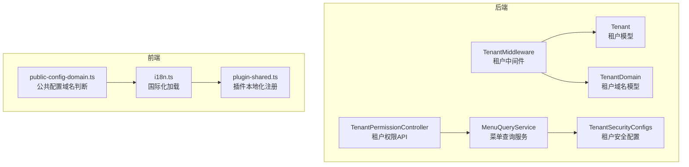
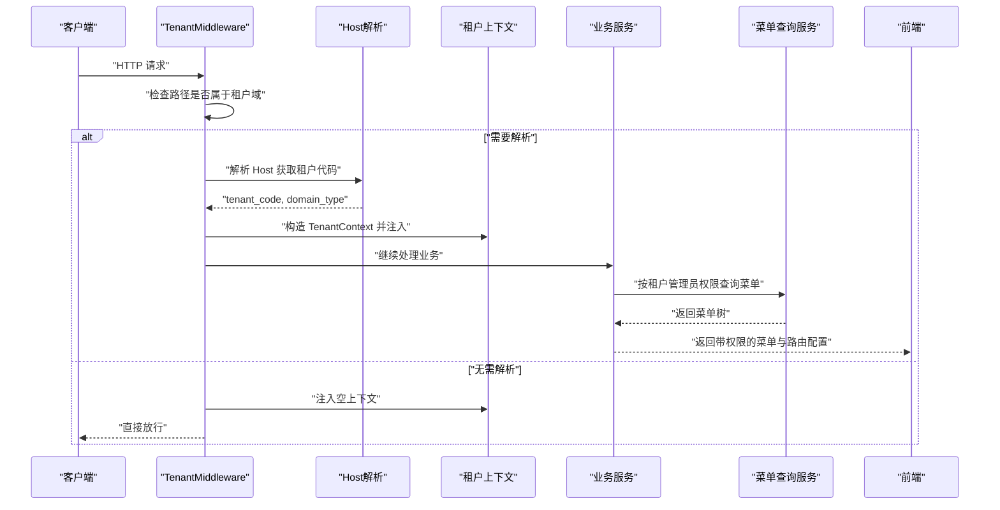
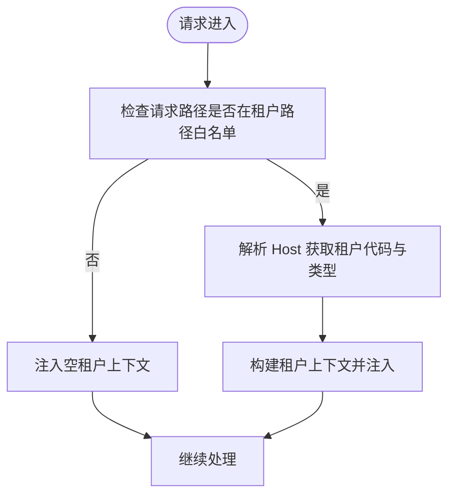
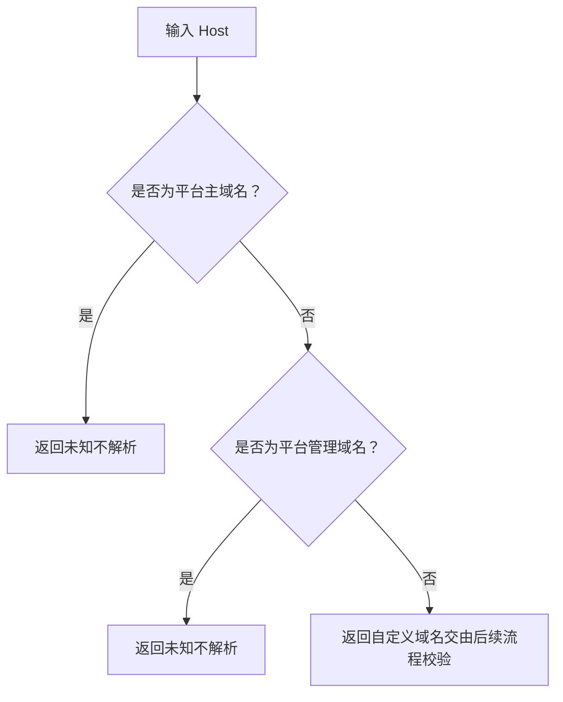
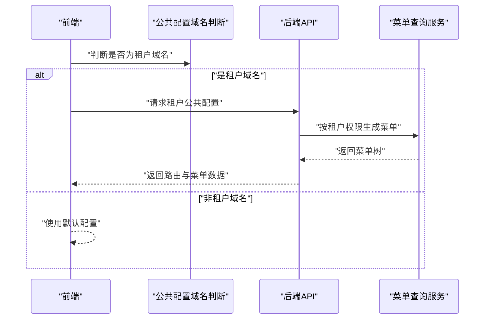
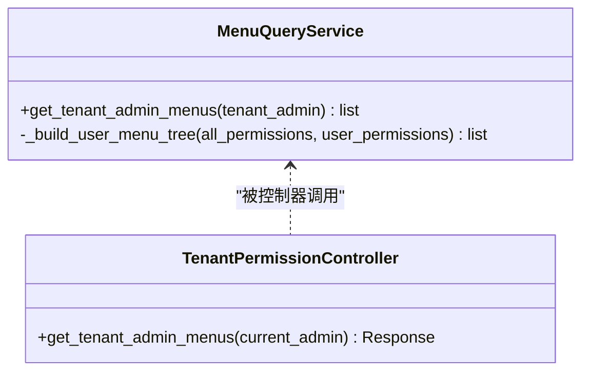
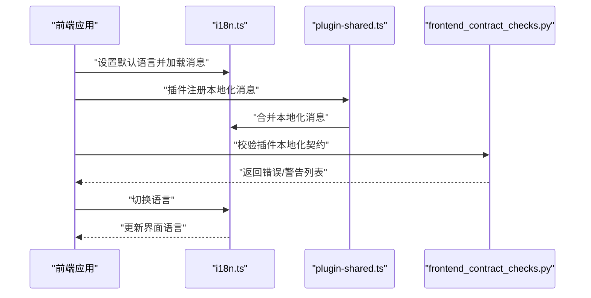
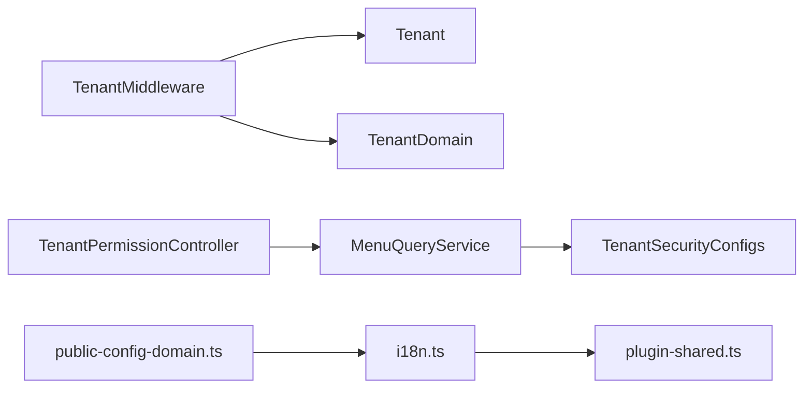

# 多租户路由

<cite>
**本文引用的文件**
- [backend/app/middleware/tenant.py](file://backend/app/middleware/tenant.py)
- [backend/app/models/tenant/tenant.py](file://backend/app/models/tenant/tenant.py)
- [backend/app/models/tenant/tenant_domain.py](file://backend/app/models/tenant/tenant_domain.py)
- [backend/app/api/tenant/permissions.py](file://backend/app/api/tenant/permissions.py)
- [backend/app/rbac/services/permission_domains/menu_query.py](file://backend/app/rbac/services/permission_domains/menu_query.py)
- [backend/app/configs/definitions/tenant/security.py](file://backend/app/configs/definitions/tenant/security.py)
- [backend/app/schemas/public/tenant.py](file://backend/app/schemas/public/tenant.py)
- [backend/app/schemas/system/tenant.py](file://backend/app/schemas/system/tenant.py)
- [backend/app/plugins/frontend_contract_checks.py](file://backend/app/plugins/frontend_contract_checks.py)
- [frontend/packages/locales/src/i18n.ts](file://frontend/packages/locales/src/i18n.ts)
- [frontend/apps/web-antd/src/utils/plugin-shared.ts](file://frontend/apps/web-antd/src/utils/plugin-shared.ts)
- [frontend/apps/web-antd/src/utils/public-config-domain.ts](file://frontend/apps/web-antd/src/utils/public-config-domain.ts)
</cite>

## 目录
1. [引言](#引言)
2. [项目结构](#项目结构)
3. [核心组件](#核心组件)
4. [架构总览](#架构总览)
5. [详细组件分析](#详细组件分析)
6. [依赖关系分析](#依赖关系分析)
7. [性能考虑](#性能考虑)
8. [故障排查指南](#故障排查指南)
9. [结论](#结论)
10. [附录](#附录)

## 引言
本技术文档聚焦于多租户路由系统的设计与实现，围绕租户域名校验、路由隔离、动态路由生成、租户切换与权限控制展开，并覆盖租户特定的路由配置、菜单渲染、页面访问限制、安全策略、性能优化与缓存机制，以及国际化支持与多语言切换实现。目标是帮助开发者与运维人员快速理解并高效维护多租户路由体系。

## 项目结构
多租户路由能力横跨后端中间件、模型层、API 层、RBAC 菜单查询服务、配置定义、前端国际化与插件本地化注册等多个模块。后端通过 ASGI 中间件在请求进入阶段完成租户识别与上下文注入；前端通过域名检测与本地化注册实现租户域下的动态配置与菜单渲染。

图表来源
- [backend/app/middleware/tenant.py:93-258](file://backend/app/middleware/tenant.py#L93-L258)
- [backend/app/models/tenant/tenant.py](file://backend/app/models/tenant/tenant.py)
- [backend/app/models/tenant/tenant_domain.py](file://backend/app/models/tenant/tenant_domain.py)
- [backend/app/api/tenant/permissions.py:74-92](file://backend/app/api/tenant/permissions.py#L74-L92)
- [backend/app/rbac/services/permission_domains/menu_query.py:52-68](file://backend/app/rbac/services/permission_domains/menu_query.py#L52-L68)
- [backend/app/configs/definitions/tenant/security.py:1-171](file://backend/app/configs/definitions/tenant/security.py#L1-L171)
- [frontend/packages/locales/src/i18n.ts:52-187](file://frontend/packages/locales/src/i18n.ts#L52-L187)
- [frontend/apps/web-antd/src/utils/plugin-shared.ts:260-297](file://frontend/apps/web-antd/src/utils/plugin-shared.ts#L260-L297)
- [frontend/apps/web-antd/src/utils/public-config-domain.ts:1-6](file://frontend/apps/web-antd/src/utils/public-config-domain.ts#L1-L6)

章节来源
- [backend/app/middleware/tenant.py:93-258](file://backend/app/middleware/tenant.py#L93-L258)
- [frontend/packages/locales/src/i18n.ts:52-187](file://frontend/packages/locales/src/i18n.ts#L52-L187)

## 核心组件
- 租户中间件：负责在请求进入时解析 Host 头，识别租户代码与域名类型，构建租户上下文并注入到请求状态，仅对特定路径进行租户解析以降低开销。
- 租户模型与域名模型：承载租户基本信息与已验证的租户域名，支撑运行时的租户识别与访问控制。
- 租户权限与菜单：基于 RBAC 的菜单查询服务，结合租户管理员权限与插件可见性，动态生成租户后台可访问的菜单树。
- 租户安全配置：提供租户级登录安全、验证码与密码策略等配置项，影响登录行为与安全策略。
- 前端国际化与插件本地化：统一的 i18n 加载与插件本地化注册机制，支持租户域下的消息合并与语言切换。

章节来源
- [backend/app/middleware/tenant.py:93-258](file://backend/app/middleware/tenant.py#L93-L258)
- [backend/app/models/tenant/tenant.py](file://backend/app/models/tenant/tenant.py)
- [backend/app/models/tenant/tenant_domain.py](file://backend/app/models/tenant/tenant_domain.py)
- [backend/app/api/tenant/permissions.py:74-92](file://backend/app/api/tenant/permissions.py#L74-L92)
- [backend/app/rbac/services/permission_domains/menu_query.py:52-68](file://backend/app/rbac/services/permission_domains/menu_query.py#L52-L68)
- [backend/app/configs/definitions/tenant/security.py:1-171](file://backend/app/configs/definitions/tenant/security.py#L1-L171)
- [frontend/packages/locales/src/i18n.ts:52-187](file://frontend/packages/locales/src/i18n.ts#L52-L187)
- [frontend/apps/web-antd/src/utils/plugin-shared.ts:260-297](file://frontend/apps/web-antd/src/utils/plugin-shared.ts#L260-L297)

## 架构总览
多租户路由的关键流程包括：请求进入中间件、根据 Host 与路径判断是否需要租户解析、解析租户代码与域名类型、构建租户上下文、注入到请求状态；随后在业务层按需读取租户上下文进行权限校验与菜单渲染；前端通过域名检测与国际化加载实现租户域下的动态配置与本地化。

图表来源
- [backend/app/middleware/tenant.py:120-134](file://backend/app/middleware/tenant.py#L120-L134)
- [backend/app/middleware/tenant.py:140-222](file://backend/app/middleware/tenant.py#L140-L222)
- [backend/app/rbac/services/permission_domains/menu_query.py:52-68](file://backend/app/rbac/services/permission_domains/menu_query.py#L52-L68)

## 详细组件分析

### 租户中间件与路由隔离
- 路径白名单：仅对特定路径前缀进行租户域名解析，避免对非租户域请求产生不必要的解析与数据库查询。
- Host 解析：从请求头中提取 Host，调用解析函数获取租户代码与域名类型，区分平台主域名、管理端域名与自定义域名。
- 上下文注入：将租户上下文写入请求状态，供后续控制器与服务读取，未解析或解析失败时注入空上下文以保证下游逻辑稳定。

图表来源
- [backend/app/middleware/tenant.py:104-118](file://backend/app/middleware/tenant.py#L104-L118)
- [backend/app/middleware/tenant.py:120-134](file://backend/app/middleware/tenant.py#L120-L134)
- [backend/app/middleware/tenant.py:140-147](file://backend/app/middleware/tenant.py#L140-L147)

章节来源
- [backend/app/middleware/tenant.py:93-258](file://backend/app/middleware/tenant.py#L93-L258)

### 租户域名校验与路由隔离机制
- 平台域名排除：排除平台主域名与管理端域名，避免误解析为租户域名。
- 自定义域名识别：对非平台域名且不在白名单内的域名，标记为“自定义域名”，交由后续流程（如 SSL、续期、套餐权益校验）决定是否允许访问。
- 运行时职责：运行时仅负责租户身份识别，不参与自定义域名的权限校验，确保职责分离与性能最优。

图表来源
- [backend/app/middleware/tenant.py:80-90](file://backend/app/middleware/tenant.py#L80-L90)

章节来源
- [backend/app/middleware/tenant.py:80-90](file://backend/app/middleware/tenant.py#L80-L90)

### 动态路由生成与租户切换
- 路由生成：后端根据租户管理员的权限集合与插件可见性，动态生成菜单树与路由配置，前端据此渲染导航与页面。
- 租户切换：前端通过域名检测与公共配置加载策略，判断是否向租户域请求公共配置，从而实现租户域下的差异化配置与界面呈现。

图表来源
- [frontend/apps/web-antd/src/utils/public-config-domain.ts:1-6](file://frontend/apps/web-antd/src/utils/public-config-domain.ts#L1-L6)
- [backend/app/api/tenant/permissions.py:74-92](file://backend/app/api/tenant/permissions.py#L74-L92)
- [backend/app/rbac/services/permission_domains/menu_query.py:52-68](file://backend/app/rbac/services/permission_domains/menu_query.py#L52-L68)

章节来源
- [frontend/apps/web-antd/src/utils/public-config-domain.ts:1-6](file://frontend/apps/web-antd/src/utils/public-config-domain.ts#L1-L6)
- [backend/app/api/tenant/permissions.py:74-92](file://backend/app/api/tenant/permissions.py#L74-L92)
- [backend/app/rbac/services/permission_domains/menu_query.py:52-68](file://backend/app/rbac/services/permission_domains/menu_query.py#L52-L68)

### 路由权限控制与菜单渲染
- 权限驱动的菜单可见性：用户拥有菜单权限或拥有任意操作权限时，自动显示父级菜单与其祖先菜单，确保导航完整性。
- 菜单树构建：服务层从权限集合出发，结合插件可见性与作用域，构建租户后台可用的菜单树，响应体包含每个节点的操作权限码列表，便于前端精细化控制按钮与页面元素。

图表来源
- [backend/app/rbac/services/permission_domains/menu_query.py:52-68](file://backend/app/rbac/services/permission_domains/menu_query.py#L52-L68)
- [backend/app/api/tenant/permissions.py:74-92](file://backend/app/api/tenant/permissions.py#L74-L92)

章节来源
- [backend/app/rbac/services/permission_domains/menu_query.py:52-68](file://backend/app/rbac/services/permission_domains/menu_query.py#L52-L68)
- [backend/app/api/tenant/permissions.py:74-92](file://backend/app/api/tenant/permissions.py#L74-L92)

### 租户特定的路由配置、菜单渲染与页面访问限制
- 路由配置：后端通过权限与插件可见性生成菜单树，前端据此渲染导航与页面；页面访问限制由后端在控制器与服务层基于租户上下文与权限进行校验。
- 页面访问限制：结合租户上下文与权限集合，对菜单节点与操作权限进行校验，确保用户只能访问其具备权限的页面与功能。

章节来源
- [backend/app/rbac/services/permission_domains/menu_query.py:52-68](file://backend/app/rbac/services/permission_domains/menu_query.py#L52-L68)
- [backend/app/api/tenant/permissions.py:74-92](file://backend/app/api/tenant/permissions.py#L74-L92)

### 安全策略
- 登录安全与验证码：提供租户级登录安全配置，包括启用验证码、用户端登录验证码、管理员登录验证码阈值等，支持按租户维度调整安全强度。
- 密码策略：支持租户级密码最小长度等策略，保障账户安全。
- 运行时职责分离：运行时仅负责租户身份识别，自定义域名的权益校验由写侧流程（新增、SSL、续期）执行，降低运行时复杂度与风险面。

章节来源
- [backend/app/configs/definitions/tenant/security.py:1-171](file://backend/app/configs/definitions/tenant/security.py#L1-L171)
- [backend/app/middleware/tenant.py:212-222](file://backend/app/middleware/tenant.py#L212-L222)

### 国际化支持与多语言切换
- 前端国际化：统一的 i18n 加载机制，支持按语言懒加载消息、合并第三方与插件消息、缺失键提示与语言切换。
- 插件本地化注册：插件通过规范的命名空间前缀注册本地化消息，后端提供前端本地化契约检查，确保插件本地化符合规范。
- 租户域下的本地化：前端通过域名检测与公共配置加载策略，结合 i18n 机制，在租户域下实现差异化本地化与界面呈现。

图表来源
- [frontend/packages/locales/src/i18n.ts:52-187](file://frontend/packages/locales/src/i18n.ts#L52-L187)
- [frontend/apps/web-antd/src/utils/plugin-shared.ts:260-297](file://frontend/apps/web-antd/src/utils/plugin-shared.ts#L260-L297)
- [backend/app/plugins/frontend_contract_checks.py:70-214](file://backend/app/plugins/frontend_contract_checks.py#L70-L214)

章节来源
- [frontend/packages/locales/src/i18n.ts:52-187](file://frontend/packages/locales/src/i18n.ts#L52-L187)
- [frontend/apps/web-antd/src/utils/plugin-shared.ts:260-297](file://frontend/apps/web-antd/src/utils/plugin-shared.ts#L260-L297)
- [backend/app/plugins/frontend_contract_checks.py:70-214](file://backend/app/plugins/frontend_contract_checks.py#L70-L214)

## 依赖关系分析
- 中间件依赖：租户中间件依赖租户模型与租户域名模型，用于构建租户上下文；同时依赖配置与环境中的平台域名列表，以排除平台域名。
- 菜单查询服务依赖：菜单查询服务依赖权限服务与插件服务，结合租户管理员权限与插件可见性生成菜单树。
- 前端依赖：前端国际化与插件本地化注册依赖统一的 i18n 与插件注册机制，前端域名检测与公共配置加载策略依赖中间件提供的租户上下文。

图表来源
- [backend/app/middleware/tenant.py:93-258](file://backend/app/middleware/tenant.py#L93-L258)
- [backend/app/models/tenant/tenant.py](file://backend/app/models/tenant/tenant.py)
- [backend/app/models/tenant/tenant_domain.py](file://backend/app/models/tenant/tenant_domain.py)
- [backend/app/api/tenant/permissions.py:74-92](file://backend/app/api/tenant/permissions.py#L74-L92)
- [backend/app/rbac/services/permission_domains/menu_query.py:52-68](file://backend/app/rbac/services/permission_domains/menu_query.py#L52-L68)
- [backend/app/configs/definitions/tenant/security.py:1-171](file://backend/app/configs/definitions/tenant/security.py#L1-L171)
- [frontend/packages/locales/src/i18n.ts:52-187](file://frontend/packages/locales/src/i18n.ts#L52-L187)
- [frontend/apps/web-antd/src/utils/plugin-shared.ts:260-297](file://frontend/apps/web-antd/src/utils/plugin-shared.ts#L260-L297)
- [frontend/apps/web-antd/src/utils/public-config-domain.ts:1-6](file://frontend/apps/web-antd/src/utils/public-config-domain.ts#L1-L6)

章节来源
- [backend/app/middleware/tenant.py:93-258](file://backend/app/middleware/tenant.py#L93-L258)
- [backend/app/rbac/services/permission_domains/menu_query.py:52-68](file://backend/app/rbac/services/permission_domains/menu_query.py#L52-L68)
- [frontend/packages/locales/src/i18n.ts:52-187](file://frontend/packages/locales/src/i18n.ts#L52-L187)

## 性能考虑
- 路径白名单：仅对特定路径进行租户解析，减少不必要的解析与数据库查询。
- 上下文注入：在非租户路径直接注入空上下文，避免后续逻辑分支判断成本。
- 菜单树构建：通过权限集合与插件可见性一次性生成菜单树，前端按需渲染，避免重复查询。
- 国际化懒加载：按语言懒加载消息，减少初始加载体积与时间。

## 故障排查指南
- 租户解析异常：确认请求路径是否在租户路径白名单内；检查 Host 是否为平台域名或管理域名；核对租户域名是否已验证。
- 权限菜单为空：检查租户管理员权限集合与插件可见性；确认菜单查询服务的权限过滤条件。
- 国际化消息缺失：检查插件本地化注册是否符合规范；确认 i18n 消息合并逻辑与语言切换流程。
- 公共配置加载：确认域名检测逻辑与公共配置加载策略，确保租户域下的差异化配置正确生效。

章节来源
- [backend/app/middleware/tenant.py:104-118](file://backend/app/middleware/tenant.py#L104-L118)
- [backend/app/rbac/services/permission_domains/menu_query.py:52-68](file://backend/app/rbac/services/permission_domains/menu_query.py#L52-L68)
- [frontend/packages/locales/src/i18n.ts:52-187](file://frontend/packages/locales/src/i18n.ts#L52-L187)
- [frontend/apps/web-antd/src/utils/public-config-domain.ts:1-6](file://frontend/apps/web-antd/src/utils/public-config-domain.ts#L1-L6)

## 结论
多租户路由系统通过中间件在请求入口完成租户识别与上下文注入，结合 RBAC 菜单查询服务与租户安全配置，实现了租户域下的动态路由生成、菜单渲染与权限控制；前端通过国际化与插件本地化机制，支持多语言切换与租户域下的本地化呈现。系统采用职责分离与路径白名单等策略，兼顾安全性与性能，适合在高并发与多租户场景下稳定运行。

## 附录
- 关键接口与路径参考
  - 租户中间件：[backend/app/middleware/tenant.py:93-258](file://backend/app/middleware/tenant.py#L93-L258)
  - 租户权限 API：[backend/app/api/tenant/permissions.py:74-92](file://backend/app/api/tenant/permissions.py#L74-L92)
  - 菜单查询服务：[backend/app/rbac/services/permission_domains/menu_query.py:52-68](file://backend/app/rbac/services/permission_domains/menu_query.py#L52-L68)
  - 租户安全配置：[backend/app/configs/definitions/tenant/security.py:1-171](file://backend/app/configs/definitions/tenant/security.py#L1-L171)
  - 前端国际化：[frontend/packages/locales/src/i18n.ts:52-187](file://frontend/packages/locales/src/i18n.ts#L52-L187)
  - 插件本地化注册：[frontend/apps/web-antd/src/utils/plugin-shared.ts:260-297](file://frontend/apps/web-antd/src/utils/plugin-shared.ts#L260-L297)
  - 公共配置域名判断：[frontend/apps/web-antd/src/utils/public-config-domain.ts:1-6](file://frontend/apps/web-antd/src/utils/public-config-domain.ts#L1-L6)