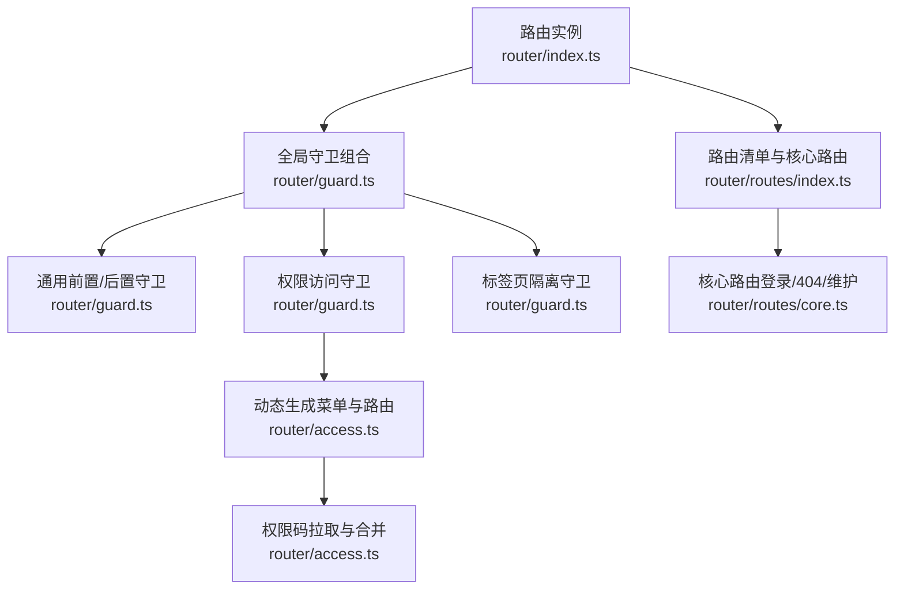
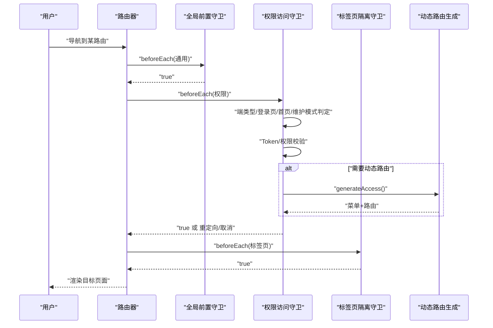
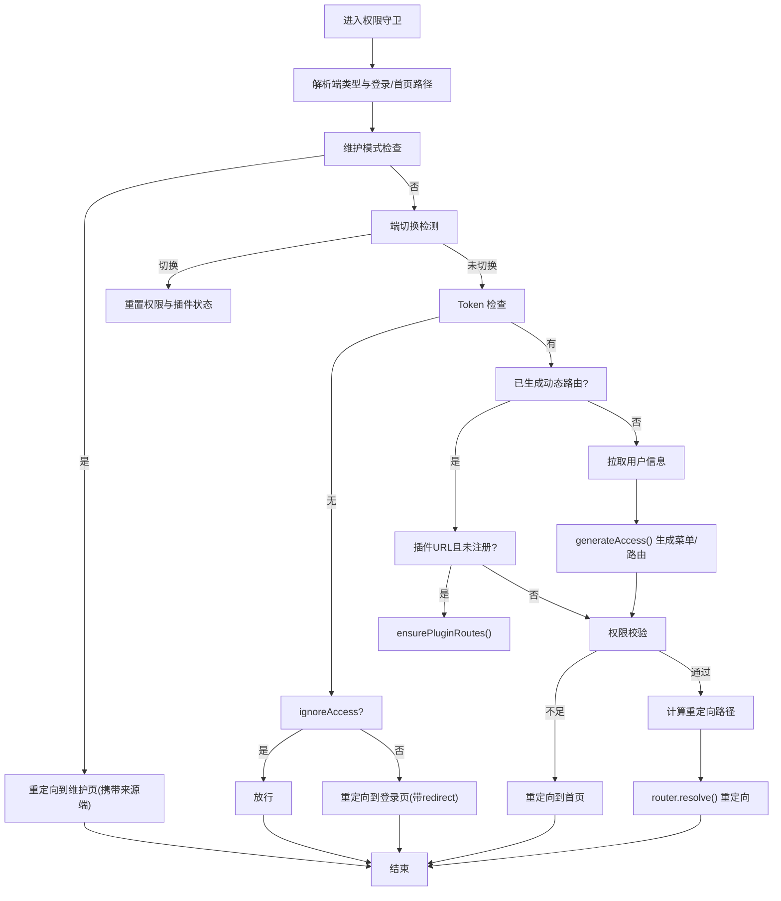
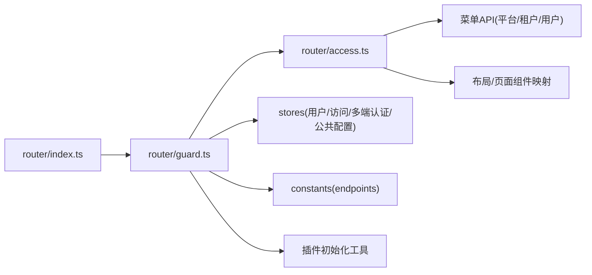

# 导航守卫

<cite>
**本文引用的文件**
- [frontend/apps/web-antd/src/router/index.ts](file://frontend/apps/web-antd/src/router/index.ts)
- [frontend/apps/web-antd/src/router/guard.ts](file://frontend/apps/web-antd/src/router/guard.ts)
- [frontend/apps/web-antd/src/router/access.ts](file://frontend/apps/web-antd/src/router/access.ts)
- [frontend/apps/web-antd/src/router/routes/index.ts](file://frontend/apps/web-antd/src/router/routes/index.ts)
- [frontend/apps/web-antd/src/router/routes/core.ts](file://frontend/apps/web-antd/src/router/routes/core.ts)
</cite>

## 目录
1. [简介](#简介)
2. [项目结构](#项目结构)
3. [核心组件](#核心组件)
4. [架构总览](#架构总览)
5. [详细组件分析](#详细组件分析)
6. [依赖关系分析](#依赖关系分析)
7. [性能考量](#性能考量)
8. [故障排查指南](#故障排查指南)
9. [结论](#结论)
10. [附录](#附录)

## 简介
本文件系统性阐述 Vue Router 导航守卫在本项目中的实现与最佳实践，覆盖以下主题：
- 全局前置守卫、全局解析守卫与全局后置钩子的职责边界与协作方式
- 路由独享守卫与组件内守卫的配置方法与适用场景
- 权限验证、登录状态检查与页面访问控制的策略与实现
- 导航取消、重定向与错误处理的典型流程
- 异步守卫的实现要点与用户体验优化方案

本项目采用“全局前置守卫 + 全局后置钩子”的组合，配合“路由独享守卫”和“组件内守卫”的补充，形成完整的访问控制闭环。

## 项目结构
前端路由相关的关键文件组织如下：
- 路由实例与初始化：[frontend/apps/web-antd/src/router/index.ts](file://frontend/apps/web-antd/src/router/index.ts)
- 导航守卫总入口与三大守卫：[frontend/apps/web-antd/src/router/guard.ts](file://frontend/apps/web-antd/src/router/guard.ts)
- 动态路由与菜单生成、权限码拉取与合并：[frontend/apps/web-antd/src/router/access.ts](file://frontend/apps/web-antd/src/router/access.ts)
- 路由清单与核心路由集合：[frontend/apps/web-antd/src/router/routes/index.ts](file://frontend/apps/web-antd/src/router/routes/index.ts)
- 核心路由（登录、404、维护页等）：[frontend/apps/web-antd/src/router/routes/core.ts](file://frontend/apps/web-antd/src/router/routes/core.ts)

图表来源
- [frontend/apps/web-antd/src/router/index.ts:16-31](file://frontend/apps/web-antd/src/router/index.ts#L16-L31)
- [frontend/apps/web-antd/src/router/guard.ts:496-503](file://frontend/apps/web-antd/src/router/guard.ts#L496-L503)
- [frontend/apps/web-antd/src/router/access.ts:93-139](file://frontend/apps/web-antd/src/router/access.ts#L93-L139)
- [frontend/apps/web-antd/src/router/routes/index.ts:14-21](file://frontend/apps/web-antd/src/router/routes/index.ts#L14-L21)
- [frontend/apps/web-antd/src/router/routes/core.ts:33-109](file://frontend/apps/web-antd/src/router/routes/core.ts#L33-L109)

章节来源
- [frontend/apps/web-antd/src/router/index.ts:16-39](file://frontend/apps/web-antd/src/router/index.ts#L16-L39)
- [frontend/apps/web-antd/src/router/routes/index.ts:14-35](file://frontend/apps/web-antd/src/router/routes/index.ts#L14-L35)
- [frontend/apps/web-antd/src/router/routes/core.ts:33-112](file://frontend/apps/web-antd/src/router/routes/core.ts#L33-L112)

## 核心组件
- 路由实例与历史模式选择、滚动行为与守卫初始化
- 全局前置守卫（通用、权限、标签页隔离）
- 全局解析守卫（通过 router.beforeEach 的返回值实现）
- 全局后置钩子（进度条、页面标记、清理）
- 动态路由与权限生成（菜单 API、权限码、布局/视图映射）

章节来源
- [frontend/apps/web-antd/src/router/index.ts:16-39](file://frontend/apps/web-antd/src/router/index.ts#L16-L39)
- [frontend/apps/web-antd/src/router/guard.ts:57-81](file://frontend/apps/web-antd/src/router/guard.ts#L57-L81)
- [frontend/apps/web-antd/src/router/guard.ts:113-442](file://frontend/apps/web-antd/src/router/guard.ts#L113-L442)
- [frontend/apps/web-antd/src/router/guard.ts:451-489](file://frontend/apps/web-antd/src/router/guard.ts#L451-L489)
- [frontend/apps/web-antd/src/router/access.ts:93-139](file://frontend/apps/web-antd/src/router/access.ts#L93-L139)

## 架构总览
整体流程分为三阶段：
1) 通用阶段：设置页面加载标记、启动/停止进度条
2) 权限阶段：端类型识别、登录/首页路径解析、维护模式、端切换处理、Token/权限校验、动态路由生成
3) 标签页阶段：端切换时清理非当前端标签页

图表来源
- [frontend/apps/web-antd/src/router/guard.ts:57-81](file://frontend/apps/web-antd/src/router/guard.ts#L57-L81)
- [frontend/apps/web-antd/src/router/guard.ts:113-442](file://frontend/apps/web-antd/src/router/guard.ts#L113-L442)
- [frontend/apps/web-antd/src/router/guard.ts:451-489](file://frontend/apps/web-antd/src/router/guard.ts#L451-L489)
- [frontend/apps/web-antd/src/router/access.ts:93-139](file://frontend/apps/web-antd/src/router/access.ts#L93-L139)

## 详细组件分析

### 全局前置守卫（通用）
- 作用：为每个导航设置页面加载标记，首屏启用进度条；对已加载页面跳过重复进入动画
- 关键点：利用 to.meta.loaded 控制过渡效果；结合偏好设置决定是否展示进度条

章节来源
- [frontend/apps/web-antd/src/router/guard.ts:57-81](file://frontend/apps/web-antd/src/router/guard.ts#L57-L81)

### 权限访问守卫（核心）
- 端类型与路径解析：支持根路径结合域名检测，区分 admin、tenant、user 端
- 维护模式：平台/租户配置中开启维护时，非管理员与非登录页统一重定向至维护页，并携带来源端信息
- 端切换处理：检测端类型变化时，清理旧权限、重置插件路由就绪状态
- 登录与首页：未登录访问受控路由时，重定向至对应端登录页；已登录访问登录页时，按 redirect 或用户首页重定向
- Token 与权限：同步 Token 至访问存储；若未生成动态路由，拉取用户信息与权限，生成菜单与路由；权限不足时重定向至首页
- 插件路由：在守卫中同步注册插件路由，避免二次跳转
- 返回值：返回 true 放行；返回对象进行重定向；抛错或异常路径由上层兜底

图表来源
- [frontend/apps/web-antd/src/router/guard.ts:113-442](file://frontend/apps/web-antd/src/router/guard.ts#L113-L442)
- [frontend/apps/web-antd/src/router/access.ts:93-139](file://frontend/apps/web-antd/src/router/access.ts#L93-L139)

章节来源
- [frontend/apps/web-antd/src/router/guard.ts:113-442](file://frontend/apps/web-antd/src/router/guard.ts#L113-L442)
- [frontend/apps/web-antd/src/router/access.ts:93-139](file://frontend/apps/web-antd/src/router/access.ts#L93-L139)

### 标签页隔离守卫
- 作用：端切换时批量关闭非当前端的标签页，保证标签页隔离
- 流程：解析当前端；过滤非当前端标签；批量关闭

章节来源
- [frontend/apps/web-antd/src/router/guard.ts:451-489](file://frontend/apps/web-antd/src/router/guard.ts#L451-L489)

### 全局后置钩子
- 作用：导航完成后记录页面访问、停止进度条、清理重复进入效果
- 行为：更新 loaded 标记、停止进度条

章节来源
- [frontend/apps/web-antd/src/router/guard.ts:71-80](file://frontend/apps/web-antd/src/router/guard.ts#L71-L80)

### 动态路由与权限生成
- 菜单 API 选择：根据端类型选择不同菜单接口
- 权限码拉取：将后端返回的权限码作为权威快照，避免套餐降级导致的残留权限
- 管理端静态子路由补齐：当后端重建 AdminRoot 后，补回静态子路由
- 组件映射：页面与布局组件映射，支持 iframe 布局

章节来源
- [frontend/apps/web-antd/src/router/access.ts:73-85](file://frontend/apps/web-antd/src/router/access.ts#L73-L85)
- [frontend/apps/web-antd/src/router/access.ts:113-132](file://frontend/apps/web-antd/src/router/access.ts#L113-L132)
- [frontend/apps/web-antd/src/router/access.ts:134-136](file://frontend/apps/web-antd/src/router/access.ts#L134-L136)
- [frontend/apps/web-antd/src/router/access.ts:147-150](file://frontend/apps/web-antd/src/router/access.ts#L147-L150)

### 路由清单与核心路由
- 路由清单：由核心路由、各端路由与 404 回退路由组成
- 核心路由：登录、法律文档、404、维护页等基础能力
- 核心路由名称：用于绕过权限检查的基础路由集合

章节来源
- [frontend/apps/web-antd/src/router/routes/index.ts:14-35](file://frontend/apps/web-antd/src/router/routes/index.ts#L14-L35)
- [frontend/apps/web-antd/src/router/routes/core.ts:33-112](file://frontend/apps/web-antd/src/router/routes/core.ts#L33-L112)

## 依赖关系分析
- 路由实例依赖：history 类型、初始 routes、滚动行为
- 守卫依赖：偏好设置、用户/访问/多端认证/公共配置存储、端点常量、插件初始化工具
- 权限生成依赖：菜单 API、布局/页面组件映射、权限模式配置

图表来源
- [frontend/apps/web-antd/src/router/index.ts:16-31](file://frontend/apps/web-antd/src/router/index.ts#L16-L31)
- [frontend/apps/web-antd/src/router/guard.ts:10-21](file://frontend/apps/web-antd/src/router/guard.ts#L10-L21)
- [frontend/apps/web-antd/src/router/access.ts:16-20](file://frontend/apps/web-antd/src/router/access.ts#L16-L20)

章节来源
- [frontend/apps/web-antd/src/router/index.ts:16-39](file://frontend/apps/web-antd/src/router/index.ts#L16-L39)
- [frontend/apps/web-antd/src/router/guard.ts:10-21](file://frontend/apps/web-antd/src/router/guard.ts#L10-L21)
- [frontend/apps/web-antd/src/router/access.ts:16-20](file://frontend/apps/web-antd/src/router/access.ts#L16-L20)

## 性能考量
- 首屏进度条：仅在首次访问时启动，避免重复动画开销
- 已加载页面标记：减少重复进入效果与动画
- 维护模式短路：在权限守卫早期判断，避免后续昂贵操作
- 端切换重置：及时清理旧权限与插件状态，防止内存泄漏与重复计算
- 动态路由生成：仅在必要时拉取用户信息与权限，避免无谓请求

## 故障排查指南
- 登录页循环重定向
  - 现象：登录后仍被重定向到登录页
  - 排查：确认 redirect 查询参数与目标端 Token 匹配；检查端切换逻辑与 TokenStorage
  - 参考
    - [frontend/apps/web-antd/src/router/guard.ts:268-298](file://frontend/apps/web-antd/src/router/guard.ts#L268-L298)
    - [frontend/apps/web-antd/src/router/guard.ts:277-290](file://frontend/apps/web-antd/src/router/guard.ts#L277-L290)
- 权限不足跳转首页
  - 现象：访问受限页面被重定向到首页
  - 排查：核对权限码集合与路由 meta.accessCodes；确认 accessCodesMode
  - 参考
    - [frontend/apps/web-antd/src/router/guard.ts:119-136](file://frontend/apps/web-antd/src/router/guard.ts#L119-L136)
    - [frontend/apps/web-antd/src/router/guard.ts:346-350](file://frontend/apps/web-antd/src/router/guard.ts#L346-L350)
- 维护模式无法访问
  - 现象：开启维护后无法进入后台关闭
  - 排查：管理员路由不受维护模式限制；确认平台/租户配置与来源端传递
  - 参考
    - [frontend/apps/web-antd/src/router/guard.ts:217-248](file://frontend/apps/web-antd/src/router/guard.ts#L217-L248)
- 端切换后标签页混乱
  - 现象：切换端后出现跨端标签页
  - 排查：确认标签页隔离守卫是否正确过滤并批量关闭
  - 参考
    - [frontend/apps/web-antd/src/router/guard.ts:451-489](file://frontend/apps/web-antd/src/router/guard.ts#L451-L489)
- 插件路由 404
  - 现象：访问插件路由提示 404
  - 排查：确认 ensurePluginRoutes 在守卫中已触发并成功注册；必要时重新解析路由
  - 参考
    - [frontend/apps/web-antd/src/router/guard.ts:332-345](file://frontend/apps/web-antd/src/router/guard.ts#L332-L345)
    - [frontend/apps/web-antd/src/router/guard.ts:424-435](file://frontend/apps/web-antd/src/router/guard.ts#L424-L435)

## 结论
本项目通过“通用前置/后置 + 权限前置 + 标签页隔离”的守卫组合，实现了：
- 多端一体化的登录与访问控制
- 维护模式下的灵活放行策略
- 动态路由与权限的高效生成与合并
- 插件路由的无感注册与导航
- 用户体验层面的进度条与过渡优化

建议在新增路由时：
- 明确是否为核心路由（绕过权限）
- 正确设置 meta.accessCodes 与 accessCodesMode
- 对跨端重定向进行防御性校验
- 在组件内补充必要的独享/组件内守卫以满足业务细节

## 附录

### 路由独享守卫与组件内守卫配置方法
- 路由独享守卫
  - 在路由定义的 meta 中设置访问码与模式，结合权限守卫统一校验
  - 对于跨端重定向，需在守卫中解析目标端并校验 Token
  - 参考
    - [frontend/apps/web-antd/src/router/guard.ts:119-136](file://frontend/apps/web-antd/src/router/guard.ts#L119-L136)
    - [frontend/apps/web-antd/src/router/guard.ts:277-290](file://frontend/apps/web-antd/src/router/guard.ts#L277-L290)
- 组件内守卫
  - 在组件中使用 beforeRouteEnter/Leave 等钩子处理局部状态与副作用
  - 与全局守卫协同，确保组件生命周期内权限与数据一致性

### 权限验证、登录状态检查与访问控制策略
- 登录状态：基于端级 TokenStorage 与多端认证存储
- 权限验证：权限码集合与模式（任意/全部）；超管通配符
- 访问控制：核心路由绕过；受控路由动态生成；维护模式短路
- 参考
  - [frontend/apps/web-antd/src/router/guard.ts:300-317](file://frontend/apps/web-antd/src/router/guard.ts#L300-L317)
  - [frontend/apps/web-antd/src/router/guard.ts:119-136](file://frontend/apps/web-antd/src/router/guard.ts#L119-L136)
  - [frontend/apps/web-antd/src/router/guard.ts:217-248](file://frontend/apps/web-antd/src/router/guard.ts#L217-L248)

### 导航取消、重定向与错误处理
- 取消：直接返回 false（在权限守卫中较少使用）
- 重定向：返回包含 path/query/replace 的对象；支持跨端重定向防御
- 错误处理：用户信息拉取失败、菜单生成失败时清理 Token 并重定向登录
- 参考
  - [frontend/apps/web-antd/src/router/guard.ts:360-372](file://frontend/apps/web-antd/src/router/guard.ts#L360-L372)
  - [frontend/apps/web-antd/src/router/guard.ts:390-403](file://frontend/apps/web-antd/src/router/guard.ts#L390-L403)
  - [frontend/apps/web-antd/src/router/guard.ts:308-316](file://frontend/apps/web-antd/src/router/guard.ts#L308-L316)

### 异步守卫实现与用户体验优化
- 异步守卫：权限生成、用户信息拉取、插件路由注册均在守卫中异步完成
- 体验优化：进度条、已加载页面标记、批量关闭非当前端标签页
- 参考
  - [frontend/apps/web-antd/src/router/guard.ts:57-81](file://frontend/apps/web-antd/src/router/guard.ts#L57-L81)
  - [frontend/apps/web-antd/src/router/guard.ts:451-489](file://frontend/apps/web-antd/src/router/guard.ts#L451-L489)
  - [frontend/apps/web-antd/src/router/access.ts:113-126](file://frontend/apps/web-antd/src/router/access.ts#L113-L126)