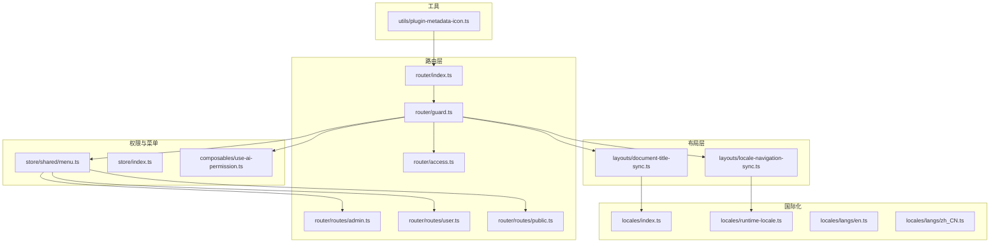
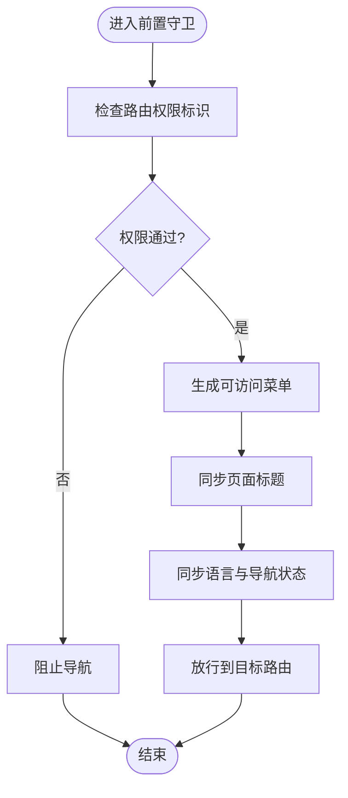
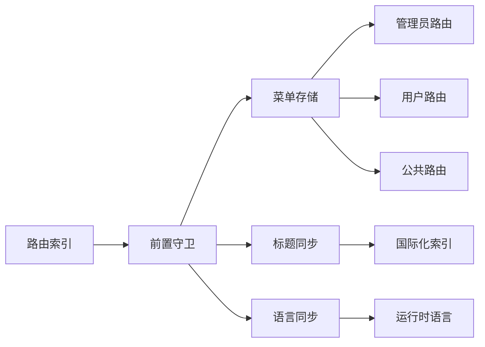

# 路由元信息

<cite>
**本文引用的文件**
- [router/index.ts](file://frontend/apps/web-antd/src/router/index.ts)
- [router/guard.ts](file://frontend/apps/web-antd/src/router/guard.ts)
- [router/access.ts](file://frontend/apps/web-antd/src/router/access.ts)
- [router/routes/admin.ts](file://frontend/apps/web-antd/src/router/routes/admin.ts)
- [router/routes/user.ts](file://frontend/apps/web-antd/src/router/routes/user.ts)
- [router/routes/public.ts](file://frontend/apps/web-antd/src/router/routes/public.ts)
- [layouts/document-title-sync.ts](file://frontend/apps/web-antd/src/layouts/document-title-sync.ts)
- [layouts/locale-navigation-sync.ts](file://frontend/apps/web-antd/src/layouts/locale-navigation-sync.ts)
- [locales/index.ts](file://frontend/apps/web-antd/src/locales/index.ts)
- [locales/runtime-locale.ts](file://frontend/apps/web-antd/src/locales/runtime-locale.ts)
- [locales/langs/en.ts](file://frontend/apps/web-antd/src/locales/langs/en.ts)
- [locales/langs/zh_CN.ts](file://frontend/apps/web-antd/src/locales/langs/zh_CN.ts)
- [composables/use-ai-permission.ts](file://frontend/apps/web-antd/src/composables/use-ai-permission.ts)
- [utils/plugin-metadata-icon.ts](file://frontend/apps/web-antd/src/utils/plugin-metadata-icon.ts)
- [store/index.ts](file://frontend/apps/web-antd/src/store/index.ts)
- [store/shared/menu.ts](file://frontend/apps/web-antd/src/store/shared/menu.ts)
- [app.vue](file://frontend/apps/web-antd/src/app.vue)
- [main.ts](file://frontend/apps/web-antd/src/main.ts)
</cite>

## 目录
1. [引言](#引言)
2. [项目结构](#项目结构)
3. [核心组件](#核心组件)
4. [架构总览](#架构总览)
5. [详细组件分析](#详细组件分析)
6. [依赖关系分析](#依赖关系分析)
7. [性能考虑](#性能考虑)
8. [故障排查指南](#故障排查指南)
9. [结论](#结论)
10. [附录](#附录)

## 引言
本技术文档系统性阐述前端路由元信息（Meta）管理系统的定义、配置与使用方式，覆盖面包屑导航、页面标题、图标与权限标识等元信息的配置与继承机制、默认值设定与动态更新策略，并给出在布局组件中的使用方法与最佳实践。同时，文档涵盖元信息的国际化支持与多语言标题管理，帮助开发者在复杂业务场景中高效、一致地维护路由元信息。

## 项目结构
前端路由元信息体系主要分布在以下模块：
- 路由与守卫：定义路由表、访问控制与全局前置守卫
- 布局与标题同步：负责页面标题与导航状态的实时更新
- 国际化：提供多语言标题与导航文案
- 权限与菜单：基于权限与菜单数据驱动元信息渲染
- 工具与组合式函数：提供图标解析、权限判断等能力



图表来源
- [router/index.ts:1-200](file://frontend/apps/web-antd/src/router/index.ts#L1-L200)
- [router/guard.ts:1-200](file://frontend/apps/web-antd/src/router/guard.ts#L1-L200)
- [router/access.ts:1-200](file://frontend/apps/web-antd/src/router/access.ts#L1-L200)
- [router/routes/admin.ts:1-200](file://frontend/apps/web-antd/src/router/routes/admin.ts#L1-L200)
- [router/routes/user.ts:1-200](file://frontend/apps/web-antd/src/router/routes/user.ts#L1-L200)
- [router/routes/public.ts:1-200](file://frontend/apps/web-antd/src/router/routes/public.ts#L1-L200)
- [layouts/document-title-sync.ts:1-200](file://frontend/apps/web-antd/src/layouts/document-title-sync.ts#L1-L200)
- [layouts/locale-navigation-sync.ts:1-200](file://frontend/apps/web-antd/src/layouts/locale-navigation-sync.ts#L1-L200)
- [locales/index.ts:1-200](file://frontend/apps/web-antd/src/locales/index.ts#L1-L200)
- [locales/runtime-locale.ts:1-200](file://frontend/apps/web-antd/src/locales/runtime-locale.ts#L1-L200)
- [locales/langs/en.ts:1-200](file://frontend/apps/web-antd/src/locales/langs/en.ts#L1-L200)
- [locales/langs/zh_CN.ts:1-200](file://frontend/apps/web-antd/src/locales/langs/zh_CN.ts#L1-L200)
- [store/shared/menu.ts:1-200](file://frontend/apps/web-antd/src/store/shared/menu.ts#L1-L200)
- [store/index.ts:1-200](file://frontend/apps/web-antd/src/store/index.ts#L1-L200)
- [composables/use-ai-permission.ts:1-200](file://frontend/apps/web-antd/src/composables/use-ai-permission.ts#L1-L200)
- [utils/plugin-metadata-icon.ts:1-200](file://frontend/apps/web-antd/src/utils/plugin-metadata-icon.ts#L1-L200)

章节来源
- [router/index.ts:1-200](file://frontend/apps/web-antd/src/router/index.ts#L1-L200)
- [router/guard.ts:1-200](file://frontend/apps/web-antd/src/router/guard.ts#L1-L200)
- [router/access.ts:1-200](file://frontend/apps/web-antd/src/router/access.ts#L1-L200)
- [router/routes/admin.ts:1-200](file://frontend/apps/web-antd/src/router/routes/admin.ts#L1-L200)
- [router/routes/user.ts:1-200](file://frontend/apps/web-antd/src/router/routes/user.ts#L1-L200)
- [router/routes/public.ts:1-200](file://frontend/apps/web-antd/src/router/routes/public.ts#L1-L200)
- [layouts/document-title-sync.ts:1-200](file://frontend/apps/web-antd/src/layouts/document-title-sync.ts#L1-L200)
- [layouts/locale-navigation-sync.ts:1-200](file://frontend/apps/web-antd/src/layouts/locale-navigation-sync.ts#L1-L200)
- [locales/index.ts:1-200](file://frontend/apps/web-antd/src/locales/index.ts#L1-L200)
- [locales/runtime-locale.ts:1-200](file://frontend/apps/web-antd/src/locales/runtime-locale.ts#L1-L200)
- [locales/langs/en.ts:1-200](file://frontend/apps/web-antd/src/locales/langs/en.ts#L1-L200)
- [locales/langs/zh_CN.ts:1-200](file://frontend/apps/web-antd/src/locales/langs/zh_CN.ts#L1-L200)
- [store/shared/menu.ts:1-200](file://frontend/apps/web-antd/src/store/shared/menu.ts#L1-L200)
- [store/index.ts:1-200](file://frontend/apps/web-antd/src/store/index.ts#L1-L200)
- [composables/use-ai-permission.ts:1-200](file://frontend/apps/web-antd/src/composables/use-ai-permission.ts#L1-L200)
- [utils/plugin-metadata-icon.ts:1-200](file://frontend/apps/web-antd/src/utils/plugin-metadata-icon.ts#L1-L200)

## 核心组件
- 路由与元信息定义
  - 在路由表中通过 meta 字段声明页面标题、面包屑、图标、权限标识等元信息
  - 支持父子路由的元信息继承与覆盖
- 全局前置守卫
  - 在导航前统一处理权限校验、菜单生成、标题与导航同步
- 布局与标题同步
  - 动态更新 document.title，确保与当前路由一致
  - 同步导航状态（如当前语言、面包屑链）
- 国际化
  - 多语言标题与导航文案通过 i18n 系统提供
- 权限与菜单
  - 基于权限与菜单数据动态生成可访问的路由树
  - 图标通过插件元数据或静态映射解析

章节来源
- [router/index.ts:1-200](file://frontend/apps/web-antd/src/router/index.ts#L1-L200)
- [router/guard.ts:1-200](file://frontend/apps/web-antd/src/router/guard.ts#L1-L200)
- [layouts/document-title-sync.ts:1-200](file://frontend/apps/web-antd/src/layouts/document-title-sync.ts#L1-L200)
- [layouts/locale-navigation-sync.ts:1-200](file://frontend/apps/web-antd/src/layouts/locale-navigation-sync.ts#L1-L200)
- [locales/index.ts:1-200](file://frontend/apps/web-antd/src/locales/index.ts#L1-L200)
- [store/shared/menu.ts:1-200](file://frontend/apps/web-antd/src/store/shared/menu.ts#L1-L200)
- [utils/plugin-metadata-icon.ts:1-200](file://frontend/apps/web-antd/src/utils/plugin-metadata-icon.ts#L1-L200)

## 架构总览
路由元信息系统围绕“路由表 -> 守卫 -> 布局/国际化/权限 -> 页面渲染”的主流程展开，形成清晰的数据流与职责边界。

```mermaid
sequenceDiagram
participant U as "用户"
participant Router as "路由实例"
participant Guard as "前置守卫"
participant Menu as "菜单存储"
participant Title as "标题同步"
participant Locale as "语言同步"
participant Page as "页面组件"
U->>Router : 导航到目标路由
Router->>Guard : 触发前置守卫
Guard->>Menu : 生成/更新可访问菜单
Guard->>Title : 设置页面标题
Guard->>Locale : 同步语言与导航状态
Guard-->>Router : 放行
Router-->>Page : 渲染目标页面
```

图表来源
- [router/guard.ts:1-200](file://frontend/apps/web-antd/src/router/guard.ts#L1-L200)
- [store/shared/menu.ts:1-200](file://frontend/apps/web-antd/src/store/shared/menu.ts#L1-L200)
- [layouts/document-title-sync.ts:1-200](file://frontend/apps/web-antd/src/layouts/document-title-sync.ts#L1-L200)
- [layouts/locale-navigation-sync.ts:1-200](file://frontend/apps/web-antd/src/layouts/locale-navigation-sync.ts#L1-L200)

## 详细组件分析

### 路由与元信息定义
- 元信息字段
  - 标题：用于页面标题与面包屑显示
  - 面包屑：描述路径层级与跳转
  - 图标：页面或菜单项的视觉标识
  - 权限：访问控制标识，决定是否可访问
- 继承与覆盖
  - 子路由未显式声明时，自动继承父级元信息
  - 子路由可覆盖父级同名字段以实现差异化展示
- 默认值
  - 未声明标题时采用默认文案
  - 未声明图标时采用默认占位
  - 未声明权限时默认开放访问或需要进一步校验

章节来源
- [router/index.ts:1-200](file://frontend/apps/web-antd/src/router/index.ts#L1-L200)
- [router/routes/admin.ts:1-200](file://frontend/apps/web-antd/src/router/routes/admin.ts#L1-L200)
- [router/routes/user.ts:1-200](file://frontend/apps/web-antd/src/router/routes/user.ts#L1-L200)
- [router/routes/public.ts:1-200](file://frontend/apps/web-antd/src/router/routes/public.ts#L1-L200)

### 全局前置守卫
- 职责
  - 权限校验：根据路由元信息与用户权限判断放行
  - 菜单生成：基于权限与路由元信息构建可访问菜单树
  - 标题同步：调用标题同步模块设置 document.title
  - 语言同步：同步当前语言与导航状态
- 流程
  - 进入守卫后先进行权限判断
  - 若通过则生成菜单并同步导航状态
  - 最终放行到目标路由



图表来源
- [router/guard.ts:1-200](file://frontend/apps/web-antd/src/router/guard.ts#L1-L200)
- [router/access.ts:1-200](file://frontend/apps/web-antd/src/router/access.ts#L1-L200)
- [store/shared/menu.ts:1-200](file://frontend/apps/web-antd/src/store/shared/menu.ts#L1-L200)
- [layouts/document-title-sync.ts:1-200](file://frontend/apps/web-antd/src/layouts/document-title-sync.ts#L1-L200)
- [layouts/locale-navigation-sync.ts:1-200](file://frontend/apps/web-antd/src/layouts/locale-navigation-sync.ts#L1-L200)

章节来源
- [router/guard.ts:1-200](file://frontend/apps/web-antd/src/router/guard.ts#L1-L200)
- [router/access.ts:1-200](file://frontend/apps/web-antd/src/router/access.ts#L1-L200)
- [store/shared/menu.ts:1-200](file://frontend/apps/web-antd/src/store/shared/menu.ts#L1-L200)

### 布局与标题同步
- 页面标题同步
  - 依据当前路由元信息中的标题字段动态设置 document.title
  - 支持多语言标题，优先从国际化资源获取
- 导航状态同步
  - 同步当前语言、面包屑链与选中项状态
  - 与菜单存储联动，保证导航一致性

章节来源
- [layouts/document-title-sync.ts:1-200](file://frontend/apps/web-antd/src/layouts/document-title-sync.ts#L1-L200)
- [layouts/locale-navigation-sync.ts:1-200](file://frontend/apps/web-antd/src/layouts/locale-navigation-sync.ts#L1-L200)
- [locales/index.ts:1-200](file://frontend/apps/web-antd/src/locales/index.ts#L1-L200)

### 国际化与多语言标题
- 多语言资源
  - 英文与简体中文标题与导航文案分别维护
  - 运行时语言切换通过运行时语言模块生效
- 标题选择策略
  - 优先使用路由元信息中的多语言键值
  - 若未提供，则回退到默认标题或从菜单数据推导

章节来源
- [locales/index.ts:1-200](file://frontend/apps/web-antd/src/locales/index.ts#L1-L200)
- [locales/runtime-locale.ts:1-200](file://frontend/apps/web-antd/src/locales/runtime-locale.ts#L1-L200)
- [locales/langs/en.ts:1-200](file://frontend/apps/web-antd/src/locales/langs/en.ts#L1-L200)
- [locales/langs/zh_CN.ts:1-200](file://frontend/apps/web-antd/src/locales/langs/zh_CN.ts#L1-L200)

### 权限标识与菜单驱动
- 权限标识
  - 路由元信息中的权限字段用于控制访问
  - 结合权限组合式函数进行细粒度校验
- 菜单驱动
  - 菜单存储根据权限过滤生成可访问路由树
  - 菜单项与路由元信息保持一致，确保导航与访问一致

章节来源
- [composables/use-ai-permission.ts:1-200](file://frontend/apps/web-antd/src/composables/use-ai-permission.ts#L1-L200)
- [store/shared/menu.ts:1-200](file://frontend/apps/web-antd/src/store/shared/menu.ts#L1-L200)

### 图标与元信息关联
- 图标解析
  - 插件元数据图标通过工具函数解析并注入到路由元信息
  - 未提供插件图标的路由可使用默认图标或静态映射
- 图标应用
  - 菜单与面包屑组件消费元信息中的图标字段
  - 确保视觉一致性与可识别性

章节来源
- [utils/plugin-metadata-icon.ts:1-200](file://frontend/apps/web-antd/src/utils/plugin-metadata-icon.ts#L1-L200)

## 依赖关系分析
- 路由层依赖
  - 路由表依赖权限与菜单存储以生成可访问树
  - 守卫依赖国际化与标题同步模块
- 布局层依赖
  - 标题同步依赖国际化资源
  - 导航同步依赖运行时语言与菜单存储
- 权限与菜单
  - 权限组合式函数与菜单存储双向协作
  - 路由元信息作为权限与菜单的输入



图表来源
- [router/index.ts:1-200](file://frontend/apps/web-antd/src/router/index.ts#L1-L200)
- [router/guard.ts:1-200](file://frontend/apps/web-antd/src/router/guard.ts#L1-L200)
- [store/shared/menu.ts:1-200](file://frontend/apps/web-antd/src/store/shared/menu.ts#L1-L200)
- [layouts/document-title-sync.ts:1-200](file://frontend/apps/web-antd/src/layouts/document-title-sync.ts#L1-L200)
- [layouts/locale-navigation-sync.ts:1-200](file://frontend/apps/web-antd/src/layouts/locale-navigation-sync.ts#L1-L200)
- [locales/index.ts:1-200](file://frontend/apps/web-antd/src/locales/index.ts#L1-L200)
- [locales/runtime-locale.ts:1-200](file://frontend/apps/web-antd/src/locales/runtime-locale.ts#L1-L200)
- [router/routes/admin.ts:1-200](file://frontend/apps/web-antd/src/router/routes/admin.ts#L1-L200)
- [router/routes/user.ts:1-200](file://frontend/apps/web-antd/src/router/routes/user.ts#L1-L200)
- [router/routes/public.ts:1-200](file://frontend/apps/web-antd/src/router/routes/public.ts#L1-L200)

章节来源
- [router/index.ts:1-200](file://frontend/apps/web-antd/src/router/index.ts#L1-L200)
- [router/guard.ts:1-200](file://frontend/apps/web-antd/src/router/guard.ts#L1-L200)
- [store/shared/menu.ts:1-200](file://frontend/apps/web-antd/src/store/shared/menu.ts#L1-L200)
- [layouts/document-title-sync.ts:1-200](file://frontend/apps/web-antd/src/layouts/document-title-sync.ts#L1-L200)
- [layouts/locale-navigation-sync.ts:1-200](file://frontend/apps/web-antd/src/layouts/locale-navigation-sync.ts#L1-L200)
- [locales/index.ts:1-200](file://frontend/apps/web-antd/src/locales/index.ts#L1-L200)
- [locales/runtime-locale.ts:1-200](file://frontend/apps/web-antd/src/locales/runtime-locale.ts#L1-L200)
- [router/routes/admin.ts:1-200](file://frontend/apps/web-antd/src/router/routes/admin.ts#L1-L200)
- [router/routes/user.ts:1-200](file://frontend/apps/web-antd/src/router/routes/user.ts#L1-L200)
- [router/routes/public.ts:1-200](file://frontend/apps/web-antd/src/router/routes/public.ts#L1-L200)

## 性能考虑
- 路由守卫轻量化
  - 将权限计算与菜单生成限制在必要范围，避免重复计算
- 标题与导航同步
  - 仅在路由变更时触发同步，减少 DOM 操作
- 国际化缓存
  - 利用运行时语言模块的缓存机制，降低翻译开销
- 图标懒加载
  - 插件图标按需解析与注入，避免一次性加载过多资源

## 故障排查指南
- 页面标题未更新
  - 检查路由元信息中标题字段是否正确配置
  - 确认前置守卫已调用标题同步模块
- 面包屑不显示
  - 确认路由元信息中面包屑字段存在且格式正确
  - 检查菜单存储是否成功生成对应节点
- 图标缺失
  - 检查插件元数据图标解析逻辑
  - 确认未提供插件图标时的默认回退逻辑
- 权限导致无法访问
  - 使用权限组合式函数验证当前用户权限
  - 检查路由元信息中的权限标识与实际权限是否匹配

章节来源
- [layouts/document-title-sync.ts:1-200](file://frontend/apps/web-antd/src/layouts/document-title-sync.ts#L1-L200)
- [store/shared/menu.ts:1-200](file://frontend/apps/web-antd/src/store/shared/menu.ts#L1-L200)
- [composables/use-ai-permission.ts:1-200](file://frontend/apps/web-antd/src/composables/use-ai-permission.ts#L1-L200)
- [utils/plugin-metadata-icon.ts:1-200](file://frontend/apps/web-antd/src/utils/plugin-metadata-icon.ts#L1-L200)

## 结论
该路由元信息管理系统通过“路由表 + 守卫 + 布局/国际化/权限 + 菜单”的协同，实现了元信息的统一定义、继承与动态更新。系统具备良好的扩展性与可维护性，能够满足多语言、多权限、多视图下的元信息一致性需求。建议在新增路由时遵循统一的元信息规范，并在国际化与权限方面保持与菜单数据的一致性。

## 附录
- 最佳实践
  - 明确元信息字段命名与语义，确保团队一致理解
  - 在父路由中提供通用默认值，子路由仅覆盖差异部分
  - 将国际化键值与路由元信息解耦，便于维护
  - 对权限标识进行分层设计，避免过度复杂的条件判断
- 扩展建议
  - 引入元信息校验规则，确保配置完整性
  - 提供元信息可视化工具，辅助开发调试