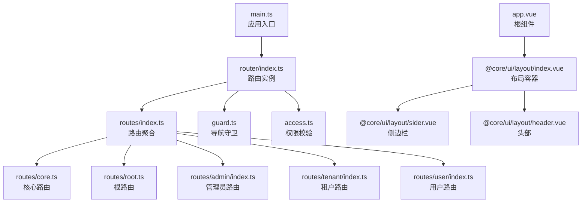
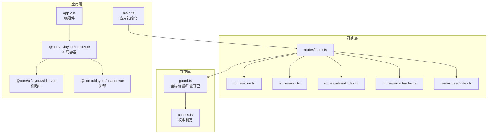
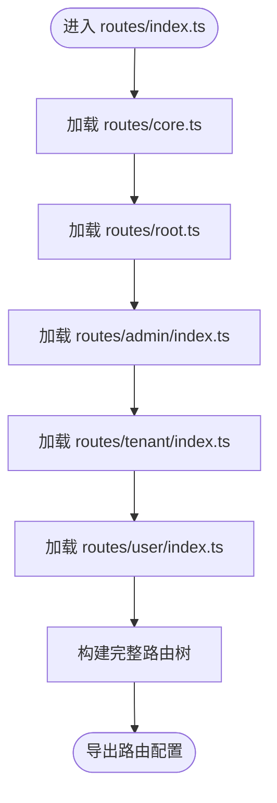
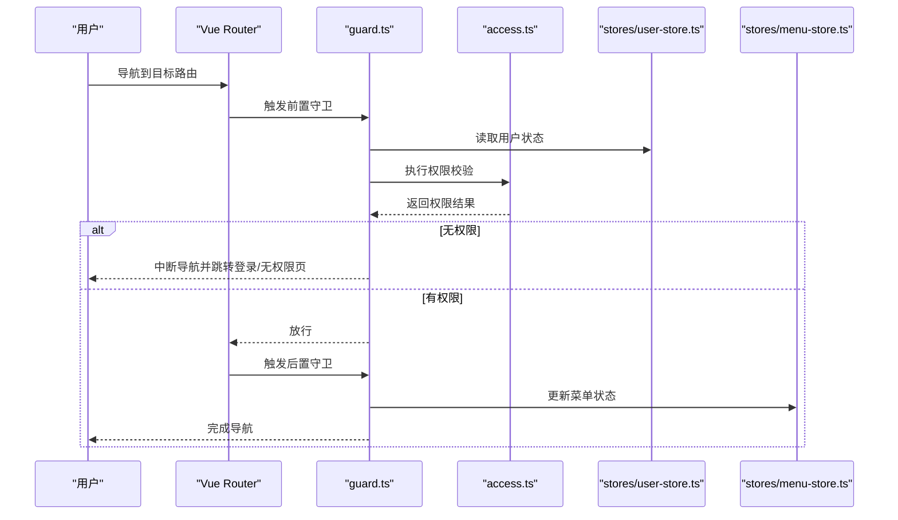
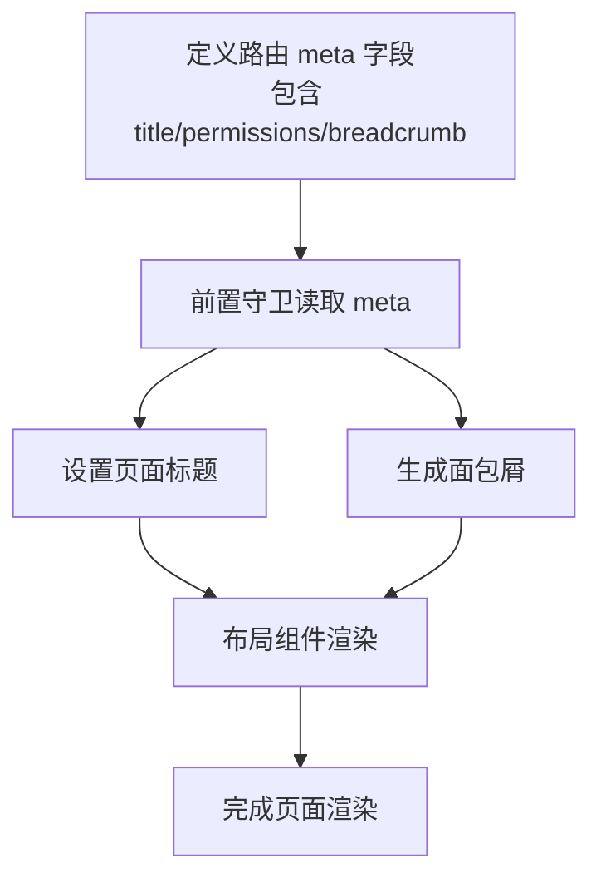
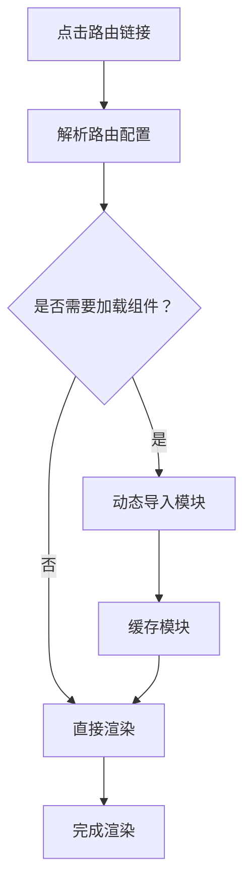
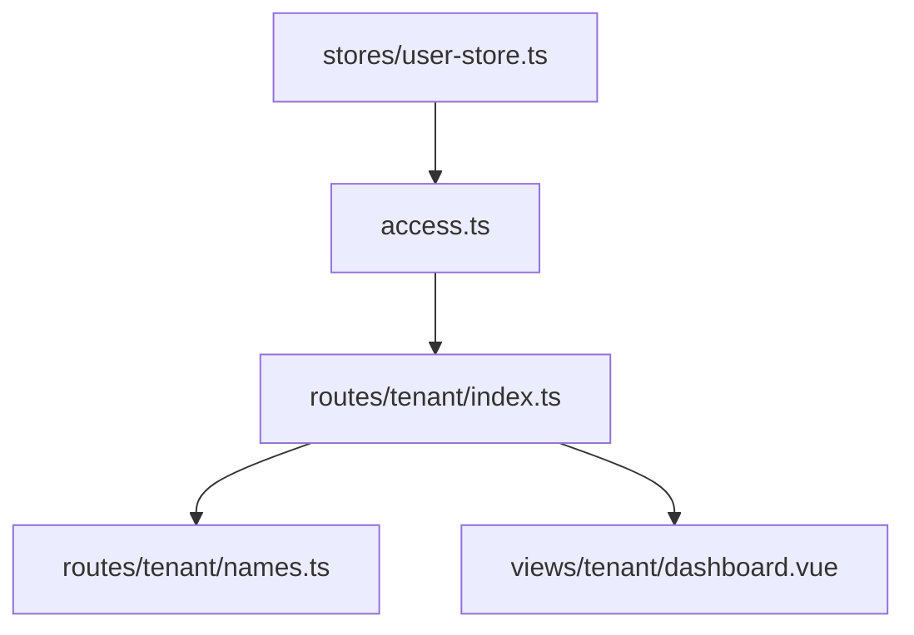
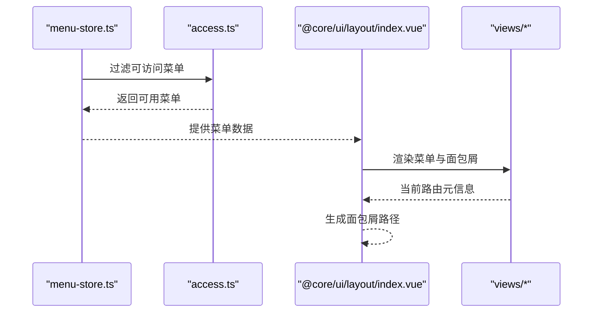
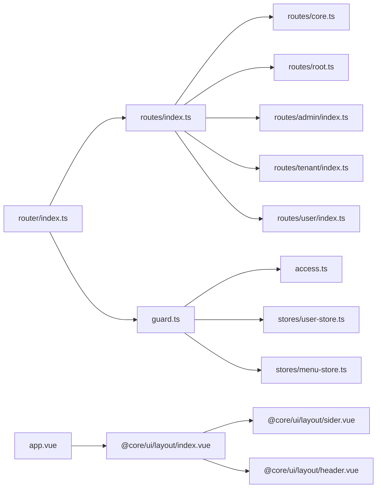

# 路由系统

<cite>
**本文档引用的文件**
- [frontend/apps/web-antd/src/router/index.ts](file://frontend/apps/web-antd/src/router/index.ts)
- [frontend/apps/web-antd/src/router/guard.ts](file://frontend/apps/web-antd/src/router/guard.ts)
- [frontend/apps/web-antd/src/router/access.ts](file://frontend/apps/web-antd/src/router/access.ts)
- [frontend/apps/web-antd/src/router/routes/index.ts](file://frontend/apps/web-antd/src/router/routes/index.ts)
- [frontend/apps/web-antd/src/router/routes/core.ts](file://frontend/apps/web-antd/src/router/routes/core.ts)
- [frontend/apps/web-antd/src/router/routes/root.ts](file://frontend/apps/web-antd/src/router/routes/root.ts)
- [frontend/apps/web-antd/src/router/routes/admin/index.ts](file://frontend/apps/web-antd/src/router/routes/admin/index.ts)
- [frontend/apps/web-antd/src/router/routes/tenant/index.ts](file://frontend/apps/web-antd/src/router/routes/tenant/index.ts)
- [frontend/apps/web-antd/src/router/routes/tenant/names.ts](file://frontend/apps/web-antd/src/router/routes/tenant/names.ts)
- [frontend/apps/web-antd/src/router/routes/user/index.ts](file://frontend/apps/web-antd/src/router/routes/user/index.ts)
- [frontend/apps/web-antd/src/router/routes/__tests__/route-title-locale-keys.test.ts](file://frontend/apps/web-antd/src/router/routes/__tests__/route-title-locale-keys.test.ts)
- [frontend/apps/web-antd/src/main.ts](file://frontend/apps/web-antd/src/main.ts)
- [frontend/apps/web-antd/src/app.vue](file://frontend/apps/web-antd/src/app.vue)
- [frontend/packages/@core/ui/src/layout/index.vue](file://frontend/packages/@core/ui/src/layout/index.vue)
- [frontend/packages/@core/ui/src/layout/sider.vue](file://frontend/packages/@core/ui/src/layout/sider.vue)
- [frontend/packages/@core/ui/src/layout/header.vue](file://frontend/packages/@core/ui/src/layout/header.vue)
- [frontend/apps/web-antd/src/composables/use-permission.ts](file://frontend/apps/web-antd/src/composables/use-permission.ts)
- [frontend/apps/web-antd/src/stores/user-store.ts](file://frontend/apps/web-antd/src/stores/user-store.ts)
- [frontend/apps/web-antd/src/stores/menu-store.ts](file://frontend/apps/web-antd/src/stores/menu-store.ts)
- [frontend/apps/web-antd/src/views/admin/dashboard.vue](file://frontend/apps/web-antd/src/views/admin/dashboard.vue)
- [frontend/apps/web-antd/src/views/tenant/dashboard.vue](file://frontend/apps/web-antd/src/views/tenant/dashboard.vue)
- [frontend/apps/web-antd/src/views/user/dashboard.vue](file://frontend/apps/web-antd/src/views/user/dashboard.vue)
</cite>

## 目录
1. [简介](#简介)
2. [项目结构](#项目结构)
3. [核心组件](#核心组件)
4. [架构总览](#架构总览)
5. [详细组件分析](#详细组件分析)
6. [依赖关系分析](#依赖关系分析)
7. [性能考虑](#性能考虑)
8. [故障排除指南](#故障排除指南)
9. [结论](#结论)

## 简介
本文件为 Vue Router 路由系统的全面技术文档，覆盖路由配置、导航守卫、路由元信息、嵌套结构、动态路由、懒加载、权限控制、面包屑导航、页面标题管理、多租户路由、权限路由与动态菜单等主题。文档基于实际代码库进行分析，并提供架构图、流程图与最佳实践建议，帮助开发者快速理解与扩展路由体系。

## 项目结构
前端路由系统位于 `frontend/apps/web-antd/src/router/` 目录，采用按功能域分层的组织方式：
- 根入口与全局守卫：index.ts、guard.ts、access.ts
- 路由定义：routes/index.ts（聚合）、routes/core.ts（核心路由）、routes/root.ts（根路由）
- 功能域路由：routes/admin/index.ts、routes/tenant/index.ts、routes/user/index.ts
- 租户命名空间：routes/tenant/names.ts
- 测试：routes/__tests__/route-title-locale-keys.test.ts

应用通过 main.ts 初始化路由，app.vue 作为根组件承载布局与路由视图。

**图表来源**
- [frontend/apps/web-antd/src/main.ts](file://frontend/apps/web-antd/src/main.ts)
- [frontend/apps/web-antd/src/router/index.ts](file://frontend/apps/web-antd/src/router/index.ts)
- [frontend/apps/web-antd/src/router/routes/index.ts](file://frontend/apps/web-antd/src/router/routes/index.ts)
- [frontend/apps/web-antd/src/router/routes/core.ts](file://frontend/apps/web-antd/src/router/routes/core.ts)
- [frontend/apps/web-antd/src/router/routes/root.ts](file://frontend/apps/web-antd/src/router/routes/root.ts)
- [frontend/apps/web-antd/src/router/routes/admin/index.ts](file://frontend/apps/web-antd/src/router/routes/admin/index.ts)
- [frontend/apps/web-antd/src/router/routes/tenant/index.ts](file://frontend/apps/web-antd/src/router/routes/tenant/index.ts)
- [frontend/apps/web-antd/src/router/routes/user/index.ts](file://frontend/apps/web-antd/src/router/routes/user/index.ts)
- [frontend/apps/web-antd/src/app.vue](file://frontend/apps/web-antd/src/app.vue)
- [frontend/packages/@core/ui/src/layout/index.vue](file://frontend/packages/@core/ui/src/layout/index.vue)

**章节来源**
- [frontend/apps/web-antd/src/router/index.ts](file://frontend/apps/web-antd/src/router/index.ts)
- [frontend/apps/web-antd/src/router/routes/index.ts](file://frontend/apps/web-antd/src/router/routes/index.ts)
- [frontend/apps/web-antd/src/main.ts](file://frontend/apps/web-antd/src/main.ts)

## 核心组件
- 路由实例与初始化：在路由入口中创建并挂载路由实例，结合 Vue 应用生命周期完成初始化。
- 导航守卫：全局前置守卫用于权限校验、登录拦截与页面标题设置；后置守卫用于统计与埋点。
- 权限控制：基于 access.ts 的权限判定逻辑，结合用户角色与菜单资源进行访问控制。
- 路由元信息：通过 meta 字段传递页面标题、权限标识、面包屑数据等。
- 嵌套与动态路由：支持父子路由嵌套、动态参数匹配与命名路由。
- 懒加载：通过动态导入实现路由级代码分割，提升首屏性能。
- 多租户路由：以租户域名为前缀或通过命名空间隔离不同租户的路由树。
- 动态菜单：结合菜单存储与权限计算，动态生成可访问的导航菜单。

**章节来源**
- [frontend/apps/web-antd/src/router/guard.ts](file://frontend/apps/web-antd/src/router/guard.ts)
- [frontend/apps/web-antd/src/router/access.ts](file://frontend/apps/web-antd/src/router/access.ts)
- [frontend/apps/web-antd/src/router/routes/index.ts](file://frontend/apps/web-antd/src/router/routes/index.ts)

## 架构总览
路由系统围绕“路由定义 + 守卫 + 权限 + 布局”的架构展开。全局守卫负责统一的权限与状态处理，路由定义按域划分清晰职责，布局组件承载面包屑与菜单渲染。

**图表来源**
- [frontend/apps/web-antd/src/router/index.ts](file://frontend/apps/web-antd/src/router/index.ts)
- [frontend/apps/web-antd/src/router/guard.ts](file://frontend/apps/web-antd/src/router/guard.ts)
- [frontend/apps/web-antd/src/router/access.ts](file://frontend/apps/web-antd/src/router/access.ts)
- [frontend/apps/web-antd/src/router/routes/index.ts](file://frontend/apps/web-antd/src/router/routes/index.ts)
- [frontend/apps/web-antd/src/app.vue](file://frontend/apps/web-antd/src/app.vue)
- [frontend/packages/@core/ui/src/layout/index.vue](file://frontend/packages/@core/ui/src/layout/index.vue)

## 详细组件分析

### 路由定义与嵌套结构
- 聚合入口：routes/index.ts 将各域路由聚合，形成统一的路由表。
- 核心路由：routes/core.ts 定义基础页面与通用布局。
- 根路由：routes/root.ts 定义首页与重定向规则。
- 功能域路由：
  - routes/admin/index.ts：管理员域路由，包含后台管理页面。
  - routes/tenant/index.ts：租户域路由，包含租户仪表盘与租户专属页面。
  - routes/user/index.ts：普通用户域路由，包含个人中心等页面。
- 租户命名空间：routes/tenant/names.ts 提供租户路由命名常量，便于统一管理。

**图表来源**
- [frontend/apps/web-antd/src/router/routes/index.ts](file://frontend/apps/web-antd/src/router/routes/index.ts)
- [frontend/apps/web-antd/src/router/routes/core.ts](file://frontend/apps/web-antd/src/router/routes/core.ts)
- [frontend/apps/web-antd/src/router/routes/root.ts](file://frontend/apps/web-antd/src/router/routes/root.ts)
- [frontend/apps/web-antd/src/router/routes/admin/index.ts](file://frontend/apps/web-antd/src/router/routes/admin/index.ts)
- [frontend/apps/web-antd/src/router/routes/tenant/index.ts](file://frontend/apps/web-antd/src/router/routes/tenant/index.ts)
- [frontend/apps/web-antd/src/router/routes/user/index.ts](file://frontend/apps/web-antd/src/router/routes/user/index.ts)

**章节来源**
- [frontend/apps/web-antd/src/router/routes/index.ts](file://frontend/apps/web-antd/src/router/routes/index.ts)
- [frontend/apps/web-antd/src/router/routes/core.ts](file://frontend/apps/web-antd/src/router/routes/core.ts)
- [frontend/apps/web-antd/src/router/routes/root.ts](file://frontend/apps/web-antd/src/router/routes/root.ts)
- [frontend/apps/web-antd/src/router/routes/admin/index.ts](file://frontend/apps/web-antd/src/router/routes/admin/index.ts)
- [frontend/apps/web-antd/src/router/routes/tenant/index.ts](file://frontend/apps/web-antd/src/router/routes/tenant/index.ts)
- [frontend/apps/web-antd/src/router/routes/user/index.ts](file://frontend/apps/web-antd/src/router/routes/user/index.ts)

### 导航守卫与权限控制
- 全局前置守卫：在路由切换前执行权限校验、登录拦截与页面标题设置。
- 全局后置守卫：在路由切换完成后执行埋点与统计。
- 权限判定：access.ts 提供权限判断逻辑，结合用户角色与菜单资源进行访问控制。
- 用户状态：通过 stores/user-store.ts 维护用户信息与登录状态。
- 菜单状态：通过 stores/menu-store.ts 维护动态菜单与当前选中项。

**图表来源**
- [frontend/apps/web-antd/src/router/guard.ts](file://frontend/apps/web-antd/src/router/guard.ts)
- [frontend/apps/web-antd/src/router/access.ts](file://frontend/apps/web-antd/src/router/access.ts)
- [frontend/apps/web-antd/src/stores/user-store.ts](file://frontend/apps/web-antd/src/stores/user-store.ts)
- [frontend/apps/web-antd/src/stores/menu-store.ts](file://frontend/apps/web-antd/src/stores/menu-store.ts)

**章节来源**
- [frontend/apps/web-antd/src/router/guard.ts](file://frontend/apps/web-antd/src/router/guard.ts)
- [frontend/apps/web-antd/src/router/access.ts](file://frontend/apps/web-antd/src/router/access.ts)
- [frontend/apps/web-antd/src/stores/user-store.ts](file://frontend/apps/web-antd/src/stores/user-store.ts)
- [frontend/apps/web-antd/src/stores/menu-store.ts](file://frontend/apps/web-antd/src/stores/menu-store.ts)

### 路由元信息与页面标题管理
- 元信息字段：通过 meta 字段传递页面标题、权限标识、面包屑数据等。
- 标题国际化：测试文件 routes/__tests__/route-title-locale-keys.test.ts 验证标题键的国际化映射。
- 布局与面包屑：app.vue 与 @core/ui/layout 组件配合，根据路由元信息渲染面包屑与页面标题。

**图表来源**
- [frontend/apps/web-antd/src/router/routes/__tests__/route-title-locale-keys.test.ts](file://frontend/apps/web-antd/src/router/routes/__tests__/route-title-locale-keys.test.ts)
- [frontend/apps/web-antd/src/app.vue](file://frontend/apps/web-antd/src/app.vue)
- [frontend/packages/@core/ui/src/layout/index.vue](file://frontend/packages/@core/ui/src/layout/index.vue)

**章节来源**
- [frontend/apps/web-antd/src/router/routes/__tests__/route-title-locale-keys.test.ts](file://frontend/apps/web-antd/src/router/routes/__tests__/route-title-locale-keys.test.ts)
- [frontend/apps/web-antd/src/app.vue](file://frontend/apps/web-antd/src/app.vue)

### 动态路由与懒加载
- 动态导入：通过动态 import 实现路由级代码分割，减少初始包体积。
- 路由懒加载：在路由定义中使用动态导入函数，实现按需加载组件。
- 性能优化：结合路由守卫与缓存策略，避免重复加载已访问页面。

**图表来源**
- [frontend/apps/web-antd/src/router/index.ts](file://frontend/apps/web-antd/src/router/index.ts)

**章节来源**
- [frontend/apps/web-antd/src/router/index.ts](file://frontend/apps/web-antd/src/router/index.ts)

### 多租户路由与权限路由
- 租户域路由：routes/tenant/index.ts 定义租户域内的页面与权限。
- 租户命名空间：routes/tenant/names.ts 提供命名常量，统一管理租户路由。
- 权限路由：结合 access.ts 与用户角色，动态决定租户内可访问的路由。
- 页面示例：views/tenant/dashboard.vue 展示租户仪表盘页面。

**图表来源**
- [frontend/apps/web-antd/src/router/routes/tenant/index.ts](file://frontend/apps/web-antd/src/router/routes/tenant/index.ts)
- [frontend/apps/web-antd/src/router/routes/tenant/names.ts](file://frontend/apps/web-antd/src/router/routes/tenant/names.ts)
- [frontend/apps/web-antd/src/router/access.ts](file://frontend/apps/web-antd/src/router/access.ts)
- [frontend/apps/web-antd/src/stores/user-store.ts](file://frontend/apps/web-antd/src/stores/user-store.ts)
- [frontend/apps/web-antd/src/views/tenant/dashboard.vue](file://frontend/apps/web-antd/src/views/tenant/dashboard.vue)

**章节来源**
- [frontend/apps/web-antd/src/router/routes/tenant/index.ts](file://frontend/apps/web-antd/src/router/routes/tenant/index.ts)
- [frontend/apps/web-antd/src/router/routes/tenant/names.ts](file://frontend/apps/web-antd/src/router/routes/tenant/names.ts)
- [frontend/apps/web-antd/src/router/access.ts](file://frontend/apps/web-antd/src/router/access.ts)
- [frontend/apps/web-antd/src/stores/user-store.ts](file://frontend/apps/web-antd/src/stores/user-store.ts)
- [frontend/apps/web-antd/src/views/tenant/dashboard.vue](file://frontend/apps/web-antd/src/views/tenant/dashboard.vue)

### 动态菜单与面包屑导航
- 动态菜单：stores/menu-store.ts 维护菜单树，结合权限过滤生成可访问菜单。
- 面包屑：layout 组件根据当前路由元信息生成面包屑路径。
- 页面示例：admin 与 user 域的 dashboard 页面展示不同菜单与权限。

**图表来源**
- [frontend/apps/web-antd/src/stores/menu-store.ts](file://frontend/apps/web-antd/src/stores/menu-store.ts)
- [frontend/apps/web-antd/src/router/access.ts](file://frontend/apps/web-antd/src/router/access.ts)
- [frontend/packages/@core/ui/src/layout/index.vue](file://frontend/packages/@core/ui/src/layout/index.vue)
- [frontend/apps/web-antd/src/views/admin/dashboard.vue](file://frontend/apps/web-antd/src/views/admin/dashboard.vue)
- [frontend/apps/web-antd/src/views/user/dashboard.vue](file://frontend/apps/web-antd/src/views/user/dashboard.vue)

**章节来源**
- [frontend/apps/web-antd/src/stores/menu-store.ts](file://frontend/apps/web-antd/src/stores/menu-store.ts)
- [frontend/apps/web-antd/src/router/access.ts](file://frontend/apps/web-antd/src/router/access.ts)
- [frontend/packages/@core/ui/src/layout/index.vue](file://frontend/packages/@core/ui/src/layout/index.vue)
- [frontend/apps/web-antd/src/views/admin/dashboard.vue](file://frontend/apps/web-antd/src/views/admin/dashboard.vue)
- [frontend/apps/web-antd/src/views/user/dashboard.vue](file://frontend/apps/web-antd/src/views/user/dashboard.vue)

## 依赖关系分析
- 路由定义依赖于各域路由文件，最终在 routes/index.ts 聚合。
- 守卫依赖于权限判定与用户状态存储。
- 布局组件依赖于路由元信息与菜单存储。
- 页面视图依赖于布局与权限控制。

**图表来源**
- [frontend/apps/web-antd/src/router/index.ts](file://frontend/apps/web-antd/src/router/index.ts)
- [frontend/apps/web-antd/src/router/routes/index.ts](file://frontend/apps/web-antd/src/router/routes/index.ts)
- [frontend/apps/web-antd/src/router/guard.ts](file://frontend/apps/web-antd/src/router/guard.ts)
- [frontend/apps/web-antd/src/router/access.ts](file://frontend/apps/web-antd/src/router/access.ts)
- [frontend/apps/web-antd/src/stores/user-store.ts](file://frontend/apps/web-antd/src/stores/user-store.ts)
- [frontend/apps/web-antd/src/stores/menu-store.ts](file://frontend/apps/web-antd/src/stores/menu-store.ts)
- [frontend/apps/web-antd/src/app.vue](file://frontend/apps/web-antd/src/app.vue)
- [frontend/packages/@core/ui/src/layout/index.vue](file://frontend/packages/@core/ui/src/layout/index.vue)

**章节来源**
- [frontend/apps/web-antd/src/router/index.ts](file://frontend/apps/web-antd/src/router/index.ts)
- [frontend/apps/web-antd/src/router/routes/index.ts](file://frontend/apps/web-antd/src/router/routes/index.ts)
- [frontend/apps/web-antd/src/router/guard.ts](file://frontend/apps/web-antd/src/router/guard.ts)
- [frontend/apps/web-antd/src/router/access.ts](file://frontend/apps/web-antd/src/router/access.ts)
- [frontend/apps/web-antd/src/stores/user-store.ts](file://frontend/apps/web-antd/src/stores/user-store.ts)
- [frontend/apps/web-antd/src/stores/menu-store.ts](file://frontend/apps/web-antd/src/stores/menu-store.ts)
- [frontend/apps/web-antd/src/app.vue](file://frontend/apps/web-antd/src/app.vue)

## 性能考虑
- 代码分割：使用动态导入实现路由级懒加载，减少首屏加载时间。
- 缓存策略：对已访问页面与菜单进行缓存，避免重复请求与渲染。
- 路由守卫优化：将耗时操作移至后置守卫或异步执行，降低导航延迟。
- 布局复用：共享布局组件，减少重复渲染与 DOM 结构。

[本节为通用性能指导，无需特定文件引用]

## 故障排除指南
- 登录状态异常：检查 stores/user-store.ts 的状态同步与守卫中的登录拦截逻辑。
- 权限不足：确认 access.ts 的权限判定与菜单过滤逻辑，核对用户角色与资源权限。
- 页面标题不显示：检查路由 meta 字段与标题国际化键值，确保测试用例通过。
- 菜单不更新：确认 menu-store.ts 的菜单刷新逻辑与路由切换后的状态同步。

**章节来源**
- [frontend/apps/web-antd/src/stores/user-store.ts](file://frontend/apps/web-antd/src/stores/user-store.ts)
- [frontend/apps/web-antd/src/router/access.ts](file://frontend/apps/web-antd/src/router/access.ts)
- [frontend/apps/web-antd/src/router/routes/__tests__/route-title-locale-keys.test.ts](file://frontend/apps/web-antd/src/router/routes/__tests__/route-title-locale-keys.test.ts)
- [frontend/apps/web-antd/src/stores/menu-store.ts](file://frontend/apps/web-antd/src/stores/menu-store.ts)

## 结论
该路由系统通过清晰的分层设计与完善的守卫机制，实现了权限控制、动态菜单、面包屑与页面标题管理等功能。结合多租户路由与懒加载策略，系统具备良好的可维护性与性能表现。建议在后续迭代中持续完善权限模型与菜单生成逻辑，进一步提升用户体验与开发效率。