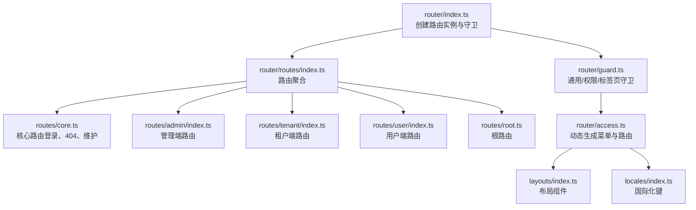
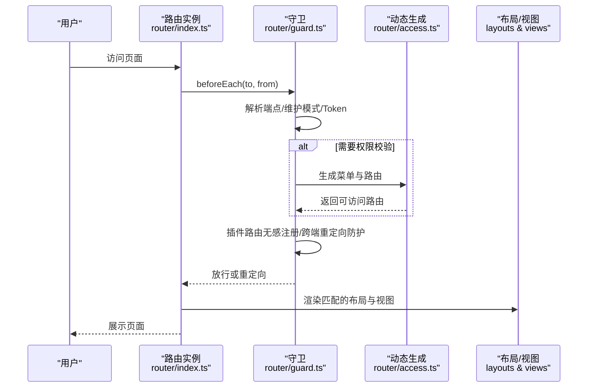
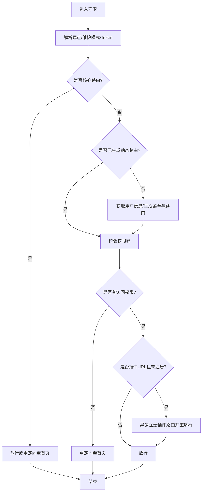
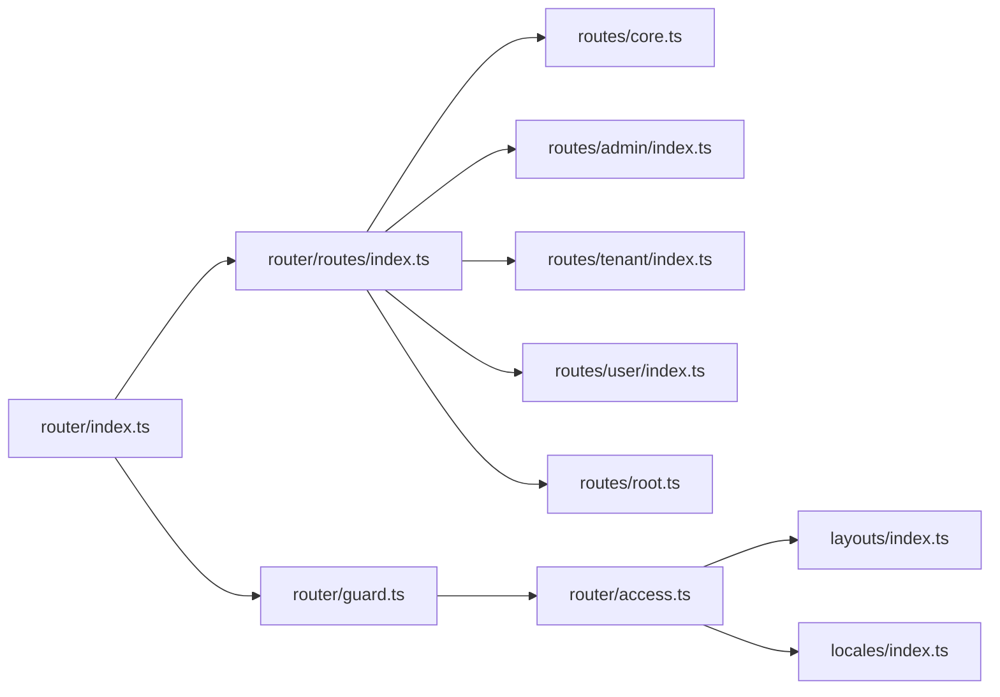

# 路由配置

<cite>
**本文引用的文件**
- [router/index.ts](file://frontend/apps/web-antd/src/router/index.ts)
- [router/guard.ts](file://frontend/apps/web-antd/src/router/guard.ts)
- [router/access.ts](file://frontend/apps/web-antd/src/router/access.ts)
- [router/routes/index.ts](file://frontend/apps/web-antd/src/router/routes/index.ts)
- [router/routes/core.ts](file://frontend/apps/web-antd/src/router/routes/core.ts)
- [router/routes/admin/index.ts](file://frontend/apps/web-antd/src/router/routes/admin/index.ts)
- [router/routes/tenant/index.ts](file://frontend/apps/web-antd/src/router/routes/tenant/index.ts)
- [router/routes/user/index.ts](file://frontend/apps/web-antd/src/router/routes/user/index.ts)
- [router/routes/root.ts](file://frontend/apps/web-antd/src/router/routes/root.ts)
- [router/routes/tenant/names.ts](file://frontend/apps/web-antd/src/router/routes/tenant/names.ts)
- [locales/index.ts](file://frontend/apps/web-antd/src/locales/index.ts)
- [locales/runtime-locale.ts](file://frontend/apps/web-antd/src/locales/runtime-locale.ts)
- [locales/langs/zh_CN.ts](file://frontend/apps/web-antd/src/locales/langs/zh_CN.ts)
- [locales/langs/en.ts](file://frontend/apps/web-antd/src/locales/langs/en.ts)
- [layouts/index.ts](file://frontend/apps/web-antd/src/layouts/index.ts)
- [layouts/basic.vue](file://frontend/apps/web-antd/src/layouts/basic.vue)
- [layouts/user.vue](file://frontend/apps/web-antd/src/layouts/user.vue)
- [layouts/tenant-auth.vue](file://frontend/apps/web-antd/src/layouts/tenant-auth.vue)
- [layouts/admin-auth.vue](file://frontend/apps/web-antd/src/layouts/admin-auth.vue)
- [views/_core/fallback/not-found.vue](file://frontend/apps/web-antd/src/views/_core/fallback/not-found.vue)
- [views/_core/fallback/maintenance.vue](file://frontend/apps/web-antd/src/views/_core/fallback/maintenance.vue)
- [views/_core/fallback/forbidden.vue](file://frontend/apps/web-antd/src/views/_core/fallback/forbidden.vue)
- [views/user/authentication/login.vue](file://frontend/apps/web-antd/src/views/user/authentication/login.vue)
- [views/user/authentication/code-login.vue](file://frontend/apps/web-antd/src/views/user/authentication/code-login.vue)
- [views/user/authentication/qrcode-login.vue](file://frontend/apps/web-antd/src/views/user/authentication/qrcode-login.vue)
- [views/user/authentication/forget-password.vue](file://frontend/apps/web-antd/src/views/user/authentication/forget-password.vue)
- [views/user/authentication/register.vue](file://frontend/apps/web-antd/src/views/user/authentication/register.vue)
- [views/user/authentication/legal-document.vue](file://frontend/apps/web-antd/src/views/user/authentication/legal-document.vue)
</cite>

## 目录
1. [简介](#简介)
2. [项目结构](#项目结构)
3. [核心组件](#核心组件)
4. [架构总览](#架构总览)
5. [详细组件分析](#详细组件分析)
6. [依赖分析](#依赖分析)
7. [性能考虑](#性能考虑)
8. [故障排查指南](#故障排查指南)
9. [结论](#结论)
10. [附录](#附录)

## 简介
本文件系统性梳理前端 Vue Router 的路由配置与运行机制，覆盖以下主题：
- 路由表结构设计与端点分层（平台/租户/用户）
- 路由元信息（meta）与权限控制
- 动态导入与代码分割策略
- 路由参数传递、查询参数处理与重定向机制
- 路由国际化与多语言支持
- 最佳实践、性能优化与错误处理策略

## 项目结构
前端路由位于 `frontend/apps/web-antd/src/router`，采用“端点分层 + 动态生成”的架构：
- 路由入口与历史模式选择：在路由实例中根据环境变量选择 Hash 或 HTML5 History，并设置滚动行为与基础路径。
- 路由守卫：统一的前置守卫负责权限校验、端点识别、维护模式拦截、标签页隔离与插件路由的无感注册。
- 路由生成：基于后端菜单与权限，动态生成可访问的菜单与路由树。
- 路由模块：按端点拆分（admin、tenant、user、root），并合并为最终路由表。

图表来源
- [router/index.ts:16-31](file://frontend/apps/web-antd/src/router/index.ts#L16-L31)
- [router/guard.ts:496-506](file://frontend/apps/web-antd/src/router/guard.ts#L496-L506)
- [router/routes/index.ts:14-21](file://frontend/apps/web-antd/src/router/routes/index.ts#L14-L21)
- [router/access.ts:93-139](file://frontend/apps/web-antd/src/router/access.ts#L93-L139)

章节来源
- [router/index.ts:16-31](file://frontend/apps/web-antd/src/router/index.ts#L16-L31)
- [router/routes/index.ts:14-35](file://frontend/apps/web-antd/src/router/routes/index.ts#L14-L35)
- [router/routes/core.ts:33-112](file://frontend/apps/web-antd/src/router/routes/core.ts#L33-L112)

## 核心组件
- 路由实例与历史模式
  - 支持 Hash 与 HTML5 History 两种模式，通过环境变量切换；默认滚动行为支持锚点平滑定位与历史位置恢复。
- 路由守卫体系
  - 通用守卫：记录页面加载状态、控制进度条。
  - 权限守卫：端点识别、Token 校验、维护模式拦截、动态生成菜单与路由、插件路由无感注册、跨端重定向防护。
  - 标签页守卫：端点隔离，自动清理非当前端的标签页。
- 动态路由生成
  - 基于后端菜单与权限，结合布局与视图映射，生成可访问的路由树；对管理端进行静态子路由补全。
- 路由表聚合
  - 将 core、admin、tenant、root、user 路由模块合并为最终路由表，并导出核心路由名称集合用于绕过权限检查。

章节来源
- [router/index.ts:16-31](file://frontend/apps/web-antd/src/router/index.ts#L16-L31)
- [router/guard.ts:57-81](file://frontend/apps/web-antd/src/router/guard.ts#L57-L81)
- [router/guard.ts:113-442](file://frontend/apps/web-antd/src/router/guard.ts#L113-L442)
- [router/guard.ts:451-489](file://frontend/apps/web-antd/src/router/guard.ts#L451-L489)
- [router/access.ts:93-139](file://frontend/apps/web-antd/src/router/access.ts#L93-L139)
- [router/routes/index.ts:14-35](file://frontend/apps/web-antd/src/router/routes/index.ts#L14-L35)

## 架构总览
下图展示路由初始化、守卫链路与动态生成的关键交互：

图表来源
- [router/index.ts:33-38](file://frontend/apps/web-antd/src/router/index.ts#L33-L38)
- [router/guard.ts:113-442](file://frontend/apps/web-antd/src/router/guard.ts#L113-L442)
- [router/access.ts:93-139](file://frontend/apps/web-antd/src/router/access.ts#L93-L139)

## 详细组件分析

### 路由表结构与端点分层
- 结构设计
  - 路由表由核心路由、端点路由与 404 回退路由组成；核心路由（如登录、维护、404）绕过权限检查。
  - 端点路由按 admin、tenant、user、root 分模块组织，便于按域与权限域隔离。
- 端点识别
  - 通过路径解析与域名探测（平台/租户）确定当前端点，从而决定登录页、首页与品牌配置加载策略。
- 路由元信息
  - 通过 meta 字段控制面包屑、菜单与标签页的可见性，以及标题国际化键与特殊页面模式（如文档页）。

章节来源
- [router/routes/index.ts:14-35](file://frontend/apps/web-antd/src/router/routes/index.ts#L14-L35)
- [router/routes/core.ts:33-112](file://frontend/apps/web-antd/src/router/routes/core.ts#L33-L112)
- [router/guard.ts:34-45](file://frontend/apps/web-antd/src/router/guard.ts#L34-L45)
- [router/guard.ts:149-167](file://frontend/apps/web-antd/src/router/guard.ts#L149-L167)

### 路由懒加载与代码分割
- 动态导入
  - 路由组件与视图均采用动态导入，实现按需加载与代码分割。
- 页面与布局映射
  - 通过 import.meta.glob 收集所有视图模块，并与布局组件映射一起传入动态生成流程。
- 管理端静态子路由补全
  - 在后端菜单重建后，对管理端根路由缺失的静态子路由进行补全，保证编辑/详情等路径可用。

章节来源
- [router/routes/core.ts:8](file://frontend/apps/web-antd/src/router/routes/core.ts#L8)
- [router/routes/core.ts:48](file://frontend/apps/web-antd/src/router/routes/core.ts#L48)
- [router/access.ts:97](file://frontend/apps/web-antd/src/router/access.ts#L97)
- [router/access.ts:103-107](file://frontend/apps/web-antd/src/router/access.ts#L103-L107)
- [router/access.ts:42-67](file://frontend/apps/web-antd/src/router/access.ts#L42-L67)

### 路由参数传递、查询参数与重定向
- 路由参数
  - 通过路由定义中的动态段（如 :id）传递参数，配合守卫解析端点与 Token。
- 查询参数
  - 登录页支持 redirect 查询参数，守卫在放行时会将其规范化并重定向至目标路径；跨端重定向时进行安全校验，防止死循环。
- 维护模式重定向
  - 维护模式开启时，非管理员与非登录页将被重定向至维护页，并携带来源端点；维护模式关闭后自动回到首页。
- 端点切换重定向
  - 租户域访问管理端或平台域访问用户端时，守卫进行端内重定向，确保用户体验与安全边界。

章节来源
- [router/guard.ts:270-296](file://frontend/apps/web-antd/src/router/guard.ts#L270-L296)
- [router/guard.ts:308-317](file://frontend/apps/web-antd/src/router/guard.ts#L308-L317)
- [router/guard.ts:225-248](file://frontend/apps/web-antd/src/router/guard.ts#L225-L248)
- [router/guard.ts:174-182](file://frontend/apps/web-antd/src/router/guard.ts#L174-L182)

### 权限控制与动态路由生成
- 权限模型
  - 基于角色与权限码（accessCodes）进行校验，支持“任意”或“全部”模式；超级管理员通配符放行。
- 动态生成流程
  - 从后端获取菜单与权限码，构建可访问的路由树；将权限码写入状态管理，避免套餐降级导致的残留权限。
  - 对管理端进行静态子路由补全，确保编辑/详情等路径存在。
- 插件路由无感注册
  - 对插件 URL，若尚未注册，守卫在导航时异步注册并重新解析，避免跳转首页造成体验中断。

图表来源
- [router/guard.ts:113-442](file://frontend/apps/web-antd/src/router/guard.ts#L113-L442)
- [router/access.ts:93-139](file://frontend/apps/web-antd/src/router/access.ts#L93-L139)

章节来源
- [router/guard.ts:119-136](file://frontend/apps/web-antd/src/router/guard.ts#L119-L136)
- [router/guard.ts:328-350](file://frontend/apps/web-antd/src/router/guard.ts#L328-L350)
- [router/guard.ts:374-403](file://frontend/apps/web-antd/src/router/guard.ts#L374-L403)
- [router/access.ts:113-132](file://frontend/apps/web-antd/src/router/access.ts#L113-L132)

### 回退与错误处理
- 404 与维护页
  - 全局 404 与维护页路由，隐藏在面包屑、菜单与标签页中，确保错误与维护场景的一致体验。
- 权限不足
  - 使用统一的 Forbidden 页面作为兜底，同时保留菜单项可见性控制。
- 守卫异常
  - 守卫中对用户信息获取、菜单生成与插件注册进行异常捕获，必要时清除 Token 并重定向至登录页。

章节来源
- [router/routes/core.ts:7-17](file://frontend/apps/web-antd/src/router/routes/core.ts#L7-L17)
- [router/routes/core.ts:20-30](file://frontend/apps/web-antd/src/router/routes/core.ts#L20-L30)
- [router/access.ts:22](file://frontend/apps/web-antd/src/router/access.ts#L22)
- [router/guard.ts:360-372](file://frontend/apps/web-antd/src/router/guard.ts#L360-L372)
- [router/guard.ts:390-403](file://frontend/apps/web-antd/src/router/guard.ts#L390-L403)
- [router/guard.ts:424-435](file://frontend/apps/web-antd/src/router/guard.ts#L424-L435)

### 国际化与多语言路由
- 路由标题国际化
  - 路由元信息中使用国际化键（如 page.auth.login），在渲染时通过本地化系统解析。
- 语言运行时切换
  - 提供运行时语言切换能力，结合路由标题键实现界面与导航文案的动态更新。
- 语言包组织
  - 语言包按模块组织，便于扩展与维护。

章节来源
- [router/routes/core.ts:49](file://frontend/apps/web-antd/src/router/routes/core.ts#L49)
- [locales/index.ts](file://frontend/apps/web-antd/src/locales/index.ts)
- [locales/runtime-locale.ts](file://frontend/apps/web-antd/src/locales/runtime-locale.ts)
- [locales/langs/zh_CN.ts](file://frontend/apps/web-antd/src/locales/langs/zh_CN.ts)
- [locales/langs/en.ts](file://frontend/apps/web-antd/src/locales/langs/en.ts)

## 依赖分析
- 路由实例依赖
  - 依赖环境变量选择历史模式与基础路径；依赖滚动行为配置提升用户体验。
- 守卫依赖
  - 依赖状态管理（用户、权限、标签页、公共配置）、端点常量与工具函数；依赖插件初始化组合式函数实现无感注册。
- 动态生成依赖
  - 依赖布局与视图映射、国际化系统与后端菜单接口；对管理端进行静态子路由补全。
- 路由模块依赖
  - 各端路由模块独立维护，最终在聚合文件中统一注入。

图表来源
- [router/index.ts:9-10](file://frontend/apps/web-antd/src/router/index.ts#L9-L10)
- [router/routes/index.ts:6-11](file://frontend/apps/web-antd/src/router/routes/index.ts#L6-L11)
- [router/access.ts:17](file://frontend/apps/web-antd/src/router/access.ts#L17)
- [locales/index.ts](file://frontend/apps/web-antd/src/locales/index.ts)

章节来源
- [router/index.ts:9-10](file://frontend/apps/web-antd/src/router/index.ts#L9-L10)
- [router/routes/index.ts:6-11](file://frontend/apps/web-antd/src/router/routes/index.ts#L6-L11)

## 性能考虑
- 代码分割与懒加载
  - 所有路由组件与视图均采用动态导入，减少首屏体积，提升加载速度。
- 进度条与滚动行为
  - 通过通用守卫控制进度条显示时机，滚动行为支持锚点平滑与历史位置恢复，改善导航体验。
- 动态路由生成优化
  - 仅在首次进入或端点切换时生成动态路由，避免重复计算；对管理端进行静态子路由补全，减少后端依赖。
- 插件路由无感注册
  - 在守卫中异步注册插件路由，避免阻塞主流程，提升首屏稳定性。

章节来源
- [router/index.ts:23-28](file://frontend/apps/web-antd/src/router/index.ts#L23-L28)
- [router/guard.ts:61-79](file://frontend/apps/web-antd/src/router/guard.ts#L61-L79)
- [router/guard.ts:332-345](file://frontend/apps/web-antd/src/router/guard.ts#L332-L345)
- [router/access.ts:42-67](file://frontend/apps/web-antd/src/router/access.ts#L42-L67)

## 故障排查指南
- 登录后仍被重定向至登录页
  - 检查 Token 存储与端点一致性；确认守卫中 Token 读取逻辑与端点解析是否正确。
- 维护模式下无法访问后台
  - 管理端路由应绕过维护模式拦截；确认端点识别与维护模式开关状态。
- 插件路由 404
  - 确认插件路由是否在守卫中完成无感注册；检查插件初始化组合式函数是否成功。
- 跨端重定向死循环
  - 守卫中对跨端重定向目标进行端点校验，若目标端无 Token 则停留在当前登录页，避免死循环。
- 403/权限不足
  - 检查权限码集合与路由元信息中的访问控制模式；确认后端权限是否下发完整。

章节来源
- [router/guard.ts:301-317](file://frontend/apps/web-antd/src/router/guard.ts#L301-L317)
- [router/guard.ts:225-248](file://frontend/apps/web-antd/src/router/guard.ts#L225-L248)
- [router/guard.ts:332-345](file://frontend/apps/web-antd/src/router/guard.ts#L332-L345)
- [router/guard.ts:279-290](file://frontend/apps/web-antd/src/router/guard.ts#L279-L290)
- [router/access.ts:128-132](file://frontend/apps/web-antd/src/router/access.ts#L128-L132)

## 结论
本路由体系通过“端点分层 + 动态生成 + 守卫编排”的方式，实现了高可维护性的权限与导航架构。结合懒加载、代码分割与无感插件注册，兼顾了性能与体验。建议在后续迭代中持续完善国际化键与错误页的统一化，以及对复杂嵌套路由的元信息标准化。

## 附录
- 路由入口与历史模式
  - [router/index.ts:16-31](file://frontend/apps/web-antd/src/router/index.ts#L16-L31)
- 核心路由与回退页
  - [router/routes/core.ts:7-17](file://frontend/apps/web-antd/src/router/routes/core.ts#L7-L17)
  - [router/routes/core.ts:20-30](file://frontend/apps/web-antd/src/router/routes/core.ts#L20-L30)
- 登录与认证视图
  - [views/user/authentication/login.vue](file://frontend/apps/web-antd/src/views/user/authentication/login.vue)
  - [views/user/authentication/code-login.vue](file://frontend/apps/web-antd/src/views/user/authentication/code-login.vue)
  - [views/user/authentication/qrcode-login.vue](file://frontend/apps/web-antd/src/views/user/authentication/qrcode-login.vue)
  - [views/user/authentication/forget-password.vue](file://frontend/apps/web-antd/src/views/user/authentication/forget-password.vue)
  - [views/user/authentication/register.vue](file://frontend/apps/web-antd/src/views/user/authentication/register.vue)
  - [views/user/authentication/legal-document.vue](file://frontend/apps/web-antd/src/views/user/authentication/legal-document.vue)
- 布局组件
  - [layouts/index.ts](file://frontend/apps/web-antd/src/layouts/index.ts)
  - [layouts/basic.vue](file://frontend/apps/web-antd/src/layouts/basic.vue)
  - [layouts/user.vue](file://frontend/apps/web-antd/src/layouts/user.vue)
  - [layouts/tenant-auth.vue](file://frontend/apps/web-antd/src/layouts/tenant-auth.vue)
  - [layouts/admin-auth.vue](file://frontend/apps/web-antd/src/layouts/admin-auth.vue)
- 国际化
  - [locales/index.ts](file://frontend/apps/web-antd/src/locales/index.ts)
  - [locales/runtime-locale.ts](file://frontend/apps/web-antd/src/locales/runtime-locale.ts)
  - [locales/langs/zh_CN.ts](file://frontend/apps/web-antd/src/locales/langs/zh_CN.ts)
  - [locales/langs/en.ts](file://frontend/apps/web-antd/src/locales/langs/en.ts)