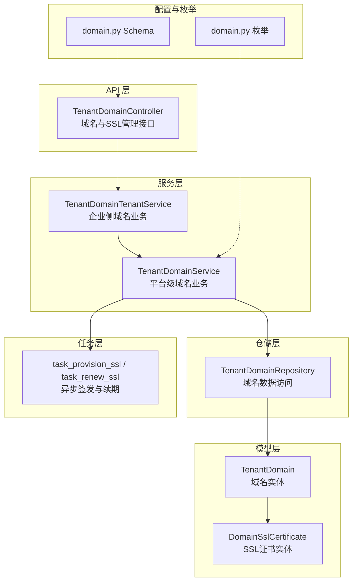
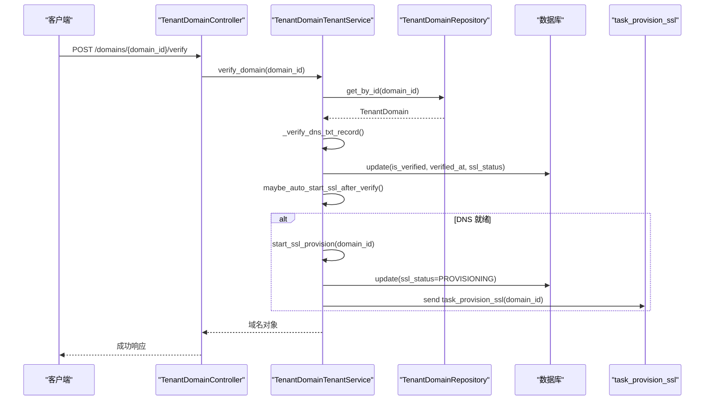
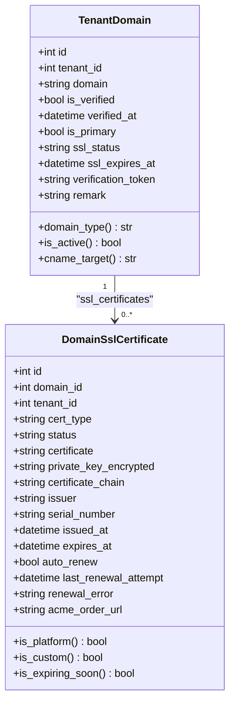
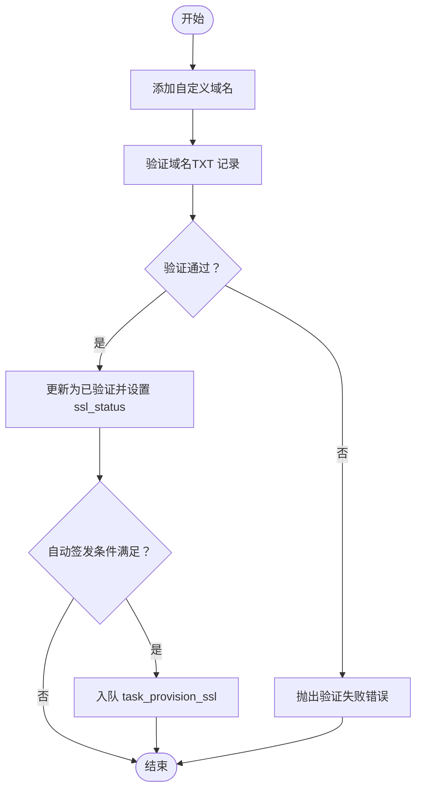
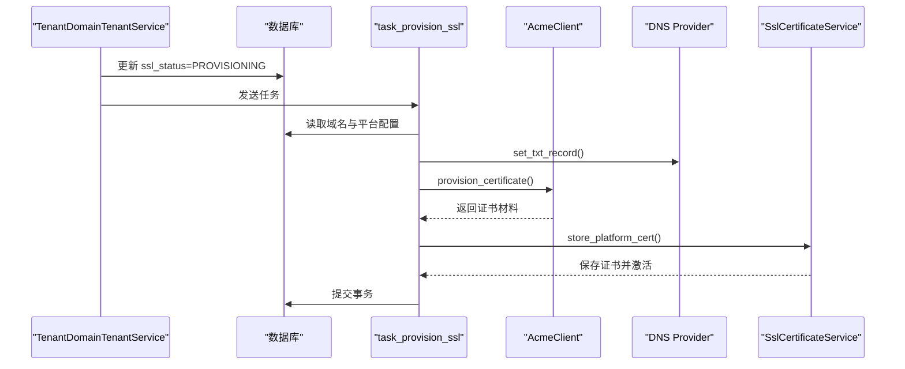
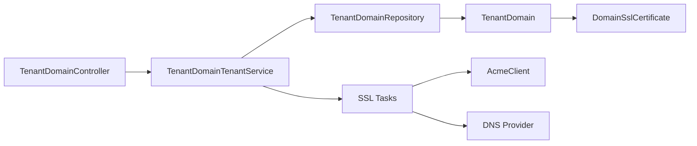

# 域名管理

<cite>
**本文引用的文件**
- [backend/app/services/system/tenant_domain_service.py](file://backend/app/services/system/tenant_domain_service.py)
- [backend/app/models/tenant/tenant_domain.py](file://backend/app/models/tenant/tenant_domain.py)
- [backend/app/models/tenant/domain_ssl_certificate.py](file://backend/app/models/tenant/domain_ssl_certificate.py)
- [backend/app/enums/domain.py](file://backend/app/enums/domain.py)
- [backend/app/repositories/system/tenant_domain_repository.py](file://backend/app/repositories/system/tenant_domain_repository.py)
- [backend/app/schemas/tenant/domain.py](file://backend/app/schemas/tenant/domain.py)
- [backend/app/api/tenant/domains.py](file://backend/app/api/tenant/domains.py)
- [backend/app/tasks/ssl_tasks.py](file://backend/app/tasks/ssl_tasks.py)
- [backend/migrations/versions/20260220_27044bf9d269_add_domain_ssl_certificates_table.py](file://backend/migrations/versions/20260220_27044bf9d269_add_domain_ssl_certificates_table.py)
- [backend/migrations/versions/20260112_0002_tenant_domains.py](file://backend/migrations/versions/20260112_0002_tenant_domains.py)
</cite>

## 目录
1. [简介](#简介)
2. [项目结构](#项目结构)
3. [核心组件](#核心组件)
4. [架构总览](#架构总览)
5. [详细组件分析](#详细组件分析)
6. [依赖分析](#依赖分析)
7. [性能考虑](#性能考虑)
8. [故障排除指南](#故障排除指南)
9. [结论](#结论)
10. [附录](#附录)

## 简介
本技术文档面向域名管理系统，围绕“租户域名的绑定机制、验证流程与解析策略”展开，系统性阐述以下主题：
- 域名的添加、验证、解除绑定与删除
- SSL 证书管理（自动签发、手动上传、续期与到期处理）
- DNS 配置与 HTTPS 重定向策略
- 域名冲突检测、重复验证与异常处理
- 域名与租户的关联关系、主域名优先级与访问控制
- 安全策略、性能优化与故障排除方法
- 实际配置示例与常见问题解决方案

## 项目结构
域名管理功能主要分布在以下层次：
- API 层：对外暴露域名管理与 SSL 管理的 REST 接口
- 控制器层：封装权限校验、参数校验与业务编排
- 服务层：实现业务规则（域名验证、主域名设置、SSL 流程）
- 仓储层：提供数据访问与查询能力
- 模型层：定义数据库表结构与关系
- 任务层：异步执行 SSL 签发与续期
- 枚举与 Schema：统一状态与数据结构定义

图表来源
- [backend/app/api/tenant/domains.py:53-557](file://backend/app/api/tenant/domains.py#L53-L557)
- [backend/app/services/system/tenant_domain_service.py:43-894](file://backend/app/services/system/tenant_domain_service.py#L43-L894)
- [backend/app/repositories/system/tenant_domain_repository.py:14-176](file://backend/app/repositories/system/tenant_domain_repository.py#L14-L176)
- [backend/app/models/tenant/tenant_domain.py:18-196](file://backend/app/models/tenant/tenant_domain.py#L18-L196)
- [backend/app/models/tenant/domain_ssl_certificate.py:17-206](file://backend/app/models/tenant/domain_ssl_certificate.py#L17-L206)
- [backend/app/enums/domain.py:11-47](file://backend/app/enums/domain.py#L11-L47)
- [backend/app/tasks/ssl_tasks.py:40-587](file://backend/app/tasks/ssl_tasks.py#L40-L587)

章节来源
- [backend/app/api/tenant/domains.py:1-557](file://backend/app/api/tenant/domains.py#L1-L557)
- [backend/app/services/system/tenant_domain_service.py:1-894](file://backend/app/services/system/tenant_domain_service.py#L1-L894)
- [backend/app/repositories/system/tenant_domain_repository.py:1-176](file://backend/app/repositories/system/tenant_domain_repository.py#L1-L176)
- [backend/app/models/tenant/tenant_domain.py:1-196](file://backend/app/models/tenant/tenant_domain.py#L1-L196)
- [backend/app/models/tenant/domain_ssl_certificate.py:1-206](file://backend/app/models/tenant/domain_ssl_certificate.py#L1-L206)
- [backend/app/enums/domain.py:1-47](file://backend/app/enums/domain.py#L1-L47)
- [backend/app/tasks/ssl_tasks.py:1-587](file://backend/app/tasks/ssl_tasks.py#L1-L587)

## 核心组件
- 域名模型（TenantDomain）：定义域名实体、唯一约束、索引与辅助属性（类型判断、可用状态、CNAME 目标等）
- SSL 证书模型（DomainSslCertificate）：存储证书内容、状态、类型、自动续期与到期时间
- 域名服务（TenantDomainService/TenantDomainTenantService）：实现域名生命周期管理、验证、主域名设置、SSL 流程与 DNS 集成
- 域名仓储（TenantDomainRepository）：提供按租户查询、主域名清理、唯一性校验等数据访问
- API 控制器（TenantDomainController）：封装权限、参数校验与业务编排，暴露 REST 接口
- 任务（SSL Tasks）：异步执行 ACME 签发与续期，支持重试与失败标记
- 枚举与 Schema：统一状态与请求/响应结构

章节来源
- [backend/app/models/tenant/tenant_domain.py:18-196](file://backend/app/models/tenant/tenant_domain.py#L18-L196)
- [backend/app/models/tenant/domain_ssl_certificate.py:17-206](file://backend/app/models/tenant/domain_ssl_certificate.py#L17-L206)
- [backend/app/services/system/tenant_domain_service.py:43-894](file://backend/app/services/system/tenant_domain_service.py#L43-L894)
- [backend/app/repositories/system/tenant_domain_repository.py:14-176](file://backend/app/repositories/system/tenant_domain_repository.py#L14-L176)
- [backend/app/schemas/tenant/domain.py:16-174](file://backend/app/schemas/tenant/domain.py#L16-L174)
- [backend/app/enums/domain.py:11-47](file://backend/app/enums/domain.py#L11-L47)
- [backend/app/tasks/ssl_tasks.py:40-587](file://backend/app/tasks/ssl_tasks.py#L40-L587)

## 架构总览
域名管理采用“控制器-服务-仓储-模型-任务”的分层架构，结合异步任务完成 SSL 的自动化处理。平台级服务负责全局域名校验与 DNS 集成，企业侧服务在租户维度进行隔离与权限控制。

图表来源
- [backend/app/api/tenant/domains.py:284-324](file://backend/app/api/tenant/domains.py#L284-L324)
- [backend/app/services/system/tenant_domain_service.py:418-476](file://backend/app/services/system/tenant_domain_service.py#L418-L476)
- [backend/app/tasks/ssl_tasks.py:40-214](file://backend/app/tasks/ssl_tasks.py#L40-L214)

## 详细组件分析

### 域名模型与关系
- 域名实体包含租户外键、唯一域名、验证状态、主域名标记、SSL 状态与到期时间、验证 Token、备注等字段，并定义复合索引以保证主域名唯一性
- 域名与租户、SSL 证书存在一对多关系；删除域名时级联删除其证书
- 提供辅助属性用于判断域名类型（默认/自定义）、可用状态与 CNAME 目标

图表来源
- [backend/app/models/tenant/tenant_domain.py:18-196](file://backend/app/models/tenant/tenant_domain.py#L18-L196)
- [backend/app/models/tenant/domain_ssl_certificate.py:17-206](file://backend/app/models/tenant/domain_ssl_certificate.py#L17-L206)

章节来源
- [backend/app/models/tenant/tenant_domain.py:18-196](file://backend/app/models/tenant/tenant_domain.py#L18-L196)
- [backend/app/models/tenant/domain_ssl_certificate.py:17-206](file://backend/app/models/tenant/domain_ssl_certificate.py#L17-L206)

### 域名服务与业务流程
- 添加自定义域名：校验配额与唯一性，生成验证 Token，初始状态为未验证
- 验证域名：平台级服务支持开发模式跳过 DNS 校验；生产模式通过查询 TXT 记录验证；验证成功后更新状态并可自动触发 SSL 签发
- 设置主域名：同一租户仅允许一个主域名，需已验证
- 删除域名：禁止删除默认域名与主域名
- 批量触发 SSL：对已验证且无有效证书的域名批量入队签发任务

图表来源
- [backend/app/services/system/tenant_domain_service.py:197-254](file://backend/app/services/system/tenant_domain_service.py#L197-L254)
- [backend/app/services/system/tenant_domain_service.py:418-476](file://backend/app/services/system/tenant_domain_service.py#L418-L476)
- [backend/app/services/system/tenant_domain_service.py:770-811](file://backend/app/services/system/tenant_domain_service.py#L770-L811)
- [backend/app/tasks/ssl_tasks.py:40-214](file://backend/app/tasks/ssl_tasks.py#L40-L214)

章节来源
- [backend/app/services/system/tenant_domain_service.py:197-254](file://backend/app/services/system/tenant_domain_service.py#L197-L254)
- [backend/app/services/system/tenant_domain_service.py:418-476](file://backend/app/services/system/tenant_domain_service.py#L418-L476)
- [backend/app/services/system/tenant_domain_service.py:770-811](file://backend/app/services/system/tenant_domain_service.py#L770-L811)

### SSL 证书管理与任务编排
- 平台证书（ACME 自动签发）：支持自动续期，到期前巡检触发续期任务
- 自定义证书（手动上传）：不支持自动续期，到期前仅提醒
- 任务类型：
  - task_provision_ssl：域名验证后自动签发
  - task_check_ssl_renewals：每日巡检即将过期与已过期证书
  - task_renew_ssl：单个证书续期
- 失败处理：根据错误类型记录失败原因并重试，必要时阻断流程

图表来源
- [backend/app/services/system/tenant_domain_service.py:368-398](file://backend/app/services/system/tenant_domain_service.py#L368-L398)
- [backend/app/tasks/ssl_tasks.py:40-214](file://backend/app/tasks/ssl_tasks.py#L40-L214)
- [backend/app/models/tenant/domain_ssl_certificate.py:17-206](file://backend/app/models/tenant/domain_ssl_certificate.py#L17-L206)

章节来源
- [backend/app/tasks/ssl_tasks.py:40-587](file://backend/app/tasks/ssl_tasks.py#L40-L587)
- [backend/app/models/tenant/domain_ssl_certificate.py:17-206](file://backend/app/models/tenant/domain_ssl_certificate.py#L17-L206)

### API 与权限控制
- 控制器封装 RBAC 权限与菜单配置，提供域名列表、详情、创建、更新、删除、验证、设置主域名以及 SSL 管理等接口
- 企业侧服务在租户维度进行隔离，确保资源可见性与操作范围

章节来源
- [backend/app/api/tenant/domains.py:40-557](file://backend/app/api/tenant/domains.py#L40-L557)

### DNS 配置与解析策略
- 验证记录：生成 TXT 记录名称与值，要求在 DNS 中正确配置
- CNAME 解析：企业域名解析至租户子域名（由服务动态计算）
- 开发环境：支持将已验证域名注入 hosts 文件，便于本地调试

章节来源
- [backend/app/services/system/tenant_domain_service.py:614-629](file://backend/app/services/system/tenant_domain_service.py#L614-L629)
- [backend/app/services/system/tenant_domain_service.py:754-768](file://backend/app/services/system/tenant_domain_service.py#L754-L768)
- [backend/app/services/system/tenant_domain_service.py:672-743](file://backend/app/services/system/tenant_domain_service.py#L672-L743)

### HTTPS 重定向与访问控制
- 域名可用状态由“已验证 + SSL 状态为 ACTIVE”共同决定
- 企业侧服务在设置主域名与 SSL 操作前进行套餐与配额校验，确保业务合规

章节来源
- [backend/app/models/tenant/tenant_domain.py:174-176](file://backend/app/models/tenant/tenant_domain.py#L174-L176)
- [backend/app/services/system/tenant_domain_service.py:301-346](file://backend/app/services/system/tenant_domain_service.py#L301-L346)
- [backend/app/services/system/tenant_domain_service.py:117-149](file://backend/app/services/system/tenant_domain_service.py#L117-L149)

### 域名冲突检测与重复验证
- 唯一性约束：域名全局唯一，创建时进行存在性检查
- 重复验证：若域名已验证，再次验证将抛出错误
- 主域名唯一：同一租户仅允许一个主域名，设置新主域名前会清除旧标记

章节来源
- [backend/app/repositories/system/tenant_domain_repository.py:102-125](file://backend/app/repositories/system/tenant_domain_repository.py#L102-L125)
- [backend/app/services/system/tenant_domain_service.py:236-240](file://backend/app/services/system/tenant_domain_service.py#L236-L240)
- [backend/app/services/system/tenant_domain_service.py:440-444](file://backend/app/services/system/tenant_domain_service.py#L440-L444)
- [backend/app/repositories/system/tenant_domain_repository.py:152-172](file://backend/app/repositories/system/tenant_domain_repository.py#L152-L172)

### 异常处理与安全策略
- 配置校验失败：阻断 SSL 流程并记录失败原因
- DNS 不可用：跳过自动签发，等待配置就绪
- 开发模式：跳过 DNS 验证，便于本地开发
- 权限控制：基于 RBAC 的资源与动作权限，菜单与排序配置清晰

章节来源
- [backend/app/tasks/ssl_tasks.py:146-207](file://backend/app/tasks/ssl_tasks.py#L146-L207)
- [backend/app/services/system/tenant_domain_service.py:448-458](file://backend/app/services/system/tenant_domain_service.py#L448-L458)
- [backend/app/api/tenant/domains.py:40-52](file://backend/app/api/tenant/domains.py#L40-L52)

## 依赖分析
- 服务层依赖仓储层进行数据访问，依赖配置服务读取平台配置，依赖 DNS 提供商与 ACME 客户端完成自动化流程
- 模型层定义实体关系与索引，支撑查询与约束
- 任务层通过 Celery 异步执行，避免阻塞请求线程
- API 层依赖控制器与服务，统一输出响应与错误码

图表来源
- [backend/app/api/tenant/domains.py:53-557](file://backend/app/api/tenant/domains.py#L53-L557)
- [backend/app/services/system/tenant_domain_service.py:43-894](file://backend/app/services/system/tenant_domain_service.py#L43-L894)
- [backend/app/repositories/system/tenant_domain_repository.py:14-176](file://backend/app/repositories/system/tenant_domain_repository.py#L14-L176)
- [backend/app/models/tenant/tenant_domain.py:18-196](file://backend/app/models/tenant/tenant_domain.py#L18-L196)
- [backend/app/models/tenant/domain_ssl_certificate.py:17-206](file://backend/app/models/tenant/domain_ssl_certificate.py#L17-L206)
- [backend/app/tasks/ssl_tasks.py:40-587](file://backend/app/tasks/ssl_tasks.py#L40-L587)

章节来源
- [backend/app/api/tenant/domains.py:1-557](file://backend/app/api/tenant/domains.py#L1-L557)
- [backend/app/services/system/tenant_domain_service.py:1-894](file://backend/app/services/system/tenant_domain_service.py#L1-L894)
- [backend/app/repositories/system/tenant_domain_repository.py:1-176](file://backend/app/repositories/system/tenant_domain_repository.py#L1-L176)
- [backend/app/models/tenant/tenant_domain.py:1-196](file://backend/app/models/tenant/tenant_domain.py#L1-L196)
- [backend/app/models/tenant/domain_ssl_certificate.py:1-206](file://backend/app/models/tenant/domain_ssl_certificate.py#L1-L206)
- [backend/app/tasks/ssl_tasks.py:1-587](file://backend/app/tasks/ssl_tasks.py#L1-L587)

## 性能考虑
- 异步任务：SSL 签发与续期通过 Celery 异步执行，降低请求延迟
- 数据库索引：主域名+租户复合索引、证书到期时间索引，提升查询效率
- 批量触发：对已验证但无有效证书的域名批量入队，减少重复工作
- 开发环境优化：本地 hosts 注入仅在受控环境下启用，避免不必要的系统调用

## 故障排除指南
- 验证失败
  - 检查 DNS TXT 记录是否与生成值一致
  - 确认平台配置中的 DNS 提供商可用
- 自动签发未触发
  - 确认验证事务已提交后触发
  - 检查 DNS 就绪状态与平台配置
- SSL 续期失败
  - 查看任务日志与失败原因
  - 确认 DNS 配置与 ACME 参数正确
- 删除域名报错
  - 确认非默认域名与非主域名
  - 检查是否存在关联的 SSL 证书

章节来源
- [backend/app/services/system/tenant_domain_service.py:418-476](file://backend/app/services/system/tenant_domain_service.py#L418-L476)
- [backend/app/tasks/ssl_tasks.py:146-207](file://backend/app/tasks/ssl_tasks.py#L146-L207)
- [backend/app/services/system/tenant_domain_service.py:256-299](file://backend/app/services/system/tenant_domain_service.py#L256-L299)

## 结论
域名管理系统通过清晰的分层设计与完善的异步任务机制，实现了从域名绑定、验证、主域名设置到 SSL 证书签发与续期的完整闭环。平台与企业侧的服务分离确保了资源隔离与权限控制，同时提供了丰富的配置项与错误处理策略，满足生产环境的高可用与高安全性需求。

## 附录

### 数据库迁移要点
- 域名表：包含租户外键、唯一域名、验证与主域名标记、SSL 状态与到期时间等字段
- 证书表：支持平台自动签发与自定义上传两类证书，记录状态、到期时间与自动续期开关

章节来源
- [backend/migrations/versions/20260112_0002_tenant_domains.py](file://backend/migrations/versions/20260112_0002_tenant_domains.py)
- [backend/migrations/versions/20260220_27044bf9d269_add_domain_ssl_certificates_table.py](file://backend/migrations/versions/20260220_27044bf9d269_add_domain_ssl_certificates_table.py)