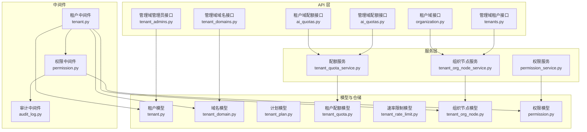
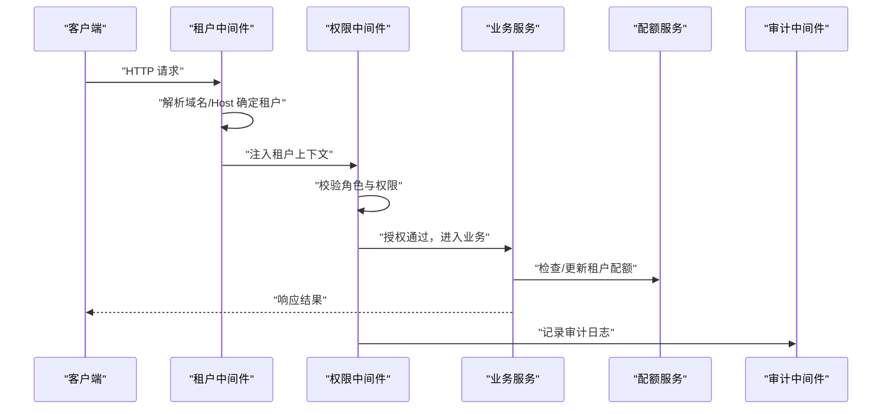
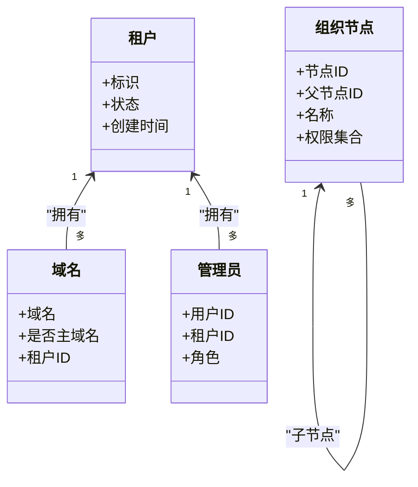
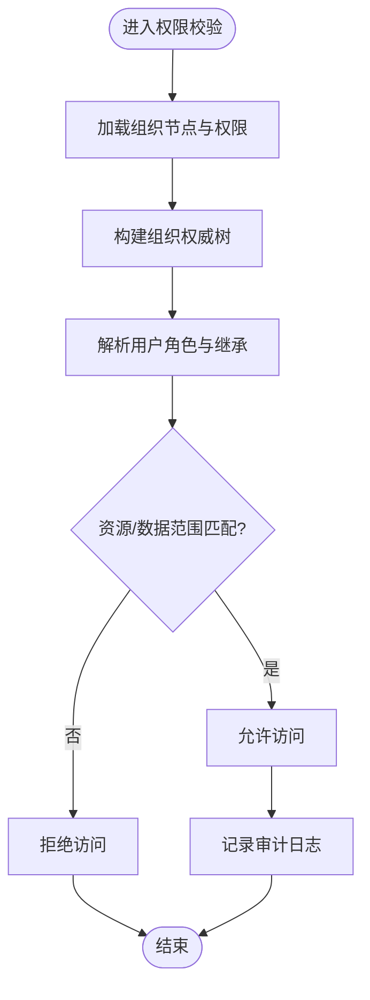
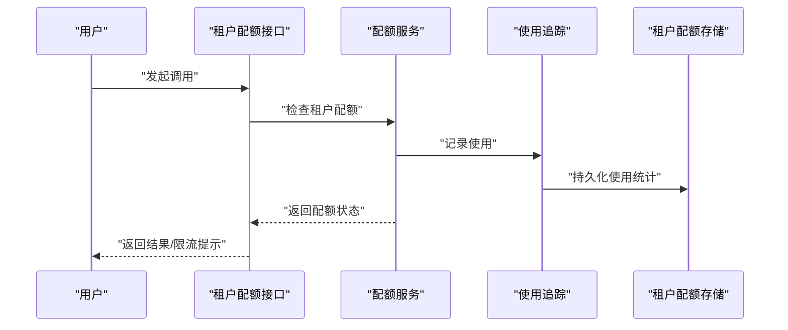
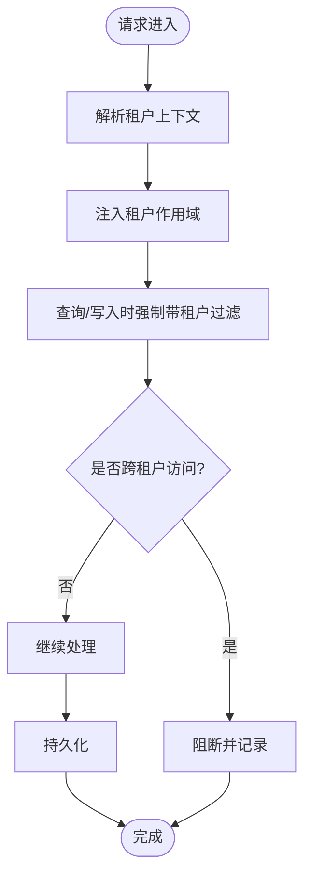
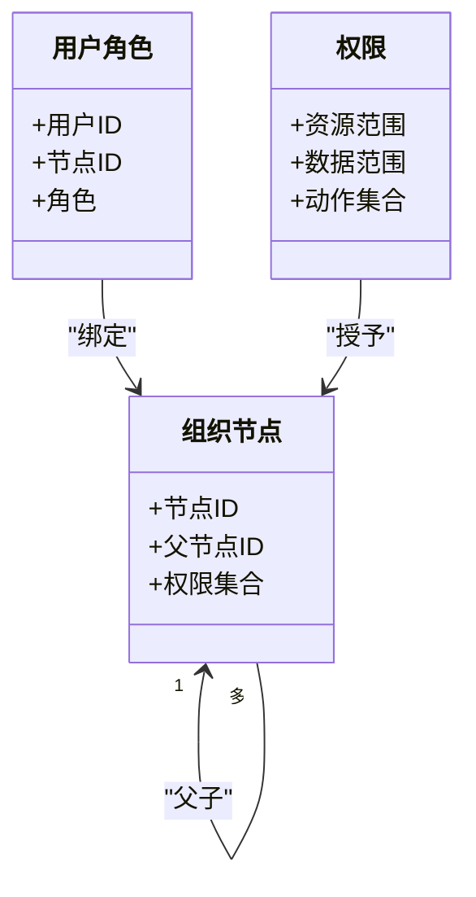
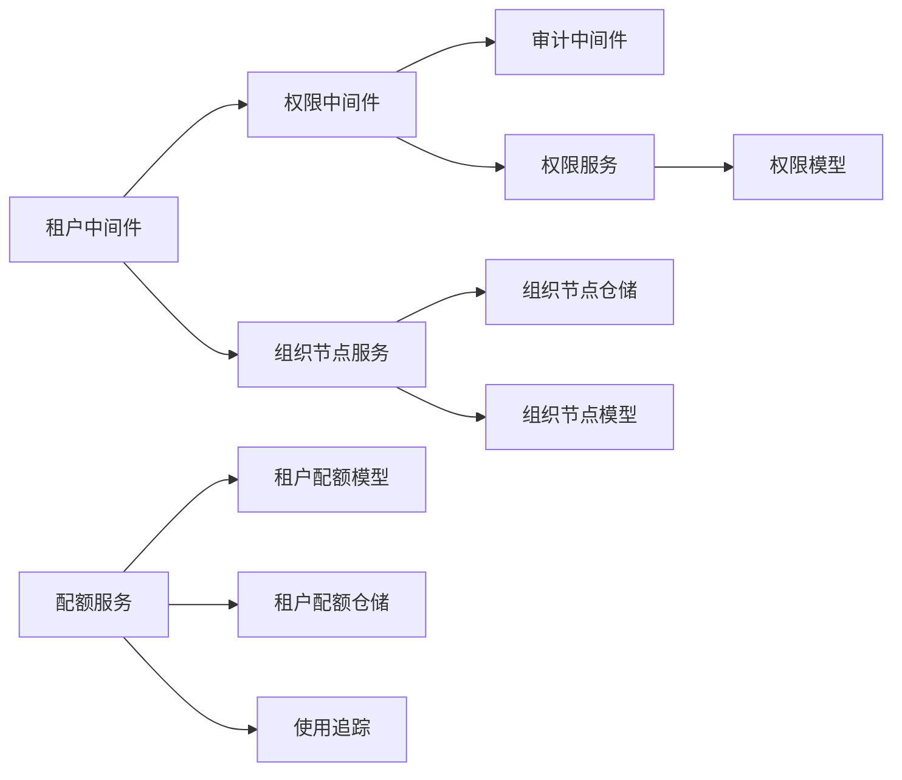

# 多租户架构

<cite>
**本文引用的文件**
- [backend/app/middleware/tenant.py](file://backend/app/middleware/tenant.py)
- [backend/app/models/tenant/tenant.py](file://backend/app/models/tenant/tenant.py)
- [backend/app/models/tenant/tenant_domain.py](file://backend/app/models/tenant/tenant_domain.py)
- [backend/app/models/tenant/tenant_plan.py](file://backend/app/models/tenant/tenant_plan.py)
- [backend/app/models/tenant/tenant_admin.py](file://backend/app/models/tenant/tenant_admin.py)
- [backend/app/models/tenant/tenant_quota.py](file://backend/app/models/tenant/tenant_quota.py)
- [backend/app/models/tenant/tenant_rate_limit.py](file://backend/app/models/tenant/tenant_rate_limit.py)
- [backend/app/models/system/resource_tenant_assignment.py](file://backend/app/models/system/resource_tenant_assignment.py)
- [backend/app/models/org/tenant_org_node.py](file://backend/app/models/org/tenant_org_node.py)
- [backend/app/models/auth/tenant_admin_role.py](file://backend/app/models/auth/tenant_admin_role.py)
- [backend/app/models/auth/tenant_user_role.py](file://backend/app/models/auth/tenant_user_role.py)
- [backend/app/models/auth/permission.py](file://backend/app/models/auth/permission.py)
- [backend/app/core/org_authority.py](file://backend/app/core/org_authority.py)
- [backend/app/repositories/tenant/tenant_org_node_repository.py](file://backend/app/repositories/tenant/tenant_org_node_repository.py)
- [backend/app/services/tenant/tenant_org_node_service.py](file://backend/app/services/tenant/tenant_org_node_service.py)
- [backend/app/services/tenant/tenant_org_authority_service.py](file://backend/app/services/tenant/tenant_org_authority_service.py)
- [backend/app/api/tenant/organization.py](file://backend/app/api/tenant/organization.py)
- [backend/app/api/admin/tenants.py](file://backend/app/api/admin/tenants.py)
- [backend/app/api/admin/tenant_domains.py](file://backend/app/api/admin/tenant_domains.py)
- [backend/app/api/admin/tenant_admins.py](file://backend/app/api/admin/tenant_admins.py)
- [backend/app/api/tenant/ai_quotas.py](file://backend/app/api/tenant/ai_quotas.py)
- [backend/app/api/admin/ai_quotas.py](file://backend/app/api/admin/ai_quotas.py)
- [backend/app/repositories/ai/tenant_quota_repository.py](file://backend/app/repositories/ai/tenant_quota_repository.py)
- [backend/app/services/ai/tenant_quota_service.py](file://backend/app/services/ai/tenant_quota_service.py)
- [backend/app/ai/quota_manager.py](file://backend/app/ai/quota_manager.py)
- [backend/app/ai/quota_usage_tracker.py](file://backend/app/ai/quota_usage_tracker.py)
- [backend/app/ai/quota_models.py](file://backend/app/ai/quota_models.py)
- [backend/app/middleware/permission.py](file://backend/app/middleware/permission.py)
- [backend/app/middleware/audit_log.py](file://backend/app/middleware/audit_log.py)
- [backend/app/core/data_permission.py](file://backend/app/core/data_permission.py)
- [backend/app/rbac/services/permission_service.py](file://backend/app/rbac/services/permission_service.py)
- [backend/app/api/tenant/permissions.py](file://backend/app/api/tenant/permissions.py)
- [backend/app/api/tenant/permission_roles.py](file://backend/app/api/tenant/permission_roles.py)
- [backend/app/api/admin/permissions.py](file://backend/app/api/admin/permissions.py)
- [backend/app/schemas/tenant/tenant_org_node.py](file://backend/app/schemas/tenant/tenant_org_node.py)
- [backend/app/schemas/system/admin_org_node.py](file://backend/app/schemas/system/admin_org_node.py)
- [backend/app/schemas/common/permission.py](file://backend/app/schemas/common/permission.py)
- [backend/app/schemas/tenant/tenant_permission_role.py](file://backend/app/schemas/tenant/tenant_permission_role.py)
- [backend/app/schemas/system/admin_permission_role.py](file://backend/app/schemas/system/admin_permission_role.py)
- [backend/app/migrations/versions/20260112_0002_tenant_domains.py](file://backend/app/migrations/versions/20260112_0002_tenant_domains.py)
- [backend/app/migrations/versions/20260115_bd94c7f44d6c_add_organization_fields_to_roles.py](file://backend/app/migrations/versions/20260115_bd94c7f44d6c_add_organization_fields_to_roles.py)
- [backend/app/migrations/versions/20260116_0006_add_organization_root_nodes.py](file://backend/app/migrations/versions/20260116_0006_add_organization_root_nodes.py)
- [backend/app/migrations/versions/20260325_org_authority_rebuild.py](file://backend/app/migrations/versions/20260325_org_authority_rebuild.py)
- [backend/app/migrations/versions/20260325_org_node_perm.py](file://backend/app/migrations/versions/20260325_org_node_perm.py)
- [backend/app/migrations/versions/20260320_unified_resource_and_permission_scope.py](file://backend/app/migrations/versions/20260320_unified_resource_and_permission_scope.py)
- [backend/app/migrations/versions/20260208_004_add_tenant_quotas.py](file://backend/app/migrations/versions/20260208_004_add_tenant_quotas.py)
- [backend/app/migrations/versions/20260307_add_tenant_user_roles.py](file://backend/app/migrations/versions/20260307_add_tenant_user_roles.py)
- [backend/app/migrations/versions/20260318_1935_merge_all_heads.py](file://backend/app/migrations/versions/20260318_1935_merge_all_heads.py)
- [backend/app/migrations/versions/20260321_ai_call_log_contract.py](file://backend/app/migrations/versions/20260321_ai_call_log_contract.py)
- [backend/app/migrations/versions/20260323_rename_ai_call_log_agent_resource_scope.py](file://backend/app/migrations/versions/20260323_rename_ai_call_log_agent_resource_scope.py)
- [backend/app/migrations/versions/20260324_add_conversation_owner_type_and_session_task_scope.py](file://backend/app/migrations/versions/20260324_add_conversation_owner_type_and_session_task_scope.py)
- [backend/app/migrations/versions/20260324_add_missing_recycle_bin_columns.py](file://backend/app/migrations/versions/20260324_add_missing_recycle_bin_columns.py)
- [backend/app/migrations/versions/20260325_0001_skill_architecture_foundation.py](file://backend/app/migrations/versions/20260325_0001_skill_architecture_foundation.py)
- [backend/app/migrations/versions/20260325_0002_task_scheduling_foundation.py](file://backend/app/migrations/versions/20260325_0002_task_scheduling_foundation.py)
- [backend/app/migrations/versions/20260325_0003_task_definition_operational_fields.py](file://backend/app/migrations/versions/20260325_0003_task_definition_operational_fields.py)
- [backend/app/migrations/versions/20260325_0004_backfill_task_definitions_from_periodic_tasks.py](file://backend/app/migrations/versions/20260325_0004_backfill_task_definitions_from_periodic_tasks.py)
- [backend/app/migrations/versions/20260325_0005_drop_legacy_task_tables.py](file://backend/app/migrations/versions/20260325_0005_drop_legacy_task_tables.py)
- [backend/app/migrations/versions/20260326_0001_ai_action_log_actor_snapshots.py](file://backend/app/migrations/versions/20260326_0001_ai_action_log_actor_snapshots.py)
- [backend/app/migrations/versions/20260327_1500_cleanup_legacy.py](file://backend/app/migrations/versions/20260327_1500_cleanup_legacy.py)
- [backend/app/migrations/versions/20260327_1930_residual_schema.py](file://backend/app/migrations/versions/20260327_1930_residual_schema.py)
- [backend/app/migrations/versions/20260327_2030_index_sync.py](file://backend/app/migrations/versions/20260327_2030_index_sync.py)
- [backend/app/migrations/versions/20260329_0010_normalize_task_definition_platform_scope.py](file://backend/app/migrations/versions/20260329_0010_normalize_task_definition_platform_scope.py)
- [backend/app/migrations/versions/20260329_0020_cleanup_task_binding_scope_semantics.py](file://backend/app/migrations/versions/20260329_0020_cleanup_task_binding_scope_semantics.py)
- [backend/app/migrations/versions/20260329_0030_add_memory_records.py](file://backend/app/migrations/versions/20260329_0030_add_memory_records.py)
- [backend/app/migrations/versions/20260329_0040_add_execution_trust_policies.py](file://backend/app/migrations/versions/20260329_0040_add_execution_trust_policies.py)
- [backend/app/migrations/versions/20260329_0050_add_execution_decisions.py](file://backend/app/migrations/versions/20260329_0050_add_execution_decisions.py)
- [backend/app/migrations/versions/20260330_0060_add_execution_decision_id_to_ai_action_logs.py](file://backend/app/migrations/versions/20260330_0060_add_execution_decision_id_to_ai_action_logs.py)
- [backend/app/migrations/versions/20260330_0070_add_profile_snapshots.py](file://backend/app/migrations/versions/20260330_0070_add_profile_snapshots.py)
- [backend/app/migrations/versions/20260330_0080_ephem_docs.py](file://backend/app/migrations/versions/20260330_0080_ephem_docs.py)
- [backend/app/migrations/versions/20260318_0003_add_trace_id_to_operation_logs.py](file://backend/app/migrations/versions/20260318_0003_add_trace_id_to_operation_logs.py)
- [backend/app/migrations/versions/20260318_0004_add_data_scope_to_roles.py](file://backend/app/migrations/versions/20260318_0004_add_data_scope_to_roles.py)
- [backend/app/migrations/versions/20260320_tenant_agent_platform_kb_suppressions.py](file://backend/app/migrations/versions/20260320_tenant_agent_platform_kb_suppressions.py)
- [backend/app/migrations/versions/20260321_retired_runtime_meta_a.py](file://backend/app/migrations/versions/20260321_retired_runtime_meta_a.py)
- [backend/app/migrations/versions/20260321_retired_runtime_meta_b.py](file://backend/app/migrations/versions/20260321_retired_runtime_meta_b.py)
- [backend/app/migrations/versions/20260322_ai_billing_ledger_merge.py](file://backend/app/migrations/versions/20260322_ai_billing_ledger_merge.py)
</cite>

## 目录
1. [引言](#引言)
2. [项目结构](#项目结构)
3. [核心组件](#核心组件)
4. [架构总览](#架构总览)
5. [详细组件分析](#详细组件分析)
6. [依赖关系分析](#依赖关系分析)
7. [性能考虑](#性能考虑)
8. [故障排除指南](#故障排除指南)
9. [结论](#结论)
10. [附录](#附录)

## 引言
本技术文档系统性阐述该 SaaS 平台的多租户架构设计与实现，重点覆盖以下方面：
- 租户管理：租户实体、域名绑定、管理员与用户角色、组织节点与权限体系
- 权限控制：基于资源与数据范围的统一权限模型、RBAC 角色与继承、操作审计
- 资源配额与速率限制：租户级配额、AI 使用统计与追踪、并发与调用限制
- 数据隔离策略：数据库层面的租户隔离、会话与任务的作用域约束、资源归属
- 部署与运维：监控指标、健康检查、迁移与回滚、备份与恢复、性能优化

## 项目结构
后端采用分层与按功能域划分的组织方式，多租户能力主要分布在以下模块：
- 中间件：租户识别与上下文注入、权限校验、审计日志
- 模型与仓储：租户、域名、计划、配额、速率限制、组织节点、权限等
- 服务层：组织权威服务、配额服务、权限服务等
- API 层：租户域内与管理域的接口，包括组织、域名、配额、权限等
- 迁移：版本化演进的多租户相关表结构与字段变更

图表来源
- [backend/app/middleware/tenant.py](file://backend/app/middleware/tenant.py)
- [backend/app/middleware/permission.py](file://backend/app/middleware/permission.py)
- [backend/app/middleware/audit_log.py](file://backend/app/middleware/audit_log.py)
- [backend/app/models/tenant/tenant.py](file://backend/app/models/tenant/tenant.py)
- [backend/app/models/tenant/tenant_domain.py](file://backend/app/models/tenant/tenant_domain.py)
- [backend/app/models/tenant/tenant_org_node.py](file://backend/app/models/tenant/tenant_org_node.py)
- [backend/app/models/auth/permission.py](file://backend/app/models/auth/permission.py)
- [backend/app/services/tenant/tenant_org_node_service.py](file://backend/app/services/tenant/tenant_org_node_service.py)
- [backend/app/services/ai/tenant_quota_service.py](file://backend/app/services/ai/tenant_quota_service.py)
- [backend/app/rbac/services/permission_service.py](file://backend/app/rbac/services/permission_service.py)
- [backend/app/api/tenant/organization.py](file://backend/app/api/tenant/organization.py)
- [backend/app/api/admin/tenants.py](file://backend/app/api/admin/tenants.py)
- [backend/app/api/admin/tenant_domains.py](file://backend/app/api/admin/tenant_domains.py)
- [backend/app/api/admin/tenant_admins.py](file://backend/app/api/admin/tenant_admins.py)
- [backend/app/api/tenant/ai_quotas.py](file://backend/app/api/tenant/ai_quotas.py)
- [backend/app/api/admin/ai_quotas.py](file://backend/app/api/admin/ai_quotas.py)

章节来源
- [backend/app/middleware/tenant.py](file://backend/app/middleware/tenant.py)
- [backend/app/middleware/permission.py](file://backend/app/middleware/permission.py)
- [backend/app/middleware/audit_log.py](file://backend/app/middleware/audit_log.py)
- [backend/app/models/tenant/tenant.py](file://backend/app/models/tenant/tenant.py)
- [backend/app/models/tenant/tenant_domain.py](file://backend/app/models/tenant/tenant_domain.py)
- [backend/app/models/tenant/tenant_org_node.py](file://backend/app/models/tenant/tenant_org_node.py)
- [backend/app/models/auth/permission.py](file://backend/app/models/auth/permission.py)
- [backend/app/services/tenant/tenant_org_node_service.py](file://backend/app/services/tenant/tenant_org_node_service.py)
- [backend/app/services/ai/tenant_quota_service.py](file://backend/app/services/ai/tenant_quota_service.py)
- [backend/app/rbac/services/permission_service.py](file://backend/app/rbac/services/permission_service.py)
- [backend/app/api/tenant/organization.py](file://backend/app/api/tenant/organization.py)
- [backend/app/api/admin/tenants.py](file://backend/app/api/admin/tenants.py)
- [backend/app/api/admin/tenant_domains.py](file://backend/app/api/admin/tenant_domains.py)
- [backend/app/api/admin/tenant_admins.py](file://backend/app/api/admin/tenant_admins.py)
- [backend/app/api/tenant/ai_quotas.py](file://backend/app/api/tenant/ai_quotas.py)
- [backend/app/api/admin/ai_quotas.py](file://backend/app/api/admin/ai_quotas.py)

## 核心组件
- 租户中间件：负责从请求中解析租户标识（如域名），建立租户上下文，贯穿后续鉴权与数据隔离
- 组织权威与节点：通过组织树与节点权限，实现跨资源的统一授权与继承
- 权限服务：统一资源与数据范围的权限模型，支持角色、继承与审计
- 配额与速率限制：租户级配额与并发/速率控制，结合使用追踪进行动态治理
- 审计日志：记录关键操作与变更，支持溯源与合规

章节来源
- [backend/app/middleware/tenant.py](file://backend/app/middleware/tenant.py)
- [backend/app/core/org_authority.py](file://backend/app/core/org_authority.py)
- [backend/app/rbac/services/permission_service.py](file://backend/app/rbac/services/permission_service.py)
- [backend/app/ai/quota_manager.py](file://backend/app/ai/quota_manager.py)
- [backend/app/ai/quota_usage_tracker.py](file://backend/app/ai/quota_usage_tracker.py)
- [backend/app/middleware/audit_log.py](file://backend/app/middleware/audit_log.py)

## 架构总览
下图展示多租户在请求链路中的关键交互：租户中间件解析域名确定租户；权限中间件根据租户与角色进行授权；服务层在租户作用域内执行业务逻辑；审计中间件记录操作。

图表来源
- [backend/app/middleware/tenant.py](file://backend/app/middleware/tenant.py)
- [backend/app/middleware/permission.py](file://backend/app/middleware/permission.py)
- [backend/app/middleware/audit_log.py](file://backend/app/middleware/audit_log.py)
- [backend/app/services/ai/tenant_quota_service.py](file://backend/app/services/ai/tenant_quota_service.py)

## 详细组件分析

### 租户管理与域名绑定
- 租户实体：包含租户标识、状态、创建时间等基础属性
- 域名绑定：通过独立的域名模型与租户关联，支持多域名映射到同一租户
- 管理接口：提供租户创建、配置、停用/启用、删除等管理能力；域名管理支持新增、删除、切换主域名等
- 组织边界：租户内以组织节点构建权限树，形成组织边界与继承关系

图表来源
- [backend/app/models/tenant/tenant.py](file://backend/app/models/tenant/tenant.py)
- [backend/app/models/tenant/tenant_domain.py](file://backend/app/models/tenant/tenant_domain.py)
- [backend/app/models/tenant/tenant_admin.py](file://backend/app/models/tenant/tenant_admin.py)
- [backend/app/models/tenant/tenant_org_node.py](file://backend/app/models/tenant/tenant_org_node.py)

章节来源
- [backend/app/models/tenant/tenant.py](file://backend/app/models/tenant/tenant.py)
- [backend/app/models/tenant/tenant_domain.py](file://backend/app/models/tenant/tenant_domain.py)
- [backend/app/models/tenant/tenant_admin.py](file://backend/app/models/tenant/tenant_admin.py)
- [backend/app/models/tenant/tenant_org_node.py](file://backend/app/models/tenant/tenant_org_node.py)
- [backend/app/api/admin/tenants.py](file://backend/app/api/admin/tenants.py)
- [backend/app/api/admin/tenant_domains.py](file://backend/app/api/admin/tenant_domains.py)
- [backend/app/api/admin/tenant_admins.py](file://backend/app/api/admin/tenant_admins.py)

### 权限控制与组织权威
- 统一权限模型：资源与数据范围统一建模，支持跨模块的权限判定
- 组织权威：通过组织节点树与继承规则，实现权限的层级传播与覆盖
- 角色与继承：支持角色继承与组织边界内的权限叠加
- 审计与可追溯：权限决策与变更均纳入审计日志

图表来源
- [backend/app/core/org_authority.py](file://backend/app/core/org_authority.py)
- [backend/app/models/tenant/tenant_org_node.py](file://backend/app/models/tenant/tenant_org_node.py)
- [backend/app/middleware/permission.py](file://backend/app/middleware/permission.py)
- [backend/app/middleware/audit_log.py](file://backend/app/middleware/audit_log.py)

章节来源
- [backend/app/core/org_authority.py](file://backend/app/core/org_authority.py)
- [backend/app/models/tenant/tenant_org_node.py](file://backend/app/models/tenant/tenant_org_node.py)
- [backend/app/middleware/permission.py](file://backend/app/middleware/permission.py)
- [backend/app/middleware/audit_log.py](file://backend/app/middleware/audit_log.py)
- [backend/app/rbac/services/permission_service.py](file://backend/app/rbac/services/permission_service.py)
- [backend/app/schemas/common/permission.py](file://backend/app/schemas/common/permission.py)
- [backend/app/schemas/tenant/tenant_permission_role.py](file://backend/app/schemas/tenant/tenant_permission_role.py)
- [backend/app/schemas/system/admin_permission_role.py](file://backend/app/schemas/system/admin_permission_role.py)

### 资源配额与速率限制
- 租户配额：按模型/维度设置租户级上限，结合使用追踪进行动态扣减与告警
- 并发与速率：对 AI 调用进行并发与速率限制，避免单租户对平台造成冲击
- 配额服务：提供查询、调整、重置与诊断能力，支持与业务流程解耦

图表来源
- [backend/app/api/tenant/ai_quotas.py](file://backend/app/api/tenant/ai_quotas.py)
- [backend/app/services/ai/tenant_quota_service.py](file://backend/app/services/ai/tenant_quota_service.py)
- [backend/app/ai/quota_usage_tracker.py](file://backend/app/ai/quota_usage_tracker.py)
- [backend/app/models/ai/tenant_quota.py](file://backend/app/models/ai/tenant_quota.py)

章节来源
- [backend/app/api/tenant/ai_quotas.py](file://backend/app/api/tenant/ai_quotas.py)
- [backend/app/api/admin/ai_quotas.py](file://backend/app/api/admin/ai_quotas.py)
- [backend/app/services/ai/tenant_quota_service.py](file://backend/app/services/ai/tenant_quota_service.py)
- [backend/app/ai/quota_manager.py](file://backend/app/ai/quota_manager.py)
- [backend/app/ai/quota_usage_tracker.py](file://backend/app/ai/quota_usage_tracker.py)
- [backend/app/models/ai/tenant_quota.py](file://backend/app/models/ai/tenant_quota.py)
- [backend/app/models/ai/tenant_rate_limit.py](file://backend/app/models/ai/tenant_rate_limit.py)

### 数据隔离策略与作用域
- 数据库隔离：通过租户 ID 在查询与写入时强制加入租户过滤条件，确保跨表关联也受控
- 会话与任务作用域：会话、任务、日志等资源均带有租户归属，防止跨租户泄露
- 资源归属：资源与权限的归属统一以租户为边界，避免越权访问

图表来源
- [backend/app/middleware/tenant.py](file://backend/app/middleware/tenant.py)
- [backend/app/core/data_permission.py](file://backend/app/core/data_permission.py)
- [backend/app/models/system/resource_tenant_assignment.py](file://backend/app/models/system/resource_tenant_assignment.py)

章节来源
- [backend/app/middleware/tenant.py](file://backend/app/middleware/tenant.py)
- [backend/app/core/data_permission.py](file://backend/app/core/data_permission.py)
- [backend/app/models/system/resource_tenant_assignment.py](file://backend/app/models/system/resource_tenant_assignment.py)

### 组织边界控制与角色分配
- 组织节点：以树形结构表达组织边界，节点上挂载权限集合
- 角色与继承：用户在不同节点的角色可叠加，遵循继承规则
- 权限服务：提供角色与权限的统一管理、同步与校验

图表来源
- [backend/app/models/tenant/tenant_org_node.py](file://backend/app/models/tenant/tenant_org_node.py)
- [backend/app/models/auth/tenant_user_role.py](file://backend/app/models/auth/tenant_user_role.py)
- [backend/app/models/auth/permission.py](file://backend/app/models/auth/permission.py)

章节来源
- [backend/app/models/tenant/tenant_org_node.py](file://backend/app/models/tenant/tenant_org_node.py)
- [backend/app/models/auth/tenant_user_role.py](file://backend/app/models/auth/tenant_user_role.py)
- [backend/app/models/auth/permission.py](file://backend/app/models/auth/permission.py)
- [backend/app/services/tenant/tenant_org_node_service.py](file://backend/app/services/tenant/tenant_org_node_service.py)
- [backend/app/api/tenant/organization.py](file://backend/app/api/tenant/organization.py)

### 操作审计与合规
- 审计中间件：拦截关键操作，记录主体、目标、动作、时间与影响范围
- 日志结构：包含租户、用户、资源、动作、结果、时间戳、追踪ID等
- 合规支持：支持导出与检索，满足审计要求

章节来源
- [backend/app/middleware/audit_log.py](file://backend/app/middleware/audit_log.py)
- [backend/app/migrations/versions/20260318_0003_add_trace_id_to_operation_logs.py](file://backend/app/migrations/versions/20260318_0003_add_trace_id_to_operation_logs.py)

## 依赖关系分析
- 中间件依赖：租户中间件依赖域名解析与租户模型；权限中间件依赖组织权威与权限模型；审计中间件贯穿所有请求
- 服务依赖：组织权威服务依赖组织节点仓储；配额服务依赖配额仓储与使用追踪；权限服务依赖权限模型与角色定义
- API 依赖：租户域与管理域接口分别调用对应的服务层，确保职责分离

图表来源
- [backend/app/middleware/tenant.py](file://backend/app/middleware/tenant.py)
- [backend/app/middleware/permission.py](file://backend/app/middleware/permission.py)
- [backend/app/middleware/audit_log.py](file://backend/app/middleware/audit_log.py)
- [backend/app/rbac/services/permission_service.py](file://backend/app/rbac/services/permission_service.py)
- [backend/app/models/auth/permission.py](file://backend/app/models/auth/permission.py)
- [backend/app/services/tenant/tenant_org_node_service.py](file://backend/app/services/tenant/tenant_org_node_service.py)
- [backend/app/repositories/tenant/tenant_org_node_repository.py](file://backend/app/repositories/tenant/tenant_org_node_repository.py)
- [backend/app/models/tenant/tenant_org_node.py](file://backend/app/models/tenant/tenant_org_node.py)
- [backend/app/services/ai/tenant_quota_service.py](file://backend/app/services/ai/tenant_quota_service.py)
- [backend/app/repositories/ai/tenant_quota_repository.py](file://backend/app/repositories/ai/tenant_quota_repository.py)
- [backend/app/ai/quota_usage_tracker.py](file://backend/app/ai/quota_usage_tracker.py)

章节来源
- [backend/app/middleware/tenant.py](file://backend/app/middleware/tenant.py)
- [backend/app/middleware/permission.py](file://backend/app/middleware/permission.py)
- [backend/app/middleware/audit_log.py](file://backend/app/middleware/audit_log.py)
- [backend/app/rbac/services/permission_service.py](file://backend/app/rbac/services/permission_service.py)
- [backend/app/models/auth/permission.py](file://backend/app/models/auth/permission.py)
- [backend/app/services/tenant/tenant_org_node_service.py](file://backend/app/services/tenant/tenant_org_node_service.py)
- [backend/app/repositories/tenant/tenant_org_node_repository.py](file://backend/app/repositories/tenant/tenant_org_node_repository.py)
- [backend/app/models/tenant/tenant_org_node.py](file://backend/app/models/tenant/tenant_org_node.py)
- [backend/app/services/ai/tenant_quota_service.py](file://backend/app/services/ai/tenant_quota_service.py)
- [backend/app/repositories/ai/tenant_quota_repository.py](file://backend/app/repositories/ai/tenant_quota_repository.py)
- [backend/app/ai/quota_usage_tracker.py](file://backend/app/ai/quota_usage_tracker.py)

## 性能考虑
- 查询隔离：在所有涉及租户的查询中强制带租户过滤，建议在数据库层设置全局过滤器或视图，减少重复代码
- 缓存策略：对权限与配额的热点数据进行缓存，降低数据库压力；注意缓存失效与一致性
- 并发与限流：在网关层与服务层双重限流，避免热点租户拖垮平台稳定性
- 指标监控：埋点关键路径（鉴权、配额检查、使用追踪），结合 Prometheus/Grafana 实现可观测性
- 批量与异步：对批量导入/导出、清理任务等使用异步队列，避免阻塞主线程

## 故障排除指南
- 常见问题
  - 无法识别租户：检查域名解析与租户中间件配置，确认域名与租户映射正确
  - 权限拒绝：核对用户角色、组织节点权限与资源范围，查看审计日志定位具体动作
  - 配额异常：检查配额服务与使用追踪是否正常，核对数据库记录与缓存状态
- 排查步骤
  - 开启调试日志，复现问题并收集上下文
  - 检查租户上下文是否正确注入
  - 核对权限模型与角色继承规则
  - 对比配额阈值与使用统计
- 回滚与修复
  - 使用迁移脚本回滚到稳定版本
  - 对异常数据进行修复或清理
  - 更新权限与配额配置，确保与模型一致

章节来源
- [backend/app/middleware/tenant.py](file://backend/app/middleware/tenant.py)
- [backend/app/middleware/permission.py](file://backend/app/middleware/permission.py)
- [backend/app/middleware/audit_log.py](file://backend/app/middleware/audit_log.py)
- [backend/app/services/ai/tenant_quota_service.py](file://backend/app/services/ai/tenant_quota_service.py)

## 结论
该多租户架构以“租户上下文 + 组织权威 + 统一权限模型 + 配额与审计”为核心，实现了强隔离、可扩展、可审计的 SaaS 能力。通过中间件与服务层的清晰分工，以及完善的迁移与监控体系，平台可在复杂场景下保持稳定与安全。

## 附录

### 租户生命周期与管理流程
- 创建租户：填写基础信息，初始化组织根节点与默认权限
- 配置域名：绑定域名并设置主域名，确保路由正确
- 管理员与用户：分配角色与权限，建立组织层级
- 配额与速率：设置模型级限额与并发/速率限制
- 审计与合规：开启审计日志，定期导出与归档

章节来源
- [backend/app/api/admin/tenants.py](file://backend/app/api/admin/tenants.py)
- [backend/app/api/admin/tenant_domains.py](file://backend/app/api/admin/tenant_domains.py)
- [backend/app/api/admin/tenant_admins.py](file://backend/app/api/admin/tenant_admins.py)
- [backend/app/api/tenant/organization.py](file://backend/app/api/tenant/organization.py)

### 权限继承与角色分配实践
- 角色定义：明确角色与动作集合，避免权限过大
- 继承规则：在组织树上合理设置继承，减少重复授权
- 范围约束：资源范围与数据范围应最小化，遵循最小权限原则
- 审计留痕：所有权限变更均需记录，便于追溯

章节来源
- [backend/app/rbac/services/permission_service.py](file://backend/app/rbac/services/permission_service.py)
- [backend/app/schemas/common/permission.py](file://backend/app/schemas/common/permission.py)
- [backend/app/schemas/tenant/tenant_permission_role.py](file://backend/app/schemas/tenant/tenant_permission_role.py)
- [backend/app/schemas/system/admin_permission_role.py](file://backend/app/schemas/system/admin_permission_role.py)

### 数据隔离与安全边界
- 全局过滤：在查询层强制带租户过滤，防止越权
- 会话与任务：确保会话、任务、日志等资源归属租户
- 资源归属：资源与权限统一以租户为边界，避免跨租户访问

章节来源
- [backend/app/core/data_permission.py](file://backend/app/core/data_permission.py)
- [backend/app/models/system/resource_tenant_assignment.py](file://backend/app/models/system/resource_tenant_assignment.py)

### 部署策略与监控方案
- 部署策略：容器化部署，多副本与自动扩缩容；数据库主从与只读副本
- 监控方案：关键指标（请求量、错误率、配额使用率、鉴权失败率）可视化
- 健康检查：定时任务与探针，及时发现异常
- 备份与恢复：定期全量备份与增量备份，演练恢复流程

### 租户迁移、备份与恢复
- 迁移策略：灰度发布，逐步迁移租户；迁移前后核对配额与权限
- 备份：按租户维度进行备份，支持快速恢复
- 恢复：验证数据完整性与权限一致性，确保业务可用

### 性能优化策略
- 查询优化：为常用过滤字段建立索引，避免全表扫描
- 缓存：热点权限与配额数据缓存，注意失效策略
- 异步：批量任务与清理任务异步化，降低峰值负载
- 限流：在网关与服务层双重限流，保障稳定性