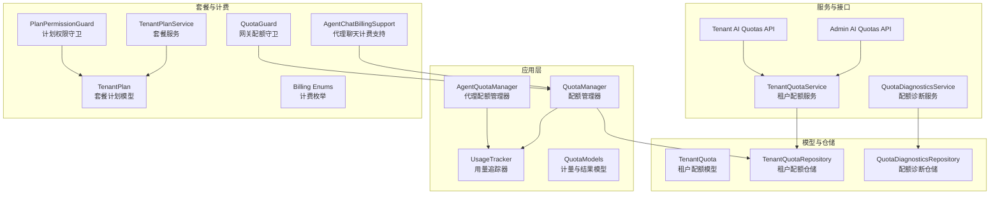
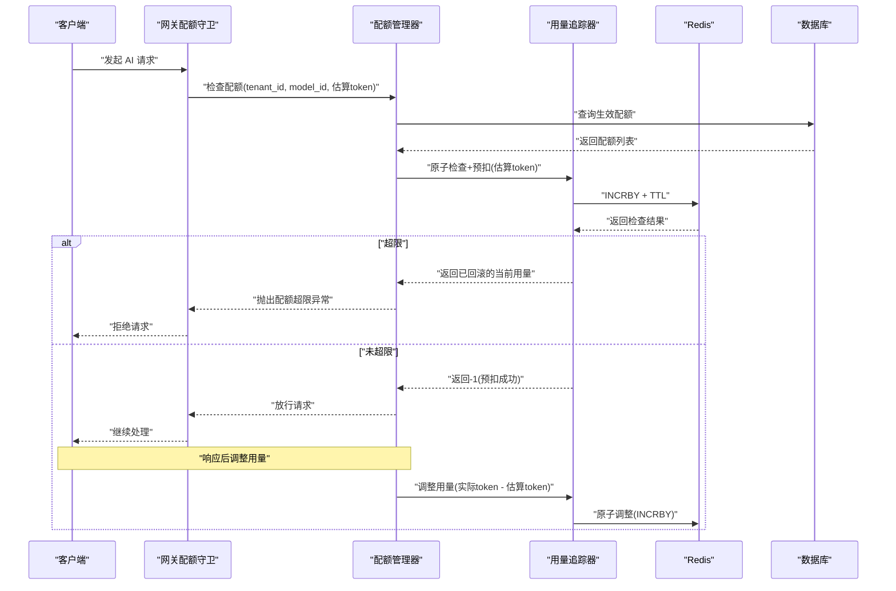
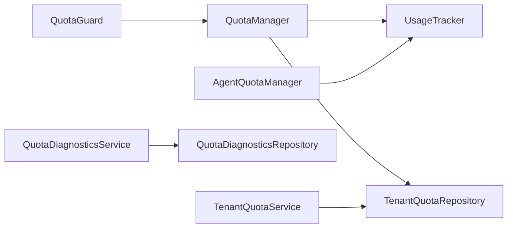
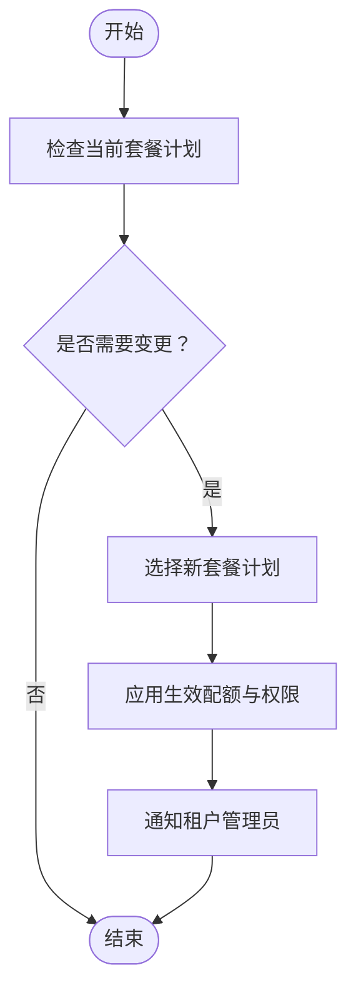

# 套餐配额管理

<cite>
**本文引用的文件**
- [backend/app/ai/quota_manager.py](file://backend/app/ai/quota_manager.py)
- [backend/app/ai/quota_usage_tracker.py](file://backend/app/ai/quota_usage_tracker.py)
- [backend/app/ai/quota_models.py](file://backend/app/ai/quota_models.py)
- [backend/app/ai/agent_quota_manager.py](file://backend/app/ai/agent_quota_manager.py)
- [backend/app/models/ai/tenant_quota.py](file://backend/app/models/ai/tenant_quota.py)
- [backend/app/repositories/ai/quota_diagnostics_repository.py](file://backend/app/repositories/ai/quota_diagnostics_repository.py)
- [backend/app/repositories/ai/tenant_quota_repository.py](file://backend/app/repositories/ai/tenant_quota_repository.py)
- [backend/app/schemas/ai/quota_diagnostics.py](file://backend/app/schemas/ai/quota_diagnostics.py)
- [backend/app/schemas/ai/tenant_quota.py](file://backend/app/schemas/ai/tenant_quota.py)
- [backend/app/services/ai/quota_diagnostics_service.py](file://backend/app/services/ai/quota_diagnostics_service.py)
- [backend/app/services/ai/tenant_quota_service.py](file://backend/app/services/ai/tenant_quota_service.py)
- [backend/app/api/admin/ai_quotas.py](file://backend/app/api/admin/ai_quotas.py)
- [backend/app/api/tenant/ai_quotas.py](file://backend/app/api/tenant/ai_quotas.py)
- [backend/app/enums/billing.py](file://backend/app/enums/billing.py)
- [backend/app/services/ai/agent_chat_billing_support.py](file://backend/app/services/ai/agent_chat_billing_support.py)
- [backend/app/ai/gateway_support/quota_guard.py](file://backend/app/ai/gateway_support/quota_guard.py)
- [backend/migrations/versions/20260117_f785c12f1c4f_add_tenant_plan_tables.py](file://backend/migrations/versions/20260117_f785c12f1c4f_add_tenant_plan_tables.py)
- [backend/app/models/tenant/tenant_plan.py](file://backend/app/models/tenant/tenant_plan.py)
- [backend/app/repositories/tenant/tenant_plan_repository.py](file://backend/app/repositories/tenant/tenant_plan_repository.py)
- [backend/app/schemas/tenant/plan.py](file://backend/app/schemas/tenant/plan.py)
- [backend/app/services/tenant/tenant_plan_service.py](file://backend/app/services/tenant/tenant_plan_service.py)
- [backend/app/services/tenant/plan_permission_guard.py](file://backend/app/services/tenant/plan_permission_guard.py)
- [backend/app/plugins/tenant_plan_preflight.py](file://backend/app/plugins/tenant_plan_preflight.py)
</cite>

## 目录
1. [简介](#简介)
2. [项目结构](#项目结构)
3. [核心组件](#核心组件)
4. [架构总览](#架构总览)
5. [详细组件分析](#详细组件分析)
6. [依赖分析](#依赖分析)
7. [性能考虑](#性能考虑)
8. [故障排查指南](#故障排查指南)
9. [结论](#结论)
10. [附录](#附录)

## 简介
本技术文档面向“套餐配额管理系统”，系统性阐述套餐计划设计、功能限制与计费模型；详述配额的分配、使用跟踪与超限处理；覆盖套餐升级、降级与续费流程；解释配额计算、用量统计与账单生成机制；明确套餐与功能权限的映射关系、使用限制与访问控制；提供套餐管理的配置选项、扩展策略与成本优化建议，并给出实际配额配置示例与用量监控代码路径。

## 项目结构
围绕配额与套餐管理的关键模块分布于以下层次：
- 应用层（AI 配额与用量追踪）
  - 配额管理器：负责配额检查、记录与调整
  - 用量追踪器：基于 Redis 的原子化用量计算
  - 配额数据模型：计量项与检查结果
  - 代理配额管理器：面向智能体的用量与对话配额
- 模型与仓储
  - 租户配额模型：数据库持久化
  - 仓储层：查询生效配额、诊断与服务编排
- 服务与接口
  - 租户配额服务：业务逻辑封装
  - 配额诊断服务：用量与限额可视化
  - 管理端与租户端 API：配额 CRUD 与查询
- 套餐与计费
  - 套餐模型与仓储：计划表结构
  - 计费枚举与代理聊天计费支持：计费维度扩展
  - 网关配额守卫：在网关层拦截与放行
- 迁移与插件
  - 租户计划迁移：初始化计划表
  - 租户计划前置校验：安装/更新前的策略校验

图表来源
- [backend/app/ai/quota_manager.py:22-309](file://backend/app/ai/quota_manager.py#L22-L309)
- [backend/app/ai/quota_usage_tracker.py:11-340](file://backend/app/ai/quota_usage_tracker.py#L11-L340)
- [backend/app/ai/agent_quota_manager.py:45-308](file://backend/app/ai/agent_quota_manager.py#L45-L308)
- [backend/app/ai/quota_models.py:8-37](file://backend/app/ai/quota_models.py#L8-L37)
- [backend/app/models/ai/tenant_quota.py:18-122](file://backend/app/models/ai/tenant_quota.py#L18-L122)
- [backend/app/repositories/ai/tenant_quota_repository.py](file://backend/app/repositories/ai/tenant_quota_repository.py)
- [backend/app/repositories/ai/quota_diagnostics_repository.py](file://backend/app/repositories/ai/quota_diagnostics_repository.py)
- [backend/app/services/ai/tenant_quota_service.py](file://backend/app/services/ai/tenant_quota_service.py)
- [backend/app/services/ai/quota_diagnostics_service.py](file://backend/app/services/ai/quota_diagnostics_service.py)
- [backend/app/api/admin/ai_quotas.py](file://backend/app/api/admin/ai_quotas.py)
- [backend/app/api/tenant/ai_quotas.py](file://backend/app/api/tenant/ai_quotas.py)
- [backend/app/models/tenant/tenant_plan.py](file://backend/app/models/tenant/tenant_plan.py)
- [backend/app/services/tenant/tenant_plan_service.py](file://backend/app/services/tenant/tenant_plan_service.py)
- [backend/app/services/tenant/plan_permission_guard.py](file://backend/app/services/tenant/plan_permission_guard.py)
- [backend/app/enums/billing.py](file://backend/app/enums/billing.py)
- [backend/app/services/ai/agent_chat_billing_support.py](file://backend/app/services/ai/agent_chat_billing_support.py)
- [backend/app/ai/gateway_support/quota_guard.py](file://backend/app/ai/gateway_support/quota_guard.py)

章节来源
- [backend/app/ai/quota_manager.py:22-309](file://backend/app/ai/quota_manager.py#L22-L309)
- [backend/app/ai/quota_usage_tracker.py:11-340](file://backend/app/ai/quota_usage_tracker.py#L11-L340)
- [backend/app/ai/agent_quota_manager.py:45-308](file://backend/app/ai/agent_quota_manager.py#L45-L308)
- [backend/app/ai/quota_models.py:8-37](file://backend/app/ai/quota_models.py#L8-L37)
- [backend/app/models/ai/tenant_quota.py:18-122](file://backend/app/models/ai/tenant_quota.py#L18-L122)

## 核心组件
- 配额管理器（QuotaManager）
  - 负责根据租户与模型查询生效配额，区分硬限制与软限制，执行原子化用量检查与记录，以及响应后的用量调整
  - 提供软配额预警通知与预扣回滚能力
- 用量追踪器（UsageTracker）
  - 基于 Redis 的原子化用量计算，支持日/月周期键空间与过期策略，提供检查+预扣、记录、调整等操作
- 配额数据模型（QuotaModels）
  - 定义计量项与检查结果，确保响应阶段能确定性地回写到同一 Redis 桶
- 代理配额管理器（AgentQuotaManager）
  - 面向智能体的配额检查、用量记录与汇总，支持用户级用量与对话次数统计
- 租户配额模型（TenantQuota）
  - 数据库实体，支持按模型或全局配额，定义周期、类型、阈值与状态

章节来源
- [backend/app/ai/quota_manager.py:22-309](file://backend/app/ai/quota_manager.py#L22-L309)
- [backend/app/ai/quota_usage_tracker.py:11-340](file://backend/app/ai/quota_usage_tracker.py#L11-L340)
- [backend/app/ai/quota_models.py:8-37](file://backend/app/ai/quota_models.py#L8-L37)
- [backend/app/ai/agent_quota_manager.py:45-308](file://backend/app/ai/agent_quota_manager.py#L45-L308)
- [backend/app/models/ai/tenant_quota.py:18-122](file://backend/app/models/ai/tenant_quota.py#L18-L122)

## 架构总览
系统采用“数据库驱动的配额规则 + Redis 原子化用量”的双轨架构：
- 数据层：租户配额模型与仓储，决定配额类型、周期、限额与是否激活
- 缓存层：Redis 键空间按日/月划分，Lua 原子脚本保证并发安全
- 服务层：QuotaManager 与 UsageTracker 协作完成检查、记录与调整
- 网关层：QuotaGuard 在请求进入业务链路前进行拦截与放行
- 计费层：结合计费枚举与代理聊天计费支持，实现用量到账单的映射

图表来源
- [backend/app/ai/gateway_support/quota_guard.py](file://backend/app/ai/gateway_support/quota_guard.py)
- [backend/app/ai/quota_manager.py:40-139](file://backend/app/ai/quota_manager.py#L40-L139)
- [backend/app/ai/quota_usage_tracker.py:152-194](file://backend/app/ai/quota_usage_tracker.py#L152-L194)

## 详细组件分析

### 配额管理器（QuotaManager）
职责与流程
- 查询生效配额：通过仓储获取对当前租户与模型生效的配额集合
- 硬限制（Hard）：执行原子检查+预扣，若超限则抛出异常并回滚已预扣
- 软限制（Soft）：仅做预警通知，不阻断请求
- 响应后调整：将估算用量调整为实际用量，确保计费准确
- 预扣回滚：在异常情况下回滚已预扣的用量

复杂度与性能
- 时间复杂度：O(n)，n 为生效配额数量
- Redis 原子脚本避免竞态，降低锁竞争
- 软配额每日最多一次通知，减少重复告警

章节来源
- [backend/app/ai/quota_manager.py:40-309](file://backend/app/ai/quota_manager.py#L40-L309)

### 用量追踪器（UsageTracker）
职责与流程
- 键空间设计：按日/月前缀组织，自动设置过期时间
- 原子检查+预扣：Lua 脚本保证“检查-预扣”不可分割
- 用量记录与调整：支持按周期记录与调整，确保估算到实际的差额修正
- 查询用量：按周期返回当前用量

复杂度与性能
- Redis 操作均为 O(1)，Lua 脚本原子性保障高并发一致性
- TTL 设计兼顾准确性与内存占用

章节来源
- [backend/app/ai/quota_usage_tracker.py:11-340](file://backend/app/ai/quota_usage_tracker.py#L11-L340)

### 配额数据模型（QuotaModels）
- QuotaMeteringItem：记录检查阶段命中的配额规则，确保响应阶段回写到同一 Redis 桶
- QuotaCheckResult：聚合本次请求命中的所有计量项，便于后续调整

章节来源
- [backend/app/ai/quota_models.py:8-37](file://backend/app/ai/quota_models.py#L8-L37)

### 代理配额管理器（AgentQuotaManager）
职责与流程
- 面向智能体的配额检查与用量记录，支持按用户粒度统计
- 对话次数与每日用量的原子化统计
- 提供汇总查询接口，便于运营与审计

复杂度与性能
- 与 UsageTracker 类似，采用 Redis 原子脚本与 TTL 策略
- 用户级用量键空间避免跨用户干扰

章节来源
- [backend/app/ai/agent_quota_manager.py:45-308](file://backend/app/ai/agent_quota_manager.py#L45-L308)

### 租户配额模型（TenantQuota）
- 字段要点：模型绑定（可为空表示全局）、周期（日/月）、限额、类型（硬/软）、预警阈值、启用状态、描述
- 关系：与 AI 模型与租户的关联，支持按模型或全局维度配置

章节来源
- [backend/app/models/ai/tenant_quota.py:18-122](file://backend/app/models/ai/tenant_quota.py#L18-L122)

### 服务与接口
- 租户配额服务：封装仓储与业务逻辑，提供创建、更新、查询与诊断
- 配额诊断服务：聚合用量与限额信息，输出可视化指标
- 管理端与租户端 API：提供配额的增删改查与用量查询

章节来源
- [backend/app/services/ai/tenant_quota_service.py](file://backend/app/services/ai/tenant_quota_service.py)
- [backend/app/services/ai/quota_diagnostics_service.py](file://backend/app/services/ai/quota_diagnostics_service.py)
- [backend/app/api/admin/ai_quotas.py](file://backend/app/api/admin/ai_quotas.py)
- [backend/app/api/tenant/ai_quotas.py](file://backend/app/api/tenant/ai_quotas.py)

### 套餐与计费
- 套餐模型与仓储：支持计划维度的权限与资源约束
- 计费枚举与代理聊天计费支持：将用量映射到计费维度
- 网关配额守卫：在入口处拦截超限请求，保护后端资源
- 租户计划前置校验：安装/更新前的策略校验，确保合规

章节来源
- [backend/app/enums/billing.py](file://backend/app/enums/billing.py)
- [backend/app/services/ai/agent_chat_billing_support.py](file://backend/app/services/ai/agent_chat_billing_support.py)
- [backend/app/ai/gateway_support/quota_guard.py](file://backend/app/ai/gateway_support/quota_guard.py)
- [backend/app/plugins/tenant_plan_preflight.py](file://backend/app/plugins/tenant_plan_preflight.py)
- [backend/migrations/versions/20260117_f785c12f1c4f_add_tenant_plan_tables.py](file://backend/migrations/versions/20260117_f785c12f1c4f_add_tenant_plan_tables.py)
- [backend/app/models/tenant/tenant_plan.py](file://backend/app/models/tenant/tenant_plan.py)
- [backend/app/repositories/tenant/tenant_plan_repository.py](file://backend/app/repositories/tenant/tenant_plan_repository.py)
- [backend/app/schemas/tenant/plan.py](file://backend/app/schemas/tenant/plan.py)
- [backend/app/services/tenant/tenant_plan_service.py](file://backend/app/services/tenant/tenant_plan_service.py)
- [backend/app/services/tenant/plan_permission_guard.py](file://backend/app/services/tenant/plan_permission_guard.py)

## 依赖分析
- 组件耦合
  - QuotaManager 依赖 UsageTracker 与仓储层，耦合度低、内聚度高
  - AgentQuotaManager 依赖 UsageTracker 与 Redis，独立性强
  - 网关层守卫依赖 QuotaManager，形成清晰的入口控制
- 外部依赖
  - Redis：提供原子化与过期控制
  - 数据库：持久化配额规则与计划
- 循环依赖
  - 未发现循环依赖，模块边界清晰

图表来源
- [backend/app/ai/quota_manager.py:22-309](file://backend/app/ai/quota_manager.py#L22-L309)
- [backend/app/ai/quota_usage_tracker.py:11-340](file://backend/app/ai/quota_usage_tracker.py#L11-L340)
- [backend/app/ai/agent_quota_manager.py:45-308](file://backend/app/ai/agent_quota_manager.py#L45-L308)
- [backend/app/ai/gateway_support/quota_guard.py](file://backend/app/ai/gateway_support/quota_guard.py)
- [backend/app/services/ai/quota_diagnostics_service.py](file://backend/app/services/ai/quota_diagnostics_service.py)
- [backend/app/services/ai/tenant_quota_service.py](file://backend/app/services/ai/tenant_quota_service.py)

## 性能考虑
- Redis 原子脚本：避免竞态，降低锁开销
- TTL 设计：日用量保留短期窗口，月用量保留更长窗口，平衡准确性与内存
- 预扣回滚：在异常路径快速回滚，避免脏数据
- 软配额通知去重：每日最多一次，降低通知风暴
- 批量调整：响应后按周期批量调整，减少多次网络往返

## 故障排查指南
常见问题与定位
- 配额超限但未触发异常
  - 检查配额类型是否为软限制
  - 核对生效配额是否正确加载
- 用量不一致
  - 确认估算到实际的调整是否执行
  - 检查 Redis 键空间与过期策略
- 网关未拦截
  - 核对网关守卫是否启用与路由匹配
- 软配额通知未送达
  - 检查通知模板与缓存键去重逻辑

章节来源
- [backend/app/ai/quota_manager.py:235-284](file://backend/app/ai/quota_manager.py#L235-L284)
- [backend/app/ai/quota_usage_tracker.py:152-194](file://backend/app/ai/quota_usage_tracker.py#L152-L194)
- [backend/app/ai/gateway_support/quota_guard.py](file://backend/app/ai/gateway_support/quota_guard.py)

## 结论
该配额与套餐管理体系以“数据库规则 + Redis 原子化用量”为核心，实现了高并发下的强一致用量控制与灵活的软/硬限制策略。通过网关守卫与服务层协作，系统在入口与业务处理阶段均具备完善的拦截与补偿能力。配套的套餐与计费扩展为后续商业化落地提供了清晰的路径。

## 附录

### 配额配置示例（步骤说明）
- 创建租户配额
  - 选择目标租户与模型（可为空表示全局）
  - 设置周期（日/月）、限额、类型（硬/软）、预警阈值
  - 启用状态与备注
- 生效验证
  - 通过租户端 API 查询用量与限额
  - 观察软配额通知与硬配额拦截行为

章节来源
- [backend/app/api/tenant/ai_quotas.py](file://backend/app/api/tenant/ai_quotas.py)
- [backend/app/schemas/ai/tenant_quota.py](file://backend/app/schemas/ai/tenant_quota.py)

### 用量监控代码路径
- 日/月用量查询
  - [UsageTracker.get_daily_usage:98-121](file://backend/app/ai/quota_usage_tracker.py#L98-L121)
  - [UsageTracker.get_monthly_usage:123-149](file://backend/app/ai/quota_usage_tracker.py#L123-L149)
- 用量汇总与诊断
  - [QuotaDiagnosticsService](file://backend/app/services/ai/quota_diagnostics_service.py)
  - [QuotaDiagnosticsRepository](file://backend/app/repositories/ai/quota_diagnostics_repository.py)
  - [Schema: QuotaDiagnostics](file://backend/app/schemas/ai/quota_diagnostics.py)

章节来源
- [backend/app/ai/quota_usage_tracker.py:98-149](file://backend/app/ai/quota_usage_tracker.py#L98-L149)
- [backend/app/services/ai/quota_diagnostics_service.py](file://backend/app/services/ai/quota_diagnostics_service.py)
- [backend/app/repositories/ai/quota_diagnostics_repository.py](file://backend/app/repositories/ai/quota_diagnostics_repository.py)
- [backend/app/schemas/ai/quota_diagnostics.py](file://backend/app/schemas/ai/quota_diagnostics.py)

### 套餐升级/降级/续费流程（概念示意）

说明
- 升级：提高限额与权限范围
- 降级：收紧限额与权限范围
- 续费：延长计划有效期并刷新配额

[此图为概念流程图，无需图表来源]