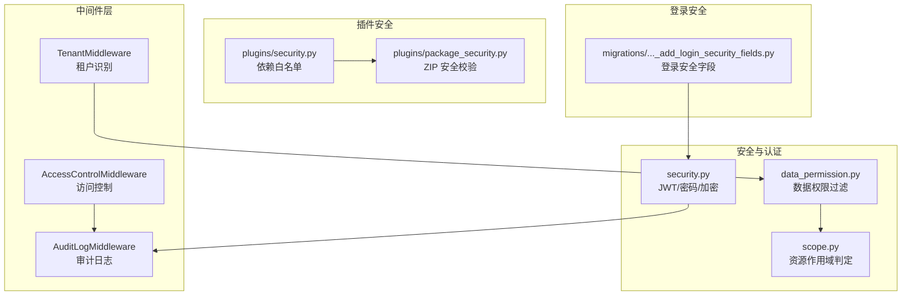
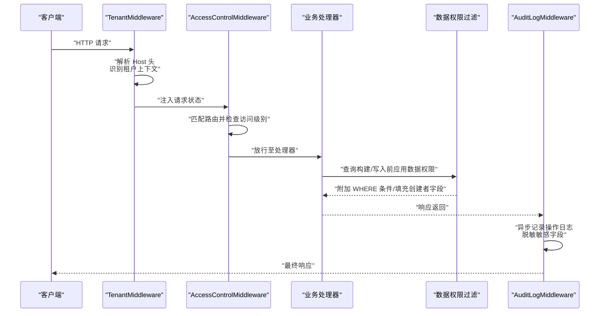
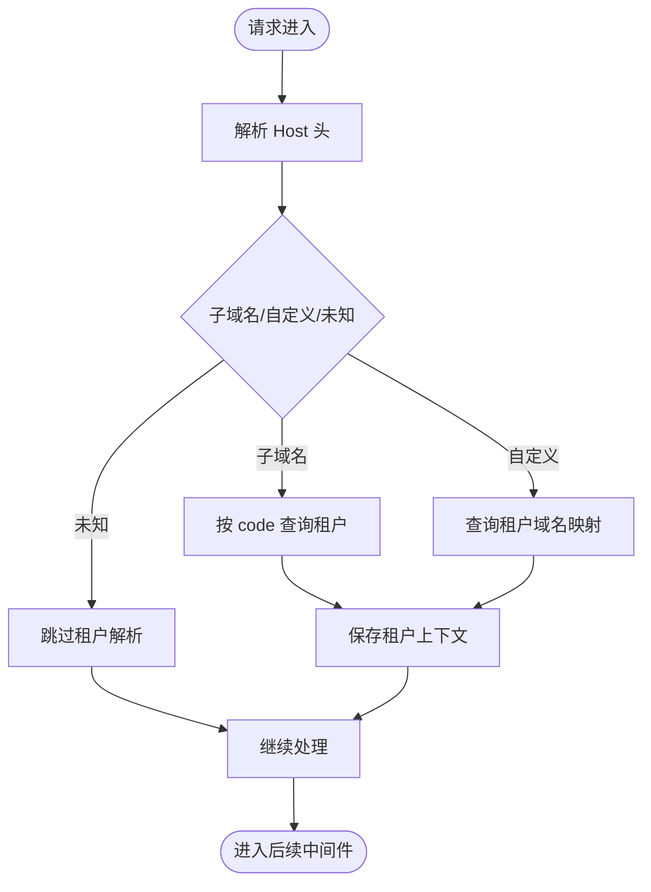
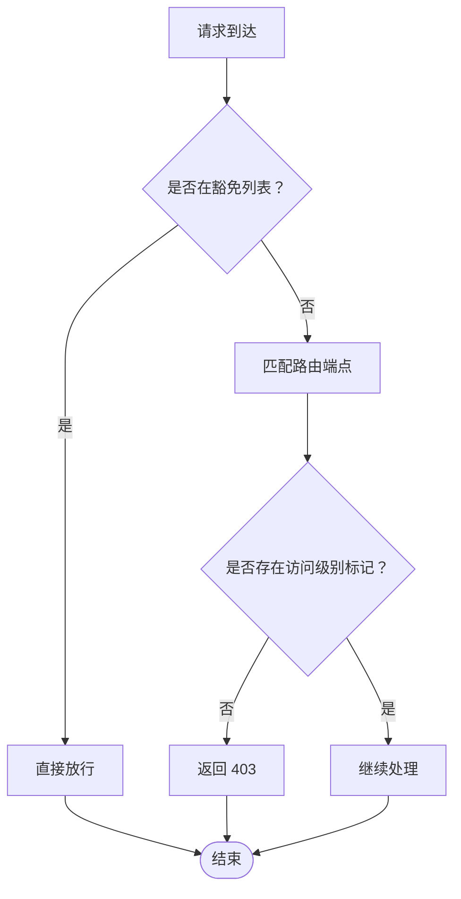
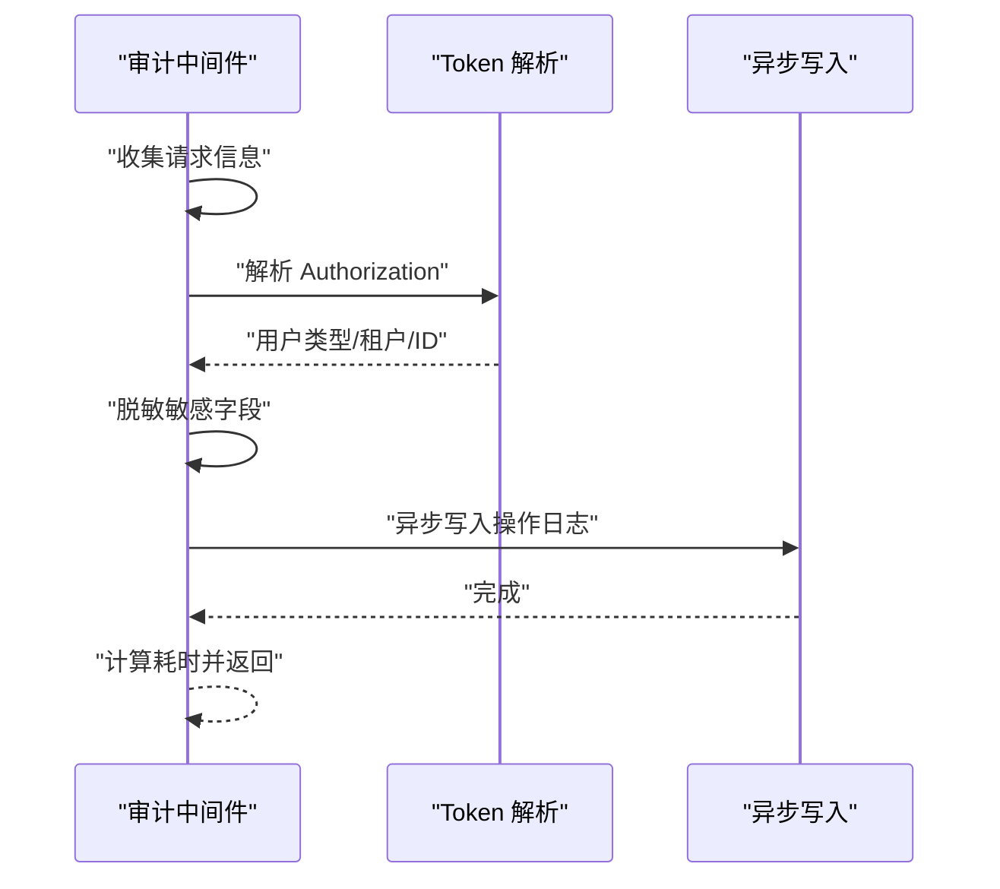
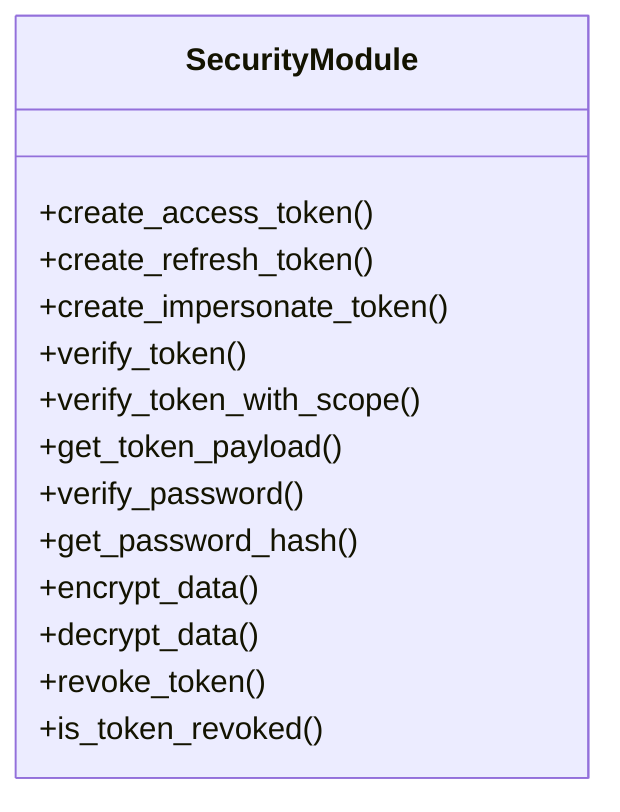
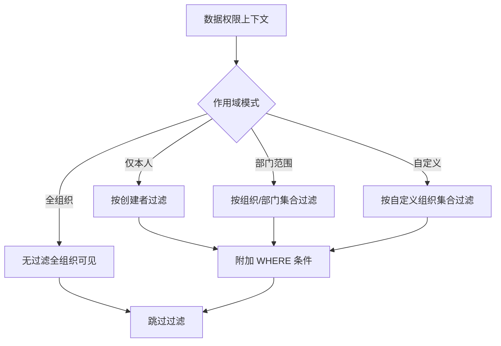
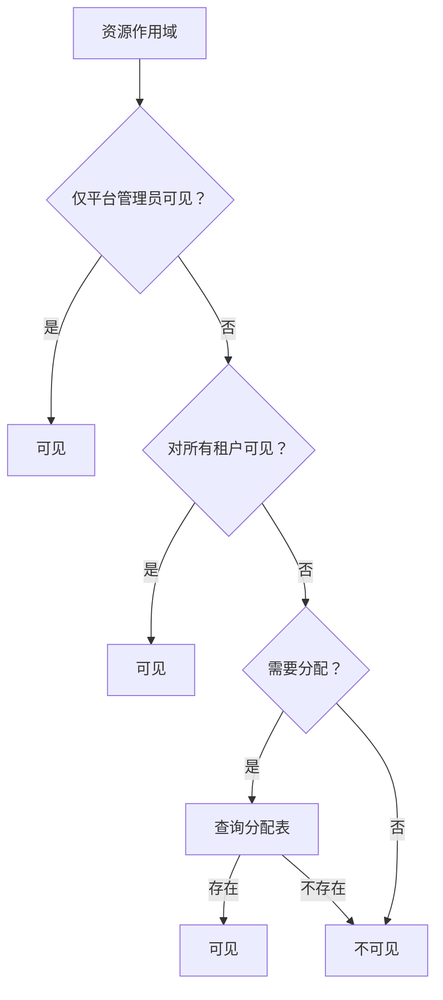
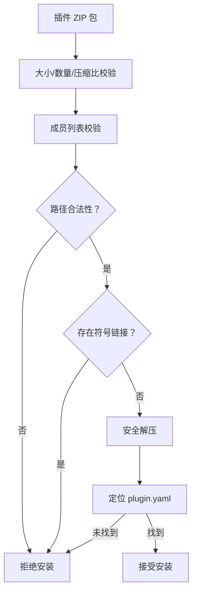
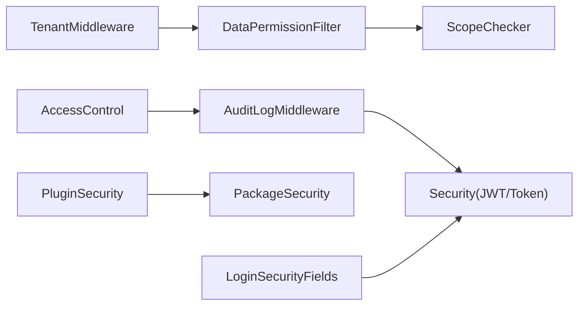

# 数据隔离与安全

<cite>
**本文引用的文件**
- [backend/app/middleware/tenant.py](file://backend/app/middleware/tenant.py)
- [backend/app/middleware/access_control.py](file://backend/app/middleware/access_control.py)
- [backend/app/middleware/audit_log.py](file://backend/app/middleware/audit_log.py)
- [backend/app/core/security.py](file://backend/app/core/security.py)
- [backend/app/core/data_permission.py](file://backend/app/core/data_permission.py)
- [backend/app/core/scope.py](file://backend/app/core/scope.py)
- [backend/app/plugins/security.py](file://backend/app/plugins/security.py)
- [backend/app/plugins/package_security.py](file://backend/app/plugins/package_security.py)
- [backend/migrations/versions/20260123_0006_add_login_security_fields.py](file://backend/migrations/versions/20260123_0006_add_login_security_fields.py)
</cite>

## 目录
1. [引言](#引言)
2. [项目结构](#项目结构)
3. [核心组件](#核心组件)
4. [架构总览](#架构总览)
5. [详细组件分析](#详细组件分析)
6. [依赖分析](#依赖分析)
7. [性能考虑](#性能考虑)
8. [故障排查指南](#故障排查指南)
9. [结论](#结论)
10. [附录](#附录)

## 引言
本文件面向多租户 SaaS 平台的数据隔离与安全机制，系统化阐述租户识别、数据权限过滤、访问控制、审计日志、身份认证与会话管理、加密与数据保护、以及性能优化与安全审计策略。文档基于仓库现有实现进行深入解读，并提供可视化图示帮助读者快速把握整体设计。

## 项目结构
围绕“数据隔离与安全”的关键模块主要分布在以下位置：
- 中间件层：租户识别、访问控制、审计日志
- 安全与认证：JWT 令牌、密码哈希、加密、吊销
- 数据权限与作用域：组织/部门粒度的数据可见性与过滤
- 插件安全：依赖白名单与插件包解压安全校验
- 登录安全：迁移脚本引入的登录安全字段

**图表来源**
- [backend/app/middleware/tenant.py:93-164](file://backend/app/middleware/tenant.py#L93-L164)
- [backend/app/middleware/access_control.py:35-98](file://backend/app/middleware/access_control.py#L35-L98)
- [backend/app/middleware/audit_log.py:219-348](file://backend/app/middleware/audit_log.py#L219-L348)
- [backend/app/core/security.py:38-115](file://backend/app/core/security.py#L38-L115)
- [backend/app/core/data_permission.py:125-146](file://backend/app/core/data_permission.py#L125-L146)
- [backend/app/core/scope.py:52-101](file://backend/app/core/scope.py#L52-L101)
- [backend/app/plugins/security.py:9-28](file://backend/app/plugins/security.py#L9-L28)
- [backend/app/plugins/package_security.py:29-96](file://backend/app/plugins/package_security.py#L29-L96)
- [backend/migrations/versions/20260123_0006_add_login_security_fields.py](file://backend/migrations/versions/20260123_0006_add_login_security_fields.py)

**章节来源**
- [backend/app/middleware/tenant.py:1-259](file://backend/app/middleware/tenant.py#L1-L259)
- [backend/app/middleware/access_control.py:1-137](file://backend/app/middleware/access_control.py#L1-L137)
- [backend/app/middleware/audit_log.py:1-582](file://backend/app/middleware/audit_log.py#L1-L582)
- [backend/app/core/security.py:1-503](file://backend/app/core/security.py#L1-L503)
- [backend/app/core/data_permission.py:1-457](file://backend/app/core/data_permission.py#L1-L457)
- [backend/app/core/scope.py:1-128](file://backend/app/core/scope.py#L1-L128)
- [backend/app/plugins/security.py:1-74](file://backend/app/plugins/security.py#L1-L74)
- [backend/app/plugins/package_security.py:1-196](file://backend/app/plugins/package_security.py#L1-L196)
- [backend/migrations/versions/20260123_0006_add_login_security_fields.py](file://backend/migrations/versions/20260123_0006_add_login_security_fields.py)

## 核心组件
- 租户识别中间件：从 Host 头解析子域名/自定义域名，解析企业上下文并注入请求状态，支撑后续数据隔离与审计。
- 访问控制中间件：实施“默认拒绝”策略，要求端点显式标注访问级别，避免无意暴露。
- 审计日志中间件：拦截 API 请求，异步记录操作日志，解析 Token 提取用户身份，对敏感字段脱敏。
- 安全与认证：JWT 令牌签发/验证、密码哈希、吊销黑名单、加密解密、一键登录临时令牌。
- 数据权限过滤：基于用户数据作用域（个人/部门/自定义/全组织）自动追加 WHERE 条件，支持父子模型继承。
- 资源作用域判定：统一判断资源对平台管理员、全体租户、特定租户的可见性，必要时查询分配表。
- 插件安全：依赖白名单与 ZIP 包安全校验，防止恶意安装。
- 登录安全：迁移脚本引入登录安全字段，增强登录链路安全性。

**章节来源**
- [backend/app/middleware/tenant.py:93-164](file://backend/app/middleware/tenant.py#L93-L164)
- [backend/app/middleware/access_control.py:35-98](file://backend/app/middleware/access_control.py#L35-L98)
- [backend/app/middleware/audit_log.py:219-348](file://backend/app/middleware/audit_log.py#L219-L348)
- [backend/app/core/security.py:38-115](file://backend/app/core/security.py#L38-L115)
- [backend/app/core/data_permission.py:125-146](file://backend/app/core/data_permission.py#L125-L146)
- [backend/app/core/scope.py:52-101](file://backend/app/core/scope.py#L52-L101)
- [backend/app/plugins/security.py:9-28](file://backend/app/plugins/security.py#L9-L28)
- [backend/app/plugins/package_security.py:29-96](file://backend/app/plugins/package_security.py#L29-L96)
- [backend/migrations/versions/20260123_0006_add_login_security_fields.py](file://backend/migrations/versions/20260123_0006_add_login_security_fields.py)

## 架构总览
下图展示从请求进入系统到完成数据隔离与审计的关键路径：

**图表来源**
- [backend/app/middleware/tenant.py:120-164](file://backend/app/middleware/tenant.py#L120-L164)
- [backend/app/middleware/access_control.py:54-98](file://backend/app/middleware/access_control.py#L54-L98)
- [backend/app/middleware/audit_log.py:235-348](file://backend/app/middleware/audit_log.py#L235-L348)
- [backend/app/core/data_permission.py:64-72](file://backend/app/core/data_permission.py#L64-L72)

## 详细组件分析

### 租户识别与上下文管理
- 支持两种域名模式：子域名（{tenant_code}.suffix）与自定义域名（通过数据库映射）。
- 解析逻辑排除平台管理域名与主域名，避免误判。
- 将租户上下文注入请求状态，供后续中间件与服务层使用。

**图表来源**
- [backend/app/middleware/tenant.py:52-91](file://backend/app/middleware/tenant.py#L52-L91)
- [backend/app/middleware/tenant.py:166-222](file://backend/app/middleware/tenant.py#L166-L222)

**章节来源**
- [backend/app/middleware/tenant.py:52-91](file://backend/app/middleware/tenant.py#L52-L91)
- [backend/app/middleware/tenant.py:166-222](file://backend/app/middleware/tenant.py#L166-L222)

### 访问控制与权限声明
- 默认拒绝策略：未显式标注访问级别的端点一律返回 403。
- 支持公开（@public）、仅认证（@auth_only）、带权限（@action_*）三类访问级别。
- 豁免路径包括健康检查、指标、文档等静态资源。

**图表来源**
- [backend/app/middleware/access_control.py:54-98](file://backend/app/middleware/access_control.py#L54-L98)

**章节来源**
- [backend/app/middleware/access_control.py:19-32](file://backend/app/middleware/access_control.py#L19-L32)
- [backend/app/middleware/access_control.py:82-92](file://backend/app/middleware/access_control.py#L82-L92)

### 审计日志与敏感信息脱敏
- 拦截 API 请求，收集请求/响应信息、用户代理、客户端 IP、耗时等。
- 从 Authorization 头解析 Token，提取用户类型与租户 ID。
- 对请求体敏感字段进行脱敏，异步写入数据库，不影响请求主流程。
- 特殊路径（如登录/登出/导入/导出）有专门的动作类型映射。

**图表来源**
- [backend/app/middleware/audit_log.py:235-348](file://backend/app/middleware/audit_log.py#L235-L348)
- [backend/app/middleware/audit_log.py:419-485](file://backend/app/middleware/audit_log.py#L419-L485)
- [backend/app/middleware/audit_log.py:487-578](file://backend/app/middleware/audit_log.py#L487-L578)

**章节来源**
- [backend/app/middleware/audit_log.py:26-73](file://backend/app/middleware/audit_log.py#L26-L73)
- [backend/app/middleware/audit_log.py:103-125](file://backend/app/middleware/audit_log.py#L103-L125)
- [backend/app/middleware/audit_log.py:419-485](file://backend/app/middleware/audit_log.py#L419-L485)
- [backend/app/middleware/audit_log.py:487-578](file://backend/app/middleware/audit_log.py#L487-L578)

### 身份认证、会话管理与加密
- JWT 令牌：支持 access/refresh/impersonate 三种类型，含过期时间、JTI、额外声明。
- 令牌吊销：通过 Redis 黑名单键实现，支持按剩余 TTL 写入。
- 密码安全：bcrypt 哈希与校验。
- 数据加密：基于 SECRET_KEY 派生的 Fernet 对称加密，用于敏感数据存储。

**图表来源**
- [backend/app/core/security.py:38-115](file://backend/app/core/security.py#L38-L115)
- [backend/app/core/security.py:127-176](file://backend/app/core/security.py#L127-L176)
- [backend/app/core/security.py:300-326](file://backend/app/core/security.py#L300-L326)
- [backend/app/core/security.py:448-475](file://backend/app/core/security.py#L448-L475)

**章节来源**
- [backend/app/core/security.py:22-36](file://backend/app/core/security.py#L22-L36)
- [backend/app/core/security.py:127-176](file://backend/app/core/security.py#L127-L176)
- [backend/app/core/security.py:300-326](file://backend/app/core/security.py#L300-L326)
- [backend/app/core/security.py:448-475](file://backend/app/core/security.py#L448-L475)

### 数据作用域、查询过滤与上下文管理
- 数据权限上下文：由权限中间件填充，包含当前用户、组织/部门范围、作用域模式等。
- 过滤策略：支持“仅本人”、“部门仅自己/部门及子部门”、“自定义范围”、“全组织”等。
- 自动补全：在创建数据时自动填充创建者、组织节点、部门等字段。
- 父子模型继承：子模型可沿用父模型的过滤条件，并附加租户范围约束。

**图表来源**
- [backend/app/core/data_permission.py:148-214](file://backend/app/core/data_permission.py#L148-L214)
- [backend/app/core/data_permission.py:217-276](file://backend/app/core/data_permission.py#L217-L276)
- [backend/app/core/data_permission.py:365-395](file://backend/app/core/data_permission.py#L365-L395)

**章节来源**
- [backend/app/core/data_permission.py:24-28](file://backend/app/core/data_permission.py#L24-L28)
- [backend/app/core/data_permission.py:64-72](file://backend/app/core/data_permission.py#L64-L72)
- [backend/app/core/data_permission.py:148-214](file://backend/app/core/data_permission.py#L148-L214)
- [backend/app/core/data_permission.py:365-395](file://backend/app/core/data_permission.py#L365-L395)

### 资源作用域与租户可见性
- 统一资源作用域判定：区分“平台管理员可见”“对所有租户可见”“需要分配表”等场景。
- 对需要分配的企业资源，通过查询分配表判断是否可见。

**图表来源**
- [backend/app/core/scope.py:57-80](file://backend/app/core/scope.py#L57-L80)
- [backend/app/core/scope.py:104-124](file://backend/app/core/scope.py#L104-L124)

**章节来源**
- [backend/app/core/scope.py:24-47](file://backend/app/core/scope.py#L24-L47)
- [backend/app/core/scope.py:67-80](file://backend/app/core/scope.py#L67-L80)
- [backend/app/core/scope.py:104-124](file://backend/app/core/scope.py#L104-L124)

### 插件安全与依赖白名单
- 依赖白名单：限制插件安装允许的第三方包，降低供应链风险。
- ZIP 包安全校验：校验大小、文件数量、单文件大小、解压后总大小、压缩比，禁止危险路径与符号链接，定位插件根目录。

**图表来源**
- [backend/app/plugins/package_security.py:29-96](file://backend/app/plugins/package_security.py#L29-L96)
- [backend/app/plugins/package_security.py:99-159](file://backend/app/plugins/package_security.py#L99-L159)
- [backend/app/plugins/package_security.py:181-188](file://backend/app/plugins/package_security.py#L181-L188)

**章节来源**
- [backend/app/plugins/security.py:9-28](file://backend/app/plugins/security.py#L9-L28)
- [backend/app/plugins/package_security.py:17-26](file://backend/app/plugins/package_security.py#L17-L26)
- [backend/app/plugins/package_security.py:104-159](file://backend/app/plugins/package_security.py#L104-L159)

### 登录安全字段
- 迁移脚本引入登录安全相关字段，为后续登录风控与审计提供数据基础。

**章节来源**
- [backend/migrations/versions/20260123_0006_add_login_security_fields.py](file://backend/migrations/versions/20260123_0006_add_login_security_fields.py)

## 依赖分析
- 中间件耦合：租户中间件为数据权限与审计提供上下文；访问控制中间件在审计之前执行，确保未授权请求被及时拦截。
- 安全模块：审计中间件依赖安全模块解析 Token；数据权限模块依赖安全常量（作用域枚举）。
- 插件安全：与配置项（最大包大小、文件数、单文件大小、解压后大小、压缩比）强耦合。

**图表来源**
- [backend/app/middleware/tenant.py:166-222](file://backend/app/middleware/tenant.py#L166-L222)
- [backend/app/middleware/access_control.py:54-98](file://backend/app/middleware/access_control.py#L54-L98)
- [backend/app/middleware/audit_log.py:419-485](file://backend/app/middleware/audit_log.py#L419-L485)
- [backend/app/core/data_permission.py:148-214](file://backend/app/core/data_permission.py#L148-L214)
- [backend/app/core/scope.py:57-80](file://backend/app/core/scope.py#L57-L80)
- [backend/app/plugins/security.py:9-28](file://backend/app/plugins/security.py#L9-L28)
- [backend/app/plugins/package_security.py:17-26](file://backend/app/plugins/package_security.py#L17-L26)

**章节来源**
- [backend/app/middleware/tenant.py:166-222](file://backend/app/middleware/tenant.py#L166-L222)
- [backend/app/middleware/access_control.py:54-98](file://backend/app/middleware/access_control.py#L54-L98)
- [backend/app/middleware/audit_log.py:419-485](file://backend/app/middleware/audit_log.py#L419-L485)
- [backend/app/core/data_permission.py:148-214](file://backend/app/core/data_permission.py#L148-L214)
- [backend/app/core/scope.py:57-80](file://backend/app/core/scope.py#L57-L80)
- [backend/app/plugins/security.py:9-28](file://backend/app/plugins/security.py#L9-L28)
- [backend/app/plugins/package_security.py:17-26](file://backend/app/plugins/package_security.py#L17-L26)

## 性能考虑
- 异步审计日志：审计中间件采用异步写入，避免阻塞请求主流程，建议结合队列或批处理进一步削峰。
- 数据权限过滤：尽量减少跨表 JOIN，优先使用组织/部门集合与创建者字段；对父子模型过滤进行缓存与去重。
- 令牌吊销：Redis 黑名单查询为 O(1)，但需关注 Redis 可用性与延迟；可设置降级策略（Redis 不可用时放宽限制）。
- 插件包校验：在安装阶段进行严格校验，避免运行期异常导致的性能回退。

[本节为通用指导，不直接分析具体文件]

## 故障排查指南
- 403 未授权：检查端点是否标注访问级别；确认权限装饰器与依赖是否正确配置。
- 未解析租户：确认 Host 头格式、域名后缀配置、自定义域名映射是否生效。
- 审计日志缺失：检查豁免路径配置、异步写入异常、Token 解析失败。
- 令牌吊销无效：检查 Redis 连接、Key 前缀、TTL 设置。
- 数据越权：核对数据权限上下文是否注入、作用域模式与组织集合是否正确、父子模型过滤是否启用。

**章节来源**
- [backend/app/middleware/access_control.py:82-92](file://backend/app/middleware/access_control.py#L82-L92)
- [backend/app/middleware/tenant.py:166-222](file://backend/app/middleware/tenant.py#L166-L222)
- [backend/app/middleware/audit_log.py:503-578](file://backend/app/middleware/audit_log.py#L503-L578)
- [backend/app/core/security.py:127-176](file://backend/app/core/security.py#L127-L176)
- [backend/app/core/data_permission.py:162-170](file://backend/app/core/data_permission.py#L162-L170)

## 结论
本系统通过“租户识别中间件 + 访问控制中间件 + 审计日志中间件”的组合，配合“JWT/密码/加密/吊销”与“数据权限过滤/资源作用域判定”，实现了多租户场景下的强数据隔离与可观测性。插件安全与登录安全字段进一步强化了供应链与认证链路的安全性。建议在生产环境中结合异步审计、Redis 高可用与严格的插件安装策略，持续完善安全与性能。

[本节为总结性内容，不直接分析具体文件]

## 附录

### 安全配置示例（路径指引）
- 令牌与加密配置：参考安全模块中的常量与函数签名路径，用于生成/验证令牌与派生加密密钥。
  - [backend/app/core/security.py:22-36](file://backend/app/core/security.py#L22-L36)
  - [backend/app/core/security.py:448-475](file://backend/app/core/security.py#L448-L475)
- 登录安全字段：迁移脚本引入登录安全相关字段，便于后续风控策略落地。
  - [backend/migrations/versions/20260123_0006_add_login_security_fields.py](file://backend/migrations/versions/20260123_0006_add_login_security_fields.py)

### 访问控制代码演示（路径指引）
- 访问控制中间件：展示如何匹配路由端点并检查访问级别标记。
  - [backend/app/middleware/access_control.py:54-98](file://backend/app/middleware/access_control.py#L54-L98)
- 审计日志中间件：展示如何从 Token 解析用户信息并异步记录日志。
  - [backend/app/middleware/audit_log.py:419-485](file://backend/app/middleware/audit_log.py#L419-L485)
  - [backend/app/middleware/audit_log.py:487-578](file://backend/app/middleware/audit_log.py#L487-L578)