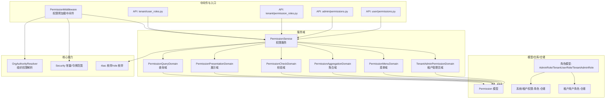
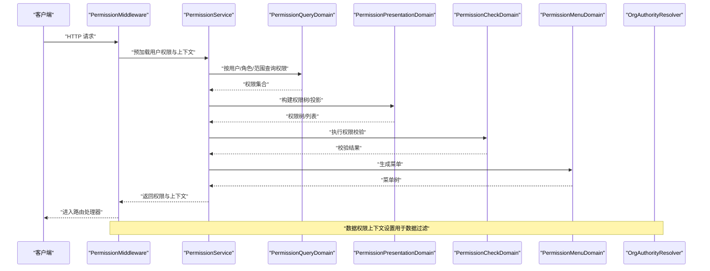
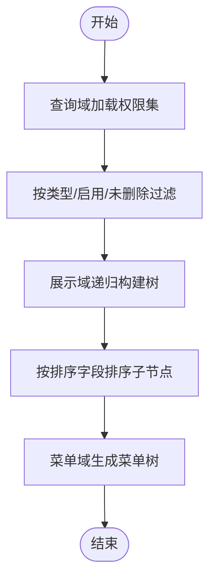
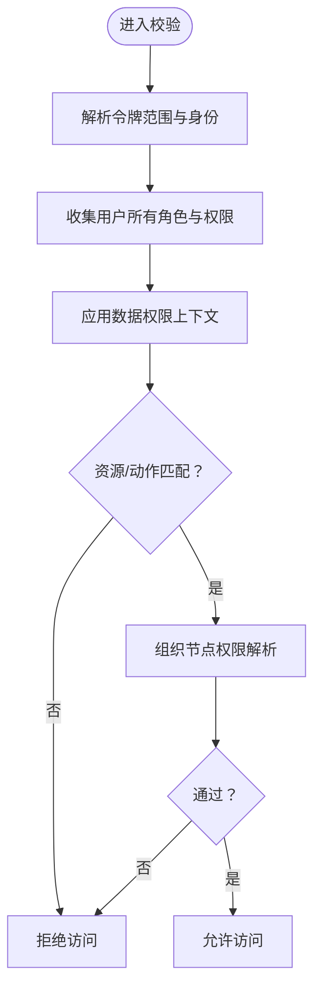
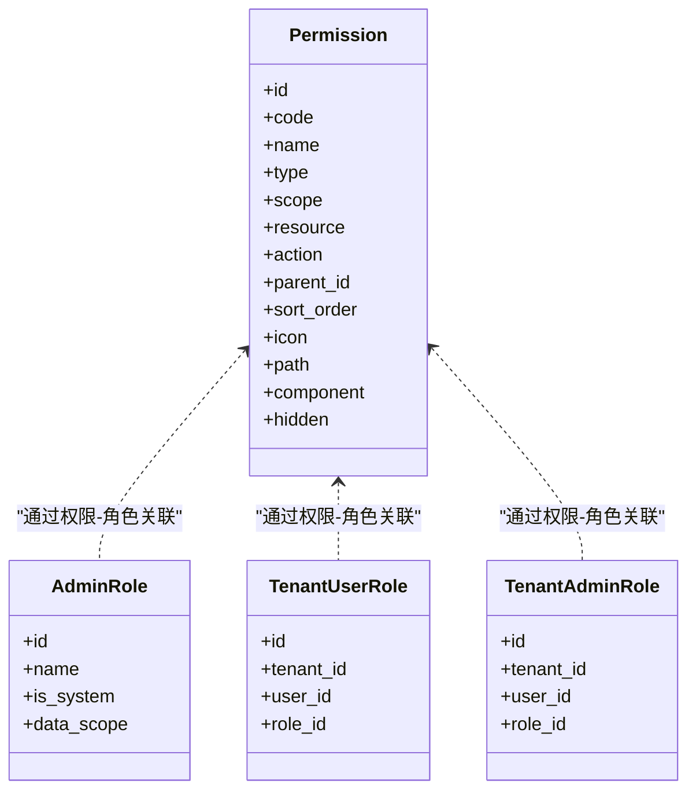
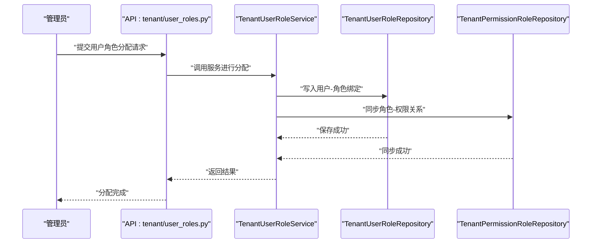
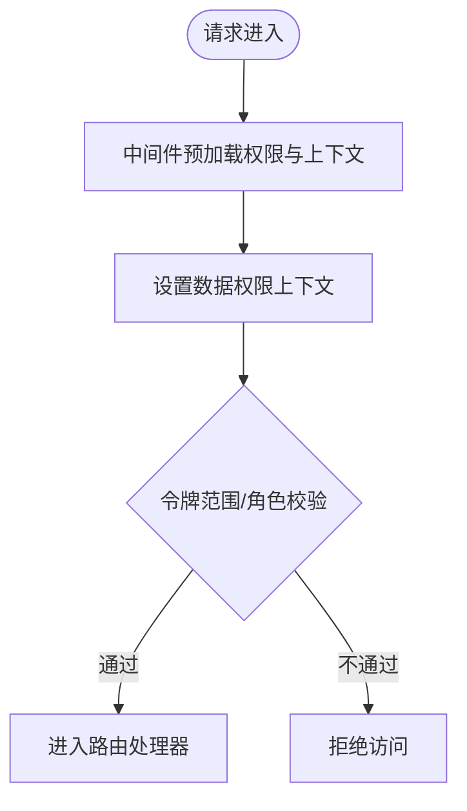
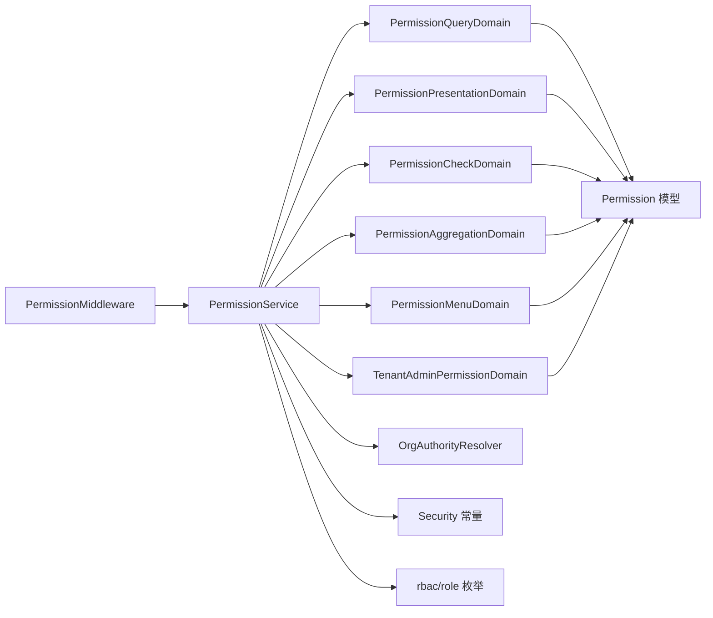

# 用户角色管理

<cite>
**本文引用的文件**
- [backend/app/rbac/services/permission_service.py](file://backend/app/rbac/services/permission_service.py)
- [backend/app/rbac/services/permission_domains/query.py](file://backend/app/rbac/services/permission_domains/query.py)
- [backend/app/rbac/services/permission_domains/presentation.py](file://backend/app/rbac/services/permission_domains/presentation.py)
- [backend/app/rbac/services/permission_domains/checks.py](file://backend/app/rbac/services/permission_domains/checks.py)
- [backend/app/rbac/services/permission_domains/aggregation.py](file://backend/app/rbac/services/permission_domains/aggregation.py)
- [backend/app/rbac/services/permission_domains/menu_query.py](file://backend/app/rbac/services/permission_domains/menu_query.py)
- [backend/app/rbac/services/permission_domains/tenant_admin.py](file://backend/app/rbac/services/permission_domains/tenant_admin.py)
- [backend/app/middleware/permission.py](file://backend/app/middleware/permission.py)
- [backend/app/models/auth/permission.py](file://backend/app/models/auth/permission.py)
- [backend/app/models/auth/admin_role.py](file://backend/app/models/auth/admin_role.py)
- [backend/app/models/auth/tenant_user_role.py](file://backend/app/models/auth/tenant_user_role.py)
- [backend/app/models/auth/tenant_admin_role.py](file://backend/app/models/auth/tenant_admin_role.py)
- [backend/app/schemas/common/permission.py](file://backend/app/schemas/common/permission.py)
- [backend/app/schemas/system/role.py](file://backend/app/schemas/system/role.py)
- [backend/app/schemas/tenant/user_role.py](file://backend/app/schemas/tenant/user_role.py)
- [backend/app/schemas/tenant/tenant_permission_role.py](file://backend/app/schemas/tenant/tenant_permission_role.py)
- [backend/app/schemas/system/admin_permission_role.py](file://backend/app/schemas/system/admin_permission_role.py)
- [backend/app/repositories/system/admin_permission_role_repository.py](file://backend/app/repositories/system/admin_permission_role_repository.py)
- [backend/app/repositories/tenant/tenant_permission_role_repository.py](file://backend/app/repositories/tenant/tenant_permission_role_repository.py)
- [backend/app/repositories/tenant/tenant_user_role_repository.py](file://backend/app/repositories/tenant/tenant_user_role_repository.py)
- [backend/app/services/tenant/tenant_user_role_service.py](file://backend/app/services/tenant/tenant_user_role_service.py)
- [backend/app/services/system/admin_permission_role_service.py](file://backend/app/services/system/admin_permission_role_service.py)
- [backend/app/services/tenant/tenant_permission_role_service.py](file://backend/app/services/tenant/tenant_permission_role_service.py)
- [backend/app/services/common/role_tree_mixin.py](file://backend/app/services/common/role_tree_mixin.py)
- [backend/app/enums/role.py](file://backend/app/enums/role.py)
- [backend/app/enums/rbac.py](file://backend/app/enums/rbac.py)
- [backend/app/core/org_authority.py](file://backend/app/core/org_authority.py)
- [backend/app/core/security.py](file://backend/app/core/security.py)
- [backend/app/api/tenant/user_roles.py](file://backend/app/api/tenant/user_roles.py)
- [backend/app/api/tenant/permission_roles.py](file://backend/app/api/tenant/permission_roles.py)
- [backend/app/api/admin/permissions.py](file://backend/app/api/admin/permissions.py)
- [backend/app/api/user/permissions.py](file://backend/app/api/user/permissions.py)
- [backend/migrations/versions/20260114_13da4a77114f_change_permission_unique_constraint_to_.py](file://backend/migrations/versions/20260114_13da4a77114f_change_permission_unique_constraint_to_.py)
- [backend/migrations/versions/20260318_1935_merge_all_heads.py](file://backend/migrations/versions/20260318_1935_merge_all_heads.py)
- [backend/migrations/versions/20260320_unified_resource_and_permission_scope.py](file://backend/migrations/versions/20260320_unified_resource_and_permission_scope.py)
- [backend/migrations/versions/20260325_org_authority_rebuild.py](file://backend/migrations/versions/20260325_org_authority_rebuild.py)
- [backend/migrations/versions/20260325_org_node_perm.py](file://backend/migrations/versions/20260325_org_node_perm.py)
- [backend/migrations/versions/20260327_1500_cleanup_legacy.py](file://backend/migrations/versions/20260327_1500_cleanup_legacy.py)
- [backend/migrations/versions/20260327_1930_residual_schema.py](file://backend/migrations/versions/20260327_1930_residual_schema.py)
- [backend/migrations/versions/20260329_0010_normalize_task_definition_platform_scope.py](file://backend/migrations/versions/20260329_0010_normalize_task_definition_platform_scope.py)
- [backend/migrations/versions/20260329_0020_cleanup_task_binding_scope_semantics.py](file://backend/migrations/versions/20260329_0020_cleanup_task_binding_scope_semantics.py)
- [backend/migrations/versions/20260330_0060_add_execution_decision_id_to_ai_action_logs.py](file://backend/migrations/versions/20260330_0060_add_execution_decision_id_to_ai_action_logs.py)
- [backend/migrations/versions/20260330_0070_add_profile_snapshots.py](file://backend/migrations/versions/20260330_0070_add_profile_snapshots.py)
</cite>

## 目录
1. [简介](#简介)
2. [项目结构](#项目结构)
3. [核心组件](#核心组件)
4. [架构总览](#架构总览)
5. [详细组件分析](#详细组件分析)
6. [依赖分析](#依赖分析)
7. [性能考虑](#性能考虑)
8. [故障排查指南](#故障排查指南)
9. [结论](#结论)
10. [附录](#附录)

## 简介
本技术文档围绕用户角色与权限管理体系展开，系统性阐述用户与角色的关联关系、权限继承与作用域控制、角色树结构与权限层级、权限变更与访问控制流程、操作审计与合规追踪，并覆盖用户状态管理、登录安全与会话控制。文档同时给出角色权限与业务功能的映射关系、权限验证与授权决策机制、最佳实践、安全策略与性能优化建议，并提供可直接定位到源码的权限配置示例与权限检查代码演示路径。

## 项目结构
RBAC 子系统由“服务域”“模型/仓库/仓储”“中间件与API”“枚举与常量”等层次构成，采用分层与职责分离的设计模式，确保权限查询、聚合、展示、校验与菜单构建解耦且可扩展。

图示来源
- [backend/app/middleware/permission.py:1-38](file://backend/app/middleware/permission.py#L1-L38)
- [backend/app/rbac/services/permission_service.py](file://backend/app/rbac/services/permission_service.py)
- [backend/app/rbac/services/permission_domains/query.py:1-33](file://backend/app/rbac/services/permission_domains/query.py#L1-L33)
- [backend/app/rbac/services/permission_domains/presentation.py:94-127](file://backend/app/rbac/services/permission_domains/presentation.py#L94-L127)
- [backend/app/rbac/services/permission_domains/checks.py](file://backend/app/rbac/services/permission_domains/checks.py)
- [backend/app/rbac/services/permission_domains/aggregation.py](file://backend/app/rbac/services/permission_domains/aggregation.py)
- [backend/app/rbac/services/permission_domains/menu_query.py](file://backend/app/rbac/services/permission_domains/menu_query.py)
- [backend/app/rbac/services/permission_domains/tenant_admin.py](file://backend/app/rbac/services/permission_domains/tenant_admin.py)
- [backend/app/models/auth/permission.py](file://backend/app/models/auth/permission.py)
- [backend/app/models/auth/admin_role.py](file://backend/app/models/auth/admin_role.py)
- [backend/app/models/auth/tenant_user_role.py](file://backend/app/models/auth/tenant_user_role.py)
- [backend/app/models/auth/tenant_admin_role.py](file://backend/app/models/auth/tenant_admin_role.py)
- [backend/app/repositories/system/admin_permission_role_repository.py](file://backend/app/repositories/system/admin_permission_role_repository.py)
- [backend/app/repositories/tenant/tenant_permission_role_repository.py](file://backend/app/repositories/tenant/tenant_permission_role_repository.py)
- [backend/app/repositories/tenant/tenant_user_role_repository.py](file://backend/app/repositories/tenant/tenant_user_role_repository.py)
- [backend/app/core/org_authority.py](file://backend/app/core/org_authority.py)
- [backend/app/core/security.py](file://backend/app/core/security.py)
- [backend/app/enums/rbac.py](file://backend/app/enums/rbac.py)
- [backend/app/enums/role.py](file://backend/app/enums/role.py)

章节来源
- [backend/app/rbac/services/permission_service.py](file://backend/app/rbac/services/permission_service.py)
- [backend/app/middleware/permission.py:1-38](file://backend/app/middleware/permission.py#L1-L38)

## 核心组件
- 权限服务与域：PermissionService 作为统一入口，协调查询域、展示域、校验域、聚合域、菜单域与租户管理员域，完成权限树构建、权限列表投影、权限校验与菜单生成。
- 中间件：PermissionMiddleware 在请求进入路由前预加载用户权限与数据权限上下文，供后续装饰器与控制器直接使用。
- 模型与仓储：Permission 模型承载权限元数据；角色模型 AdminRole、TenantUserRole、TenantAdminRole 描述用户与角色的绑定；系统/租户权限-角色仓储负责持久化与查询。
- 枚举与常量：rbac 枚举定义权限范围、类型、作用域等；security 定义令牌类型与范围常量；role 枚举定义角色类型。
- API 层：提供用户角色分配、权限变更、角色树查询、菜单查询等接口。

章节来源
- [backend/app/rbac/services/permission_domains/query.py:1-33](file://backend/app/rbac/services/permission_domains/query.py#L1-L33)
- [backend/app/rbac/services/permission_domains/presentation.py:94-127](file://backend/app/rbac/services/permission_domains/presentation.py#L94-L127)
- [backend/app/rbac/services/permission_domains/checks.py](file://backend/app/rbac/services/permission_domains/checks.py)
- [backend/app/rbac/services/permission_domains/aggregation.py](file://backend/app/rbac/services/permission_domains/aggregation.py)
- [backend/app/rbac/services/permission_domains/menu_query.py](file://backend/app/rbac/services/permission_domains/menu_query.py)
- [backend/app/rbac/services/permission_domains/tenant_admin.py](file://backend/app/rbac/services/permission_domains/tenant_admin.py)
- [backend/app/middleware/permission.py:1-38](file://backend/app/middleware/permission.py#L1-L38)
- [backend/app/models/auth/permission.py](file://backend/app/models/auth/permission.py)
- [backend/app/models/auth/admin_role.py](file://backend/app/models/auth/admin_role.py)
- [backend/app/models/auth/tenant_user_role.py](file://backend/app/models/auth/tenant_user_role.py)
- [backend/app/models/auth/tenant_admin_role.py](file://backend/app/models/auth/tenant_admin_role.py)
- [backend/app/enums/rbac.py](file://backend/app/enums/rbac.py)
- [backend/app/enums/role.py](file://backend/app/enums/role.py)
- [backend/app/core/security.py](file://backend/app/core/security.py)

## 架构总览
下图展示了从请求到权限决策的关键链路：中间件预加载、服务域聚合、权限树构建与校验、菜单生成与数据权限过滤。

图示来源
- [backend/app/middleware/permission.py:1-38](file://backend/app/middleware/permission.py#L1-L38)
- [backend/app/rbac/services/permission_service.py](file://backend/app/rbac/services/permission_service.py)
- [backend/app/rbac/services/permission_domains/query.py:1-33](file://backend/app/rbac/services/permission_domains/query.py#L1-L33)
- [backend/app/rbac/services/permission_domains/presentation.py:94-127](file://backend/app/rbac/services/permission_domains/presentation.py#L94-L127)
- [backend/app/rbac/services/permission_domains/checks.py](file://backend/app/rbac/services/permission_domains/checks.py)
- [backend/app/rbac/services/permission_domains/menu_query.py](file://backend/app/rbac/services/permission_domains/menu_query.py)
- [backend/app/core/org_authority.py](file://backend/app/core/org_authority.py)

## 详细组件分析

### 权限树与菜单构建
- 查询域：根据用户/角色/范围筛选启用且未删除的权限，支持按类型过滤与排序。
- 展示域：递归构建权限树，投影为树形响应结构，包含排序、图标、路径、组件、隐藏标记等字段。
- 菜单域：基于权限树生成前端菜单，支持插件菜单识别与翻译。

图示来源
- [backend/app/rbac/services/permission_domains/query.py:18-33](file://backend/app/rbac/services/permission_domains/query.py#L18-L33)
- [backend/app/rbac/services/permission_domains/presentation.py:94-127](file://backend/app/rbac/services/permission_domains/presentation.py#L94-L127)
- [backend/app/rbac/services/permission_domains/menu_query.py](file://backend/app/rbac/services/permission_domains/menu_query.py)

章节来源
- [backend/app/rbac/services/permission_domains/query.py:1-33](file://backend/app/rbac/services/permission_domains/query.py#L1-L33)
- [backend/app/rbac/services/permission_domains/presentation.py:94-127](file://backend/app/rbac/services/permission_domains/presentation.py#L94-L127)
- [backend/app/rbac/services/permission_domains/menu_query.py](file://backend/app/rbac/services/permission_domains/menu_query.py)

### 权限校验与授权决策
- 校验域：实现权限码匹配、资源作用域判断、数据权限上下文应用、组织节点权限解析。
- 授权决策：结合令牌范围（平台/租户/用户）、角色继承与权限树，判定是否允许访问目标资源与动作。

图示来源
- [backend/app/rbac/services/permission_domains/checks.py](file://backend/app/rbac/services/permission_domains/checks.py)
- [backend/app/core/org_authority.py](file://backend/app/core/org_authority.py)
- [backend/app/core/security.py](file://backend/app/core/security.py)

章节来源
- [backend/app/rbac/services/permission_domains/checks.py](file://backend/app/rbac/services/permission_domains/checks.py)
- [backend/app/core/org_authority.py](file://backend/app/core/org_authority.py)
- [backend/app/core/security.py](file://backend/app/core/security.py)

### 角色树结构与继承
- 角色模型：AdminRole（平台）、TenantUserRole（租户用户）、TenantAdminRole（租户管理员）。
- 继承与聚合：通过角色树混入与权限聚合域，实现角色层级与权限继承计算。
- 数据模型：角色与权限的多对多关系，支持系统级与租户级角色。

图示来源
- [backend/app/models/auth/permission.py](file://backend/app/models/auth/permission.py)
- [backend/app/models/auth/admin_role.py](file://backend/app/models/auth/admin_role.py)
- [backend/app/models/auth/tenant_user_role.py](file://backend/app/models/auth/tenant_user_role.py)
- [backend/app/models/auth/tenant_admin_role.py](file://backend/app/models/auth/tenant_admin_role.py)

章节来源
- [backend/app/models/auth/permission.py](file://backend/app/models/auth/permission.py)
- [backend/app/models/auth/admin_role.py](file://backend/app/models/auth/admin_role.py)
- [backend/app/models/auth/tenant_user_role.py](file://backend/app/models/auth/tenant_user_role.py)
- [backend/app/models/auth/tenant_admin_role.py](file://backend/app/models/auth/tenant_admin_role.py)
- [backend/app/services/common/role_tree_mixin.py](file://backend/app/services/common/role_tree_mixin.py)
- [backend/app/schemas/system/role.py](file://backend/app/schemas/system/role.py)
- [backend/app/schemas/tenant/user_role.py](file://backend/app/schemas/tenant/user_role.py)

### 用户角色分配与权限变更
- 租户用户角色服务：提供用户角色分配、批量更新、显示信息维护等能力。
- 系统/租户权限-角色服务：维护角色与权限的绑定关系，支持变更同步与一致性保障。
- API 层：提供用户角色分配、角色权限映射、角色树查询等接口。

图示来源
- [backend/app/api/tenant/user_roles.py](file://backend/app/api/tenant/user_roles.py)
- [backend/app/services/tenant/tenant_user_role_service.py](file://backend/app/services/tenant/tenant_user_role_service.py)
- [backend/app/repositories/tenant/tenant_user_role_repository.py](file://backend/app/repositories/tenant/tenant_user_role_repository.py)
- [backend/app/repositories/tenant/tenant_permission_role_repository.py](file://backend/app/repositories/tenant/tenant_permission_role_repository.py)
- [backend/app/services/tenant/tenant_permission_role_service.py](file://backend/app/services/tenant/tenant_permission_role_service.py)
- [backend/app/services/system/admin_permission_role_service.py](file://backend/app/services/system/admin_permission_role_service.py)

章节来源
- [backend/app/api/tenant/user_roles.py](file://backend/app/api/tenant/user_roles.py)
- [backend/app/services/tenant/tenant_user_role_service.py](file://backend/app/services/tenant/tenant_user_role_service.py)
- [backend/app/repositories/tenant/tenant_user_role_repository.py](file://backend/app/repositories/tenant/tenant_user_role_repository.py)
- [backend/app/repositories/tenant/tenant_permission_role_repository.py](file://backend/app/repositories/tenant/tenant_permission_role_repository.py)
- [backend/app/services/tenant/tenant_permission_role_service.py](file://backend/app/services/tenant/tenant_permission_role_service.py)
- [backend/app/services/system/admin_permission_role_service.py](file://backend/app/services/system/admin_permission_role_service.py)

### 访问控制与数据权限
- 中间件：在路由处理前注入用户权限与数据权限上下文，供后续装饰器与控制器使用。
- 数据权限：通过组织权限解析器与令牌范围，限制用户可见的数据范围与操作边界。
- 登录安全与会话控制：令牌类型与范围常量定义了访问边界，配合中间件实现统一鉴权。

图示来源
- [backend/app/middleware/permission.py:1-38](file://backend/app/middleware/permission.py#L1-L38)
- [backend/app/core/org_authority.py](file://backend/app/core/org_authority.py)
- [backend/app/core/security.py](file://backend/app/core/security.py)

章节来源
- [backend/app/middleware/permission.py:1-38](file://backend/app/middleware/permission.py#L1-L38)
- [backend/app/core/org_authority.py](file://backend/app/core/org_authority.py)
- [backend/app/core/security.py](file://backend/app/core/security.py)

### 操作审计与合规
- 运行日志与操作日志：系统提供运行日志与操作日志表，支持审计追踪与合规要求。
- 执行决策记录：AI 行动日志与执行决策 ID 关联，便于回溯与审计。

章节来源
- [backend/migrations/versions/20260330_0060_add_execution_decision_id_to_ai_action_logs.py](file://backend/migrations/versions/20260330_0060_add_execution_decision_id_to_ai_action_logs.py)
- [backend/migrations/versions/20260330_0070_add_profile_snapshots.py](file://backend/migrations/versions/20260330_0070_add_profile_snapshots.py)

## 依赖分析
- 组件内聚与耦合：权限服务域之间高内聚、低耦合；中间件仅负责预加载，不参与具体业务逻辑。
- 外部依赖：SQLAlchemy 查询、ASGI 中间件栈、组织权限解析器。
- 可能的循环依赖：当前结构以服务域为聚合点，避免直接循环依赖。

图示来源
- [backend/app/middleware/permission.py:1-38](file://backend/app/middleware/permission.py#L1-L38)
- [backend/app/rbac/services/permission_service.py](file://backend/app/rbac/services/permission_service.py)
- [backend/app/rbac/services/permission_domains/query.py:1-33](file://backend/app/rbac/services/permission_domains/query.py#L1-L33)
- [backend/app/rbac/services/permission_domains/presentation.py:94-127](file://backend/app/rbac/services/permission_domains/presentation.py#L94-L127)
- [backend/app/rbac/services/permission_domains/checks.py](file://backend/app/rbac/services/permission_domains/checks.py)
- [backend/app/rbac/services/permission_domains/aggregation.py](file://backend/app/rbac/services/permission_domains/aggregation.py)
- [backend/app/rbac/services/permission_domains/menu_query.py](file://backend/app/rbac/services/permission_domains/menu_query.py)
- [backend/app/rbac/services/permission_domains/tenant_admin.py](file://backend/app/rbac/services/permission_domains/tenant_admin.py)
- [backend/app/core/org_authority.py](file://backend/app/core/org_authority.py)
- [backend/app/core/security.py](file://backend/app/core/security.py)
- [backend/app/enums/rbac.py](file://backend/app/enums/rbac.py)
- [backend/app/enums/role.py](file://backend/app/enums/role.py)

章节来源
- [backend/app/rbac/services/permission_service.py](file://backend/app/rbac/services/permission_service.py)
- [backend/app/middleware/permission.py:1-38](file://backend/app/middleware/permission.py#L1-L38)

## 性能考虑
- 查询优化：权限查询域按启用/未删除与类型过滤，减少无效数据扫描；排序字段用于稳定输出顺序。
- 树构建：展示域递归构建树时按排序字段排序子节点，避免额外排序开销。
- 缓存策略：可在中间件或服务层引入缓存（如用户权限快照），降低重复查询成本。
- 批量操作：角色分配与权限同步尽量批量执行，减少数据库往返。
- 数据权限过滤：在查询阶段尽早应用数据权限上下文，避免全量数据后再过滤。

## 故障排查指南
- 权限未生效：检查中间件是否正确注入用户权限与数据权限上下文；确认令牌范围与角色绑定。
- 菜单异常：检查权限树构建与菜单域生成逻辑，确认排序与隐藏字段。
- 数据越权：核查组织权限解析器与数据权限上下文设置，确保资源作用域与可见范围一致。
- 权限唯一约束变更：迁移中权限唯一约束已调整，需确认新约束下的权限码冲突与兼容性。

章节来源
- [backend/app/middleware/permission.py:1-38](file://backend/app/middleware/permission.py#L1-L38)
- [backend/migrations/versions/20260114_13da4a77114f_change_permission_unique_constraint_to_.py](file://backend/migrations/versions/20260114_13da4a77114f_change_permission_unique_constraint_to_.py)
- [backend/migrations/versions/20260320_unified_resource_and_permission_scope.py](file://backend/migrations/versions/20260320_unified_resource_and_permission_scope.py)

## 结论
本系统通过清晰的服务域划分与中间件预加载机制，实现了用户角色与权限的高效管理与严格控制。权限树、作用域与数据权限过滤共同构成了完整的访问控制闭环；配合审计与合规能力，满足企业级安全与治理需求。建议在生产环境中结合缓存与批量操作进一步优化性能，并持续完善权限变更与审计流程。

## 附录

### 权限配置示例与检查代码演示（路径）
- 权限树查询与投影：[backend/app/rbac/services/permission_domains/presentation.py:94-127](file://backend/app/rbac/services/permission_domains/presentation.py#L94-L127)
- 权限查询与过滤：[backend/app/rbac/services/permission_domains/query.py:18-33](file://backend/app/rbac/services/permission_domains/query.py#L18-L33)
- 权限校验流程：[backend/app/rbac/services/permission_domains/checks.py](file://backend/app/rbac/services/permission_domains/checks.py)
- 菜单生成：[backend/app/rbac/services/permission_domains/menu_query.py](file://backend/app/rbac/services/permission_domains/menu_query.py)
- 用户角色分配接口：[backend/app/api/tenant/user_roles.py](file://backend/app/api/tenant/user_roles.py)
- 角色权限映射接口：[backend/app/api/tenant/permission_roles.py](file://backend/app/api/tenant/permission_roles.py)
- 平台权限管理接口：[backend/app/api/admin/permissions.py](file://backend/app/api/admin/permissions.py)
- 用户侧权限接口：[backend/app/api/user/permissions.py](file://backend/app/api/user/permissions.py)
- 中间件预加载：[backend/app/middleware/permission.py:1-38](file://backend/app/middleware/permission.py#L1-L38)
- 组织权限解析：[backend/app/core/org_authority.py](file://backend/app/core/org_authority.py)
- 令牌范围与类型：[backend/app/core/security.py](file://backend/app/core/security.py)
- 角色与权限模型：[backend/app/models/auth/admin_role.py](file://backend/app/models/auth/admin_role.py), [backend/app/models/auth/tenant_user_role.py](file://backend/app/models/auth/tenant_user_role.py), [backend/app/models/auth/tenant_admin_role.py](file://backend/app/models/auth/tenant_admin_role.py), [backend/app/models/auth/permission.py](file://backend/app/models/auth/permission.py)
- 角色树混入：[backend/app/services/common/role_tree_mixin.py](file://backend/app/services/common/role_tree_mixin.py)
- 角色/权限枚举：[backend/app/enums/role.py](file://backend/app/enums/role.py), [backend/app/enums/rbac.py](file://backend/app/enums/rbac.py)