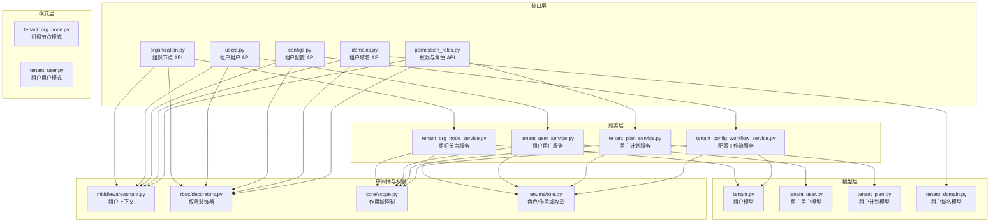
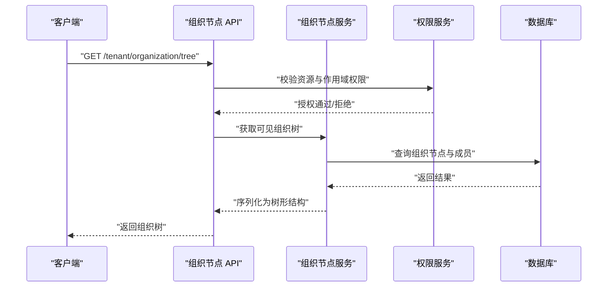
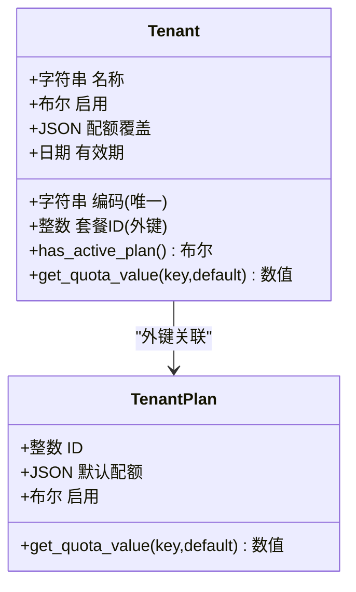
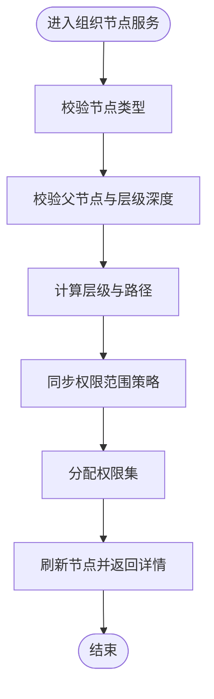
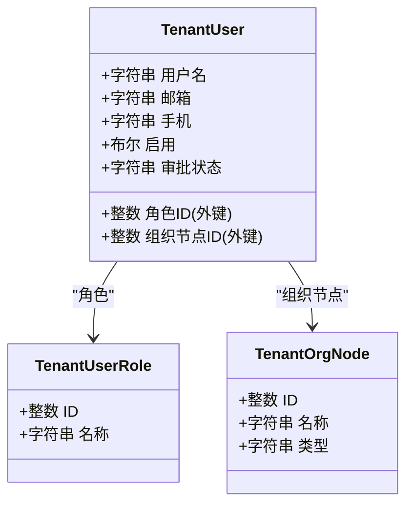
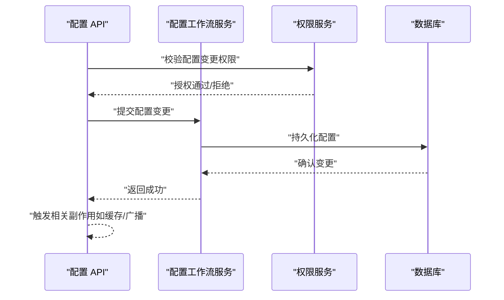
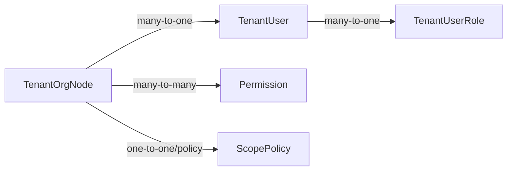
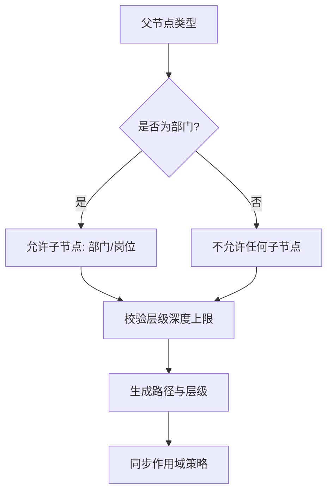
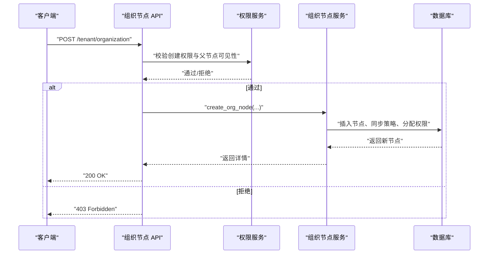
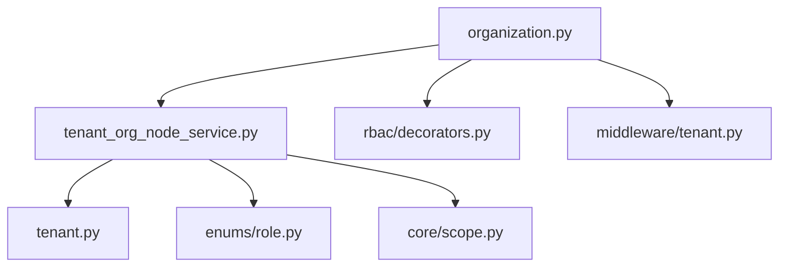

# 租户管理

<cite>
**本文引用的文件**
- [backend/app/models/tenant/tenant.py](file://backend/app/models/tenant/tenant.py)
- [backend/app/schemas/tenant/tenant_org_node.py](file://backend/app/schemas/tenant/tenant_org_node.py)
- [backend/app/services/tenant/tenant_org_node_service.py](file://backend/app/services/tenant/tenant_org_node_service.py)
- [backend/app/api/tenant/organization.py](file://backend/app/api/tenant/organization.py)
- [backend/app/models/tenant/tenant_user.py](file://backend/app/models/tenant/tenant_user.py)
- [backend/app/services/tenant/tenant_user_service.py](file://backend/app/services/tenant/tenant_user_service.py)
- [backend/app/api/tenant/users.py](file://backend/app/api/tenant/users.py)
- [backend/app/models/tenant/tenant_plan.py](file://backend/app/models/tenant/tenant_plan.py)
- [backend/app/services/tenant/tenant_plan_service.py](file://backend/app/services/tenant/tenant_plan_service.py)
- [backend/app/api/tenant/ai_config.py](file://backend/app/api/tenant/ai_config.py)
- [backend/app/middleware/tenant.py](file://backend/app/middleware/tenant.py)
- [backend/app/core/scope.py](file://backend/app/core/scope.py)
- [backend/app/enums/role.py](file://backend/app/enums/role.py)
- [backend/app/rbac/decorators.py](file://backend/app/rbac/decorators.py)
- [backend/app/api/tenant/configs.py](file://backend/app/api/tenant/configs.py)
- [backend/app/services/tenant/tenant_config_workflow_service.py](file://backend/app/services/tenant/tenant_config_workflow_service.py)
- [backend/app/api/tenant/domains.py](file://backend/app/api/tenant/domains.py)
- [backend/app/models/tenant/tenant_domain.py](file://backend/app/models/tenant/tenant_domain.py)
- [backend/app/api/tenant/permission_roles.py](file://backend/app/api/tenant/permission_roles.py)
- [backend/app/services/tenant/tenant_permission_role_service.py](file://backend/app/services/tenant/tenant_permission_role_service.py)
- [backend/app/api/tenant/analytics.py](file://backend/app/api/tenant/analytics.py)
- [backend/app/api/tenant/dashboards.py](file://backend/app/api/tenant/dashboards.py)
</cite>

## 目录
1. [简介](#简介)
2. [项目结构](#项目结构)
3. [核心组件](#核心组件)
4. [架构总览](#架构总览)
5. [详细组件分析](#详细组件分析)
6. [依赖分析](#依赖分析)
7. [性能考量](#性能考量)
8. [故障排查指南](#故障排查指南)
9. [结论](#结论)
10. [附录](#附录)

## 简介
本技术文档面向租户管理系统，系统性阐述租户实体设计、属性与业务规则，以及围绕租户的创建、更新、删除、查询、配置项、状态管理与生命周期控制。文档还涵盖租户与用户、权限、资源的关系映射，组织层级结构、继承关系与作用域控制，并提供最佳实践、性能优化与安全建议。同时给出典型 API 调用路径与错误处理策略，帮助开发者快速理解并正确实现相关功能。

## 项目结构
租户管理相关代码主要分布在以下模块：
- 模型层（models/tenant）：定义租户、用户、计划、域名等实体及其约束与关系
- 模式层（schemas/tenant）：定义组织节点、用户、角色等请求/响应模式
- 服务层（services/tenant）：封装组织节点、用户、计划、配置等工作流
- 接口层（api/tenant）：暴露组织、用户、配置、域名、权限等租户侧 API
- 中间件与权限（middleware/tenant, rbac, core/scope）：实现租户上下文注入、作用域与权限控制
- 枚举与常量（enums/role）：角色类型、数据作用域等

**图表来源**
- [backend/app/api/tenant/organization.py:1-815](file://backend/app/api/tenant/organization.py#L1-L815)
- [backend/app/services/tenant/tenant_org_node_service.py:1-657](file://backend/app/services/tenant/tenant_org_node_service.py#L1-L657)
- [backend/app/schemas/tenant/tenant_org_node.py:1-281](file://backend/app/schemas/tenant/tenant_org_node.py#L1-L281)
- [backend/app/models/tenant/tenant.py:1-260](file://backend/app/models/tenant/tenant.py#L1-L260)
- [backend/app/api/tenant/users.py](file://backend/app/api/tenant/users.py)
- [backend/app/services/tenant/tenant_user_service.py](file://backend/app/services/tenant/tenant_user_service.py)
- [backend/app/models/tenant/tenant_user.py:1-234](file://backend/app/models/tenant/tenant_user.py#L1-L234)
- [backend/app/api/tenant/configs.py](file://backend/app/api/tenant/configs.py)
- [backend/app/services/tenant/tenant_config_workflow_service.py](file://backend/app/services/tenant/tenant_config_workflow_service.py)
- [backend/app/api/tenant/domains.py](file://backend/app/api/tenant/domains.py)
- [backend/app/models/tenant/tenant_domain.py](file://backend/app/models/tenant/tenant_domain.py)
- [backend/app/api/tenant/permission_roles.py](file://backend/app/api/tenant/permission_roles.py)
- [backend/app/services/tenant/tenant_permission_role_service.py](file://backend/app/services/tenant/tenant_permission_role_service.py)
- [backend/app/middleware/tenant.py](file://backend/app/middleware/tenant.py)
- [backend/app/rbac/decorators.py](file://backend/app/rbac/decorators.py)
- [backend/app/core/scope.py](file://backend/app/core/scope.py)
- [backend/app/enums/role.py](file://backend/app/enums/role.py)

**章节来源**
- [backend/app/api/tenant/organization.py:1-815](file://backend/app/api/tenant/organization.py#L1-L815)
- [backend/app/services/tenant/tenant_org_node_service.py:1-657](file://backend/app/services/tenant/tenant_org_node_service.py#L1-L657)
- [backend/app/schemas/tenant/tenant_org_node.py:1-281](file://backend/app/schemas/tenant/tenant_org_node.py#L1-L281)
- [backend/app/models/tenant/tenant.py:1-260](file://backend/app/models/tenant/tenant.py#L1-L260)

## 核心组件
- 租户实体（Tenant）：多租户隔离的核心，包含基础信息、联系人、状态、套餐关联、有效期、配额覆盖、设置退役列等；提供子域名、活跃计划判断、配额获取等辅助属性与校验逻辑
- 组织节点（TenantOrgNode）：支持“部门/岗位”两级树形结构，具备路径、层级、排序、可见范围策略（含自定义范围）、负责人、成员数、权限数等属性
- 租户用户（TenantUser）：企业终端用户，支持用户名/邮箱/手机唯一约束、角色与组织节点关联、审批状态、登录审计与安全字段
- 租户计划（TenantPlan）：套餐模型，用于提供默认配额与权限基线
- 配置工作流（TenantConfigWorkflowService）：封装租户配置变更流程与校验
- 中间件与权限（TenantMiddleware、RBAC、Scope）：注入当前租户上下文，基于资源与作用域进行权限控制

**章节来源**
- [backend/app/models/tenant/tenant.py:18-260](file://backend/app/models/tenant/tenant.py#L18-L260)
- [backend/app/models/tenant/tenant_user.py:28-234](file://backend/app/models/tenant/tenant_user.py#L28-L234)
- [backend/app/schemas/tenant/tenant_org_node.py:1-281](file://backend/app/schemas/tenant/tenant_org_node.py#L1-L281)
- [backend/app/services/tenant/tenant_config_workflow_service.py](file://backend/app/services/tenant/tenant_config_workflow_service.py)

## 架构总览
租户管理采用典型的分层架构：API 控制器负责路由与鉴权，服务层编排业务流程，模型层承载数据与约束，中间件与权限层保障作用域与安全。

**图表来源**
- [backend/app/api/tenant/organization.py:257-290](file://backend/app/api/tenant/organization.py#L257-L290)
- [backend/app/services/tenant/tenant_org_node_service.py:339-340](file://backend/app/services/tenant/tenant_org_node_service.py#L339-L340)
- [backend/app/middleware/tenant.py](file://backend/app/middleware/tenant.py)
- [backend/app/rbac/decorators.py](file://backend/app/rbac/decorators.py)

## 详细组件分析

### 租户实体设计与业务规则
- 实体属性
  - 基本信息：名称、编码（唯一索引）、联系人信息
  - 状态：启用/禁用标志
  - 套餐：外键关联租户计划，支持软删除时保留 plan_id
  - 配额：JSON 字段，支持企业级配额覆盖
  - 有效期：到期时间
  - 设置：退役列，统一通过配置服务读取
- 删除策略
  - 管理员依赖：阻断删除
  - 域名依赖：软删除级联
  - 系统代理分配：级联物理删除
- 辅助能力
  - 子域名：等于编码
  - 活跃计划判断：综合租户与计划状态
  - 配额获取：优先企业级覆盖，其次计划默认
  - 退役列写入保护：禁止直接写入退役列，需走 plan_id 或配置服务

**图表来源**
- [backend/app/models/tenant/tenant.py:18-260](file://backend/app/models/tenant/tenant.py#L18-L260)
- [backend/app/models/tenant/tenant_plan.py](file://backend/app/models/tenant/tenant_plan.py)

**章节来源**
- [backend/app/models/tenant/tenant.py:18-260](file://backend/app/models/tenant/tenant.py#L18-L260)

### 组织节点与层级结构
- 支持类型：部门（DEPARTMENT）与岗位（POSITION），父子类型受限
- 结构特性：路径（materialized path）、层级、排序、可见范围策略
- 权限策略：支持“仅本部门及子部门”“自定义范围”等数据作用域
- 成员管理：负责人、成员增删改查、密码重置、状态切换
- 服务能力：创建/更新/移动/删除、批量重排序、树与子节点查询、可见范围树构建

**图表来源**
- [backend/app/services/tenant/tenant_org_node_service.py:197-255](file://backend/app/services/tenant/tenant_org_node_service.py#L197-L255)

**章节来源**
- [backend/app/schemas/tenant/tenant_org_node.py:92-149](file://backend/app/schemas/tenant/tenant_org_node.py#L92-L149)
- [backend/app/services/tenant/tenant_org_node_service.py:197-321](file://backend/app/services/tenant/tenant_org_node_service.py#L197-L321)
- [backend/app/api/tenant/organization.py:406-541](file://backend/app/api/tenant/organization.py#L406-L541)

### 租户用户与角色
- 用户模型：用户名/邮箱/手机唯一约束（同租户内），支持第三方登录字段（如微信 OpenID/UnionID），角色与组织节点关联
- 审批状态：待审/已审/拒绝
- 登录安全：失败计数、最后失败时间、锁定截止时间
- 服务与 API：用户 CRUD、状态切换、角色分配、分页查询、搜索过滤

**图表来源**
- [backend/app/models/tenant/tenant_user.py:28-234](file://backend/app/models/tenant/tenant_user.py#L28-L234)
- [backend/app/schemas/tenant/tenant_org_node.py:228-280](file://backend/app/schemas/tenant/tenant_org_node.py#L228-L280)

**章节来源**
- [backend/app/models/tenant/tenant_user.py:28-234](file://backend/app/models/tenant/tenant_user.py#L28-L234)
- [backend/app/api/tenant/users.py](file://backend/app/api/tenant/users.py)
- [backend/app/services/tenant/tenant_user_service.py](file://backend/app/services/tenant/tenant_user_service.py)

### 配置项、状态管理与生命周期
- 配置工作流：封装配置变更流程，确保变更前校验与一致性
- 生命周期：租户删除受依赖约束保护；域名删除支持软删除；系统代理分配删除级联
- 状态管理：租户启用/禁用、用户启用/禁用、审批状态、AI 开关（通过权限与策略解析）

**图表来源**
- [backend/app/api/tenant/configs.py](file://backend/app/api/tenant/configs.py)
- [backend/app/services/tenant/tenant_config_workflow_service.py](file://backend/app/services/tenant/tenant_config_workflow_service.py)

**章节来源**
- [backend/app/models/tenant/tenant.py:28-50](file://backend/app/models/tenant/tenant.py#L28-L50)
- [backend/app/api/tenant/configs.py](file://backend/app/api/tenant/configs.py)
- [backend/app/services/tenant/tenant_config_workflow_service.py](file://backend/app/services/tenant/tenant_config_workflow_service.py)

### 租户与用户、权限、资源的关系映射
- 组织节点与用户：用户属于组织节点，支持按可见范围查询与序列化
- 权限与角色：组织节点可分配权限集合，支持按节点维度的权限赋予权限
- 作用域控制：通过数据作用域策略限制数据访问范围（如仅本部门/自定义范围）
- RBAC 装饰器：基于资源与动作的权限控制，菜单与操作权限注册

**图表来源**
- [backend/app/models/tenant/tenant_user.py:210-222](file://backend/app/models/tenant/tenant_user.py#L210-L222)
- [backend/app/schemas/tenant/tenant_org_node.py:10-17](file://backend/app/schemas/tenant/tenant_org_node.py#L10-L17)
- [backend/app/enums/role.py](file://backend/app/enums/role.py)

**章节来源**
- [backend/app/api/tenant/organization.py:201-233](file://backend/app/api/tenant/organization.py#L201-L233)
- [backend/app/api/tenant/permission_roles.py](file://backend/app/api/tenant/permission_roles.py)
- [backend/app/services/tenant/tenant_permission_role_service.py](file://backend/app/services/tenant/tenant_permission_role_service.py)

### 租户层级结构、继承关系与作用域控制
- 层级结构：采用“部门/岗位”两级树，支持路径与层级计算，深度受限
- 继承关系：权限与配额可由上级节点继承或覆盖
- 作用域控制：数据作用域策略支持“本部门及子部门”“自定义范围”，并可对成员 AI 开关进行细粒度控制

**图表来源**
- [backend/app/services/tenant/tenant_org_node_service.py:88-97](file://backend/app/services/tenant/tenant_org_node_service.py#L88-L97)
- [backend/app/services/tenant/tenant_org_node_service.py:213-228](file://backend/app/services/tenant/tenant_org_node_service.py#L213-L228)

**章节来源**
- [backend/app/services/tenant/tenant_org_node_service.py:88-97](file://backend/app/services/tenant/tenant_org_node_service.py#L88-L97)
- [backend/app/services/tenant/tenant_org_node_service.py:213-228](file://backend/app/services/tenant/tenant_org_node_service.py#L213-L228)

### API 调用示例与错误处理策略
- 组织树获取：GET /tenant/organization/tree，返回树形结构，支持可见范围过滤
- 组织节点详情：GET /tenant/organization/{org_node_id}，返回节点详情与权限/成员统计
- 成员管理：POST/PUT/DELETE /tenant/organization/{org_node_id}/members/*
- 配置变更：PUT /tenant/configs/*，需权限校验与工作流校验
- 错误处理：统一通过 HTTP 异常与业务异常抛出，包含权限不足、参数校验失败、资源不存在等

**图表来源**
- [backend/app/api/tenant/organization.py:406-436](file://backend/app/api/tenant/organization.py#L406-L436)
- [backend/app/services/tenant/tenant_org_node_service.py:197-255](file://backend/app/services/tenant/tenant_org_node_service.py#L197-L255)

**章节来源**
- [backend/app/api/tenant/organization.py:257-541](file://backend/app/api/tenant/organization.py#L257-L541)
- [backend/app/api/tenant/configs.py](file://backend/app/api/tenant/configs.py)

## 依赖分析
- 组件耦合
  - API 控制器依赖服务层；服务层依赖模型层与仓库层；权限与作用域控制贯穿各层
  - 组织节点服务与权限服务强耦合，保证操作权限与可见范围一致
- 外部依赖
  - 数据库 ORM（SQLAlchemy）与事务管理
  - FastAPI 路由与装饰器（RBAC）
  - 国际化与响应封装（i18n、response）

**图表来源**
- [backend/app/api/tenant/organization.py:1-815](file://backend/app/api/tenant/organization.py#L1-L815)
- [backend/app/services/tenant/tenant_org_node_service.py:1-657](file://backend/app/services/tenant/tenant_org_node_service.py#L1-L657)
- [backend/app/models/tenant/tenant.py:1-260](file://backend/app/models/tenant/tenant.py#L1-L260)
- [backend/app/enums/role.py](file://backend/app/enums/role.py)
- [backend/app/rbac/decorators.py](file://backend/app/rbac/decorators.py)
- [backend/app/middleware/tenant.py](file://backend/app/middleware/tenant.py)
- [backend/app/core/scope.py](file://backend/app/core/scope.py)

**章节来源**
- [backend/app/api/tenant/organization.py:1-815](file://backend/app/api/tenant/organization.py#L1-L815)
- [backend/app/services/tenant/tenant_org_node_service.py:1-657](file://backend/app/services/tenant/tenant_org_node_service.py#L1-L657)

## 性能考量
- 查询优化
  - 使用 selectin 加载关联（如组织节点详情、成员详情），减少 N+1 查询
  - 对常用过滤字段建立索引（名称、编码、联系信息、状态、创建/更新时间）
- 写入优化
  - 事务批量提交，避免频繁 flush
  - 路径与层级计算一次性完成，减少重复计算
- 缓存与异步
  - 对热点配置与权限策略进行缓存
  - 大规模重排序与批量操作采用异步任务

[本节为通用指导，无需具体文件分析]

## 故障排查指南
- 常见错误
  - 无权限：检查资源权限与作用域可见范围
  - 参数校验：确认节点类型、父节点合法性、层级深度上限
  - 资源不存在：确认租户/组织节点/用户 ID 是否有效且未删除
  - 删除阻断：检查是否存在管理员/域名等依赖
- 排查步骤
  - 查看 API 返回的错误码与消息
  - 检查中间件注入的租户上下文
  - 核对权限装饰器与作用域策略
  - 审核事务提交与回滚点

**章节来源**
- [backend/app/api/tenant/organization.py:201-233](file://backend/app/api/tenant/organization.py#L201-L233)
- [backend/app/services/tenant/tenant_org_node_service.py:392-401](file://backend/app/services/tenant/tenant_org_node_service.py#L392-L401)

## 结论
租户管理系统以清晰的分层架构实现了多租户隔离、组织节点树管理、用户与权限治理、配置与生命周期控制。通过严格的权限与作用域控制、完善的删除依赖策略与配额继承机制，系统在保证安全性的同时提供了灵活的扩展能力。建议在生产环境中结合缓存、异步任务与监控体系进一步提升性能与可观测性。

## 附录
- 最佳实践
  - 严格区分“退役列”与“配置服务”的写入路径
  - 使用权限装饰器与作用域策略统一控制资源访问
  - 对大规模组织树操作采用分页与异步任务
- 安全考虑
  - 登录安全字段（失败计数、锁定截止）应配合速率限制与审计日志
  - 配置变更需双因子或审批流程
  - 组织节点负责人变更需最小权限原则

[本节为通用指导，无需具体文件分析]