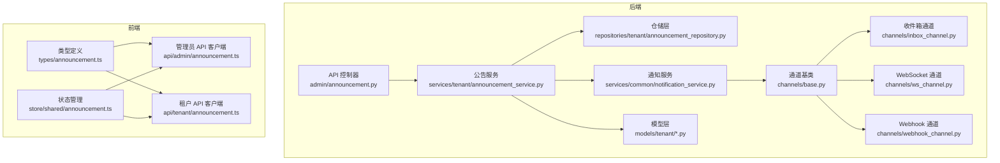
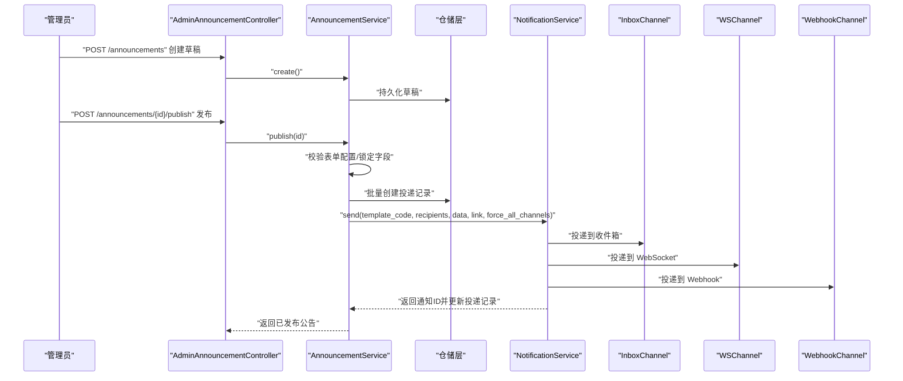
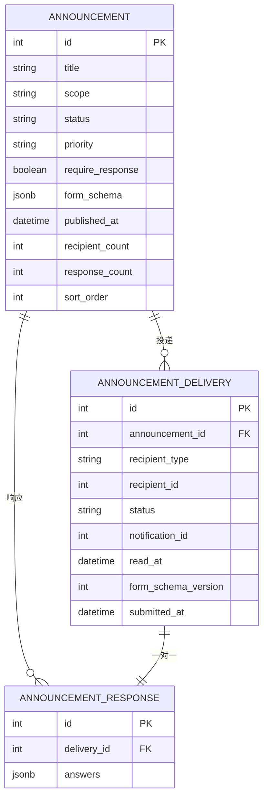
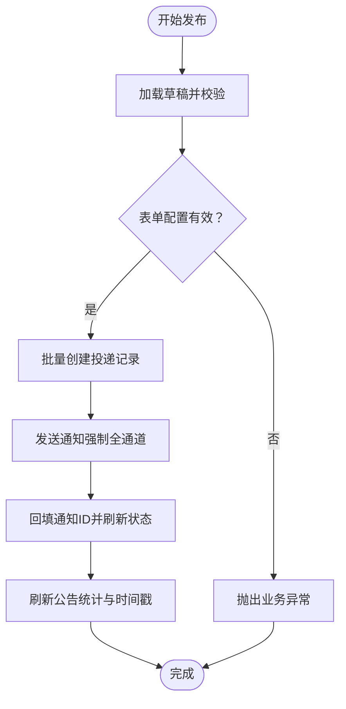
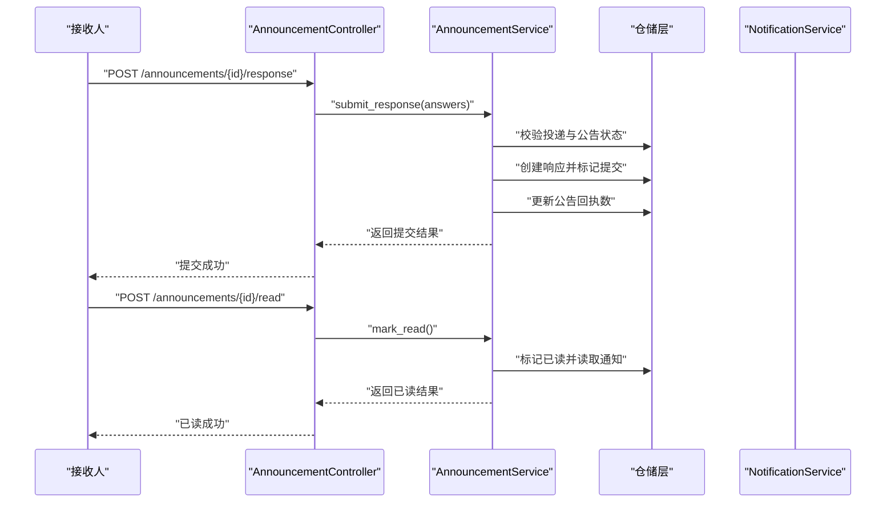
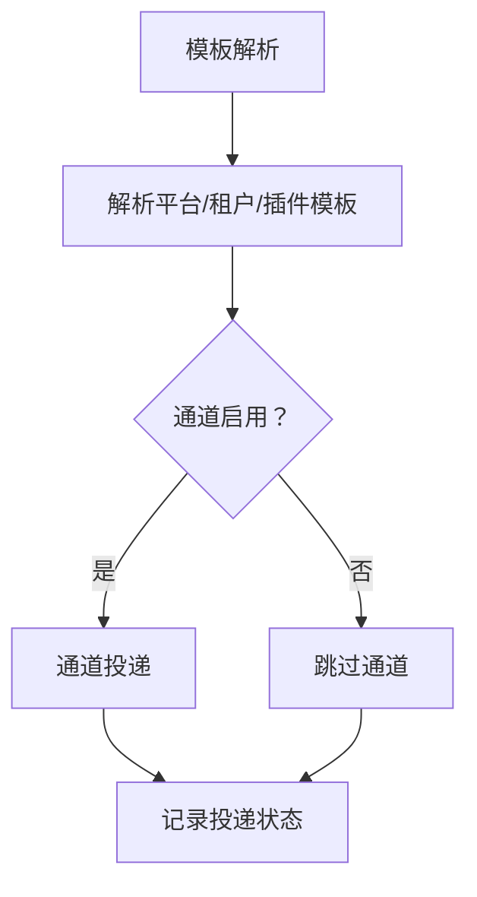
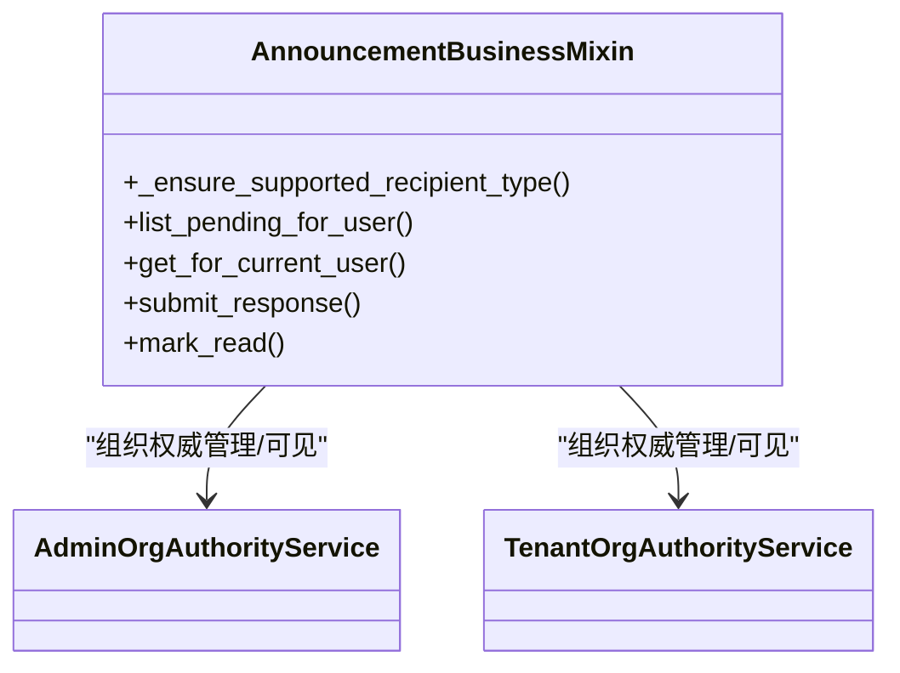
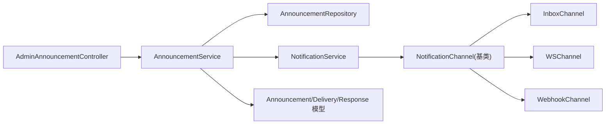

# 通知公告管理

<cite>
**本文引用的文件**
- [backend/app/services/tenant/announcement_service.py](file://backend/app/services/tenant/announcement_service.py)
- [backend/app/models/tenant/announcement.py](file://backend/app/models/tenant/announcement.py)
- [backend/app/models/tenant/announcement_delivery.py](file://backend/app/models/tenant/announcement_delivery.py)
- [backend/app/models/tenant/announcement_response.py](file://backend/app/models/tenant/announcement_response.py)
- [backend/app/api/admin/announcement.py](file://backend/app/api/admin/announcement.py)
- [backend/app/schemas/tenant/announcement.py](file://backend/app/schemas/tenant/announcement.py)
- [backend/app/services/common/notification_service.py](file://backend/app/services/common/notification_service.py)
- [backend/app/services/common/channels/base.py](file://backend/app/services/common/channels/base.py)
- [backend/app/services/common/channels/inbox_channel.py](file://backend/app/services/common/channels/inbox_channel.py)
- [backend/app/services/common/channels/ws_channel.py](file://backend/app/services/common/channels/ws_channel.py)
- [backend/app/services/common/channels/webhook_channel.py](file://backend/app/services/common/channels/webhook_channel.py)
- [backend/app/repositories/tenant/announcement_repository.py](file://backend/app/repositories/tenant/announcement_repository.py)
- [frontend/apps/web-antd/src/types/announcement.ts](file://frontend/apps/web-antd/src/types/announcement.ts)
- [frontend/apps/web-antd/src/store/shared/announcement.ts](file://frontend/apps/web-antd/src/store/shared/announcement.ts)
- [frontend/apps/web-antd/src/api/admin/announcement.ts](file://frontend/apps/web-antd/src/api/admin/announcement.ts)
- [frontend/apps/web-antd/src/api/tenant/announcement.ts](file://frontend/apps/web-antd/src/api/tenant/announcement.ts)
- [backend/tests/services/tenant/test_announcement_service.py](file://backend/tests/services/tenant/test_announcement_service.py)
- [backend/tests/services/test_notification_service.py](file://backend/tests/services/test_notification_service.py)
- [backend/app/api/admin/notification_templates.py](file://backend/app/api/admin/notification_templates.py)
- [backend/app/plugins/registry.py](file://backend/app/plugins/registry.py)
- [backend/app/celery_app.py](file://backend/app/celery_app.py)
- [backend/app/rbac/services/permission_domains/aggregation.py](file://backend/app/rbac/services/permission_domains/aggregation.py)
</cite>

## 目录
1. [简介](#简介)
2. [项目结构](#项目结构)
3. [核心组件](#核心组件)
4. [架构总览](#架构总览)
5. [详细组件分析](#详细组件分析)
6. [依赖关系分析](#依赖关系分析)
7. [性能考虑](#性能考虑)
8. [故障排查指南](#故障排查指南)
9. [结论](#结论)
10. [附录](#附录)

## 简介
本技术文档围绕通知公告管理系统进行深入解析，覆盖公告的创建、发布、分发与反馈全流程；文档化模板管理、目标受众与推送策略；详解阅读状态跟踪、响应收集与效果评估；说明定时发布、批量推送与个性化定制能力；阐述公告与用户权限、组织结构的映射关系；并提供配置选项、性能优化与用户体验设计建议，以及实际配置示例与推送效果监控代码演示路径。

## 项目结构
后端采用分层架构：API 控制器负责路由与鉴权，服务层封装业务流程，仓储层负责数据访问，模型层定义数据结构与索引，通知服务与通道模块负责消息分发。前端提供类型定义、API 客户端与状态管理，测试覆盖关键业务逻辑与通知通道行为。

图表来源
- [backend/app/api/admin/announcement.py:36-257](file://backend/app/api/admin/announcement.py#L36-L257)
- [backend/app/services/tenant/announcement_service.py:31-539](file://backend/app/services/tenant/announcement_service.py#L31-L539)
- [backend/app/services/common/notification_service.py](file://backend/app/services/common/notification_service.py)
- [backend/app/services/common/channels/base.py:18-81](file://backend/app/services/common/channels/base.py#L18-L81)
- [backend/app/services/common/channels/inbox_channel.py:20-91](file://backend/app/services/common/channels/inbox_channel.py#L20-L91)
- [backend/app/services/common/channels/ws_channel.py:36-87](file://backend/app/services/common/channels/ws_channel.py#L36-L87)
- [backend/app/services/common/channels/webhook_channel.py:38-72](file://backend/app/services/common/channels/webhook_channel.py#L38-L72)
- [backend/app/repositories/tenant/announcement_repository.py:22-237](file://backend/app/repositories/tenant/announcement_repository.py#L22-L237)
- [backend/app/models/tenant/announcement.py:28-128](file://backend/app/models/tenant/announcement.py#L28-L128)
- [frontend/apps/web-antd/src/types/announcement.ts:1-107](file://frontend/apps/web-antd/src/types/announcement.ts#L1-L107)
- [frontend/apps/web-antd/src/store/shared/announcement.ts:26-26](file://frontend/apps/web-antd/src/store/shared/announcement.ts#L26-L26)
- [frontend/apps/web-antd/src/api/admin/announcement.ts:111-138](file://frontend/apps/web-antd/src/api/admin/announcement.ts#L111-L138)
- [frontend/apps/web-antd/src/api/tenant/announcement.ts:111-138](file://frontend/apps/web-antd/src/api/tenant/announcement.ts#L111-L138)

章节来源
- [backend/app/api/admin/announcement.py:36-257](file://backend/app/api/admin/announcement.py#L36-L257)
- [backend/app/services/tenant/announcement_service.py:31-539](file://backend/app/services/tenant/announcement_service.py#L31-L539)
- [backend/app/services/common/notification_service.py](file://backend/app/services/common/notification_service.py)
- [backend/app/services/common/channels/base.py:18-81](file://backend/app/services/common/channels/base.py#L18-L81)
- [backend/app/services/common/channels/inbox_channel.py:20-91](file://backend/app/services/common/channels/inbox_channel.py#L20-L91)
- [backend/app/services/common/channels/ws_channel.py:36-87](file://backend/app/services/common/channels/ws_channel.py#L36-L87)
- [backend/app/services/common/channels/webhook_channel.py:38-72](file://backend/app/services/common/channels/webhook_channel.py#L38-L72)
- [backend/app/repositories/tenant/announcement_repository.py:22-237](file://backend/app/repositories/tenant/announcement_repository.py#L22-L237)
- [backend/app/models/tenant/announcement.py:28-128](file://backend/app/models/tenant/announcement.py#L28-L128)
- [frontend/apps/web-antd/src/types/announcement.ts:1-107](file://frontend/apps/web-antd/src/types/announcement.ts#L1-L107)
- [frontend/apps/web-antd/src/store/shared/announcement.ts:26-26](file://frontend/apps/web-antd/src/store/shared/announcement.ts#L26-L26)
- [frontend/apps/web-antd/src/api/admin/announcement.ts:111-138](file://frontend/apps/web-antd/src/api/admin/announcement.ts#L111-L138)
- [frontend/apps/web-antd/src/api/tenant/announcement.ts:111-138](file://frontend/apps/web-antd/src/api/tenant/announcement.ts#L111-L138)

## 核心组件
- 公告模型与关系：定义标题、范围、状态、优先级、是否需要反馈、表单配置、发布时间、接收人数、回执人数等字段，并维护与投递记录、反馈记录的一对多关系。
- 投递模型：记录每条公告对每个接收人的投递状态、通知关联、已读/提交时间、表单版本等。
- 反馈模型：保存接收人针对公告的应答数据。
- 公告服务：封装草稿创建、发布、分发、响应提交、已读标记、待处理列表等业务逻辑。
- 通知服务与通道：统一模板解析、渲染与多通道投递（收件箱、WebSocket、Webhook），支持强制全通道投递与回退策略。
- API 控制器：提供管理员与租户端的公告 CRUD、发布、响应查询、提交与已读标记等接口。
- 前端类型与 API 客户端：定义公告、投递、反馈的数据结构，提供管理员与租户端调用接口。

章节来源
- [backend/app/models/tenant/announcement.py:28-128](file://backend/app/models/tenant/announcement.py#L28-L128)
- [backend/app/models/tenant/announcement_delivery.py:28-124](file://backend/app/models/tenant/announcement_delivery.py#L28-L124)
- [backend/app/models/tenant/announcement_response.py:21-96](file://backend/app/models/tenant/announcement_response.py#L21-L96)
- [backend/app/services/tenant/announcement_service.py:31-539](file://backend/app/services/tenant/announcement_service.py#L31-L539)
- [backend/app/services/common/notification_service.py](file://backend/app/services/common/notification_service.py)
- [backend/app/services/common/channels/base.py:18-81](file://backend/app/services/common/channels/base.py#L18-L81)
- [backend/app/api/admin/announcement.py:36-257](file://backend/app/api/admin/announcement.py#L36-L257)
- [frontend/apps/web-antd/src/types/announcement.ts:1-107](file://frontend/apps/web-antd/src/types/announcement.ts#L1-L107)

## 架构总览
公告管理从“草稿”到“发布”的完整链路如下：管理员在后台创建草稿，设置标题、内容、优先级、是否需要反馈及表单配置；发布后系统生成投递记录并触发通知分发；接收人通过不同通道收到通知，可选择提交反馈或标记已读；系统统计回执数与状态，用于效果评估。

图表来源
- [backend/app/api/admin/announcement.py:141-203](file://backend/app/api/admin/announcement.py#L141-L203)
- [backend/app/services/tenant/announcement_service.py:142-210](file://backend/app/services/tenant/announcement_service.py#L142-L210)
- [backend/app/services/common/notification_service.py](file://backend/app/services/common/notification_service.py)
- [backend/app/services/common/channels/inbox_channel.py:40-91](file://backend/app/services/common/channels/inbox_channel.py#L40-L91)
- [backend/app/services/common/channels/ws_channel.py:40-87](file://backend/app/services/common/channels/ws_channel.py#L40-L87)
- [backend/app/services/common/channels/webhook_channel.py:48-72](file://backend/app/services/common/channels/webhook_channel.py#L48-L72)

## 详细组件分析

### 公告模型与数据流
- 字段与索引：公告表包含范围、状态、优先级、是否需要反馈、表单配置、发布时间、接收人数、回执人数等；投递表按接收人类型/ID/状态建立复合索引以支撑待处理查询；响应表与投递表一对一关联。
- 关系映射：公告与投递、公告与响应双向关系，支持按公告聚合统计与按投递查询反馈。

图表来源
- [backend/app/models/tenant/announcement.py:28-128](file://backend/app/models/tenant/announcement.py#L28-L128)
- [backend/app/models/tenant/announcement_delivery.py:28-124](file://backend/app/models/tenant/announcement_delivery.py#L28-L124)
- [backend/app/models/tenant/announcement_response.py:21-96](file://backend/app/models/tenant/announcement_response.py#L21-L96)

章节来源
- [backend/app/models/tenant/announcement.py:28-128](file://backend/app/models/tenant/announcement.py#L28-L128)
- [backend/app/models/tenant/announcement_delivery.py:28-124](file://backend/app/models/tenant/announcement_delivery.py#L28-L124)
- [backend/app/models/tenant/announcement_response.py:21-96](file://backend/app/models/tenant/announcement_response.py#L21-L96)

### 发布与分发流程
- 发布前置校验：草稿状态、表单配置合法性、已发布字段锁定；生成投递记录并更新公告统计。
- 通知分发：使用统一模板编码与数据载荷，强制全通道投递，逐条创建通知并回填通知ID至投递记录。
- 通道实现：收件箱写入数据库；WebSocket 推送到对应命名空间；Webhook 通过 HTTP POST 投递。

图表来源
- [backend/app/services/tenant/announcement_service.py:142-210](file://backend/app/services/tenant/announcement_service.py#L142-L210)
- [backend/app/services/common/notification_service.py](file://backend/app/services/common/notification_service.py)
- [backend/app/services/common/channels/inbox_channel.py:40-91](file://backend/app/services/common/channels/inbox_channel.py#L40-L91)
- [backend/app/services/common/channels/ws_channel.py:40-87](file://backend/app/services/common/channels/ws_channel.py#L40-L87)
- [backend/app/services/common/channels/webhook_channel.py:48-72](file://backend/app/services/common/channels/webhook_channel.py#L48-L72)

章节来源
- [backend/app/services/tenant/announcement_service.py:142-210](file://backend/app/services/tenant/announcement_service.py#L142-L210)
- [backend/app/services/common/notification_service.py](file://backend/app/services/common/notification_service.py)
- [backend/app/services/common/channels/inbox_channel.py:40-91](file://backend/app/services/common/channels/inbox_channel.py#L40-L91)
- [backend/app/services/common/channels/ws_channel.py:40-87](file://backend/app/services/common/channels/ws_channel.py#L40-L87)
- [backend/app/services/common/channels/webhook_channel.py:48-72](file://backend/app/services/common/channels/webhook_channel.py#L48-L72)

### 反馈收集与效果评估
- 提交反馈：校验接收人类型、投递存在性与公告状态，验证表单答案，创建响应并标记为已提交，同时更新公告回执计数。
- 已读标记：当公告不要求反馈时，允许直接标记已读；若要求反馈则需先提交反馈再关闭。
- 效果评估：基于公告的接收人数、回执人数、投递状态分布进行统计分析。

图表来源
- [backend/app/api/admin/announcement.py:222-257](file://backend/app/api/admin/announcement.py#L222-L257)
- [backend/app/services/tenant/announcement_service.py:271-367](file://backend/app/services/tenant/announcement_service.py#L271-L367)
- [backend/app/repositories/tenant/announcement_repository.py:173-237](file://backend/app/repositories/tenant/announcement_repository.py#L173-L237)

章节来源
- [backend/app/api/admin/announcement.py:222-257](file://backend/app/api/admin/announcement.py#L222-L257)
- [backend/app/services/tenant/announcement_service.py:271-367](file://backend/app/services/tenant/announcement_service.py#L271-L367)
- [backend/app/repositories/tenant/announcement_repository.py:173-237](file://backend/app/repositories/tenant/announcement_repository.py#L173-L237)

### 模板管理与推送策略
- 模板解析与回退：通知服务根据模板编码解析平台/租户/插件模板，支持回退到平台默认模板；前端可预览模板渲染效果。
- 推送策略：支持强制全通道投递（force_all_channels），通道可独立启用/禁用；WebSocket 通道按用户类型路由到不同命名空间。
- 插件模板同步：插件生命周期自动同步/恢复/删除插件通知模板，确保模板一致性与可追溯。

图表来源
- [backend/app/services/common/notification_service.py](file://backend/app/services/common/notification_service.py)
- [backend/app/api/admin/notification_templates.py:63-82](file://backend/app/api/admin/notification_templates.py#L63-L82)
- [backend/tests/services/test_notification_service.py:173-281](file://backend/tests/services/test_notification_service.py#L173-L281)
- [backend/tests/test_plugin_notification_template_runtime.py:34-158](file://backend/tests/test_plugin_notification_template_runtime.py#L34-L158)

章节来源
- [backend/app/services/common/notification_service.py](file://backend/app/services/common/notification_service.py)
- [backend/app/api/admin/notification_templates.py:63-82](file://backend/app/api/admin/notification_templates.py#L63-L82)
- [backend/tests/services/test_notification_service.py:173-281](file://backend/tests/services/test_notification_service.py#L173-L281)
- [backend/tests/test_plugin_notification_template_runtime.py:34-158](file://backend/tests/test_plugin_notification_template_runtime.py#L34-L158)

### 目标受众与权限映射
- 受众类型：admin、tenant_admin、tenant_user；服务层对受众类型进行白名单校验，确保只向受支持类型投递。
- 权限域：通过 RBAC 与组织权威服务计算可管理/可见角色集合，影响公告的可见性与操作范围。
- 租户边界：通知服务与公告服务均在查询与更新时加入租户过滤，防止越权访问。

图表来源
- [backend/app/services/tenant/announcement_service.py:370-374](file://backend/app/services/tenant/announcement_service.py#L370-L374)
- [backend/app/rbac/services/permission_domains/aggregation.py:280-325](file://backend/app/rbac/services/permission_domains/aggregation.py#L280-L325)

章节来源
- [backend/app/services/tenant/announcement_service.py:370-374](file://backend/app/services/tenant/announcement_service.py#L370-L374)
- [backend/app/rbac/services/permission_domains/aggregation.py:280-325](file://backend/app/rbac/services/permission_domains/aggregation.py#L280-L325)

### 定时发布、批量推送与个性化定制
- 定时发布：通过任务调度框架（Celery）与动态调度器实现基于数据库的任务定义加载与重载，支持 Cron 与间隔调度。
- 批量推送：发布时一次性为所有接收人创建投递记录并触发通知分发，限制待处理列表数量以避免过度扫描。
- 个性化定制：模板支持多语言与变量渲染；通道可独立启用/禁用；插件可注册自定义模板与通道。

章节来源
- [backend/app/celery_app.py:215-225](file://backend/app/celery_app.py#L215-L225)
- [backend/app/plugins/registry.py:596-653](file://backend/app/plugins/registry.py#L596-L653)
- [backend/app/services/tenant/announcement_service.py:221-237](file://backend/app/services/tenant/announcement_service.py#L221-L237)

### 配置选项与用户体验设计
- 配置项：通知系统总开关、各通道启用条件（如 WebSocket URL、Webhook URL）、模板优先级与类别。
- 用户体验：前端类型定义与 API 客户端明确字段与返回结构；通知通道实时推送，收件箱持久化存储便于回溯；待处理列表限制提升后台加载性能。

章节来源
- [frontend/apps/web-antd/src/types/announcement.ts:1-107](file://frontend/apps/web-antd/src/types/announcement.ts#L1-L107)
- [frontend/apps/web-antd/src/api/admin/announcement.ts:111-138](file://frontend/apps/web-antd/src/api/admin/announcement.ts#L111-L138)
- [frontend/apps/web-antd/src/api/tenant/announcement.ts:111-138](file://frontend/apps/web-antd/src/api/tenant/announcement.ts#L111-L138)
- [backend/app/services/common/channels/inbox_channel.py:31-39](file://backend/app/services/common/channels/inbox_channel.py#L31-L39)
- [backend/app/services/common/channels/webhook_channel.py:38-46](file://backend/app/services/common/channels/webhook_channel.py#L38-L46)

## 依赖关系分析
- 组件耦合：API 控制器依赖公告服务；公告服务依赖仓储层与通知服务；通知服务依赖通道实现；模型层被服务与仓储共同依赖。
- 外部依赖：通道实现依赖 Socket.IO、数据库与 HTTP 客户端；任务调度依赖 Celery 与持久化调度器。

图表来源
- [backend/app/api/admin/announcement.py:36-257](file://backend/app/api/admin/announcement.py#L36-L257)
- [backend/app/services/tenant/announcement_service.py:31-539](file://backend/app/services/tenant/announcement_service.py#L31-L539)
- [backend/app/repositories/tenant/announcement_repository.py:22-237](file://backend/app/repositories/tenant/announcement_repository.py#L22-L237)
- [backend/app/services/common/notification_service.py](file://backend/app/services/common/notification_service.py)
- [backend/app/services/common/channels/base.py:18-81](file://backend/app/services/common/channels/base.py#L18-L81)
- [backend/app/models/tenant/announcement.py:28-128](file://backend/app/models/tenant/announcement.py#L28-L128)

章节来源
- [backend/app/api/admin/announcement.py:36-257](file://backend/app/api/admin/announcement.py#L36-L257)
- [backend/app/services/tenant/announcement_service.py:31-539](file://backend/app/services/tenant/announcement_service.py#L31-L539)
- [backend/app/repositories/tenant/announcement_repository.py:22-237](file://backend/app/repositories/tenant/announcement_repository.py#L22-L237)
- [backend/app/services/common/notification_service.py](file://backend/app/services/common/notification_service.py)
- [backend/app/services/common/channels/base.py:18-81](file://backend/app/services/common/channels/base.py#L18-L81)
- [backend/app/models/tenant/announcement.py:28-128](file://backend/app/models/tenant/announcement.py#L28-L128)

## 性能考虑
- 查询优化：投递表对接收人类型/ID/状态建立复合索引，支撑后台待处理列表的高效查询；公告表对范围/状态、租户/范围建立索引，加速筛选。
- 分页与上限：后台待处理列表限制最大返回条数，避免一次性扫描过多投递记录。
- 通道幂等与失败处理：通道投递失败时记录错误信息，便于重试与定位问题；通知写入数据库采用异步提交策略减少阻塞。
- 任务调度：使用持久化调度器，避免数据库短暂不可用导致的空跑；Cron/Interval 调度表达式严格校验。

章节来源
- [backend/app/models/tenant/announcement_delivery.py:32-54](file://backend/app/models/tenant/announcement_delivery.py#L32-L54)
- [backend/app/models/tenant/announcement.py:34-37](file://backend/app/models/tenant/announcement.py#L34-L37)
- [backend/app/services/tenant/announcement_service.py:221-237](file://backend/app/services/tenant/announcement_service.py#L221-L237)
- [backend/app/services/common/channels/inbox_channel.py:54-88](file://backend/app/services/common/channels/inbox_channel.py#L54-L88)
- [backend/app/celery_app.py:215-225](file://backend/app/celery_app.py#L215-L225)
- [backend/app/plugins/registry.py:622-648](file://backend/app/plugins/registry.py#L622-L648)

## 故障排查指南
- 发布失败：检查草稿状态与表单配置是否满足要求；确认模板是否存在且通道启用；查看通知投递记录的错误信息。
- 无法提交反馈：确认公告状态为已发布且不要求反馈时可直接已读；若要求反馈需先提交再关闭。
- 待处理列表为空：检查 limit 参数与后台限制；确认接收人类型与租户过滤条件。
- 通知未到达：核对通道启用状态与配置（如 WebSocket URL、Webhook URL）；查看通道日志与通知投递记录。

章节来源
- [backend/tests/services/tenant/test_announcement_service.py:146-151](file://backend/tests/services/tenant/test_announcement_service.py#L146-L151)
- [backend/tests/services/tenant/test_announcement_service.py:245-264](file://backend/tests/services/tenant/test_announcement_service.py#L245-L264)
- [backend/tests/services/tenant/test_announcement_service.py:313-326](file://backend/tests/services/tenant/test_announcement_service.py#L313-L326)
- [backend/tests/services/test_notification_service.py:370-383](file://backend/tests/services/test_notification_service.py#L370-L383)

## 结论
通知公告管理系统通过清晰的分层架构与严格的业务约束，实现了从草稿到发布的全链路管理；借助统一的通知服务与多通道投递，确保消息触达与可观测性；结合权限与组织权威，保障公告的正确受众与安全边界；通过模板管理与任务调度，支持个性化与自动化运营；配合前端类型与 API 客户端，提供一致的用户体验。

## 附录
- 实际配置示例与推送效果监控代码演示路径：
  - 公告创建与发布接口：[backend/app/api/admin/announcement.py:141-203](file://backend/app/api/admin/announcement.py#L141-L203)
  - 公告响应提交与已读接口：[backend/app/api/admin/announcement.py:222-257](file://backend/app/api/admin/announcement.py#L222-L257)
  - 通知模板解析与回退：[backend/tests/services/test_notification_service.py:173-281](file://backend/tests/services/test_notification_service.py#L173-L281)
  - 插件通知模板同步：[backend/tests/test_plugin_notification_template_runtime.py:34-158](file://backend/tests/test_plugin_notification_template_runtime.py#L34-L158)
  - 后台待处理列表限制：[backend/app/services/tenant/announcement_service.py:221-237](file://backend/app/services/tenant/announcement_service.py#L221-L237)
  - 通道启用与投递失败记录：[backend/app/services/common/channels/inbox_channel.py:31-39](file://backend/app/services/common/channels/inbox_channel.py#L31-L39), [backend/app/services/common/channels/webhook_channel.py:38-46](file://backend/app/services/common/channels/webhook_channel.py#L38-L46)