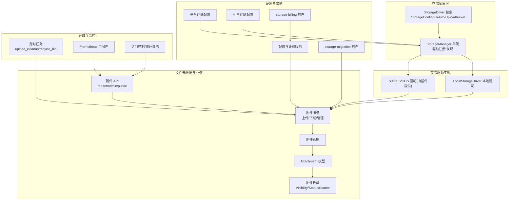
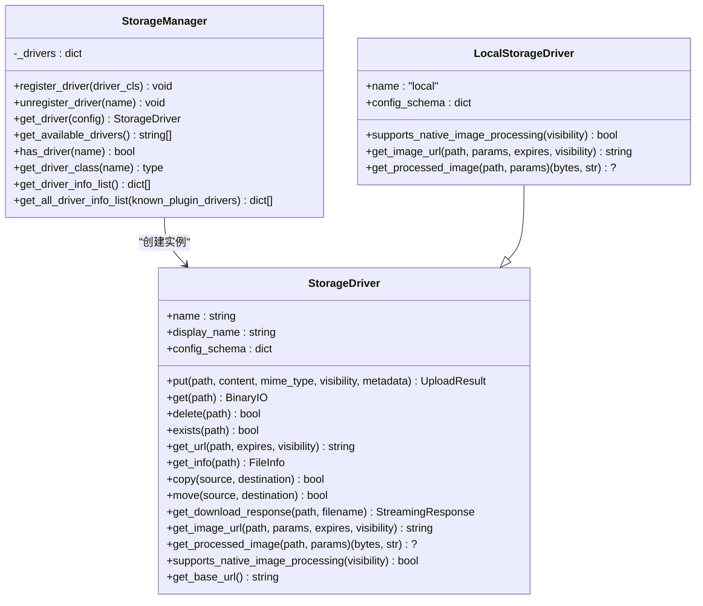
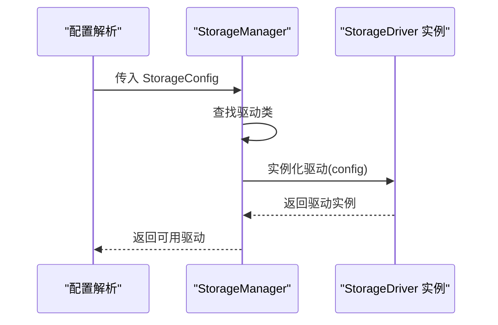
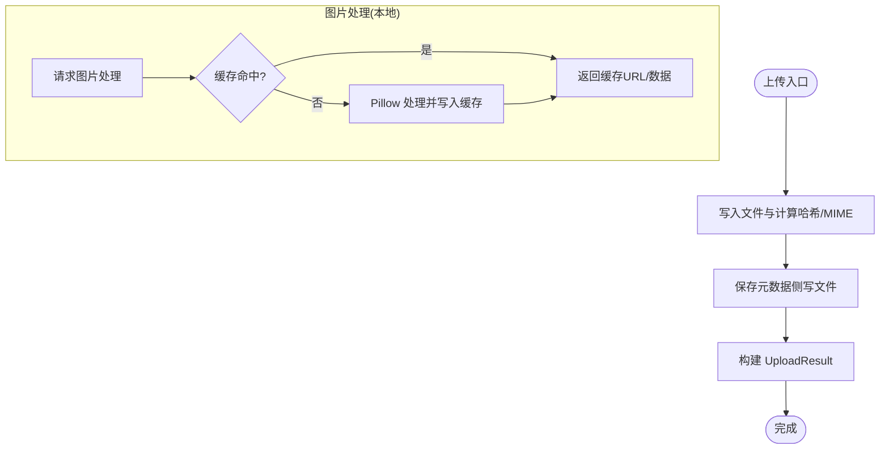
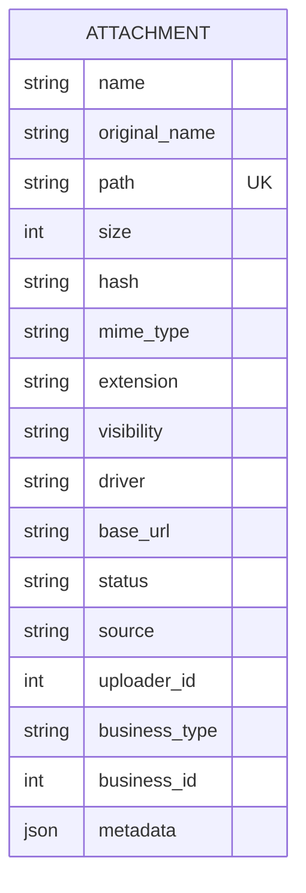
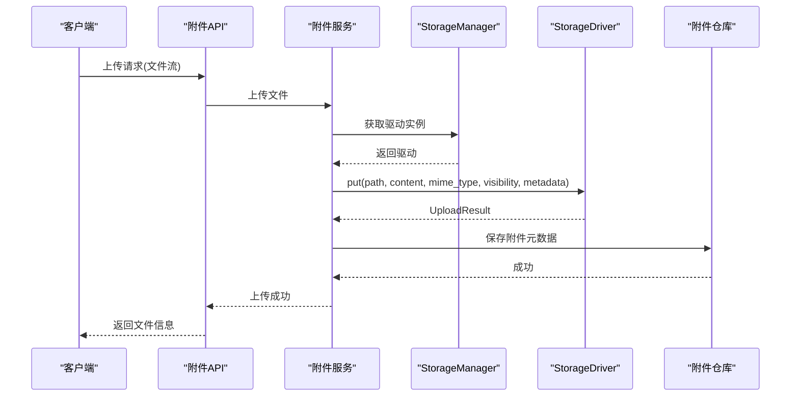
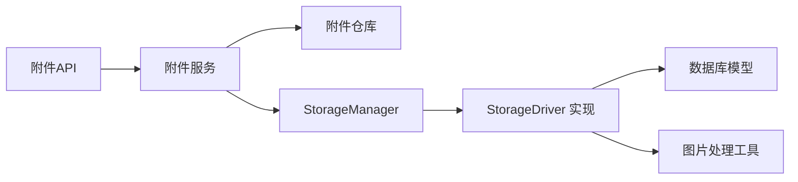

# 存储和文件管理

<cite>
**本文引用的文件**
- [backend/app/storage/base.py](file://backend/app/storage/base.py)
- [backend/app/storage/manager.py](file://backend/app/storage/manager.py)
- [backend/app/storage/drivers/local.py](file://backend/app/storage/drivers/local.py)
- [backend/app/models/tenant/attachment.py](file://backend/app/models/tenant/attachment.py)
- [backend/app/enums/attachment.py](file://backend/app/enums/attachment.py)
- [backend/app/api/tenant/attachments.py](file://backend/app/api/tenant/attachments.py)
- [backend/app/api/admin/attachments.py](file://backend/app/api/admin/attachments.py)
- [backend/app/api/public/attachments.py](file://backend/app/api/public/attachments.py)
- [backend/app/services/tenant/attachment_service.py](file://backend/app/services/tenant/attachment_service.py)
- [backend/app/services/tenant/attachment_download_service.py](file://backend/app/services/tenant/attachment_download_service.py)
- [backend/app/services/system/attachment_service.py](file://backend/app/services/system/attachment_service.py)
- [backend/app/repositories/tenant/attachment_repository.py](file://backend/app/repositories/tenant/attachment_repository.py)
- [backend/app/repositories/system/attachment_repository.py](file://backend/app/repositories/system/attachment_repository.py)
- [backend/app/configs/definitions/platform/storage.py](file://backend/app/configs/definitions/platform/storage.py)
- [backend/app/configs/definitions/tenant/storage.py](file://backend/app/configs/definitions/tenant/storage.py)
- [backend/app/services/common/storage_config_resolver.py](file://backend/app/services/common/storage_config_resolver.py)
- [backend/app/services/common/storage_quota_service.py](file://backend/app/services/common/storage_quota_service.py)
- [backend/app/services/system/tenant_storage_admin_service.py](file://backend/app/services/system/tenant_storage_admin_service.py)
- [backend/migrations/versions/20260124_0007_add_attachments_table.py](file://backend/migrations/versions/20260124_0007_add_attachments_table.py)
- [backend/migrations/versions/20260126_0008_add_base_url_to_attachments.py](file://backend/migrations/versions/20260126_0008_add_base_url_to_attachments.py)
- [backend/migrations/versions/20260224_allow_null_attachment_tenant_id.py](file://backend/migrations/versions/20260224_allow_null_attachment_tenant_id.py)
- [backend/plugins/storage-billing/](file://backend/plugins/storage-billing/)
- [backend/plugins/storage-migration/](file://backend/plugins/storage-migration/)
- [backend/app/tasks/upload_cleanup.py](file://backend/app/tasks/upload_cleanup.py)
- [backend/app/tasks/recycle_bin.py](file://backend/app/tasks/recycle_bin.py)
- [backend/app/middleware/prometheus_metrics.py](file://backend/app/middleware/prometheus_metrics.py)
- [backend/app/middleware/access_control.py](file://backend/app/middleware/access_control.py)
- [backend/app/middleware/audit_log.py](file://backend/app/middleware/audit_log.py)
</cite>

## 目录
1. [简介](#简介)
2. [项目结构](#项目结构)
3. [核心组件](#核心组件)
4. [架构总览](#架构总览)
5. [详细组件分析](#详细组件分析)
6. [依赖关系分析](#依赖关系分析)
7. [性能考量](#性能考量)
8. [故障排查指南](#故障排查指南)
9. [结论](#结论)
10. [附录](#附录)

## 简介
本技术文档面向存储与文件管理系统，围绕对象存储集成、本地存储管理、文件上传下载流程、存储驱动抽象、多存储后端支持、数据迁移策略、元数据管理、访问权限控制与安全策略、配额与清理策略、成本优化、附件生命周期与版本归档、监控指标与性能调优、故障恢复以及配置示例与集成指导进行系统化说明。文档以代码为依据，结合架构图与流程图，帮助开发者与运维人员快速理解与落地。

## 项目结构
存储与文件管理模块位于后端工程的 app/storage 与相关 API/Service/Repository 层，配合平台与租户级存储配置、配额与计费插件、迁移插件以及定时任务，形成完整的文件生命周期管理体系。

图表来源
- [backend/app/storage/base.py:88-273](file://backend/app/storage/base.py#L88-L273)
- [backend/app/storage/manager.py:13-156](file://backend/app/storage/manager.py#L13-L156)
- [backend/app/storage/drivers/local.py:31-446](file://backend/app/storage/drivers/local.py#L31-L446)
- [backend/app/models/tenant/attachment.py:15-160](file://backend/app/models/tenant/attachment.py#L15-L160)
- [backend/app/enums/attachment.py:11-33](file://backend/app/enums/attachment.py#L11-L33)
- [backend/app/configs/definitions/platform/storage.py](file://backend/app/configs/definitions/platform/storage.py)
- [backend/app/configs/definitions/tenant/storage.py](file://backend/app/configs/definitions/tenant/storage.py)
- [backend/plugins/storage-billing/](file://backend/plugins/storage-billing/)
- [backend/plugins/storage-migration/](file://backend/plugins/storage-migration/)
- [backend/app/tasks/upload_cleanup.py](file://backend/app/tasks/upload_cleanup.py)
- [backend/app/tasks/recycle_bin.py](file://backend/app/tasks/recycle_bin.py)
- [backend/app/middleware/prometheus_metrics.py](file://backend/app/middleware/prometheus_metrics.py)
- [backend/app/middleware/access_control.py](file://backend/app/middleware/access_control.py)
- [backend/app/middleware/audit_log.py](file://backend/app/middleware/audit_log.py)

章节来源
- [backend/app/storage/base.py:1-273](file://backend/app/storage/base.py#L1-L273)
- [backend/app/storage/manager.py:1-156](file://backend/app/storage/manager.py#L1-L156)
- [backend/app/storage/drivers/local.py:1-446](file://backend/app/storage/drivers/local.py#L1-L446)
- [backend/app/models/tenant/attachment.py:1-160](file://backend/app/models/tenant/attachment.py#L1-L160)
- [backend/app/enums/attachment.py:1-33](file://backend/app/enums/attachment.py#L1-L33)

## 核心组件
- 存储驱动抽象与通用数据结构
  - StorageDriver 抽象类定义统一的上传、下载、删除、存在性检查、URL 获取、文件信息查询、复制/移动、图片处理与原生处理能力声明等接口。
  - StorageConfig/UploadResult/FileInfo/StorageVisibility 提供配置、上传结果、文件信息与可见性枚举的数据契约。
- 存储驱动管理器
  - StorageManager 单例负责驱动注册、可用驱动查询、驱动类获取与插件驱动信息合并展示。
- 本地存储驱动
  - LocalStorageDriver 实现文件写入、读取、删除、元数据侧写、URL 生成、复制/移动、图片处理与缓存、变体数量限制等。
- 附件模型与枚举
  - Attachment 模型承载文件元数据（路径、大小、哈希、MIME、扩展名、可见性、驱动、基础 URL、状态、来源、上传者、业务类型/ID、扩展元数据），并定义可见性、状态、来源枚举。
- 附件 API 与服务
  - 提供租户、平台管理员与公开访问的附件接口；服务层封装上传、下载、管理逻辑；仓库层负责持久化与查询。
- 配置与策略
  - 平台与租户存储配置定义；配额与计费服务；storage-billing 插件提供计费与限额联动；storage-migration 插件支持跨驱动迁移。
- 运维与监控
  - 定时任务负责上传清理与回收站清理；Prometheus 中间件暴露指标；访问控制与审计日志保障安全。

章节来源
- [backend/app/storage/base.py:88-273](file://backend/app/storage/base.py#L88-L273)
- [backend/app/storage/manager.py:13-156](file://backend/app/storage/manager.py#L13-L156)
- [backend/app/storage/drivers/local.py:31-446](file://backend/app/storage/drivers/local.py#L31-L446)
- [backend/app/models/tenant/attachment.py:15-160](file://backend/app/models/tenant/attachment.py#L15-L160)
- [backend/app/enums/attachment.py:11-33](file://backend/app/enums/attachment.py#L11-L33)

## 架构总览
系统采用“抽象驱动 + 管理器 + 多后端实现”的分层架构，结合附件元数据模型与 API/Service/Repository 分层，形成可插拔的存储体系。平台与租户分别配置存储后端，支持本地与对象存储（通过插件）。配额与计费插件在上传/删除时进行容量校验与计费联动，迁移插件支持驱动切换与数据迁移。

图表来源
- [backend/app/storage/base.py:88-273](file://backend/app/storage/base.py#L88-L273)
- [backend/app/storage/manager.py:13-156](file://backend/app/storage/manager.py#L13-L156)
- [backend/app/storage/drivers/local.py:31-446](file://backend/app/storage/drivers/local.py#L31-L446)

## 详细组件分析

### 存储驱动抽象与管理器
- 抽象接口职责清晰，覆盖上传、下载、删除、存在性、URL 生成、文件信息、复制/移动、图片处理与原生处理能力声明。
- 管理器提供单例模式、驱动注册/注销、可用驱动列表、驱动类查询与插件驱动信息合并，便于前端动态展示与连接测试。

图表来源
- [backend/app/storage/manager.py:62-69](file://backend/app/storage/manager.py#L62-L69)
- [backend/app/storage/base.py:100-117](file://backend/app/storage/base.py#L100-L117)

章节来源
- [backend/app/storage/base.py:88-273](file://backend/app/storage/base.py#L88-L273)
- [backend/app/storage/manager.py:13-156](file://backend/app/storage/manager.py#L13-L156)

### 本地存储驱动实现
- 文件写入：异步线程池写入、SHA256 计算、MIME 推断、权限设置、元数据侧写。
- 元数据管理：.meta.json 侧写文件，包含 MIME、可见性与扩展元数据。
- URL 生成：公共可见性且配置了 base_url 时拼接完整 URL，否则返回内部路由。
- 复制/移动：同步操作，确保原子性。
- 图片处理：本地 Pillow 处理与缓存，支持变体数量上限与回退策略。

图表来源
- [backend/app/storage/drivers/local.py:113-163](file://backend/app/storage/drivers/local.py#L113-L163)
- [backend/app/storage/drivers/local.py:395-435](file://backend/app/storage/drivers/local.py#L395-L435)

章节来源
- [backend/app/storage/drivers/local.py:31-446](file://backend/app/storage/drivers/local.py#L31-L446)

### 附件模型与元数据管理
- 模型字段覆盖文件名、原始名、存储路径、大小、哈希、MIME、扩展名、可见性、驱动、基础 URL、状态、来源、上传者、业务类型/ID、扩展元数据，并建立索引提升查询性能。
- 可见性、状态、来源枚举统一管理，便于权限与审计。
- 业务关联：知识库文档等资源对附件存在阻断删除依赖，保障数据一致性。

图表来源
- [backend/app/models/tenant/attachment.py:81-156](file://backend/app/models/tenant/attachment.py#L81-L156)
- [backend/app/enums/attachment.py:11-33](file://backend/app/enums/attachment.py#L11-L33)

章节来源
- [backend/app/models/tenant/attachment.py:15-160](file://backend/app/models/tenant/attachment.py#L15-L160)
- [backend/app/enums/attachment.py:11-33](file://backend/app/enums/attachment.py#L11-L33)

### 附件上传与下载流程
- 上传：服务层接收文件流，选择驱动，调用 put 写入并保存元数据，返回 UploadResult；同时持久化到附件表。
- 下载：根据可见性与基础 URL 生成访问链接或内部流式响应；支持 Content-Disposition 头保证文件名安全。
- 管理端与公开接口：区分平台管理员、租户管理员与公开访问，应用相应权限控制。

图表来源
- [backend/app/api/tenant/attachments.py](file://backend/app/api/tenant/attachments.py)
- [backend/app/services/tenant/attachment_service.py](file://backend/app/services/tenant/attachment_service.py)
- [backend/app/storage/manager.py:62-69](file://backend/app/storage/manager.py#L62-L69)
- [backend/app/storage/base.py:106-117](file://backend/app/storage/base.py#L106-L117)
- [backend/app/repositories/tenant/attachment_repository.py](file://backend/app/repositories/tenant/attachment_repository.py)

章节来源
- [backend/app/api/tenant/attachments.py](file://backend/app/api/tenant/attachments.py)
- [backend/app/api/admin/attachments.py](file://backend/app/api/admin/attachments.py)
- [backend/app/api/public/attachments.py](file://backend/app/api/public/attachments.py)
- [backend/app/services/tenant/attachment_service.py](file://backend/app/services/tenant/attachment_service.py)
- [backend/app/services/tenant/attachment_download_service.py](file://backend/app/services/tenant/attachment_download_service.py)
- [backend/app/repositories/tenant/attachment_repository.py](file://backend/app/repositories/tenant/attachment_repository.py)
- [backend/app/repositories/system/attachment_repository.py](file://backend/app/repositories/system/attachment_repository.py)

### 多存储后端支持与对象存储集成
- 驱动注册：StorageManager 维护驱动映射，内置本地驱动，对象存储驱动通过插件注册。
- 配置定义：平台与租户存储配置定义驱动类型、根路径/桶、基础 URL、选项等。
- 对象存储特性：URL 生成与图片处理由各云厂商 SDK/签名 URL 实现，本地不支持原生处理时回退至本地处理与缓存。

章节来源
- [backend/app/storage/manager.py:40-87](file://backend/app/storage/manager.py#L40-L87)
- [backend/app/configs/definitions/platform/storage.py](file://backend/app/configs/definitions/platform/storage.py)
- [backend/app/configs/definitions/tenant/storage.py](file://backend/app/configs/definitions/tenant/storage.py)
- [backend/app/services/common/storage_config_resolver.py](file://backend/app/services/common/storage_config_resolver.py)

### 数据迁移策略
- 迁移插件：提供跨驱动迁移能力，支持批量扫描、复制、校验与回滚策略。
- 迁移流程：评估目标驱动可用性、生成迁移计划、执行迁移、更新附件记录与基础 URL、清理旧数据。
- 迁移任务：结合定时任务与后台作业，保障大规模数据迁移的稳定性与可观测性。

章节来源
- [backend/plugins/storage-migration/](file://backend/plugins/storage-migration/)
- [backend/app/tasks/upload_cleanup.py](file://backend/app/tasks/upload_cleanup.py)

### 元数据管理、访问权限控制与安全策略
- 元数据：附件模型存储扩展元数据 JSON；本地驱动通过 .meta.json 侧写文件持久化 MIME、可见性与扩展元数据。
- 权限控制：附件可见性枚举支持 public/private；API 层根据角色与业务上下文进行鉴权；访问控制中间件统一拦截与放行。
- 安全策略：Content-Disposition 使用 RFC 5987 兼容编码避免注入；路径安全校验防止越权访问；审计日志记录敏感操作。

章节来源
- [backend/app/models/tenant/attachment.py:151-156](file://backend/app/models/tenant/attachment.py#L151-L156)
- [backend/app/storage/drivers/local.py:87-112](file://backend/app/storage/drivers/local.py#L87-L112)
- [backend/app/enums/attachment.py:11-33](file://backend/app/enums/attachment.py#L11-L33)
- [backend/app/middleware/access_control.py](file://backend/app/middleware/access_control.py)
- [backend/app/middleware/audit_log.py](file://backend/app/middleware/audit_log.py)

### 存储配额管理、清理策略与成本优化
- 配额服务：基于附件大小统计与限额比较，上传前校验配额；计费插件联动记录用量与费用。
- 清理策略：上传清理任务定期清理超时未完成的上传；回收站任务清理软删除附件及其驱动数据。
- 成本优化：本地图片缓存变体数量上限控制磁盘占用；对象存储建议开启生命周期规则与分层存储；按需开启压缩与缩略图。

章节来源
- [backend/app/services/common/storage_quota_service.py](file://backend/app/services/common/storage_quota_service.py)
- [backend/app/services/system/tenant_storage_admin_service.py](file://backend/app/services/system/tenant_storage_admin_service.py)
- [backend/plugins/storage-billing/](file://backend/plugins/storage-billing/)
- [backend/app/tasks/upload_cleanup.py](file://backend/app/tasks/upload_cleanup.py)
- [backend/app/tasks/recycle_bin.py](file://backend/app/tasks/recycle_bin.py)

### 附件生命周期管理、版本控制与归档机制
- 生命周期：附件状态枚举支持 active/deleted；删除采用软删除策略，结合回收站任务清理。
- 版本控制：当前模型未内置版本字段，可通过扩展元数据或独立版本表实现；迁移插件支持历史数据迁移。
- 归档机制：对象存储可结合生命周期规则自动归档；本地归档建议外部备份与冷存储策略。

章节来源
- [backend/app/enums/attachment.py:16-18](file://backend/app/enums/attachment.py#L16-L18)
- [backend/migrations/versions/20260124_0007_add_attachments_table.py](file://backend/migrations/versions/20260124_0007_add_attachments_table.py)
- [backend/migrations/versions/20260126_0008_add_base_url_to_attachments.py](file://backend/migrations/versions/20260126_0008_add_base_url_to_attachments.py)
- [backend/migrations/versions/20260224_allow_null_attachment_tenant_id.py](file://backend/migrations/versions/20260224_allow_null_attachment_tenant_id.py)

### 监控指标、性能调优与故障恢复
- 指标：Prometheus 中间件暴露请求量、延迟、错误率等；结合日志与告警完善可观测性。
- 性能：本地图片缓存减少重复处理；驱动 URL 生成与图片处理尽量利用云原生能力；I/O 异步化与线程池隔离。
- 故障恢复：驱动异常降级、回退策略；上传失败重试与幂等；迁移失败回滚与人工干预通道。

章节来源
- [backend/app/middleware/prometheus_metrics.py](file://backend/app/middleware/prometheus_metrics.py)

## 依赖关系分析
- 组件耦合
  - 服务层依赖仓库层与存储管理器；仓库层依赖 ORM 模型；API 层依赖服务层。
  - 本地驱动与图片处理工具强耦合；对象存储驱动通过插件注入，降低耦合度。
- 外部依赖
  - 对象存储 SDK（S3/OSS/COS）；图片处理库（Pillow）；数据库（SQLAlchemy）；异步运行时（anyio）。
- 循环依赖
  - 当前结构未见循环导入；驱动注册通过管理器集中管理，避免循环引用。

图表来源
- [backend/app/api/tenant/attachments.py](file://backend/app/api/tenant/attachments.py)
- [backend/app/services/tenant/attachment_service.py](file://backend/app/services/tenant/attachment_service.py)
- [backend/app/repositories/tenant/attachment_repository.py](file://backend/app/repositories/tenant/attachment_repository.py)
- [backend/app/storage/manager.py:62-69](file://backend/app/storage/manager.py#L62-L69)
- [backend/app/storage/drivers/local.py:404-426](file://backend/app/storage/drivers/local.py#L404-L426)

章节来源
- [backend/app/api/tenant/attachments.py](file://backend/app/api/tenant/attachments.py)
- [backend/app/services/tenant/attachment_service.py](file://backend/app/services/tenant/attachment_service.py)
- [backend/app/repositories/tenant/attachment_repository.py](file://backend/app/repositories/tenant/attachment_repository.py)
- [backend/app/storage/manager.py:13-156](file://backend/app/storage/manager.py#L13-L156)
- [backend/app/storage/drivers/local.py:31-446](file://backend/app/storage/drivers/local.py#L31-L446)

## 性能考量
- I/O 异步化：文件写入、读取、删除与元数据读写均通过线程池异步执行，避免阻塞事件循环。
- 图片处理缓存：本地驱动对处理后的图片进行缓存，限制变体数量，显著降低重复处理开销。
- URL 生成：对象存储驱动优先返回签名 URL；本地驱动返回内部路由或拼接 base_url，减少额外网络跳转。
- 索引优化：附件表对 path 建唯一索引，tenant_id+hash 建复合索引，提升查询与去重效率。

## 故障排查指南
- 上传失败
  - 检查驱动配置与可用性；查看存储日志定位异常；确认配额与计费状态。
- 下载异常
  - 核对可见性与基础 URL；验证 Content-Disposition 生成；检查路径安全校验。
- 图片处理问题
  - 本地驱动需确保 Pillow 可用与缓存目录权限；检查变体数量上限与缓存路径。
- 迁移失败
  - 查看迁移日志与回滚策略；核对新旧驱动兼容性与目标存储权限。

章节来源
- [backend/app/storage/base.py:166-181](file://backend/app/storage/base.py#L166-L181)
- [backend/app/storage/drivers/local.py:395-435](file://backend/app/storage/drivers/local.py#L395-L435)
- [backend/plugins/storage-migration/](file://backend/plugins/storage-migration/)

## 结论
该存储与文件管理系统以抽象驱动为核心，结合本地与对象存储后端、完善的附件元数据模型、严格的权限与安全策略、配额与计费联动、迁移与清理策略，以及可观测性与性能优化手段，形成了高可用、可扩展、易维护的文件管理基础设施。通过插件化扩展与标准化接口，系统能够灵活适配不同部署环境与业务需求。

## 附录

### 配置示例与集成指导
- 平台存储配置
  - 定义驱动类型、根路径/桶、基础 URL、选项（如本地权限、图片缓存路径与变体上限）。
- 租户存储配置
  - 在租户维度覆盖平台默认配置，支持差异化存储策略。
- 集成步骤
  - 安装对应对象存储驱动插件；在管理端启用并配置驱动；在租户侧选择驱动并下发配置；验证上传/下载与图片处理功能。

章节来源
- [backend/app/configs/definitions/platform/storage.py](file://backend/app/configs/definitions/platform/storage.py)
- [backend/app/configs/definitions/tenant/storage.py](file://backend/app/configs/definitions/tenant/storage.py)
- [backend/app/services/common/storage_config_resolver.py](file://backend/app/services/common/storage_config_resolver.py)