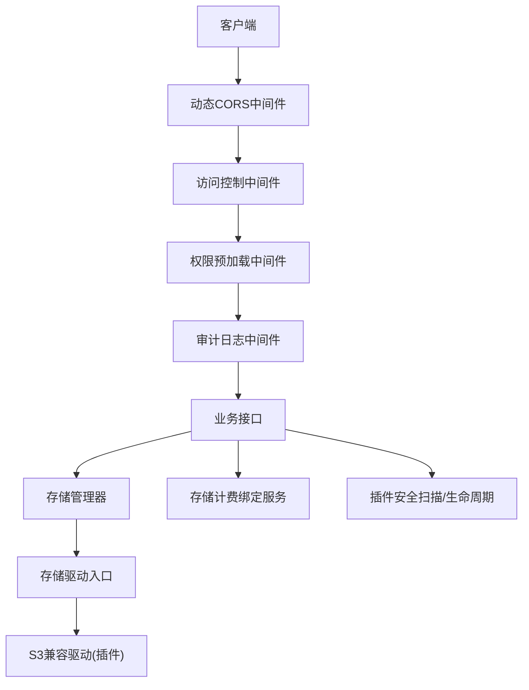
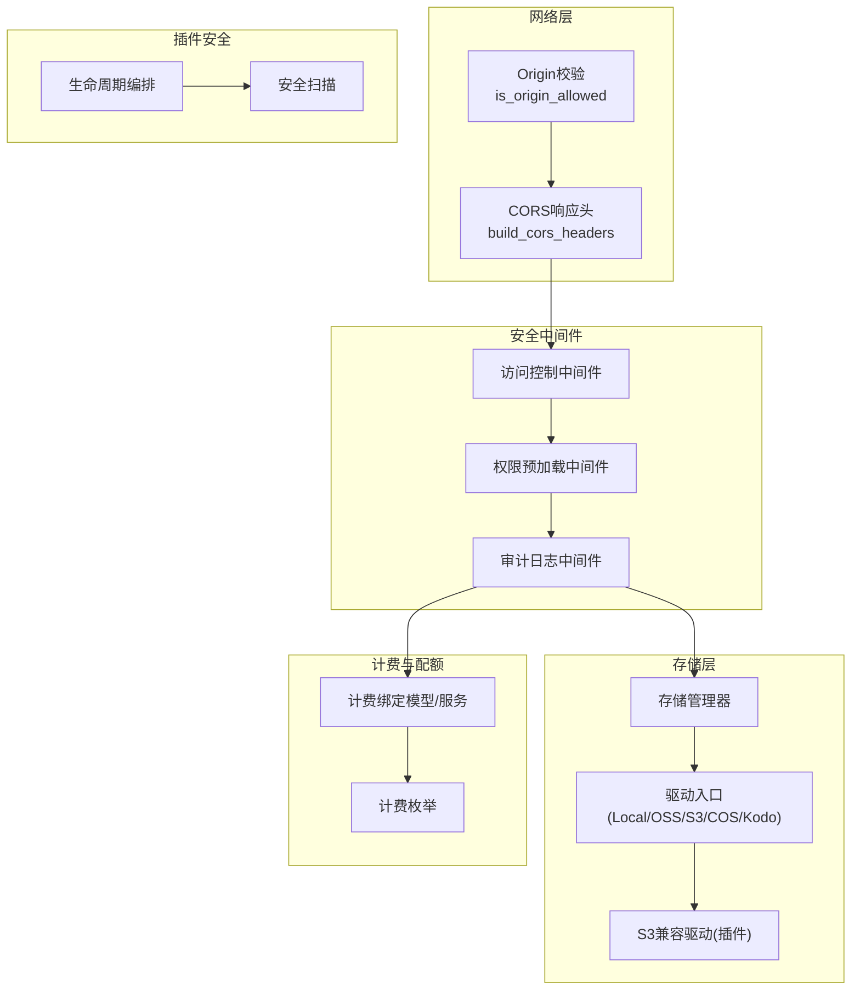
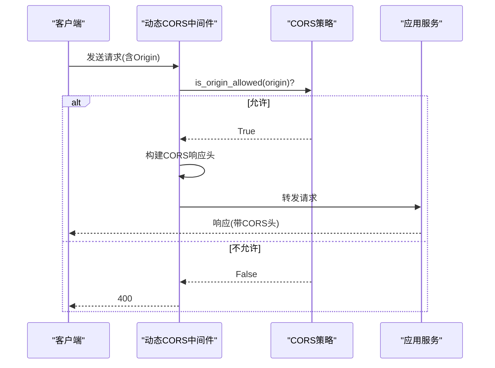
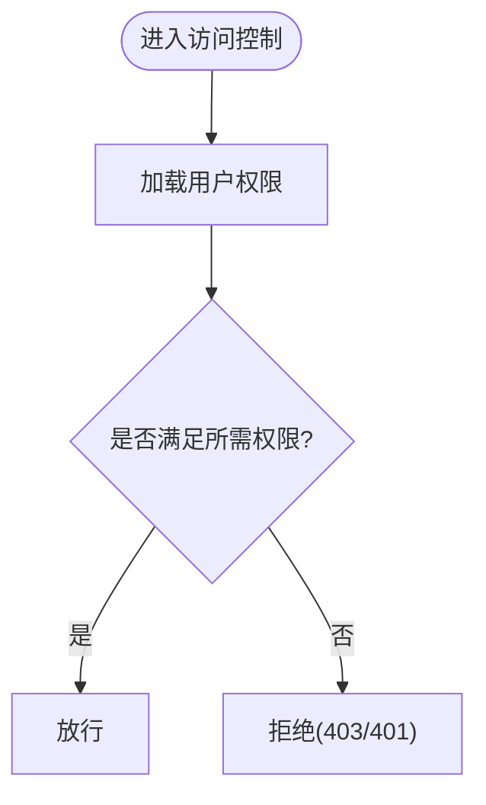
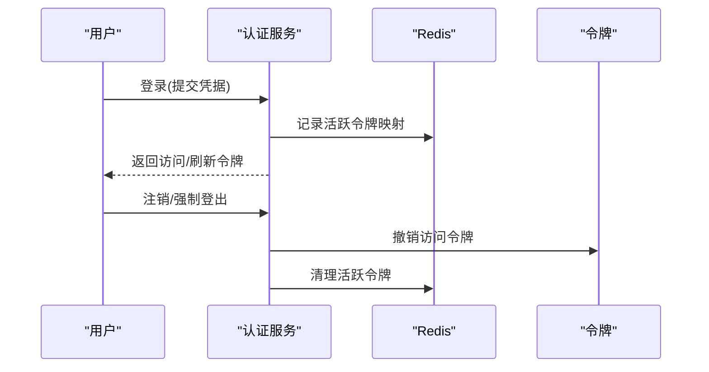
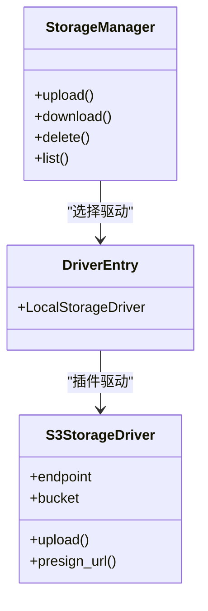
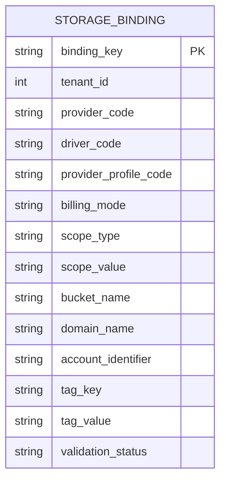
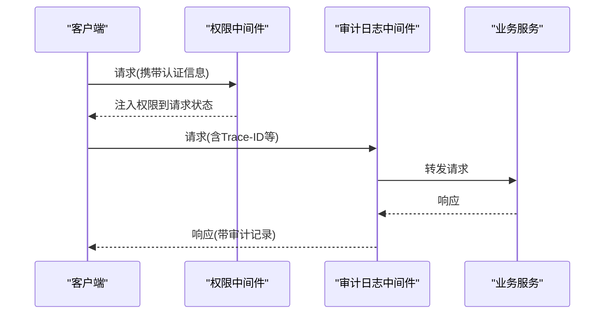
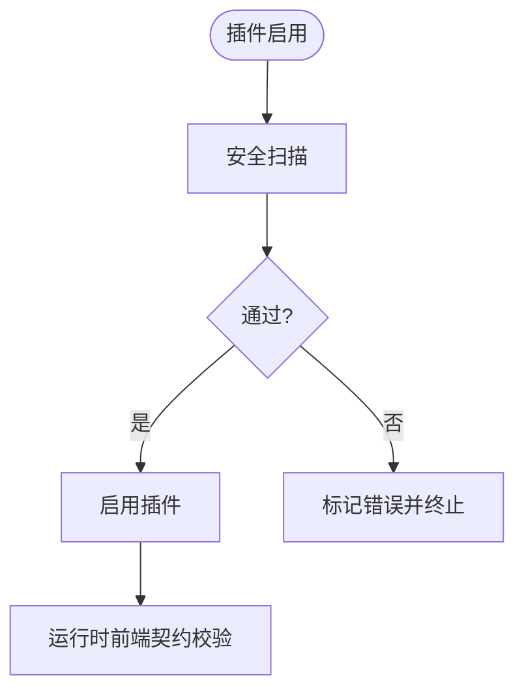
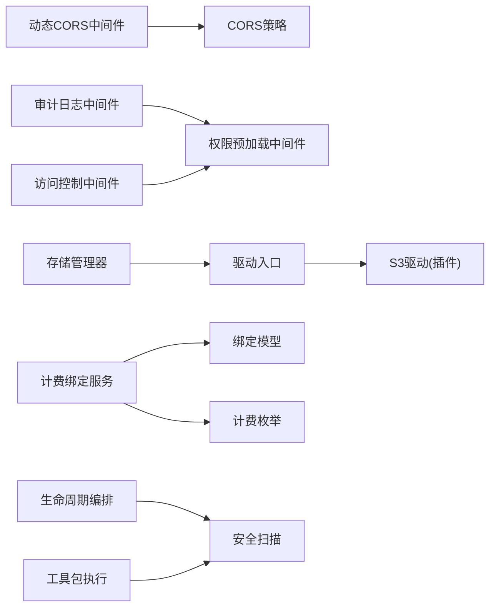

# 存储安全策略

<cite>
**本文引用的文件**
- [backend/app/main.py](file://backend/app/main.py)
- [backend/app/middleware/dynamic_cors.py](file://backend/app/middleware/dynamic_cors.py)
- [backend/app/core/cors.py](file://backend/app/core/cors.py)
- [backend/app/middleware/access_control.py](file://backend/app/middleware/access_control.py)
- [backend/app/middleware/permission.py](file://backend/app/middleware/permission.py)
- [backend/app/middleware/audit_log.py](file://backend/app/middleware/audit_log.py)
- [backend/app/storage/base.py](file://backend/app/storage/base.py)
- [backend/app/storage/manager.py](file://backend/app/storage/manager.py)
- [backend/app/storage/drivers/__init__.py](file://backend/app/storage/drivers/__init__.py)
- [backend/plugins/amazon-s3/README.md](file://backend/plugins/amazon-s3/README.md)
- [backend/plugins/amazon-s3/README.zh-CN.md](file://backend/plugins/amazon-s3/README.zh-CN.md)
- [backend/plugins/storage-billing/backend/models/binding.py](file://backend/plugins/storage-billing/backend/models/binding.py)
- [backend/plugins/storage-billing/backend/models/enums.py](file://backend/plugins/storage-billing/backend/models/enums.py)
- [backend/plugins/storage-billing/backend/services/binding_service.py](file://backend/plugins/storage-billing/backend/services/binding_service.py)
- [backend/app/services/system/operation_log_service_parts/operators.py](file://backend/app/services/system/operation_log_service_parts/operators.py)
- [backend/app/rbac/services/permission_domains/checks.py](file://backend/app/rbac/services/permission_domains/checks.py)
- [backend/app/services/common/auth_domains/session_password.py](file://backend/app/services/common/auth_domains/session_password.py)
- [backend/app/ai/tools/executors/toolkit_executor.py](file://backend/app/ai/tools/executors/toolkit_executor.py)
- [backend/app/plugins/security_scan.py](file://backend/app/plugins/security_scan.py)
- [backend/app/plugins/lifecycle_orchestrator.py](file://backend/app/plugins/lifecycle_orchestrator.py)
- [backend/app/ai/tools/executors/toolkit_security.py](file://backend/app/ai/tools/executors/toolkit_security.py)
- [backend/SECURITY.md](file://backend/SECURITY.md)
</cite>

## 目录
1. [引言](#引言)
2. [项目结构](#项目结构)
3. [核心组件](#核心组件)
4. [架构总览](#架构总览)
5. [详细组件分析](#详细组件分析)
6. [依赖关系分析](#依赖关系分析)
7. [性能考量](#性能考量)
8. [故障排查指南](#故障排查指南)
9. [结论](#结论)
10. [附录](#附录)

## 引言
本文件面向存储安全策略，系统化阐述文件访问控制、权限验证与身份认证机制；详述存储配额管理、使用量监控与超限处置；文档化文件加密传输、存储加密与数据脱敏技术；涵盖安全审计日志、访问记录与合规性检查；解释跨域访问控制（CORS）、CORS 配置与安全头设置；提供存储安全配置示例、威胁防护与应急响应方案；总结安全最佳实践与漏洞防护指导。

## 项目结构
后端采用分层与插件化架构，存储安全相关的关键模块包括：
- 中间件层：动态 CORS、访问控制、权限预加载、审计日志等
- 存储层：抽象驱动与驱动入口、存储管理器
- 插件生态：S3 兼容存储驱动、存储计费绑定模型与服务、插件安全扫描与生命周期编排
- RBAC 与鉴权：权限判定、会话与密码策略、审计日志与操作日志

图表来源
- [backend/app/main.py:668-694](file://backend/app/main.py#L668-L694)
- [backend/app/middleware/dynamic_cors.py:1-65](file://backend/app/middleware/dynamic_cors.py#L1-L65)
- [backend/app/middleware/access_control.py](file://backend/app/middleware/access_control.py)
- [backend/app/middleware/permission.py](file://backend/app/middleware/permission.py)
- [backend/app/middleware/audit_log.py](file://backend/app/middleware/audit_log.py)
- [backend/app/storage/manager.py](file://backend/app/storage/manager.py)
- [backend/app/storage/drivers/__init__.py:1-12](file://backend/app/storage/drivers/__init__.py#L1-L12)
- [backend/plugins/amazon-s3/README.md:1-38](file://backend/plugins/amazon-s3/README.md#L1-L38)
- [backend/plugins/storage-billing/backend/services/binding_service.py:661-692](file://backend/plugins/storage-billing/backend/services/binding_service.py#L661-L692)
- [backend/app/plugins/security_scan.py:63-108](file://backend/app/plugins/security_scan.py#L63-L108)
- [backend/app/plugins/lifecycle_orchestrator.py:348-385](file://backend/app/plugins/lifecycle_orchestrator.py#L348-L385)

章节来源
- [backend/app/main.py:668-694](file://backend/app/main.py#L668-L694)

## 核心组件
- 动态 CORS 与安全头：统一 HTTP 与 Socket.IO 的 Origin 校验，构建标准 CORS 响应头，支持预检短路与暴露头控制
- 访问控制与权限：RBAC 权限判定、权限预加载、默认拒绝策略
- 审计日志：记录 API 调用、操作日志与身份元数据映射
- 存储驱动与管理：本地与云存储驱动抽象、驱动入口、S3 兼容驱动能力
- 存储计费与配额：按租户/作用域绑定计费、计费模式与范围类型
- 插件安全：导入/属性黑名单、AST 静态扫描、启用前安全扫描与错误处理

章节来源
- [backend/app/core/cors.py:113-141](file://backend/app/core/cors.py#L113-L141)
- [backend/app/middleware/dynamic_cors.py:19-65](file://backend/app/middleware/dynamic_cors.py#L19-L65)
- [backend/app/middleware/access_control.py](file://backend/app/middleware/access_control.py)
- [backend/app/middleware/permission.py](file://backend/app/middleware/permission.py)
- [backend/app/middleware/audit_log.py](file://backend/app/middleware/audit_log.py)
- [backend/app/storage/base.py](file://backend/app/storage/base.py)
- [backend/app/storage/manager.py](file://backend/app/storage/manager.py)
- [backend/app/storage/drivers/__init__.py:1-12](file://backend/app/storage/drivers/__init__.py#L1-L12)
- [backend/plugins/amazon-s3/README.md:1-38](file://backend/plugins/amazon-s3/README.md#L1-L38)
- [backend/plugins/storage-billing/backend/models/binding.py:51-80](file://backend/plugins/storage-billing/backend/models/binding.py#L51-L80)
- [backend/plugins/storage-billing/backend/models/enums.py:54-77](file://backend/plugins/storage-billing/backend/models/enums.py#L54-L77)
- [backend/plugins/storage-billing/backend/services/binding_service.py:661-692](file://backend/plugins/storage-billing/backend/services/binding_service.py#L661-L692)
- [backend/app/plugins/security_scan.py:63-108](file://backend/app/plugins/security_scan.py#L63-L108)
- [backend/app/plugins/lifecycle_orchestrator.py:348-385](file://backend/app/plugins/lifecycle_orchestrator.py#L348-L385)

## 架构总览
下图展示存储安全相关组件的交互关系与数据流：

图表来源
- [backend/app/core/cors.py:143-207](file://backend/app/core/cors.py#L143-L207)
- [backend/app/middleware/dynamic_cors.py:25-62](file://backend/app/middleware/dynamic_cors.py#L25-L62)
- [backend/app/middleware/access_control.py](file://backend/app/middleware/access_control.py)
- [backend/app/middleware/permission.py](file://backend/app/middleware/permission.py)
- [backend/app/middleware/audit_log.py](file://backend/app/middleware/audit_log.py)
- [backend/app/storage/manager.py](file://backend/app/storage/manager.py)
- [backend/app/storage/drivers/__init__.py:1-12](file://backend/app/storage/drivers/__init__.py#L1-L12)
- [backend/plugins/amazon-s3/README.md:1-38](file://backend/plugins/amazon-s3/README.md#L1-L38)
- [backend/plugins/storage-billing/backend/models/binding.py:51-80](file://backend/plugins/storage-billing/backend/models/binding.py#L51-L80)
- [backend/plugins/storage-billing/backend/models/enums.py:54-77](file://backend/plugins/storage-billing/backend/models/enums.py#L54-L77)
- [backend/app/plugins/security_scan.py:63-108](file://backend/app/plugins/security_scan.py#L63-L108)
- [backend/app/plugins/lifecycle_orchestrator.py:348-385](file://backend/app/plugins/lifecycle_orchestrator.py#L348-L385)

## 详细组件分析

### 跨域访问控制（CORS）与安全头
- 动态 Origin 校验：支持显式允许、本地调试、平台域、租户子域与已验证自定义域名
- 预检短路：对 OPTIONS 预检请求直接返回 204，注入允许的方法与头部
- CORS 响应头：精确回写 Origin，暴露必要头部，Vary: Origin，支持凭据

图表来源
- [backend/app/middleware/dynamic_cors.py:25-62](file://backend/app/middleware/dynamic_cors.py#L25-L62)
- [backend/app/core/cors.py:143-207](file://backend/app/core/cors.py#L143-L207)

章节来源
- [backend/app/middleware/dynamic_cors.py:1-65](file://backend/app/middleware/dynamic_cors.py#L1-L65)
- [backend/app/core/cors.py:113-141](file://backend/app/core/cors.py#L113-L141)
- [backend/app/core/cors.py:209-250](file://backend/app/core/cors.py#L209-L250)

### 文件访问控制与权限验证
- 默认拒绝：访问控制中间件实施“默认拒绝”的安全策略
- 权限预加载：权限中间件将用户权限注入请求上下文，供后续判定使用
- RBAC 权限判定：支持通配符、资源域通配与集合交并运算

图表来源
- [backend/app/middleware/access_control.py](file://backend/app/middleware/access_control.py)
- [backend/app/middleware/permission.py](file://backend/app/middleware/permission.py)
- [backend/app/rbac/services/permission_domains/checks.py:8-39](file://backend/app/rbac/services/permission_domains/checks.py#L8-L39)

章节来源
- [backend/app/middleware/access_control.py](file://backend/app/middleware/access_control.py)
- [backend/app/middleware/permission.py](file://backend/app/middleware/permission.py)
- [backend/app/rbac/services/permission_domains/checks.py:1-39](file://backend/app/rbac/services/permission_domains/checks.py#L1-L39)

### 身份认证与会话管理
- 会话生命周期：记录活跃令牌、注销时撤销与强制登出
- 密码策略：按租户配置最小长度与复杂度，支持策略校验

图表来源
- [backend/app/services/common/auth_domains/session_password.py:26-59](file://backend/app/services/common/auth_domains/session_password.py#L26-L59)
- [backend/app/services/common/auth_domains/session_password.py:150-164](file://backend/app/services/common/auth_domains/session_password.py#L150-L164)

章节来源
- [backend/app/services/common/auth_domains/session_password.py:1-59](file://backend/app/services/common/auth_domains/session_password.py#L1-L59)
- [backend/app/services/common/auth_domains/session_password.py:150-164](file://backend/app/services/common/auth_domains/session_password.py#L150-L164)

### 存储驱动与加密传输
- 驱动抽象与入口：本地驱动内置，云驱动（OSS/S3/Kodo/COS）迁移到插件
- S3 兼容驱动：支持签名 URL、自定义端点、路径风格寻址，适配 AWS S3、MinIO、R2、B2 等
- 加密传输：通过 HTTPS 与签名 URL 实现传输链路保护

图表来源
- [backend/app/storage/manager.py](file://backend/app/storage/manager.py)
- [backend/app/storage/drivers/__init__.py:1-12](file://backend/app/storage/drivers/__init__.py#L1-L12)
- [backend/plugins/amazon-s3/README.md:1-38](file://backend/plugins/amazon-s3/README.md#L1-L38)

章节来源
- [backend/app/storage/base.py](file://backend/app/storage/base.py)
- [backend/app/storage/manager.py](file://backend/app/storage/manager.py)
- [backend/app/storage/drivers/__init__.py:1-12](file://backend/app/storage/drivers/__init__.py#L1-L12)
- [backend/plugins/amazon-s3/README.md:1-38](file://backend/plugins/amazon-s3/README.md#L1-L38)
- [backend/plugins/amazon-s3/README.zh-CN.md:1-38](file://backend/plugins/amazon-s3/README.zh-CN.md#L1-L38)

### 存储配额管理、使用量监控与超限处理
- 计费绑定模型：按租户/作用域绑定驱动与计费模式，支持桶、域名、账号、标签等范围
- 计费模式与范围枚举：标准化计费周期、模式与范围类型
- 超限处理：结合配额检查与计费绑定，实现按租户/范围的用量与费用控制

图表来源
- [backend/plugins/storage-billing/backend/models/binding.py:51-80](file://backend/plugins/storage-billing/backend/models/binding.py#L51-L80)
- [backend/plugins/storage-billing/backend/models/enums.py:54-77](file://backend/plugins/storage-billing/backend/models/enums.py#L54-L77)

章节来源
- [backend/plugins/storage-billing/backend/models/binding.py:51-80](file://backend/plugins/storage-billing/backend/models/binding.py#L51-L80)
- [backend/plugins/storage-billing/backend/models/enums.py:54-77](file://backend/plugins/storage-billing/backend/models/enums.py#L54-L77)
- [backend/plugins/storage-billing/backend/services/binding_service.py:661-692](file://backend/plugins/storage-billing/backend/services/binding_service.py#L661-L692)

### 审计日志、访问记录与合规性检查
- 审计日志中间件：记录 API 调用，需在权限中间件之后注册以获取用户信息
- 操作日志：支持批量加载身份元数据映射，便于审计与合规导出
- 合规性：插件市场存在“高级审计日志”插件，支持合规导出与告警规则

图表来源
- [backend/app/main.py:674-682](file://backend/app/main.py#L674-L682)
- [backend/app/middleware/audit_log.py](file://backend/app/middleware/audit_log.py)
- [backend/app/services/system/operation_log_service_parts/operators.py:252-265](file://backend/app/services/system/operation_log_service_parts/operators.py#L252-L265)

章节来源
- [backend/app/main.py:674-682](file://backend/app/main.py#L674-L682)
- [backend/app/middleware/audit_log.py](file://backend/app/middleware/audit_log.py)
- [backend/app/services/system/operation_log_service_parts/operators.py:252-265](file://backend/app/services/system/operation_log_service_parts/operators.py#L252-L265)

### 插件安全扫描与启用流程
- 安全扫描：危险模块与属性黑名单、AST 静态分析，检测危险导入与内置函数调用
- 生命周期编排：启用前执行安全扫描，失败则标记错误并发出事件
- 工具包执行：非信任工具包执行前进行安全扫描，违规即阻断

图表来源
- [backend/app/plugins/security_scan.py:63-108](file://backend/app/plugins/security_scan.py#L63-L108)
- [backend/app/plugins/lifecycle_orchestrator.py:348-385](file://backend/app/plugins/lifecycle_orchestrator.py#L348-L385)
- [backend/app/ai/tools/executors/toolkit_executor.py:129-148](file://backend/app/ai/tools/executors/toolkit_executor.py#L129-L148)
- [backend/app/ai/tools/executors/toolkit_security.py:123-146](file://backend/app/ai/tools/executors/toolkit_security.py#L123-L146)

章节来源
- [backend/app/plugins/security_scan.py:63-108](file://backend/app/plugins/security_scan.py#L63-L108)
- [backend/app/plugins/lifecycle_orchestrator.py:348-385](file://backend/app/plugins/lifecycle_orchestrator.py#L348-L385)
- [backend/app/ai/tools/executors/toolkit_executor.py:129-148](file://backend/app/ai/tools/executors/toolkit_executor.py#L129-L148)
- [backend/app/ai/tools/executors/toolkit_security.py:123-146](file://backend/app/ai/tools/executors/toolkit_security.py#L123-L146)

## 依赖关系分析
- 中间件依赖：动态 CORS 依赖 CORS 策略；审计日志依赖权限中间件提供的用户信息；访问控制中间件依赖权限预加载
- 存储依赖：存储管理器依赖驱动入口；驱动入口指向插件驱动（如 S3）
- 计费依赖：绑定服务依赖绑定模型与枚举；计费模式与范围类型标准化
- 安全依赖：生命周期编排依赖安全扫描；工具包执行依赖安全扫描与 AST 分析

图表来源
- [backend/app/middleware/dynamic_cors.py:19-65](file://backend/app/middleware/dynamic_cors.py#L19-L65)
- [backend/app/core/cors.py:143-207](file://backend/app/core/cors.py#L143-L207)
- [backend/app/middleware/audit_log.py](file://backend/app/middleware/audit_log.py)
- [backend/app/middleware/permission.py](file://backend/app/middleware/permission.py)
- [backend/app/middleware/access_control.py](file://backend/app/middleware/access_control.py)
- [backend/app/storage/manager.py](file://backend/app/storage/manager.py)
- [backend/app/storage/drivers/__init__.py:1-12](file://backend/app/storage/drivers/__init__.py#L1-L12)
- [backend/plugins/amazon-s3/README.md:1-38](file://backend/plugins/amazon-s3/README.md#L1-L38)
- [backend/plugins/storage-billing/backend/services/binding_service.py:661-692](file://backend/plugins/storage-billing/backend/services/binding_service.py#L661-L692)
- [backend/plugins/storage-billing/backend/models/binding.py:51-80](file://backend/plugins/storage-billing/backend/models/binding.py#L51-L80)
- [backend/plugins/storage-billing/backend/models/enums.py:54-77](file://backend/plugins/storage-billing/backend/models/enums.py#L54-L77)
- [backend/app/plugins/lifecycle_orchestrator.py:348-385](file://backend/app/plugins/lifecycle_orchestrator.py#L348-L385)
- [backend/app/plugins/security_scan.py:63-108](file://backend/app/plugins/security_scan.py#L63-L108)
- [backend/app/ai/tools/executors/toolkit_executor.py:129-148](file://backend/app/ai/tools/executors/toolkit_executor.py#L129-L148)

章节来源
- [backend/app/main.py:668-694](file://backend/app/main.py#L668-L694)

## 性能考量
- CORS 预检短路：减少不必要的应用处理开销
- 权限判定优化：权限预加载避免重复查询；RBAC 判定逻辑简洁高效
- 存储驱动：S3 兼容驱动通过签名 URL 减少服务端带宽压力
- 审计日志：异步落库与批量映射可降低写放大影响

## 故障排查指南
- CORS 400/跨域失败
  - 检查 Origin 是否在允许列表或已验证自定义域名缓存中
  - 确认预检请求方法与头部符合默认允许集
- 审计日志缺失
  - 确认审计日志中间件注册顺序在权限中间件之后
- 插件启用失败
  - 查看安全扫描警告与生命周期错误事件
- 存储访问异常
  - 核对签名 URL 有效期、桶/域/账号/标签范围配置与计费模式

章节来源
- [backend/app/core/cors.py:234-250](file://backend/app/core/cors.py#L234-L250)
- [backend/app/middleware/dynamic_cors.py:38-51](file://backend/app/middleware/dynamic_cors.py#L38-L51)
- [backend/app/main.py:674-682](file://backend/app/main.py#L674-L682)
- [backend/app/plugins/lifecycle_orchestrator.py:348-385](file://backend/app/plugins/lifecycle_orchestrator.py#L348-L385)

## 结论
本策略通过“默认拒绝”的访问控制、严格的 CORS 校验、完善的审计日志与插件安全扫描，构建了覆盖传输、存储与运行时的多层安全防线。结合计费绑定与配额管理，实现对存储使用的可控与可观测。建议持续完善安全扫描规则、强化密钥轮换与证书管理，并定期演练应急响应流程。

## 附录

### 配置示例与最佳实践
- CORS 配置要点
  - 显式允许可信域名与平台域
  - 限制暴露头部，避免泄露敏感信息
  - 对预检请求进行短路处理
- 存储驱动配置
  - 使用 HTTPS 与签名 URL
  - 配置自定义端点与路径风格寻址（如 MinIO）
- 计费与配额
  - 为租户与作用域绑定计费模式与范围
  - 设置合理的用量阈值与告警规则
- 插件安全
  - 启用前执行安全扫描
  - 严格控制工具包来源与权限

### 威胁防护与应急响应
- 威胁防护
  - 限制 Origin 与方法/头部白名单
  - 强密码策略与会话撤销
  - 定期审查权限与访问日志
- 应急响应
  - 触发强制登出与令牌撤销
  - 回滚不安全插件版本
  - 审计日志与合规导出留痕

章节来源
- [backend/SECURITY.md:1-29](file://backend/SECURITY.md#L1-L29)
- [backend/app/services/common/auth_domains/session_password.py:130-148](file://backend/app/services/common/auth_domains/session_password.py#L130-L148)
- [backend/app/plugins/lifecycle_orchestrator.py:348-385](file://backend/app/plugins/lifecycle_orchestrator.py#L348-L385)