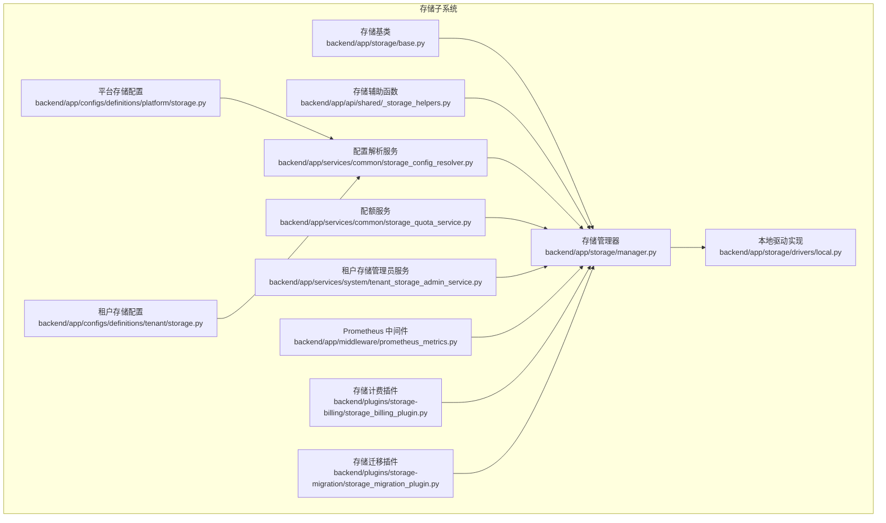
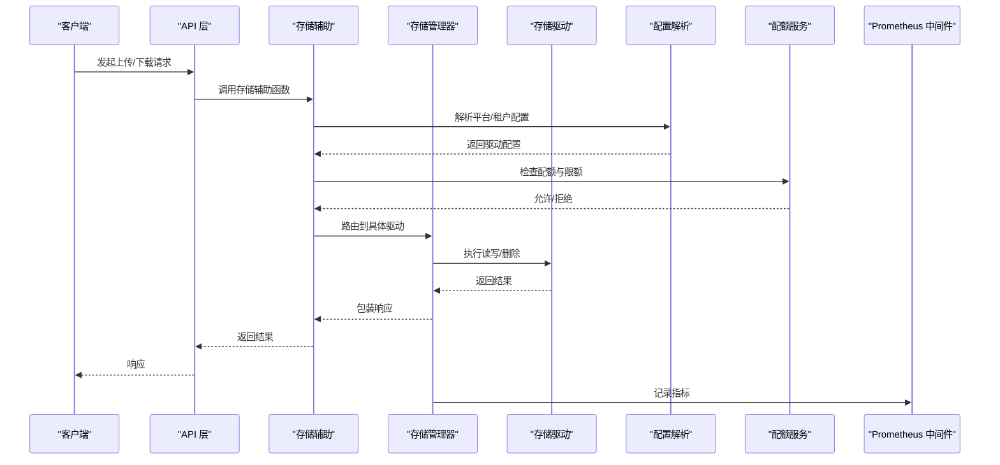
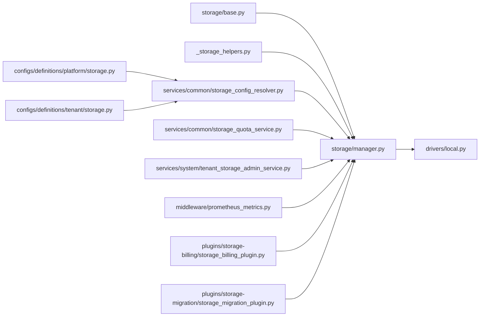

# 存储性能优化

<cite>
**本文引用的文件**
- [backend/app/storage/base.py](file://backend/app/storage/base.py)
- [backend/app/storage/manager.py](file://backend/app/storage/manager.py)
- [backend/app/storage/drivers/local.py](file://backend/app/storage/drivers/local.py)
- [backend/app/api/shared/_storage_helpers.py](file://backend/app/api/shared/_storage_helpers.py)
- [backend/app/configs/definitions/platform/storage.py](file://backend/app/configs/definitions/platform/storage.py)
- [backend/app/configs/definitions/tenant/storage.py](file://backend/app/configs/definitions/tenant/storage.py)
- [backend/app/services/common/storage_config_resolver.py](file://backend/app/services/common/storage_config_resolver.py)
- [backend/app/services/common/storage_quota_service.py](file://backend/app/services/common/storage_quota_service.py)
- [backend/app/services/system/tenant_storage_admin_service.py](file://backend/app/services/system/tenant_storage_admin_service.py)
- [backend/app/middleware/prometheus_metrics.py](file://backend/app/middleware/prometheus_metrics.py)
- [backend/plugins/storage-billing/storage_billing_plugin.py](file://backend/plugins/storage-billing/storage_billing_plugin.py)
- [backend/plugins/storage-migration/storage_migration_plugin.py](file://backend/plugins/storage-migration/storage_migration_plugin.py)
- [backend/docs/RUN_LOG_ANALYSIS.md](file://backend/docs/RUN_LOG_ANALYSIS.md)
</cite>

## 目录
1. [简介](#简介)
2. [项目结构](#项目结构)
3. [核心组件](#核心组件)
4. [架构总览](#架构总览)
5. [详细组件分析](#详细组件分析)
6. [依赖关系分析](#依赖关系分析)
7. [性能考量](#性能考量)
8. [故障排查指南](#故障排查指南)
9. [结论](#结论)
10. [附录](#附录)

## 简介
本技术文档聚焦于存储系统的性能优化，围绕以下主题展开：性能瓶颈识别、缓存策略与负载均衡、文件分片上传与并发处理、异步操作优化、存储压缩与去重、存储碎片整理、监控指标与基准测试、容量规划、CDN集成与边缘缓存、全球分发策略，以及具体的调优方法、配置参数与监控工具使用。文档基于仓库中现有的存储子系统实现与配置进行分析，并提供可操作的优化建议与排障指引。

## 项目结构
存储子系统主要由以下层次构成：
- 驱动层：抽象驱动接口与具体实现（本地驱动示例）
- 管理层：统一的存储管理器，负责路由与调度
- API 辅助：共享的存储辅助函数，用于上传、下载等流程
- 配置定义：平台级与租户级存储配置
- 服务层：配置解析、配额服务、管理员服务
- 中间件：Prometheus 指标采集
- 插件：存储计费与迁移插件
- 文档：运行日志分析文档

**图表来源**
- [backend/app/storage/base.py](file://backend/app/storage/base.py)
- [backend/app/storage/manager.py](file://backend/app/storage/manager.py)
- [backend/app/storage/drivers/local.py](file://backend/app/storage/drivers/local.py)
- [backend/app/api/shared/_storage_helpers.py](file://backend/app/api/shared/_storage_helpers.py)
- [backend/app/configs/definitions/platform/storage.py](file://backend/app/configs/definitions/platform/storage.py)
- [backend/app/configs/definitions/tenant/storage.py](file://backend/app/configs/definitions/tenant/storage.py)
- [backend/app/services/common/storage_config_resolver.py](file://backend/app/services/common/storage_config_resolver.py)
- [backend/app/services/common/storage_quota_service.py](file://backend/app/services/common/storage_quota_service.py)
- [backend/app/services/system/tenant_storage_admin_service.py](file://backend/app/services/system/tenant_storage_admin_service.py)
- [backend/app/middleware/prometheus_metrics.py](file://backend/app/middleware/prometheus_metrics.py)
- [backend/plugins/storage-billing/storage_billing_plugin.py](file://backend/plugins/storage-billing/storage_billing_plugin.py)
- [backend/plugins/storage-migration/storage_migration_plugin.py](file://backend/plugins/storage-migration/storage_migration_plugin.py)

**章节来源**
- [backend/app/storage/base.py](file://backend/app/storage/base.py)
- [backend/app/storage/manager.py](file://backend/app/storage/manager.py)
- [backend/app/storage/drivers/local.py](file://backend/app/storage/drivers/local.py)
- [backend/app/api/shared/_storage_helpers.py](file://backend/app/api/shared/_storage_helpers.py)
- [backend/app/configs/definitions/platform/storage.py](file://backend/app/configs/definitions/platform/storage.py)
- [backend/app/configs/definitions/tenant/storage.py](file://backend/app/configs/definitions/tenant/storage.py)
- [backend/app/services/common/storage_config_resolver.py](file://backend/app/services/common/storage_config_resolver.py)
- [backend/app/services/common/storage_quota_service.py](file://backend/app/services/common/storage_quota_service.py)
- [backend/app/services/system/tenant_storage_admin_service.py](file://backend/app/services/system/tenant_storage_admin_service.py)
- [backend/app/middleware/prometheus_metrics.py](file://backend/app/middleware/prometheus_metrics.py)
- [backend/plugins/storage-billing/storage_billing_plugin.py](file://backend/plugins/storage-billing/storage_billing_plugin.py)
- [backend/plugins/storage-migration/storage_migration_plugin.py](file://backend/plugins/storage-migration/storage_migration_plugin.py)

## 核心组件
- 存储基类：定义统一的存储接口与抽象方法，确保不同驱动的一致性。
- 存储管理器：协调驱动选择、路由策略、并发控制与错误处理。
- 本地驱动：提供本地文件系统访问能力，作为默认或基础实现。
- API 辅助：封装上传、下载、删除等常用操作的流程与参数校验。
- 平台/租户配置：定义全局与租户维度的存储行为参数（如驱动类型、桶/路径、配额等）。
- 配置解析服务：将平台与租户配置合并并解析为运行时可用的驱动配置。
- 配额服务：跟踪与限制存储使用量，防止资源滥用。
- 管理员服务：提供租户存储的管理与审计能力。
- 中间件：暴露 Prometheus 指标，便于监控存储相关指标。
- 插件：存储计费与迁移插件，支持成本核算与数据迁移。

**章节来源**
- [backend/app/storage/base.py](file://backend/app/storage/base.py)
- [backend/app/storage/manager.py](file://backend/app/storage/manager.py)
- [backend/app/storage/drivers/local.py](file://backend/app/storage/drivers/local.py)
- [backend/app/api/shared/_storage_helpers.py](file://backend/app/api/shared/_storage_helpers.py)
- [backend/app/configs/definitions/platform/storage.py](file://backend/app/configs/definitions/platform/storage.py)
- [backend/app/configs/definitions/tenant/storage.py](file://backend/app/configs/definitions/tenant/storage.py)
- [backend/app/services/common/storage_config_resolver.py](file://backend/app/services/common/storage_config_resolver.py)
- [backend/app/services/common/storage_quota_service.py](file://backend/app/services/common/storage_quota_service.py)
- [backend/app/services/system/tenant_storage_admin_service.py](file://backend/app/services/system/tenant_storage_admin_service.py)
- [backend/app/middleware/prometheus_metrics.py](file://backend/app/middleware/prometheus_metrics.py)
- [backend/plugins/storage-billing/storage_billing_plugin.py](file://backend/plugins/storage-billing/storage_billing_plugin.py)
- [backend/plugins/storage-migration/storage_migration_plugin.py](file://backend/plugins/storage-migration/storage_migration_plugin.py)

## 架构总览
下图展示了从 API 到存储驱动的整体调用链路，以及与配置、配额、中间件和插件的交互关系。

**图表来源**
- [backend/app/api/shared/_storage_helpers.py](file://backend/app/api/shared/_storage_helpers.py)
- [backend/app/storage/manager.py](file://backend/app/storage/manager.py)
- [backend/app/storage/drivers/local.py](file://backend/app/storage/drivers/local.py)
- [backend/app/services/common/storage_config_resolver.py](file://backend/app/services/common/storage_config_resolver.py)
- [backend/app/services/common/storage_quota_service.py](file://backend/app/services/common/storage_quota_service.py)
- [backend/app/middleware/prometheus_metrics.py](file://backend/app/middleware/prometheus_metrics.py)

## 详细组件分析

### 存储基类与驱动接口
- 设计要点：通过抽象基类定义统一的接口，确保不同驱动（本地、S3、OSS 等）具备一致的行为契约。
- 关键职责：定义读写、删除、列举、元数据获取等方法；为上层提供稳定的调用入口。
- 性能影响：接口设计直接影响上层并发与错误处理策略；清晰的异常模型有助于快速失败与降级。

**章节来源**
- [backend/app/storage/base.py](file://backend/app/storage/base.py)

### 存储管理器
- 设计要点：集中式路由与调度，结合配置解析与配额检查，决定具体驱动与执行策略。
- 关键职责：选择驱动、并发控制、错误聚合、超时与重试策略、生命周期管理。
- 性能影响：是性能优化的关键枢纽，可通过连接池、批量操作、背压控制等手段提升吞吐。

**章节来源**
- [backend/app/storage/manager.py](file://backend/app/storage/manager.py)

### 本地驱动实现
- 设计要点：基于本地文件系统实现，适合开发与小规模部署。
- 关键职责：文件读写、目录管理、权限与安全控制。
- 性能影响：I/O 密集场景下，需关注磁盘队列深度、顺序 vs 随机访问模式、文件系统缓存策略。

**章节来源**
- [backend/app/storage/drivers/local.py](file://backend/app/storage/drivers/local.py)

### API 存储辅助函数
- 设计要点：封装上传、下载、删除等高频操作的通用流程，包括参数校验、鉴权与错误包装。
- 关键职责：标准化请求参数、处理多部分上传、生成预签名 URL、清理临时资源。
- 性能影响：通过复用与缓存策略减少重复计算；在高并发下需注意锁与状态一致性。

**章节来源**
- [backend/app/api/shared/_storage_helpers.py](file://backend/app/api/shared/_storage_helpers.py)

### 配置定义与解析
- 平台配置：定义全局存储行为（驱动类型、桶/路径前缀、配额策略等）。
- 租户配置：覆盖平台配置，支持按租户差异化设置。
- 配置解析服务：合并平台与租户配置，输出运行时驱动配置对象。

**章节来源**
- [backend/app/configs/definitions/platform/storage.py](file://backend/app/configs/definitions/platform/storage.py)
- [backend/app/configs/definitions/tenant/storage.py](file://backend/app/configs/definitions/tenant/storage.py)
- [backend/app/services/common/storage_config_resolver.py](file://backend/app/services/common/storage_config_resolver.py)

### 配额与管理员服务
- 配额服务：跟踪已用空间与请求大小，拒绝超出限额的请求。
- 管理员服务：提供租户维度的存储管理与审计能力，支持容量规划与告警联动。

**章节来源**
- [backend/app/services/common/storage_quota_service.py](file://backend/app/services/common/storage_quota_service.py)
- [backend/app/services/system/tenant_storage_admin_service.py](file://backend/app/services/system/tenant_storage_admin_service.py)

### 中间件与监控
- Prometheus 中间件：记录存储相关指标（请求耗时、速率、错误率、字节数等），便于性能分析与告警。
- 建议：结合 Grafana/Alertmanager 实现可视化与自动化告警。

**章节来源**
- [backend/app/middleware/prometheus_metrics.py](file://backend/app/middleware/prometheus_metrics.py)

### 插件：存储计费与迁移
- 存储计费插件：对接计费系统，支持按用量计费与成本归集。
- 存储迁移插件：支持跨驱动的数据迁移与归档策略。

**章节来源**
- [backend/plugins/storage-billing/storage_billing_plugin.py](file://backend/plugins/storage-billing/storage_billing_plugin.py)
- [backend/plugins/storage-migration/storage_migration_plugin.py](file://backend/plugins/storage-migration/storage_migration_plugin.py)

## 依赖关系分析
存储子系统内部依赖关系如下：

**图表来源**
- [backend/app/storage/base.py](file://backend/app/storage/base.py)
- [backend/app/storage/manager.py](file://backend/app/storage/manager.py)
- [backend/app/storage/drivers/local.py](file://backend/app/storage/drivers/local.py)
- [backend/app/api/shared/_storage_helpers.py](file://backend/app/api/shared/_storage_helpers.py)
- [backend/app/configs/definitions/platform/storage.py](file://backend/app/configs/definitions/platform/storage.py)
- [backend/app/configs/definitions/tenant/storage.py](file://backend/app/configs/definitions/tenant/storage.py)
- [backend/app/services/common/storage_config_resolver.py](file://backend/app/services/common/storage_config_resolver.py)
- [backend/app/services/common/storage_quota_service.py](file://backend/app/services/common/storage_quota_service.py)
- [backend/app/services/system/tenant_storage_admin_service.py](file://backend/app/services/system/tenant_storage_admin_service.py)
- [backend/app/middleware/prometheus_metrics.py](file://backend/app/middleware/prometheus_metrics.py)
- [backend/plugins/storage-billing/storage_billing_plugin.py](file://backend/plugins/storage-billing/storage_billing_plugin.py)
- [backend/plugins/storage-migration/storage_migration_plugin.py](file://backend/plugins/storage-migration/storage_migration_plugin.py)

**章节来源**
- 同上

## 性能考量
本节从系统架构、数据流、处理逻辑与外部集成角度，提出存储性能优化的实践建议。

### 性能瓶颈识别
- I/O 瓶颈：通过 Prometheus 指标观察读写延迟、磁盘队列长度、上下文切换频率。
- 并发瓶颈：监控并发请求数、等待队列长度、线程池饱和度。
- 网络瓶颈：CDN/边缘节点的命中率、回源比例、带宽利用率。
- 内存瓶颈：GC 次数与停顿时间、对象分配速率。

### 缓存策略
- 多级缓存：应用层内存缓存、CDN 边缘缓存、对象存储冷热分层。
- 缓存淘汰：LRU/LFU/TTL 组合，结合访问模式动态调整。
- 写入缓存：批量写入、缓冲区合并，降低小块写放大。

### 负载均衡机制
- 驱动级均衡：多后端驱动（本地+远端）按权重与健康状态轮询或最少连接。
- 节点级均衡：多实例部署，结合会话亲和或无状态设计。
- CDN 均衡：多区域镜像，基于用户地理位置选择最优节点。

### 文件分片上传与并发处理
- 分片策略：固定分片大小或自适应分片，支持断点续传与并行上传。
- 并发控制：令牌桶/漏桶限速，避免突发流量冲击后端。
- 异步优化：使用任务队列（Celery）处理非关键路径操作，如缩略图生成、索引更新。

### 存储压缩与去重
- 压缩：启用对象存储层面的压缩（如 gzip/zstd），或在传输层开启压缩。
- 去重：基于内容哈希的重复检测与引用计数，减少冗余存储。
- 碎片整理：定期扫描与合并小对象，重建索引，回收空洞空间。

### 监控指标与基准测试
- 指标体系：QPS、P95/P99 延迟、错误率、吞吐、缓存命中率、队列长度、CPU/内存/IO 使用率。
- 基准测试：模拟多用户并发上传/下载、大文件/小文件混合场景，评估系统上限与稳定性。
- 容量规划：基于历史峰值与增长趋势，预留冗余与升级路径。

### CDN 集成与全球分发
- 边缘缓存：热点资源预热，缩短首字节时间。
- 全球分发：就近接入、智能 DNS、回源策略与缓存刷新。
- 安全与鉴权：预签名 URL、防盗链、HTTPS 与证书管理。

### 调优方法与配置参数
- 连接池与超时：根据并发与网络状况调整连接数、读写超时、重试次数。
- 分片与批处理：合理设置分片大小与批量提交阈值，平衡吞吐与内存占用。
- 缓存参数：TTL、淘汰策略、预热策略。
- 配额与限流：动态配额、突发窗口、滑动窗口限流。

### 监控工具使用
- Prometheus 抓取存储相关指标，Grafana 可视化，Alertmanager 告警。
- 结合日志分析（运行日志分析文档）定位异常与热点路径。

**章节来源**
- [backend/app/middleware/prometheus_metrics.py](file://backend/app/middleware/prometheus_metrics.py)
- [backend/docs/RUN_LOG_ANALYSIS.md](file://backend/docs/RUN_LOG_ANALYSIS.md)

## 故障排查指南
- 常见问题
  - 上传失败：检查配额、权限、网络连通性与驱动可用性。
  - 下载缓慢：核查 CDN 命中率、边缘节点健康度与回源比例。
  - 存储膨胀：启用去重与压缩，定期碎片整理与索引重建。
  - 高延迟：分析 I/O 队列深度、GC 停顿与并发瓶颈。
- 排障步骤
  - 快速验证：确认配置解析正确、驱动可用、配额未触发。
  - 指标分析：对比基线与异常时段的指标变化，定位异常区间。
  - 日志分析：结合运行日志分析文档，提取关键错误堆栈与耗时路径。
  - 回滚与降级：必要时切换到本地驱动或关闭非关键功能，保障主业务。

**章节来源**
- [backend/app/services/common/storage_quota_service.py](file://backend/app/services/common/storage_quota_service.py)
- [backend/app/storage/manager.py](file://backend/app/storage/manager.py)
- [backend/docs/RUN_LOG_ANALYSIS.md](file://backend/docs/RUN_LOG_ANALYSIS.md)

## 结论
存储性能优化是一个系统工程，需要从架构设计、数据流、处理逻辑与外部集成多维度协同优化。通过明确的接口抽象、合理的配置与解析、严格的配额与监控、以及完善的缓存与负载均衡策略，可以显著提升系统的吞吐、稳定性和可扩展性。同时，结合基准测试与容量规划，持续迭代调优参数，确保在高并发与复杂场景下的可靠运行。

## 附录
- 相关文件路径与职责概览
  - 存储基类与管理器：统一接口与调度中枢
  - 驱动实现：本地文件系统访问
  - API 辅助：上传/下载/删除流程封装
  - 配置定义与解析：平台/租户差异化配置
  - 配额与管理员服务：容量与合规管理
  - 中间件与插件：监控与计费/迁移支撑