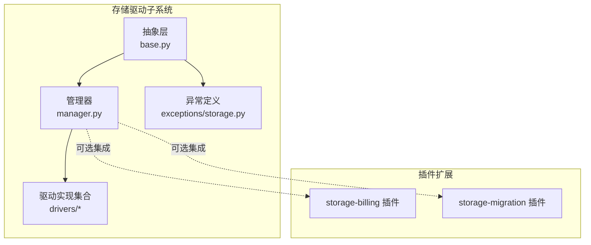
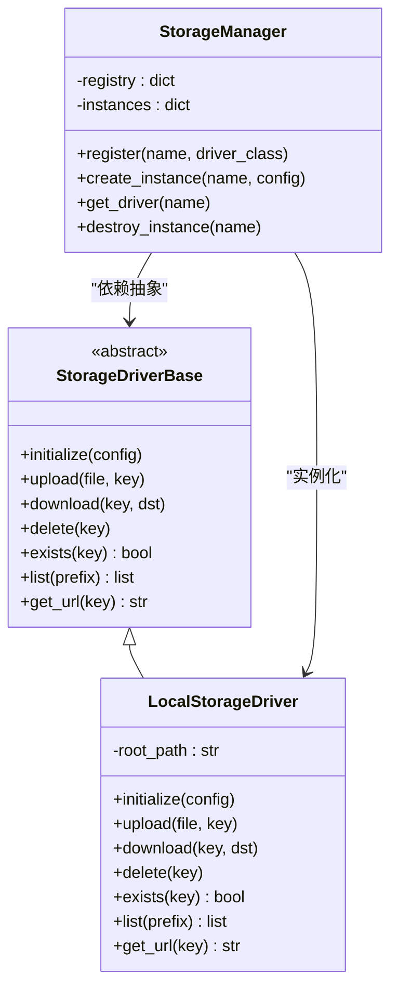
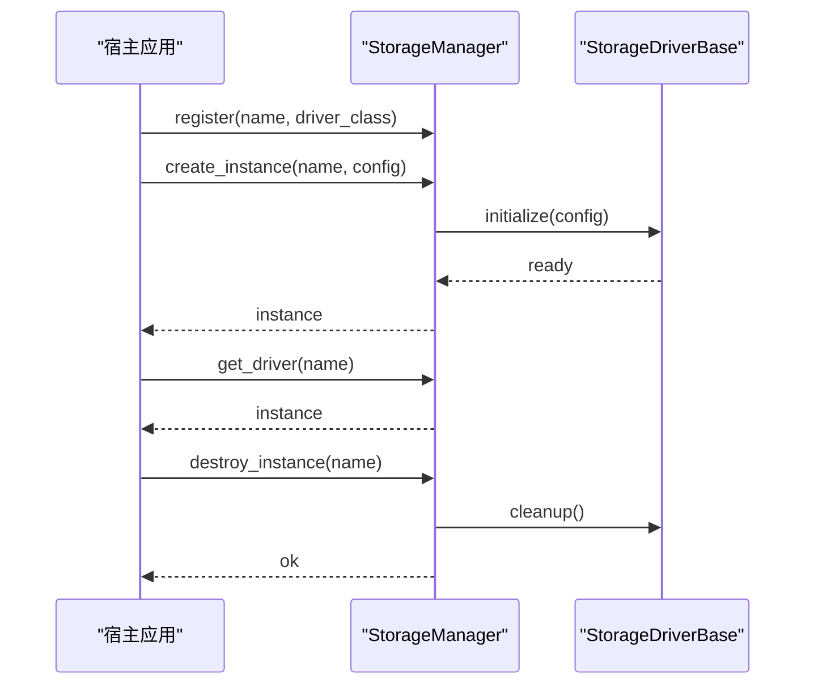
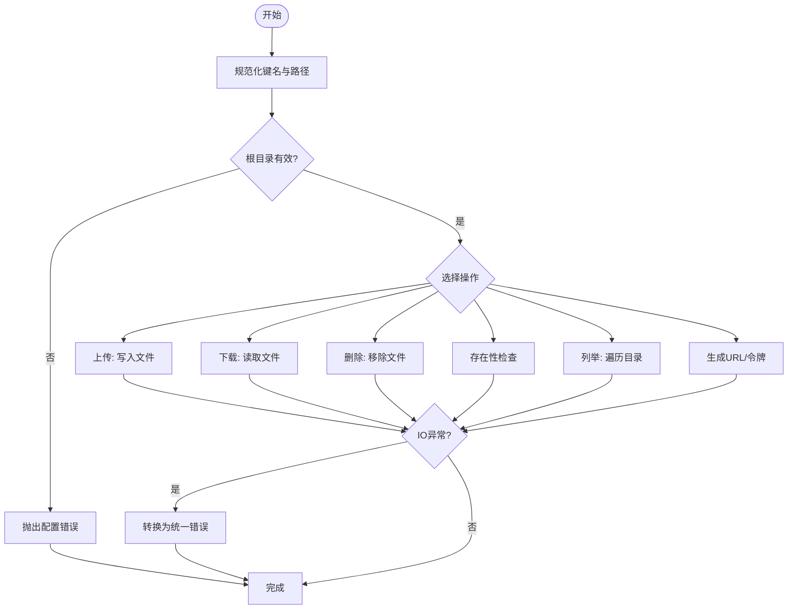
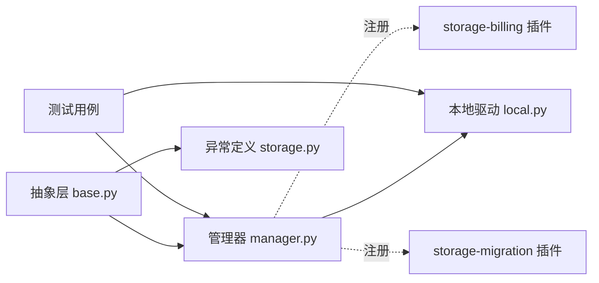

# 存储驱动系统

<cite>
**本文引用的文件**
- [backend/app/storage/base.py](file://backend/app/storage/base.py)
- [backend/app/storage/manager.py](file://backend/app/storage/manager.py)
- [backend/app/storage/drivers/local.py](file://backend/app/storage/drivers/local.py)
- [backend/app/storage/drivers/__init__.py](file://backend/app/storage/drivers/__init__.py)
- [backend/app/storage/__init__.py](file://backend/app/storage/__init__.py)
- [backend/app/exceptions/storage.py](file://backend/app/exceptions/storage.py)
- [backend/plugins/storage-billing/__init__.py](file://backend/plugins/storage-billing/__init__.py)
- [backend/plugins/storage-migration/__init__.py](file://backend/plugins/storage-migration/__init__.py)
- [backend/tests/test_storage_driver_host_contract.py](file://backend/tests/test_storage_driver_host_contract.py)
- [backend/tests/test_storage_plugins.py](file://backend/tests/test_storage_plugins.py)
</cite>

## 目录
1. [简介](#简介)
2. [项目结构](#项目结构)
3. [核心组件](#核心组件)
4. [架构总览](#架构总览)
5. [详细组件分析](#详细组件分析)
6. [依赖关系分析](#依赖关系分析)
7. [性能考虑](#性能考虑)
8. [故障排查指南](#故障排查指南)
9. [结论](#结论)
10. [附录](#附录)

## 简介
本技术文档面向存储驱动系统，系统性阐述其抽象架构、多后端支持机制与驱动注册流程；深入解析本地存储驱动的实现细节、对象存储驱动的适配模式与驱动接口规范；文档化驱动的初始化过程、连接管理与错误处理机制；给出驱动配置选项、性能参数与安全设置建议；解释驱动生命周期管理、资源清理与故障恢复策略，并提供多种存储驱动的配置示例与集成指导。

## 项目结构
存储驱动系统位于后端应用模块中，采用“抽象层 + 管理器 + 驱动实现”的分层组织方式：
- 抽象层：定义统一的驱动接口与异常体系，确保不同后端具备一致的行为契约。
- 管理器：负责驱动实例化、注册、路由与生命周期管理。
- 驱动实现：当前包含本地文件系统驱动；对象存储驱动通过插件扩展（如阿里云 OSS、腾讯 COS、七牛 Kodo、Amazon S3）。
- 异常体系：集中定义存储相关错误类型，便于上层统一处理与日志追踪。
- 测试：覆盖驱动主机契约与插件集成测试，保障兼容性与稳定性。

图表来源
- [backend/app/storage/base.py](file://backend/app/storage/base.py)
- [backend/app/storage/manager.py](file://backend/app/storage/manager.py)
- [backend/app/storage/drivers/local.py](file://backend/app/storage/drivers/local.py)
- [backend/app/exceptions/storage.py](file://backend/app/exceptions/storage.py)
- [backend/plugins/storage-billing/__init__.py](file://backend/plugins/storage-billing/__init__.py)
- [backend/plugins/storage-migration/__init__.py](file://backend/plugins/storage-migration/__init__.py)

章节来源
- [backend/app/storage/base.py](file://backend/app/storage/base.py)
- [backend/app/storage/manager.py](file://backend/app/storage/manager.py)
- [backend/app/storage/drivers/local.py](file://backend/app/storage/drivers/local.py)
- [backend/app/storage/drivers/__init__.py](file://backend/app/storage/drivers/__init__.py)
- [backend/app/storage/__init__.py](file://backend/app/storage/__init__.py)
- [backend/app/exceptions/storage.py](file://backend/app/exceptions/storage.py)
- [backend/plugins/storage-billing/__init__.py](file://backend/plugins/storage-billing/__init__.py)
- [backend/plugins/storage-migration/__init__.py](file://backend/plugins/storage-migration/__init__.py)

## 核心组件
- 抽象接口与数据模型：定义驱动必须实现的方法签名、配置字段与行为约束，确保多后端一致性。
- 管理器：负责驱动注册、实例化、上下文绑定与生命周期管理；提供统一的访问入口。
- 本地驱动：基于文件系统实现，适合开发与小规模部署场景。
- 对象存储驱动：通过插件扩展，遵循统一接口即可无缝接入。
- 异常体系：集中定义存储相关错误类型，便于上层统一处理与日志追踪。

章节来源
- [backend/app/storage/base.py](file://backend/app/storage/base.py)
- [backend/app/storage/manager.py](file://backend/app/storage/manager.py)
- [backend/app/storage/drivers/local.py](file://backend/app/storage/drivers/local.py)
- [backend/app/exceptions/storage.py](file://backend/app/exceptions/storage.py)

## 架构总览
存储驱动系统采用“接口抽象 + 管理器编排 + 多后端实现 + 插件扩展”的架构设计。管理器作为核心枢纽，向上提供统一接口，向下对接具体驱动实现；异常体系贯穿始终，保证错误可诊断、可恢复。

图表来源
- [backend/app/storage/base.py](file://backend/app/storage/base.py)
- [backend/app/storage/manager.py](file://backend/app/storage/manager.py)
- [backend/app/storage/drivers/local.py](file://backend/app/storage/drivers/local.py)

## 详细组件分析

### 抽象层与接口规范
- 接口职责：定义驱动初始化、上传、下载、删除、存在性检查、列举、生成公开访问链接等核心能力。
- 配置契约：要求驱动实现接收标准化配置字典，包括后端特定参数与通用参数（如超时、重试、鉴权等）。
- 行为约束：对异常、并发、权限与路径规范化进行约束，确保跨后端一致性。

章节来源
- [backend/app/storage/base.py](file://backend/app/storage/base.py)

### 管理器与注册流程
- 注册机制：管理器维护驱动名称到类的映射，支持动态注册与覆盖。
- 实例化：根据驱动名与配置创建具体驱动实例，缓存以复用。
- 访问路由：对外暴露统一的驱动获取方法，屏蔽具体实现差异。
- 生命周期：提供销毁实例方法，用于资源清理与环境切换。

图表来源
- [backend/app/storage/manager.py](file://backend/app/storage/manager.py)
- [backend/app/storage/base.py](file://backend/app/storage/base.py)

章节来源
- [backend/app/storage/manager.py](file://backend/app/storage/manager.py)

### 本地存储驱动实现
- 路径与权限：以根目录为基础，结合键名生成物理路径；对路径进行规范化与越界检查。
- 文件操作：封装上传、下载、删除、存在性检查与目录列举，确保原子性与幂等性。
- 公开访问：在本地环境下生成可访问的URL或临时令牌，满足前端直传/预览需求。
- 错误处理：对IO异常、权限不足、路径非法等情况进行捕获与转换，返回统一错误码。

图表来源
- [backend/app/storage/drivers/local.py](file://backend/app/storage/drivers/local.py)

章节来源
- [backend/app/storage/drivers/local.py](file://backend/app/storage/drivers/local.py)

### 对象存储驱动适配模式
- 插件化扩展：通过插件目录引入第三方对象存储SDK，遵循统一接口即可接入。
- 配置解耦：驱动仅依赖配置字典，不关心具体SDK实现细节，便于替换与升级。
- 能力对齐：确保上传、下载、删除、列举、存在性检查、URL生成等能力一一对应。
- 安全与鉴权：在配置中注入密钥、Endpoint、Bucket等信息，避免硬编码。

章节来源
- [backend/plugins/storage-billing/__init__.py](file://backend/plugins/storage-billing/__init__.py)
- [backend/plugins/storage-migration/__init__.py](file://backend/plugins/storage-migration/__init__.py)

### 初始化过程与连接管理
- 初始化：驱动接收配置并建立连接；对必填项进行校验，必要时进行连通性探测。
- 连接池/会话：根据后端特性选择长连接或短连接策略；对失败进行重试与退避。
- 上下文绑定：管理器在请求上下文中绑定驱动实例，确保线程安全与隔离。

章节来源
- [backend/app/storage/base.py](file://backend/app/storage/base.py)
- [backend/app/storage/manager.py](file://backend/app/storage/manager.py)

### 错误处理机制
- 统一异常：将底层异常转换为系统内统一的存储异常类型，携带错误码与上下文。
- 分类处理：区分网络错误、鉴权错误、资源不存在、权限不足等，采取不同恢复策略。
- 日志与追踪：记录关键事件与堆栈，便于定位问题与审计。

章节来源
- [backend/app/exceptions/storage.py](file://backend/app/exceptions/storage.py)
- [backend/tests/test_storage_driver_host_contract.py](file://backend/tests/test_storage_driver_host_contract.py)

## 依赖关系分析
- 抽象层与实现层：管理器依赖抽象接口，驱动实现依赖抽象接口；实现层可自由扩展。
- 插件扩展：storage-billing 与 storage-migration 插件通过注册机制与管理器协同工作。
- 测试验证：测试用例覆盖驱动契约与插件集成，确保兼容性与稳定性。

图表来源
- [backend/app/storage/base.py](file://backend/app/storage/base.py)
- [backend/app/storage/manager.py](file://backend/app/storage/manager.py)
- [backend/app/storage/drivers/local.py](file://backend/app/storage/drivers/local.py)
- [backend/app/exceptions/storage.py](file://backend/app/exceptions/storage.py)
- [backend/plugins/storage-billing/__init__.py](file://backend/plugins/storage-billing/__init__.py)
- [backend/plugins/storage-migration/__init__.py](file://backend/plugins/storage-migration/__init__.py)
- [backend/tests/test_storage_driver_host_contract.py](file://backend/tests/test_storage_driver_host_contract.py)
- [backend/tests/test_storage_plugins.py](file://backend/tests/test_storage_plugins.py)

章节来源
- [backend/app/storage/base.py](file://backend/app/storage/base.py)
- [backend/app/storage/manager.py](file://backend/app/storage/manager.py)
- [backend/app/storage/drivers/local.py](file://backend/app/storage/drivers/local.py)
- [backend/app/exceptions/storage.py](file://backend/app/exceptions/storage.py)
- [backend/plugins/storage-billing/__init__.py](file://backend/plugins/storage-billing/__init__.py)
- [backend/plugins/storage-migration/__init__.py](file://backend/plugins/storage-migration/__init__.py)
- [backend/tests/test_storage_driver_host_contract.py](file://backend/tests/test_storage_driver_host_contract.py)
- [backend/tests/test_storage_plugins.py](file://backend/tests/test_storage_plugins.py)

## 性能考虑
- 并发与锁：在高并发场景下，确保驱动内部操作的原子性与一致性，必要时引入互斥或队列控制。
- 传输优化：上传/下载时启用分块、断点续传与压缩（按需），减少带宽占用。
- 缓存策略：对频繁访问的小文件或元数据进行缓存，降低后端压力。
- 超时与重试：合理设置超时阈值与指数退避重试，避免雪崩效应。
- 监控指标：采集延迟、吞吐量、错误率与重试次数，持续优化配置。

## 故障排查指南
- 常见问题
  - 配置错误：检查驱动名称、密钥、Endpoint、Bucket 等参数是否正确。
  - 权限不足：确认凭据具有相应操作权限，路径/桶策略允许访问。
  - 网络异常：检查网络连通性与防火墙规则，必要时开启代理或调整超时。
  - 资源不存在：确认键名与路径正确，避免大小写与特殊字符导致的歧义。
- 排查步骤
  - 启用详细日志，定位错误发生阶段与具体原因。
  - 使用最小化配置复现问题，逐步缩小范围。
  - 对照测试用例，验证驱动契约是否被满足。
- 恢复策略
  - 自动重试：对瞬时错误进行有限次重试与退避。
  - 降级回退：在对象存储不可用时，回退到本地驱动或离线模式。
  - 清理与重建：销毁实例并重新初始化，释放无效连接与状态。

章节来源
- [backend/tests/test_storage_driver_host_contract.py](file://backend/tests/test_storage_driver_host_contract.py)
- [backend/tests/test_storage_plugins.py](file://backend/tests/test_storage_plugins.py)

## 结论
存储驱动系统通过抽象接口与管理器实现了多后端的一致性与可扩展性；本地驱动提供开箱即用的能力，对象存储驱动通过插件化扩展满足多样化部署需求。完善的异常体系与测试用例保障了系统的稳定性与可观测性。建议在生产环境中结合监控与告警，持续优化性能参数与安全策略。

## 附录

### 驱动配置选项与参数
- 通用参数
  - 驱动名称：用于注册与实例化标识
  - 超时时间：请求超时阈值
  - 重试策略：最大重试次数与退避算法
  - 日志级别：调试/信息/错误等
- 本地驱动参数
  - 根目录：文件系统根路径
  - 访问前缀：生成URL时的前缀
- 对象存储参数（示例）
  - Endpoint：服务地址
  - Bucket：存储桶名称
  - AccessKey/SecretKey：凭证
  - Region：区域信息

章节来源
- [backend/app/storage/base.py](file://backend/app/storage/base.py)
- [backend/app/storage/manager.py](file://backend/app/storage/manager.py)
- [backend/app/storage/drivers/local.py](file://backend/app/storage/drivers/local.py)

### 集成指导与最佳实践
- 开发环境：优先使用本地驱动，便于快速迭代与调试。
- 生产环境：接入对象存储驱动，结合CDN与HTTPS提升性能与安全性。
- 插件集成：通过插件目录引入第三方SDK，确保版本兼容与安全扫描。
- 安全设置：最小权限原则、密钥轮换、TLS加密、访问控制列表（ACL）与合规审计。
- 生命周期管理：在应用启动时注册驱动，在关闭时销毁实例，避免资源泄漏。

章节来源
- [backend/app/storage/manager.py](file://backend/app/storage/manager.py)
- [backend/plugins/storage-billing/__init__.py](file://backend/plugins/storage-billing/__init__.py)
- [backend/plugins/storage-migration/__init__.py](file://backend/plugins/storage-migration/__init__.py)