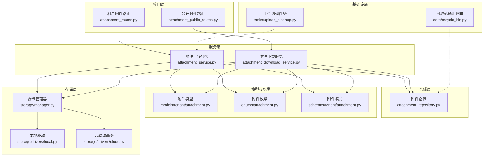
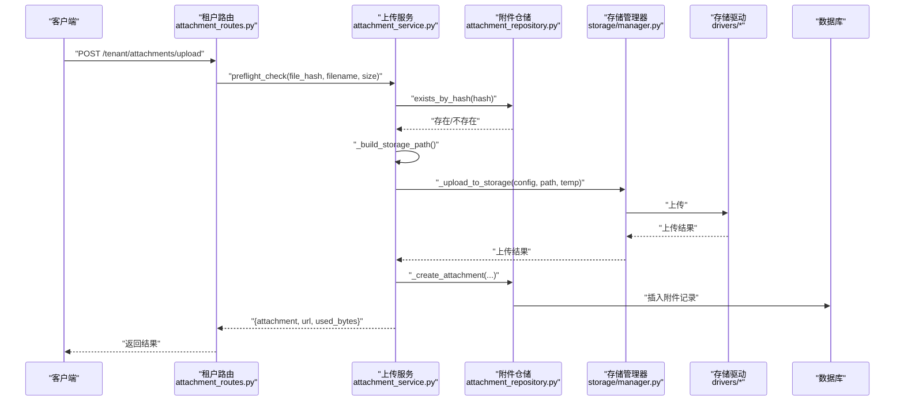
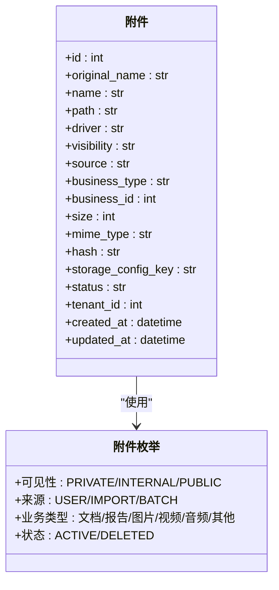
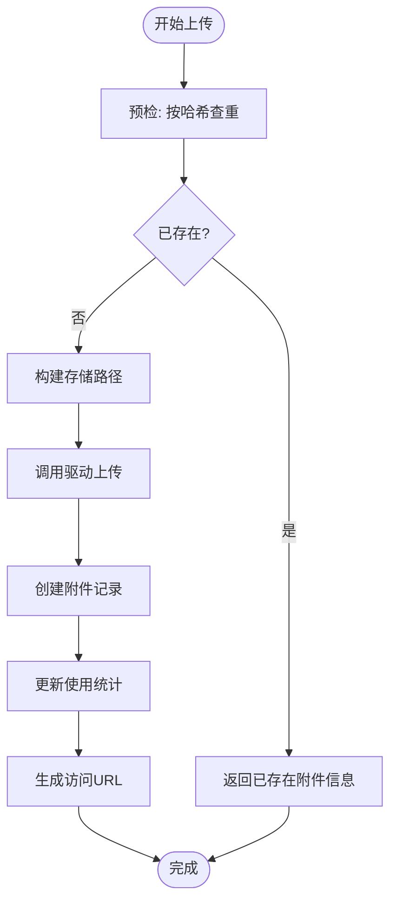
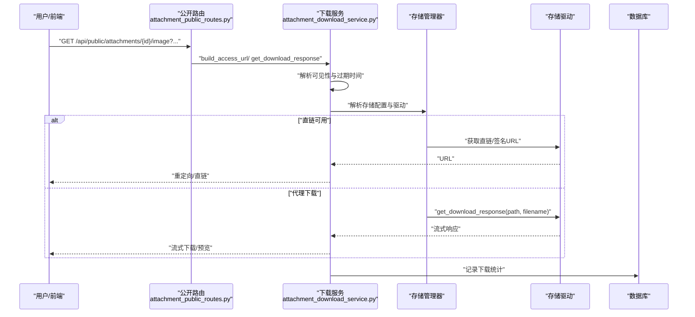
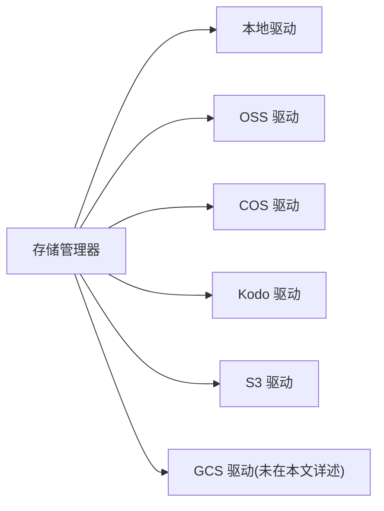
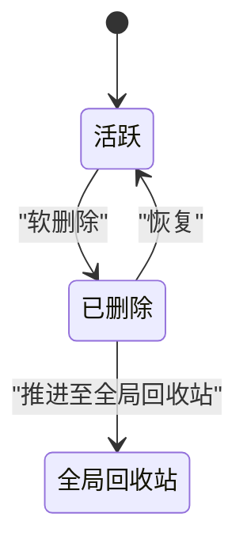
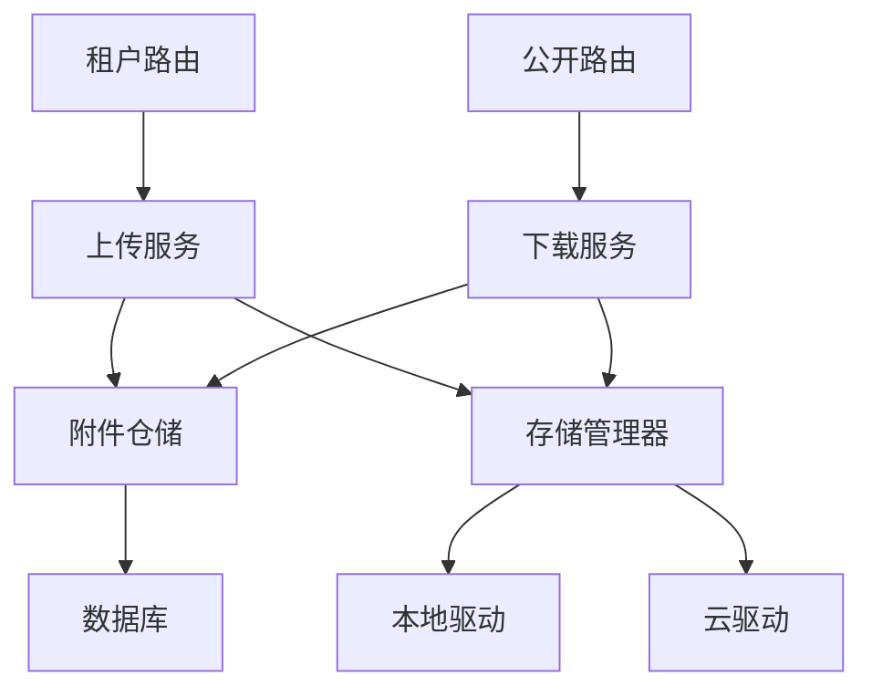

# 文件管理功能

<cite>
**本文引用的文件**
- [backend/app/enums/attachment.py](file://backend/app/enums/attachment.py)
- [backend/app/models/tenant/attachment.py](file://backend/app/models/tenant/attachment.py)
- [backend/app/schemas/tenant/attachment.py](file://backend/app/schemas/tenant/attachment.py)
- [backend/app/repositories/tenant/attachment_repository.py](file://backend/app/repositories/tenant/attachment_repository.py)
- [backend/app/services/tenant/attachment_service.py](file://backend/app/services/tenant/attachment_service.py)
- [backend/app/services/tenant/attachment_download_service.py](file://backend/app/services/tenant/attachment_download_service.py)
- [backend/app/storage/manager.py](file://backend/app/storage/manager.py)
- [backend/app/storage/drivers/local.py](file://backend/app/storage/drivers/local.py)
- [backend/app/storage/drivers/cloud.py](file://backend/app/storage/drivers/cloud.py)
- [backend/app/api/tenant/v1/attachment_routes.py](file://backend/app/api/tenant/v1/attachment_routes.py)
- [backend/app/api/public/attachment_public_routes.py](file://backend/app/api/public/attachment_public_routes.py)
- [backend/app/tasks/upload_cleanup.py](file://backend/app/tasks/upload_cleanup.py)
- [backend/app/core/recycle_bin.py](file://backend/app/core/recycle_bin.py)
- [backend/migrations/versions/20260224_add_attachments_table.py](file://backend/migrations/versions/20260224_add_attachments_table.py)
- [backend/migrations/versions/20260224_allow_null_attachment_tenant_id.py](file://backend/migrations/versions/20260224_allow_null_attachment_tenant_id.py)
- [backend/plugins/aliyun-oss/plugin.yaml](file://backend/plugins/aliyun-oss/plugin.yaml)
- [backend/plugins/amazon-s3/plugin.yaml](file://backend/plugins/amazon-s3/plugin.yaml)
- [backend/plugins/qiniu-kodo/plugin.yaml](file://backend/plugins/qiniu-kodo/plugin.yaml)
- [backend/plugins/tencent-cos/plugin.yaml](file://backend/plugins/tencent-cos/plugin.yaml)
</cite>

## 目录
1. [简介](#简介)
2. [项目结构](#项目结构)
3. [核心组件](#核心组件)
4. [架构总览](#架构总览)
5. [详细组件分析](#详细组件分析)
6. [依赖关系分析](#依赖关系分析)
7. [性能考虑](#性能考虑)
8. [故障排查指南](#故障排查指南)
9. [结论](#结论)
10. [附录](#附录)

## 简介
本技术文档围绕文件管理功能进行系统化说明，涵盖附件模型设计、文件元数据管理与存储路径策略、上传与下载机制、文件预览、分类与标签、搜索能力、格式与大小限制、安全扫描、版本与历史、回收站、API 接口、权限控制与批量操作等。文档以代码为依据，结合可视化图示帮助读者快速理解并正确使用该功能。

## 项目结构
文件管理功能主要由以下层次构成：
- 枚举与模型层：定义可见性、来源、业务类型等枚举，以及数据库模型与序列化模式
- 仓储层：封装对附件表的查询、聚合与统计
- 服务层：实现上传、预检、下载、URL 构建、统计等核心逻辑
- 存储驱动层：抽象本地与云存储驱动，支持多插件扩展
- 路由层：对外暴露租户与公开接口
- 任务与回收站：清理临时上传、软删除与批量回收站操作
- 迁移：附件表结构与字段变更

图表来源
- [backend/app/api/tenant/v1/attachment_routes.py](file://backend/app/api/tenant/v1/attachment_routes.py)
- [backend/app/api/public/attachment_public_routes.py](file://backend/app/api/public/attachment_public_routes.py)
- [backend/app/services/tenant/attachment_service.py](file://backend/app/services/tenant/attachment_service.py)
- [backend/app/services/tenant/attachment_download_service.py](file://backend/app/services/tenant/attachment_download_service.py)
- [backend/app/repositories/tenant/attachment_repository.py](file://backend/app/repositories/tenant/attachment_repository.py)
- [backend/app/storage/manager.py](file://backend/app/storage/manager.py)
- [backend/app/storage/drivers/local.py](file://backend/app/storage/drivers/local.py)
- [backend/app/storage/drivers/cloud.py](file://backend/app/storage/drivers/cloud.py)
- [backend/app/models/tenant/attachment.py](file://backend/app/models/tenant/attachment.py)
- [backend/app/enums/attachment.py](file://backend/app/enums/attachment.py)
- [backend/app/schemas/tenant/attachment.py](file://backend/app/schemas/tenant/attachment.py)
- [backend/app/tasks/upload_cleanup.py](file://backend/app/tasks/upload_cleanup.py)
- [backend/app/core/recycle_bin.py](file://backend/app/core/recycle_bin.py)

章节来源
- [backend/app/api/tenant/v1/attachment_routes.py](file://backend/app/api/tenant/v1/attachment_routes.py)
- [backend/app/api/public/attachment_public_routes.py](file://backend/app/api/public/attachment_public_routes.py)
- [backend/app/services/tenant/attachment_service.py](file://backend/app/services/tenant/attachment_service.py)
- [backend/app/services/tenant/attachment_download_service.py](file://backend/app/services/tenant/attachment_download_service.py)
- [backend/app/repositories/tenant/attachment_repository.py](file://backend/app/repositories/tenant/attachment_repository.py)
- [backend/app/storage/manager.py](file://backend/app/storage/manager.py)
- [backend/app/storage/drivers/local.py](file://backend/app/storage/drivers/local.py)
- [backend/app/storage/drivers/cloud.py](file://backend/app/storage/drivers/cloud.py)
- [backend/app/models/tenant/attachment.py](file://backend/app/models/tenant/attachment.py)
- [backend/app/enums/attachment.py](file://backend/app/enums/attachment.py)
- [backend/app/schemas/tenant/attachment.py](file://backend/app/schemas/tenant/attachment.py)
- [backend/app/tasks/upload_cleanup.py](file://backend/app/tasks/upload_cleanup.py)
- [backend/app/core/recycle_bin.py](file://backend/app/core/recycle_bin.py)

## 核心组件
- 附件模型与枚举：定义可见性、来源、业务类型、状态等字段，支撑上传、下载、预览与权限控制
- 附件仓储：提供按条件查询、聚合统计、分页与软删除计数等能力
- 上传服务：实现预检（秒传）、构建存储路径、调用驱动上传、创建附件记录、生成访问 URL
- 下载服务：根据驱动与可见性选择直链或代理下载，支持预览 inline、记录下载统计
- 存储管理器与驱动：统一驱动接口，支持本地与云存储插件（阿里云 OSS、腾讯 COS、七牛 Kodo、Amazon S3）
- 路由与权限：租户侧上传/列表/删除/回收站，公开侧预览/下载，配合权限装饰器与动作码
- 回收站与任务：软删除、批量恢复/删除、推进至全局回收站、定时清理临时上传

章节来源
- [backend/app/models/tenant/attachment.py](file://backend/app/models/tenant/attachment.py)
- [backend/app/enums/attachment.py](file://backend/app/enums/attachment.py)
- [backend/app/schemas/tenant/attachment.py](file://backend/app/schemas/tenant/attachment.py)
- [backend/app/repositories/tenant/attachment_repository.py](file://backend/app/repositories/tenant/attachment_repository.py)
- [backend/app/services/tenant/attachment_service.py](file://backend/app/services/tenant/attachment_service.py)
- [backend/app/services/tenant/attachment_download_service.py](file://backend/app/services/tenant/attachment_download_service.py)
- [backend/app/storage/manager.py](file://backend/app/storage/manager.py)
- [backend/app/api/tenant/v1/attachment_routes.py](file://backend/app/api/tenant/v1/attachment_routes.py)
- [backend/app/api/public/attachment_public_routes.py](file://backend/app/api/public/attachment_public_routes.py)
- [backend/app/core/recycle_bin.py](file://backend/app/core/recycle_bin.py)
- [backend/app/tasks/upload_cleanup.py](file://backend/app/tasks/upload_cleanup.py)

## 架构总览
文件管理采用“路由-服务-仓储-存储驱动”的分层架构，通过存储管理器解耦具体驱动，支持本地与多种云存储插件。上传流程包含预检、路径策略、驱动上传、记录创建与 URL 生成；下载流程根据可见性与驱动特性选择直链或代理下载，并记录下载统计。

图表来源
- [backend/app/api/tenant/v1/attachment_routes.py](file://backend/app/api/tenant/v1/attachment_routes.py)
- [backend/app/services/tenant/attachment_service.py](file://backend/app/services/tenant/attachment_service.py)
- [backend/app/repositories/tenant/attachment_repository.py](file://backend/app/repositories/tenant/attachment_repository.py)
- [backend/app/storage/manager.py](file://backend/app/storage/manager.py)
- [backend/app/storage/drivers/local.py](file://backend/app/storage/drivers/local.py)
- [backend/app/storage/drivers/cloud.py](file://backend/app/storage/drivers/cloud.py)

## 详细组件分析

### 附件模型与元数据
- 字段要点：原始文件名、存储路径、驱动、可见性、来源、业务类型/ID、大小、MIME 类型、哈希、存储配置键、状态、租户范围等
- 可见性与权限：PRIVATE/INTERNAL/PUBLIC 影响 URL 生成与访问控制
- 业务关联：支持按业务类型与业务 ID 关联，便于分类与检索
- 存储范围：平台级与租户级存储域，影响配额与清理策略

图表来源
- [backend/app/models/tenant/attachment.py](file://backend/app/models/tenant/attachment.py)
- [backend/app/enums/attachment.py](file://backend/app/enums/attachment.py)

章节来源
- [backend/app/models/tenant/attachment.py](file://backend/app/models/tenant/attachment.py)
- [backend/app/enums/attachment.py](file://backend/app/enums/attachment.py)

### 上传流程与预检（秒传）
- 预检：基于文件哈希判断是否已存在，避免重复上传
- 路径策略：根据存储模式与业务类型生成稳定且可预测的存储路径
- 驱动上传：调用存储管理器上传到本地或云存储，返回上传结果
- 创建记录：写入附件元数据，更新使用量统计
- URL 生成：根据可见性与驱动特性生成可访问 URL

图表来源
- [backend/app/services/tenant/attachment_service.py](file://backend/app/services/tenant/attachment_service.py)
- [backend/app/storage/manager.py](file://backend/app/storage/manager.py)
- [backend/app/repositories/tenant/attachment_repository.py](file://backend/app/repositories/tenant/attachment_repository.py)

章节来源
- [backend/app/services/tenant/attachment_service.py](file://backend/app/services/tenant/attachment_service.py)

### 下载机制与预览
- URL 生成策略：
  - 本地：通过 API 代理，私有文件附加令牌
  - 云存储：优先直链（签名/公共），否则回退到代理
  - 公共文件：可直接返回 CDN 或直链
- 预览：设置 Content-Disposition 为 inline，支持浏览器内预览
- 下载统计：记录每次下载的字节数，用于配额与审计

图表来源
- [backend/app/api/public/attachment_public_routes.py](file://backend/app/api/public/attachment_public_routes.py)
- [backend/app/services/tenant/attachment_download_service.py](file://backend/app/services/tenant/attachment_download_service.py)
- [backend/app/storage/manager.py](file://backend/app/storage/manager.py)
- [backend/app/storage/drivers/local.py](file://backend/app/storage/drivers/local.py)
- [backend/app/storage/drivers/cloud.py](file://backend/app/storage/drivers/cloud.py)

章节来源
- [backend/app/services/tenant/attachment_download_service.py](file://backend/app/services/tenant/attachment_download_service.py)
- [backend/app/api/public/attachment_public_routes.py](file://backend/app/api/public/attachment_public_routes.py)

### 存储路径策略与驱动
- 路径策略：按业务类型/日期/哈希前缀组织，保证可预测与可清理
- 驱动抽象：统一上传/下载/删除接口，支持本地与云存储插件
- 插件支持：阿里云 OSS、腾讯 COS、七牛 Kodo、Amazon S3 等

图表来源
- [backend/app/storage/manager.py](file://backend/app/storage/manager.py)
- [backend/app/storage/drivers/local.py](file://backend/app/storage/drivers/local.py)
- [backend/app/storage/drivers/cloud.py](file://backend/app/storage/drivers/cloud.py)
- [backend/plugins/aliyun-oss/plugin.yaml](file://backend/plugins/aliyun-oss/plugin.yaml)
- [backend/plugins/tencent-cos/plugin.yaml](file://backend/plugins/tencent-cos/plugin.yaml)
- [backend/plugins/qiniu-kodo/plugin.yaml](file://backend/plugins/qiniu-kodo/plugin.yaml)
- [backend/plugins/amazon-s3/plugin.yaml](file://backend/plugins/amazon-s3/plugin.yaml)

章节来源
- [backend/app/storage/manager.py](file://backend/app/storage/manager.py)
- [backend/app/storage/drivers/local.py](file://backend/app/storage/drivers/local.py)
- [backend/app/storage/drivers/cloud.py](file://backend/app/storage/drivers/cloud.py)
- [backend/plugins/aliyun-oss/plugin.yaml](file://backend/plugins/aliyun-oss/plugin.yaml)
- [backend/plugins/tencent-cos/plugin.yaml](file://backend/plugins/tencent-cos/plugin.yaml)
- [backend/plugins/qiniu-kodo/plugin.yaml](file://backend/plugins/qiniu-kodo/plugin.yaml)
- [backend/plugins/amazon-s3/plugin.yaml](file://backend/plugins/amazon-s3/plugin.yaml)

### 分类管理、标签与搜索
- 分类：通过业务类型与业务 ID 实现模块化分类
- 标签：可在业务层扩展标签字段与索引（当前仓库未见附件标签字段，建议在模型中增加 tags JSON 字段并建立索引）
- 搜索：可通过业务层组合查询（如按业务类型、名称、时间、可见性、MIME 等），建议在仓储层提供复合过滤器

章节来源
- [backend/app/models/tenant/attachment.py](file://backend/app/models/tenant/attachment.py)
- [backend/app/repositories/tenant/attachment_repository.py](file://backend/app/repositories/tenant/attachment_repository.py)

### 版本控制、历史与回收站
- 软删除与回收站：通过通用回收站逻辑实现软删除、恢复与批量操作
- 历史记录：当前未见附件版本表或历史快照表，建议引入附件版本表与差异记录
- 批量操作：支持批量恢复、批量推进至全局回收站

图表来源
- [backend/app/core/recycle_bin.py](file://backend/app/core/recycle_bin.py)

章节来源
- [backend/app/core/recycle_bin.py](file://backend/app/core/recycle_bin.py)

### API 接口与权限控制
- 租户侧上传/列表/删除/回收站：通过路由装饰器与动作码控制权限
- 公开侧预览/下载：根据可见性与签名生成可访问 URL
- 权限：结合 RBAC 与动作码，确保最小权限原则

章节来源
- [backend/app/api/tenant/v1/attachment_routes.py](file://backend/app/api/tenant/v1/attachment_routes.py)
- [backend/app/api/public/attachment_public_routes.py](file://backend/app/api/public/attachment_public_routes.py)

### 安全扫描与合规
- 上传清理：定时任务清理长时间未完成的临时上传
- 安全扫描：插件打包与发布阶段的安全扫描（非附件内容，但体现整体安全策略）

章节来源
- [backend/app/tasks/upload_cleanup.py](file://backend/app/tasks/upload_cleanup.py)

## 依赖关系分析
- 组件耦合：服务层依赖仓储层与存储管理器；路由层依赖服务层；存储层依赖驱动插件
- 外部依赖：云存储插件通过配置键与驱动绑定，支持动态切换
- 循环依赖：未发现循环导入；各层职责清晰

图表来源
- [backend/app/api/tenant/v1/attachment_routes.py](file://backend/app/api/tenant/v1/attachment_routes.py)
- [backend/app/api/public/attachment_public_routes.py](file://backend/app/api/public/attachment_public_routes.py)
- [backend/app/services/tenant/attachment_service.py](file://backend/app/services/tenant/attachment_service.py)
- [backend/app/services/tenant/attachment_download_service.py](file://backend/app/services/tenant/attachment_download_service.py)
- [backend/app/repositories/tenant/attachment_repository.py](file://backend/app/repositories/tenant/attachment_repository.py)
- [backend/app/storage/manager.py](file://backend/app/storage/manager.py)
- [backend/app/storage/drivers/local.py](file://backend/app/storage/drivers/local.py)
- [backend/app/storage/drivers/cloud.py](file://backend/app/storage/drivers/cloud.py)

章节来源
- [backend/app/api/tenant/v1/attachment_routes.py](file://backend/app/api/tenant/v1/attachment_routes.py)
- [backend/app/api/public/attachment_public_routes.py](file://backend/app/api/public/attachment_public_routes.py)
- [backend/app/services/tenant/attachment_service.py](file://backend/app/services/tenant/attachment_service.py)
- [backend/app/services/tenant/attachment_download_service.py](file://backend/app/services/tenant/attachment_download_service.py)
- [backend/app/repositories/tenant/attachment_repository.py](file://backend/app/repositories/tenant/attachment_repository.py)
- [backend/app/storage/manager.py](file://backend/app/storage/manager.py)
- [backend/app/storage/drivers/local.py](file://backend/app/storage/drivers/local.py)
- [backend/app/storage/drivers/cloud.py](file://backend/app/storage/drivers/cloud.py)

## 性能考虑
- 上传性能：大文件建议分片上传与断点续传（当前未见分片实现，建议引入）
- 下载性能：云存储直链优先，减少代理压力；本地代理需注意流式传输与背压
- 缓存与压缩：CDN 缓存与预热可提升热点文件访问速度
- 数据库索引：按 tenant_id、business_type/business_id、visibility、created_at 建立复合索引
- 清理策略：定期清理临时上传与超时会话，避免磁盘膨胀

## 故障排查指南
- 上传失败：检查驱动配置、桶/空间权限、网络连通性
- 下载 403/404：确认可见性与签名参数、过期时间、存储路径
- 预览异常：检查 Content-Disposition 设置与 MIME 类型
- 回收站问题：确认软删除标记与回收站阶段，检查批量操作上限

章节来源
- [backend/app/services/tenant/attachment_download_service.py](file://backend/app/services/tenant/attachment_download_service.py)
- [backend/app/core/recycle_bin.py](file://backend/app/core/recycle_bin.py)

## 结论
文件管理功能通过清晰的分层设计与可插拔的存储驱动，提供了完整的上传、下载、预览与回收站能力。建议后续增强版本控制、附件标签与全文搜索、分片上传与断点续传、以及更完善的配额与审计日志。

## 附录

### 数据模型与迁移要点
- 附件表：包含原始名、存储路径、驱动、可见性、来源、业务关联、大小、哈希、存储配置键、状态、租户 ID 等
- 迁移：新增附件表与允许租户 ID 为空的变更，支持平台级附件

章节来源
- [backend/migrations/versions/20260224_add_attachments_table.py](file://backend/migrations/versions/20260224_add_attachments_table.py)
- [backend/migrations/versions/20260224_allow_null_attachment_tenant_id.py](file://backend/migrations/versions/20260224_allow_null_attachment_tenant_id.py)