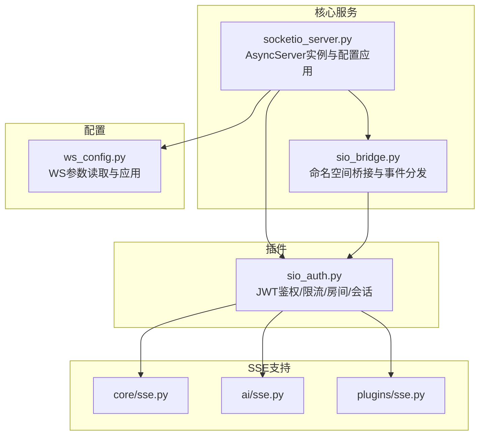
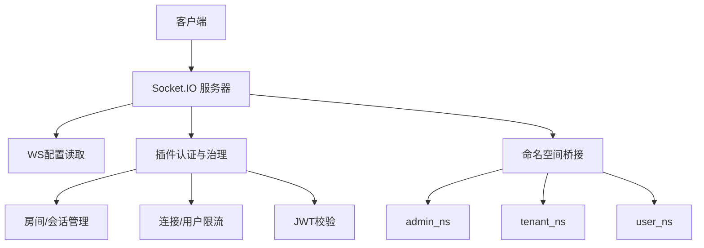
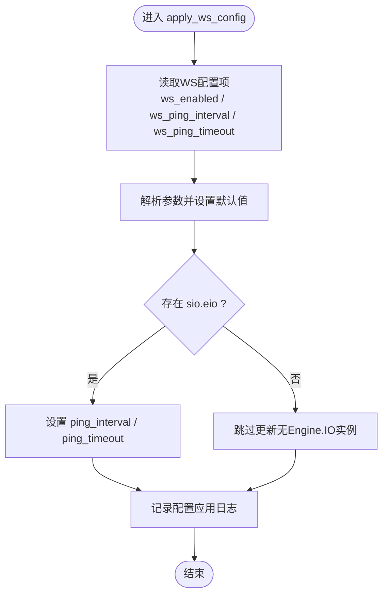
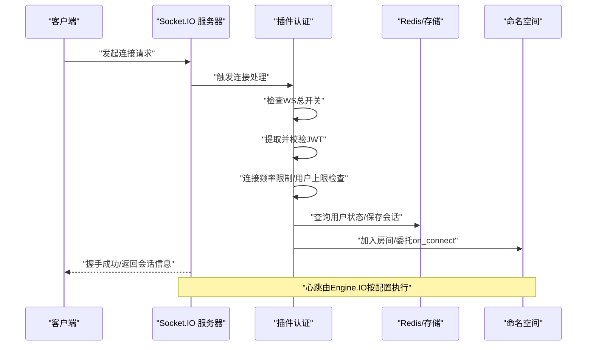
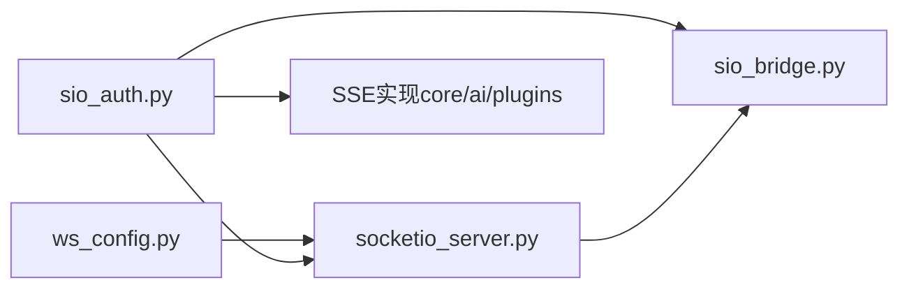

# WebSocket基础设施

<cite>
**本文引用的文件**
- [socketio_server.py](file://backend/app/core/socketio_server.py)
- [ws_config.py](file://backend/app/sio/ws_config.py)
- [sio_bridge.py](file://backend/app/core/sio_bridge.py)
- [sio_auth.py](file://backend/app/plugins/sio_auth.py)
- [sse.py](file://backend/app/core/sse.py)
- [sse.py](file://backend/app/ai/sse.py)
- [sse.py](file://backend/app/plugins/sse.py)
</cite>

## 目录
1. [引言](#引言)
2. [项目结构](#项目结构)
3. [核心组件](#核心组件)
4. [架构总览](#架构总览)
5. [详细组件分析](#详细组件分析)
6. [依赖关系分析](#依赖关系分析)
7. [性能考量](#性能考量)
8. [故障排查指南](#故障排查指南)
9. [结论](#结论)
10. [附录](#附录)

## 引言
本技术文档聚焦于后端WebSocket基础设施，系统性阐述Socket.IO服务器的初始化与配置、连接参数与网络监听机制；详尽描述连接建立流程、握手协议与心跳检测；覆盖连接池管理、并发连接限制与资源清理策略；并提供SSE（Server-Sent Events）与WebSocket的对比分析及使用场景建议。最后给出连接状态监控、断线重连与故障恢复的实现方案，并总结性能调优参数、内存管理与安全配置要点。

## 项目结构
WebSocket相关能力主要分布在以下模块：
- 核心服务层：Socket.IO服务器实例与生命周期管理
- 配置层：WS开关、心跳参数等运行时配置读取
- 网桥层：与业务命名空间的桥接与事件分发
- 插件层：认证鉴权、连接速率限制、房间管理与会话保存
- SSE支持：服务端推送能力（与WebSocket对比）

图表来源
- [socketio_server.py:46-87](file://backend/app/core/socketio_server.py#L46-L87)
- [ws_config.py](file://backend/app/sio/ws_config.py)
- [sio_bridge.py](file://backend/app/core/sio_bridge.py)
- [sio_auth.py:95-126](file://backend/app/plugins/sio_auth.py#L95-L126)
- [sse.py](file://backend/app/core/sse.py)
- [sse.py](file://backend/app/ai/sse.py)
- [sse.py](file://backend/app/plugins/sse.py)

章节来源
- [socketio_server.py:46-87](file://backend/app/core/socketio_server.py#L46-L87)
- [ws_config.py](file://backend/app/sio/ws_config.py)
- [sio_bridge.py](file://backend/app/core/sio_bridge.py)
- [sio_auth.py:95-126](file://backend/app/plugins/sio_auth.py#L95-L126)
- [sse.py](file://backend/app/core/sse.py)
- [sse.py](file://backend/app/ai/sse.py)
- [sse.py](file://backend/app/plugins/sse.py)

## 核心组件
- Socket.IO服务器实例与生命周期
  - 全局AsyncServer实例管理，提供配置应用与运行时参数调整接口。
  - 在应用生命周期启动阶段完成数据库与缓存初始化后，动态更新Engine.IO的心跳参数（ping_interval/ping_timeout），仅对新连接生效。
- WS配置读取与应用
  - 通过统一配置读取函数获取ws_enabled、ws_ping_interval、ws_ping_timeout等参数，并记录日志。
- 插件认证与连接治理
  - 连接总开关、JWT校验、连接频率限制、单用户最大连接数限制、查询用户状态、保存会话与加入房间、委托插件on_connect处理。
- 网桥与命名空间
  - 将业务命名空间接入Socket.IO，负责事件路由与转发。

章节来源
- [socketio_server.py:46-87](file://backend/app/core/socketio_server.py#L46-L87)
- [sio_auth.py:95-126](file://backend/app/plugins/sio_auth.py#L95-L126)
- [sio_bridge.py](file://backend/app/core/sio_bridge.py)

## 架构总览
WebSocket基础设施采用“服务+配置+插件+桥接”的分层设计：
- 服务层：维护AsyncServer实例，提供配置应用与运行时参数调整。
- 配置层：集中读取WS运行参数，按需下发至Engine.IO。
- 插件层：在连接建立前进行鉴权与治理，建立会话并加入房间，必要时委托插件处理。
- 桥接层：将业务命名空间事件与Socket.IO连接生命周期打通。

图表来源
- [socketio_server.py:46-87](file://backend/app/core/socketio_server.py#L46-L87)
- [ws_config.py](file://backend/app/sio/ws_config.py)
- [sio_auth.py:95-126](file://backend/app/plugins/sio_auth.py#L95-L126)
- [sio_bridge.py](file://backend/app/core/sio_bridge.py)

## 详细组件分析

### Socket.IO服务器与配置应用
- 初始化与全局实例
  - 提供获取全局AsyncServer实例的方法，便于各模块共享同一服务器实例。
- 配置应用流程
  - 在生命周期启动阶段调用配置应用函数，从平台配置读取WS相关参数。
  - 动态修改Engine.IO的ping_interval与ping_timeout属性，仅影响新连接的心跳行为。
  - 记录配置应用结果的日志，异常时输出警告信息。

图表来源
- [socketio_server.py:51-87](file://backend/app/core/socketio_server.py#L51-L87)

章节来源
- [socketio_server.py:46-87](file://backend/app/core/socketio_server.py#L46-L87)

### 连接建立与握手协议
- 握手与认证流程
  - 连接建立前执行总开关检查、JWT提取与校验、连接频率限制、单用户连接上限检查、用户有效性校验、会话保存与房间加入、可选的插件on_connect委托。
- 心跳检测机制
  - 通过配置应用函数动态设置Engine.IO的心跳间隔与超时，保障新连接的健康监测。
- 断线与清理
  - 插件层负责会话保存与房间管理，结合业务命名空间事件，实现断线后的状态恢复与资源回收。

图表来源
- [sio_auth.py:95-126](file://backend/app/plugins/sio_auth.py#L95-L126)
- [socketio_server.py:51-87](file://backend/app/core/socketio_server.py#L51-L87)

章节来源
- [sio_auth.py:95-126](file://backend/app/plugins/sio_auth.py#L95-L126)
- [socketio_server.py:51-87](file://backend/app/core/socketio_server.py#L51-L87)

### 连接池管理、并发限制与资源清理
- 连接池与并发控制
  - 单用户最大连接数限制：在连接处理中读取配置并执行上限检查，超过阈值拒绝连接。
  - 连接频率限制：对短时间内重复连接请求进行限流，避免恶意或异常行为。
- 资源清理策略
  - 会话保存与房间管理：在连接建立时保存会话并在命名空间内加入房间，断开时清理房间与会话。
  - 插件on_connect委托：允许插件在连接建立后注册清理逻辑或订阅事件，确保资源释放。

章节来源
- [sio_auth.py:95-126](file://backend/app/plugins/sio_auth.py#L95-L126)

### SSE与WebSocket对比分析
- SSE（Server-Sent Events）
  - 单向推送：服务端向客户端持续推送事件流，适合通知、日志、增量数据等场景。
  - 实现位置：核心SSE、AI专用SSE、插件SSE分别服务于不同业务域。
- WebSocket
  - 双向通信：客户端与服务端可随时互相发送消息，适合实时交互、游戏、协作编辑等。
- 选择建议
  - SSE适用于“服务端到客户端”的单向推送，实现简单、资源占用低。
  - WebSocket适用于需要双向交互与低延迟响应的场景。

章节来源
- [sse.py](file://backend/app/core/sse.py)
- [sse.py](file://backend/app/ai/sse.py)
- [sse.py](file://backend/app/plugins/sse.py)

## 依赖关系分析
- 组件耦合与职责
  - socketio_server.py依赖ws_config.py读取运行参数，并通过sio.eio动态调整心跳。
  - sio_auth.py在连接建立前承担认证、限流、房间与会话管理职责，向上游插件与命名空间提供稳定连接。
  - sio_bridge.py负责命名空间桥接，承载业务事件流转。
- 外部依赖
  - 配置系统：统一读取WS参数。
  - 存储/缓存：用于用户状态查询、会话保存与房间管理。
  - 插件生态：扩展连接处理逻辑与业务事件。

图表来源
- [ws_config.py](file://backend/app/sio/ws_config.py)
- [socketio_server.py:46-87](file://backend/app/core/socketio_server.py#L46-L87)
- [sio_auth.py:95-126](file://backend/app/plugins/sio_auth.py#L95-L126)
- [sio_bridge.py](file://backend/app/core/sio_bridge.py)
- [sse.py](file://backend/app/core/sse.py)
- [sse.py](file://backend/app/ai/sse.py)
- [sse.py](file://backend/app/plugins/sse.py)

章节来源
- [ws_config.py](file://backend/app/sio/ws_config.py)
- [socketio_server.py:46-87](file://backend/app/core/socketio_server.py#L46-L87)
- [sio_auth.py:95-126](file://backend/app/plugins/sio_auth.py#L95-L126)
- [sio_bridge.py](file://backend/app/core/sio_bridge.py)
- [sse.py](file://backend/app/core/sse.py)
- [sse.py](file://backend/app/ai/sse.py)
- [sse.py](file://backend/app/plugins/sse.py)

## 性能考量
- 心跳参数调优
  - ping_interval：建议根据网络质量与客户端类型设置，过短增加CPU与带宽压力，过长可能误判掉线。
  - ping_timeout：应大于ping_interval以容忍瞬时抖动，避免频繁断线。
- 并发与连接治理
  - 单用户最大连接数限制：防止资源滥用与DoS。
  - 连接频率限制：降低高频重连带来的瞬时压力。
- 内存与资源管理
  - 会话与房间的生命周期管理：连接断开后及时清理，避免内存泄漏。
  - 插件on_connect中的订阅与定时器应在断开时取消。
- SSE与WebSocket的选择
  - SSE在单向推送场景下更轻量，可减少连接数与资源消耗；WebSocket在双向交互场景下更具优势。

## 故障排查指南
- 连接被拒绝
  - 检查WS总开关是否开启；确认JWT是否正确传递且未过期；核对连接频率限制与单用户上限。
- 心跳失败导致断线
  - 检查ping_interval与ping_timeout配置是否合理；观察网络延迟与丢包情况。
- 会话与房间异常
  - 确认会话保存与房间加入逻辑是否正常执行；查看断线清理流程是否完整。
- 日志与追踪
  - 关注配置应用日志与连接处理日志，定位异常发生阶段。

章节来源
- [socketio_server.py:51-87](file://backend/app/core/socketio_server.py#L51-L87)
- [sio_auth.py:95-126](file://backend/app/plugins/sio_auth.py#L95-L126)

## 结论
该WebSocket基础设施以Socket.IO为核心，结合统一配置、插件认证与网桥机制，实现了可配置的心跳、严格的连接治理与灵活的命名空间扩展。配合SSE能力，可在不同场景下选择最优的实时通信方案。通过合理的参数调优与资源管理策略，可有效提升系统稳定性与性能表现。

## 附录
- 关键实现路径参考
  - 配置应用与心跳参数调整：[socketio_server.py:51-87](file://backend/app/core/socketio_server.py#L51-L87)
  - 连接总开关、JWT校验、限流与房间管理：[sio_auth.py:95-126](file://backend/app/plugins/sio_auth.py#L95-L126)
  - WS参数读取入口：[ws_config.py](file://backend/app/sio/ws_config.py)
  - 命名空间桥接与事件分发：[sio_bridge.py](file://backend/app/core/sio_bridge.py)
  - SSE能力（核心/AI/插件）：[sse.py](file://backend/app/core/sse.py)、[sse.py](file://backend/app/ai/sse.py)、[sse.py](file://backend/app/plugins/sse.py)