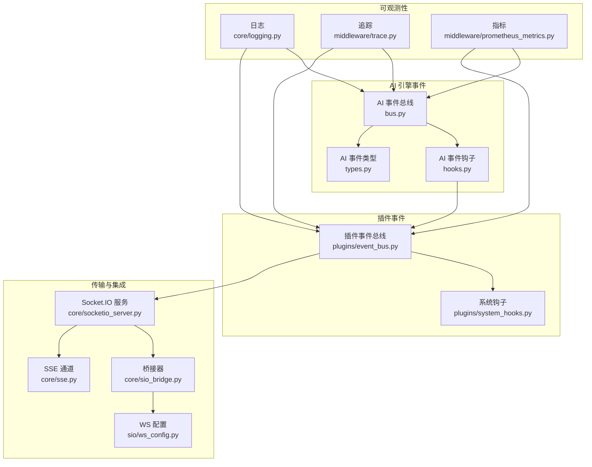
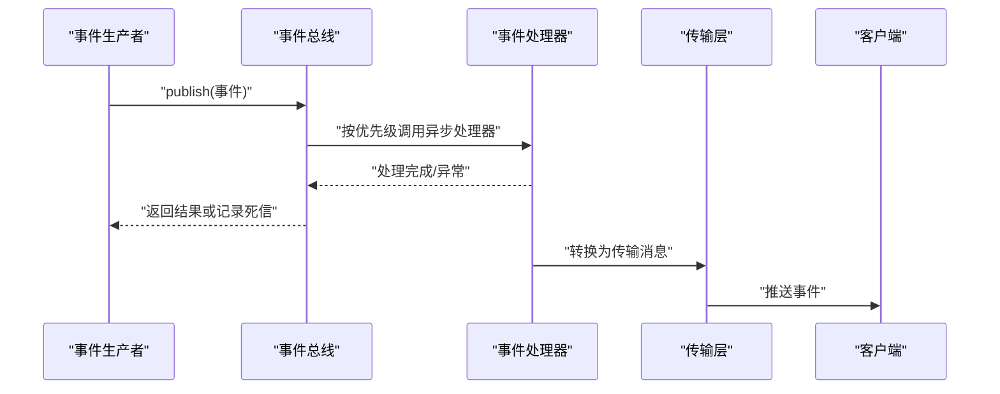
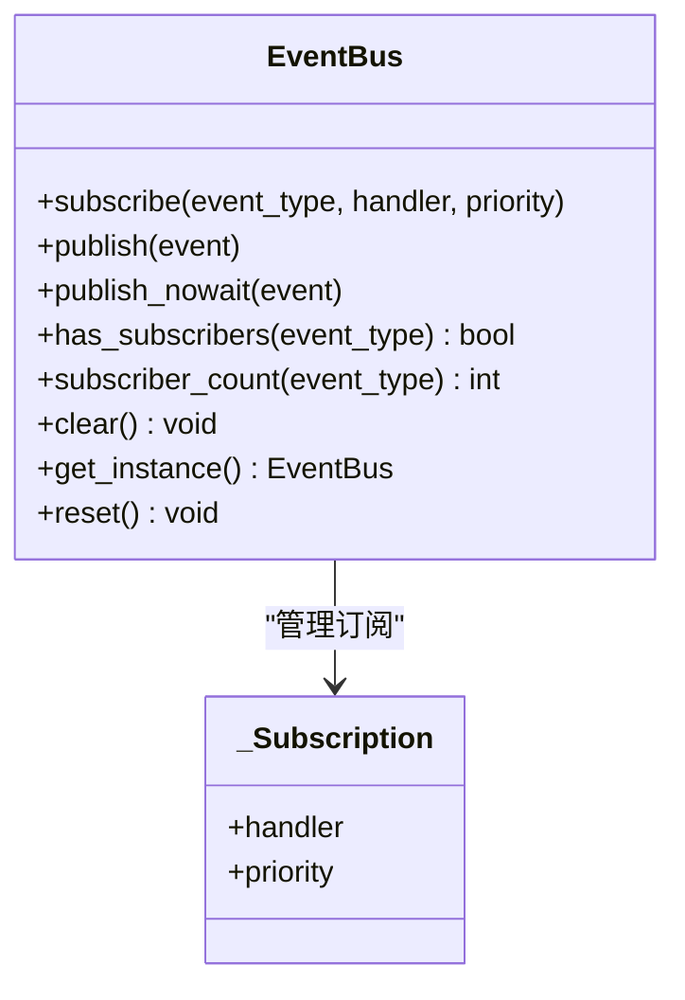
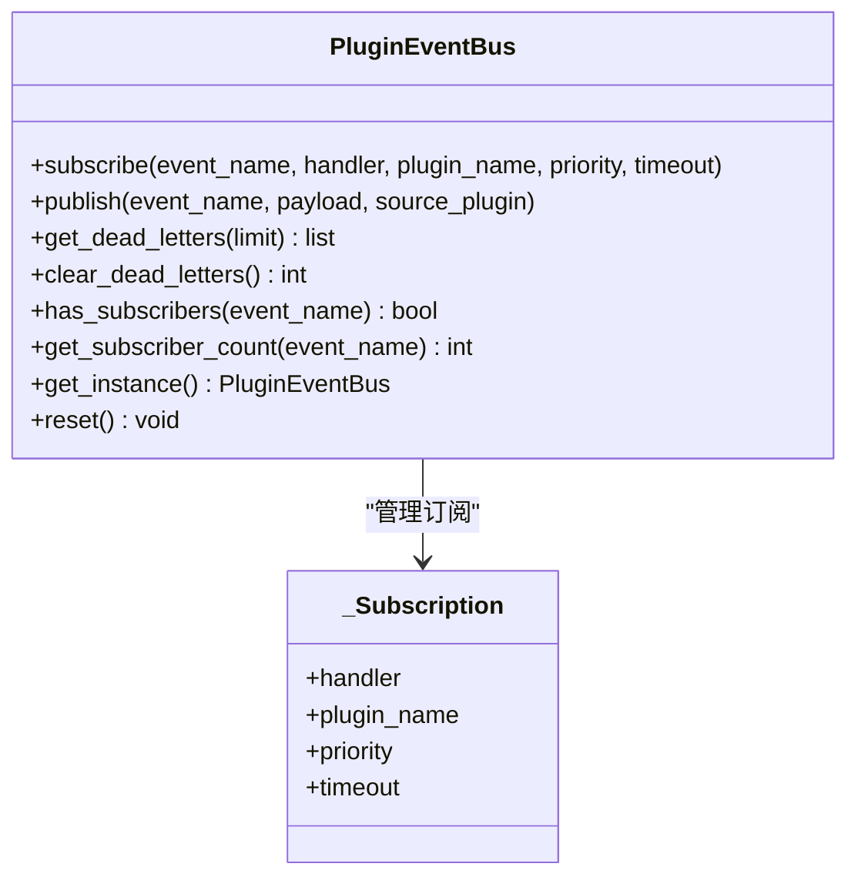
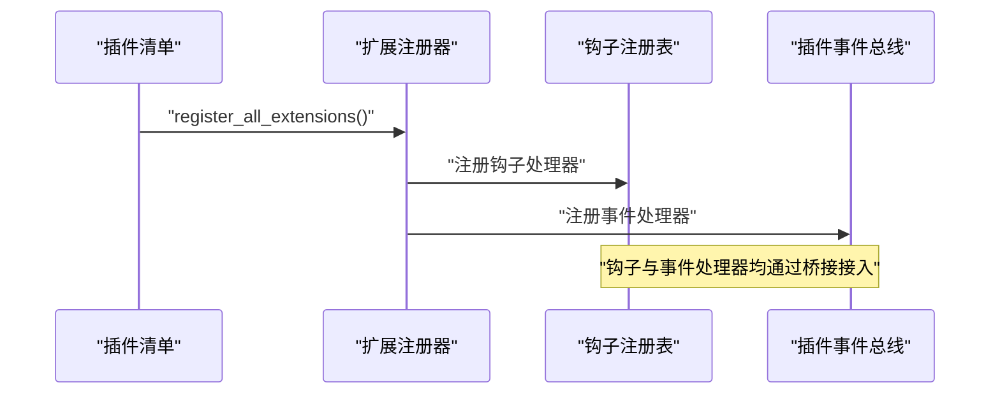
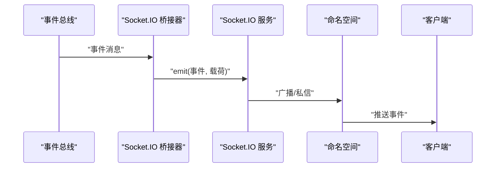
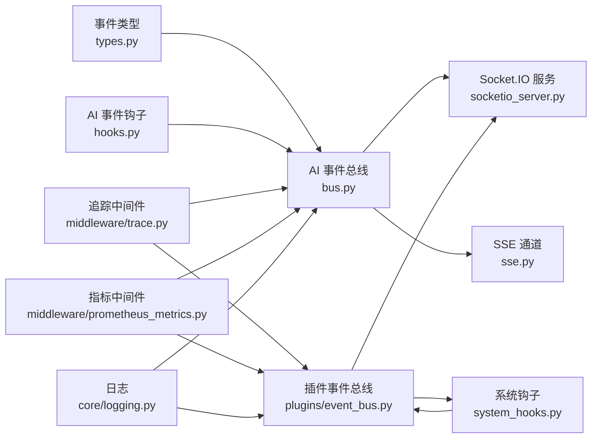

# 事件系统

<cite>
**本文引用的文件**
- [bus.py](file://backend/app/ai/events/bus.py)
- [types.py](file://backend/app/ai/events/types.py)
- [hooks.py](file://backend/app/ai/events/hooks.py)
- [event_bus.py](file://backend/app/plugins/event_bus.py)
- [system_hooks.py](file://backend/app/plugins/system_hooks.py)
- [test_plugin_event_hook_runtime.py](file://backend/tests/test_plugin_event_hook_runtime.py)
- [socketio_server.py](file://backend/app/core/socketio_server.py)
- [sio_bridge.py](file://backend/app/core/sio_bridge.py)
- [sse.py](file://backend/app/core/sse.py)
- [sio_auth.py](file://backend/app/plugins/sio_auth.py)
- [ws_config.py](file://backend/app/sio/ws_config.py)
- [notification_seeds.py](file://backend/app/sio/notification_seeds.py)
- [presence.py](file://backend/app/sio/presence.py)
- [tenant_ns.py](file://backend/app/sio/tenant_ns.py)
- [user_ns.py](file://backend/app/sio/user_ns.py)
- [admin_ns.py](file://backend/app/sio/admin_ns.py)
- [logging.py](file://backend/app/core/logging.py)
- [trace.py](file://backend/app/middleware/trace.py)
- [prometheus_metrics.py](file://backend/app/middleware/prometheus_metrics.py)
- [retry_service.py](file://backend/app/ai/retry_service.py)
- [failover.py](file://backend/app/ai/failover.py)
- [quota_manager.py](file://backend/app/ai/quota_manager.py)
- [quota_usage_tracker.py](file://backend/app/ai/quota_usage_tracker.py)
</cite>

## 目录
1. [简介](#简介)
2. [项目结构](#项目结构)
3. [核心组件](#核心组件)
4. [架构总览](#架构总览)
5. [详细组件分析](#详细组件分析)
6. [依赖关系分析](#依赖关系分析)
7. [性能考虑](#性能考虑)
8. [故障排查指南](#故障排查指南)
9. [结论](#结论)
10. [附录](#附录)

## 简介
本文件为事件系统的完整技术文档，覆盖事件总线架构、事件发布订阅模式、消息传递机制、事件类型与载荷规范、序列化策略、事件钩子注册与触发、执行顺序、事件追踪与日志、性能监控、去重与幂等、错误重试、事件过滤与权限校验、以及与 WebSocket 的集成与状态同步策略。文档面向不同层次读者，既提供高层概览也包含代码级细节与可视化图示。

## 项目结构
事件系统由两套并行但协同的机制构成：
- AI 引擎内部事件总线：提供进程内异步发布/订阅能力，支持优先级与错误隔离。
- 插件事件总线：面向插件生态，提供命名事件、超时控制、死信队列、失败扩展记录等企业级特性。

此外，系统通过中间件实现追踪与指标采集，并通过 Socket.IO 与 SSE 将事件推送至前端，形成端到端的事件驱动架构。

图表来源
- [bus.py:33-223](file://backend/app/ai/events/bus.py#L33-L223)
- [types.py](file://backend/app/ai/events/types.py)
- [hooks.py](file://backend/app/ai/events/hooks.py)
- [event_bus.py](file://backend/app/plugins/event_bus.py)
- [system_hooks.py](file://backend/app/plugins/system_hooks.py)
- [socketio_server.py](file://backend/app/core/socketio_server.py)
- [sio_bridge.py](file://backend/app/core/sio_bridge.py)
- [sse.py](file://backend/app/core/sse.py)
- [ws_config.py](file://backend/app/sio/ws_config.py)
- [logging.py](file://backend/app/core/logging.py)
- [trace.py](file://backend/app/middleware/trace.py)
- [prometheus_metrics.py](file://backend/app/middleware/prometheus_metrics.py)

章节来源
- [bus.py:1-223](file://backend/app/ai/events/bus.py#L1-L223)
- [event_bus.py](file://backend/app/plugins/event_bus.py)

## 核心组件
- AI 事件总线：提供线程安全单例、按优先级排序的异步订阅、错误隔离、通配符订阅、后台任务管理与清理。
- 插件事件总线：提供命名事件、超时控制、死信队列、失败扩展记录、订阅统计与清空。
- 事件类型与载荷：统一的 BaseEvent 抽象与具体事件模型，支持序列化与反序列化。
- 事件钩子：在特定生命周期点注入处理逻辑，支持优先级与上下文传递。
- 传输层：Socket.IO 与 SSE 将事件推送到客户端，支持命名空间与权限控制。
- 可观测性：日志、追踪上下文传播、Prometheus 指标采集。

章节来源
- [bus.py:33-223](file://backend/app/ai/events/bus.py#L33-L223)
- [event_bus.py](file://backend/app/plugins/event_bus.py)
- [types.py](file://backend/app/ai/events/types.py)
- [hooks.py](file://backend/app/ai/events/hooks.py)
- [socketio_server.py](file://backend/app/core/socketio_server.py)
- [sse.py](file://backend/app/core/sse.py)

## 架构总览
事件系统采用“事件生成 → 事件总线 → 处理器 → 传输 → 客户端”的链路。AI 引擎内部事件与插件生态事件并行运行，通过钩子与插件事件总线实现跨模块解耦。

图表来源
- [bus.py:140-182](file://backend/app/ai/events/bus.py#L140-L182)
- [event_bus.py](file://backend/app/plugins/event_bus.py)
- [socketio_server.py](file://backend/app/core/socketio_server.py)

## 详细组件分析

### AI 事件总线（进程内）
- 单例模式与线程安全：通过锁保护实例创建，避免并发重复初始化。
- 订阅与优先级：订阅记录包含处理器与优先级，按数值升序排序，数值越小越先执行。
- 错误隔离：单个处理器异常不会影响其他处理器；后台 fire-and-forget 任务确保执行不被 GC 回收。
- 通配符订阅：可订阅 BaseEvent 接收所有事件类型。
- 背景任务管理：维护后台任务集合并在完成后清理，避免资源泄漏。

图表来源
- [bus.py:33-223](file://backend/app/ai/events/bus.py#L33-L223)

章节来源
- [bus.py:33-223](file://backend/app/ai/events/bus.py#L33-L223)

### 插件事件总线（插件生态）
- 命名事件：事件以字符串名称标识，便于跨插件通信。
- 超时控制：每个订阅可配置超时，避免阻塞主流程。
- 死信队列：处理器异常或超时的事件进入死信队列，支持查询与清空。
- 失败扩展记录：记录失败扩展及其原因，便于运维诊断。
- 订阅统计：提供订阅数量查询与清空能力，便于调试与测试。

图表来源
- [event_bus.py](file://backend/app/plugins/event_bus.py)
- [event_bus.py:318-334](file://backend/app/plugins/event_bus.py#L318-L334)

章节来源
- [event_bus.py](file://backend/app/plugins/event_bus.py)

### 事件类型与载荷
- 统一基类：所有事件继承自 BaseEvent，保证类型一致性与序列化兼容。
- 载荷格式：事件携带结构化数据，建议遵循最小必要原则，避免过大数据导致序列化开销。
- 序列化策略：建议使用 JSON 兼容格式，必要时引入二进制序列化以降低体积与提升性能。

章节来源
- [types.py](file://backend/app/ai/events/types.py)

### 事件钩子注册与触发
- 注册：通过清单（manifest）声明钩子点与处理器路径，扩展注册器动态加载。
- 触发：在指定生命周期点调用钩子，支持上下文参数传递与返回值收集。
- 执行顺序：按优先级排序，数值越小越先执行；同一优先级内顺序未定义，应避免依赖顺序。
- 测试验证：通过单元测试确保清单 → 注册器 → 钩子注册表 → 插件事件总线桥接链路完整。

图表来源
- [test_plugin_event_hook_runtime.py:54-95](file://backend/tests/test_plugin_event_hook_runtime.py#L54-L95)
- [system_hooks.py](file://backend/app/plugins/system_hooks.py)

章节来源
- [hooks.py](file://backend/app/ai/events/hooks.py)
- [system_hooks.py](file://backend/app/plugins/system_hooks.py)
- [test_plugin_event_hook_runtime.py:1-95](file://backend/tests/test_plugin_event_hook_runtime.py#L1-L95)

### 事件追踪、日志记录与性能监控
- 追踪上下文：中间件负责生成与传播追踪 ID，贯穿请求链路，便于问题定位。
- 日志：事件总线与插件事件总线均使用统一日志门面，输出关键事件与异常信息。
- 性能指标：Prometheus 中间件采集请求耗时、吞吐量等指标，结合事件处理耗时进行综合评估。

章节来源
- [trace.py](file://backend/app/middleware/trace.py)
- [logging.py](file://backend/app/core/logging.py)
- [prometheus_metrics.py](file://backend/app/middleware/prometheus_metrics.py)

### 错误重试与死信处理
- 错误隔离：AI 事件总线对单个处理器异常进行隔离，不影响其他处理器。
- 死信队列：插件事件总线提供死信队列，记录失败事件与原因，支持查询与清空。
- 重试策略：建议在业务层基于死信队列实现指数退避重试，避免雪崩效应。

章节来源
- [bus.py:140-182](file://backend/app/ai/events/bus.py#L140-L182)
- [event_bus.py](file://backend/app/plugins/event_bus.py)

### 事件过滤、权限验证与安全检查
- 权限控制：Socket.IO 命名空间与认证中间件确保只有授权用户可接收事件。
- 过滤策略：根据租户、用户、角色等维度对事件进行过滤，避免敏感信息泄露。
- 安全扫描：插件安全扫描与许可证校验保障事件来源可信。

章节来源
- [sio_auth.py](file://backend/app/plugins/sio_auth.py)
- [tenant_ns.py](file://backend/app/sio/tenant_ns.py)
- [user_ns.py](file://backend/app/sio/user_ns.py)
- [admin_ns.py](file://backend/app/sio/admin_ns.py)
- [security.py](file://backend/app/plugins/security.py)

### 与 WebSocket 的集成与状态同步
- Socket.IO 服务：提供命名空间隔离与房间管理，支持广播与私信。
- 桥接器：将事件总线消息转换为 Socket.IO 消息，按命名空间与房间分发。
- SSE：服务端推送事件，适合单向通知场景。
- 状态同步：通过通知种子与在线状态模块维护用户会话状态，确保事件送达与去重。

图表来源
- [sio_bridge.py](file://backend/app/core/sio_bridge.py)
- [socketio_server.py](file://backend/app/core/socketio_server.py)
- [sse.py](file://backend/app/core/sse.py)
- [notification_seeds.py](file://backend/app/sio/notification_seeds.py)
- [presence.py](file://backend/app/sio/presence.py)

章节来源
- [ws_config.py](file://backend/app/sio/ws_config.py)
- [sio_bridge.py](file://backend/app/core/sio_bridge.py)
- [socketio_server.py](file://backend/app/core/socketio_server.py)
- [sse.py](file://backend/app/core/sse.py)
- [notification_seeds.py](file://backend/app/sio/notification_seeds.py)
- [presence.py](file://backend/app/sio/presence.py)

## 依赖关系分析
事件系统各组件之间存在清晰的职责边界与依赖方向：

图表来源
- [types.py](file://backend/app/ai/events/types.py)
- [bus.py:33-223](file://backend/app/ai/events/bus.py#L33-L223)
- [hooks.py](file://backend/app/ai/events/hooks.py)
- [event_bus.py](file://backend/app/plugins/event_bus.py)
- [system_hooks.py](file://backend/app/plugins/system_hooks.py)
- [socketio_server.py](file://backend/app/core/socketio_server.py)
- [sse.py](file://backend/app/core/sse.py)
- [trace.py](file://backend/app/middleware/trace.py)
- [prometheus_metrics.py](file://backend/app/middleware/prometheus_metrics.py)
- [logging.py](file://backend/app/core/logging.py)

章节来源
- [bus.py:33-223](file://backend/app/ai/events/bus.py#L33-L223)
- [event_bus.py](file://backend/app/plugins/event_bus.py)

## 性能考虑
- 异步与并发：事件处理器均为异步协程，充分利用事件循环提升吞吐量。
- 优先级调度：通过优先级减少关键路径延迟，确保高优事件优先执行。
- 背景任务管理：避免 GC 回收导致的任务中断，提高可靠性。
- 序列化成本：建议对大载荷进行压缩或二进制编码，降低网络与存储开销。
- 指标采集：结合 Prometheus 与追踪中间件，持续监控事件处理耗时与失败率。

## 故障排查指南
- 查看死信队列：插件事件总线提供死信队列查询与清空接口，定位异常事件。
- 订阅统计：确认事件是否被正确订阅与触发，避免漏订阅导致的静默失败。
- 日志与追踪：结合追踪 ID 与日志输出，快速定位异常发生位置。
- 重试策略：基于死信队列实施指数退避重试，避免系统压力过大。

章节来源
- [event_bus.py](file://backend/app/plugins/event_bus.py)
- [logging.py](file://backend/app/core/logging.py)
- [trace.py](file://backend/app/middleware/trace.py)

## 结论
事件系统通过 AI 引擎内部事件总线与插件事件总线实现了从引擎内部到插件生态的全栈事件驱动架构。配合 Socket.IO/SSE 传输、统一追踪与指标采集、死信队列与重试策略，系统具备良好的可扩展性、可观测性与可靠性。建议在实际部署中结合业务场景优化序列化策略与重试参数，并完善权限过滤与安全扫描机制。

## 附录
- 事件类型定义：参考事件类型文件，确保事件字段最小化与可序列化。
- 钩子注册清单：通过插件清单声明钩子点与处理器路径，确保注册器正确加载。
- WebSocket 集成：通过桥接器与命名空间实现事件推送，注意权限与过滤策略。