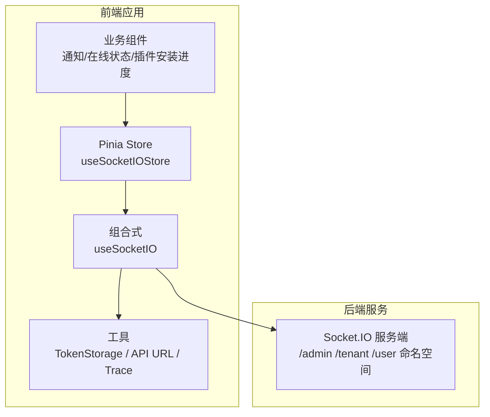
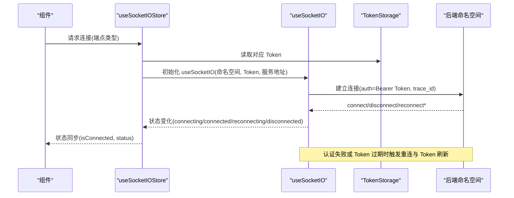
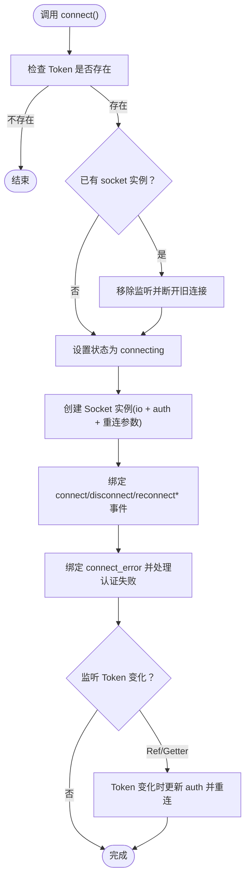
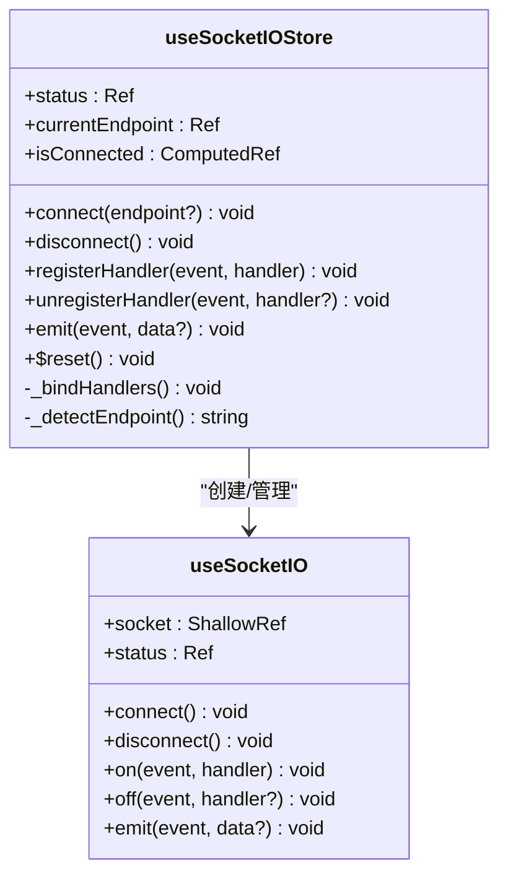
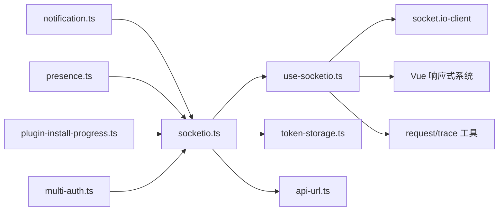

# 前端集成

<cite>
**本文引用的文件**
- [use-socketio.ts](file://frontend/apps/web-antd/src/composables/use-socketio.ts)
- [socketio.ts](file://frontend/apps/web-antd/src/store/shared/socketio.ts)
- [notification.ts](file://frontend/apps/web-antd/src/store/shared/notification.ts)
- [presence.ts](file://frontend/apps/web-antd/src/store/shared/presence.ts)
- [multi-auth.ts](file://frontend/apps/web-antd/src/store/shared/multi-auth.ts)
- [plugin-install-progress.ts](file://frontend/apps/web-antd/src/store/admin/plugin-install-progress.ts)
- [use-socketio.test.ts](file://frontend/apps/web-antd/src/composables/__tests__/use-socketio.test.ts)
- [use-preference-sync.test.ts](file://frontend/apps/web-antd/src/composables/__tests__/use-preference-sync.test.ts)
- [presence.test.ts](file://frontend/apps/web-antd/src/store/shared/__tests__/presence.test.ts)
- [use-preference-sync.ts](file://frontend/apps/web-antd/src/composables/use-preference-sync.ts)
- [token-storage.ts](file://frontend/apps/web-antd/src/store/shared/token-storage.ts)
- [api-url.ts](file://frontend/apps/web-antd/src/utils/api-url.ts)
- [request.ts](file://frontend/apps/web-antd/src/utils/request/index.ts)
- [trace.ts](file://frontend/apps/web-antd/src/utils/request/trace.ts)
</cite>

## 目录
1. [简介](#简介)
2. [项目结构](#项目结构)
3. [核心组件](#核心组件)
4. [架构总览](#架构总览)
5. [详细组件分析](#详细组件分析)
6. [依赖关系分析](#依赖关系分析)
7. [性能考虑](#性能考虑)
8. [故障排查指南](#故障排查指南)
9. [结论](#结论)
10. [附录](#附录)

## 简介
本技术指南面向前端实时通信集成，围绕基于 Vue 3 + Pinia 的 Socket.IO 组合式封装与全局状态管理进行系统化说明。内容覆盖：
- useSocketIO 组合式的使用方法、连接管理与状态同步
- 前端事件监听、消息处理与 UI 更新策略
- 连接状态的响应式管理、错误处理与自动重连机制
- 前端命名空间的使用方法、权限验证与会话维护
- 实时通知、消息推送与双向通信的前端实现示例
- 性能优化技巧、内存泄漏防护与浏览器兼容性处理
- 与 Vuex/Pinia 状态管理的集成方式与最佳实践

## 项目结构
前端采用多应用工作区，实时通信相关代码集中在 web-antd 应用中，核心文件包括：
- 组合式封装：useSocketIO.ts
- 全局 Socket.IO 状态管理：store/shared/socketio.ts
- 业务模块：notification.ts、presence.ts、multi-auth.ts、plugin-install-progress.ts
- 工具与配置：token-storage.ts、api-url.ts、request.ts、trace.ts
- 测试：use-socketio.test.ts、use-preference-sync.test.ts、presence.test.ts

图表来源
- [socketio.ts:28-249](file://frontend/apps/web-antd/src/store/shared/socketio.ts#L28-L249)
- [use-socketio.ts:117-340](file://frontend/apps/web-antd/src/composables/use-socketio.ts#L117-L340)

章节来源
- [socketio.ts:1-250](file://frontend/apps/web-antd/src/store/shared/socketio.ts#L1-L250)
- [use-socketio.ts:1-341](file://frontend/apps/web-antd/src/composables/use-socketio.ts#L1-L341)

## 核心组件
- useSocketIO 组合式：封装 socket.io-client 的连接生命周期、状态跟踪、事件监听/发送、Token 刷新重连与自动重连策略。
- useSocketIOStore：全局 Socket.IO 管理 Store，负责按端点类型（admin/tenant/user）选择命名空间、自动连接/断开、事件处理器注册/注销与派发。

章节来源
- [use-socketio.ts:117-340](file://frontend/apps/web-antd/src/composables/use-socketio.ts#L117-L340)
- [socketio.ts:28-249](file://frontend/apps/web-antd/src/store/shared/socketio.ts#L28-L249)

## 架构总览
整体架构以“组合式 + 全局 Store”的模式组织，业务组件通过 Store 或直接使用组合式接入 Socket.IO，确保：
- 连接状态在组件间共享与响应式更新
- 事件处理器集中注册与自动重连后自动绑定
- Token 变更触发安全重连，避免重复监听导致的内存泄漏

图表来源
- [socketio.ts:59-112](file://frontend/apps/web-antd/src/store/shared/socketio.ts#L59-L112)
- [use-socketio.ts:142-234](file://frontend/apps/web-antd/src/composables/use-socketio.ts#L142-L234)

## 详细组件分析

### useSocketIO 组合式
职责与特性：
- 连接管理：支持手动 connect/disconnect；可选 autoConnect；命名空间拼接与服务端路径配置。
- 状态管理：响应式 status（connecting/connected/reconnecting/disconnected），与 Socket.IO 事件映射。
- 事件系统：on/off/emit；emit 时自动注入 trace_id。
- Token 管理：支持字符串、Ref、getter 函数三种形式；Token 变更时自动断开并用新 Token 重连；多次认证失败后停止重连。
- 错误处理：区分 token_expired/authentication_failed 与其它连接错误；记录调试信息与 trace_id。
- 自动重连：指数退避与上限控制；仅 WebSocket 传输。

图表来源
- [use-socketio.ts:237-324](file://frontend/apps/web-antd/src/composables/use-socketio.ts#L237-L324)
- [use-socketio.ts:142-234](file://frontend/apps/web-antd/src/composables/use-socketio.ts#L142-L234)

章节来源
- [use-socketio.ts:117-340](file://frontend/apps/web-antd/src/composables/use-socketio.ts#L117-L340)

### useSocketIOStore 全局状态管理
职责与特性：
- 端点检测：根据路由路径推断当前端点类型（admin/tenant/user），映射到相应命名空间。
- 连接生命周期：登录后自动连接，登出时断开并清理 handlers。
- 事件处理器注册/注销：集中管理，重连后自动重新绑定，避免重复监听。
- 状态同步：将 useSocketIO 的状态同步到 Pinia，供组件响应式消费。
- 会话维护：通过 TokenStorage 获取最新 Token，确保认证有效。

图表来源
- [socketio.ts:28-249](file://frontend/apps/web-antd/src/store/shared/socketio.ts#L28-L249)
- [use-socketio.ts:117-340](file://frontend/apps/web-antd/src/composables/use-socketio.ts#L117-L340)

章节来源
- [socketio.ts:28-249](file://frontend/apps/web-antd/src/store/shared/socketio.ts#L28-L249)

### 业务模块集成示例

#### 实时通知
- 使用 useSocketIOStore.registerHandler 订阅通知事件，组件内通过 isConnected/status 响应式更新 UI。
- 发送侧：通过 emit 触发后端业务事件，接收侧在 on('notification', handler) 中处理。

章节来源
- [notification.ts:15-350](file://frontend/apps/web-antd/src/store/shared/notification.ts#L15-L350)
- [socketio.ts:144-191](file://frontend/apps/web-antd/src/store/shared/socketio.ts#L144-L191)

#### 在线状态
- 通过 registerHandler 订阅 presence:* 事件，结合 isConnected 控制 UI 展示。
- 登录/登出时调用 $reset 清理 handlers，避免重复绑定。

章节来源
- [presence.ts:27-180](file://frontend/apps/web-antd/src/store/shared/presence.ts#L27-L180)
- [socketio.ts:165-184](file://frontend/apps/web-antd/src/store/shared/socketio.ts#L165-L184)

#### 插件安装进度
- 在安装流程中使用 useSocketIOStore 订阅进度事件，emit 触发后端任务执行。
- 进度数据通过组件响应式更新，结合 loading 状态与错误提示。

章节来源
- [plugin-install-progress.ts:13-200](file://frontend/apps/web-antd/src/store/admin/plugin-install-progress.ts#L13-L200)

#### 多账号/多租户切换
- 登录成功后根据当前端点类型自动连接对应命名空间。
- Token 变更时触发重连，确保不同租户下的会话一致性。

章节来源
- [multi-auth.ts:370-390](file://frontend/apps/web-antd/src/store/shared/multi-auth.ts#L370-L390)
- [socketio.ts:59-112](file://frontend/apps/web-antd/src/store/shared/socketio.ts#L59-L112)

## 依赖关系分析
- useSocketIO 依赖 socket.io-client、Vue 响应式系统与请求追踪工具。
- useSocketIOStore 依赖 TokenStorage、API 地址工具与 useSocketIO。
- 业务模块（通知、在线状态、插件安装）依赖 useSocketIOStore 提供的统一连接与事件分发。

图表来源
- [use-socketio.ts:10-25](file://frontend/apps/web-antd/src/composables/use-socketio.ts#L10-L25)
- [socketio.ts:15-19](file://frontend/apps/web-antd/src/store/shared/socketio.ts#L15-L19)

章节来源
- [use-socketio.ts:10-25](file://frontend/apps/web-antd/src/composables/use-socketio.ts#L10-L25)
- [socketio.ts:15-19](file://frontend/apps/web-antd/src/store/shared/socketio.ts#L15-L19)

## 性能考虑
- 传输协议：强制使用 WebSocket，减少轮询开销。
- 自动重连：指数退避与上限控制，避免风暴重试。
- 事件去重：重连时先 off 再 on，防止重复监听导致的内存泄漏。
- 状态同步：通过 Pinia 计算属性 isConnected，降低不必要的渲染。
- Trace ID：统一注入 trace_id，便于后端日志关联与问题定位。

## 故障排查指南
常见问题与处理建议：
- 连接失败（认证失败/Token 过期）
  - 现象：状态停留在 reconnecting 或 disconnected，并输出警告日志。
  - 处理：确认 TokenStorage 中的 Token 是否正确；若多次认证失败，组合式会停止重连。
- 事件未收到
  - 现象：订阅事件无回调。
  - 处理：确认已调用 registerHandler；重连后会自动绑定，无需重复注册。
- 内存泄漏
  - 现象：组件卸载后仍收到事件回调。
  - 处理：确保调用 unregisterHandler 或在登出时调用 $reset 清理 handlers。
- 跨端点切换异常
  - 现象：从 admin/tenant/user 切换后仍绑定旧事件。
  - 处理：Store 内部会断开旧连接并重新绑定，确保只保留当前端点的 handlers。

章节来源
- [use-socketio.ts:190-231](file://frontend/apps/web-antd/src/composables/use-socketio.ts#L190-L231)
- [socketio.ts:165-184](file://frontend/apps/web-antd/src/store/shared/socketio.ts#L165-L184)

## 结论
通过 useSocketIO 与 useSocketIOStore 的组合，前端实现了：
- 响应式连接状态管理与自动重连
- 安全的 Token 刷新与认证失败处理
- 集中的事件处理器注册/注销与自动重绑
- 与 Pinia 的无缝集成与良好的可维护性

在实际业务中，建议遵循“Store 统一接入 + 组件响应式消费”的模式，配合严格的事件去重与清理策略，确保实时通信的稳定性与性能。

## 附录

### 前端命名空间与端点映射
- 端点类型：admin、tenant、user
- 命名空间：/admin、/tenant、/user
- 服务地址：通过 getAppApiUrl() 获取后端 API 地址，避免开发环境使用 window.location.origin 导致跨域问题。

章节来源
- [socketio.ts:21-26](file://frontend/apps/web-antd/src/store/shared/socketio.ts#L21-L26)
- [socketio.ts:94-99](file://frontend/apps/web-antd/src/store/shared/socketio.ts#L94-L99)

### 权限验证与会话维护
- Token 来源：TokenStorage.getToken(端点类型)
- 认证头：Bearer Token + trace_id
- 会话维护：Token 变更时自动断开并用新 Token 重连；登出时调用 $reset 清理

章节来源
- [socketio.ts:63-64](file://frontend/apps/web-antd/src/store/shared/socketio.ts#L63-L64)
- [socketio.ts:92-99](file://frontend/apps/web-antd/src/store/shared/socketio.ts#L92-L99)
- [use-socketio.ts:295-324](file://frontend/apps/web-antd/src/composables/use-socketio.ts#L295-L324)

### 与 Pinia 的集成最佳实践
- 将连接与事件处理集中在 useSocketIOStore，组件仅消费状态与触发动作
- 使用 computed/isConnected 进行条件渲染，避免在 disconnected 状态下发送事件
- 在组件卸载或路由切换时，及时 unregisterHandler 或调用 $reset

章节来源
- [socketio.ts:238-248](file://frontend/apps/web-antd/src/store/shared/socketio.ts#L238-L248)

### 浏览器兼容性与测试
- 传输协议：仅使用 WebSocket，不依赖轮询
- 测试覆盖：包含 useSocketIO 的单元测试与偏好同步测试，验证连接、事件与 Token 刷新行为

章节来源
- [use-socketio.test.ts:1-100](file://frontend/apps/web-antd/src/composables/__tests__/use-socketio.test.ts#L1-L100)
- [use-preference-sync.test.ts:1-100](file://frontend/apps/web-antd/src/composables/__tests__/use-preference-sync.test.ts#L1-L100)
- [presence.test.ts:1-100](file://frontend/apps/web-antd/src/store/shared/__tests__/presence.test.ts#L1-L100)