# 命名空间管理

<cite>
**本文档引用的文件**
- [backend/app/sio/admin_ns.py](file://backend/app/sio/admin_ns.py)
- [backend/app/sio/tenant_ns.py](file://backend/app/sio/tenant_ns.py)
- [backend/app/sio/user_ns.py](file://backend/app/sio/user_ns.py)
- [backend/app/sio/presence.py](file://backend/app/sio/presence.py)
- [backend/app/sio/ws_config.py](file://backend/app/sio/ws_config.py)
- [backend/app/core/sio_bridge.py](file://backend/app/core/sio_bridge.py)
- [backend/app/plugins/sio_auth.py](file://backend/app/plugins/sio_auth.py)
- [backend/app/middleware/tenant.py](file://backend/app/middleware/tenant.py)
- [backend/app/middleware/permission.py](file://backend/app/middleware/permission.py)
- [backend/app/middleware/audit_log.py](file://backend/app/middleware/audit_log.py)
</cite>

## 目录
1. [引言](#引言)
2. [项目结构](#项目结构)
3. [核心组件](#核心组件)
4. [架构概览](#架构概览)
5. [详细组件分析](#详细组件分析)
6. [依赖关系分析](#依赖关系分析)
7. [性能考虑](#性能考虑)
8. [故障排除指南](#故障排除指南)
9. [结论](#结论)

## 引言

本文档深入解析了 NovusAI 平台的命名空间管理系统，这是一个基于 Socket.IO 构建的多租户实时通信架构。系统通过三个独立的命名空间实现了严格的权限隔离：管理员命名空间(/admin)、租户管理员命名空间(/tenant)和普通用户命名空间(/user)。

该系统的核心设计理念是"租户隔离、权限分层、会话独立"。每个命名空间都有其独特的连接处理逻辑、事件路由机制和会话管理策略，确保不同级别的用户只能访问其授权范围内的资源和功能。

## 项目结构

命名空间管理系统的文件组织遵循清晰的层次结构：

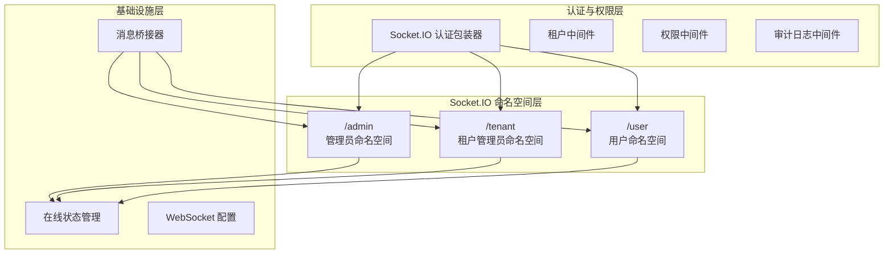

**图表来源**
- [backend/app/sio/admin_ns.py](file://backend/app/sio/admin_ns.py)
- [backend/app/sio/tenant_ns.py](file://backend/app/sio/tenant_ns.py)
- [backend/app/sio/user_ns.py](file://backend/app/sio/user_ns.py)
- [backend/app/sio/presence.py](file://backend/app/sio/presence.py)

**章节来源**
- [backend/app/sio/admin_ns.py](file://backend/app/sio/admin_ns.py)
- [backend/app/sio/tenant_ns.py](file://backend/app/sio/tenant_ns.py)
- [backend/app/sio/user_ns.py](file://backend/app/sio/user_ns.py)

## 核心组件

### 命名空间架构设计

系统采用三层命名空间架构，每层都有明确的职责边界：

1. **管理员命名空间 (/admin)**: 系统级管理功能，包括全局监控、系统配置、跨租户管理等
2. **租户管理员命名空间 (/tenant)**: 租户级管理功能，包括租户配置、用户管理、资源分配等
3. **用户命名空间 (/user)**: 普通用户功能，包括个人聊天、文件共享、设置管理等

### 权限边界模型

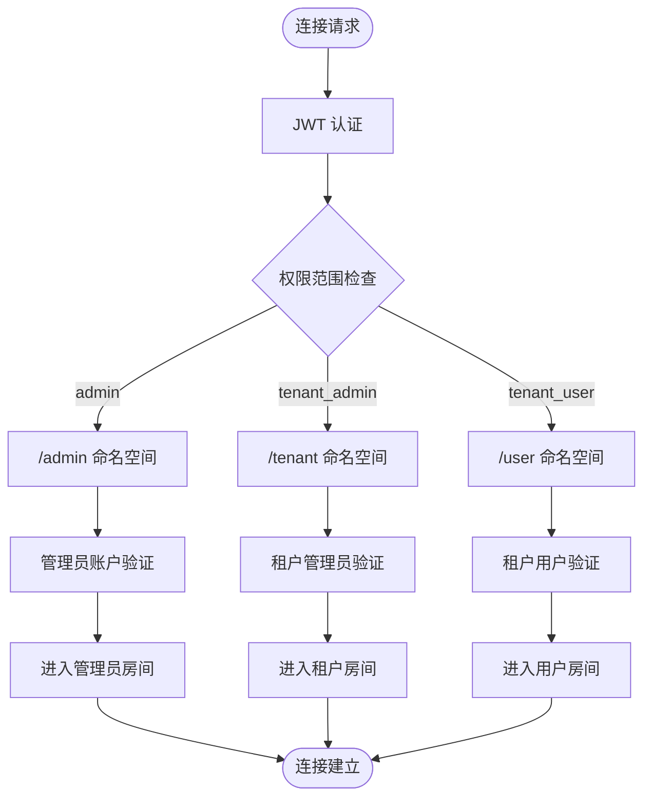

**图表来源**
- [backend/app/plugins/sio_auth.py](file://backend/app/plugins/sio_auth.py)
- [backend/app/sio/presence.py](file://backend/app/sio/presence.py)

**章节来源**
- [backend/app/plugins/sio_auth.py](file://backend/app/plugins/sio_auth.py)
- [backend/app/sio/presence.py](file://backend/app/sio/presence.py)

## 架构概览

### 整体系统架构

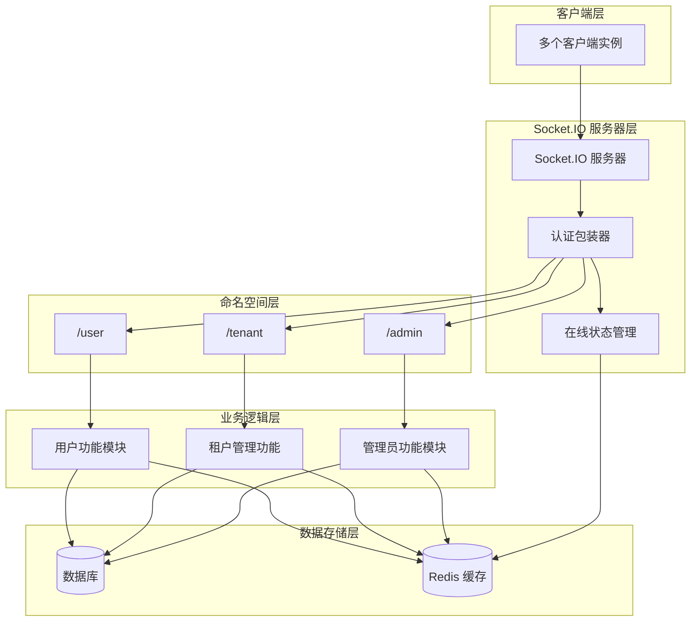

**图表来源**
- [backend/app/core/sio_bridge.py](file://backend/app/core/sio_bridge.py)
- [backend/app/plugins/sio_auth.py](file://backend/app/plugins/sio_auth.py)

### 事件路由机制

系统采用基于命名空间的事件路由机制，确保事件在正确的上下文中处理：

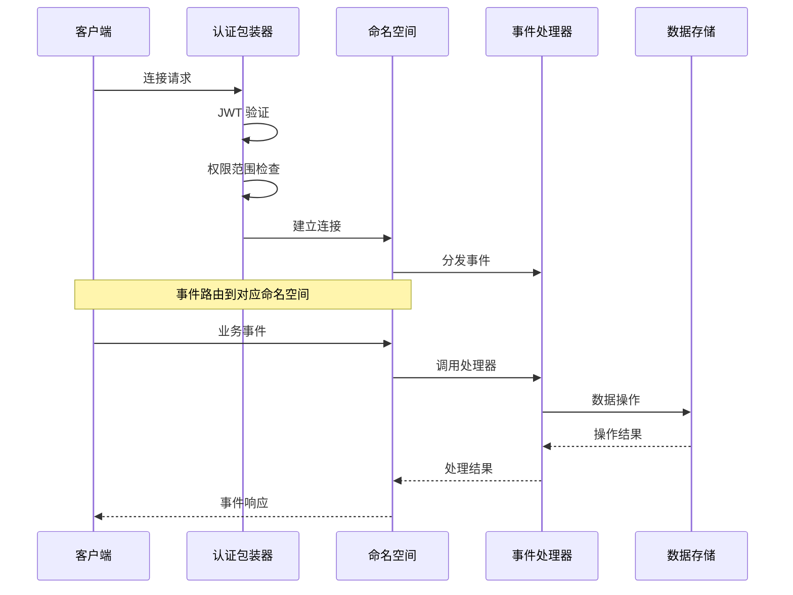

**图表来源**
- [backend/app/plugins/sio_auth.py](file://backend/app/plugins/sio_auth.py)
- [backend/app/sio/admin_ns.py](file://backend/app/sio/admin_ns.py)

## 详细组件分析

### 管理员命名空间 (/admin)

管理员命名空间负责系统级的管理和监控功能：

#### 连接处理逻辑

管理员连接需要经过多重验证：
1. **JWT 认证**: 验证管理员身份的有效性
2. **账户状态检查**: 确保管理员账户未被删除且处于激活状态
3. **权限范围验证**: 确认用户类型为 "admin"

#### 会话管理策略

管理员会话具有最高权限级别，可以访问所有租户的数据和系统配置。会话信息包括：
- 用户ID: 系统管理员唯一标识
- 用户类型: "admin"
- 租户ID: 系统级，通常为全局上下文
- 在线状态: 系统管理员在线状态

#### 房间管理功能

管理员命名空间支持以下房间类型：
- `admins`: 所有管理员的广播房间
- `system:monitor`: 系统监控专用房间
- `global:alerts`: 全局警报房间

**章节来源**
- [backend/app/sio/admin_ns.py](file://backend/app/sio/admin_ns.py)

### 租户管理员命名空间 (/tenant)

租户管理员命名空间提供租户级的管理能力：

#### 连接处理逻辑

租户管理员连接验证流程：
1. **JWT 认证**: 验证租户管理员身份
2. **租户关联检查**: 确认管理员与特定租户的关联关系
3. **账户状态验证**: 检查租户管理员的激活状态
4. **权限范围确认**: 验证用户类型为 "tenant_admin"

#### 会话管理策略

租户管理员会话包含租户上下文：
- 用户ID: 租户管理员唯一标识
- 用户类型: "tenant_admin"
- 租户ID: 管理员所属租户的ID
- 在线状态: 租户管理员在线状态

#### 房间管理功能

租户管理员房间包括：
- `tenant:{tenant_id}`: 特定租户的广播房间
- `admin:{tenant_id}`: 租户管理员专用房间
- `billing:{tenant_id}`: 租户计费相关房间

**章节来源**
- [backend/app/sio/tenant_ns.py](file://backend/app/sio/tenant_ns.py)

### 普通用户命名空间 (/user)

普通用户命名空间处理标准的用户交互：

#### 连接处理逻辑

用户连接验证步骤：
1. **JWT 认证**: 验证用户身份
2. **租户用户检查**: 确认用户属于有效租户
3. **账户状态验证**: 检查用户账户状态
4. **权限范围确认**: 验证用户类型为 "tenant_user"

#### 会话管理策略

用户会话维护个人上下文：
- 用户ID: 租户用户的唯一标识
- 用户类型: "tenant_user"
- 租户ID: 用户所属租户的ID
- 在线状态: 用户在线状态

#### 房间管理功能

用户房间类型：
- `user:{user_id}`: 用户个人房间
- `tenant:{tenant_id}`: 租户内广播房间
- `room:{room_id}`: 聊天室房间

**章节来源**
- [backend/app/sio/user_ns.py](file://backend/app/sio/user_ns.py)

### 在线状态跟踪系统

在线状态跟踪系统是命名空间管理的核心基础设施：

#### 用户存在性检测

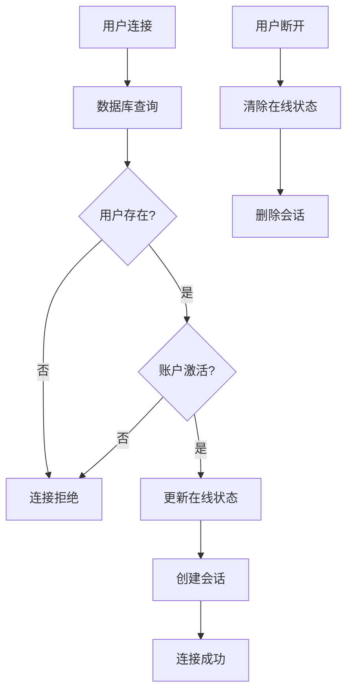

**图表来源**
- [backend/app/sio/presence.py](file://backend/app/sio/presence.py)

#### 在线状态存储

系统使用 Redis 实现高性能的在线状态存储：
- **在线状态键**: `presence:{namespace}:{user_id}`
- **会话信息**: 用户ID、租户ID、连接时间、最后活动时间
- **房间成员**: `room_members:{room_id}` 的集合操作

#### 并发访问控制

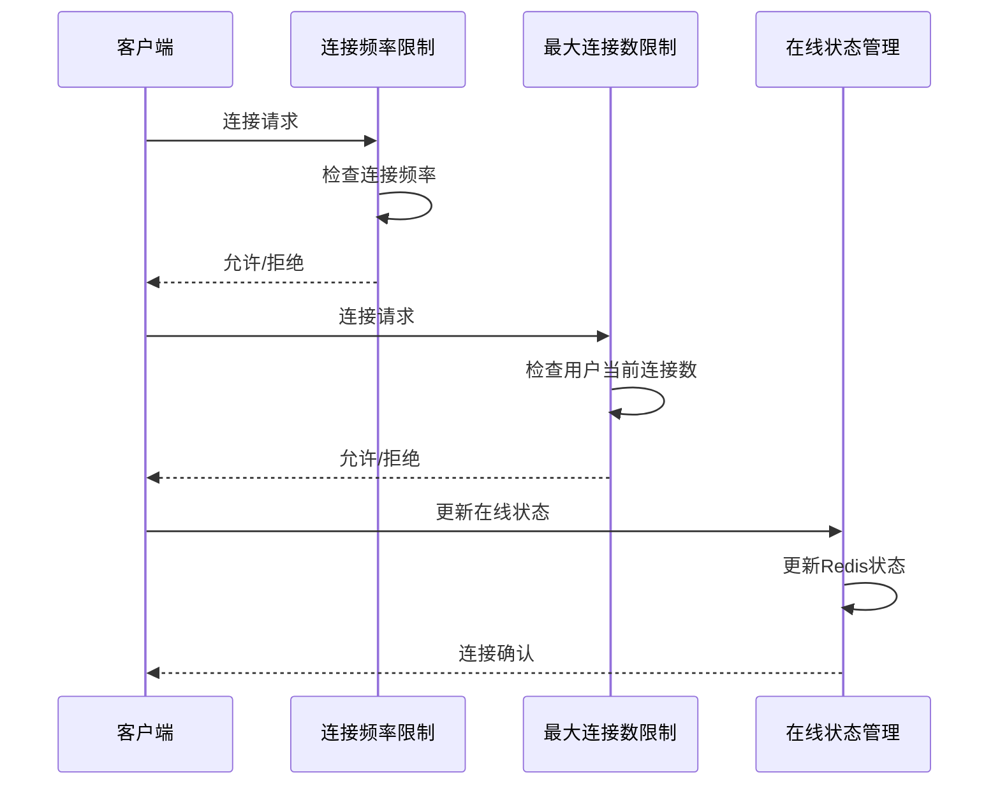

**图表来源**
- [backend/app/plugins/sio_auth.py](file://backend/app/plugins/sio_auth.py)
- [backend/app/sio/presence.py](file://backend/app/sio/presence.py)

**章节来源**
- [backend/app/sio/presence.py](file://backend/app/sio/presence.py)

### 动态创建与销毁流程

命名空间支持动态的生命周期管理：

#### 命名空间创建

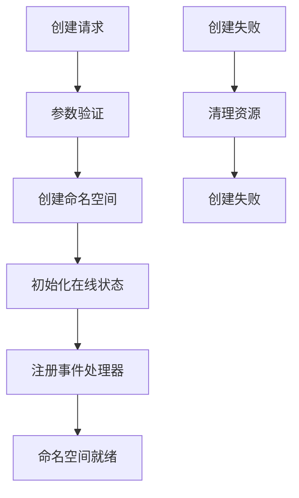

#### 命名空间销毁

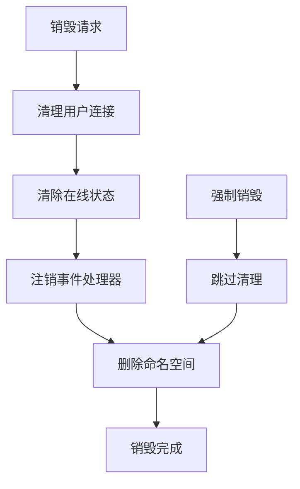

**章节来源**
- [backend/app/plugins/sio_auth.py](file://backend/app/plugins/sio_auth.py)

### 会话超时处理

系统实现多层次的会话超时保护机制：

#### 连接超时检测

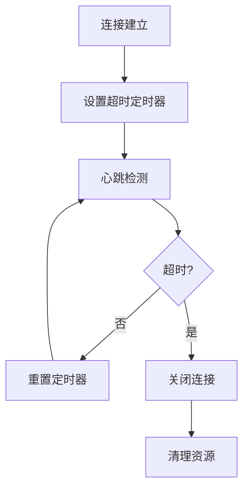

#### 会话状态同步

系统确保不同命名空间间的会话状态一致性：
- **跨命名空间同步**: 用户在不同命名空间的会话状态保持一致
- **租户隔离**: 不同租户的会话状态完全隔离
- **权限继承**: 用户权限在命名空间切换时正确传递

**章节来源**
- [backend/app/sio/ws_config.py](file://backend/app/sio/ws_config.py)

## 依赖关系分析

### 组件耦合度分析

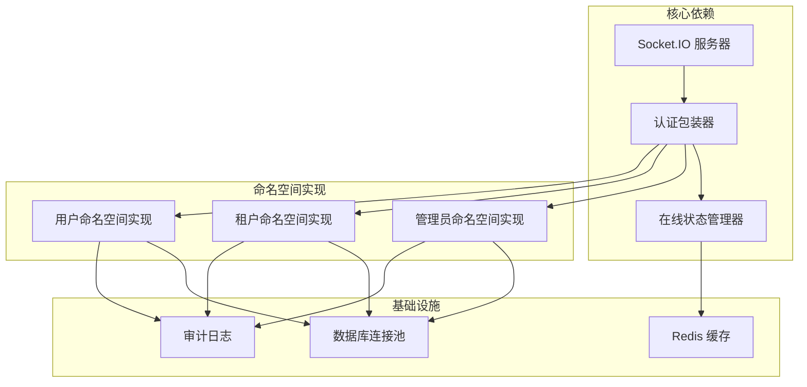

**图表来源**
- [backend/app/core/sio_bridge.py](file://backend/app/core/sio_bridge.py)
- [backend/app/plugins/sio_auth.py](file://backend/app/plugins/sio_auth.py)

### 外部依赖集成

系统集成了多个外部服务以增强功能：

#### 认证服务集成

- **JWT 令牌验证**: 使用标准 JWT 规范进行身份验证
- **租户域名校验**: 验证用户访问的租户域名有效性
- **权限范围映射**: 将 JWT claims 映射到系统权限级别

#### 数据存储集成

- **PostgreSQL**: 主要数据存储，用于持久化用户和租户信息
- **Redis**: 缓存和会话状态存储，提供高并发访问能力
- **审计日志存储**: 记录所有重要的系统操作

**章节来源**
- [backend/app/plugins/sio_auth.py](file://backend/app/plugins/sio_auth.py)
- [backend/app/middleware/tenant.py](file://backend/app/middleware/tenant.py)

## 性能考虑

### 并发处理优化

系统采用多种技术优化并发性能：

#### 连接池管理

- **数据库连接池**: 限制最大连接数，避免数据库过载
- **Redis 连接池**: 提供高效的缓存访问
- **线程池**: 处理异步任务，提高响应速度

#### 内存管理

- **会话数据缓存**: 将常用会话数据存储在内存中
- **事件处理器缓存**: 避免重复创建相同的处理器实例
- **对象复用**: 重用连接和资源对象

### 缓存策略

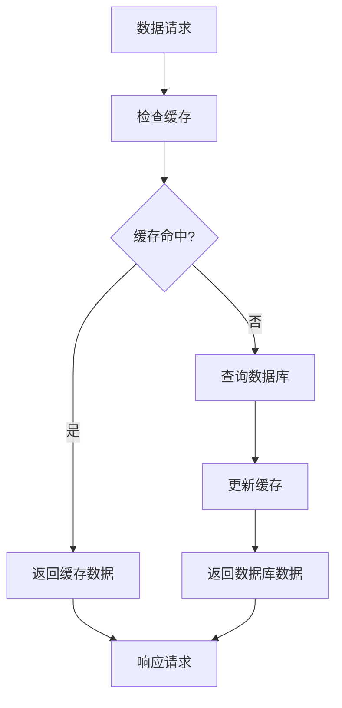

## 故障排除指南

### 常见问题诊断

#### 连接失败问题

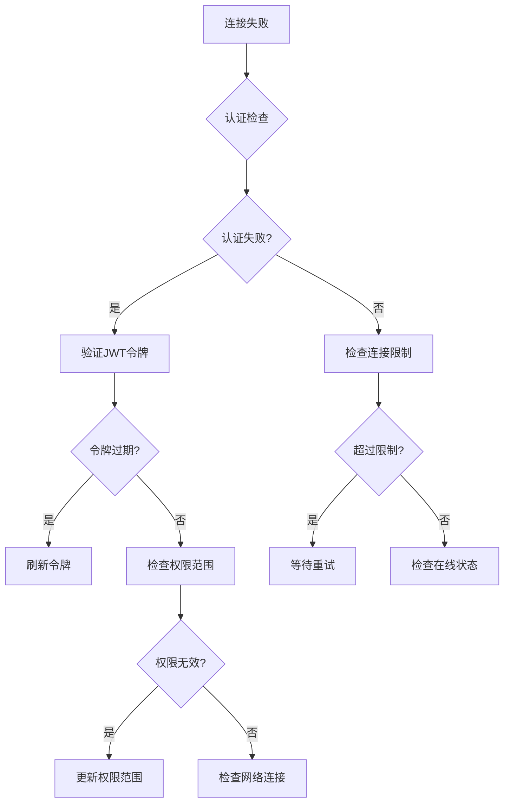

#### 性能问题排查

- **连接延迟过高**: 检查数据库连接池状态和Redis性能
- **内存使用异常**: 监控会话数量和缓存命中率
- **事件处理延迟**: 分析事件处理器的执行时间和阻塞情况

### 安全审计功能

系统内置完整的安全审计机制：

#### 审计日志记录

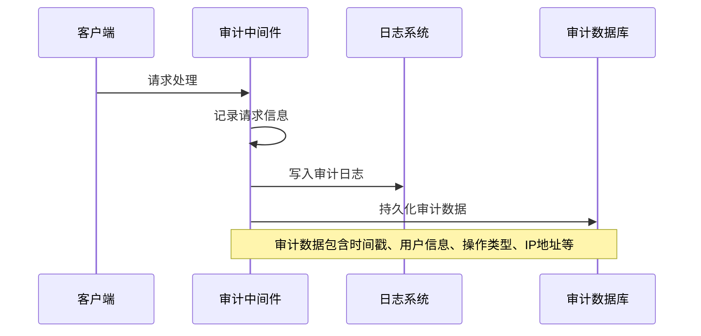

**图表来源**
- [backend/app/middleware/audit_log.py](file://backend/app/middleware/audit_log.py)

#### 安全事件监控

系统监控以下安全事件：
- **异常登录尝试**: 多次失败的认证尝试
- **权限升级尝试**: 用户试图获取超出权限的操作
- **数据访问异常**: 非法的数据访问模式
- **系统配置变更**: 关键系统设置的修改

**章节来源**
- [backend/app/middleware/audit_log.py](file://backend/app/middleware/audit_log.py)

## 结论

命名空间管理系统通过精心设计的架构实现了多租户环境下的严格权限隔离和高效实时通信。系统的核心优势包括：

1. **严格的权限边界**: 三个命名空间提供了清晰的权限层次结构
2. **高效的在线状态管理**: 基于Redis的高性能状态跟踪
3. **灵活的事件路由**: 支持复杂的房间管理和消息分发
4. **完善的审计功能**: 全面的安全监控和合规记录
5. **可扩展的架构**: 支持动态命名空间创建和销毁

该系统为大型多租户应用提供了可靠的实时通信基础，能够满足复杂的企业级应用场景需求。通过持续的性能优化和安全加固，系统将继续支持业务的快速发展。