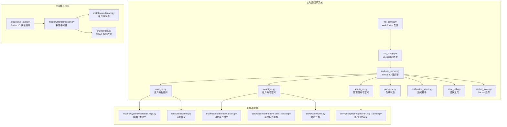
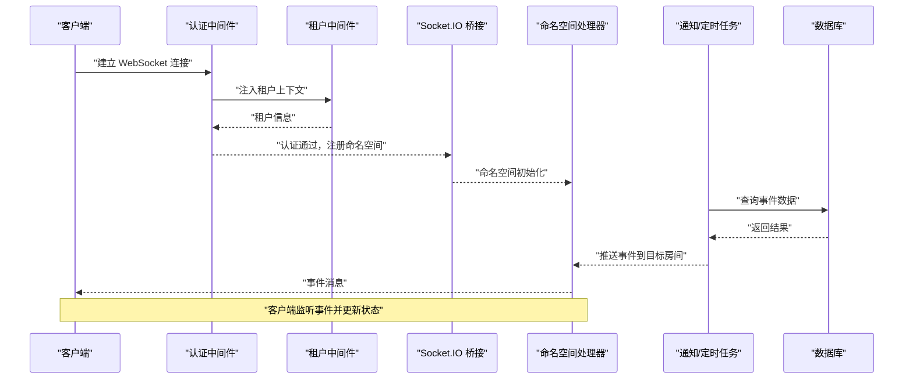
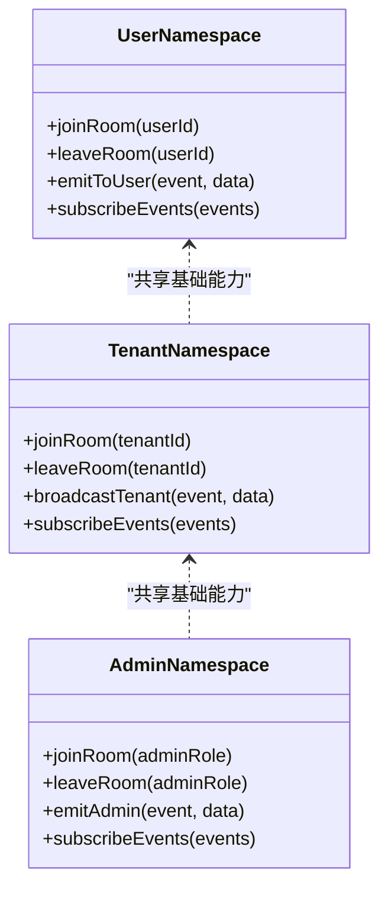
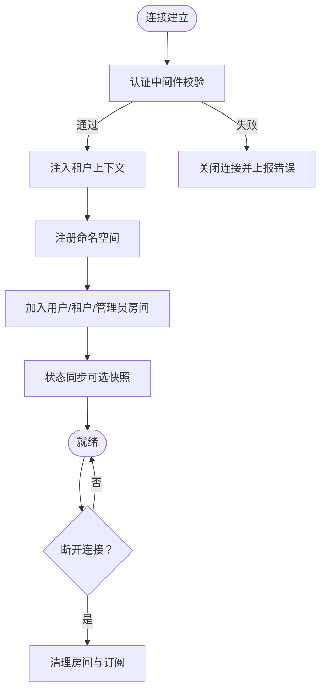
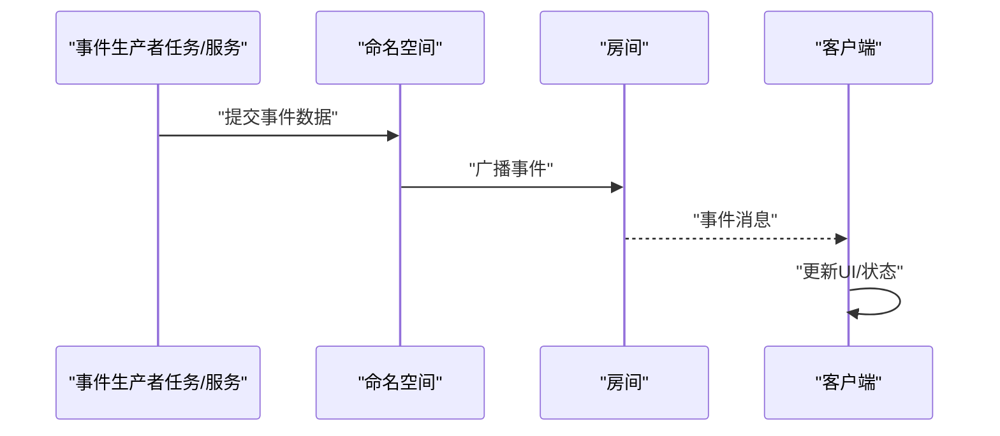
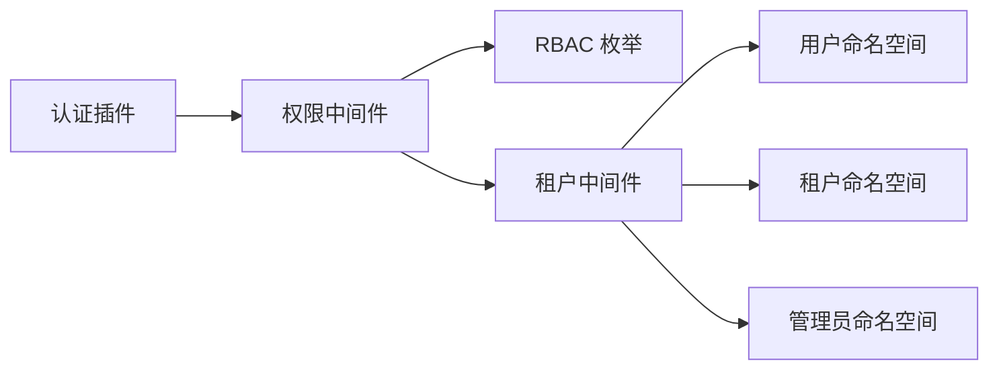
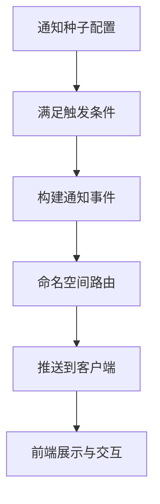
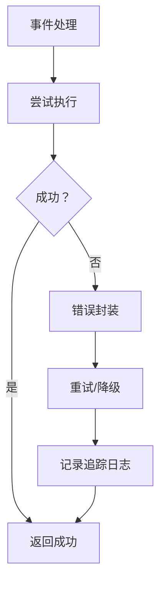
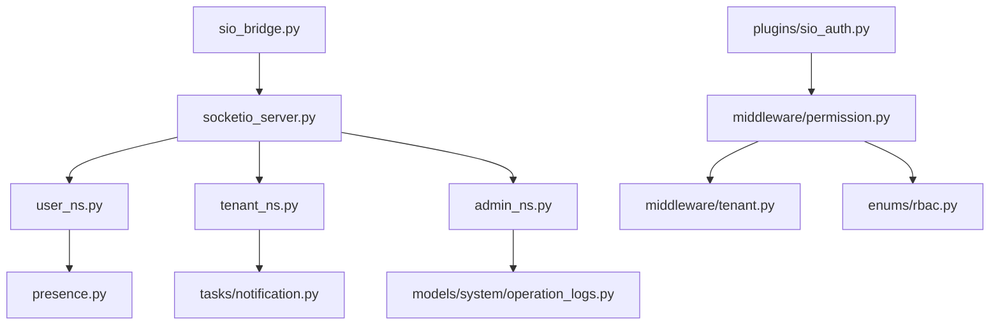

# 实时通信系统

<cite>
**本文引用的文件**
- [backend/app/sio/admin_ns.py](file://backend/app/sio/admin_ns.py)
- [backend/app/sio/tenant_ns.py](file://backend/app/sio/tenant_ns.py)
- [backend/app/sio/user_ns.py](file://backend/app/sio/user_ns.py)
- [backend/app/sio/ws_config.py](file://backend/app/sio/ws_config.py)
- [backend/app/sio/presence.py](file://backend/app/sio/presence.py)
- [backend/app/sio/notification_seeds.py](file://backend/app/sio/notification_seeds.py)
- [backend/app/sio/error_utils.py](file://backend/app/sio/error_utils.py)
- [backend/app/sio/socket_trace.py](file://backend/app/sio/socket_trace.py)
- [backend/app/core/sio_bridge.py](file://backend/app/core/sio_bridge.py)
- [backend/app/core/socketio_server.py](file://backend/app/core/socketio_server.py)
- [backend/app/plugins/sio_auth.py](file://backend/app/plugins/sio_auth.py)
- [backend/app/middleware/permission.py](file://backend/app/middleware/permission.py)
- [backend/app/middleware/tenant.py](file://backend/app/middleware/tenant.py)
- [backend/app/enums/rbac.py](file://backend/app/enums/rbac.py)
- [backend/app/models/system/operation_logs.py](file://backend/app/models/system/operation_logs.py)
- [backend/app/models/tenant/tenant_users.py](file://backend/app/models/tenant/tenant_users.py)
- [backend/app/services/system/operation_log_service.py](file://backend/app/services/system/operation_log_service.py)
- [backend/app/services/tenant/tenant_user_service.py](file://backend/app/services/tenant/tenant_user_service.py)
- [backend/app/tasks/notification.py](file://backend/app/tasks/notification.py)
- [backend/app/tasks/scheduled.py](file://backend/app/tasks/scheduled.py)
- [backend/app/main.py](file://backend/app/main.py)
</cite>

## 目录
1. [简介](#简介)
2. [项目结构](#项目结构)
3. [核心组件](#核心组件)
4. [架构总览](#架构总览)
5. [详细组件分析](#详细组件分析)
6. [依赖关系分析](#依赖关系分析)
7. [性能考虑](#性能考虑)
8. [故障排查指南](#故障排查指南)
9. [结论](#结论)
10. [附录](#附录)

## 简介
本技术文档面向实时通信系统，聚焦于基于 Socket.IO 的 WebSocket 架构与事件订阅机制，系统性阐述命名空间设计（用户、租户、管理员）、连接管理与状态同步策略、事件类型与处理流程、权限控制模型以及性能优化与错误恢复机制。同时提供前端集成思路与事件监听、状态更新的实现方法，并覆盖实时通知、推送消息与双向通信的典型使用场景。

## 项目结构
实时通信子系统位于后端应用的 sio 包中，围绕三个命名空间组织：用户空间、租户空间、管理员空间；并辅以配置、在线状态、通知种子、错误工具与追踪模块。核心服务通过桥接层接入主应用，中间件负责鉴权与租户上下文注入，RBAC 枚举定义权限常量，任务模块承载通知与定时任务。

图表来源
- [backend/app/sio/ws_config.py](file://backend/app/sio/ws_config.py)
- [backend/app/core/sio_bridge.py](file://backend/app/core/sio_bridge.py)
- [backend/app/core/socketio_server.py](file://backend/app/core/socketio_server.py)
- [backend/app/sio/user_ns.py](file://backend/app/sio/user_ns.py)
- [backend/app/sio/tenant_ns.py](file://backend/app/sio/tenant_ns.py)
- [backend/app/sio/admin_ns.py](file://backend/app/sio/admin_ns.py)
- [backend/app/sio/presence.py](file://backend/app/sio/presence.py)
- [backend/app/sio/notification_seeds.py](file://backend/app/sio/notification_seeds.py)
- [backend/app/sio/error_utils.py](file://backend/app/sio/error_utils.py)
- [backend/app/sio/socket_trace.py](file://backend/app/sio/socket_trace.py)
- [backend/app/plugins/sio_auth.py](file://backend/app/plugins/sio_auth.py)
- [backend/app/middleware/permission.py](file://backend/app/middleware/permission.py)
- [backend/app/middleware/tenant.py](file://backend/app/middleware/tenant.py)
- [backend/app/enums/rbac.py](file://backend/app/enums/rbac.py)
- [backend/app/models/system/operation_logs.py](file://backend/app/models/system/operation_logs.py)
- [backend/app/models/tenant/tenant_users.py](file://backend/app/models/tenant/tenant_users.py)
- [backend/app/services/system/operation_log_service.py](file://backend/app/services/system/operation_log_service.py)
- [backend/app/services/tenant/tenant_user_service.py](file://backend/app/services/tenant/tenant_user_service.py)
- [backend/app/tasks/notification.py](file://backend/app/tasks/notification.py)
- [backend/app/tasks/scheduled.py](file://backend/app/tasks/scheduled.py)

章节来源
- [backend/app/sio/ws_config.py](file://backend/app/sio/ws_config.py)
- [backend/app/core/sio_bridge.py](file://backend/app/core/sio_bridge.py)
- [backend/app/core/socketio_server.py](file://backend/app/core/socketio_server.py)
- [backend/app/sio/user_ns.py](file://backend/app/sio/user_ns.py)
- [backend/app/sio/tenant_ns.py](file://backend/app/sio/tenant_ns.py)
- [backend/app/sio/admin_ns.py](file://backend/app/sio/admin_ns.py)
- [backend/app/sio/presence.py](file://backend/app/sio/presence.py)
- [backend/app/sio/notification_seeds.py](file://backend/app/sio/notification_seeds.py)
- [backend/app/sio/error_utils.py](file://backend/app/sio/error_utils.py)
- [backend/app/sio/socket_trace.py](file://backend/app/sio/socket_trace.py)
- [backend/app/plugins/sio_auth.py](file://backend/app/plugins/sio_auth.py)
- [backend/app/middleware/permission.py](file://backend/app/middleware/permission.py)
- [backend/app/middleware/tenant.py](file://backend/app/middleware/tenant.py)
- [backend/app/enums/rbac.py](file://backend/app/enums/rbac.py)
- [backend/app/models/system/operation_logs.py](file://backend/app/models/system/operation_logs.py)
- [backend/app/models/tenant/tenant_users.py](file://backend/app/models/tenant/tenant_users.py)
- [backend/app/services/system/operation_log_service.py](file://backend/app/services/system/operation_log_service.py)
- [backend/app/services/tenant/tenant_user_service.py](file://backend/app/services/tenant/tenant_user_service.py)
- [backend/app/tasks/notification.py](file://backend/app/tasks/notification.py)
- [backend/app/tasks/scheduled.py](file://backend/app/tasks/scheduled.py)

## 核心组件
- 命名空间（Namespace）：用户空间、租户空间、管理员空间分别承载不同角色的实时事件与订阅。
- 在线状态（Presence）：维护用户在线/离线状态与房间成员信息。
- 通知种子（Notification Seeds）：预定义通知模板与触发条件，驱动实时通知分发。
- 错误工具（Error Utils）：统一错误封装与传播，便于前端感知与恢复。
- Socket 追踪（Socket Trace）：记录连接生命周期与关键事件，辅助诊断。
- 桥接与服务器（Bridge & Server）：将 Socket.IO 注入到主应用，统一管理连接与命名空间注册。
- 中间件与权限（Middleware & RBAC）：在连接建立阶段完成认证、租户绑定与权限校验。
- 任务系统（Tasks）：后台异步生成通知与定时事件，再由命名空间推送到客户端。

章节来源
- [backend/app/sio/user_ns.py](file://backend/app/sio/user_ns.py)
- [backend/app/sio/tenant_ns.py](file://backend/app/sio/tenant_ns.py)
- [backend/app/sio/admin_ns.py](file://backend/app/sio/admin_ns.py)
- [backend/app/sio/presence.py](file://backend/app/sio/presence.py)
- [backend/app/sio/notification_seeds.py](file://backend/app/sio/notification_seeds.py)
- [backend/app/sio/error_utils.py](file://backend/app/sio/error_utils.py)
- [backend/app/sio/socket_trace.py](file://backend/app/sio/socket_trace.py)
- [backend/app/core/sio_bridge.py](file://backend/app/core/sio_bridge.py)
- [backend/app/core/socketio_server.py](file://backend/app/core/socketio_server.py)
- [backend/app/plugins/sio_auth.py](file://backend/app/plugins/sio_auth.py)
- [backend/app/middleware/permission.py](file://backend/app/middleware/permission.py)
- [backend/app/middleware/tenant.py](file://backend/app/middleware/tenant.py)
- [backend/app/enums/rbac.py](file://backend/app/enums/rbac.py)
- [backend/app/tasks/notification.py](file://backend/app/tasks/notification.py)
- [backend/app/tasks/scheduled.py](file://backend/app/tasks/scheduled.py)

## 架构总览
系统采用 Socket.IO 作为实时传输协议，通过命名空间隔离用户域、租户域与管理员域，结合中间件完成认证与权限控制，利用任务系统生成事件并回推至客户端，形成“事件生产者（任务/服务）—命名空间—客户端”的闭环。

图表来源
- [backend/app/core/sio_bridge.py](file://backend/app/core/sio_bridge.py)
- [backend/app/core/socketio_server.py](file://backend/app/core/socketio_server.py)
- [backend/app/plugins/sio_auth.py](file://backend/app/plugins/sio_auth.py)
- [backend/app/middleware/tenant.py](file://backend/app/middleware/tenant.py)
- [backend/app/sio/user_ns.py](file://backend/app/sio/user_ns.py)
- [backend/app/sio/tenant_ns.py](file://backend/app/sio/tenant_ns.py)
- [backend/app/sio/admin_ns.py](file://backend/app/sio/admin_ns.py)
- [backend/app/tasks/notification.py](file://backend/app/tasks/notification.py)
- [backend/app/tasks/scheduled.py](file://backend/app/tasks/scheduled.py)

## 详细组件分析

### 命名空间设计与事件订阅
- 用户命名空间（user_ns）
  - 职责：向当前用户推送个人事件，如实时通知、对话状态、偏好设置变更等。
  - 订阅方式：按用户 ID 加入专属房间；支持加入/离开房间、批量订阅事件。
  - 典型事件：通知推送、会话状态变更、系统公告。
- 租户命名空间（tenant_ns）
  - 职责：向租户内成员广播事件，如任务进度、协作通知、计划变更。
  - 订阅方式：按租户 ID 维护房间；支持成员加入/移除、批量广播。
  - 典型事件：定时任务结果、资源变更、审计日志摘要。
- 管理员命名空间（admin_ns）
  - 职责：向管理员组推送系统级事件，如健康检查、运维告警、系统配置变更。
  - 订阅方式：按管理员角色或权限集合维护房间。
  - 典型事件：系统健康状态、批量操作进度、安全告警。

图表来源
- [backend/app/sio/user_ns.py](file://backend/app/sio/user_ns.py)
- [backend/app/sio/tenant_ns.py](file://backend/app/sio/tenant_ns.py)
- [backend/app/sio/admin_ns.py](file://backend/app/sio/admin_ns.py)

章节来源
- [backend/app/sio/user_ns.py](file://backend/app/sio/user_ns.py)
- [backend/app/sio/tenant_ns.py](file://backend/app/sio/tenant_ns.py)
- [backend/app/sio/admin_ns.py](file://backend/app/sio/admin_ns.py)

### 连接管理与状态同步
- 连接生命周期：认证通过后，根据用户身份与租户上下文注册对应命名空间；断开时清理房间与订阅。
- 房间管理：用户/租户/管理员房间独立，避免事件泄露；支持房间成员列表与在线统计。
- 状态同步：通过事件驱动的增量更新，客户端本地缓存与服务端状态对齐；必要时提供全量快照。

图表来源
- [backend/app/plugins/sio_auth.py](file://backend/app/plugins/sio_auth.py)
- [backend/app/middleware/tenant.py](file://backend/app/middleware/tenant.py)
- [backend/app/core/sio_bridge.py](file://backend/app/core/sio_bridge.py)
- [backend/app/sio/presence.py](file://backend/app/sio/presence.py)

章节来源
- [backend/app/plugins/sio_auth.py](file://backend/app/plugins/sio_auth.py)
- [backend/app/middleware/tenant.py](file://backend/app/middleware/tenant.py)
- [backend/app/core/sio_bridge.py](file://backend/app/core/sio_bridge.py)
- [backend/app/sio/presence.py](file://backend/app/sio/presence.py)

### 事件类型与处理流程
- 事件分类
  - 通知类：来自任务系统的实时通知，携带标题、内容、链接与优先级。
  - 状态类：用户/租户/管理员状态变更，如在线、离线、权限变化。
  - 广播类：租户范围内的任务进度、系统公告等。
  - 系统类：管理员可见的系统健康、运维告警等。
- 处理流程
  - 事件产生：任务/服务生成事件数据。
  - 命名空间路由：根据目标受众选择命名空间与房间。
  - 客户端消费：前端监听事件并更新本地状态或弹出通知。

图表来源
- [backend/app/tasks/notification.py](file://backend/app/tasks/notification.py)
- [backend/app/tasks/scheduled.py](file://backend/app/tasks/scheduled.py)
- [backend/app/sio/user_ns.py](file://backend/app/sio/user_ns.py)
- [backend/app/sio/tenant_ns.py](file://backend/app/sio/tenant_ns.py)
- [backend/app/sio/admin_ns.py](file://backend/app/sio/admin_ns.py)

章节来源
- [backend/app/tasks/notification.py](file://backend/app/tasks/notification.py)
- [backend/app/tasks/scheduled.py](file://backend/app/tasks/scheduled.py)
- [backend/app/sio/user_ns.py](file://backend/app/sio/user_ns.py)
- [backend/app/sio/tenant_ns.py](file://backend/app/sio/tenant_ns.py)
- [backend/app/sio/admin_ns.py](file://backend/app/sio/admin_ns.py)

### 权限控制与差异化设计
- 认证与授权：Socket.IO 插件负责握手期认证；权限中间件在连接建立后校验用户角色与租户访问权限；RBAC 枚举提供权限常量。
- 命名空间差异化
  - 用户空间：仅限本人事件；房间按用户 ID 隔离。
  - 租户空间：按租户维度广播；房间按租户 ID 隔离。
  - 管理员空间：按角色/权限集合广播；房间按管理员角色隔离。
- 数据一致性：通过租户中间件确保事件只投递到当前租户上下文下的房间。

图表来源
- [backend/app/plugins/sio_auth.py](file://backend/app/plugins/sio_auth.py)
- [backend/app/middleware/permission.py](file://backend/app/middleware/permission.py)
- [backend/app/middleware/tenant.py](file://backend/app/middleware/tenant.py)
- [backend/app/enums/rbac.py](file://backend/app/enums/rbac.py)
- [backend/app/sio/user_ns.py](file://backend/app/sio/user_ns.py)
- [backend/app/sio/tenant_ns.py](file://backend/app/sio/tenant_ns.py)
- [backend/app/sio/admin_ns.py](file://backend/app/sio/admin_ns.py)

章节来源
- [backend/app/plugins/sio_auth.py](file://backend/app/plugins/sio_auth.py)
- [backend/app/middleware/permission.py](file://backend/app/middleware/permission.py)
- [backend/app/middleware/tenant.py](file://backend/app/middleware/tenant.py)
- [backend/app/enums/rbac.py](file://backend/app/enums/rbac.py)
- [backend/app/sio/user_ns.py](file://backend/app/sio/user_ns.py)
- [backend/app/sio/tenant_ns.py](file://backend/app/sio/tenant_ns.py)
- [backend/app/sio/admin_ns.py](file://backend/app/sio/admin_ns.py)

### 通知与推送机制
- 通知种子：预定义通知模板与触发条件，任务系统按规则生成通知事件。
- 推送路径：任务生成通知 → 命名空间路由 → 客户端接收并展示。
- 通知类型：系统公告、任务结果、安全提醒、协作提醒等。

图表来源
- [backend/app/sio/notification_seeds.py](file://backend/app/sio/notification_seeds.py)
- [backend/app/tasks/notification.py](file://backend/app/tasks/notification.py)
- [backend/app/sio/user_ns.py](file://backend/app/sio/user_ns.py)
- [backend/app/sio/tenant_ns.py](file://backend/app/sio/tenant_ns.py)

章节来源
- [backend/app/sio/notification_seeds.py](file://backend/app/sio/notification_seeds.py)
- [backend/app/tasks/notification.py](file://backend/app/tasks/notification.py)
- [backend/app/sio/user_ns.py](file://backend/app/sio/user_ns.py)
- [backend/app/sio/tenant_ns.py](file://backend/app/sio/tenant_ns.py)

### 错误处理与恢复
- 错误封装：统一错误工具对异常进行封装，保证前后端一致的错误语义。
- 连接恢复：客户端应具备重连与断线重试策略；服务端在连接断开时清理资源并允许重连。
- 追踪与诊断：Socket 追踪记录关键事件，辅助定位问题。

图表来源
- [backend/app/sio/error_utils.py](file://backend/app/sio/error_utils.py)
- [backend/app/sio/socket_trace.py](file://backend/app/sio/socket_trace.py)

章节来源
- [backend/app/sio/error_utils.py](file://backend/app/sio/error_utils.py)
- [backend/app/sio/socket_trace.py](file://backend/app/sio/socket_trace.py)

## 依赖关系分析
- 组件耦合
  - 命名空间依赖桥接层与服务器，确保统一注册与生命周期管理。
  - 中间件与权限系统贯穿连接建立与事件路由，保障安全与正确性。
  - 任务系统与命名空间解耦，通过事件驱动实现松耦合。
- 外部依赖
  - Socket.IO 服务器与中间件生态。
  - 数据库与任务队列（Celery）用于事件持久化与异步处理。

图表来源
- [backend/app/core/sio_bridge.py](file://backend/app/core/sio_bridge.py)
- [backend/app/core/socketio_server.py](file://backend/app/core/socketio_server.py)
- [backend/app/sio/user_ns.py](file://backend/app/sio/user_ns.py)
- [backend/app/sio/tenant_ns.py](file://backend/app/sio/tenant_ns.py)
- [backend/app/sio/admin_ns.py](file://backend/app/sio/admin_ns.py)
- [backend/app/sio/presence.py](file://backend/app/sio/presence.py)
- [backend/app/tasks/notification.py](file://backend/app/tasks/notification.py)
- [backend/app/models/system/operation_logs.py](file://backend/app/models/system/operation_logs.py)
- [backend/app/plugins/sio_auth.py](file://backend/app/plugins/sio_auth.py)
- [backend/app/middleware/permission.py](file://backend/app/middleware/permission.py)
- [backend/app/middleware/tenant.py](file://backend/app/middleware/tenant.py)
- [backend/app/enums/rbac.py](file://backend/app/enums/rbac.py)

章节来源
- [backend/app/core/sio_bridge.py](file://backend/app/core/sio_bridge.py)
- [backend/app/core/socketio_server.py](file://backend/app/core/socketio_server.py)
- [backend/app/sio/user_ns.py](file://backend/app/sio/user_ns.py)
- [backend/app/sio/tenant_ns.py](file://backend/app/sio/tenant_ns.py)
- [backend/app/sio/admin_ns.py](file://backend/app/sio/admin_ns.py)
- [backend/app/sio/presence.py](file://backend/app/sio/presence.py)
- [backend/app/tasks/notification.py](file://backend/app/tasks/notification.py)
- [backend/app/models/system/operation_logs.py](file://backend/app/models/system/operation_logs.py)
- [backend/app/plugins/sio_auth.py](file://backend/app/plugins/sio_auth.py)
- [backend/app/middleware/permission.py](file://backend/app/middleware/permission.py)
- [backend/app/middleware/tenant.py](file://backend/app/middleware/tenant.py)
- [backend/app/enums/rbac.py](file://backend/app/enums/rbac.py)

## 性能考虑
- 连接池与并发
  - 合理设置 Socket.IO 服务器的并发参数，限制单节点连接数与消息速率。
  - 使用房间聚合事件，减少广播风暴。
- 内存与存储
  - 在线状态与房间成员列表采用内存缓存，定期持久化；避免频繁 IO。
  - 事件队列与任务批量化处理，降低峰值压力。
- 事件压缩与去抖
  - 对高频事件进行合并与去抖，减少网络带宽占用。
- 负载均衡
  - 多实例部署时，共享 Redis 或其他消息总线以实现跨节点广播。

## 故障排查指南
- 常见问题
  - 认证失败：检查认证中间件与插件配置，确认 Token 有效性与过期时间。
  - 无权限事件：核对 RBAC 权限与租户上下文，确认房间加入是否正确。
  - 事件未送达：检查命名空间路由与房间成员列表，确认客户端已订阅。
- 诊断手段
  - 启用 Socket 追踪，查看连接建立、房间加入、事件发送与断开日志。
  - 结合任务日志与数据库审计，定位事件生成与投递链路。

章节来源
- [backend/app/sio/socket_trace.py](file://backend/app/sio/socket_trace.py)
- [backend/app/plugins/sio_auth.py](file://backend/app/plugins/sio_auth.py)
- [backend/app/middleware/permission.py](file://backend/app/middleware/permission.py)
- [backend/app/middleware/tenant.py](file://backend/app/middleware/tenant.py)
- [backend/app/enums/rbac.py](file://backend/app/enums/rbac.py)

## 结论
本系统通过清晰的命名空间划分、严格的权限控制与任务驱动的事件模型，实现了用户、租户与管理员三类主体的差异化实时通信。配合在线状态管理、错误封装与追踪机制，系统在功能完整性与运行稳定性方面具备良好基础。建议在生产环境中进一步完善连接池配置、事件压缩与跨节点广播策略，持续优化性能与可扩展性。

## 附录
- 前端集成要点
  - 连接建立：使用 Socket.IO 客户端库，传入认证 Token 与租户标识。
  - 事件监听：订阅命名空间事件，按用户/租户/管理员维度更新 UI。
  - 状态更新：采用增量更新策略，必要时请求全量快照。
- 实时通知与推送
  - 通知种子配置与触发条件需与后端保持一致，确保消息一致性。
  - 客户端应具备通知权限与静默时段控制，提升用户体验。