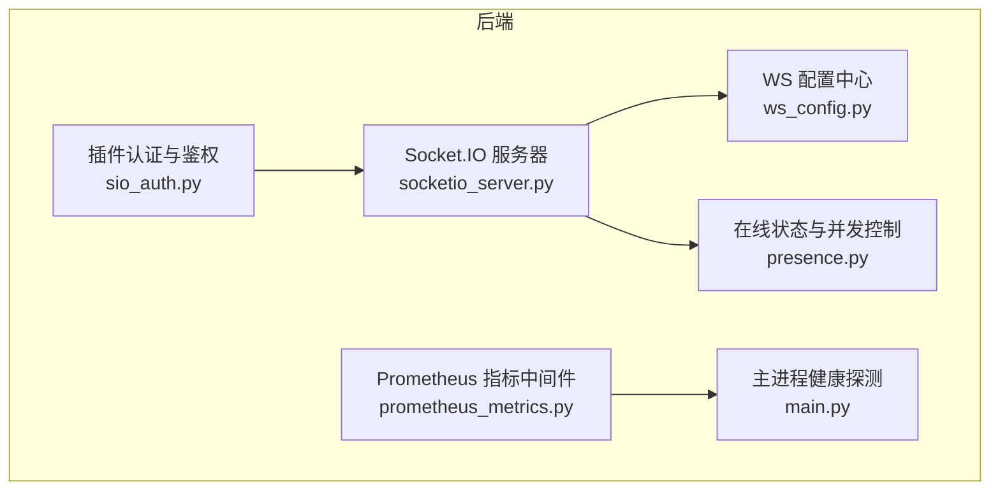
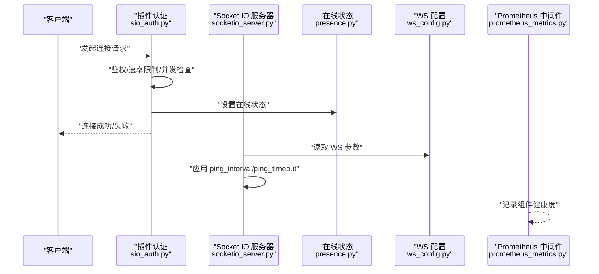
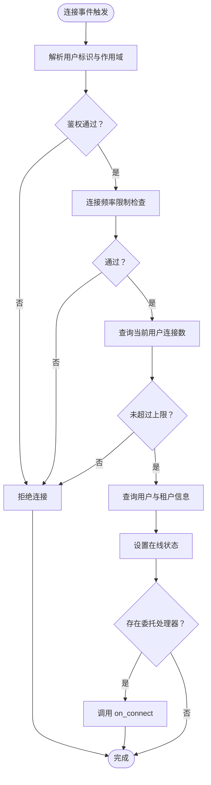
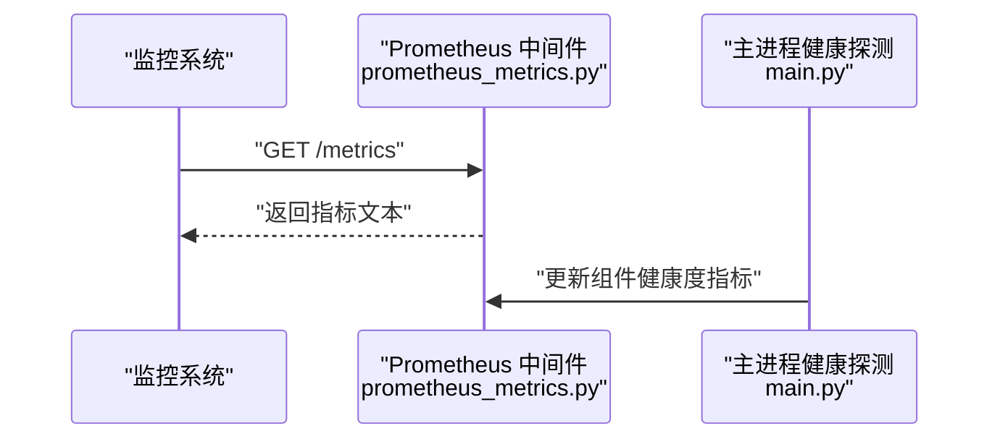
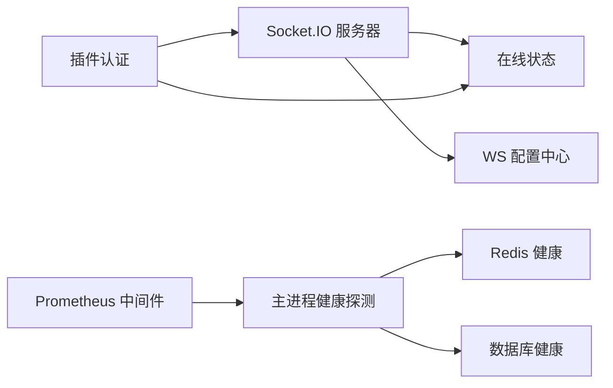

# 性能监控

<cite>
**本文引用的文件**
- [socketio_server.py](file://backend/app/core/socketio_server.py)
- [sio_auth.py](file://backend/app/plugins/sio_auth.py)
- [prometheus_metrics.py](file://backend/app/middleware/prometheus_metrics.py)
- [presence.py](file://backend/app/sio/presence.py)
- [ws_config.py](file://backend/app/sio/ws_config.py)
- [main.py](file://backend/app/main.py)
</cite>

## 目录
1. [简介](#简介)
2. [项目结构](#项目结构)
3. [核心组件](#核心组件)
4. [架构总览](#架构总览)
5. [详细组件分析](#详细组件分析)
6. [依赖关系分析](#依赖关系分析)
7. [性能考量](#性能考量)
8. [故障排查指南](#故障排查指南)
9. [结论](#结论)
10. [附录](#附录)

## 简介
本技术文档面向实时通信性能监控，聚焦于基于 Socket.IO 的连接与消息传输性能指标采集、监控数据格式与分析方法。内容覆盖连接延迟、消息吞吐量、内存与 CPU 占用的监控策略；说明 Prometheus 指标集成、自定义指标定义与告警规则配置；提供实时性能瓶颈识别、连接质量评估与用户体验监控方法；并给出性能基准测试、压力测试与容量规划建议，以及日志记录、错误追踪与诊断工具的使用方式。最后总结性能优化建议、资源配置调整与扩展策略。

## 项目结构
围绕 Socket.IO 的性能监控涉及以下关键模块：
- 核心服务层：Socket.IO 服务器实例管理与运行时参数应用
- 插件认证与鉴权：连接建立阶段的速率限制、并发连接上限与用户/租户信息解析
- 在线状态与并发控制：Presence 管理器用于连接数统计与在线状态维护
- 配置中心：WS 参数（启用开关、心跳间隔、超时等）集中配置与动态应用
- 指标与告警：Prometheus 中间件暴露指标，组件健康度指标用于告警
- 主进程生命周期：组件健康探测与指标刷新

图表来源
- [socketio_server.py:46-87](file://backend/app/core/socketio_server.py#L46-L87)
- [sio_auth.py:161-285](file://backend/app/plugins/sio_auth.py#L161-L285)
- [presence.py](file://backend/app/sio/presence.py)
- [ws_config.py](file://backend/app/sio/ws_config.py)
- [prometheus_metrics.py:65-115](file://backend/app/middleware/prometheus_metrics.py#L65-L115)
- [main.py:556-593](file://backend/app/main.py#L556-L593)

章节来源
- [socketio_server.py:46-87](file://backend/app/core/socketio_server.py#L46-L87)
- [sio_auth.py:161-285](file://backend/app/plugins/sio_auth.py#L161-L285)
- [prometheus_metrics.py:65-115](file://backend/app/middleware/prometheus_metrics.py#L65-L115)
- [main.py:556-593](file://backend/app/main.py#L556-L593)

## 核心组件
- Socket.IO 服务器与运行时参数
  - 提供全局 AsyncServer 实例与 WS 参数动态应用能力，支持在生命周期启动阶段对 engine.io 的 ping_interval 与 ping_timeout 生效，影响新连接的心跳行为。
- 插件认证与鉴权
  - 在连接建立阶段执行身份校验、速率限制、单用户最大连接数限制，并查询用户与租户信息，同时记录在线状态。
- 在线状态与并发控制
  - 提供用户连接数统计与在线状态维护，支撑连接并发上限控制。
- WS 配置中心
  - 统一读取平台配置中的 WS 开关、心跳间隔、超时等参数，供服务器动态应用。
- Prometheus 指标中间件
  - 暴露 HTTP 接口以文本格式输出指标，记录组件健康度指标，供外部监控系统抓取与告警。
- 主进程健康探测
  - 定期探测数据库与 Redis 健康状态，更新组件健康度指标，保障整体可观测性。

章节来源
- [socketio_server.py:46-87](file://backend/app/core/socketio_server.py#L46-L87)
- [sio_auth.py:161-285](file://backend/app/plugins/sio_auth.py#L161-L285)
- [presence.py](file://backend/app/sio/presence.py)
- [ws_config.py](file://backend/app/sio/ws_config.py)
- [prometheus_metrics.py:65-115](file://backend/app/middleware/prometheus_metrics.py#L65-L115)
- [main.py:556-593](file://backend/app/main.py#L556-L593)

## 架构总览
下图展示 Socket.IO 连接从建立到运行期间的关键交互路径，以及与指标系统的集成点。

图表来源
- [sio_auth.py:161-285](file://backend/app/plugins/sio_auth.py#L161-L285)
- [socketio_server.py:51-87](file://backend/app/core/socketio_server.py#L51-L87)
- [presence.py](file://backend/app/sio/presence.py)
- [ws_config.py](file://backend/app/sio/ws_config.py)
- [prometheus_metrics.py:65-115](file://backend/app/middleware/prometheus_metrics.py#L65-L115)

## 详细组件分析

### Socket.IO 服务器与 WS 参数应用
- 职责
  - 提供全局 AsyncServer 实例访问接口。
  - 在生命周期启动阶段从平台配置读取 WS 参数（启用开关、心跳间隔、超时），并应用到 engine.io 属性，仅对新连接生效。
- 关键点
  - 参数来源：通过配置中心读取 ws_enabled、ws_ping_interval、ws_ping_timeout。
  - 影响范围：ping_interval/ping_timeout 仅影响新连接的心跳行为；现有连接保持原有配置。
  - 异常处理：应用失败时记录警告日志，避免阻断启动流程。
- 性能意义
  - 合理的心跳间隔与超时可降低网络空闲开销，提升长连接稳定性；过短可能增加 CPU 与带宽消耗，过长可能导致误判掉线。

章节来源
- [socketio_server.py:46-87](file://backend/app/core/socketio_server.py#L46-L87)

### 插件认证与鉴权（连接建立阶段）
- 职责
  - 在连接事件中执行鉴权、速率限制、单用户最大连接数限制，并查询用户与租户信息，最终设置在线状态。
- 关键流程
  - 解析用户标识与作用域，进行鉴权。
  - 执行连接频率限制检查。
  - 检查单用户最大连接数阈值。
  - 查询用户与租户信息，记录在线状态。
  - 若存在委托处理器，则交由插件 on_connect 处理。
  - 异常时统一记录错误日志并拒绝连接。
- 性能意义
  - 速率限制与并发上限可防止恶意或异常连接洪泛，保护服务端资源。
  - 在线状态维护有助于后续统计与限流策略。

图表来源
- [sio_auth.py:161-285](file://backend/app/plugins/sio_auth.py#L161-L285)

章节来源
- [sio_auth.py:161-285](file://backend/app/plugins/sio_auth.py#L161-L285)

### 在线状态与并发控制
- 职责
  - 提供用户连接数统计与在线状态维护，支撑连接并发上限控制。
- 性能意义
  - 通过统计当前连接数，实现 per-user 并发限制，避免个别用户过度占用资源。
  - 在线状态可用于后续的会话管理、通知推送与资源回收。

章节来源
- [presence.py](file://backend/app/sio/presence.py)

### WS 配置中心
- 职责
  - 统一读取平台配置中的 WS 开关、心跳间隔、超时等参数，供服务器动态应用。
- 性能意义
  - 动态配置可在不重启服务的情况下调整连接行为，便于按场景优化。

章节来源
- [ws_config.py](file://backend/app/sio/ws_config.py)

### Prometheus 指标中间件与组件健康度
- 职责
  - 暴露 HTTP 接口以文本格式输出指标。
  - 记录组件健康度指标（如数据库、Redis），供外部监控系统抓取与告警。
- 性能意义
  - 为系统提供统一的指标出口，便于构建仪表盘与告警规则，快速定位性能瓶颈与异常。

图表来源
- [prometheus_metrics.py:65-115](file://backend/app/middleware/prometheus_metrics.py#L65-L115)
- [main.py:556-593](file://backend/app/main.py#L556-L593)

章节来源
- [prometheus_metrics.py:65-115](file://backend/app/middleware/prometheus_metrics.py#L65-L115)
- [main.py:556-593](file://backend/app/main.py#L556-L593)

## 依赖关系分析
- 组件耦合与协作
  - 插件认证依赖在线状态模块进行连接数统计与在线状态维护。
  - Socket.IO 服务器依赖 WS 配置中心读取参数并在启动阶段应用。
  - Prometheus 中间件与主进程健康探测共同构成系统健康观测链路。
- 外部依赖与集成点
  - Redis 与数据库健康探测作为组件健康度指标的数据来源。
  - Prometheus 抓取 /metrics 接口以获取指标数据。

图表来源
- [socketio_server.py:51-87](file://backend/app/core/socketio_server.py#L51-L87)
- [sio_auth.py:161-285](file://backend/app/plugins/sio_auth.py#L161-L285)
- [prometheus_metrics.py:65-115](file://backend/app/middleware/prometheus_metrics.py#L65-L115)
- [main.py:556-593](file://backend/app/main.py#L556-L593)

章节来源
- [socketio_server.py:51-87](file://backend/app/core/socketio_server.py#L51-L87)
- [sio_auth.py:161-285](file://backend/app/plugins/sio_auth.py#L161-L285)
- [prometheus_metrics.py:65-115](file://backend/app/middleware/prometheus_metrics.py#L65-L115)
- [main.py:556-593](file://backend/app/main.py#L556-L593)

## 性能考量
- 连接延迟
  - 心跳参数：合理设置 ping_interval 与 ping_timeout，避免过短导致 CPU/带宽浪费，过长导致误判掉线。
  - 连接建立：鉴权与并发检查应在保证安全的前提下尽量轻量化，减少首包延迟。
- 消息吞吐量
  - 通过 Prometheus 指标观察连接数、消息速率与队列长度，结合业务峰值进行容量规划。
  - 使用在线状态统计与并发限制，避免单用户或单租户占用过多资源。
- 内存与 CPU 占用
  - 监控指标中可关注连接数、消息积压、处理耗时等维度，结合主进程健康探测结果定位异常。
  - 适当调整心跳参数与并发上限，降低空闲连接的资源占用。
- 配置与扩缩容
  - 利用 WS 配置中心动态调整参数，配合水平扩展（多实例）与负载均衡，提升整体吞吐与可用性。

## 故障排查指南
- 连接被拒绝
  - 检查插件认证阶段的鉴权、速率限制与并发上限逻辑，确认用户标识与作用域解析是否正确。
  - 查看在线状态设置与用户连接数统计是否异常。
- 心跳异常
  - 核对 WS 参数是否已正确应用到 engine.io；确认新连接与旧连接的行为差异。
- 指标缺失或异常
  - 检查 Prometheus 中间件是否正常暴露 /metrics 接口。
  - 确认主进程健康探测是否成功更新组件健康度指标（数据库、Redis）。
- 日志与追踪
  - 结合连接失败日志与 trace 工具，定位具体环节的错误原因与上下文信息。

章节来源
- [sio_auth.py:161-285](file://backend/app/plugins/sio_auth.py#L161-L285)
- [socketio_server.py:51-87](file://backend/app/core/socketio_server.py#L51-L87)
- [prometheus_metrics.py:65-115](file://backend/app/middleware/prometheus_metrics.py#L65-L115)
- [main.py:556-593](file://backend/app/main.py#L556-L593)

## 结论
通过对 Socket.IO 连接建立、运行时参数、在线状态与并发控制、配置中心与指标系统的协同分析，可以构建完善的实时通信性能监控体系。建议以 Prometheus 为指标出口，结合主进程健康探测与日志追踪，形成从连接质量到系统健康的一体化观测闭环，并据此制定容量规划与优化策略。

## 附录
- 指标与告警建议
  - 连接相关：连接总数、每用户连接数、连接失败率、连接建立耗时。
  - 心跳相关：心跳超时次数、心跳往返时间。
  - 并发相关：并发连接上限命中次数、速率限制触发次数。
  - 系统健康：数据库与 Redis 健康度、进程 CPU/内存使用率。
  - 告警规则：基于阈值与趋势的规则组合，结合时间窗口与降噪策略。
- 基准与压力测试
  - 基于连接数、消息速率、并发用户数等维度设计场景，逐步加压并记录指标变化。
  - 关注 P50/P95/P99 延迟、吞吐量与错误率拐点，确定系统瓶颈。
- 优化与扩展
  - 调整 WS 心跳参数、连接并发上限与速率限制策略。
  - 通过水平扩展与负载均衡提升吞吐与可用性。
  - 结合业务特性优化消息路由与序列化策略，降低传输与处理开销。