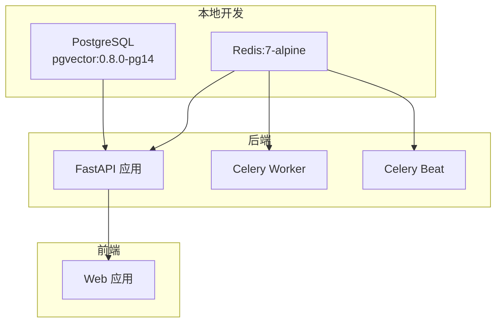
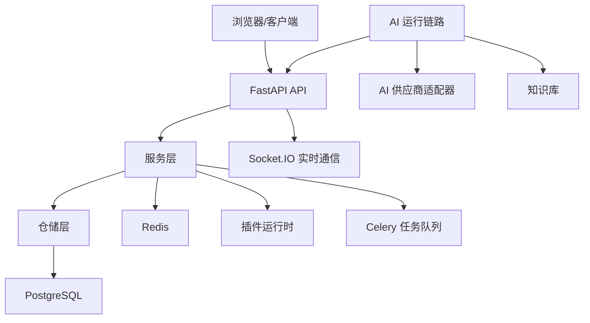
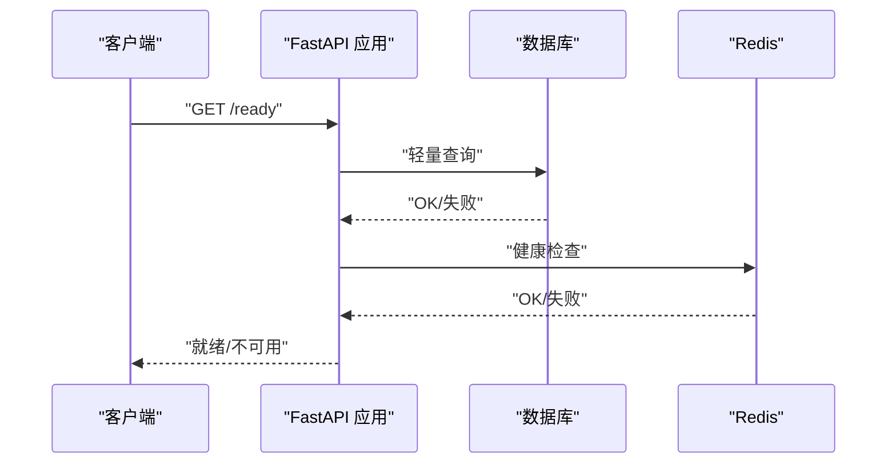

# 快速开始

<cite>
**本文引用的文件**
- [README.md](file://README.md)
- [docker-compose.dev.yml](file://docker-compose.dev.yml)
- [docker-compose.prod.yml](file://docker-compose.prod.yml)
- [Dockerfile](file://backend/Dockerfile)
- [pyproject.toml](file://backend/pyproject.toml)
- [package.json](file://frontend/package.json)
- [main.py](file://backend/app/main.py)
- [alembic.ini](file://backend/alembic.ini)
- [env_parser.py](file://backend/app/ai/skills/env_parser.py)
</cite>

## 目录
1. [简介](#简介)
2. [项目结构](#项目结构)
3. [核心组件](#核心组件)
4. [架构总览](#架构总览)
5. [详细组件分析](#详细组件分析)
6. [依赖分析](#依赖分析)
7. [性能考虑](#性能考虑)
8. [故障排除指南](#故障排除指南)
9. [结论](#结论)
10. [附录](#附录)

## 简介
本指南面向首次接触 NovusAI SaaS 的开发者与运维人员，帮助你在最短时间内完成环境准备、依赖安装、配置设置与首次运行。文档同时覆盖 Docker 本地开发与生产部署两种路径，并提供常见问题排查与最佳实践建议。

## 项目结构
仓库采用前后端分离与多模块组织方式：
- backend：FastAPI 后端、数据库迁移、插件运行时、测试与 CLI
- frontend：Vue3 前端 Monorepo，包含主应用与共享包
- docker-compose.dev.yml：本地开发依赖服务（PostgreSQL、Redis）
- docker-compose.prod.yml：生产编排参考（含后端 API、Worker、Beat、前端静态服务等）

图表来源
- [docker-compose.dev.yml:1-49](file://docker-compose.dev.yml#L1-L49)
- [backend/Dockerfile:55-69](file://backend/Dockerfile#L55-L69)

章节来源
- [README.md:99-119](file://README.md#L99-L119)

## 核心组件
- 后端运行时：FastAPI 应用，内置中间件、异常处理、权限与国际化、插件系统、异步任务与实时通信等
- 数据库与缓存：PostgreSQL（含 pgvector 扩展镜像）、Redis
- 前端：Vue3 + Vite + pnpm，提供 Ant Design Vue 风格的 Web 应用
- 工程化：Ruff、MyPy、ESLint、Prettier、Vitest、Turbo 等工具链
- 部署：Docker 与 Docker Compose，提供开发与生产参考编排

章节来源
- [README.md:89-98](file://README.md#L89-L98)

## 架构总览
下图展示从浏览器到后端、数据库与缓存的整体交互关系，以及 AI 运行链路与插件系统的位置。

图表来源
- [README.md:48-87](file://README.md#L48-L87)
- [backend/app/main.py:635-800](file://backend/app/main.py#L635-L800)

## 详细组件分析

### 本地开发环境准备
- 环境要求
  - Python 3.10+、Node.js 20.19+、pnpm 10+、PostgreSQL、Redis、Docker 与 Docker Compose
- 启动依赖服务
  - 在仓库根目录启动本地 PostgreSQL 与 Redis
- 启动后端
  - 创建虚拟环境、安装开发依赖、复制示例环境变量、执行数据库迁移、启动后端服务
  - 另起终端启动 Celery worker
- 启动前端
  - 在 frontend 目录安装依赖并启动开发服务器

章节来源
- [README.md:121-186](file://README.md#L121-L186)

### Docker 本地开发编排
- 使用 docker-compose.dev.yml 启动本地依赖服务
  - PostgreSQL：映射 5432 端口，持久化数据卷
  - Redis：映射 6379 端口，持久化数据卷
- 健康检查：容器启动后通过健康检查确认可用

章节来源
- [docker-compose.dev.yml:1-49](file://docker-compose.dev.yml#L1-L49)

### 生产部署编排参考
- docker-compose.prod.yml 提供生产参考编排
  - 后端 API、Worker、Beat、前端静态服务分别以独立服务运行
  - 通过环境变量注入数据库与 Redis 凭据
  - 提供健康检查与重启策略
  - 使用独立数据卷挂载存储与日志

章节来源
- [docker-compose.prod.yml:1-191](file://docker-compose.prod.yml#L1-L191)

### 后端应用启动流程与中间件
- 应用生命周期与启动阶段
  - 日志初始化、翻译缓存刷新
  - 数据库初始化或连接性检查（生产环境由迁移服务先行执行）
  - Redis 初始化（早期用于分布式锁）
  - 权限与配置同步（分布式锁保护）
  - WebSocket 平台配置应用、通知模板种子数据
  - Celery Broker 连通性检查
  - 插件自动发现与恢复（分布式锁保护，避免多 Worker 并发迁移）
  - 存储驱动可用性检查
- 就绪探针 /ready：校验数据库与 Redis 连通性
- 文档接口：在调试模式下开放 Swagger UI、ReDoc、OpenAPI JSON

图表来源
- [backend/app/main.py:596-632](file://backend/app/main.py#L596-L632)

章节来源
- [backend/app/main.py:53-487](file://backend/app/main.py#L53-L487)

### 数据库迁移与 Alembic
- Alembic 配置
  - 版本位置包含主应用与部分内置插件迁移目录
  - 默认数据库 URL 可被代码覆盖
- 迁移执行
  - 开发环境可通过 CLI 执行升级至最新版本
  - 生产环境由专用迁移服务在 API 启动前完成

章节来源
- [backend/alembic.ini:1-76](file://backend/alembic.ini#L1-L76)

### 环境变量与配置
- 后端环境变量
  - 位于 backend/.env.example → backend/.env，包含数据库、Redis、JWT、日志、Celery、AI Provider、存储等配置
  - 生产环境变量示例文件 production.env.example，复制为 production.env 后按部署环境修改
- 前端环境变量
  - frontend/apps/web-antd/.env.development：API 地址、开发端口、平台域名等
  - frontend/apps/web-antd/.env.local：Vite 本地覆盖配置（可按需创建）
- 环境变量解析与校验
  - 技能/适配器侧可解析 .env.example 生成 JSON Schema，用于界面化配置与必填字段提示

章节来源
- [README.md:188-196](file://README.md#L188-L196)
- [env_parser.py:58-197](file://backend/app/ai/skills/env_parser.py#L58-L197)

### 开发工具与测试
- 后端常用命令
  - pytest、Ruff 检查与格式化
- 前端常用命令
  - ESLint、Prettier、TypeScript 检查、单元测试、构建

章节来源
- [README.md:198-216](file://README.md#L198-L216)
- [package.json:27-71](file://frontend/package.json#L27-L71)

### Docker 镜像与多阶段构建
- 多阶段构建
  - builder 阶段安装构建依赖与应用代码
  - runtime 阶段仅包含运行时依赖与最小化用户
- 运行时镜像暴露端口 8000，提供健康检查
- 提供 API、Worker、Beat 三种镜像变体

章节来源
- [backend/Dockerfile:1-69](file://backend/Dockerfile#L1-L69)

## 依赖分析
- 后端依赖
  - Web 框架：FastAPI、Uvicorn
  - 数据库：SQLAlchemy、Asyncpg、Alembic、psycopg2
  - 缓存：Redis
  - 异步任务：Celery
  - 数据验证：Pydantic、Pydantic Settings
  - 认证：Python-Jose、bcrypt
  - HTTP 客户端：HTTPX、Requests
  - 存储：boto3、oss2
  - AI：OpenAI、SQLParse
  - RAG/知识库：pgvector、PDF/文档解析库
  - 实时通信：python-socketio
  - 日志与监控：loguru、prometheus-client
  - 模板：Jinja2
  - 图像处理：Pillow
  - 工具：filelock、python-dotenv、orjson、captcha、dnspython、PyYAML
- 前端依赖
  - Vue3、TypeScript、Vben Admin、Ant Design Vue、Vite、pnpm、vue-i18n
  - 工程化：ESLint、Prettier、Stylelint、Vitest、Turbo

章节来源
- [pyproject.toml:23-110](file://backend/pyproject.toml#L23-L110)
- [package.json:73-126](file://frontend/package.json#L73-L126)

## 性能考虑
- 使用多阶段 Docker 构建减少运行时体积
- 生产环境使用独立 Redis 与 PostgreSQL，避免单点瓶颈
- 后端 API、Worker、Beat 分离部署，便于水平扩展
- 启动阶段使用分布式锁避免并发冲突（权限、配置、插件发现与恢复）
- Prometheus 指标中间件与就绪探针提升可观测性与调度稳定性

## 故障排除指南
- 数据库连接失败
  - 确认 docker-compose.dev.yml 中 PostgreSQL 容器已健康运行
  - 检查后端数据库连接参数与凭据
- Redis 连接失败
  - 确认 Redis 容器健康，检查密码与网络连通
- 迁移失败或未执行
  - 开发环境：执行数据库迁移命令
  - 生产环境：确认迁移服务已成功完成
- 启动阶段报错（如密钥弱或缺失）
  - 生产环境必须替换默认密钥，否则启动会直接失败
- 插件启动失败
  - 查看日志中插件发现与恢复阶段的错误信息，确认 Redis 可用与分布式锁状态
- 前端无法访问后端接口
  - 检查前端 .env.development 中的 API 地址与端口配置

章节来源
- [backend/app/main.py:75-106](file://backend/app/main.py#L75-L106)
- [docker-compose.dev.yml:15-19](file://docker-compose.dev.yml#L15-L19)
- [docker-compose.prod.yml:104-109](file://docker-compose.prod.yml#L104-L109)

## 结论
通过本指南，你可以在本地快速拉起 NovusAI SaaS 的完整开发环境，并理解生产部署的关键要点。建议在首次运行后，逐步完善环境变量、数据库初始化与插件配置，再进行功能验证与性能优化。

## 附录
- 常用命令速查
  - 启动本地依赖服务：docker compose -f docker-compose.dev.yml up -d
  - 后端安装与运行：cd backend && 虚拟环境激活 && uv sync --extra dev && cp .env.example .env && novusai db upgrade head && novusai run --reload
  - Celery Worker：cd backend && 虚拟环境激活 && novusai celery dev
  - 前端安装与运行：cd frontend && pnpm install && pnpm dev:antd
- API 文档
  - 开启调试模式后，可在 http://127.0.0.1:8000/docs、http://127.0.0.1:8000/redoc、http://127.0.0.1:8000/openapi.json 查看接口文档

章节来源
- [README.md:130-186](file://README.md#L130-L186)