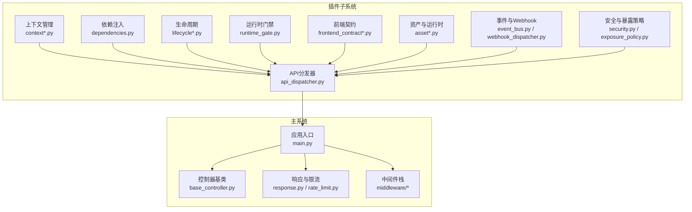
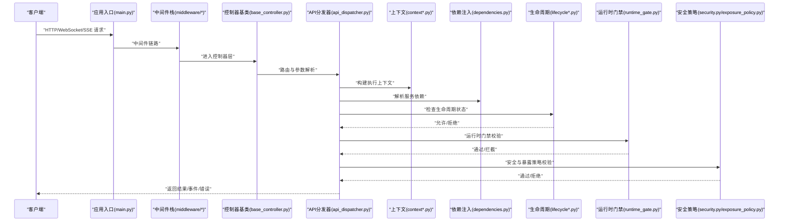
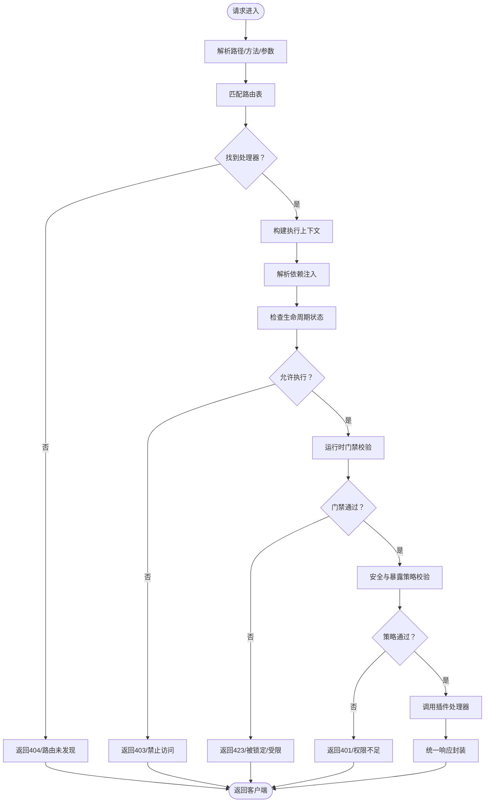
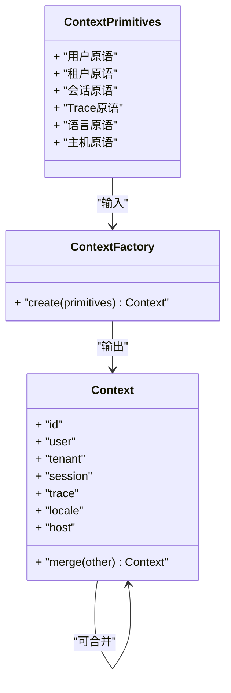
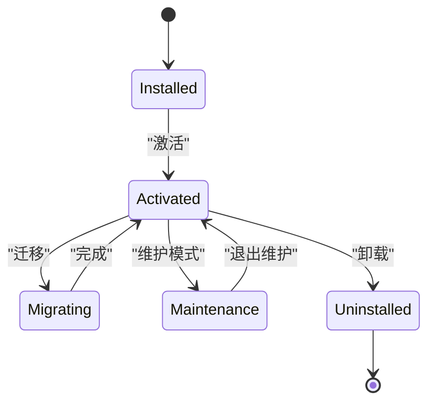
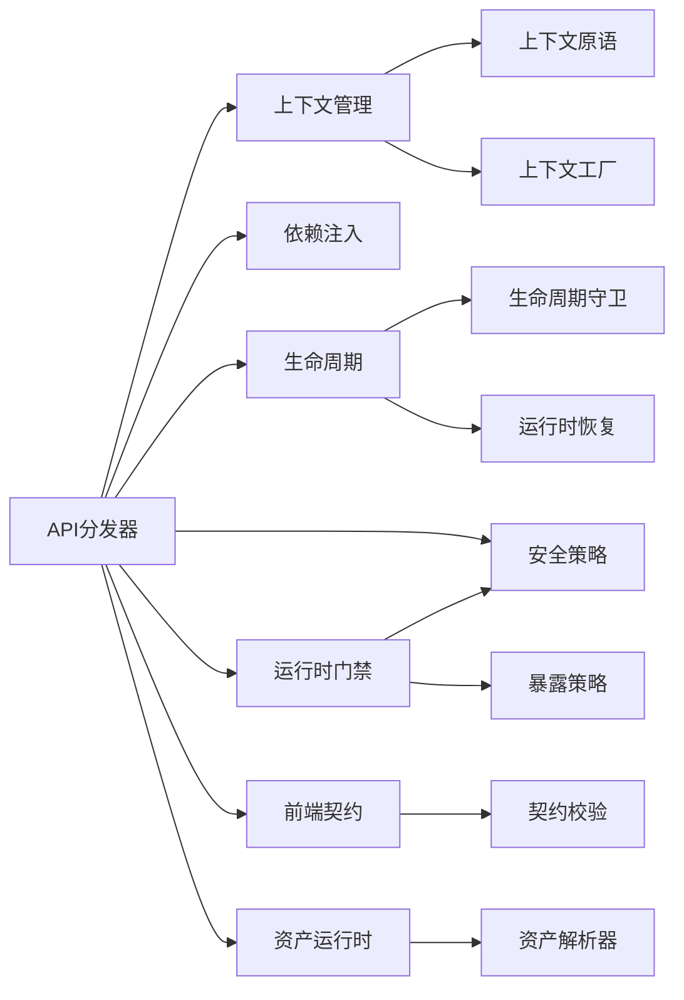

# API扩展开发

<cite>
**本文引用的文件**
- [api_dispatcher.py](file://backend/app/plugins/api_dispatcher.py)
- [context.py](file://backend/app/plugins/context.py)
- [context_factory.py](file://backend/app/plugins/context_factory.py)
- [context_primitives.py](file://backend/app/plugins/context_primitives.py)
- [dependencies.py](file://backend/app/plugins/dependencies.py)
- [base.py](file://backend/app/plugins/base.py)
- [_extension_registrar.py](file://backend/app/plugins/_extension_registrar.py)
- [webhook_dispatcher.py](file://backend/app/plugins/webhook_dispatcher.py)
- [event_bus.py](file://backend/app/plugins/event_bus.py)
- [security.py](file://backend/app/plugins/security.py)
- [exposure_policy.py](file://backend/app/plugins/exposure_policy.py)
- [frontend_contract.py](file://backend/app/plugins/frontend_contract.py)
- [frontend_contract_checks.py](file://backend/app/plugins/frontend_contract_checks.py)
- [host_read_facade.py](file://backend/app/plugins/host_read_facade.py)
- [asset_resolver.py](file://backend/app/plugins/asset_resolver.py)
- [asset_runtime.py](file://backend/app/plugins/asset_runtime.py)
- [health.py](file://backend/app/plugins/health.py)
- [lifecycle.py](file://backend/app/plugins/lifecycle.py)
- [lifecycle_orchestrator.py](file://backend/app/plugins/lifecycle_orchestrator.py)
- [lifecycle_guards.py](file://backend/app/plugins/lifecycle_guards.py)
- [scheduler_refresh.py](file://backend/app/plugins/scheduler_refresh.py)
- [startup.py](file://backend/app/plugins/startup.py)
- [system_hooks.py](file://backend/app/plugins/system_hooks.py)
- [registry.py](file://backend/app/plugins/registry.py)
- [registry_runtime_extensions.py](file://backend/app/plugins/registry_runtime_extensions.py)
- [runtime_gate.py](file://backend/app/plugins/runtime_gate.py)
- [runtime_recovery.py](file://backend/app/plugins/runtime_recovery.py)
- [runtime_registration.py](file://backend/app/plugins/runtime_registration.py)
- [marketplace.py](file://backend/app/plugins/marketplace.py)
- [marketplace_registry.py](file://backend/app/plugins/marketplace_registry.py)
- [manifest.py](file://backend/app/plugins/manifest.py)
- [manifest_helpers.py](file://backend/app/plugins/manifest_helpers.py)
- [manifest_metadata_schemas.py](file://backend/app/plugins/manifest_metadata_schemas.py)
- [version_manager.py](file://backend/app/plugins/version_manager.py)
- [package_security.py](file://backend/app/plugins/package_security.py)
- [crypto.py](file://backend/app/plugins/crypto.py)
- [sio_auth.py](file://backend/app/plugins/sio_auth.py)
- [sse.py](file://backend/app/plugins/sse.py)
- [sio_bridge.py](file://backend/app/plugins/sio_bridge.py)
- [socketio_server.py](file://backend/app/plugins/socketio_server.py)
- [ws_config.py](file://backend/app/plugins/ws_config.py)
- [notification_seeds.py](file://backend/app/plugins/notification_seeds.py)
- [presence.py](file://backend/app/plugins/presence.py)
- [admin_ns.py](file://backend/app/plugins/admin_ns.py)
- [tenant_ns.py](file://backend/app/plugins/tenant_ns.py)
- [user_ns.py](file://backend/app/plugins/user_ns.py)
- [celery_app.py](file://backend/app/celery_app.py)
- [tasks/scheduler.py](file://backend/app/tasks/scheduler.py)
- [tasks/scheduled.py](file://backend/app/tasks/scheduled.py)
- [tasks/base.py](file://backend/app/tasks/base.py)
- [tasks/agent_batch.py](file://backend/app/tasks/agent_batch.py)
- [tasks/ai_health_check.py](file://backend/app/tasks/ai_health_check.py)
- [tasks/async_db.py](file://backend/app/tasks/async_db.py)
- [tasks/email.py](file://backend/app/tasks/email.py)
- [tasks/notification.py](file://backend/app/tasks/notification.py)
- [tasks/recycle_bin.py](file://backend/app/tasks/recycle_bin.py)
- [tasks/upload_cleanup.py](file://backend/app/tasks/upload_cleanup.py)
- [tasks/task_scheduling.py](file://backend/app/tasks/task_scheduling.py)
- [main.py](file://backend/app/main.py)
- [base_controller.py](file://backend/app/core/base_controller.py)
- [response.py](file://backend/app/core/response.py)
- [rate_limit.py](file://backend/app/core/rate_limit.py)
- [cors.py](file://backend/app/core/cors.py)
- [security.py](file://backend/app/core/security.py)
- [logging.py](file://backend/app/core/logging.py)
- [i18n.py](file://backend/app/core/i18n.py)
- [scope.py](file://backend/app/core/scope.py)
- [identity.py](file://backend/app/core/identity.py)
- [hosts_helper.py](file://backend/app/core/hosts_helper.py)
- [redis.py](file://backend/app/core/redis.py)
- [database.py](file://backend/app/core/database.py)
- [csv_export.py](file://backend/app/core/csv_export.py)
- [deletion.py](file://backend/app/core/deletion.py)
- [recycle_bin.py](file://backend/app/core/recycle_bin.py)
- [sio_bridge.py](file://backend/app/core/sio_bridge.py)
- [sse.py](file://backend/app/core/sse.py)
- [trace.py](file://backend/app/middleware/trace.py)
- [audit_log.py](file://backend/app/middleware/audit_log.py)
- [permission.py](file://backend/app/middleware/permission.py)
- [tenant.py](file://backend/app/middleware/tenant.py)
- [maintenance.py](file://backend/app/middleware/maintenance.py)
- [access_control.py](file://backend/app/middleware/access_control.py)
- [dynamic_cors.py](file://backend/app/middleware/dynamic_cors.py)
- [prometheus_metrics.py](file://backend/app/middleware/prometheus_metrics.py)
- [i18n.py](file://backend/app/middleware/i18n.py)
- [nocache.py](file://backend/app/middleware/nocache.py)
- [cli_runtime_helpers.py](file://backend/app/cli_runtime_helpers.py)
- [operation_log_module_resolution.py](file://backend/app/operation_log_module_resolution.py)
- [test_plugin_api_dispatcher_security.py](file://backend/tests/plugins/test_plugin_api_dispatcher_security.py)
- [test_plugin_api_dispatcher_context_safety.py](file://backend/tests/plugins/test_plugin_api_dispatcher_context_safety.py)
- [test_plugin_api_dispatcher.py](file://backend/tests/plugins/test_plugin_api_dispatcher.py)
- [test_plugin_asset_resolver.py](file://backend/tests/plugins/test_plugin_asset_resolver.py)
- [test_plugin_asset_runtime_gate.py](file://backend/tests/plugins/test_plugin_asset_runtime_gate.py)
- [test_plugin_crypto.py](file://backend/tests/plugins/test_plugin_crypto.py)
- [test_plugin_event_hook_runtime.py](file://backend/tests/plugins/test_plugin_event_hook_runtime.py)
- [test_plugin_frontend_contracts.py](file://backend/tests/plugins/test_plugin_frontend_contracts.py)
- [test_plugin_health.py](file://backend/tests/plugins/test_plugin_health.py)
- [test_plugin_lifecycle_guards.py](file://backend/tests/plugins/test_plugin_lifecycle_guards.py)
- [test_plugin_marketplace.py](file://backend/tests/plugins/test_plugin_marketplace.py)
- [test_plugin_package_security.py](file://backend/tests/plugins/test_plugin_package_security.py)
- [test_plugin_scheduler_refresh.py](file://backend/tests/plugins/test_plugin_scheduler_refresh.py)
- [test_plugin_sio_auth.py](file://backend/tests/plugins/test_plugin_sio_auth.py)
- [test_plugin_sse.py](file://backend/tests/plugins/test_plugin_sse.py)
- [test_plugin_startup_discovery_boundaries.py](file://backend/tests/plugins/test_plugin_startup_discovery_boundaries.py)
- [test_plugin_system_hooks.py](file://backend/tests/plugins/test_plugin_system_hooks.py)
- [test_plugin_webhook_dispatcher_security.py](file://backend/tests/plugins/test_plugin_webhook_dispatcher_security.py)
</cite>

## 目录
1. [引言](#引言)
2. [项目结构](#项目结构)
3. [核心组件](#核心组件)
4. [架构总览](#架构总览)
5. [详细组件分析](#详细组件分析)
6. [依赖关系分析](#依赖关系分析)
7. [性能考量](#性能考量)
8. [故障排查指南](#故障排查指南)
9. [结论](#结论)
10. [附录：完整开发示例](#附录完整开发示例)

## 引言
本指南面向希望在本系统中开发“插件API扩展”的工程师，系统性阐述插件API扩展的架构原理、路由机制与请求处理流程；详解API分发器的工作原理、路由注册与参数传递机制；文档化插件上下文管理、依赖注入与生命周期钩子的使用方法；解释插件与主系统的API交互方式、数据传递与错误处理策略；并覆盖安全、权限控制与性能优化要点。最后提供可直接落地的开发示例，涵盖RESTful API、WebSocket接口与定时任务。

## 项目结构
后端采用模块化组织，插件生态位于 backend/app/plugins 下，围绕“API分发”“上下文管理”“生命周期”“运行时门禁”“前端契约”等子系统协同工作。核心入口与中间件位于 backend/app，测试用例位于 backend/tests。

图示来源
- [api_dispatcher.py](file://backend/app/plugins/api_dispatcher.py)
- [context.py](file://backend/app/plugins/context.py)
- [dependencies.py](file://backend/app/plugins/dependencies.py)
- [lifecycle_orchestrator.py](file://backend/app/plugins/lifecycle_orchestrator.py)
- [runtime_gate.py](file://backend/app/plugins/runtime_gate.py)
- [frontend_contract.py](file://backend/app/plugins/frontend_contract.py)
- [asset_runtime.py](file://backend/app/plugins/asset_runtime.py)
- [event_bus.py](file://backend/app/plugins/event_bus.py)
- [security.py](file://backend/app/plugins/security.py)
- [exposure_policy.py](file://backend/app/plugins/exposure_policy.py)
- [main.py](file://backend/app/main.py)
- [base_controller.py](file://backend/app/core/base_controller.py)
- [response.py](file://backend/app/core/response.py)
- [rate_limit.py](file://backend/app/core/rate_limit.py)

章节来源
- [main.py](file://backend/app/main.py)
- [api_dispatcher.py](file://backend/app/plugins/api_dispatcher.py)
- [context.py](file://backend/app/plugins/context.py)
- [dependencies.py](file://backend/app/plugins/dependencies.py)
- [lifecycle_orchestrator.py](file://backend/app/plugins/lifecycle_orchestrator.py)
- [runtime_gate.py](file://backend/app/plugins/runtime_gate.py)
- [frontend_contract.py](file://backend/app/plugins/frontend_contract.py)
- [asset_runtime.py](file://backend/app/plugins/asset_runtime.py)
- [event_bus.py](file://backend/app/plugins/event_bus.py)
- [security.py](file://backend/app/plugins/security.py)
- [exposure_policy.py](file://backend/app/plugins/exposure_policy.py)

## 核心组件
- API分发器：负责接收外部请求，解析路由与参数，选择合适的插件处理器，并进行上下文注入与安全校验。
- 上下文管理：提供插件执行所需的运行时上下文（用户、租户、会话、Trace ID等），支持工厂模式与原语类型。
- 依赖注入：集中声明与解析插件所需的服务依赖，确保生命周期内可复用与可替换。
- 生命周期：从安装、激活、迁移、维护到卸载的全周期编排，含守卫与恢复机制。
- 运行时门禁：对插件运行环境进行访问控制与资源约束，保障主系统稳定。
- 前端契约：定义插件与前端交互的接口规范与校验规则，确保兼容性与安全性。
- 资产与运行时：托管插件静态资源与运行态能力，支持版本化与缓存策略。
- 事件与Webhook：提供事件总线与Webhook分发，支撑异步与外部集成。
- 安全与暴露策略：统一的安全策略与对外暴露面控制，结合权限中间件与审计日志。

章节来源
- [api_dispatcher.py](file://backend/app/plugins/api_dispatcher.py)
- [context.py](file://backend/app/plugins/context.py)
- [context_factory.py](file://backend/app/plugins/context_factory.py)
- [context_primitives.py](file://backend/app/plugins/context_primitives.py)
- [dependencies.py](file://backend/app/plugins/dependencies.py)
- [lifecycle.py](file://backend/app/plugins/lifecycle.py)
- [lifecycle_orchestrator.py](file://backend/app/plugins/lifecycle_orchestrator.py)
- [lifecycle_guards.py](file://backend/app/plugins/lifecycle_guards.py)
- [runtime_gate.py](file://backend/app/plugins/runtime_gate.py)
- [frontend_contract.py](file://backend/app/plugins/frontend_contract.py)
- [frontend_contract_checks.py](file://backend/app/plugins/frontend_contract_checks.py)
- [asset_resolver.py](file://backend/app/plugins/asset_resolver.py)
- [asset_runtime.py](file://backend/app/plugins/asset_runtime.py)
- [event_bus.py](file://backend/app/plugins/event_bus.py)
- [webhook_dispatcher.py](file://backend/app/plugins/webhook_dispatcher.py)
- [security.py](file://backend/app/plugins/security.py)
- [exposure_policy.py](file://backend/app/plugins/exposure_policy.py)

## 架构总览
插件API扩展以“API分发器”为核心，串联上下文、依赖、生命周期与运行时门禁，形成闭环的扩展框架。请求自应用入口进入，经由中间件栈与控制器基类，最终由API分发器路由至具体插件处理器。插件处理器在受控上下文中执行，通过事件总线或Webhook与外部系统交互，同时遵循安全策略与暴露策略。

图示来源
- [main.py](file://backend/app/main.py)
- [base_controller.py](file://backend/app/core/base_controller.py)
- [api_dispatcher.py](file://backend/app/plugins/api_dispatcher.py)
- [context.py](file://backend/app/plugins/context.py)
- [dependencies.py](file://backend/app/plugins/dependencies.py)
- [lifecycle_orchestrator.py](file://backend/app/plugins/lifecycle_orchestrator.py)
- [runtime_gate.py](file://backend/app/plugins/runtime_gate.py)
- [security.py](file://backend/app/plugins/security.py)
- [exposure_policy.py](file://backend/app/plugins/exposure_policy.py)

## 详细组件分析

### API分发器（API Dispatcher）
职责
- 接收请求，解析路径、方法与参数
- 根据路由表选择插件处理器
- 注入上下文与依赖
- 执行安全与暴露策略校验
- 统一错误处理与响应封装

关键流程
- 路由注册：通过扩展注册器集中注册插件路由
- 参数传递：将查询参数、路径参数、请求体与上下文合并传递给处理器
- 错误处理：捕获异常并转换为主系统统一响应格式

图示来源
- [api_dispatcher.py](file://backend/app/plugins/api_dispatcher.py)
- [dependencies.py](file://backend/app/plugins/dependencies.py)
- [context.py](file://backend/app/plugins/context.py)
- [lifecycle_orchestrator.py](file://backend/app/plugins/lifecycle_orchestrator.py)
- [runtime_gate.py](file://backend/app/plugins/runtime_gate.py)
- [security.py](file://backend/app/plugins/security.py)
- [exposure_policy.py](file://backend/app/plugins/exposure_policy.py)

章节来源
- [api_dispatcher.py](file://backend/app/plugins/api_dispatcher.py)
- [_extension_registrar.py](file://backend/app/plugins/_extension_registrar.py)

### 插件上下文管理（Context Management）
职责
- 提供统一的运行时上下文（用户、租户、会话、Trace ID、语言、主机等）
- 支持工厂模式按需生成上下文实例
- 提供原语类型与上下文组合能力

设计要点
- 上下文原语：最小不可分的上下文元素
- 工厂：根据请求与配置生成上下文对象
- 组合：将多个原语组合为完整上下文

图示来源
- [context_primitives.py](file://backend/app/plugins/context_primitives.py)
- [context_factory.py](file://backend/app/plugins/context_factory.py)
- [context.py](file://backend/app/plugins/context.py)

章节来源
- [context_primitives.py](file://backend/app/plugins/context_primitives.py)
- [context_factory.py](file://backend/app/plugins/context_factory.py)
- [context.py](file://backend/app/plugins/context.py)

### 依赖注入（Dependency Injection）
职责
- 在插件生命周期内提供可复用的服务依赖
- 支持按需解析与作用域管理

最佳实践
- 将外部服务抽象为接口，便于替换与测试
- 使用工厂函数延迟初始化昂贵资源
- 避免循环依赖，保持高内聚低耦合

章节来源
- [dependencies.py](file://backend/app/plugins/dependencies.py)

### 生命周期与运行时门禁（Lifecycle & Runtime Gate）
职责
- 管理插件从安装、激活、迁移、维护到卸载的全生命周期
- 在运行时对插件进行访问控制与资源约束
- 提供守卫与恢复机制，保证系统稳定性

图示来源
- [lifecycle_orchestrator.py](file://backend/app/plugins/lifecycle_orchestrator.py)
- [lifecycle_guards.py](file://backend/app/plugins/lifecycle_guards.py)
- [runtime_gate.py](file://backend/app/plugins/runtime_gate.py)

章节来源
- [lifecycle.py](file://backend/app/plugins/lifecycle.py)
- [lifecycle_orchestrator.py](file://backend/app/plugins/lifecycle_orchestrator.py)
- [lifecycle_guards.py](file://backend/app/plugins/lifecycle_guards.py)
- [runtime_gate.py](file://backend/app/plugins/runtime_gate.py)

### 前端契约与安全策略（Frontend Contract & Security Policy）
职责
- 定义插件与前端交互的接口规范与校验规则
- 统一安全策略与对外暴露面控制
- 结合权限中间件与审计日志

章节来源
- [frontend_contract.py](file://backend/app/plugins/frontend_contract.py)
- [frontend_contract_checks.py](file://backend/app/plugins/frontend_contract_checks.py)
- [security.py](file://backend/app/plugins/security.py)
- [exposure_policy.py](file://backend/app/plugins/exposure_policy.py)

### 资产与运行时（Asset Resolver & Runtime）
职责
- 托管插件静态资源与运行态能力
- 支持版本化与缓存策略，提升加载效率

章节来源
- [asset_resolver.py](file://backend/app/plugins/asset_resolver.py)
- [asset_runtime.py](file://backend/app/plugins/asset_runtime.py)

### 事件与Webhook（Event Bus & Webhook Dispatcher）
职责
- 提供事件总线，支持插件内部与跨插件事件
- 分发Webhook，对接外部系统

章节来源
- [event_bus.py](file://backend/app/plugins/event_bus.py)
- [webhook_dispatcher.py](file://backend/app/plugins/webhook_dispatcher.py)

### 主系统集成点（Controllers, Middleware, Response）
职责
- 控制器基类提供统一的请求处理骨架
- 中间件栈提供权限、审计、CORS、限流等横切能力
- 响应与限流封装统一错误与成功响应

章节来源
- [base_controller.py](file://backend/app/core/base_controller.py)
- [response.py](file://backend/app/core/response.py)
- [rate_limit.py](file://backend/app/core/rate_limit.py)
- [permission.py](file://backend/app/middleware/permission.py)
- [audit_log.py](file://backend/app/middleware/audit_log.py)
- [cors.py](file://backend/app/core/cors.py)

## 依赖关系分析
插件API扩展各组件之间存在清晰的依赖层次：API分发器依赖上下文、依赖注入、生命周期与运行时门禁；上下文依赖原语与工厂；依赖注入依赖服务注册；生命周期依赖守卫与恢复；运行时门禁依赖安全策略与暴露策略；前端契约与资产运行时作为横切能力参与。

图示来源
- [api_dispatcher.py](file://backend/app/plugins/api_dispatcher.py)
- [context.py](file://backend/app/plugins/context.py)
- [context_factory.py](file://backend/app/plugins/context_factory.py)
- [context_primitives.py](file://backend/app/plugins/context_primitives.py)
- [dependencies.py](file://backend/app/plugins/dependencies.py)
- [lifecycle_orchestrator.py](file://backend/app/plugins/lifecycle_orchestrator.py)
- [lifecycle_guards.py](file://backend/app/plugins/lifecycle_guards.py)
- [runtime_gate.py](file://backend/app/plugins/runtime_gate.py)
- [security.py](file://backend/app/plugins/security.py)
- [exposure_policy.py](file://backend/app/plugins/exposure_policy.py)
- [frontend_contract.py](file://backend/app/plugins/frontend_contract.py)
- [frontend_contract_checks.py](file://backend/app/plugins/frontend_contract_checks.py)
- [asset_resolver.py](file://backend/app/plugins/asset_resolver.py)
- [asset_runtime.py](file://backend/app/plugins/asset_runtime.py)

章节来源
- [api_dispatcher.py](file://backend/app/plugins/api_dispatcher.py)
- [context.py](file://backend/app/plugins/context.py)
- [dependencies.py](file://backend/app/plugins/dependencies.py)
- [lifecycle_orchestrator.py](file://backend/app/plugins/lifecycle_orchestrator.py)
- [runtime_gate.py](file://backend/app/plugins/runtime_gate.py)
- [frontend_contract.py](file://backend/app/plugins/frontend_contract.py)
- [asset_runtime.py](file://backend/app/plugins/asset_runtime.py)

## 性能考量
- 路由与参数解析：尽量减少正则与复杂匹配，优先使用前缀树或映射表
- 上下文与依赖：避免重复构建，利用缓存与工厂复用
- 生命周期与门禁：在启动阶段预热，运行时快速决策
- 前端契约与资产：启用CDN与版本化缓存，降低带宽与延迟
- 中间件与限流：前置限流与CORS，减少无效请求进入核心逻辑
- 事件与Webhook：异步化处理，队列化背压，避免阻塞主线程

## 故障排查指南
常见问题与定位建议
- 路由未命中：检查扩展注册器是否正确注册，确认路径与方法匹配
- 上下文缺失：核对上下文原语与工厂配置，确保请求头与鉴权信息完整
- 依赖解析失败：检查依赖注册与作用域，避免循环依赖
- 生命周期异常：查看守卫与恢复日志，确认迁移与维护状态
- 运行时门禁拦截：检查资源配额与访问策略
- 安全策略拒绝：核对权限中间件与暴露策略配置
- 前端契约校验失败：对照契约定义与实际请求体字段
- 资产加载失败：确认版本号与缓存策略，检查CDN可达性

章节来源
- [test_plugin_api_dispatcher_security.py](file://backend/tests/plugins/test_plugin_api_dispatcher_security.py)
- [test_plugin_api_dispatcher_context_safety.py](file://backend/tests/plugins/test_plugin_api_dispatcher_context_safety.py)
- [test_plugin_asset_resolver.py](file://backend/tests/plugins/test_plugin_asset_resolver.py)
- [test_plugin_asset_runtime_gate.py](file://backend/tests/plugins/test_plugin_asset_runtime_gate.py)
- [test_plugin_crypto.py](file://backend/tests/plugins/test_plugin_crypto.py)
- [test_plugin_event_hook_runtime.py](file://backend/tests/plugins/test_plugin_event_hook_runtime.py)
- [test_plugin_frontend_contracts.py](file://backend/tests/plugins/test_plugin_frontend_contracts.py)
- [test_plugin_health.py](file://backend/tests/plugins/test_plugin_health.py)
- [test_plugin_lifecycle_guards.py](file://backend/tests/plugins/test_plugin_lifecycle_guards.py)
- [test_plugin_marketplace.py](file://backend/tests/plugins/test_plugin_marketplace.py)
- [test_plugin_package_security.py](file://backend/tests/plugins/test_plugin_package_security.py)
- [test_plugin_scheduler_refresh.py](file://backend/tests/plugins/test_plugin_scheduler_refresh.py)
- [test_plugin_sio_auth.py](file://backend/tests/plugins/test_plugin_sio_auth.py)
- [test_plugin_sse.py](file://backend/tests/plugins/test_plugin_sse.py)
- [test_plugin_startup_discovery_boundaries.py](file://backend/tests/plugins/test_plugin_startup_discovery_boundaries.py)
- [test_plugin_system_hooks.py](file://backend/tests/plugins/test_plugin_system_hooks.py)
- [test_plugin_webhook_dispatcher_security.py](file://backend/tests/plugins/test_plugin_webhook_dispatcher_security.py)

## 结论
本指南系统梳理了插件API扩展的架构与实现要点，强调以API分发器为中心的请求处理闭环，以及上下文、依赖、生命周期、运行时门禁与安全策略的协同。通过遵循本文的最佳实践与示例，开发者可以高效、安全地扩展系统能力，满足RESTful API、WebSocket与定时任务等多样化场景需求。

## 附录：完整开发示例

### 示例一：RESTful API
目标：为插件新增一个GET/POST路由，返回JSON并记录审计日志。

步骤
- 在扩展注册器中注册路由与处理器
- 在处理器中解析参数，构建上下文，注入依赖
- 执行业务逻辑，返回统一响应
- 记录审计日志与追踪ID

参考文件
- [api_dispatcher.py](file://backend/app/plugins/api_dispatcher.py)
- [_extension_registrar.py](file://backend/app/plugins/_extension_registrar.py)
- [context.py](file://backend/app/plugins/context.py)
- [dependencies.py](file://backend/app/plugins/dependencies.py)
- [audit_log.py](file://backend/app/middleware/audit_log.py)
- [response.py](file://backend/app/core/response.py)

章节来源
- [api_dispatcher.py](file://backend/app/plugins/api_dispatcher.py)
- [_extension_registrar.py](file://backend/app/plugins/_extension_registrar.py)
- [context.py](file://backend/app/plugins/context.py)
- [dependencies.py](file://backend/app/plugins/dependencies.py)
- [audit_log.py](file://backend/app/middleware/audit_log.py)
- [response.py](file://backend/app/core/response.py)

### 示例二：WebSocket 接口
目标：建立插件专用的WebSocket命名空间，支持认证与消息广播。

步骤
- 在SocketIO服务器中注册插件命名空间
- 实现认证钩子与消息处理回调
- 使用桥接组件转发消息到系统其他部分
- 配置连接与消息追踪

参考文件
- [socketio_server.py](file://backend/app/plugins/socketio_server.py)
- [sio_auth.py](file://backend/app/plugins/sio_auth.py)
- [sio_bridge.py](file://backend/app/plugins/sio_bridge.py)
- [admin_ns.py](file://backend/app/plugins/admin_ns.py)
- [tenant_ns.py](file://backend/app/plugins/tenant_ns.py)
- [user_ns.py](file://backend/app/plugins/user_ns.py)
- [ws_config.py](file://backend/app/plugins/ws_config.py)

章节来源
- [socketio_server.py](file://backend/app/plugins/socketio_server.py)
- [sio_auth.py](file://backend/app/plugins/sio_auth.py)
- [sio_bridge.py](file://backend/app/plugins/sio_bridge.py)
- [admin_ns.py](file://backend/app/plugins/admin_ns.py)
- [tenant_ns.py](file://backend/app/plugins/tenant_ns.py)
- [user_ns.py](file://backend/app/plugins/user_ns.py)
- [ws_config.py](file://backend/app/plugins/ws_config.py)

### 示例三：定时任务
目标：注册一个周期性任务，定期清理过期数据并记录健康状态。

步骤
- 在任务调度器中注册任务定义
- 编写任务处理器，执行清理逻辑
- 使用健康检查组件上报状态
- 配置调度与并发策略

参考文件
- [tasks/scheduler.py](file://backend/app/tasks/scheduler.py)
- [tasks/scheduled.py](file://backend/app/tasks/scheduled.py)
- [tasks/base.py](file://backend/app/tasks/base.py)
- [tasks/recycle_bin.py](file://backend/app/tasks/recycle_bin.py)
- [celery_app.py](file://backend/app/celery_app.py)
- [health.py](file://backend/app/plugins/health.py)

章节来源
- [tasks/scheduler.py](file://backend/app/tasks/scheduler.py)
- [tasks/scheduled.py](file://backend/app/tasks/scheduled.py)
- [tasks/base.py](file://backend/app/tasks/base.py)
- [tasks/recycle_bin.py](file://backend/app/tasks/recycle_bin.py)
- [celery_app.py](file://backend/app/celery_app.py)
- [health.py](file://backend/app/plugins/health.py)