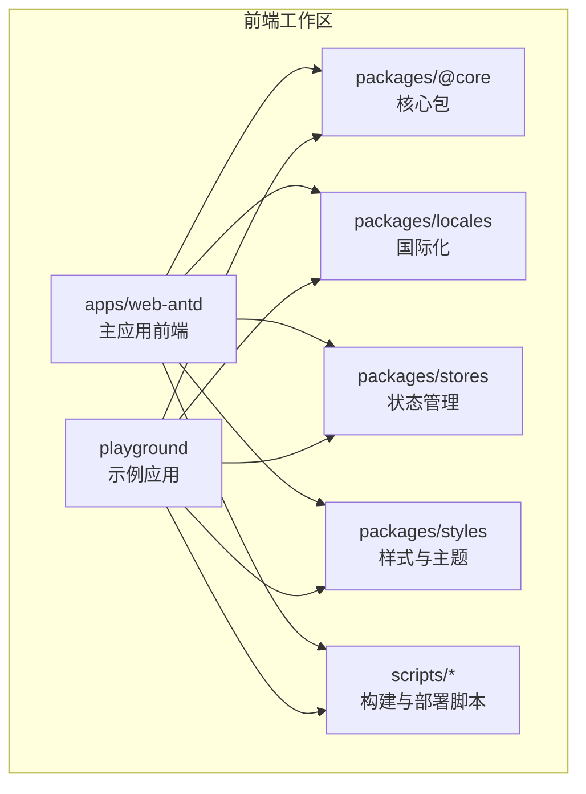
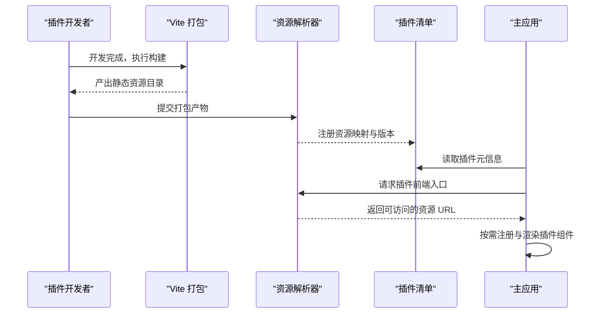
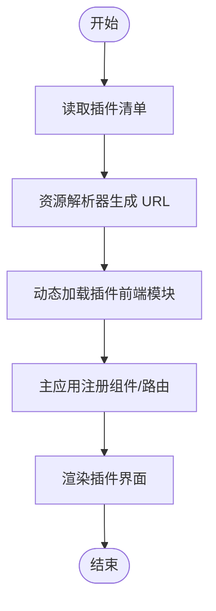
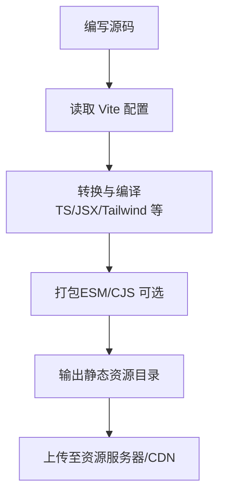
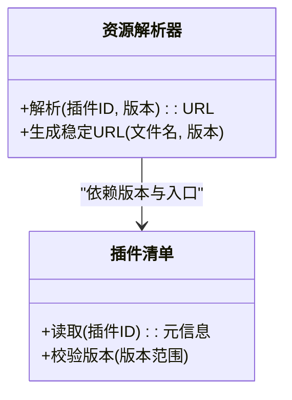
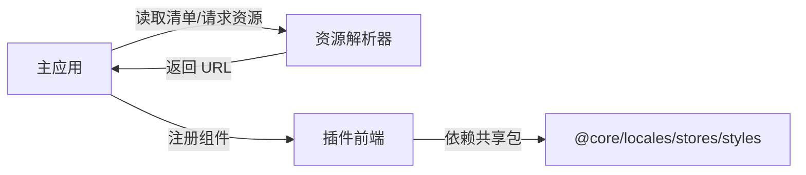

# 前端集成开发

<cite>
**本文引用的文件**
- [frontend_contract.py](file://backend/app/plugins/frontend_contract.py)
- [asset_resolver.py](file://backend/app/plugins/asset_resolver.py)
- [manifest.py](file://backend/app/plugins/manifest.py)
- [vite.config.mts（web-antd）](file://frontend/apps/web-antd/vite.config.mts)
- [vite.config.mts（playground）](file://frontend/playground/vite.config.mts)
- [index.ts（novusdoc 插件前端）](file://backend/plugins/novusdoc/frontend/src/index.ts)
- [index.ts（slider-captcha 插件前端）](file://backend/plugins/slider-captcha/frontend/src/index.ts)
- [index.ts（weather-widget 插件前端）](file://backend/plugins/weather-widget/frontend/src/index.ts)
- [package.json（web-antd 应用）](file://frontend/apps/web-antd/package.json)
- [package.json（playground 应用）](file://frontend/playground/package.json)
- [README.md（前端仓库总览）](file://frontend/README.md)
- [README.md（项目总览）](file://README.md)
</cite>

## 目录
1. [引言](#引言)
2. [项目结构](#项目结构)
3. [核心组件](#核心组件)
4. [架构总览](#架构总览)
5. [详细组件分析](#详细组件分析)
6. [依赖关系分析](#依赖关系分析)
7. [性能考虑](#性能考虑)
8. [故障排查指南](#故障排查指南)
9. [结论](#结论)
10. [附录](#附录)

## 引言
本指南面向需要在主应用中集成“插件前端”的开发者，系统阐述插件前端的架构设计、构建流程、资源管理、打包与版本管理、与主应用的集成方式（组件注册与样式隔离）、国际化支持、主题定制与响应式设计、性能优化与缓存策略、以及懒加载实现。文档以仓库中的实际实现为依据，提供可操作的开发步骤与最佳实践。

## 项目结构
前端采用多包工作区（workspace）组织，包含：
- web-antd：主应用前端，基于 Vite 构建，使用 TypeScript 和 TailwindCSS 配置。
- playground：示例/试验性前端应用，便于快速验证组件与功能。
- packages：共享包，如 @core、locales、stores、styles 等，供应用与插件复用。
- scripts：构建与部署脚本，包含部署、运行与工具链脚本。
- 内部配置：lint、tailwind、tsconfig、vite 配置等。

图表来源
- [vite.config.mts（web-antd）](file://frontend/apps/web-antd/vite.config.mts)
- [vite.config.mts（playground）](file://frontend/playground/vite.config.mts)
- [package.json（web-antd 应用）](file://frontend/apps/web-antd/package.json)
- [package.json（playground 应用）](file://frontend/playground/package.json)

章节来源
- [README.md（前端仓库总览）](file://frontend/README.md)
- [README.md（项目总览）](file://README.md)

## 核心组件
围绕插件前端集成的关键后端组件如下：
- 前端契约（frontend_contract.py）：定义插件前端暴露给主应用的接口与约定，确保主应用能正确加载与渲染插件组件。
- 资源解析器（asset_resolver.py）：负责解析插件打包后的静态资源路径，生成可被主应用访问的资源 URL。
- 插件清单（manifest.py）：描述插件元数据、前端入口、依赖与版本信息，用于主应用在运行时识别与加载插件。

章节来源
- [frontend_contract.py](file://backend/app/plugins/frontend_contract.py)
- [asset_resolver.py](file://backend/app/plugins/asset_resolver.py)
- [manifest.py](file://backend/app/plugins/manifest.py)

## 架构总览
下图展示了插件前端从打包到主应用加载的整体流程：插件前端在独立目录中开发与构建；打包后由资源解析器生成稳定 URL；主应用通过插件清单读取入口与元信息，并按需注册与渲染插件组件。

图表来源
- [frontend_contract.py](file://backend/app/plugins/frontend_contract.py)
- [asset_resolver.py](file://backend/app/plugins/asset_resolver.py)
- [manifest.py](file://backend/app/plugins/manifest.py)

## 详细组件分析

### 插件前端入口与注册
- 插件前端通常在各自插件目录下的 frontend/src 中提供入口文件（如 index.ts），导出组件或初始化函数，供主应用调用。
- 主应用通过插件清单与资源解析器，动态加载插件前端模块，并将其注册到路由或业务区域。

图表来源
- [manifest.py](file://backend/app/plugins/manifest.py)
- [asset_resolver.py](file://backend/app/plugins/asset_resolver.py)
- [index.ts（novusdoc 插件前端）](file://backend/plugins/novusdoc/frontend/src/index.ts)
- [index.ts（slider-captcha 插件前端）](file://backend/plugins/slider-captcha/frontend/src/index.ts)
- [index.ts（weather-widget 插件前端）](file://backend/plugins/weather-widget/frontend/src/index.ts)

章节来源
- [index.ts（novusdoc 插件前端）](file://backend/plugins/novusdoc/frontend/src/index.ts)
- [index.ts（slider-captcha 插件前端）](file://backend/plugins/slider-captcha/frontend/src/index.ts)
- [index.ts（weather-widget 插件前端）](file://backend/plugins/weather-widget/frontend/src/index.ts)

### 构建与打包机制
- 使用 Vite 进行构建，支持 TypeScript、ES 模块与现代浏览器特性。
- 构建配置分别位于 web-antd 与 playground 的 vite.config.mts，可按需扩展别名、插件与输出策略。
- 包管理使用 pnpm 工作区，各应用与包通过 package.json 组织依赖与脚本。

图表来源
- [vite.config.mts（web-antd）](file://frontend/apps/web-antd/vite.config.mts)
- [vite.config.mts（playground）](file://frontend/playground/vite.config.mts)
- [package.json（web-antd 应用）](file://frontend/apps/web-antd/package.json)
- [package.json（playground 应用）](file://frontend/playground/package.json)

章节来源
- [vite.config.mts（web-antd）](file://frontend/apps/web-antd/vite.config.mts)
- [vite.config.mts（playground）](file://frontend/playground/vite.config.mts)
- [package.json（web-antd 应用）](file://frontend/apps/web-antd/package.json)
- [package.json（playground 应用）](file://frontend/playground/package.json)

### 静态资源托管与版本管理
- 资源解析器负责将插件打包产物映射为稳定的访问 URL，避免因文件指纹变化导致的硬编码失效。
- 插件清单记录版本号、入口点与依赖，主应用据此进行兼容性校验与选择性加载。

图表来源
- [asset_resolver.py](file://backend/app/plugins/asset_resolver.py)
- [manifest.py](file://backend/app/plugins/manifest.py)

章节来源
- [asset_resolver.py](file://backend/app/plugins/asset_resolver.py)
- [manifest.py](file://backend/app/plugins/manifest.py)

### 国际化支持
- 国际化资源位于 packages/locales，主应用与插件均通过统一的 i18n 接口加载语言包。
- 插件前端应遵循命名空间与键规范，避免与主应用或其他插件冲突。

章节来源
- [README.md（前端仓库总览）](file://frontend/README.md)

### 主题定制与响应式设计
- 样式与主题位于 packages/styles，结合 TailwindCSS 实现响应式布局与主题切换。
- 插件前端应在自身作用域内使用局部样式或 CSS Modules，避免全局污染。

章节来源
- [README.md（前端仓库总览）](file://frontend/README.md)

### 组件注册与样式冲突解决
- 主应用通过路由或业务区域注册插件组件，建议使用动态导入与命名空间隔离。
- 样式冲突可通过 CSS Modules、CSS-in-JS 或 Shadow DOM 解决，同时保持与主应用主题一致。

章节来源
- [frontend_contract.py](file://backend/app/plugins/frontend_contract.py)

## 依赖关系分析
- 主应用与插件之间通过“插件清单 + 资源解析器”解耦，降低直接依赖。
- 插件前端依赖共享包（@core、locales、stores、styles），保证一致性与复用性。
- 构建工具链（Vite、pnpm）统一管理依赖与脚本，减少环境差异。

图表来源
- [frontend_contract.py](file://backend/app/plugins/frontend_contract.py)
- [asset_resolver.py](file://backend/app/plugins/asset_resolver.py)
- [manifest.py](file://backend/app/plugins/manifest.py)

章节来源
- [frontend_contract.py](file://backend/app/plugins/frontend_contract.py)
- [asset_resolver.py](file://backend/app/plugins/asset_resolver.py)
- [manifest.py](file://backend/app/plugins/manifest.py)

## 性能考虑
- 懒加载：使用动态 import 将插件前端作为异步模块加载，减少首屏体积。
- 缓存策略：静态资源启用长缓存与版本指纹，更新时通过新 URL 生效。
- 体积控制：拆分插件前端为独立包，按需引入；使用 Tree Shaking 与按需加载 UI 组件。
- 并行构建：利用 pnpm 工作区与 Vite 的热更新能力提升开发效率。

## 故障排查指南
- 插件无法加载：检查插件清单版本与资源 URL 是否匹配；确认资源解析器已注册该版本。
- 样式冲突：检查插件是否使用全局样式；建议迁移到 CSS Modules 或作用域样式。
- 国际化缺失：核对语言包键值是否存在；确保命名空间不重复。
- 构建失败：检查 Vite 配置与依赖版本；确保 pnpm 工作区链接正常。

章节来源
- [asset_resolver.py](file://backend/app/plugins/asset_resolver.py)
- [manifest.py](file://backend/app/plugins/manifest.py)

## 结论
通过“插件清单 + 资源解析器 + 动态加载”的架构，主应用可以安全、可控地集成插件前端。配合统一的国际化、主题与样式体系，以及完善的构建与缓存策略，能够实现高性能、可维护的前端插件生态。

## 附录
- 完整前端集成示例（步骤说明）
  1) 在插件目录下创建 frontend/src 入口文件，导出组件或初始化函数。
     - 示例路径参考：[index.ts（novusdoc 插件前端）](file://backend/plugins/novusdoc/frontend/src/index.ts)
  2) 在插件清单中声明入口、版本与依赖。
     - 参考：[manifest.py](file://backend/app/plugins/manifest.py)
  3) 使用 Vite 构建插件前端，生成静态资源。
     - 参考：[vite.config.mts（web-antd）](file://frontend/apps/web-antd/vite.config.mts)
  4) 通过资源解析器注册并生成可访问 URL。
     - 参考：[asset_resolver.py](file://backend/app/plugins/asset_resolver.py)
  5) 在主应用中按需动态加载并注册插件组件。
     - 参考：[frontend_contract.py](file://backend/app/plugins/frontend_contract.py)
  6) 集成 UI 库与交互逻辑，确保样式与主题一致。
     - 参考：[README.md（前端仓库总览）](file://frontend/README.md)