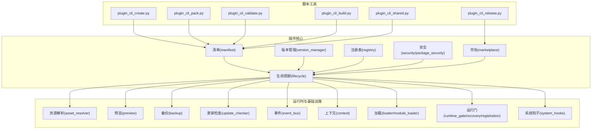
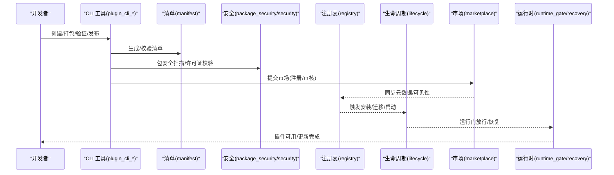
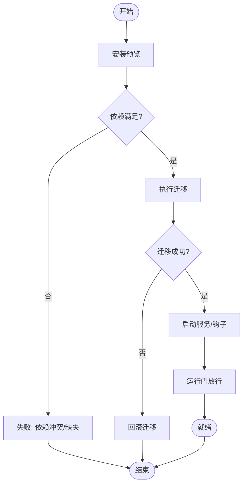
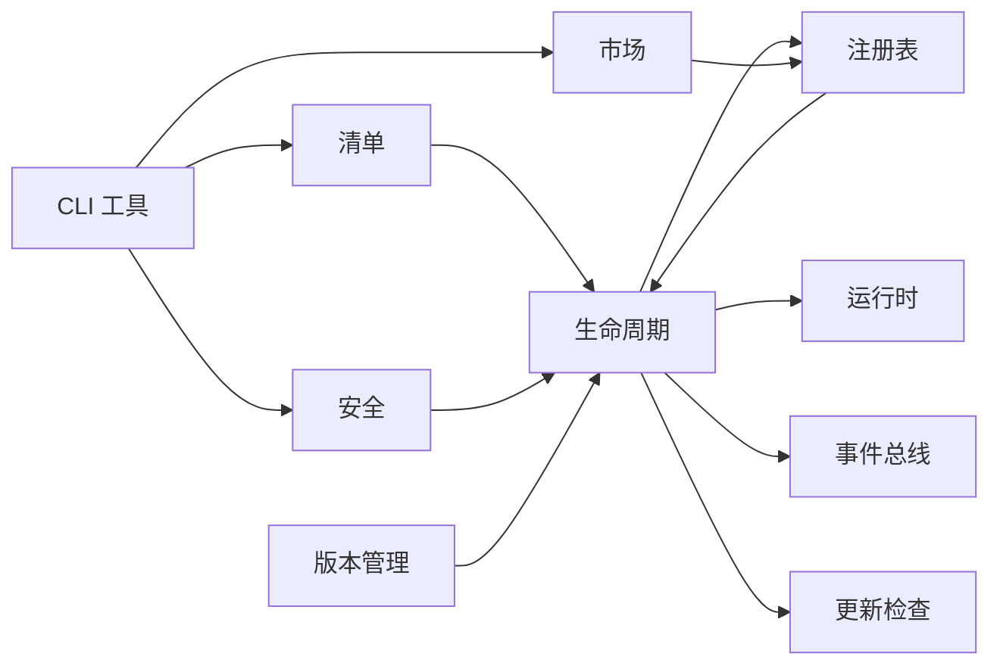

# 发布和分发

<cite>
**本文引用的文件**
- [backend/app/plugins/marketplace.py](file://backend/app/plugins/marketplace.py)
- [backend/app/plugins/manifest.py](file://backend/app/plugins/manifest.py)
- [backend/app/plugins/version_manager.py](file://backend/app/plugins/version_manager.py)
- [backend/app/plugins/lifecycle.py](file://backend/app/plugins/lifecycle.py)
- [backend/app/plugins/registry.py](file://backend/app/plugins/registry.py)
- [backend/app/plugins/security.py](file://backend/app/plugins/security.py)
- [backend/app/plugins/package_security.py](file://backend/app/plugins/package_security.py)
- [backend/app/plugins/update_checker.py](file://backend/app/plugins/update_checker.py)
- [backend/app/plugins/marketplace_registry/registry.json](file://backend/app/plugins/marketplace_registry/registry.json)
- [backend/scripts/plugin_cli_pack.py](file://backend/scripts/plugin_cli_pack.py)
- [backend/scripts/plugin_cli_release.py](file://backend/scripts/plugin_cli_release.py)
- [backend/scripts/plugin_cli_validate.py](file://backend/scripts/plugin_cli_validate.py)
- [backend/scripts/plugin_cli_create.py](file://backend/scripts/plugin_cli_create.py)
- [backend/scripts/plugin_cli_build.py](file://backend/scripts/plugin_cli_build.py)
- [backend/scripts/plugin_cli_shared.py](file://backend/scripts/plugin_cli_shared.py)
- [backend/app/plugins/manifest_helpers.py](file://backend/app/plugins/manifest_helpers.py)
- [backend/app/plugins/manifest_metadata_schemas.py](file://backend/app/plugins/manifest_metadata_schemas.py)
- [backend/app/plugins/asset_resolver.py](file://backend/app/plugins/asset_resolver.py)
- [backend/app/plugins/preview.py](file://backend/app/plugins/preview.py)
- [backend/app/plugins/backup.py](file://backend/app/plugins/backup.py)
- [backend/app/plugins/scheduler_refresh.py](file://backend/app/plugins/scheduler_refresh.py)
- [backend/app/plugins/system_hooks.py](file://backend/app/plugins/system_hooks.py)
- [backend/app/plugins/event_bus.py](file://backend/app/plugins/event_bus.py)
- [backend/app/plugins/context.py](file://backend/app/plugins/context.py)
- [backend/app/plugins/loader.py](file://backend/app/plugins/loader.py)
- [backend/app/plugins/module_loader.py](file://backend/app/plugins/module_loader.py)
- [backend/app/plugins/startup.py](file://backend/app/plugins/startup.py)
- [backend/app/plugins/runtime_gate.py](file://backend/app/plugins/runtime_gate.py)
- [backend/app/plugins/runtime_recovery.py](file://backend/app/plugins/runtime_recovery.py)
- [backend/app/plugins/runtime_registration.py](file://backend/app/plugins/runtime_registration.py)
- [backend/app/plugins/health.py](file://backend/app/plugins/health.py)
- [backend/app/plugins/license.py](file://backend/app/plugins/license.py)
- [backend/app/plugins/exposure_policy.py](file://backend/app/plugins/exposure_policy.py)
- [backend/app/plugins/feature_entitlement_guards.py](file://backend/app/plugins/feature_entitlement_guards.py)
- [backend/app/plugins/tenant_plan_preflight.py](file://backend/app/plugins/tenant_plan_preflight.py)
- [backend/app/plugins/webhook_dispatcher.py](file://backend/app/plugins/webhook_dispatcher.py)
- [backend/app/plugins/crypto.py](file://backend/app/plugins/crypto.py)
- [backend/app/plugins/sio_auth.py](file://backend/app/plugins/sio_auth.py)
- [backend/app/plugins/sse.py](file://backend/app/plugins/sse.py)
- [backend/app/plugins/progress.py](file://backend/app/plugins/progress.py)
- [backend/app/plugins/dependencies.py](file://backend/app/plugins/dependencies.py)
- [backend/app/plugins/exceptions.py](file://backend/app/plugins/exceptions.py)
- [backend/app/plugins/frontend_contract.py](file://backend/app/plugins/frontend_contract.py)
- [backend/app/plugins/frontend_contract_checks.py](file://backend/app/plugins/frontend_contract_checks.py)
- [backend/app/plugins/host_read_facade.py](file://backend/app/plugins/host_read_facade.py)
- [backend/app/plugins/lifecycle_installation.py](file://backend/app/plugins/lifecycle_installation.py)
- [backend/app/plugins/lifecycle_migrations.py](file://backend/app/plugins/lifecycle_migrations.py)
- [backend/app/plugins/lifecycle_orchestrator.py](file://backend/app/plugins/lifecycle_orchestrator.py)
- [backend/app/plugins/lifecycle_orchestrator_maintenance.py](file://backend/app/plugins/lifecycle_orchestrator_maintenance.py)
- [backend/app/plugins/lifecycle_runtime_state.py](file://backend/app/plugins/lifecycle_runtime_state.py)
- [backend/app/plugins/lifecycle_support.py](file://backend/app/plugins/lifecycle_support.py)
- [backend/app/plugins/lifecycle_guards.py](file://backend/app/plugins/lifecycle_guards.py)
- [backend/app/plugins/lifecycle_dependency_runtime.py](file://backend/app/plugins/lifecycle_dependency_runtime.py)
- [backend/app/plugins/_extension_registrar.py](file://backend/app/plugins/_extension_registrar.py)
- [backend/app/plugins/api_dispatcher.py](file://backend/app/plugins/api_dispatcher.py)
- [backend/app/plugins/context_factory.py](file://backend/app/plugins/context_factory.py)
- [backend/app/plugins/context_primitives.py](file://backend/app/plugins/context_primitives.py)
- [backend/app/plugins/asset_runtime.py](file://backend/app/plugins/asset_runtime.py)
- [backend/app/plugins/registry_read_layer.py](file://backend/app/plugins/registry_read_layer.py)
- [backend/app/plugins/registry_runtime_extensions.py](file://backend/app/plugins/registry_runtime_extensions.py)
- [backend/app/plugins/scope.py](file://backend/app/plugins/scope.py)
- [backend/app/plugins/security_scan.py](file://backend/app/plugins/security_scan.py)
- [backend/app/plugins/migration_paths.py](file://backend/app/plugins/migration_paths.py)
- [backend/app/plugins/lifecycle_parts/facade_modules.py](file://backend/app/plugins/lifecycle_parts/facade_modules.py)
</cite>

## 目录
1. [引言](#引言)
2. [项目结构](#项目结构)
3. [核心组件](#核心组件)
4. [架构总览](#架构总览)
5. [详细组件分析](#详细组件分析)
6. [依赖关系分析](#依赖关系分析)
7. [性能考量](#性能考量)
8. [故障排查指南](#故障排查指南)
9. [结论](#结论)
10. [附录](#附录)

## 引言
本指南面向插件开发者与平台管理员，系统阐述插件从开发到发布的完整流程，覆盖打包、规范与质量检查、版本管理与元数据配置、市场注册与审核、分发渠道与安装更新机制、兼容性与回滚策略，并提供可操作的命令行工具使用说明与示例步骤。

## 项目结构
后端插件子系统位于 backend/app/plugins，围绕“清单(manifest)、生命周期(lifecycle)、注册表(registry)、安全(security)、版本(version)、市场(marketplace)”六大维度构建。配套的脚本工具位于 backend/scripts，提供插件创建、打包、验证、发布等CLI能力。

图表来源
- [backend/app/plugins/manifest.py](file://backend/app/plugins/manifest.py)
- [backend/app/plugins/version_manager.py](file://backend/app/plugins/version_manager.py)
- [backend/app/plugins/lifecycle.py](file://backend/app/plugins/lifecycle.py)
- [backend/app/plugins/registry.py](file://backend/app/plugins/registry.py)
- [backend/app/plugins/security.py](file://backend/app/plugins/security.py)
- [backend/app/plugins/package_security.py](file://backend/app/plugins/package_security.py)
- [backend/app/plugins/marketplace.py](file://backend/app/plugins/marketplace.py)
- [backend/scripts/plugin_cli_create.py](file://backend/scripts/plugin_cli_create.py)
- [backend/scripts/plugin_cli_pack.py](file://backend/scripts/plugin_cli_pack.py)
- [backend/scripts/plugin_cli_validate.py](file://backend/scripts/plugin_cli_validate.py)
- [backend/scripts/plugin_cli_release.py](file://backend/scripts/plugin_cli_release.py)
- [backend/scripts/plugin_cli_build.py](file://backend/scripts/plugin_cli_build.py)
- [backend/scripts/plugin_cli_shared.py](file://backend/scripts/plugin_cli_shared.py)
- [backend/app/plugins/asset_resolver.py](file://backend/app/plugins/asset_resolver.py)
- [backend/app/plugins/preview.py](file://backend/app/plugins/preview.py)
- [backend/app/plugins/backup.py](file://backend/app/plugins/backup.py)
- [backend/app/plugins/update_checker.py](file://backend/app/plugins/update_checker.py)
- [backend/app/plugins/event_bus.py](file://backend/app/plugins/event_bus.py)
- [backend/app/plugins/context.py](file://backend/app/plugins/context.py)
- [backend/app/plugins/loader.py](file://backend/app/plugins/loader.py)
- [backend/app/plugins/module_loader.py](file://backend/app/plugins/module_loader.py)
- [backend/app/plugins/runtime_gate.py](file://backend/app/plugins/runtime_gate.py)
- [backend/app/plugins/runtime_recovery.py](file://backend/app/plugins/runtime_recovery.py)
- [backend/app/plugins/runtime_registration.py](file://backend/app/plugins/runtime_registration.py)
- [backend/app/plugins/system_hooks.py](file://backend/app/plugins/system_hooks.py)

章节来源
- [backend/app/plugins/manifest.py](file://backend/app/plugins/manifest.py)
- [backend/app/plugins/version_manager.py](file://backend/app/plugins/version_manager.py)
- [backend/app/plugins/lifecycle.py](file://backend/app/plugins/lifecycle.py)
- [backend/app/plugins/registry.py](file://backend/app/plugins/registry.py)
- [backend/app/plugins/security.py](file://backend/app/plugins/security.py)
- [backend/app/plugins/package_security.py](file://backend/app/plugins/package_security.py)
- [backend/app/plugins/marketplace.py](file://backend/app/plugins/marketplace.py)
- [backend/scripts/plugin_cli_create.py](file://backend/scripts/plugin_cli_create.py)
- [backend/scripts/plugin_cli_pack.py](file://backend/scripts/plugin_cli_pack.py)
- [backend/scripts/plugin_cli_validate.py](file://backend/scripts/plugin_cli_validate.py)
- [backend/scripts/plugin_cli_release.py](file://backend/scripts/plugin_cli_release.py)
- [backend/scripts/plugin_cli_build.py](file://backend/scripts/plugin_cli_build.py)
- [backend/scripts/plugin_cli_shared.py](file://backend/scripts/plugin_cli_shared.py)

## 核心组件
- 清单与元数据：定义插件标识、版本、依赖、暴露接口、前端合约、许可等关键信息，是打包与发布的基础。
- 生命周期：负责插件的安装、迁移、启动、维护、卸载全流程编排与状态管理。
- 注册表：维护已安装插件的索引、作用域与可见性，支持查询与运行时扩展。
- 安全：提供包级安全扫描、许可证校验、加密与密钥管理、权限与功能配额守卫。
- 版本管理：统一版本语义、锁定与升级策略，保障兼容性与可回滚性。
- 市场：对接插件市场注册、审核与发布策略，支持元数据同步与分发。
- 脚本工具：提供创建模板、打包加固、验证清单、发布与构建的CLI能力。

章节来源
- [backend/app/plugins/manifest.py](file://backend/app/plugins/manifest.py)
- [backend/app/plugins/version_manager.py](file://backend/app/plugins/version_manager.py)
- [backend/app/plugins/lifecycle.py](file://backend/app/plugins/lifecycle.py)
- [backend/app/plugins/registry.py](file://backend/app/plugins/registry.py)
- [backend/app/plugins/security.py](file://backend/app/plugins/security.py)
- [backend/app/plugins/package_security.py](file://backend/app/plugins/package_security.py)
- [backend/app/plugins/marketplace.py](file://backend/app/plugins/marketplace.py)
- [backend/scripts/plugin_cli_create.py](file://backend/scripts/plugin_cli_create.py)
- [backend/scripts/plugin_cli_pack.py](file://backend/scripts/plugin_cli_pack.py)
- [backend/scripts/plugin_cli_validate.py](file://backend/scripts/plugin_cli_validate.py)
- [backend/scripts/plugin_cli_release.py](file://backend/scripts/plugin_cli_release.py)
- [backend/scripts/plugin_cli_build.py](file://backend/scripts/plugin_cli_build.py)
- [backend/scripts/plugin_cli_shared.py](file://backend/scripts/plugin_cli_shared.py)

## 架构总览
下图展示从“清单生成”到“市场发布”的端到端流程，以及与运行时、安全、版本、注册表的交互。

图表来源
- [backend/scripts/plugin_cli_create.py](file://backend/scripts/plugin_cli_create.py)
- [backend/scripts/plugin_cli_pack.py](file://backend/scripts/plugin_cli_pack.py)
- [backend/scripts/plugin_cli_validate.py](file://backend/scripts/plugin_cli_validate.py)
- [backend/scripts/plugin_cli_release.py](file://backend/scripts/plugin_cli_release.py)
- [backend/app/plugins/manifest.py](file://backend/app/plugins/manifest.py)
- [backend/app/plugins/package_security.py](file://backend/app/plugins/package_security.py)
- [backend/app/plugins/security.py](file://backend/app/plugins/security.py)
- [backend/app/plugins/registry.py](file://backend/app/plugins/registry.py)
- [backend/app/plugins/lifecycle.py](file://backend/app/plugins/lifecycle.py)
- [backend/app/plugins/marketplace.py](file://backend/app/plugins/marketplace.py)
- [backend/app/plugins/runtime_gate.py](file://backend/app/plugins/runtime_gate.py)
- [backend/app/plugins/runtime_recovery.py](file://backend/app/plugins/runtime_recovery.py)

## 详细组件分析

### 清单与元数据（Manifest）
- 职责：定义插件标识、版本、作者、许可、依赖、前端合约、资产、暴露策略、运行时参数等。
- 关键点：清单校验、元数据模式、与市场注册表字段映射、与运行时契约一致性。
- 复杂度：O(n) 遍历与校验，n为清单字段数量；序列化/反序列化开销低。
- 优化：缓存校验结果、增量校验、并行字段校验。
- 错误处理：字段缺失、类型不匹配、版本格式错误、依赖循环检测。
- 性能影响：清单解析在安装前执行，耗时短但需保证幂等与快速失败。

章节来源
- [backend/app/plugins/manifest.py](file://backend/app/plugins/manifest.py)
- [backend/app/plugins/manifest_helpers.py](file://backend/app/plugins/manifest_helpers.py)
- [backend/app/plugins/manifest_metadata_schemas.py](file://backend/app/plugins/manifest_metadata_schemas.py)
- [backend/app/plugins/marketplace_registry/registry.json](file://backend/app/plugins/marketplace_registry/registry.json)

### 生命周期（Lifecycle）
- 职责：安装、迁移、启动、维护、卸载的编排；状态机与守卫；依赖运行时；事件驱动。
- 关键点：安装预览、迁移路径、运行时状态、维护任务刷新、异常恢复。
- 复杂度：安装/卸载 O(d)（d为依赖数）；迁移 O(m)（m为迁移条目）。
- 优化：并行依赖解析、增量迁移、失败重试与原子回滚。
- 错误处理：依赖冲突、迁移失败、运行时异常、锁竞争。
- 性能影响：I/O 密集（数据库迁移、文件系统），CPU 轻量。

图表来源
- [backend/app/plugins/lifecycle.py](file://backend/app/plugins/lifecycle.py)
- [backend/app/plugins/lifecycle_installation.py](file://backend/app/plugins/lifecycle_installation.py)
- [backend/app/plugins/lifecycle_migrations.py](file://backend/app/plugins/lifecycle_migrations.py)
- [backend/app/plugins/lifecycle_orchestrator.py](file://backend/app/plugins/lifecycle_orchestrator.py)
- [backend/app/plugins/lifecycle_orchestrator_maintenance.py](file://backend/app/plugins/lifecycle_orchestrator_maintenance.py)
- [backend/app/plugins/lifecycle_runtime_state.py](file://backend/app/plugins/lifecycle_runtime_state.py)
- [backend/app/plugins/lifecycle_support.py](file://backend/app/plugins/lifecycle_support.py)
- [backend/app/plugins/lifecycle_guards.py](file://backend/app/plugins/lifecycle_guards.py)
- [backend/app/plugins/lifecycle_dependency_runtime.py](file://backend/app/plugins/lifecycle_dependency_runtime.py)
- [backend/app/plugins/scheduler_refresh.py](file://backend/app/plugins/scheduler_refresh.py)

章节来源
- [backend/app/plugins/lifecycle.py](file://backend/app/plugins/lifecycle.py)
- [backend/app/plugins/lifecycle_installation.py](file://backend/app/plugins/lifecycle_installation.py)
- [backend/app/plugins/lifecycle_migrations.py](file://backend/app/plugins/lifecycle_migrations.py)
- [backend/app/plugins/lifecycle_orchestrator.py](file://backend/app/plugins/lifecycle_orchestrator.py)
- [backend/app/plugins/lifecycle_orchestrator_maintenance.py](file://backend/app/plugins/lifecycle_orchestrator_maintenance.py)
- [backend/app/plugins/lifecycle_runtime_state.py](file://backend/app/plugins/lifecycle_runtime_state.py)
- [backend/app/plugins/lifecycle_support.py](file://backend/app/plugins/lifecycle_support.py)
- [backend/app/plugins/lifecycle_guards.py](file://backend/app/plugins/lifecycle_guards.py)
- [backend/app/plugins/lifecycle_dependency_runtime.py](file://backend/app/plugins/lifecycle_dependency_runtime.py)
- [backend/app/plugins/scheduler_refresh.py](file://backend/app/plugins/scheduler_refresh.py)

### 注册表（Registry）
- 职责：维护插件索引、作用域、可见性、运行时扩展点；提供查询与读层封装。
- 关键点：租户/全局作用域、可见性策略、运行时扩展注册。
- 复杂度：查询 O(1)/O(log n)，写入 O(1)；扩展注册 O(k)（k为扩展点数）。
- 优化：缓存热点查询、批量写入、索引优化。
- 错误处理：重复注册、作用域冲突、扩展点缺失。
- 性能影响：高并发查询场景下的读写锁与缓存命中率。

章节来源
- [backend/app/plugins/registry.py](file://backend/app/plugins/registry.py)
- [backend/app/plugins/registry_read_layer.py](file://backend/app/plugins/registry_read_layer.py)
- [backend/app/plugins/registry_runtime_extensions.py](file://backend/app/plugins/registry_runtime_extensions.py)
- [backend/app/plugins/scope.py](file://backend/app/plugins/scope.py)

### 安全与合规（Security & Package Security）
- 职责：包级安全扫描、许可证校验、加密与密钥管理、权限与功能配额守卫。
- 关键点：依赖漏洞扫描、许可证白名单/黑名单、密钥存储与轮换、运行时访问控制。
- 复杂度：扫描 O(e)（e为依赖项），校验 O(1) 每项；加密/解密轻量。
- 优化：缓存扫描结果、异步扫描、增量校验。
- 错误处理：扫描失败、许可证不合规、密钥失效、权限不足。
- 性能影响：I/O 密集（外部仓库/许可证数据库），CPU 轻量。

章节来源
- [backend/app/plugins/security.py](file://backend/app/plugins/security.py)
- [backend/app/plugins/package_security.py](file://backend/app/plugins/package_security.py)
- [backend/app/plugins/license.py](file://backend/app/plugins/license.py)
- [backend/app/plugins/crypto.py](file://backend/app/plugins/crypto.py)
- [backend/app/plugins/exposure_policy.py](file://backend/app/plugins/exposure_policy.py)
- [backend/app/plugins/feature_entitlement_guards.py](file://backend/app/plugins/feature_entitlement_guards.py)
- [backend/app/plugins/tenant_plan_preflight.py](file://backend/app/plugins/tenant_plan_preflight.py)

### 版本管理（Version Manager）
- 职责：统一版本语义、锁定策略、升级与降级、兼容性矩阵。
- 关键点：语义化版本、向后兼容检查、锁定当前版本、回滚策略。
- 复杂度：比较 O(1)，选择最佳版本 O(n)（候选数）。
- 优化：版本索引、缓存兼容性判断。
- 错误处理：版本冲突、不兼容升级、锁定失败。
- 性节来源
- [backend/app/plugins/version_manager.py](file://backend/app/plugins/version_manager.py)

### 市场与分发（Marketplace）
- 职责：市场注册、元数据同步、审核策略、发布策略、分发渠道。
- 关键点：注册表映射、审核标准、发布状态、分发与安装入口。
- 复杂度：同步 O(m)（m为元数据字段），发布 O(1)。
- 优化：批量同步、异步队列、幂等写入。
- 错误处理：注册失败、字段不合法、审核拒绝。
- 性能影响：网络I/O（外部市场API），本地处理轻量。

章节来源
- [backend/app/plugins/marketplace.py](file://backend/app/plugins/marketplace.py)
- [backend/app/plugins/marketplace_registry/registry.json](file://backend/app/plugins/marketplace_registry/registry.json)

### 脚本工具（CLI）
- 职责：创建模板、打包加固、验证清单、发布与构建。
- 关键点：命令解析、模板渲染、清单校验、签名/加固、发布提交。
- 复杂度：I/O 密集（文件系统/网络），CPU 轻量。
- 优化：并行处理、缓存模板、增量打包。
- 错误处理：模板缺失、清单无效、网络超时、签名失败。
- 性能影响：打包与发布是离线操作，注意磁盘与网络带宽。

章节来源
- [backend/scripts/plugin_cli_create.py](file://backend/scripts/plugin_cli_create.py)
- [backend/scripts/plugin_cli_pack.py](file://backend/scripts/plugin_cli_pack.py)
- [backend/scripts/plugin_cli_validate.py](file://backend/scripts/plugin_cli_validate.py)
- [backend/scripts/plugin_cli_release.py](file://backend/scripts/plugin_cli_release.py)
- [backend/scripts/plugin_cli_build.py](file://backend/scripts/plugin_cli_build.py)
- [backend/scripts/plugin_cli_shared.py](file://backend/scripts/plugin_cli_shared.py)

### 运行时与基础设施
- 资源解析：静态资源与动态资产解析。
- 预览：安装前预览变更，降低风险。
- 备份：安装/升级前自动备份。
- 更新检查：定期检查可用更新。
- 事件总线：插件间与系统事件通信。
- 上下文：运行时上下文工厂与原语。
- 加载器：模块与扩展加载。
- 运行门/恢复/注册：运行时准入、异常恢复、注册与扩展。
- 系统钩子：系统级生命周期钩子。

章节来源
- [backend/app/plugins/asset_resolver.py](file://backend/app/plugins/asset_resolver.py)
- [backend/app/plugins/preview.py](file://backend/app/plugins/preview.py)
- [backend/app/plugins/backup.py](file://backend/app/plugins/backup.py)
- [backend/app/plugins/update_checker.py](file://backend/app/plugins/update_checker.py)
- [backend/app/plugins/event_bus.py](file://backend/app/plugins/event_bus.py)
- [backend/app/plugins/context.py](file://backend/app/plugins/context.py)
- [backend/app/plugins/context_factory.py](file://backend/app/plugins/context_factory.py)
- [backend/app/plugins/context_primitives.py](file://backend/app/plugins/context_primitives.py)
- [backend/app/plugins/loader.py](file://backend/app/plugins/loader.py)
- [backend/app/plugins/module_loader.py](file://backend/app/plugins/module_loader.py)
- [backend/app/plugins/runtime_gate.py](file://backend/app/plugins/runtime_gate.py)
- [backend/app/plugins/runtime_recovery.py](file://backend/app/plugins/runtime_recovery.py)
- [backend/app/plugins/runtime_registration.py](file://backend/app/plugins/runtime_registration.py)
- [backend/app/plugins/system_hooks.py](file://backend/app/plugins/system_hooks.py)

## 依赖关系分析
- 组件耦合：清单对生命周期强依赖；生命周期对注册表、安全、版本管理有跨模块依赖；市场通过注册表与生命周期联动。
- 直接依赖：CLI 工具依赖清单与安全模块；运行时依赖注册表与生命周期；更新检查依赖版本管理。
- 外部依赖：许可证数据库、外部仓库、市场API。
- 循环依赖：未见直接循环，但需避免清单校验与安全扫描互相触发死循环。

图表来源
- [backend/scripts/plugin_cli_pack.py](file://backend/scripts/plugin_cli_pack.py)
- [backend/app/plugins/manifest.py](file://backend/app/plugins/manifest.py)
- [backend/app/plugins/security.py](file://backend/app/plugins/security.py)
- [backend/app/plugins/package_security.py](file://backend/app/plugins/package_security.py)
- [backend/app/plugins/marketplace.py](file://backend/app/plugins/marketplace.py)
- [backend/app/plugins/version_manager.py](file://backend/app/plugins/version_manager.py)
- [backend/app/plugins/registry.py](file://backend/app/plugins/registry.py)
- [backend/app/plugins/lifecycle.py](file://backend/app/plugins/lifecycle.py)
- [backend/app/plugins/event_bus.py](file://backend/app/plugins/event_bus.py)
- [backend/app/plugins/update_checker.py](file://backend/app/plugins/update_checker.py)

章节来源
- [backend/app/plugins/manifest.py](file://backend/app/plugins/manifest.py)
- [backend/app/plugins/version_manager.py](file://backend/app/plugins/version_manager.py)
- [backend/app/plugins/lifecycle.py](file://backend/app/plugins/lifecycle.py)
- [backend/app/plugins/registry.py](file://backend/app/plugins/registry.py)
- [backend/app/plugins/security.py](file://backend/app/plugins/security.py)
- [backend/app/plugins/package_security.py](file://backend/app/plugins/package_security.py)
- [backend/app/plugins/marketplace.py](file://backend/app/plugins/marketplace.py)
- [backend/scripts/plugin_cli_pack.py](file://backend/scripts/plugin_cli_pack.py)

## 性能考量
- 打包阶段：I/O 密集，建议并行压缩与签名；避免重复扫描。
- 安装阶段：数据库迁移与文件系统操作为主，建议批量事务与增量迁移。
- 运行阶段：注册表查询与事件总线广播可能成为瓶颈，建议缓存与限流。
- 市场同步：异步队列与幂等写入，避免频繁同步导致抖动。
- 安全扫描：缓存扫描结果，仅对新增依赖重新扫描。

## 故障排查指南
- 清单校验失败：检查必填字段、版本格式、依赖声明是否正确。
- 安装失败：查看迁移日志、依赖冲突、锁竞争；必要时回滚。
- 安全扫描告警：确认许可证合规、依赖无已知漏洞；更新扫描规则。
- 市场提交失败：核对元数据与注册表字段映射、网络连通性。
- 运行异常：检查运行门策略、恢复流程、事件总线订阅。
- 版本升级问题：确认兼容性矩阵、锁定策略与回滚计划。

章节来源
- [backend/app/plugins/exceptions.py](file://backend/app/plugins/exceptions.py)
- [backend/app/plugins/lifecycle_guards.py](file://backend/app/plugins/lifecycle_guards.py)
- [backend/app/plugins/runtime_recovery.py](file://backend/app/plugins/runtime_recovery.py)
- [backend/app/plugins/security_scan.py](file://backend/app/plugins/security_scan.py)
- [backend/app/plugins/update_checker.py](file://backend/app/plugins/update_checker.py)

## 结论
通过“清单—生命周期—注册表—安全—版本—市场—CLI工具”的闭环体系，插件发布与分发实现了标准化、自动化与可审计。遵循本文流程与最佳实践，可显著提升发布效率与质量，降低运维风险。

## 附录

### 发布与分发流程示例（命令行）
以下为典型发布步骤，具体命令以脚本实现为准：

- 创建插件模板
  - 使用创建脚本生成基础目录与文件结构，确保清单字段齐全。
  - 参考路径：[backend/scripts/plugin_cli_create.py](file://backend/scripts/plugin_cli_create.py)

- 编写与校验清单
  - 生成/编辑清单，确保版本、依赖、前端合约、许可等字段正确。
  - 参考路径：[backend/app/plugins/manifest.py](file://backend/app/plugins/manifest.py)
  - 参考路径：[backend/app/plugins/manifest_helpers.py](file://backend/app/plugins/manifest_helpers.py)
  - 参考路径：[backend/app/plugins/manifest_metadata_schemas.py](file://backend/app/plugins/manifest_metadata_schemas.py)

- 打包与加固
  - 执行打包脚本，进行资源收集、压缩与签名/加固。
  - 参考路径：[backend/scripts/plugin_cli_pack.py](file://backend/scripts/plugin_cli_pack.py)

- 质量检查
  - 使用验证脚本对清单与包进行安全扫描与合规检查。
  - 参考路径：[backend/scripts/plugin_cli_validate.py](file://backend/scripts/plugin_cli_validate.py)
  - 参考路径：[backend/app/plugins/package_security.py](file://backend/app/plugins/package_security.py)
  - 参考路径：[backend/app/plugins/security.py](file://backend/app/plugins/security.py)

- 发布到市场
  - 使用发布脚本提交至市场，等待审核与同步。
  - 参考路径：[backend/scripts/plugin_cli_release.py](file://backend/scripts/plugin_cli_release.py)
  - 参考路径：[backend/app/plugins/marketplace.py](file://backend/app/plugins/marketplace.py)
  - 参考路径：[backend/app/plugins/marketplace_registry/registry.json](file://backend/app/plugins/marketplace_registry/registry.json)

- 构建与集成
  - 如需构建产物，使用构建脚本生成最终制品。
  - 参考路径：[backend/scripts/plugin_cli_build.py](file://backend/scripts/plugin_cli_build.py)
  - 参考路径：[backend/scripts/plugin_cli_shared.py](file://backend/scripts/plugin_cli_shared.py)

### 用户安装与更新指引
- 安装方式
  - 通过市场或注册表触发安装，系统自动执行生命周期安装与迁移。
  - 参考路径：[backend/app/plugins/lifecycle_installation.py](file://backend/app/plugins/lifecycle_installation.py)
  - 参考路径：[backend/app/plugins/registry.py](file://backend/app/plugins/registry.py)

- 更新机制
  - 系统定期检查可用更新，按版本策略执行升级或降级。
  - 参考路径：[backend/app/plugins/update_checker.py](file://backend/app/plugins/update_checker.py)
  - 参考路径：[backend/app/plugins/version_manager.py](file://backend/app/plugins/version_manager.py)

- 回滚策略
  - 安装/升级前自动备份，失败时触发恢复流程。
  - 参考路径：[backend/app/plugins/backup.py](file://backend/app/plugins/backup.py)
  - 参考路径：[backend/app/plugins/runtime_recovery.py](file://backend/app/plugins/runtime_recovery.py)

### 兼容性管理
- 版本策略：采用语义化版本，严格向后兼容；重大变更需新主版本。
- 元数据映射：确保清单字段与市场注册表一致，避免发布失败。
- 运行时契约：前端合约与暴露策略需与运行时一致，防止运行期错误。

章节来源
- [backend/scripts/plugin_cli_create.py](file://backend/scripts/plugin_cli_create.py)
- [backend/scripts/plugin_cli_pack.py](file://backend/scripts/plugin_cli_pack.py)
- [backend/scripts/plugin_cli_validate.py](file://backend/scripts/plugin_cli_validate.py)
- [backend/scripts/plugin_cli_release.py](file://backend/scripts/plugin_cli_release.py)
- [backend/scripts/plugin_cli_build.py](file://backend/scripts/plugin_cli_build.py)
- [backend/scripts/plugin_cli_shared.py](file://backend/scripts/plugin_cli_shared.py)
- [backend/app/plugins/manifest.py](file://backend/app/plugins/manifest.py)
- [backend/app/plugins/manifest_helpers.py](file://backend/app/plugins/manifest_helpers.py)
- [backend/app/plugins/manifest_metadata_schemas.py](file://backend/app/plugins/manifest_metadata_schemas.py)
- [backend/app/plugins/marketplace.py](file://backend/app/plugins/marketplace.py)
- [backend/app/plugins/marketplace_registry/registry.json](file://backend/app/plugins/marketplace_registry/registry.json)
- [backend/app/plugins/version_manager.py](file://backend/app/plugins/version_manager.py)
- [backend/app/plugins/lifecycle_installation.py](file://backend/app/plugins/lifecycle_installation.py)
- [backend/app/plugins/registry.py](file://backend/app/plugins/registry.py)
- [backend/app/plugins/update_checker.py](file://backend/app/plugins/update_checker.py)
- [backend/app/plugins/backup.py](file://backend/app/plugins/backup.py)
- [backend/app/plugins/runtime_recovery.py](file://backend/app/plugins/runtime_recovery.py)