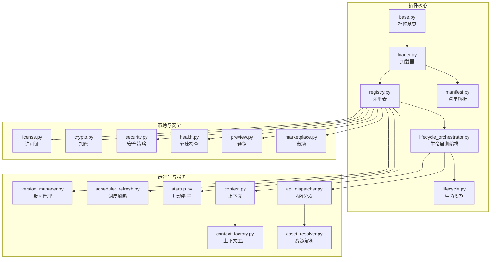
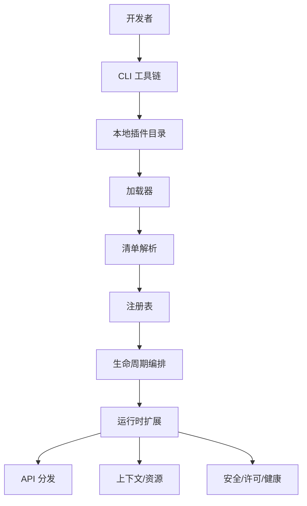
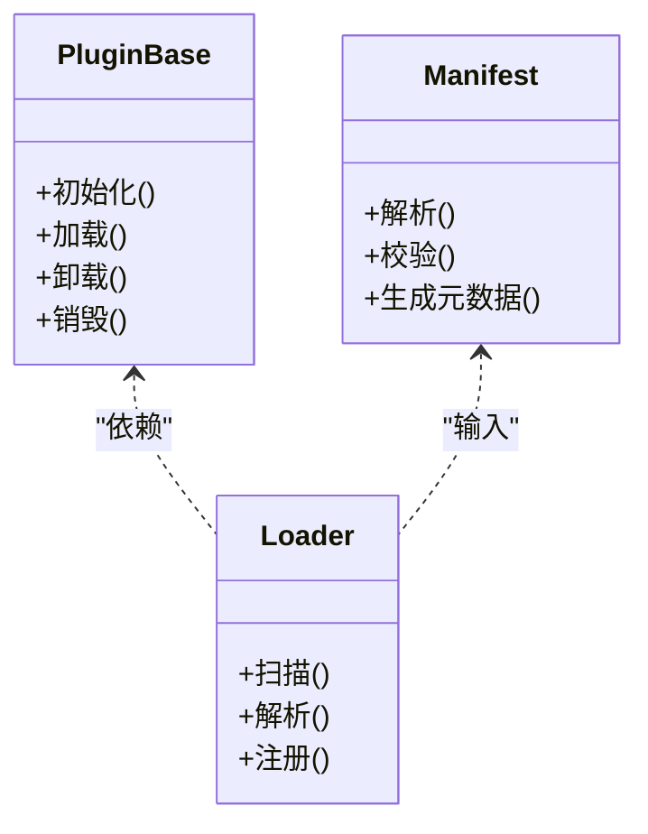
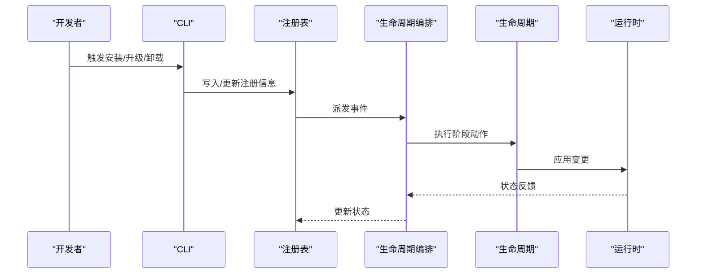
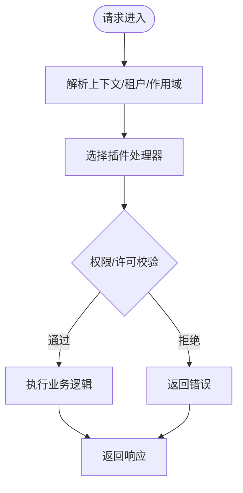
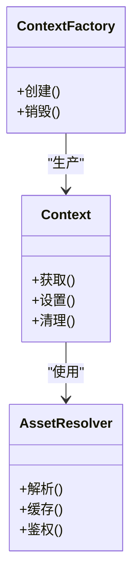
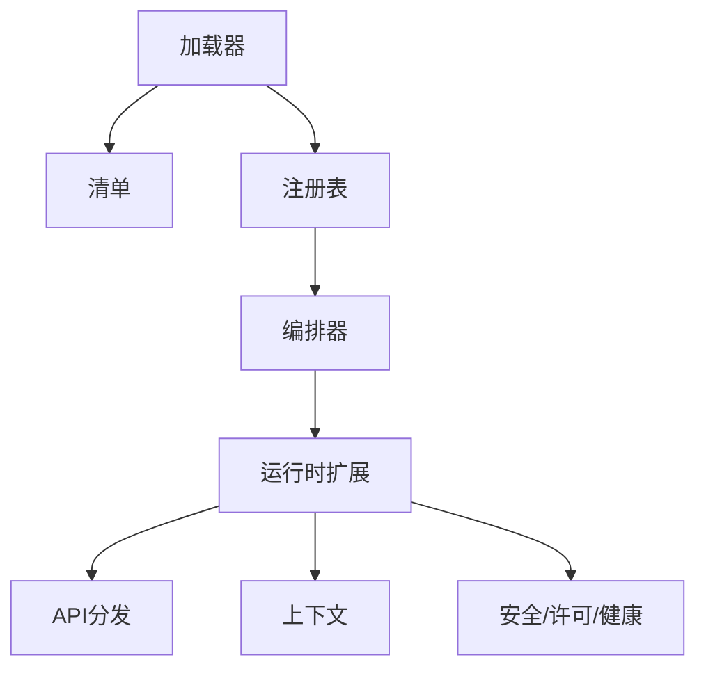
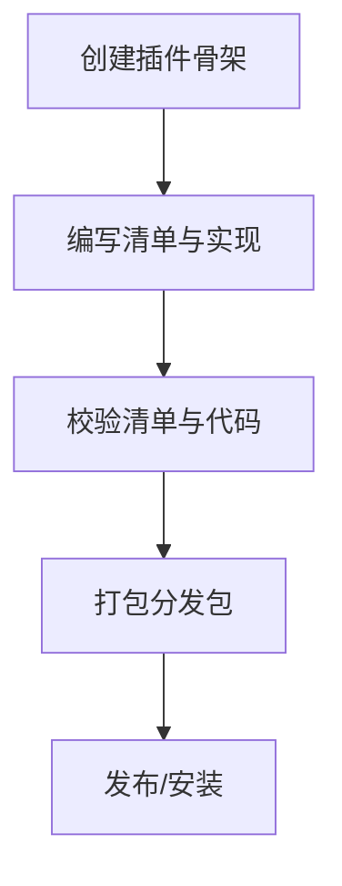
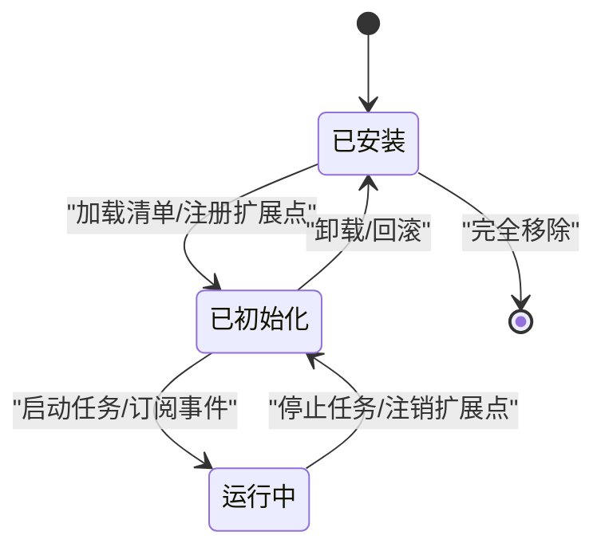

# 插件开发基础

<cite>
**本文引用的文件**
- [backend/app/plugins/base.py](file://backend/app/plugins/base.py)
- [backend/app/plugins/loader.py](file://backend/app/plugins/loader.py)
- [backend/app/plugins/manifest.py](file://backend/app/plugins/manifest.py)
- [backend/app/plugins/lifecycle.py](file://backend/app/plugins/lifecycle.py)
- [backend/app/plugins/lifecycle_orchestrator.py](file://backend/app/plugins/lifecycle_orchestrator.py)
- [backend/app/plugins/registry.py](file://backend/app/plugins/registry.py)
- [backend/app/plugins/api_dispatcher.py](file://backend/app/plugins/api_dispatcher.py)
- [backend/app/plugins/context.py](file://backend/app/plugins/context.py)
- [backend/app/plugins/context_factory.py](file://backend/app/plugins/context_factory.py)
- [backend/app/plugins/asset_resolver.py](file://backend/app/plugins/asset_resolver.py)
- [backend/app/plugins/startup.py](file://backend/app/plugins/startup.py)
- [backend/app/plugins/scheduler_refresh.py](file://backend/app/plugins/scheduler_refresh.py)
- [backend/app/plugins/version_manager.py](file://backend/app/plugins/version_manager.py)
- [backend/app/plugins/marketplace.py](file://backend/app/plugins/marketplace.py)
- [backend/app/plugins/preview.py](file://backend/app/plugins/preview.py)
- [backend/app/plugins/health.py](file://backend/app/plugins/health.py)
- [backend/app/plugins/system_hooks.py](file://backend/app/plugins/system_hooks.py)
- [backend/app/plugins/security.py](file://backend/app/plugins/security.py)
- [backend/app/plugins/crypto.py](file://backend/app/plugins/crypto.py)
- [backend/app/plugins/dependencies.py](file://backend/app/plugins/dependencies.py)
- [backend/app/plugins/event_bus.py](file://backend/app/plugins/event_bus.py)
- [backend/app/plugins/exposure_policy.py](file://backend/app/plugins/exposure_policy.py)
- [backend/app/plugins/feature_entitlement_guards.py](file://backend/app/plugins/feature_entitlement_guards.py)
- [backend/app/plugins/frontend_contract.py](file://backend/app/plugins/frontend_contract.py)
- [backend/app/plugins/host_read_facade.py](file://backend/app/plugins/host_read_facade.py)
- [backend/app/plugins/license.py](file://backend/app/plugins/license.py)
- [backend/app/plugins/sso_auth.py](file://backend/app/plugins/sso_auth.py)
- [backend/app/plugins/sse.py](file://backend/app/plugins/sse.py)
- [backend/app/plugins/webhook_dispatcher.py](file://backend/app/plugins/webhook_dispatcher.py)
- [backend/app/plugins/runtime_gate.py](file://backend/app/plugins/runtime_gate.py)
- [backend/app/plugins/runtime_recovery.py](file://backend/app/plugins/runtime_recovery.py)
- [backend/app/plugins/runtime_registration.py](file://backend/app/plugins/runtime_registration.py)
- [backend/app/plugins/tenant_plan_preflight.py](file://backend/app/plugins/tenant_plan_preflight.py)
- [backend/app/plugins/update_checker.py](file://backend/app/plugins/update_checker.py)
- [backend/app/plugins/migration_paths.py](file://backend/app/plugins/migration_paths.py)
- [backend/app/plugins/module_loader.py](file://backend/app/plugins/module_loader.py)
- [backend/app/plugins/package_security.py](file://backend/app/plugins/package_security.py)
- [backend/app/plugins/progress.py](file://backend/app/plugins/progress.py)
- [backend/app/plugins/registry_read_layer.py](file://backend/app/plugins/registry_read_layer.py)
- [backend/app/plugins/registry_runtime_extensions.py](file://backend/app/plugins/registry_runtime_extensions.py)
- [backend/app/plugins/scope.py](file://backend/app/plugins/scope.py)
- [backend/app/plugins/security_scan.py](file://backend/app/plugins/security_scan.py)
- [backend/scripts/plugin_cli_create.py](file://backend/scripts/plugin_cli_create.py)
- [backend/scripts/plugin_cli_pack.py](file://backend/scripts/plugin_cli_pack.py)
- [backend/scripts/plugin_cli_validate.py](file://backend/scripts/plugin_cli_validate.py)
- [backend/scripts/plugin_cli_release.py](file://backend/scripts/plugin_cli_release.py)
- [backend/scripts/plugin_cli_build.py](file://backend/scripts/plugin_cli_build.py)
- [backend/scripts/plugin_cli_parser.py](file://backend/scripts/plugin_cli_parser.py)
- [backend/scripts/plugin_cli_shared.py](file://backend/scripts/plugin_cli_shared.py)
- [backend/scripts/plugin_cli_templates.py](file://backend/scripts/plugin_cli_templates.py)
- [backend/plugins/weather-widget](file://backend/plugins/weather-widget)
- [backend/plugins/slider-captcha](file://backend/plugins/slider-captcha)
- [backend/plugins/storage-billing](file://backend/plugins/storage-billing)
- [backend/plugins/storage-migration](file://backend/plugins/storage-migration)
- [backend/plugins/aliyun-oss](file://backend/plugins/aliyun-oss)
- [backend/plugins/amazon-s3](file://backend/plugins/amazon-s3)
- [backend/plugins/qiniu-kodo](file://backend/plugins/qiniu-kodo)
- [backend/plugins/tencent-cos](file://backend/plugins/tencent-cos)
- [backend/plugins/novusdoc](file://backend/plugins/novusdoc)
</cite>

## 目录
1. [引言](#引言)
2. [项目结构](#项目结构)
3. [核心组件](#核心组件)
4. [架构总览](#架构总览)
5. [详细组件分析](#详细组件分析)
6. [依赖关系分析](#依赖关系分析)
7. [性能考虑](#性能考虑)
8. [故障排查指南](#故障排查指南)
9. [结论](#结论)
10. [附录](#附录)

## 引言
本指南面向初学者与中级开发者，系统讲解该系统的插件体系：从基本概念、架构设计到开发环境搭建；从插件创建流程、基本结构与核心组件，到配置文件编写规范、生命周期管理与初始化/销毁机制；并提供可直接参考的简单示例路径，帮助快速上手。

## 项目结构
后端采用模块化的插件子系统，核心位于 backend/app/plugins，配套 CLI 工具位于 backend/scripts。实际示例插件位于 backend/plugins 下（如天气小部件、滑块验证码等）。

**图表来源**
- [backend/app/plugins/base.py](file://backend/app/plugins/base.py)
- [backend/app/plugins/loader.py](file://backend/app/plugins/loader.py)
- [backend/app/plugins/manifest.py](file://backend/app/plugins/manifest.py)
- [backend/app/plugins/lifecycle.py](file://backend/app/plugins/lifecycle.py)
- [backend/app/plugins/lifecycle_orchestrator.py](file://backend/app/plugins/lifecycle_orchestrator.py)
- [backend/app/plugins/registry.py](file://backend/app/plugins/registry.py)
- [backend/app/plugins/api_dispatcher.py](file://backend/app/plugins/api_dispatcher.py)
- [backend/app/plugins/context.py](file://backend/app/plugins/context.py)
- [backend/app/plugins/context_factory.py](file://backend/app/plugins/context_factory.py)
- [backend/app/plugins/asset_resolver.py](file://backend/app/plugins/asset_resolver.py)
- [backend/app/plugins/startup.py](file://backend/app/plugins/startup.py)
- [backend/app/plugins/scheduler_refresh.py](file://backend/app/plugins/scheduler_refresh.py)
- [backend/app/plugins/version_manager.py](file://backend/app/plugins/version_manager.py)
- [backend/app/plugins/marketplace.py](file://backend/app/plugins/marketplace.py)
- [backend/app/plugins/preview.py](file://backend/app/plugins/preview.py)
- [backend/app/plugins/health.py](file://backend/app/plugins/health.py)
- [backend/app/plugins/security.py](file://backend/app/plugins/security.py)
- [backend/app/plugins/crypto.py](file://backend/app/plugins/crypto.py)
- [backend/app/plugins/license.py](file://backend/app/plugins/license.py)

**章节来源**
- [backend/app/plugins/base.py](file://backend/app/plugins/base.py)
- [backend/app/plugins/loader.py](file://backend/app/plugins/loader.py)
- [backend/app/plugins/manifest.py](file://backend/app/plugins/manifest.py)
- [backend/app/plugins/lifecycle.py](file://backend/app/plugins/lifecycle.py)
- [backend/app/plugins/lifecycle_orchestrator.py](file://backend/app/plugins/lifecycle_orchestrator.py)
- [backend/app/plugins/registry.py](file://backend/app/plugins/registry.py)

## 核心组件
- 插件基类与接口：定义插件的标准能力边界与扩展点，确保不同插件在统一契约下协作。
- 加载器与清单：负责解析插件清单、校验元数据、建立模块映射与依赖图谱。
- 生命周期编排：协调安装、升级、卸载、迁移、回滚等阶段，保证状态一致性。
- 注册表与运行时：维护插件实例、暴露API、管理上下文与资源，提供安全与权限控制。
- 市场与预览：提供插件发现、版本与许可证校验、健康检查与安全扫描。
- CLI 工具链：封装创建、打包、校验、发布、构建等开发工作流。

**章节来源**
- [backend/app/plugins/base.py](file://backend/app/plugins/base.py)
- [backend/app/plugins/loader.py](file://backend/app/plugins/loader.py)
- [backend/app/plugins/manifest.py](file://backend/app/plugins/manifest.py)
- [backend/app/plugins/lifecycle_orchestrator.py](file://backend/app/plugins/lifecycle_orchestrator.py)
- [backend/app/plugins/registry.py](file://backend/app/plugins/registry.py)
- [backend/scripts/plugin_cli_create.py](file://backend/scripts/plugin_cli_create.py)
- [backend/scripts/plugin_cli_pack.py](file://backend/scripts/plugin_cli_pack.py)
- [backend/scripts/plugin_cli_validate.py](file://backend/scripts/plugin_cli_validate.py)
- [backend/scripts/plugin_cli_release.py](file://backend/scripts/plugin_cli_release.py)
- [backend/scripts/plugin_cli_build.py](file://backend/scripts/plugin_cli_build.py)

## 架构总览
插件系统以“清单驱动 + 生命周期编排 + 运行时注册”为核心，通过注册表统一纳管所有插件实例，对外提供API分发、上下文管理、资源解析与安全策略。

**图表来源**
- [backend/app/plugins/loader.py](file://backend/app/plugins/loader.py)
- [backend/app/plugins/manifest.py](file://backend/app/plugins/manifest.py)
- [backend/app/plugins/registry.py](file://backend/app/plugins/registry.py)
- [backend/app/plugins/lifecycle_orchestrator.py](file://backend/app/plugins/lifecycle_orchestrator.py)
- [backend/app/plugins/api_dispatcher.py](file://backend/app/plugins/api_dispatcher.py)
- [backend/app/plugins/context.py](file://backend/app/plugins/context.py)
- [backend/app/plugins/security.py](file://backend/app/plugins/security.py)
- [backend/scripts/plugin_cli_create.py](file://backend/scripts/plugin_cli_create.py)
- [backend/scripts/plugin_cli_pack.py](file://backend/scripts/plugin_cli_pack.py)

## 详细组件分析

### 组件一：插件基类与清单
- 插件基类定义标准接口与扩展点，确保插件具备一致的生命周期钩子与能力声明。
- 清单解析负责校验必填字段、版本约束、依赖关系与前端/后端合约，生成标准化的运行时模型。

**图表来源**
- [backend/app/plugins/base.py](file://backend/app/plugins/base.py)
- [backend/app/plugins/manifest.py](file://backend/app/plugins/manifest.py)
- [backend/app/plugins/loader.py](file://backend/app/plugins/loader.py)

**章节来源**
- [backend/app/plugins/base.py](file://backend/app/plugins/base.py)
- [backend/app/plugins/manifest.py](file://backend/app/plugins/manifest.py)
- [backend/app/plugins/loader.py](file://backend/app/plugins/loader.py)

### 组件二：生命周期编排与状态机
- 生命周期编排器协调安装、迁移、升级、回滚与清理，确保状态一致与幂等性。
- 版本管理器跟踪当前版本、目标版本与迁移路径，避免不兼容升级。

**图表来源**
- [backend/app/plugins/lifecycle_orchestrator.py](file://backend/app/plugins/lifecycle_orchestrator.py)
- [backend/app/plugins/lifecycle.py](file://backend/app/plugins/lifecycle.py)
- [backend/app/plugins/version_manager.py](file://backend/app/plugins/version_manager.py)
- [backend/app/plugins/registry.py](file://backend/app/plugins/registry.py)

**章节来源**
- [backend/app/plugins/lifecycle_orchestrator.py](file://backend/app/plugins/lifecycle_orchestrator.py)
- [backend/app/plugins/lifecycle.py](file://backend/app/plugins/lifecycle.py)
- [backend/app/plugins/version_manager.py](file://backend/app/plugins/version_manager.py)
- [backend/app/plugins/registry.py](file://backend/app/plugins/registry.py)

### 组件三：运行时注册与API分发
- 运行时注册负责将插件扩展点注入系统，包括路由、中间件、菜单、通知模板等。
- API 分发器根据请求上下文选择合适的插件处理器，支持并发与安全过滤。

**图表来源**
- [backend/app/plugins/api_dispatcher.py](file://backend/app/plugins/api_dispatcher.py)
- [backend/app/plugins/runtime_registration.py](file://backend/app/plugins/runtime_registration.py)
- [backend/app/plugins/exposure_policy.py](file://backend/app/plugins/exposure_policy.py)
- [backend/app/plugins/feature_entitlement_guards.py](file://backend/app/plugins/feature_entitlement_guards.py)

**章节来源**
- [backend/app/plugins/api_dispatcher.py](file://backend/app/plugins/api_dispatcher.py)
- [backend/app/plugins/runtime_registration.py](file://backend/app/plugins/runtime_registration.py)
- [backend/app/plugins/exposure_policy.py](file://backend/app/plugins/exposure_policy.py)
- [backend/app/plugins/feature_entitlement_guards.py](file://backend/app/plugins/feature_entitlement_guards.py)

### 组件四：上下文与资源管理
- 上下文工厂按需创建插件运行所需的上下文对象，贯穿请求/任务生命周期。
- 资源解析器负责静态资源、前端包与动态资产的定位与访问控制。

**图表来源**
- [backend/app/plugins/context_factory.py](file://backend/app/plugins/context_factory.py)
- [backend/app/plugins/context.py](file://backend/app/plugins/context.py)
- [backend/app/plugins/asset_resolver.py](file://backend/app/plugins/asset_resolver.py)

**章节来源**
- [backend/app/plugins/context_factory.py](file://backend/app/plugins/context_factory.py)
- [backend/app/plugins/context.py](file://backend/app/plugins/context.py)
- [backend/app/plugins/asset_resolver.py](file://backend/app/plugins/asset_resolver.py)

### 组件五：市场、预览与健康
- 市场模块提供插件发现、版本与许可证校验、试用期与定价策略检查。
- 预览与健康检查保障插件在安装前后的可用性与稳定性。

**图表来源**
- [backend/app/plugins/marketplace.py](file://backend/app/plugins/marketplace.py)
- [backend/app/plugins/preview.py](file://backend/app/plugins/preview.py)
- [backend/app/plugins/health.py](file://backend/app/plugins/health.py)
- [backend/app/plugins/license.py](file://backend/app/plugins/license.py)

**章节来源**
- [backend/app/plugins/marketplace.py](file://backend/app/plugins/marketplace.py)
- [backend/app/plugins/preview.py](file://backend/app/plugins/preview.py)
- [backend/app/plugins/health.py](file://backend/app/plugins/health.py)
- [backend/app/plugins/license.py](file://backend/app/plugins/license.py)

## 依赖关系分析
- 组件内聚：核心模块（加载器、清单、注册表、编排器）高度内聚，职责清晰。
- 组件耦合：运行时扩展对注册表与编排器存在强依赖；API分发与上下文解耦但通过契约连接。
- 外部依赖：CLI 工具链与示例插件仓库作为外部输入，影响开发体验与可复用性。

**图表来源**
- [backend/app/plugins/loader.py](file://backend/app/plugins/loader.py)
- [backend/app/plugins/manifest.py](file://backend/app/plugins/manifest.py)
- [backend/app/plugins/registry.py](file://backend/app/plugins/registry.py)
- [backend/app/plugins/lifecycle_orchestrator.py](file://backend/app/plugins/lifecycle_orchestrator.py)
- [backend/app/plugins/api_dispatcher.py](file://backend/app/plugins/api_dispatcher.py)
- [backend/app/plugins/context.py](file://backend/app/plugins/context.py)
- [backend/app/plugins/security.py](file://backend/app/plugins/security.py)

**章节来源**
- [backend/app/plugins/loader.py](file://backend/app/plugins/loader.py)
- [backend/app/plugins/manifest.py](file://backend/app/plugins/manifest.py)
- [backend/app/plugins/registry.py](file://backend/app/plugins/registry.py)
- [backend/app/plugins/lifecycle_orchestrator.py](file://backend/app/plugins/lifecycle_orchestrator.py)
- [backend/app/plugins/api_dispatcher.py](file://backend/app/plugins/api_dispatcher.py)
- [backend/app/plugins/context.py](file://backend/app/plugins/context.py)
- [backend/app/plugins/security.py](file://backend/app/plugins/security.py)

## 性能考虑
- 缓存与懒加载：资源解析与上下文创建应结合缓存策略，减少重复计算。
- 并发与限流：API 分发器与事件总线需支持并发控制与速率限制，避免热点插件拖垮系统。
- 升级窗口：生命周期编排应提供滚动升级与回滚策略，降低停机风险。
- 安全扫描：在安装与更新阶段集成安全扫描，提前阻断高危插件。

## 故障排查指南
- 清单校验失败：检查必填字段与版本约束是否满足，参考清单校验工具输出。
- 生命周期异常：查看编排器日志与状态机转换，确认迁移/回滚步骤是否完整。
- 运行时注册冲突：核对路由/中间件/菜单等扩展点命名空间，避免重复。
- 权限与许可：确认许可证状态、试用期与功能授权，必要时触发健康检查重算。
- 资源访问问题：检查资源解析器的鉴权与缓存配置，确保静态资源可访问。

**章节来源**
- [backend/app/plugins/manifest.py](file://backend/app/plugins/manifest.py)
- [backend/app/plugins/lifecycle_orchestrator.py](file://backend/app/plugins/lifecycle_orchestrator.py)
- [backend/app/plugins/runtime_registration.py](file://backend/app/plugins/runtime_registration.py)
- [backend/app/plugins/license.py](file://backend/app/plugins/license.py)
- [backend/app/plugins/asset_resolver.py](file://backend/app/plugins/asset_resolver.py)

## 结论
该插件体系以清单驱动与生命周期编排为核心，配合注册表与运行时扩展，形成可发现、可治理、可演进的插件生态。通过 CLI 工具链与示例插件，开发者可以快速上手并构建高质量插件。

## 附录

### A. 开发环境与前置条件
- Python 环境与依赖：确保已安装项目所需依赖，参考项目根目录的依赖配置文件。
- CLI 工具：使用插件 CLI 工具链进行创建、打包、校验与发布。
- 示例插件：参考内置示例插件，理解目录结构与最小可行实现。

**章节来源**
- [backend/scripts/plugin_cli_create.py](file://backend/scripts/plugin_cli_create.py)
- [backend/scripts/plugin_cli_pack.py](file://backend/scripts/plugin_cli_pack.py)
- [backend/scripts/plugin_cli_validate.py](file://backend/scripts/plugin_cli_validate.py)
- [backend/scripts/plugin_cli_release.py](file://backend/scripts/plugin_cli_release.py)
- [backend/plugins/weather-widget](file://backend/plugins/weather-widget)
- [backend/plugins/slider-captcha](file://backend/plugins/slider-captcha)

### B. 插件创建流程（基于CLI）
- 创建：使用创建脚本生成插件骨架，包含清单、入口与最小实现。
- 编写：完善清单字段、实现扩展点与业务逻辑。
- 校验：使用校验脚本检查清单与代码规范。
- 打包：使用打包脚本生成可分发包。
- 发布：使用发布脚本上传至市场或内部仓库。

**图表来源**
- [backend/scripts/plugin_cli_create.py](file://backend/scripts/plugin_cli_create.py)
- [backend/scripts/plugin_cli_validate.py](file://backend/scripts/plugin_cli_validate.py)
- [backend/scripts/plugin_cli_pack.py](file://backend/scripts/plugin_cli_pack.py)
- [backend/scripts/plugin_cli_release.py](file://backend/scripts/plugin_cli_release.py)

**章节来源**
- [backend/scripts/plugin_cli_create.py](file://backend/scripts/plugin_cli_create.py)
- [backend/scripts/plugin_cli_pack.py](file://backend/scripts/plugin_cli_pack.py)
- [backend/scripts/plugin_cli_validate.py](file://backend/scripts/plugin_cli_validate.py)
- [backend/scripts/plugin_cli_release.py](file://backend/scripts/plugin_cli_release.py)

### C. 插件配置文件（plugin.yaml）编写规范
- 必填字段：名称、版本、许可证类型、入口模块、能力声明（API/中间件/菜单/通知模板等）。
- 可选字段：描述、作者、图标、主页、依赖版本范围、前端合约、暴露策略、功能授权键。
- 字段含义与验证规则：
  - 名称与版本：唯一标识与语义化版本，用于注册与升级。
  - 许可证：支持试用/付费/开源等模式，关联健康检查与市场策略。
  - 入口模块：插件主模块路径，加载器据此解析扩展点。
  - 能力声明：明确插件提供的扩展点集合，便于注册表匹配。
  - 前端合约：声明前端交互协议，确保前后端一致性。
  - 暴露策略：控制API可见性与访问范围。
  - 功能授权键：与功能授权守卫联动，实现细粒度权限控制。

**章节来源**
- [backend/app/plugins/manifest.py](file://backend/app/plugins/manifest.py)
- [backend/app/plugins/license.py](file://backend/app/plugins/license.py)
- [backend/app/plugins/frontend_contract.py](file://backend/app/plugins/frontend_contract.py)
- [backend/app/plugins/exposure_policy.py](file://backend/app/plugins/exposure_policy.py)
- [backend/app/plugins/feature_entitlement_guards.py](file://backend/app/plugins/feature_entitlement_guards.py)

### D. 生命周期管理与初始化/销毁
- 初始化：加载清单 → 解析依赖 → 注册扩展点 → 启动定时任务/订阅事件 → 健康检查。
- 运行中：处理请求/事件 → 安全与权限校验 → 资源解析 → 业务执行 → 状态上报。
- 销毁：停止定时任务/事件订阅 → 释放资源 → 注销扩展点 → 清理临时状态。

**图表来源**
- [backend/app/plugins/lifecycle.py](file://backend/app/plugins/lifecycle.py)
- [backend/app/plugins/lifecycle_orchestrator.py](file://backend/app/plugins/lifecycle_orchestrator.py)
- [backend/app/plugins/startup.py](file://backend/app/plugins/startup.py)
- [backend/app/plugins/scheduler_refresh.py](file://backend/app/plugins/scheduler_refresh.py)

**章节来源**
- [backend/app/plugins/lifecycle.py](file://backend/app/plugins/lifecycle.py)
- [backend/app/plugins/lifecycle_orchestrator.py](file://backend/app/plugins/lifecycle_orchestrator.py)
- [backend/app/plugins/startup.py](file://backend/app/plugins/startup.py)
- [backend/app/plugins/scheduler_refresh.py](file://backend/app/plugins/scheduler_refresh.py)

### E. 简单插件开发示例（路径指引）
- 示例一：天气小部件
  - 目录：[backend/plugins/weather-widget](file://backend/plugins/weather-widget)
  - 关注点：清单字段、API扩展点、上下文使用、资源解析。
- 示例二：滑块验证码
  - 目录：[backend/plugins/slider-captcha](file://backend/plugins/slider-captcha)
  - 关注点：前端合约、安全策略、事件总线与健康检查。
- 示例三：存储插件系列（阿里云OSS、Amazon S3、七牛Kodo、腾讯COS）
  - 目录：[backend/plugins/aliyun-oss](file://backend/plugins/aliyun-oss)，[backend/plugins/amazon-s3](file://backend/plugins/amazon-s3)，[backend/plugins/qiniu-kodo](file://backend/plugins/qiniu-kodo)，[backend/plugins/tencent-cos](file://backend/plugins/tencent-cos)
  - 关注点：适配器模式、许可证与计费、迁移与备份。

**章节来源**
- [backend/plugins/weather-widget](file://backend/plugins/weather-widget)
- [backend/plugins/slider-captcha](file://backend/plugins/slider-captcha)
- [backend/plugins/aliyun-oss](file://backend/plugins/aliyun-oss)
- [backend/plugins/amazon-s3](file://backend/plugins/amazon-s3)
- [backend/plugins/qiniu-kodo](file://backend/plugins/qiniu-kodo)
- [backend/plugins/tencent-cos](file://backend/plugins/tencent-cos)