# 插件开发指南

<cite>
**本文档引用的文件**
- [backend/app/plugins/__init__.py](file://backend/app/plugins/__init__.py)
- [backend/app/plugins/base.py](file://backend/app/plugins/base.py)
- [backend/app/plugins/manifest.py](file://backend/app/plugins/manifest.py)
- [backend/app/plugins/lifecycle.py](file://backend/app/plugins/lifecycle.py)
- [backend/app/plugins/registry.py](file://backend/app/plugins/registry.py)
- [backend/app/plugins/event_bus.py](file://backend/app/plugins/event_bus.py)
- [backend/app/plugins/asset_resolver.py](file://backend/app/plugins/asset_resolver.py)
- [backend/app/plugins/asset_runtime.py](file://backend/app/plugins/asset_runtime.py)
- [backend/app/plugins/frontend_contract.py](file://backend/app/plugins/frontend_contract.py)
- [backend/app/plugins/system_hooks.py](file://backend/app/plugins/system_hooks.py)
- [backend/app/plugins/scheduler_refresh.py](file://backend/app/plugins/scheduler_refresh.py)
- [backend/app/plugins/version_manager.py](file://backend/app/plugins/version_manager.py)
- [backend/app/plugins/marketplace.py](file://backend/app/plugins/marketplace.py)
- [backend/app/plugins/license.py](file://backend/app/plugins/license.py)
- [backend/app/plugins/crypto.py](file://backend/app/plugins/crypto.py)
- [backend/app/plugins/security.py](file://backend/app/plugins/security.py)
- [backend/app/plugins/package_security.py](file://backend/app/plugins/package_security.py)
- [backend/app/plugins/update_checker.py](file://backend/app/plugins/update_checker.py)
- [backend/app/plugins/webhook_dispatcher.py](file://backend/app/plugins/webhook_dispatcher.py)
- [backend/app/plugins/api_dispatcher.py](file://backend/app/plugins/api_dispatcher.py)
- [backend/app/plugins/context.py](file://backend/app/plugins/context.py)
- [backend/app/plugins/context_factory.py](file://backend/app/plugins/context_factory.py)
- [backend/app/plugins/context_primitives.py](file://backend/app/plugins/context_primitives.py)
- [backend/app/plugins/dependencies.py](file://backend/app/plugins/dependencies.py)
- [backend/app/plugins/exposure_policy.py](file://backend/app/plugins/exposure_policy.py)
- [backend/app/plugins/feature_entitlement_guards.py](file://backend/app/plugins/feature_entitlement_guards.py)
- [backend/app/plugins/host_read_facade.py](file://backend/app/plugins/host_read_facade.py)
- [backend/app/plugins/runtime_gate.py](file://backend/app/plugins/runtime_gate.py)
- [backend/app/plugins/runtime_recovery.py](file://backend/app/plugins/runtime_recovery.py)
- [backend/app/plugins/runtime_registration.py](file://backend/app/plugins/runtime_registration.py)
- [backend/app/plugins/sio_auth.py](file://backend/app/plugins/sio_auth.py)
- [backend/app/plugins/sse.py](file://backend/app/plugins/sse.py)
- [backend/scripts/plugin_cli_create.py](file://backend/scripts/plugin_cli_create.py)
- [backend/scripts/plugin_cli_pack.py](file://backend/scripts/plugin_cli_pack.py)
- [backend/scripts/plugin_cli_release.py](file://backend/scripts/plugin_cli_release.py)
- [backend/scripts/plugin_cli_validate.py](file://backend/scripts/plugin_cli_validate.py)
- [backend/scripts/plugin_cli_build.py](file://backend/scripts/plugin_cli_build.py)
- [backend/scripts/plugin_cli_parser.py](file://backend/scripts/plugin_cli_parser.py)
- [backend/scripts/plugin_cli_templates.py](file://backend/scripts/plugin_cli_templates.py)
- [backend/scripts/plugin_cli_shared.py](file://backend/scripts/plugin_cli_shared.py)
- [backend/tests/test_plugin_manifest_validation.py](file://backend/tests/test_plugin_manifest_validation.py)
- [backend/tests/test_plugin_loader.py](file://backend/tests/test_plugin_loader.py)
- [backend/tests/test_plugin_lifecycle_migrations.py](file://backend/tests/test_plugin_lifecycle_migrations.py)
- [backend/tests/test_plugin_asset_resolver.py](file://backend/tests/test_plugin_asset_resolver.py)
- [backend/tests/test_plugin_api_dispatcher_security.py](file://backend/tests/test_plugin_api_dispatcher_security.py)
- [backend/tests/test_plugin_crypto.py](file://backend/tests/test_plugin_crypto.py)
- [backend/tests/test_plugin_package_security.py](file://backend/tests/test_plugin_package_security.py)
- [backend/tests/test_plugin_startup_discovery_boundaries.py](file://backend/tests/test_plugin_startup_discovery_boundaries.py)
- [backend/tests/test_plugin_scheduler_refresh.py](file://backend/tests/test_plugin_scheduler_refresh.py)
- [backend/tests/test_plugin_webhook_dispatcher_security.py](file://backend/tests/test_plugin_webhook_dispatcher_security.py)
- [backend/tests/test_plugin_runtime_recovery.py](file://backend/tests/test_plugin_runtime_recovery.py)
- [backend/tests/test_plugin_version_manager_locking.py](file://backend/tests/test_plugin_version_manager_locking.py)
- [backend/tests/test_plugin_marketplace_contract.py](file://backend/tests/test_plugin_marketplace_contract.py)
- [backend/tests/test_plugin_license_verification_policy.py](file://backend/tests/test_plugin_license_verification_policy.py)
- [backend/tests/test_plugin_event_hook_runtime.py](file://backend/tests/test_plugin_event_hook_runtime.py)
- [backend/tests/test_plugin_frontend_contracts.py](file://backend/tests/test_plugin_frontend_contracts.py)
- [backend/tests/test_plugin_middleware_runtime.py](file://backend/tests/test_plugin_middleware_runtime.py)
- [backend/tests/test_plugin_storage_runtime.py](file://backend/tests/test_plugin_storage_runtime.py)
- [backend/tests/test_plugin_service_config_validation.py](file://backend/tests/test_plugin_service_config_validation.py)
- [backend/tests/test_plugin_edition_exposure_policy.py](file://backend/tests/test_plugin_edition_exposure_policy.py)
- [backend/tests/test_plugin_trial_license_policy.py](file://backend/tests/test_plugin_trial_license_policy.py)
- [backend/tests/test_plugin_dependency_runtime_model.py](file://backend/tests/test_plugin_dependency_runtime_model.py)
- [backend/tests/test_plugin_extension_registration.py](file://backend/tests/test_plugin_extension_registration.py)
- [backend/tests/test_plugin_admin_contracts.py](file://backend/tests/test_plugin_admin_contracts.py)
- [backend/tests/test_plugin_consumer_runtime.py](file://backend/tests/test_plugin_consumer_runtime.py)
- [backend/tests/test_plugin_public_asset_route.py](file://backend/tests/test_plugin_public_asset_route.py)
- [backend/tests/test_plugin_slot_access_filter.py](file://backend/tests/test_plugin_slot_access_filter.py)
- [backend/tests/test_plugin_transaction_semantics.py](file://backend/tests/test_plugin_transaction_semantics.py)
- [backend/tests/test_plugin_lifecycle_guards.py](file://backend/tests/test_plugin_lifecycle_guards.py)
- [backend/tests/test_plugin_lifecycle_lock.py](file://backend/tests/test_plugin_lifecycle_lock.py)
- [backend/tests/test_plugin_lifecycle_cleanup_safety.py](file://backend/tests/test_plugin_lifecycle_cleanup_safety.py)
- [backend/tests/test_plugin_lifecycle_license_gate.py](file://backend/tests/test_plugin_lifecycle_license_gate.py)
- [backend/tests/test_plugin_service_license_activation.py](file://backend/tests/test_plugin_service_license_activation.py)
- [backend/tests/test_plugin_adapter_runtime.py](file://backend/tests/test_plugin_adapter_runtime.py)
- [backend/tests/test_plugin_consumer_sample_contract.py](file://backend/tests/test_plugin_consumer_sample_contract.py)
- [backend/tests/test_plugin_cli_operator_flow.py](file://backend/tests/test_plugin_cli_operator_flow.py)
- [backend/tests/test_plugin_cli_pack_hardening.py](file://backend/tests/test_plugin_cli_pack_hardening.py)
- [backend/tests/test_plugin_cli_release_workflow.py](file://backend/tests/test_plugin_cli_release_workflow.py)
- [backend/tests/test_plugin_manifest_sync_service.py](file://backend/tests/test_plugin_manifest_sync_service.py)
- [backend/tests/test_plugin_menu_action_compaction.py](file://backend/tests/test_plugin_menu_action_compaction.py)
- [backend/tests/test_plugin_notification_template_runtime.py](file://backend/tests/test_plugin_notification_template_runtime.py)
- [backend/tests/test_plugin_preview_i18n.py](file://backend/tests/test_plugin_preview_i18n.py)
- [backend/tests/test_plugin_startup_restore_modes.py](file://backend/tests/test_plugin_startup_restore_modes.py)
- [backend/tests/test_plugin_api_dispatcher_context_safety.py](file://backend/tests/test_plugin_api_dispatcher_context_safety.py)
- [backend/tests/test_plugin_asset_runtime_gate.py](file://backend/tests/test_plugin_asset_runtime_gate.py)
</cite>

## 目录
1. [简介](#简介)
2. [项目结构](#项目结构)
3. [核心组件](#核心组件)
4. [架构总览](#架构总览)
5. [详细组件分析](#详细组件分析)
6. [依赖关系分析](#依赖关系分析)
7. [性能考量](#性能考量)
8. [故障排除指南](#故障排除指南)
9. [结论](#结论)
10. [附录](#附录)

## 简介
本指南面向希望在本系统中开发插件的开发者，系统性阐述插件开发规范、API扩展方式、资源管理策略、生命周期管理、前端集成与后端扩展、事件处理机制，并提供最佳实践、安全考虑、性能优化建议、打包发布与版本管理策略、完整开发示例、调试技巧与测试方法，以及插件市场发布、用户反馈与维护更新的指导。

## 项目结构
插件体系位于后端模块 `backend/app/plugins/` 下，围绕清单(manifest)、注册表(registry)、生命周期(lifecycle)、事件(event bus)、资源(asset)、前端契约(frontend contract)等核心子系统构建。CLI脚本位于 `backend/scripts/`，覆盖创建、打包、发布、校验等全流程。

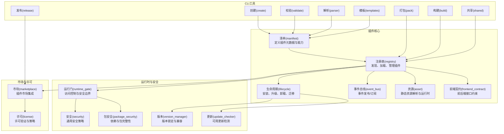

图表来源
- [backend/app/plugins/manifest.py](file://backend/app/plugins/manifest.py)
- [backend/app/plugins/registry.py](file://backend/app/plugins/registry.py)
- [backend/app/plugins/lifecycle.py](file://backend/app/plugins/lifecycle.py)
- [backend/app/plugins/event_bus.py](file://backend/app/plugins/event_bus.py)
- [backend/app/plugins/asset_resolver.py](file://backend/app/plugins/asset_resolver.py)
- [backend/app/plugins/frontend_contract.py](file://backend/app/plugins/frontend_contract.py)
- [backend/app/plugins/runtime_gate.py](file://backend/app/plugins/runtime_gate.py)
- [backend/app/plugins/security.py](file://backend/app/plugins/security.py)
- [backend/app/plugins/package_security.py](file://backend/app/plugins/package_security.py)
- [backend/app/plugins/version_manager.py](file://backend/app/plugins/version_manager.py)
- [backend/app/plugins/update_checker.py](file://backend/app/plugins/update_checker.py)
- [backend/app/plugins/marketplace.py](file://backend/app/plugins/marketplace.py)
- [backend/app/plugins/license.py](file://backend/app/plugins/license.py)
- [backend/scripts/plugin_cli_create.py](file://backend/scripts/plugin_cli_create.py)
- [backend/scripts/plugin_cli_pack.py](file://backend/scripts/plugin_cli_pack.py)
- [backend/scripts/plugin_cli_release.py](file://backend/scripts/plugin_cli_release.py)
- [backend/scripts/plugin_cli_validate.py](file://backend/scripts/plugin_cli_validate.py)
- [backend/scripts/plugin_cli_build.py](file://backend/scripts/plugin_cli_build.py)
- [backend/scripts/plugin_cli_parser.py](file://backend/scripts/plugin_cli_parser.py)
- [backend/scripts/plugin_cli_templates.py](file://backend/scripts/plugin_cli_templates.py)
- [backend/scripts/plugin_cli_shared.py](file://backend/scripts/plugin_cli_shared.py)

章节来源
- [backend/app/plugins/__init__.py](file://backend/app/plugins/__init__.py)
- [backend/app/plugins/manifest.py](file://backend/app/plugins/manifest.py)
- [backend/app/plugins/registry.py](file://backend/app/plugins/registry.py)
- [backend/app/plugins/lifecycle.py](file://backend/app/plugins/lifecycle.py)

## 核心组件
- 清单(manifest): 定义插件元数据、能力声明、依赖、版本、前端资产、后端服务、事件钩子、许可策略等。
- 注册表(registry): 负责插件发现、加载、依赖解析、运行时注册、上下文工厂、暴露策略等。
- 生命周期(lifecycle): 管理安装、迁移、升级、卸载、锁与清理安全、许可证门禁等。
- 事件总线(event_bus): 提供事件发布/订阅机制，支持系统级与插件级事件。
- 资源(asset): 解析静态资源路径、运行时公开路由、资产门禁与恢复。
- 前端契约(frontend_contract): 规定前后端交互接口、菜单/动作/权限暴露等。
- 运行门(runtime_gate): 控制运行时访问、中间件注入、安全边界。
- 版本(version_manager): 版本锁定、兼容性检查、迁移路径。
- 更新(update_checker): 检测可用更新、触发刷新。
- 市场(marketplace): 插件市场集成、预览、同步。
- 许可(license): 许可证验证、试用策略、曝光策略。
- CLI工具: 创建、打包、发布、校验、构建、解析、模板、共享逻辑。

章节来源
- [backend/app/plugins/manifest.py](file://backend/app/plugins/manifest.py)
- [backend/app/plugins/registry.py](file://backend/app/plugins/registry.py)
- [backend/app/plugins/lifecycle.py](file://backend/app/plugins/lifecycle.py)
- [backend/app/plugins/event_bus.py](file://backend/app/plugins/event_bus.py)
- [backend/app/plugins/asset_resolver.py](file://backend/app/plugins/asset_resolver.py)
- [backend/app/plugins/frontend_contract.py](file://backend/app/plugins/frontend_contract.py)
- [backend/app/plugins/runtime_gate.py](file://backend/app/plugins/runtime_gate.py)
- [backend/app/plugins/version_manager.py](file://backend/app/plugins/version_manager.py)
- [backend/app/plugins/update_checker.py](file://backend/app/plugins/update_checker.py)
- [backend/app/plugins/marketplace.py](file://backend/app/plugins/marketplace.py)
- [backend/app/plugins/license.py](file://backend/app/plugins/license.py)
- [backend/scripts/plugin_cli_create.py](file://backend/scripts/plugin_cli_create.py)
- [backend/scripts/plugin_cli_pack.py](file://backend/scripts/plugin_cli_pack.py)
- [backend/scripts/plugin_cli_release.py](file://backend/scripts/plugin_cli_release.py)
- [backend/scripts/plugin_cli_validate.py](file://backend/scripts/plugin_cli_validate.py)
- [backend/scripts/plugin_cli_build.py](file://backend/scripts/plugin_cli_build.py)
- [backend/scripts/plugin_cli_parser.py](file://backend/scripts/plugin_cli_parser.py)
- [backend/scripts/plugin_cli_templates.py](file://backend/scripts/plugin_cli_templates.py)
- [backend/scripts/plugin_cli_shared.py](file://backend/scripts/plugin_cli_shared.py)

## 架构总览
下图展示从CLI到注册表、生命周期、事件总线、资源与市场的端到端流程。

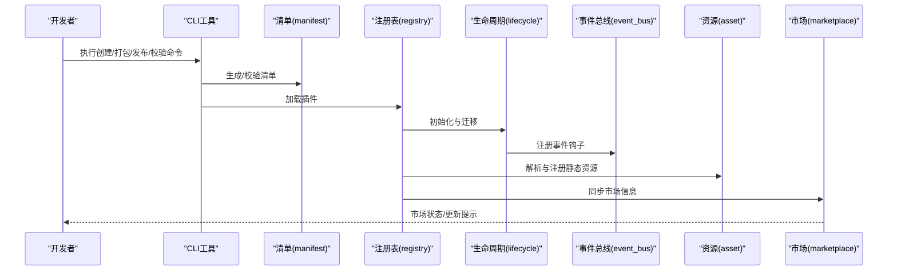

图表来源
- [backend/scripts/plugin_cli_create.py](file://backend/scripts/plugin_cli_create.py)
- [backend/scripts/plugin_cli_pack.py](file://backend/scripts/plugin_cli_pack.py)
- [backend/scripts/plugin_cli_release.py](file://backend/scripts/plugin_cli_release.py)
- [backend/scripts/plugin_cli_validate.py](file://backend/scripts/plugin_cli_validate.py)
- [backend/app/plugins/manifest.py](file://backend/app/plugins/manifest.py)
- [backend/app/plugins/registry.py](file://backend/app/plugins/registry.py)
- [backend/app/plugins/lifecycle.py](file://backend/app/plugins/lifecycle.py)
- [backend/app/plugins/event_bus.py](file://backend/app/plugins/event_bus.py)
- [backend/app/plugins/asset_resolver.py](file://backend/app/plugins/asset_resolver.py)
- [backend/app/plugins/marketplace.py](file://backend/app/plugins/marketplace.py)

## 详细组件分析

### 清单(manifest)与清单校验
- 清单定义插件元数据、版本、依赖、前端资产、后端服务、事件钩子、许可策略等。
- 校验规则包括字段完整性、版本格式、依赖合法性、前端资产存在性等。
- 测试覆盖清单生成、同步服务、字段约束等场景。

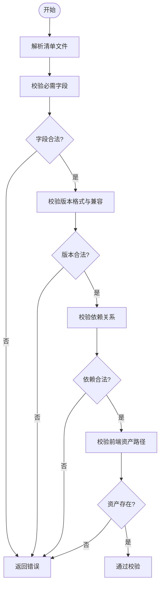

图表来源
- [backend/app/plugins/manifest.py](file://backend/app/plugins/manifest.py)
- [backend/tests/test_plugin_manifest_validation.py](file://backend/tests/test_plugin_manifest_validation.py)
- [backend/tests/test_plugin_manifest_sync_service.py](file://backend/tests/test_plugin_manifest_sync_service.py)

章节来源
- [backend/app/plugins/manifest.py](file://backend/app/plugins/manifest.py)
- [backend/tests/test_plugin_manifest_validation.py](file://backend/tests/test_plugin_manifest_validation.py)
- [backend/tests/test_plugin_manifest_sync_service.py](file://backend/tests/test_plugin_manifest_sync_service.py)

### 注册表(registry)与运行时注册
- 负责插件发现、加载、依赖解析、上下文工厂、暴露策略、运行时注册。
- 支持系统钩子、调度刷新、运行门、恢复机制等。
- 测试覆盖启动边界、恢复模式、扩展注册等。

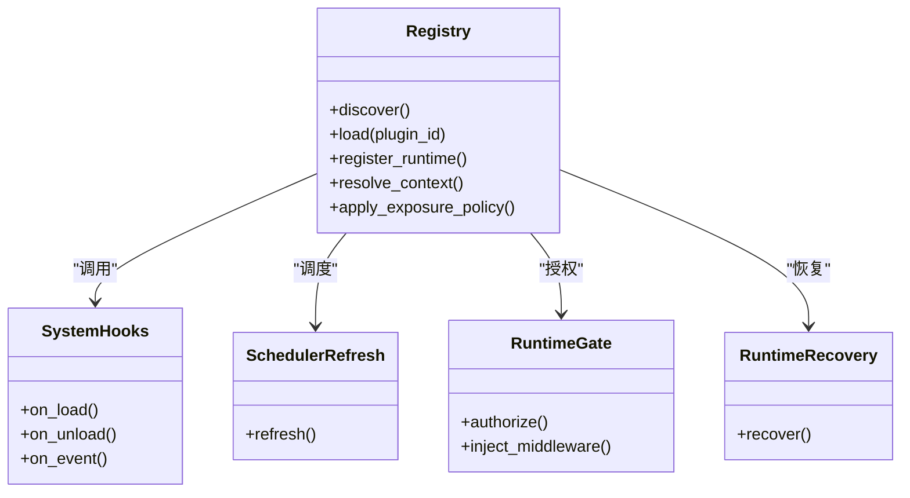

图表来源
- [backend/app/plugins/registry.py](file://backend/app/plugins/registry.py)
- [backend/app/plugins/system_hooks.py](file://backend/app/plugins/system_hooks.py)
- [backend/app/plugins/scheduler_refresh.py](file://backend/app/plugins/scheduler_refresh.py)
- [backend/app/plugins/runtime_gate.py](file://backend/app/plugins/runtime_gate.py)
- [backend/app/plugins/runtime_recovery.py](file://backend/app/plugins/runtime_recovery.py)

章节来源
- [backend/app/plugins/registry.py](file://backend/app/plugins/registry.py)
- [backend/app/plugins/system_hooks.py](file://backend/app/plugins/system_hooks.py)
- [backend/app/plugins/scheduler_refresh.py](file://backend/app/plugins/scheduler_refresh.py)
- [backend/app/plugins/runtime_gate.py](file://backend/app/plugins/runtime_gate.py)
- [backend/app/plugins/runtime_recovery.py](file://backend/app/plugins/runtime_recovery.py)
- [backend/tests/test_plugin_startup_discovery_boundaries.py](file://backend/tests/test_plugin_startup_discovery_boundaries.py)
- [backend/tests/test_plugin_startup_restore_modes.py](file://backend/tests/test_plugin_startup_restore_modes.py)
- [backend/tests/test_plugin_extension_registration.py](file://backend/tests/test_plugin_extension_registration.py)

### 生命周期(lifecycle)与迁移
- 管理安装、迁移、升级、卸载、锁与清理安全、许可证门禁。
- 包含迁移路径、版本管理、许可证策略、清理与恢复等。
- 测试覆盖迁移、锁、清理安全、许可证门禁等。

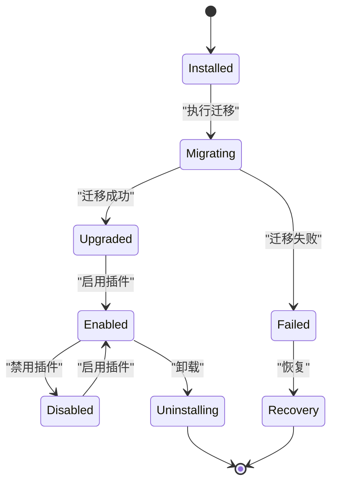

图表来源
- [backend/app/plugins/lifecycle.py](file://backend/app/plugins/lifecycle.py)
- [backend/app/plugins/migration_paths.py](file://backend/app/plugins/migration_paths.py)
- [backend/app/plugins/version_manager.py](file://backend/app/plugins/version_manager.py)
- [backend/app/plugins/license.py](file://backend/app/plugins/license.py)
- [backend/tests/test_plugin_lifecycle_migrations.py](file://backend/tests/test_plugin_lifecycle_migrations.py)
- [backend/tests/test_plugin_lifecycle_guards.py](file://backend/tests/test_plugin_lifecycle_guards.py)
- [backend/tests/test_plugin_lifecycle_lock.py](file://backend/tests/test_plugin_lifecycle_lock.py)
- [backend/tests/test_plugin_lifecycle_cleanup_safety.py](file://backend/tests/test_plugin_lifecycle_cleanup_safety.py)
- [backend/tests/test_plugin_lifecycle_license_gate.py](file://backend/tests/test_plugin_lifecycle_license_gate.py)

章节来源
- [backend/app/plugins/lifecycle.py](file://backend/app/plugins/lifecycle.py)
- [backend/app/plugins/migration_paths.py](file://backend/app/plugins/migration_paths.py)
- [backend/app/plugins/version_manager.py](file://backend/app/plugins/version_manager.py)
- [backend/app/plugins/license.py](file://backend/app/plugins/license.py)
- [backend/tests/test_plugin_lifecycle_migrations.py](file://backend/tests/test_plugin_lifecycle_migrations.py)
- [backend/tests/test_plugin_lifecycle_guards.py](file://backend/tests/test_plugin_lifecycle_guards.py)
- [backend/tests/test_plugin_lifecycle_lock.py](file://backend/tests/test_plugin_lifecycle_lock.py)
- [backend/tests/test_plugin_lifecycle_cleanup_safety.py](file://backend/tests/test_plugin_lifecycle_cleanup_safety.py)
- [backend/tests/test_plugin_lifecycle_license_gate.py](file://backend/tests/test_plugin_lifecycle_license_gate.py)

### 事件总线(event_bus)与事件处理
- 提供事件发布/订阅机制，支持系统级与插件级事件。
- 测试覆盖事件钩子运行时、安全与上下文安全。

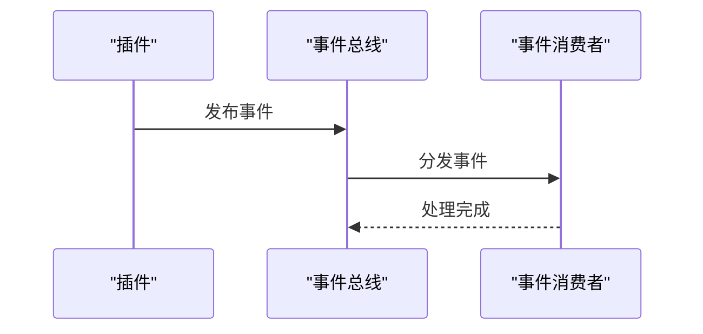

图表来源
- [backend/app/plugins/event_bus.py](file://backend/app/plugins/event_bus.py)
- [backend/tests/test_plugin_event_hook_runtime.py](file://backend/tests/test_plugin_event_hook_runtime.py)
- [backend/tests/test_plugin_api_dispatcher_context_safety.py](file://backend/tests/test_plugin_api_dispatcher_context_safety.py)

章节来源
- [backend/app/plugins/event_bus.py](file://backend/app/plugins/event_bus.py)
- [backend/tests/test_plugin_event_hook_runtime.py](file://backend/tests/test_plugin_event_hook_runtime.py)
- [backend/tests/test_plugin_api_dispatcher_context_safety.py](file://backend/tests/test_plugin_api_dispatcher_context_safety.py)

### 资源(asset)与前端契约
- 静态资源解析与运行时公开路由，确保前端可访问插件资产。
- 前端契约定义菜单、动作、权限暴露等，保证前后端一致性。
- 测试覆盖资产解析、运行时门禁、公共资产路由等。

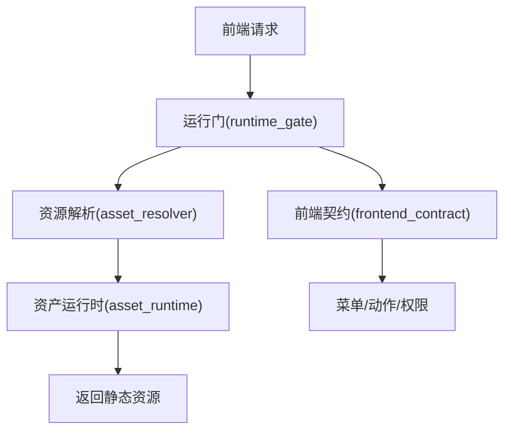

图表来源
- [backend/app/plugins/asset_resolver.py](file://backend/app/plugins/asset_resolver.py)
- [backend/app/plugins/asset_runtime.py](file://backend/app/plugins/asset_runtime.py)
- [backend/app/plugins/runtime_gate.py](file://backend/app/plugins/runtime_gate.py)
- [backend/app/plugins/frontend_contract.py](file://backend/app/plugins/frontend_contract.py)
- [backend/tests/test_plugin_asset_resolver.py](file://backend/tests/test_plugin_asset_resolver.py)
- [backend/tests/test_plugin_asset_runtime_gate.py](file://backend/tests/test_plugin_asset_runtime_gate.py)
- [backend/tests/test_plugin_public_asset_route.py](file://backend/tests/test_plugin_public_asset_route.py)
- [backend/tests/test_plugin_frontend_contracts.py](file://backend/tests/test_plugin_frontend_contracts.py)

章节来源
- [backend/app/plugins/asset_resolver.py](file://backend/app/plugins/asset_resolver.py)
- [backend/app/plugins/asset_runtime.py](file://backend/app/plugins/asset_runtime.py)
- [backend/app/plugins/runtime_gate.py](file://backend/app/plugins/runtime_gate.py)
- [backend/app/plugins/frontend_contract.py](file://backend/app/plugins/frontend_contract.py)
- [backend/tests/test_plugin_asset_resolver.py](file://backend/tests/test_plugin_asset_resolver.py)
- [backend/tests/test_plugin_asset_runtime_gate.py](file://backend/tests/test_plugin_asset_runtime_gate.py)
- [backend/tests/test_plugin_public_asset_route.py](file://backend/tests/test_plugin_public_asset_route.py)
- [backend/tests/test_plugin_frontend_contracts.py](file://backend/tests/test_plugin_frontend_contracts.py)

### 安全与许可
- 运行门(runtime_gate)、安全(security)、包安全(package_security)共同保障运行时安全。
- 许可(license)策略包括许可证验证、试用策略、曝光策略。
- 测试覆盖加密、包安全、许可证验证、试用策略等。

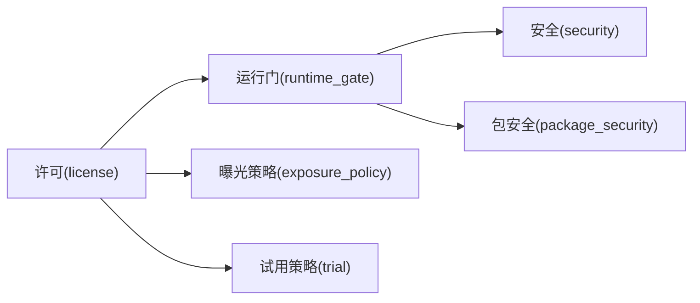

图表来源
- [backend/app/plugins/runtime_gate.py](file://backend/app/plugins/runtime_gate.py)
- [backend/app/plugins/security.py](file://backend/app/plugins/security.py)
- [backend/app/plugins/package_security.py](file://backend/app/plugins/package_security.py)
- [backend/app/plugins/license.py](file://backend/app/plugins/license.py)
- [backend/app/plugins/exposure_policy.py](file://backend/app/plugins/exposure_policy.py)
- [backend/app/plugins/feature_entitlement_guards.py](file://backend/app/plugins/feature_entitlement_guards.py)
- [backend/app/plugins/trial_license_policy.py](file://backend/app/plugins/trial_license_policy.py)
- [backend/tests/test_plugin_crypto.py](file://backend/tests/test_plugin_crypto.py)
- [backend/tests/test_plugin_package_security.py](file://backend/tests/test_plugin_package_security.py)
- [backend/tests/test_plugin_license_verification_policy.py](file://backend/tests/test_plugin_license_verification_policy.py)
- [backend/tests/test_plugin_trial_license_policy.py](file://backend/tests/test_plugin_trial_license_policy.py)
- [backend/tests/test_plugin_edition_exposure_policy.py](file://backend/tests/test_plugin_edition_exposure_policy.py)

章节来源
- [backend/app/plugins/runtime_gate.py](file://backend/app/plugins/runtime_gate.py)
- [backend/app/plugins/security.py](file://backend/app/plugins/security.py)
- [backend/app/plugins/package_security.py](file://backend/app/plugins/package_security.py)
- [backend/app/plugins/license.py](file://backend/app/plugins/license.py)
- [backend/app/plugins/exposure_policy.py](file://backend/app/plugins/exposure_policy.py)
- [backend/app/plugins/feature_entitlement_guards.py](file://backend/app/plugins/feature_entitlement_guards.py)
- [backend/app/plugins/trial_license_policy.py](file://backend/app/plugins/trial_license_policy.py)
- [backend/tests/test_plugin_crypto.py](file://backend/tests/test_plugin_crypto.py)
- [backend/tests/test_plugin_package_security.py](file://backend/tests/test_plugin_package_security.py)
- [backend/tests/test_plugin_license_verification_policy.py](file://backend/tests/test_plugin_license_verification_policy.py)
- [backend/tests/test_plugin_trial_license_policy.py](file://backend/tests/test_plugin_trial_license_policy.py)
- [backend/tests/test_plugin_edition_exposure_policy.py](file://backend/tests/test_plugin_edition_exposure_policy.py)

### 市场(marketplace)与更新(update_checker)
- 市场集成插件市场功能，支持预览、同步与更新检测。
- 更新检测触发调度刷新，确保插件状态与市场一致。

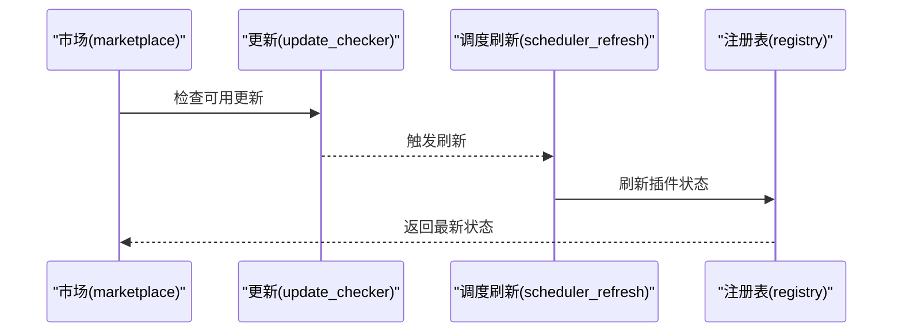

图表来源
- [backend/app/plugins/marketplace.py](file://backend/app/plugins/marketplace.py)
- [backend/app/plugins/update_checker.py](file://backend/app/plugins/update_checker.py)
- [backend/app/plugins/scheduler_refresh.py](file://backend/app/plugins/scheduler_refresh.py)
- [backend/tests/test_plugin_marketplace_contract.py](file://backend/tests/test_plugin_marketplace_contract.py)
- [backend/tests/test_plugin_scheduler_refresh.py](file://backend/tests/test_plugin_scheduler_refresh.py)

章节来源
- [backend/app/plugins/marketplace.py](file://backend/app/plugins/marketplace.py)
- [backend/app/plugins/update_checker.py](file://backend/app/plugins/update_checker.py)
- [backend/app/plugins/scheduler_refresh.py](file://backend/app/plugins/scheduler_refresh.py)
- [backend/tests/test_plugin_marketplace_contract.py](file://backend/tests/test_plugin_marketplace_contract.py)
- [backend/tests/test_plugin_scheduler_refresh.py](file://backend/tests/test_plugin_scheduler_refresh.py)

### CLI工具链
- 创建(create): 生成插件骨架与默认清单。
- 打包(pack): 构建插件包，应用加固与校验。
- 发布(release): 推送到市场或分发渠道。
- 校验(validate): 对清单、依赖、资产进行严格校验。
- 构建(build): 编译与优化资源。
- 解析(parser): 解析命令行参数与配置。
- 模板(templates): 提供标准化模板。
- 共享(shared): 提供跨命令复用逻辑。

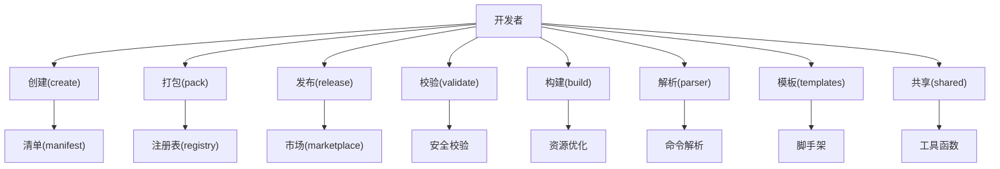

图表来源
- [backend/scripts/plugin_cli_create.py](file://backend/scripts/plugin_cli_create.py)
- [backend/scripts/plugin_cli_pack.py](file://backend/scripts/plugin_cli_pack.py)
- [backend/scripts/plugin_cli_release.py](file://backend/scripts/plugin_cli_release.py)
- [backend/scripts/plugin_cli_validate.py](file://backend/scripts/plugin_cli_validate.py)
- [backend/scripts/plugin_cli_build.py](file://backend/scripts/plugin_cli_build.py)
- [backend/scripts/plugin_cli_parser.py](file://backend/scripts/plugin_cli_parser.py)
- [backend/scripts/plugin_cli_templates.py](file://backend/scripts/plugin_cli_templates.py)
- [backend/scripts/plugin_cli_shared.py](file://backend/scripts/plugin_cli_shared.py)

章节来源
- [backend/scripts/plugin_cli_create.py](file://backend/scripts/plugin_cli_create.py)
- [backend/scripts/plugin_cli_pack.py](file://backend/scripts/plugin_cli_pack.py)
- [backend/scripts/plugin_cli_release.py](file://backend/scripts/plugin_cli_release.py)
- [backend/scripts/plugin_cli_validate.py](file://backend/scripts/plugin_cli_validate.py)
- [backend/scripts/plugin_cli_build.py](file://backend/scripts/plugin_cli_build.py)
- [backend/scripts/plugin_cli_parser.py](file://backend/scripts/plugin_cli_parser.py)
- [backend/scripts/plugin_cli_templates.py](file://backend/scripts/plugin_cli_templates.py)
- [backend/scripts/plugin_cli_shared.py](file://backend/scripts/plugin_cli_shared.py)
- [backend/tests/test_plugin_cli_operator_flow.py](file://backend/tests/test_plugin_cli_operator_flow.py)
- [backend/tests/test_plugin_cli_pack_hardening.py](file://backend/tests/test_plugin_cli_pack_hardening.py)
- [backend/tests/test_plugin_cli_release_workflow.py](file://backend/tests/test_plugin_cli_release_workflow.py)

## 依赖关系分析
- 组件耦合: 注册表对生命周期、事件总线、资源、前端契约有直接依赖；运行门对安全与包安全有强依赖；市场与更新检测依赖调度刷新。
- 外部依赖: 通过CLI与文件系统交互，通过测试用例验证各模块行为。
- 循环依赖: 未见明显循环依赖，模块职责清晰。

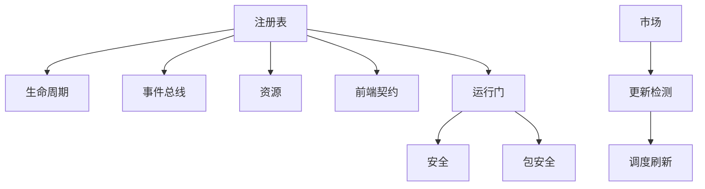

图表来源
- [backend/app/plugins/registry.py](file://backend/app/plugins/registry.py)
- [backend/app/plugins/lifecycle.py](file://backend/app/plugins/lifecycle.py)
- [backend/app/plugins/event_bus.py](file://backend/app/plugins/event_bus.py)
- [backend/app/plugins/asset_resolver.py](file://backend/app/plugins/asset_resolver.py)
- [backend/app/plugins/frontend_contract.py](file://backend/app/plugins/frontend_contract.py)
- [backend/app/plugins/runtime_gate.py](file://backend/app/plugins/runtime_gate.py)
- [backend/app/plugins/security.py](file://backend/app/plugins/security.py)
- [backend/app/plugins/package_security.py](file://backend/app/plugins/package_security.py)
- [backend/app/plugins/marketplace.py](file://backend/app/plugins/marketplace.py)
- [backend/app/plugins/update_checker.py](file://backend/app/plugins/update_checker.py)
- [backend/app/plugins/scheduler_refresh.py](file://backend/app/plugins/scheduler_refresh.py)

章节来源
- [backend/app/plugins/registry.py](file://backend/app/plugins/registry.py)
- [backend/app/plugins/lifecycle.py](file://backend/app/plugins/lifecycle.py)
- [backend/app/plugins/event_bus.py](file://backend/app/plugins/event_bus.py)
- [backend/app/plugins/asset_resolver.py](file://backend/app/plugins/asset_resolver.py)
- [backend/app/plugins/frontend_contract.py](file://backend/app/plugins/frontend_contract.py)
- [backend/app/plugins/runtime_gate.py](file://backend/app/plugins/runtime_gate.py)
- [backend/app/plugins/security.py](file://backend/app/plugins/security.py)
- [backend/app/plugins/package_security.py](file://backend/app/plugins/package_security.py)
- [backend/app/plugins/marketplace.py](file://backend/app/plugins/marketplace.py)
- [backend/app/plugins/update_checker.py](file://backend/app/plugins/update_checker.py)
- [backend/app/plugins/scheduler_refresh.py](file://backend/app/plugins/scheduler_refresh.py)

## 性能考量
- 资源缓存与门禁: 使用运行门与资产运行时减少重复解析与鉴权开销。
- 事件批处理: 事件总线应避免高频细粒度事件风暴，必要时合并或限流。
- 生命周期迁移: 将耗时迁移拆分为多步，避免阻塞主流程。
- 版本管理: 采用版本锁定与兼容检查，减少回滚与重装成本。
- 调度刷新: 合理设置刷新频率，避免过度轮询。

## 故障排除指南
- 清单校验失败: 检查必需字段、版本格式、依赖合法性与资产路径。
- 注册失败: 查看启动边界与扩展注册日志，确认依赖解析与上下文工厂。
- 生命周期异常: 检查迁移路径、锁状态与清理安全策略。
- 资源不可访问: 核对运行门授权、资产解析与公共路由。
- 前端契约不一致: 对照菜单/动作/权限暴露策略，确保前后端一致。
- 安全问题: 检查运行门、包安全与许可证策略，确保合规。
- 市场更新不同步: 检查更新检测与调度刷新配置。

章节来源
- [backend/tests/test_plugin_manifest_validation.py](file://backend/tests/test_plugin_manifest_validation.py)
- [backend/tests/test_plugin_startup_discovery_boundaries.py](file://backend/tests/test_plugin_startup_discovery_boundaries.py)
- [backend/tests/test_plugin_startup_restore_modes.py](file://backend/tests/test_plugin_startup_restore_modes.py)
- [backend/tests/test_plugin_lifecycle_migrations.py](file://backend/tests/test_plugin_lifecycle_migrations.py)
- [backend/tests/test_plugin_asset_resolver.py](file://backend/tests/test_plugin_asset_resolver.py)
- [backend/tests/test_plugin_asset_runtime_gate.py](file://backend/tests/test_plugin_asset_runtime_gate.py)
- [backend/tests/test_plugin_frontend_contracts.py](file://backend/tests/test_plugin_frontend_contracts.py)
- [backend/tests/test_plugin_crypto.py](file://backend/tests/test_plugin_crypto.py)
- [backend/tests/test_plugin_package_security.py](file://backend/tests/test_plugin_package_security.py)
- [backend/tests/test_plugin_license_verification_policy.py](file://backend/tests/test_plugin_license_verification_policy.py)
- [backend/tests/test_plugin_marketplace_contract.py](file://backend/tests/test_plugin_marketplace_contract.py)
- [backend/tests/test_plugin_scheduler_refresh.py](file://backend/tests/test_plugin_scheduler_refresh.py)

## 结论
本指南系统梳理了插件开发的全生命周期与关键机制，从清单定义、注册加载、生命周期管理、事件处理、资源与前端契约，到安全与许可、市场与更新、CLI工具链与测试验证。遵循本文档的规范与最佳实践，可高效、安全地开发高质量插件，并顺利发布与维护。

## 附录
- 开发流程概览: 创建 → 编写清单 → 实现后端服务/前端组件 → 资源与契约定义 → 生命周期与迁移 → 安全与许可策略 → 打包与校验 → 发布与更新 → 测试与回归
- 调试技巧: 使用测试用例驱动开发，关注注册边界、运行门授权、事件分发、资产解析与市场同步；利用CLI工具快速迭代
- 最佳实践: 明确职责边界、最小依赖、幂等设计、可观测性与日志、版本兼容与迁移策略、安全优先与最小权限原则
- 版本管理与更新: 使用版本管理器锁定版本，制定迁移路径，启用更新检测与调度刷新，确保平滑升级
- 市场发布与维护: 通过市场同步清单与资产，收集用户反馈，定期更新与修复，保持许可证与曝光策略有效