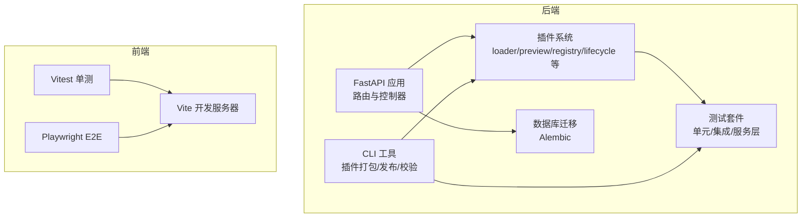
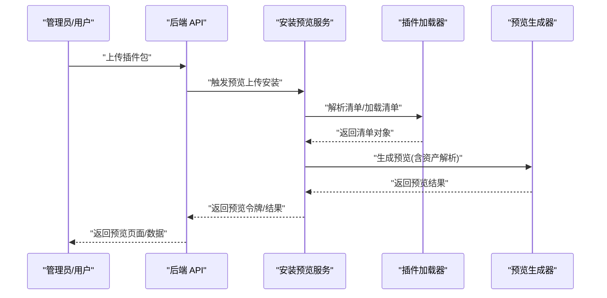
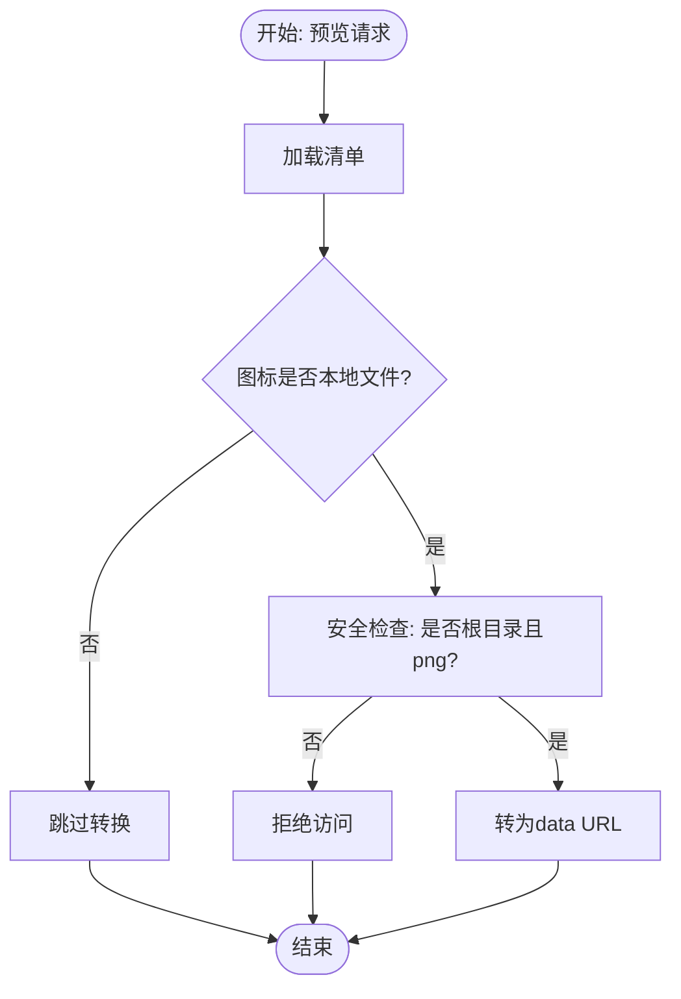
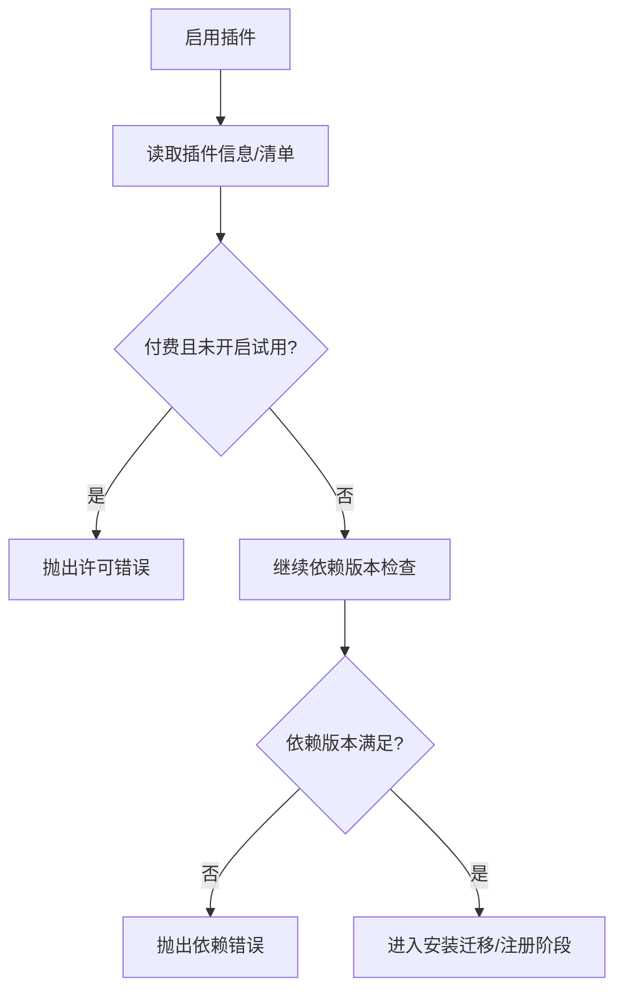
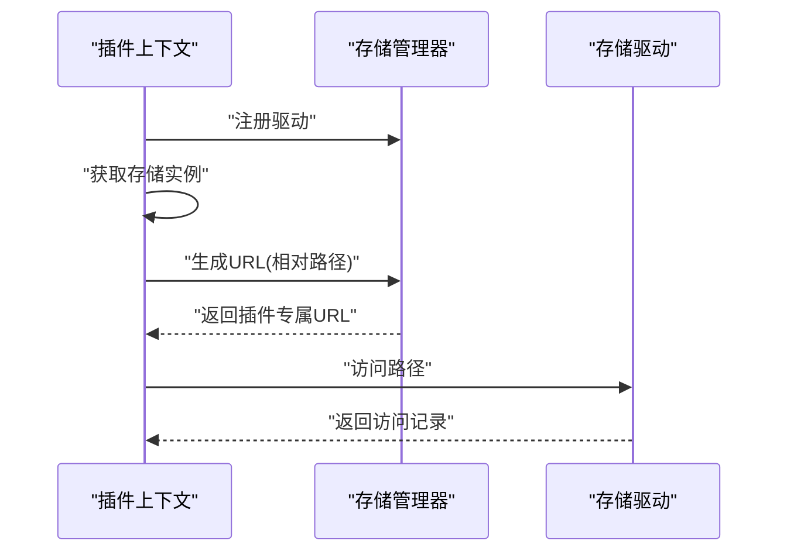
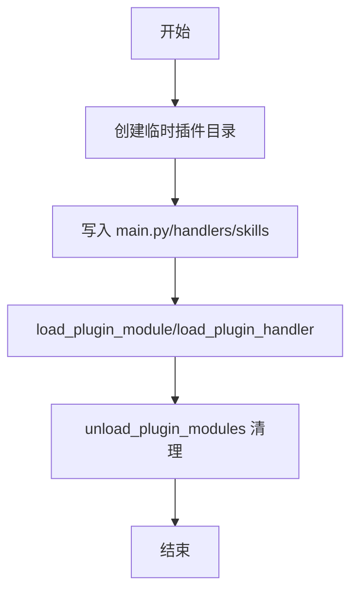
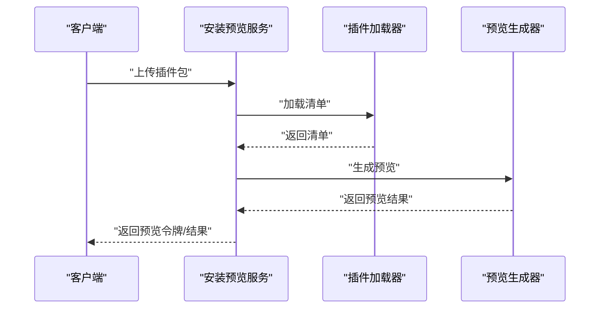
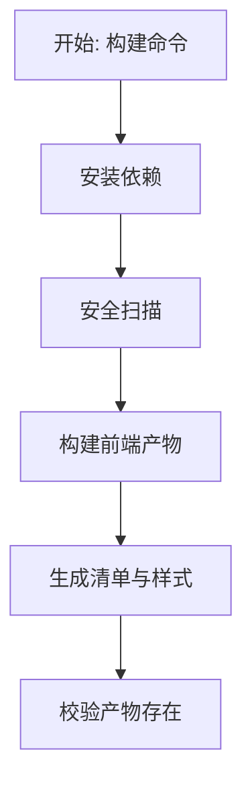
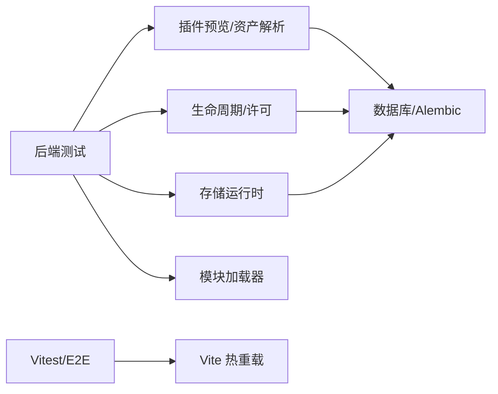

# 测试和调试

<cite>
**本文引用的文件**
- [test_plugin_admin_contracts.py](file://backend/tests/test_plugin_admin_contracts.py)
- [test_admin_plugin_read_routes_contract.py](file://backend/tests/test_admin_plugin_read_routes_contract.py)
- [test_plugin_storage_runtime.py](file://backend/tests/test_plugin_storage_runtime.py)
- [test_plugin_dependency_runtime_model.py](file://backend/tests/test_plugin_dependency_runtime_model.py)
- [test_plugin_trial_license_policy.py](file://backend/tests/test_plugin_trial_license_policy.py)
- [test_plugin_module_loader.py](file://backend/tests/test_plugin_module_loader.py)
- [test_plugin_lifecycle_license_gate.py](file://backend/tests/test_plugin_lifecycle_license_gate.py)
- [preview.py](file://backend/app/plugins/preview.py)
- [test_plugin_asset_resolver.py](file://backend/tests/test_plugin_asset_resolver.py)
- [test_plugin_cli_release_workflow.py](file://backend/tests/test_plugin_cli_release_workflow.py)
- [test_plugin_install_preview_service.py](file://backend/tests/services/test_plugin_install_preview_service.py)
- [loader.py](file://backend/app/plugins/loader.py)
- [sample_plugin.yaml](file://backend/tests/fixtures/sample_plugin.yaml)
- [vitest.config.ts](file://frontend/apps/web-antd/vitest.config.ts)
- [playwright.config.ts](file://frontend/apps/web-antd/playwright.config.ts)
- [playwright_mcp_config.json](file://frontend/apps/web-antd/playwright_mcp_config.json)
- [vite.config.mts](file://frontend/apps/web-antd/vite.config.mts)
- [pyproject.toml](file://backend/pyproject.toml)
- [alembic.ini](file://backend/alembic.ini)
- [docker-compose.dev.yml](file://backend/docker-compose.dev.yml)
- [docker-compose.prod.yml](file://backend/docker-compose.prod.yml)
- [CONTRIBUTING.md](file://CONTRIBUTING.md)
- [README.md](file://README.md)
</cite>

## 目录
1. [简介](#简介)
2. [项目结构](#项目结构)
3. [核心组件](#核心组件)
4. [架构总览](#架构总览)
5. [详细组件分析](#详细组件分析)
6. [依赖关系分析](#依赖关系分析)
7. [性能考量](#性能考量)
8. [故障排查指南](#故障排查指南)
9. [结论](#结论)
10. [附录](#附录)

## 简介
本指南面向插件开发者与测试工程师，系统阐述插件测试与调试的策略、方法与工具使用，覆盖单元测试、集成测试与端到端测试的编写规范与最佳实践；同时涵盖插件预览、开发环境配置与热重载机制；最后给出自动化流程、持续集成与质量保证建议，并提供可复用的测试与调试示例路径。

## 项目结构
后端采用 Python/FastAPI + Alembic 迁移；前端采用 Vite/Vitest/Playwright；插件体系位于 backend/app/plugins 与 backend/tests 下，配套 CLI 工具位于 backend/scripts 与 tests。

图示来源
- [preview.py:159-185](file://backend/app/plugins/preview.py#L159-L185)
- [pyproject.toml](file://backend/pyproject.toml)
- [alembic.ini](file://backend/alembic.ini)

章节来源
- [pyproject.toml](file://backend/pyproject.toml)
- [alembic.ini](file://backend/alembic.ini)

## 核心组件
- 插件预览与资产解析：用于在未安装状态下生成预览、解析插件资产路径与安全校验。
- 插件生命周期与许可：负责插件启用前的许可校验、依赖满足性检查等。
- 插件存储运行时：提供插件侧存储访问能力与 URL 生成。
- 插件模块加载器：统一加载插件子模块与处理器，支持卸载清理。
- 插件安装预览服务：接收上传包，生成预览令牌与预览内容。
- 后端测试：覆盖插件审计契约、资产解析、依赖模型、试用许可、生命周期许可门禁、模块加载器等。
- 前端测试：Vitest 单测与 Playwright E2E，结合 Vite 热重载。

章节来源
- [preview.py:159-185](file://backend/app/plugins/preview.py#L159-L185)
- [test_plugin_asset_resolver.py:42-97](file://backend/tests/test_plugin_asset_resolver.py#L42-L97)
- [test_plugin_dependency_runtime_model.py:1-32](file://backend/tests/test_plugin_dependency_runtime_model.py#L1-L32)
- [test_plugin_trial_license_policy.py:1-46](file://backend/tests/test_plugin_trial_license_policy.py#L1-L46)
- [test_plugin_lifecycle_license_gate.py:1-48](file://backend/tests/test_plugin_lifecycle_license_gate.py#L1-L48)
- [test_plugin_module_loader.py:1-55](file://backend/tests/test_plugin_module_loader.py#L1-L55)
- [test_plugin_install_preview_service.py:144-161](file://backend/tests/services/test_plugin_install_preview_service.py#L144-L161)

## 架构总览
下图展示“插件安装预览”从上传到生成预览的关键调用链路，映射到实际源码中的服务与函数。

图示来源
- [test_plugin_install_preview_service.py:144-161](file://backend/tests/services/test_plugin_install_preview_service.py#L144-L161)
- [preview.py:159-185](file://backend/app/plugins/preview.py#L159-L185)
- [loader.py](file://backend/app/plugins/loader.py)

章节来源
- [test_plugin_install_preview_service.py:144-161](file://backend/tests/services/test_plugin_install_preview_service.py#L144-L161)
- [preview.py:159-185](file://backend/app/plugins/preview.py#L159-L185)

## 详细组件分析

### 组件一：插件预览与资产解析
- 预览流程要点
  - 支持对暂存/临时目录进行预览，无需先安装至插件目录。
  - 图标文件若为本地图片，自动转为 data URL，避免未安装时无法通过静态资源路由访问。
  - 防止路径穿越，严格限定图标文件必须位于插件根目录且扩展名为 png。
- 资产解析规则
  - 根目录仅允许 icon.png；子目录图标需走前端构建产物路径。
  - 非图标扩展名一律拒绝。
- 关键测试覆盖
  - 路径穿越检测、根目录图标允许、子目录图标拒绝、非图标文件拒绝。

图示来源
- [preview.py:159-185](file://backend/app/plugins/preview.py#L159-L185)
- [test_plugin_asset_resolver.py:42-97](file://backend/tests/test_plugin_asset_resolver.py#L42-L97)

章节来源
- [preview.py:159-185](file://backend/app/plugins/preview.py#L159-L185)
- [test_plugin_asset_resolver.py:42-97](file://backend/tests/test_plugin_asset_resolver.py#L42-L97)

### 组件二：插件生命周期与许可门禁
- 许可策略
  - 付费插件若未开启试用，则禁止生成试用许可。
  - 未满足版本约束的依赖将被拒绝。
- 生命周期门禁
  - 在启用阶段进行许可与权限校验，必要时回滚或标记数据库会话状态。
- 关键测试覆盖
  - 付费插件试用关闭时拒绝生成试用许可。
  - 版本满足性判断（通配符、范围）。
  - 启用阶段的许可门禁与事务嵌套处理。

图示来源
- [test_plugin_trial_license_policy.py:22-46](file://backend/tests/test_plugin_trial_license_policy.py#L22-L46)
- [test_plugin_dependency_runtime_model.py:29-32](file://backend/tests/test_plugin_dependency_runtime_model.py#L29-L32)
- [test_plugin_lifecycle_license_gate.py:23-48](file://backend/tests/test_plugin_lifecycle_license_gate.py#L23-L48)

章节来源
- [test_plugin_trial_license_policy.py:1-46](file://backend/tests/test_plugin_trial_license_policy.py#L1-L46)
- [test_plugin_dependency_runtime_model.py:1-32](file://backend/tests/test_plugin_dependency_runtime_model.py#L1-L32)
- [test_plugin_lifecycle_license_gate.py:1-48](file://backend/tests/test_plugin_lifecycle_license_gate.py#L1-L48)

### 组件三：插件存储运行时
- 功能概述
  - 插件上下文提供存储访问能力，生成插件专属 URL。
  - 驱动访问路径受控，确保仅访问插件目录内的资源。
- 关键测试覆盖
  - 注册驱动后可访问存储。
  - 生成 URL 符合预期格式。
  - 访问路径被正确记录。

图示来源
- [test_plugin_storage_runtime.py:100-128](file://backend/tests/test_plugin_storage_runtime.py#L100-L128)

章节来源
- [test_plugin_storage_runtime.py:100-128](file://backend/tests/test_plugin_storage_runtime.py#L100-L128)

### 组件四：插件模块加载器
- 功能概述
  - 统一加载插件子模块与处理函数。
  - 提供模块卸载清理，避免测试间污染。
- 关键测试覆盖
  - 加载子模块、加载显式处理函数、清理 sys.modules。

图示来源
- [test_plugin_module_loader.py:17-55](file://backend/tests/test_plugin_module_loader.py#L17-L55)

章节来源
- [test_plugin_module_loader.py:1-55](file://backend/tests/test_plugin_module_loader.py#L1-L55)

### 组件五：插件安装预览服务
- 功能概述
  - 接收上传包，解析清单，生成预览令牌与预览内容。
  - 预览完成后清理暂存目录。
- 关键测试覆盖
  - 上传安装触发预览生成。
  - 生成预览令牌。
  - 预览调用与暂存清理。

图示来源
- [test_plugin_install_preview_service.py:144-161](file://backend/tests/services/test_plugin_install_preview_service.py#L144-L161)

章节来源
- [test_plugin_install_preview_service.py:144-161](file://backend/tests/services/test_plugin_install_preview_service.py#L144-L161)

### 组件六：插件 CLI 发布工作流
- 功能概述
  - 自动执行安装依赖、构建前端产物、生成清单与样式文件。
  - 安全扫描前置，构建前校验。
- 关键测试覆盖
  - 命令顺序：先安装再构建。
  - 安全扫描前置。
  - 产物存在性校验（清单、样式）。

图示来源
- [test_plugin_cli_release_workflow.py:596-635](file://backend/tests/test_plugin_cli_release_workflow.py#L596-L635)

章节来源
- [test_plugin_cli_release_workflow.py:596-635](file://backend/tests/test_plugin_cli_release_workflow.py#L596-L635)

## 依赖关系分析
- 后端测试依赖
  - FastAPI 测试客户端与依赖注入覆盖（如数据库、管理员身份）。
  - 插件运行时审计、存储驱动、依赖模型、许可策略等。
- 前端测试依赖
  - Vitest 单测与 Playwright E2E，结合 Vite 热重载。
- 外部依赖
  - Alembic 迁移、Docker Compose 开发/生产环境。

图示来源
- [test_plugin_admin_contracts.py:1-47](file://backend/tests/test_plugin_admin_contracts.py#L1-L47)
- [test_admin_plugin_read_routes_contract.py:1-50](file://backend/tests/test_admin_plugin_read_routes_contract.py#L1-L50)
- [vitest.config.ts](file://frontend/apps/web-antd/vitest.config.ts)
- [playwright.config.ts](file://frontend/apps/web-antd/playwright.config.ts)
- [vite.config.mts](file://frontend/apps/web-antd/vite.config.mts)
- [alembic.ini](file://backend/alembic.ini)

章节来源
- [test_plugin_admin_contracts.py:1-47](file://backend/tests/test_plugin_admin_contracts.py#L1-L47)
- [test_admin_plugin_read_routes_contract.py:1-50](file://backend/tests/test_admin_plugin_read_routes_contract.py#L1-L50)
- [vitest.config.ts](file://frontend/apps/web-antd/vitest.config.ts)
- [playwright.config.ts](file://frontend/apps/web-antd/playwright.config.ts)
- [vite.config.mts](file://frontend/apps/web-antd/vite.config.mts)
- [alembic.ini](file://backend/alembic.ini)

## 性能考量
- 预览阶段避免重复 IO：对图标进行一次 base64 转换即可。
- 存储驱动访问路径缓存：减少重复拼接与校验。
- CLI 构建流水线：将安装与构建拆分，便于并行与缓存命中。
- 数据库事务：在生命周期门禁中使用嵌套事务，降低回滚成本。

## 故障排查指南
- 预览失败
  - 检查图标是否位于根目录且为 png；确认路径未穿越。
  - 参考：[preview.py:159-185](file://backend/app/plugins/preview.py#L159-L185)、[test_plugin_asset_resolver.py:42-97](file://backend/tests/test_plugin_asset_resolver.py#L42-L97)
- 试用许可被拒
  - 确认插件定价类型与清单中的试用开关设置。
  - 参考：[test_plugin_trial_license_policy.py:22-46](file://backend/tests/test_plugin_trial_license_policy.py#L22-L46)
- 依赖不满足
  - 校验版本约束表达式与当前版本。
  - 参考：[test_plugin_dependency_runtime_model.py:29-32](file://backend/tests/test_plugin_dependency_runtime_model.py#L29-L32)
- 启用阶段异常
  - 观察事务嵌套与回滚逻辑，定位数据库会话状态。
  - 参考：[test_plugin_lifecycle_license_gate.py:23-48](file://backend/tests/test_plugin_lifecycle_license_gate.py#L23-L48)
- 模块加载冲突
  - 使用测试夹具清理 sys.modules，避免跨用例污染。
  - 参考：[test_plugin_module_loader.py:17-55](file://backend/tests/test_plugin_module_loader.py#L17-L55)
- CLI 构建失败
  - 确认安装与构建顺序、安全扫描无告警、产物存在。
  - 参考：[test_plugin_cli_release_workflow.py:596-635](file://backend/tests/test_plugin_cli_release_workflow.py#L596-L635)

章节来源
- [preview.py:159-185](file://backend/app/plugins/preview.py#L159-L185)
- [test_plugin_asset_resolver.py:42-97](file://backend/tests/test_plugin_asset_resolver.py#L42-L97)
- [test_plugin_trial_license_policy.py:22-46](file://backend/tests/test_plugin_trial_license_policy.py#L22-L46)
- [test_plugin_dependency_runtime_model.py:29-32](file://backend/tests/test_plugin_dependency_runtime_model.py#L29-L32)
- [test_plugin_lifecycle_license_gate.py:23-48](file://backend/tests/test_plugin_lifecycle_license_gate.py#L23-L48)
- [test_plugin_module_loader.py:17-55](file://backend/tests/test_plugin_module_loader.py#L17-L55)
- [test_plugin_cli_release_workflow.py:596-635](file://backend/tests/test_plugin_cli_release_workflow.py#L596-L635)

## 结论
通过完善的测试矩阵与工具链，插件体系在预览、许可、依赖、存储与 CLI 发布等关键环节具备高可靠性保障。建议在日常开发中坚持“先单元后集成再端到端”的测试策略，并配合热重载与自动化流水线，持续提升质量与交付效率。

## 附录

### 测试与调试最佳实践
- 单元测试
  - 使用 pytest 与 AsyncMock/MagicMock 模拟异步依赖与外部服务。
  - 使用夹具清理全局状态（如 sys.modules），避免用例耦合。
  - 示例参考：[test_plugin_module_loader.py:17-55](file://backend/tests/test_plugin_module_loader.py#L17-L55)
- 集成测试
  - 使用 FastAPI TestClient 与依赖覆盖（如 get_db、get_current_active_admin）。
  - 示例参考：[test_admin_plugin_read_routes_contract.py:42-50](file://backend/tests/test_admin_plugin_read_routes_contract.py#L42-L50)
- 端到端测试
  - 前端使用 Vitest 与 Playwright，结合 Vite 热重载进行交互验证。
  - 示例参考：[vitest.config.ts](file://frontend/apps/web-antd/vitest.config.ts)、[playwright.config.ts](file://frontend/apps/web-antd/playwright.config.ts)、[playwright_mcp_config.json](file://frontend/apps/web-antd/playwright_mcp_config.json)
- Mock 数据准备
  - 使用 SimpleNamespace 或 MagicMock 构造最小可用对象，覆盖关键字段与方法。
  - 示例参考：[test_plugin_admin_contracts.py:30-47](file://backend/tests/test_plugin_admin_contracts.py#L30-L47)
- 调试工具
  - 后端：pytest + asyncio，结合断点与日志。
  - 前端：Vite Dev Server + 浏览器调试器。
  - 参考：[vite.config.mts](file://frontend/apps/web-antd/vite.config.mts)

### 开发环境配置与热重载
- 后端
  - 使用 Docker Compose 开发环境启动数据库与应用。
  - 参考：[docker-compose.dev.yml](file://backend/docker-compose.dev.yml)
- 前端
  - Vite 提供热重载与快速反馈。
  - 参考：[vite.config.mts](file://frontend/apps/web-antd/vite.config.mts)
- 插件清单与样例
  - 使用测试夹具中的样例清单作为基准。
  - 参考：[sample_plugin.yaml](file://backend/tests/fixtures/sample_plugin.yaml)

### 自动化流程与持续集成
- 后端
  - 使用 pyproject.toml 中的测试脚本与 Alembic 迁移。
  - 参考：[pyproject.toml](file://backend/pyproject.toml)、[alembic.ini](file://backend/alembic.ini)
- 前端
  - 使用 Vitest 与 Playwright 的配置文件组织测试。
  - 参考：[vitest.config.ts](file://frontend/apps/web-antd/vitest.config.ts)、[playwright.config.ts](file://frontend/apps/web-antd/playwright.config.ts)
- 生产部署
  - 使用 Docker Compose 生产环境编排。
  - 参考：[docker-compose.prod.yml](file://backend/docker-compose.prod.yml)

章节来源
- [docker-compose.dev.yml](file://backend/docker-compose.dev.yml)
- [docker-compose.prod.yml](file://backend/docker-compose.prod.yml)
- [pyproject.toml](file://backend/pyproject.toml)
- [alembic.ini](file://backend/alembic.ini)
- [vitest.config.ts](file://frontend/apps/web-antd/vitest.config.ts)
- [playwright.config.ts](file://frontend/apps/web-antd/playwright.config.ts)
- [playwright_mcp_config.json](file://frontend/apps/web-antd/playwright_mcp_config.json)
- [vite.config.mts](file://frontend/apps/web-antd/vite.config.mts)
- [sample_plugin.yaml](file://backend/tests/fixtures/sample_plugin.yaml)