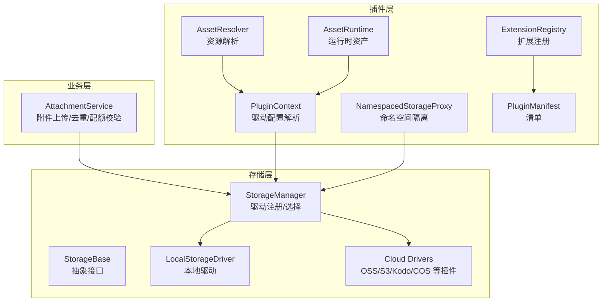
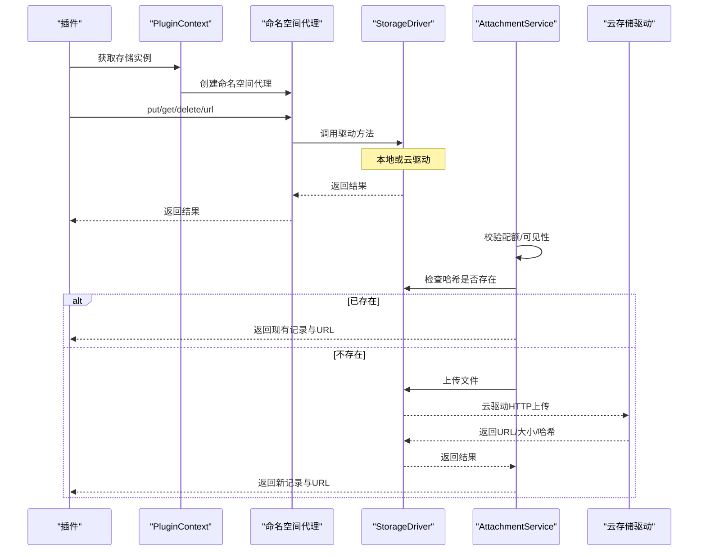
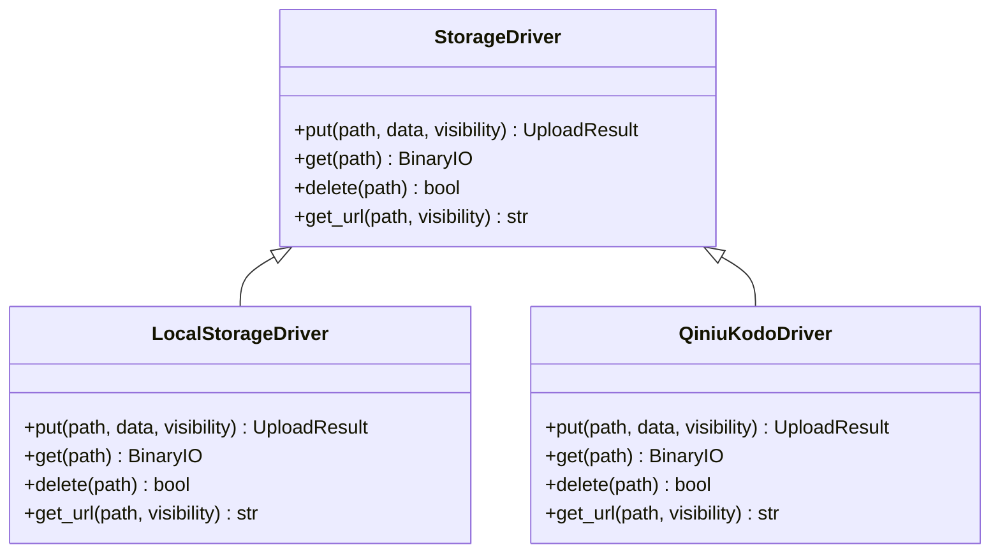
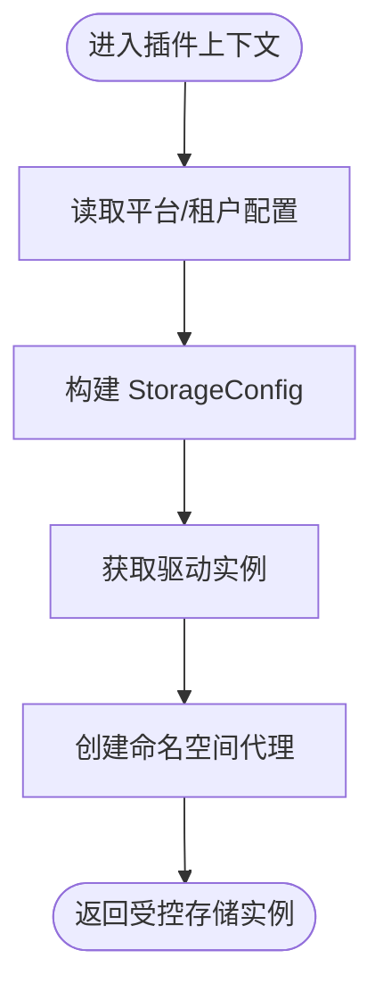
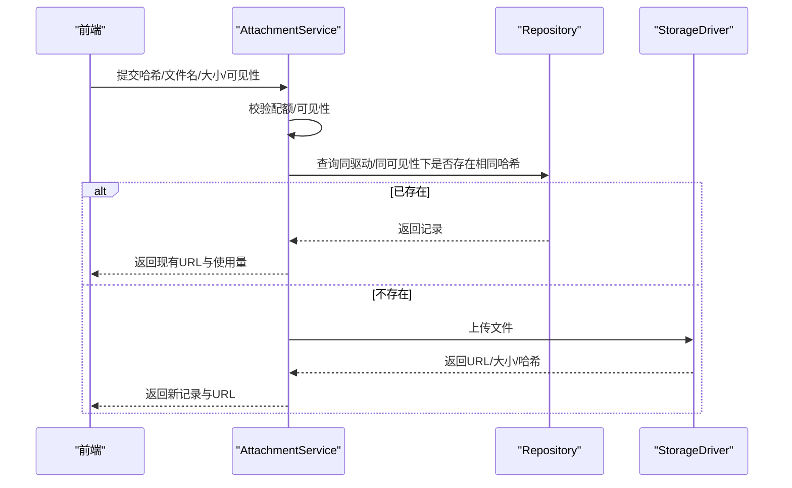
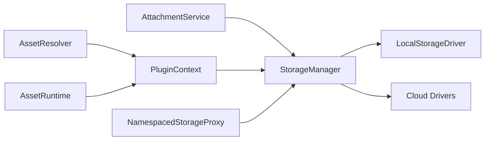

# 资源和文件管理

<cite>
**本文引用的文件**
- [backend/app/storage/base.py](file://backend/app/storage/base.py)
- [backend/app/storage/manager.py](file://backend/app/storage/manager.py)
- [backend/app/storage/drivers/local.py](file://backend/app/storage/drivers/local.py)
- [backend/app/storage/drivers/__init__.py](file://backend/app/storage/drivers/__init__.py)
- [backend/app/plugins/context.py](file://backend/app/plugins/context.py)
- [backend/app/plugins/context_primitives.py](file://backend/app/plugins/context_primitives.py)
- [backend/app/plugins/asset_resolver.py](file://backend/app/plugins/asset_resolver.py)
- [backend/app/plugins/asset_runtime.py](file://backend/app/plugins/asset_runtime.py)
- [backend/app/plugins/registry.py](file://backend/app/plugins/registry.py)
- [backend/app/plugins/manifest.py](file://backend/app/plugins/manifest.py)
- [backend/app/services/tenant/attachment_service.py](file://backend/app/services/tenant/attachment_service.py)
- [backend/plugins/qiniu-kodo/backend/driver.py](file://backend/plugins/qiniu-kodo/backend/driver.py)
- [backend/plugins/storage-migration/README.md](file://backend/plugins/storage-migration/README.md)
- [backend/plugins/storage-billing/backend/migrations/versions/001_initial.py](file://backend/plugins/storage-billing/backend/migrations/versions/001_initial.py)
- [backend/tests/test_plugin_storage_runtime.py](file://backend/tests/test_plugin_storage_runtime.py)
</cite>

## 目录
1. [引言](#引言)
2. [项目结构](#项目结构)
3. [核心组件](#核心组件)
4. [架构总览](#架构总览)
5. [详细组件分析](#详细组件分析)
6. [依赖关系分析](#依赖关系分析)
7. [性能考虑](#性能考虑)
8. [故障排查指南](#故障排查指南)
9. [结论](#结论)
10. [附录](#附录)

## 引言
本指南面向插件生态中的资源与文件管理，系统阐述插件资源的分类、存储策略、访问控制、上传/下载/删除/版本管理流程，以及缓存、CDN 集成与性能优化策略。文档同时覆盖插件与存储系统的集成方式、驱动程序配置、故障转移机制，并给出安全与权限控制、数据保护的最佳实践与完整示例（图片处理、文档存储、多媒体资源管理）。

## 项目结构
围绕“插件资源与文件管理”的关键目录与文件如下：
- 存储抽象与驱动：backend/app/storage
- 插件上下文与命名空间隔离：backend/app/plugins
- 附件服务与去重上传：backend/app/services/tenant/attachment_service.py
- 云存储驱动示例（七牛 Kodo）：backend/plugins/qiniu-kodo/backend/driver.py
- 存储迁移与计费插件：backend/plugins/storage-migration、backend/plugins/storage-billing
- 测试用例：backend/tests/test_plugin_storage_runtime.py

图表来源
- [backend/app/storage/base.py](file://backend/app/storage/base.py)
- [backend/app/storage/manager.py](file://backend/app/storage/manager.py)
- [backend/app/storage/drivers/local.py](file://backend/app/storage/drivers/local.py)
- [backend/app/plugins/context.py](file://backend/app/plugins/context.py)
- [backend/app/plugins/context_primitives.py](file://backend/app/plugins/context_primitives.py)
- [backend/app/plugins/asset_resolver.py](file://backend/app/plugins/asset_resolver.py)
- [backend/app/plugins/asset_runtime.py](file://backend/app/plugins/asset_runtime.py)
- [backend/app/plugins/registry.py](file://backend/app/plugins/registry.py)
- [backend/app/plugins/manifest.py](file://backend/app/plugins/manifest.py)
- [backend/app/services/tenant/attachment_service.py](file://backend/app/services/tenant/attachment_service.py)

章节来源
- [backend/app/storage/base.py](file://backend/app/storage/base.py)
- [backend/app/storage/manager.py](file://backend/app/storage/manager.py)
- [backend/app/storage/drivers/local.py](file://backend/app/storage/drivers/local.py)
- [backend/app/plugins/context.py](file://backend/app/plugins/context.py)
- [backend/app/plugins/context_primitives.py](file://backend/app/plugins/context_primitives.py)
- [backend/app/plugins/asset_resolver.py](file://backend/app/plugins/asset_resolver.py)
- [backend/app/plugins/asset_runtime.py](file://backend/app/plugins/asset_runtime.py)
- [backend/app/plugins/registry.py](file://backend/app/plugins/registry.py)
- [backend/app/plugins/manifest.py](file://backend/app/plugins/manifest.py)
- [backend/app/services/tenant/attachment_service.py](file://backend/app/services/tenant/attachment_service.py)

## 核心组件
- 存储抽象与驱动
  - 抽象基类定义统一的上传、下载、删除、URL 生成等接口，确保不同驱动的一致行为。
  - 内置本地驱动；云驱动（如 OSS/S3/Kodo/COS）以插件形式提供。
- 插件上下文与命名空间
  - 解析平台或租户级存储配置，构造驱动实例，并通过命名空间代理限制插件访问范围。
- 资产解析与运行时
  - 提供前端公开资产路由与运行时资产加载能力，支持插件公开资源的访问控制。
- 附件服务
  - 实现基于哈希的重复检测、配额校验、可见性控制与使用量统计，避免重复上传并保障资源一致性。

章节来源
- [backend/app/storage/base.py](file://backend/app/storage/base.py)
- [backend/app/storage/manager.py](file://backend/app/storage/manager.py)
- [backend/app/storage/drivers/local.py](file://backend/app/storage/drivers/local.py)
- [backend/app/plugins/context.py](file://backend/app/plugins/context.py)
- [backend/app/plugins/context_primitives.py](file://backend/app/plugins/context_primitives.py)
- [backend/app/plugins/asset_resolver.py](file://backend/app/plugins/asset_resolver.py)
- [backend/app/plugins/asset_runtime.py](file://backend/app/plugins/asset_runtime.py)
- [backend/app/services/tenant/attachment_service.py](file://backend/app/services/tenant/attachment_service.py)

## 架构总览
插件资源管理的整体流程：
- 插件通过插件上下文获取存储驱动，使用命名空间代理进行受限访问。
- 业务侧（如附件服务）在上传前进行配额与可见性校验，并基于哈希判断是否重复上传。
- 云存储驱动通过 HTTP 客户端拉取/上传对象，返回统一的结果结构。
- 资产解析器与运行时负责对外暴露可访问的资源 URL。

图表来源
- [backend/app/plugins/context.py](file://backend/app/plugins/context.py)
- [backend/app/plugins/context_primitives.py](file://backend/app/plugins/context_primitives.py)
- [backend/app/storage/manager.py](file://backend/app/storage/manager.py)
- [backend/app/storage/base.py](file://backend/app/storage/base.py)
- [backend/plugins/qiniu-kodo/backend/driver.py](file://backend/plugins/qiniu-kodo/backend/driver.py)
- [backend/app/services/tenant/attachment_service.py](file://backend/app/services/tenant/attachment_service.py)

## 详细组件分析

### 存储抽象与驱动
- 抽象接口
  - 统一定义 put/get/delete/get_url 等方法，保证多驱动一致性。
- 本地驱动
  - 基于文件系统实现，适合开发与小规模部署。
- 云驱动
  - 示例：七牛 Kodo 驱动，通过 HTTP 客户端进行上传与下载，异常映射为统一错误类型。

图表来源
- [backend/app/storage/base.py](file://backend/app/storage/base.py)
- [backend/app/storage/drivers/local.py](file://backend/app/storage/drivers/local.py)
- [backend/plugins/qiniu-kodo/backend/driver.py](file://backend/plugins/qiniu-kodo/backend/driver.py)

章节来源
- [backend/app/storage/base.py](file://backend/app/storage/base.py)
- [backend/app/storage/drivers/local.py](file://backend/app/storage/drivers/local.py)
- [backend/plugins/qiniu-kodo/backend/driver.py](file://backend/plugins/qiniu-kodo/backend/driver.py)

### 插件上下文与命名空间隔离
- 配置解析
  - 优先读取平台级配置，其次回退到租户级配置；本地驱动默认根路径为内置常量，其他驱动默认根路径为 plugins。
- 命名空间代理
  - 对外暴露的方法签名与驱动一致，内部自动为路径添加 plugins/{name}/ 前缀，并进行路径规范化与逃逸防护。
- 运行时资产与公开资源
  - 提供资产解析与运行时加载能力，结合访问控制策略限制资源暴露范围。

图表来源
- [backend/app/plugins/context.py](file://backend/app/plugins/context.py)
- [backend/app/plugins/context_primitives.py](file://backend/app/plugins/context_primitives.py)

章节来源
- [backend/app/plugins/context.py](file://backend/app/plugins/context.py)
- [backend/app/plugins/context_primitives.py](file://backend/app/plugins/context_primitives.py)
- [backend/app/plugins/asset_resolver.py](file://backend/app/plugins/asset_resolver.py)
- [backend/app/plugins/asset_runtime.py](file://backend/app/plugins/asset_runtime.py)

### 附件服务与重复上传
- 去重逻辑
  - 前端先计算 SHA-256 哈希，后端在同一企业、同一驱动下按哈希查询是否存在，若存在则直接复用，避免重复上传。
- 配额与可见性
  - 上传前进行文件大小与类型校验，结合可见性策略（如私有/公共）决定访问控制。
- 使用量统计
  - 返回当前已使用字节数，便于前端展示与配额提示。

图表来源
- [backend/app/services/tenant/attachment_service.py](file://backend/app/services/tenant/attachment_service.py)

章节来源
- [backend/app/services/tenant/attachment_service.py](file://backend/app/services/tenant/attachment_service.py)

### 云存储驱动（七牛 Kodo）实现要点
- 上传
  - 将内容写入云端，返回统一的 UploadResult，包含路径、URL、大小、哈希、MIME 类型与驱动标识。
- 下载
  - 通过预签名 URL 或直链获取对象内容，状态码 404 映射为未找到错误。
- 删除
  - 通过键删除对象，返回布尔结果。
- 错误处理
  - 将网络错误与状态码错误映射为统一存储错误类型，便于上层捕获与降级。

章节来源
- [backend/plugins/qiniu-kodo/backend/driver.py](file://backend/plugins/qiniu-kodo/backend/driver.py)

### 存储迁移与计费插件
- 存储迁移插件
  - 至少需要两个可用存储驱动（插件安装启用），管理员权限方可操作，支持跨驱动的数据迁移。
- 存储计费插件
  - 初始化数据库表结构，用于记录存储用量与计费信息，支撑资源成本核算。

章节来源
- [backend/plugins/storage-migration/README.md](file://backend/plugins/storage-migration/README.md)
- [backend/plugins/storage-billing/backend/migrations/versions/001_initial.py](file://backend/plugins/storage-billing/backend/migrations/versions/001_initial.py)

### 测试用例：插件存储运行时
- 验证点
  - 存储驱动注册与命名空间隔离生效，插件仅能访问 plugins/{name}/ 前缀路径。
  - 通过代理调用驱动，路径规范化与逃逸防护有效。

章节来源
- [backend/tests/test_plugin_storage_runtime.py](file://backend/tests/test_plugin_storage_runtime.py)

## 依赖关系分析
- 存储层
  - StorageManager 负责驱动注册与选择；LocalStorageDriver 作为内置驱动；云驱动以插件形式注入。
- 插件层
  - PluginContext 依赖配置服务解析驱动参数；命名空间代理封装驱动调用；AssetResolver/AssetRuntime 提供资源路由与运行时加载。
- 业务层
  - AttachmentService 依赖存储层与仓库层，完成上传前校验与重复检测。

图表来源
- [backend/app/storage/manager.py](file://backend/app/storage/manager.py)
- [backend/app/plugins/context.py](file://backend/app/plugins/context.py)
- [backend/app/plugins/context_primitives.py](file://backend/app/plugins/context_primitives.py)
- [backend/app/plugins/asset_resolver.py](file://backend/app/plugins/asset_resolver.py)
- [backend/app/plugins/asset_runtime.py](file://backend/app/plugins/asset_runtime.py)
- [backend/app/services/tenant/attachment_service.py](file://backend/app/services/tenant/attachment_service.py)

章节来源
- [backend/app/storage/manager.py](file://backend/app/storage/manager.py)
- [backend/app/plugins/context.py](file://backend/app/plugins/context.py)
- [backend/app/plugins/context_primitives.py](file://backend/app/plugins/context_primitives.py)
- [backend/app/plugins/asset_resolver.py](file://backend/app/plugins/asset_resolver.py)
- [backend/app/plugins/asset_runtime.py](file://backend/app/plugins/asset_runtime.py)
- [backend/app/services/tenant/attachment_service.py](file://backend/app/services/tenant/attachment_service.py)

## 性能考虑
- 上传去重
  - 基于哈希的重复检测可显著减少带宽与存储开销，建议前端先行计算哈希并预检。
- CDN 集成
  - 云驱动返回的 URL 可直接接入 CDN 加速；对静态资源设置长缓存与合理的缓存头。
- 并发与超时
  - 云驱动下载采用异步客户端并设置合理超时，避免阻塞；必要时引入重试与熔断。
- 缓存策略
  - 对频繁访问的资源使用本地缓存或边缘缓存；对元数据与索引使用内存缓存（如 Redis）提升查询性能。
- 压缩与格式优化
  - 图片与多媒体资源在上传前进行格式与尺寸优化，降低存储与传输成本。

## 故障排查指南
- 常见问题
  - 无法访问资源：检查命名空间代理是否正确添加 plugins/{name}/ 前缀，确认路径未被规范化为上级目录。
  - 上传失败：核对驱动配置（密钥、Endpoint、Bucket）、网络连通性与权限；查看错误映射是否为存储错误类型。
  - 重复上传：确认前端是否正确计算并提交哈希；后端是否命中已存在记录。
- 排查步骤
  - 启用详细日志，定位驱动调用链路与错误来源。
  - 使用测试用例验证命名空间隔离与驱动注册是否正常。
  - 对比云驱动返回的 URL 与实际访问状态，确认 CDN/鉴权配置。

章节来源
- [backend/app/plugins/context_primitives.py](file://backend/app/plugins/context_primitives.py)
- [backend/plugins/qiniu-kodo/backend/driver.py](file://backend/plugins/qiniu-kodo/backend/driver.py)
- [backend/tests/test_plugin_storage_runtime.py](file://backend/tests/test_plugin_storage_runtime.py)

## 结论
通过统一的存储抽象、严格的插件命名空间隔离、基于哈希的重复检测与云驱动的标准化实现，系统实现了可扩展、可审计、可迁移的插件资源与文件管理体系。配合 CDN 与缓存策略，可在保证安全与合规的前提下获得优异的性能表现。

## 附录

### 插件资源分类与存储策略
- 分类
  - 图片：支持压缩、格式转换、尺寸裁剪。
  - 文档：支持 PDF/Office 等格式，建议分层存储（原始/派生）。
  - 多媒体：音频/视频建议分段与转码，提供多清晰度版本。
- 存储策略
  - 本地驱动用于开发与小规模场景；生产推荐云驱动并开启 CDN。
  - 使用命名空间 plugins/{plugin_name}/ 确保资源隔离与可追溯。

章节来源
- [backend/app/plugins/context.py](file://backend/app/plugins/context.py)
- [backend/app/plugins/context_primitives.py](file://backend/app/plugins/context_primitives.py)

### 访问控制机制
- 可见性
  - 私有：仅授权用户可访问；公共：可公开访问（需配合 CDN 鉴权）。
- 权限
  - 插件仅能访问自身命名空间；资产解析器与运行时提供细粒度路由控制。
- 安全
  - 路径规范化与逃逸防护；错误统一映射，避免敏感信息泄露。

章节来源
- [backend/app/plugins/context_primitives.py](file://backend/app/plugins/context_primitives.py)
- [backend/app/plugins/asset_resolver.py](file://backend/app/plugins/asset_resolver.py)
- [backend/app/plugins/asset_runtime.py](file://backend/app/plugins/asset_runtime.py)

### 上传/下载/删除/版本管理流程
- 上传
  - 前端计算哈希 → 后端去重查询 → 未命中则驱动上传 → 返回统一结果。
- 下载
  - 通过驱动生成 URL 或直接读取对象内容。
- 删除
  - 通过驱动删除对象，返回布尔结果。
- 版本管理
  - 建议在路径中加入版本号或时间戳，或使用对象版本控制（云驱动特性）。

章节来源
- [backend/app/services/tenant/attachment_service.py](file://backend/app/services/tenant/attachment_service.py)
- [backend/plugins/qiniu-kodo/backend/driver.py](file://backend/plugins/qiniu-kodo/backend/driver.py)

### 缓存机制、CDN 集成与性能优化
- 缓存
  - 元数据与索引用内存缓存；静态资源用 CDN 缓存。
- CDN
  - 使用云驱动返回的 URL，结合缓存头与压缩策略。
- 优化
  - 上传前压缩与格式优化；并发与超时控制；重试与熔断。

章节来源
- [backend/plugins/qiniu-kodo/backend/driver.py](file://backend/plugins/qiniu-kodo/backend/driver.py)

### 与存储系统的集成、驱动配置与故障转移
- 集成
  - 通过 StorageManager 注册驱动；插件上下文按配置解析驱动实例。
- 配置
  - 支持平台级与租户级配置；本地驱动默认根路径，其他驱动默认 plugins。
- 故障转移
  - 多驱动场景下可结合迁移插件进行切换；云驱动异常映射为统一错误类型，便于上层处理。

章节来源
- [backend/app/storage/manager.py](file://backend/app/storage/manager.py)
- [backend/app/plugins/context.py](file://backend/app/plugins/context.py)
- [backend/plugins/storage-migration/README.md](file://backend/plugins/storage-migration/README.md)

### 安全管理、权限控制与数据保护
- 安全
  - 命名空间隔离与路径规范化；最小权限原则；错误屏蔽敏感信息。
- 权限
  - 插件仅能访问自身命名空间；资产路由与运行时加载结合 RBAC 控制。
- 数据保护
  - 传输加密（HTTPS/CDN 鉴权）；对象级别权限控制；定期备份与回收站策略。

章节来源
- [backend/app/plugins/context_primitives.py](file://backend/app/plugins/context_primitives.py)
- [backend/app/plugins/asset_resolver.py](file://backend/app/plugins/asset_resolver.py)
- [backend/app/plugins/asset_runtime.py](file://backend/app/plugins/asset_runtime.py)

### 资源管理示例（图片处理/文档存储/多媒体资源）
- 图片处理
  - 前端压缩与裁剪 → 上传 → 云驱动返回 URL → CDN 加速 → 前端渲染。
- 文档存储
  - 前端上传 → 哈希去重 → 云驱动保存 → 元数据入库 → 前端下载。
- 多媒体资源
  - 前端分段上传 → 云驱动合并 → 转码生成多清晰度 → CDN 分发。

章节来源
- [backend/app/services/tenant/attachment_service.py](file://backend/app/services/tenant/attachment_service.py)
- [backend/plugins/qiniu-kodo/backend/driver.py](file://backend/plugins/qiniu-kodo/backend/driver.py)