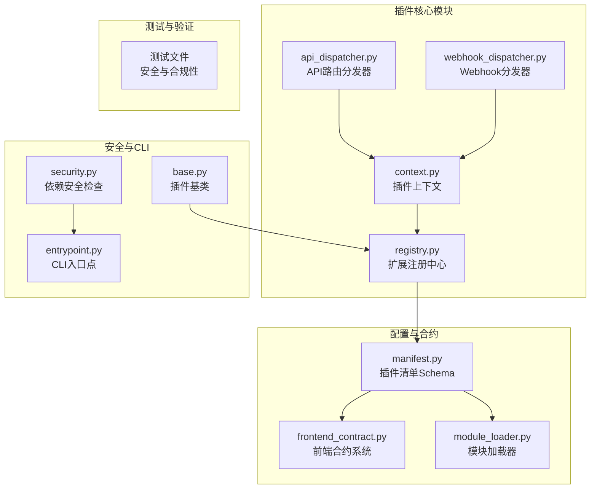
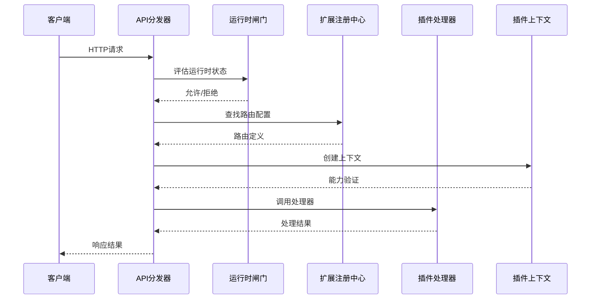
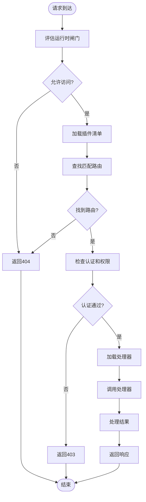
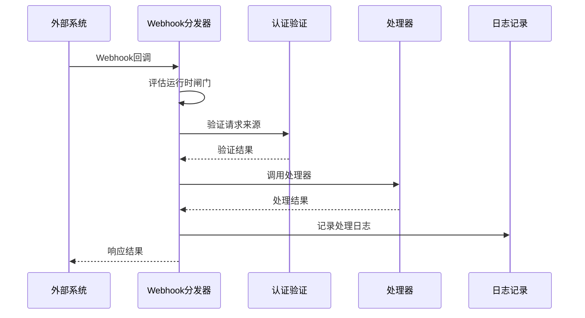
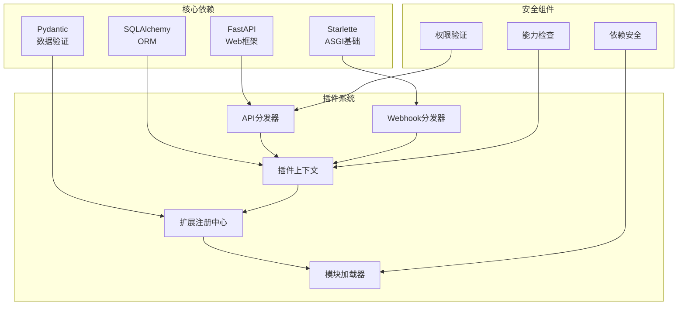

# 插件API扩展机制

<cite>
**本文档引用的文件**
- [api_dispatcher.py](file://backend/app/plugins/api_dispatcher.py)
- [webhook_dispatcher.py](file://backend/app/plugins/webhook_dispatcher.py)
- [frontend_contract.py](file://backend/app/plugins/frontend_contract.py)
- [base.py](file://backend/app/plugins/base.py)
- [registry.py](file://backend/app/plugins/registry.py)
- [context.py](file://backend/app/plugins/context.py)
- [module_loader.py](file://backend/app/plugins/module_loader.py)
- [manifest.py](file://backend/app/plugins/manifest.py)
- [entrypoint.py](file://backend/app/cli_commands/entrypoint.py)
- [security.py](file://backend/app/plugins/security.py)
- [test_plugin_api_dispatcher_context_safety.py](file://backend/tests/test_plugin_api_dispatcher_context_safety.py)
- [test_plugin_api_dispatcher_security.py](file://backend/tests/test_plugin_api_dispatcher_security.py)
- [test_plugin_webhook_dispatcher_security.py](file://backend/tests/test_plugin_webhook_dispatcher_security.py)
</cite>

## 目录
1. [引言](#引言)
2. [项目结构](#项目结构)
3. [核心组件](#核心组件)
4. [架构概览](#架构概览)
5. [详细组件分析](#详细组件分析)
6. [依赖分析](#依赖分析)
7. [性能考虑](#性能考虑)
8. [故障排除指南](#故障排除指南)
9. [结论](#结论)
10. [附录](#附录)

## 引言

本文档深入解析NovusAI平台的插件API扩展机制，这是一个高度模块化和安全的插件生态系统。该系统提供了统一的插件API路由分发器、事件驱动的Webhook架构、完整的前端合约系统、以及强大的CLI命令扩展功能。

该插件机制的核心设计理念是通过"沙箱上下文"提供受控的系统访问权限，确保插件只能访问其被明确授权的能力。系统支持多种扩展点类型，包括API路由、Webhook回调、前端界面、Socket.IO命名空间、定时任务等。

## 项目结构

插件系统主要分布在以下核心模块中：

**图表来源**
- [api_dispatcher.py:1-707](file://backend/app/plugins/api_dispatcher.py#L1-L707)
- [webhook_dispatcher.py:1-296](file://backend/app/plugins/webhook_dispatcher.py#L1-L296)
- [context.py:1-956](file://backend/app/plugins/context.py#L1-L956)

**章节来源**
- [api_dispatcher.py:1-707](file://backend/app/plugins/api_dispatcher.py#L1-L707)
- [webhook_dispatcher.py:1-296](file://backend/app/plugins/webhook_dispatcher.py#L1-L296)
- [context.py:1-956](file://backend/app/plugins/context.py#L1-L956)

## 核心组件

### API路由分发器

API路由分发器是插件系统的核心枢纽，负责将HTTP请求路由到相应的插件处理器。它支持管理员端、企业端和公开端三种不同的访问级别。

**关键特性：**
- 统一的插件API入口点：`/admin/plugins/{plugin_name}/api/{path}` 和 `/tenant/plugins/{plugin_name}/api/{path}`
- 动态路由匹配：支持路径参数提取和正则表达式匹配
- 权限验证：基于RBAC的细粒度权限控制
- 错误处理：标准化的错误响应格式

### Webhook分发器

Webhook分发器实现了事件驱动的异步处理架构，专门处理来自外部系统的回调请求。

**核心功能：**
- 无认证中间件：外部系统无法使用Token进行认证
- 源验证：支持HMAC、Token和签名等多种认证方式
- 异步处理：支持协程函数和同步函数
- 安全防护：防止SSRF攻击和路径遍历

### 插件上下文系统

插件上下文是插件与核心系统交互的唯一入口，提供受控的系统访问API。

**能力授权：**
- 数据库访问：仅限插件自有表
- HTTP请求：带SSRF防护的出站请求
- 存储访问：命名空间隔离的存储驱动
- AI功能：通过Agent分配机制调用

**章节来源**
- [api_dispatcher.py:409-482](file://backend/app/plugins/api_dispatcher.py#L409-L482)
- [webhook_dispatcher.py:32-206](file://backend/app/plugins/webhook_dispatcher.py#L32-L206)
- [context.py:43-83](file://backend/app/plugins/context.py#L43-L83)

## 架构概览

插件API扩展机制采用分层架构设计，确保了系统的可扩展性和安全性：

**图表来源**
- [api_dispatcher.py:158-407](file://backend/app/plugins/api_dispatcher.py#L158-L407)
- [context.py:69-83](file://backend/app/plugins/context.py#L69-L83)

## 详细组件分析

### API分发器设计原理

API分发器实现了统一的插件API入口点，通过以下机制确保安全和灵活性：

**路由机制：**
- 路径约定：`/admin/plugins/{plugin_name}/api/{path}` 和 `/tenant/plugins/{plugin_name}/api/{path}`
- 动态匹配：支持RESTful风格的路径参数
- 方法验证：严格的HTTP方法匹配

**安全控制：**
- 运行时闸门：检查插件启用状态和作用域
- 权限验证：基于RBAC的动作权限检查
- 能力授权：插件上下文的细粒度权限控制

**图表来源**
- [api_dispatcher.py:158-407](file://backend/app/plugins/api_dispatcher.py#L158-L407)

**章节来源**
- [api_dispatcher.py:158-407](file://backend/app/plugins/api_dispatcher.py#L158-L407)

### Webhook分发器事件驱动架构

Webhook分发器采用事件驱动架构，专门处理外部系统的回调请求：

**认证机制：**
- HMAC认证：基于共享密钥的消息认证
- Token认证：基于Bearer Token的身份验证
- 签名验证：支持多种签名算法

**异步处理：**
- 协程支持：自动检测和处理异步处理器
- 错误恢复：标准化的错误处理和日志记录
- 性能监控：请求处理时间统计

**图表来源**
- [webhook_dispatcher.py:32-206](file://backend/app/plugins/webhook_dispatcher.py#L32-L206)

**章节来源**
- [webhook_dispatcher.py:32-206](file://backend/app/plugins/webhook_dispatcher.py#L32-L206)

### 前端合约系统

前端合约系统确保插件前端资源的安全部署和正确加载：

**发布模式：**
- 开发模式：实时加载源码文件
- 生产模式：加载编译后的发布清单

**文件验证：**
- 路径安全：防止路径遍历攻击
- 文件完整性：验证必需的前端文件
- 资源优化：CSS和静态资源的正确引用

**国际化支持：**
- 多语言菜单：支持多语言界面
- 本地化验证：确保翻译文件的完整性

**章节来源**
- [frontend_contract.py:112-186](file://backend/app/plugins/frontend_contract.py#L112-L186)

### 插件生命周期管理

插件基类定义了标准的生命周期钩子，支持插件的完整生命周期管理：

**生命周期钩子：**
- `on_install`: 安装后调用（首次安装）
- `on_enable`: 启用时调用
- `on_disable`: 禁用时调用
- `on_uninstall`: 卸载前调用
- `on_upgrade`: 版本升级后调用

**扩展注册：**
- 适配器注册：AI服务适配器
- 钩子注册：同步事件拦截
- 存储驱动：文件存储扩展
- 技能注册：AI工具技能

**章节来源**
- [base.py:19-45](file://backend/app/plugins/base.py#L19-L45)
- [registry.py:308-523](file://backend/app/plugins/registry.py#L308-L523)

### 模块加载系统

模块加载器提供了统一的插件模块动态导入机制：

**命名约定：**
- 模块名：`plugins.{plugin_name}.backend.{dotted_path}`
- 物理路径：`backend/plugins/{plugin_name}/backend/{path_parts...}.py`

**安全机制：**
- 精确匹配：仅解析精确的模块文件
- 缓存管理：sys.modules缓存共享
- 错误处理：清理失败的模块条目

**卸载支持：**
- 模块清理：移除插件相关模块
- 内存管理：防止内存泄漏

**章节来源**
- [module_loader.py:35-169](file://backend/app/plugins/module_loader.py#L35-L169)

## 依赖分析

插件系统的核心依赖关系体现了清晰的关注点分离：

**图表来源**
- [api_dispatcher.py:26-49](file://backend/app/plugins/api_dispatcher.py#L26-L49)
- [context.py:19-38](file://backend/app/plugins/context.py#L19-L38)

**章节来源**
- [api_dispatcher.py:26-49](file://backend/app/plugins/api_dispatcher.py#L26-L49)
- [context.py:19-38](file://backend/app/plugins/context.py#L19-L38)

## 性能考虑

插件系统在设计时充分考虑了性能优化：

**缓存策略：**
- 路由正则表达式缓存：LRU缓存减少重复编译
- 模块加载缓存：sys.modules共享避免重复导入
- 运行时闸门缓存：插件状态快速评估

**异步处理：**
- 协程支持：充分利用异步I/O性能
- 并发控制：合理的并发处理机制
- 超时管理：30秒默认超时保护

**内存管理：**
- 模块卸载：插件卸载时清理内存
- 连接池：数据库连接复用
- 对象复用：插件上下文对象池

## 故障排除指南

### 常见问题诊断

**API路由问题：**
- 路由未找到：检查插件清单中的路由配置
- 权限不足：验证用户权限和插件权限声明
- 处理器加载失败：确认模块路径和函数名

**Webhook问题：**
- 认证失败：检查密钥配置和头部设置
- 处理器不可用：验证Webhook处理器注册
- 超时错误：检查外部服务可用性和网络连接

**安全相关问题：**
- 能力检查失败：确认插件配置的能力声明
- 路径遍历：验证文件路径的安全性
- SSRF防护：检查URL格式和目标地址

**章节来源**
- [test_plugin_api_dispatcher_context_safety.py](file://backend/tests/test_plugin_api_dispatcher_context_safety.py)
- [test_plugin_api_dispatcher_security.py](file://backend/tests/test_plugin_api_dispatcher_security.py)
- [test_plugin_webhook_dispatcher_security.py](file://backend/tests/test_plugin_webhook_dispatcher_security.py)

## 结论

NovusAI的插件API扩展机制提供了一个强大、安全、灵活的插件生态系统。通过沙箱上下文、严格的权限控制、事件驱动的Webhook架构，以及完善的前端合约系统，该系统能够支持复杂的插件功能需求。

系统的关键优势包括：
- **安全性**：基于能力的细粒度权限控制
- **可扩展性**：支持多种扩展点类型
- **可靠性**：完善的错误处理和监控机制
- **易用性**：标准化的开发和部署流程

该架构为未来的功能扩展和技术演进奠定了坚实的基础。

## 附录

### API版本管理策略

插件系统采用以下版本管理原则：
- 向后兼容性：新版本保持旧API的兼容性
- 废弃策略：提供明确的废弃时间表和迁移指南
- 兼容性检查：自动检测和报告潜在的兼容性问题

### CLI命令扩展

CLI系统支持插件相关的命令扩展：
- 插件管理命令：安装、卸载、启用、禁用
- 配置管理：插件配置的查看和修改
- 调试工具：插件状态检查和问题诊断

### 测试与验证

系统包含全面的测试套件：
- 安全性测试：权限验证和沙箱安全
- 功能测试：API路由和Webhook处理
- 性能测试：并发处理和资源使用
- 兼容性测试：版本升级和向后兼容