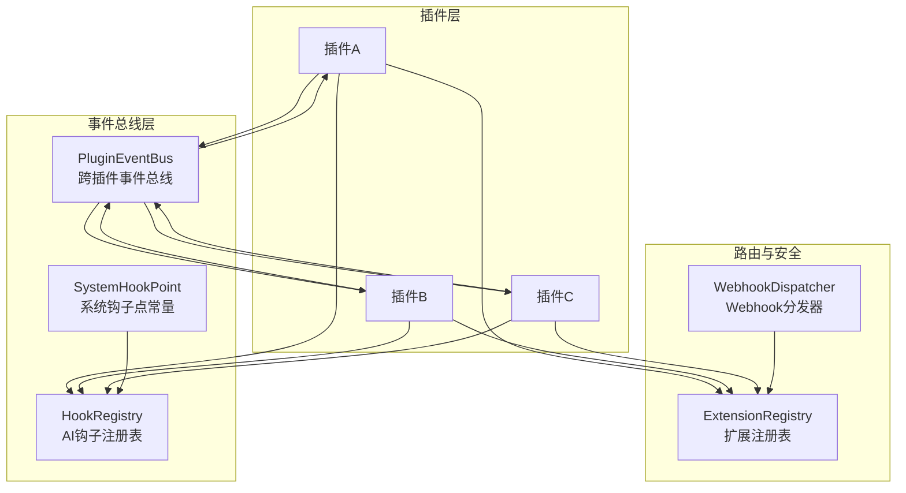
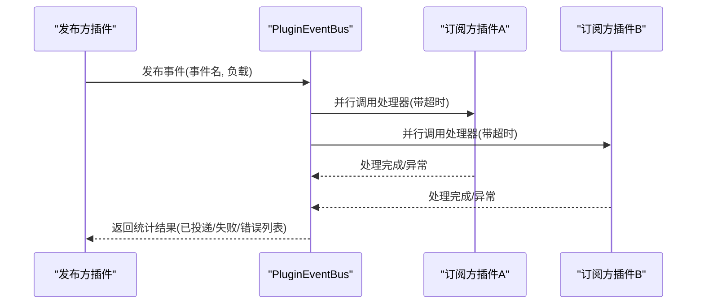
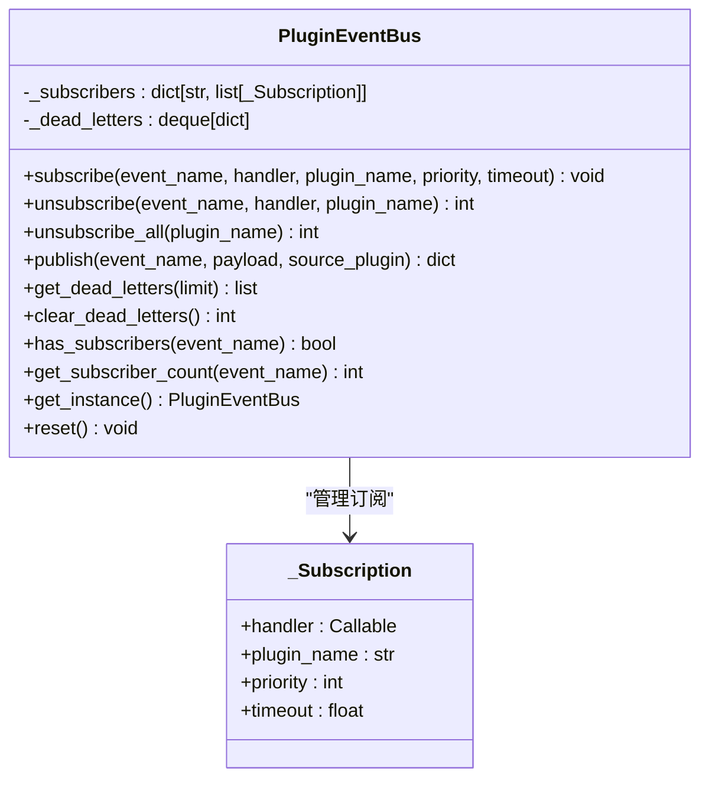
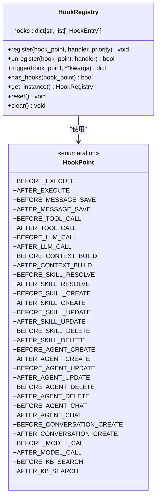
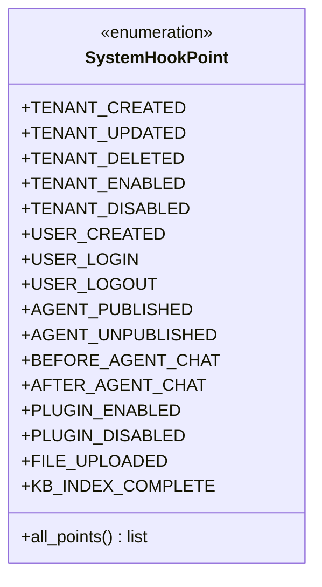
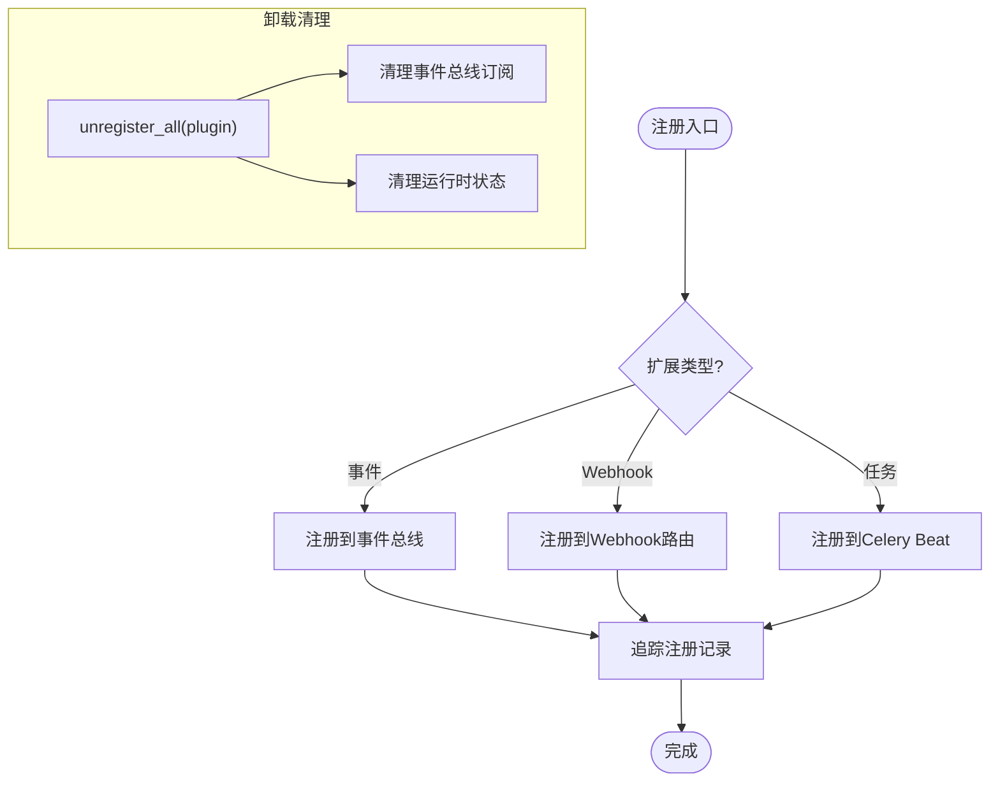
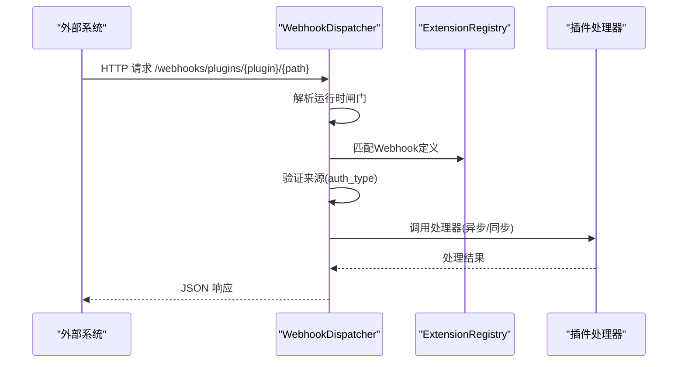
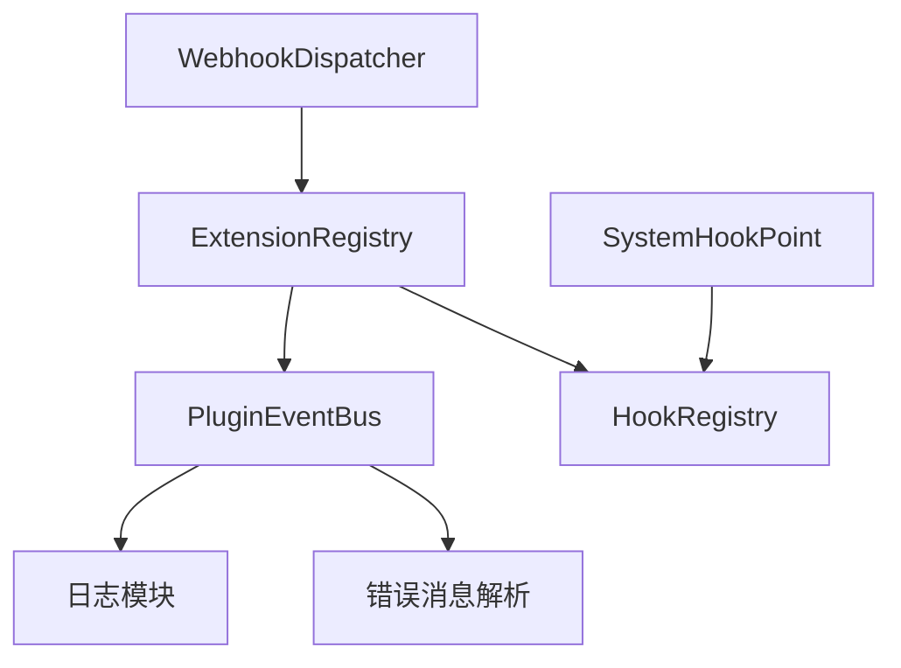

# 插件事件总线系统

<cite>
**本文档引用的文件**
- [event_bus.py](file://backend/app/plugins/event_bus.py)
- [system_hooks.py](file://backend/app/plugins/system_hooks.py)
- [webhook_dispatcher.py](file://backend/app/plugins/webhook_dispatcher.py)
- [registry.py](file://backend/app/plugins/registry.py)
- [hooks.py](file://backend/app/ai/events/hooks.py)
- [test_plugin_event_hook_runtime.py](file://backend/tests/test_plugin_event_hook_runtime.py)
</cite>

## 目录
1. [简介](#简介)
2. [项目结构](#项目结构)
3. [核心组件](#核心组件)
4. [架构概览](#架构概览)
5. [详细组件分析](#详细组件分析)
6. [依赖关系分析](#依赖关系分析)
7. [性能考虑](#性能考虑)
8. [故障排除指南](#故障排除指南)
9. [结论](#结论)
10. [附录](#附录)

## 简介
本文件为插件事件总线系统的技术架构文档，深入解释跨插件事件总线的设计模式、发布订阅机制与消息传递协议；系统钩子的注册、触发与回调机制；事件分类、优先级与路由策略；事件处理器生命周期、错误处理与重试机制；事件过滤、条件订阅与动态路由功能；以及事件监控、性能分析与调试工具。同时涵盖事件持久化、顺序保证与幂等性设计，以及事件与插件生命周期的集成与事件驱动架构的应用模式。

## 项目结构
插件事件总线系统由以下关键模块组成：
- 事件总线核心：负责跨插件异步事件的发布与订阅，支持并发执行与错误隔离
- 系统钩子：提供同步拦截机制，允许修改执行上下文，支持 BEFORE_/AFTER_ 模式
- Webhook 分发器：接收外部系统回调，进行认证校验与路由分发
- 扩展注册表：统一管理插件扩展点的注册与注销，桥接事件总线与系统钩子
- AI 钩子系统：面向 AI 执行流水线的同步钩子机制

**图表来源**
- [event_bus.py:44-342](file://backend/app/plugins/event_bus.py#L44-L342)
- [hooks.py:137-280](file://backend/app/ai/events/hooks.py#L137-L280)
- [system_hooks.py:29-127](file://backend/app/plugins/system_hooks.py#L29-L127)
- [webhook_dispatcher.py:32-296](file://backend/app/plugins/webhook_dispatcher.py#L32-L296)
- [registry.py:172-746](file://backend/app/plugins/registry.py#L172-L746)

**章节来源**
- [event_bus.py:1-342](file://backend/app/plugins/event_bus.py#L1-L342)
- [hooks.py:1-280](file://backend/app/ai/events/hooks.py#L1-L280)
- [system_hooks.py:1-127](file://backend/app/plugins/system_hooks.py#L1-L127)
- [webhook_dispatcher.py:1-296](file://backend/app/plugins/webhook_dispatcher.py#L1-L296)
- [registry.py:1-746](file://backend/app/plugins/registry.py#L1-L746)

## 核心组件
- PluginEventBus：跨插件事件总线，采用单例模式，支持订阅、取消订阅与异步发布
- HookRegistry：AI 执行流水线的同步钩子注册表，支持 BEFORE_/AFTER_ 模式与上下文修改
- SystemHookPoint：系统钩子点常量集合，定义标准系统事件触发点
- ExtensionRegistry：扩展注册表，统一管理插件扩展点的注册与注销，桥接事件总线与系统钩子
- WebhookDispatcher：Webhook 统一分发器，处理外部系统回调，支持多种认证方式

**章节来源**
- [event_bus.py:44-342](file://backend/app/plugins/event_bus.py#L44-L342)
- [hooks.py:137-280](file://backend/app/ai/events/hooks.py#L137-L280)
- [system_hooks.py:29-127](file://backend/app/plugins/system_hooks.py#L29-L127)
- [registry.py:172-746](file://backend/app/plugins/registry.py#L172-L746)
- [webhook_dispatcher.py:32-296](file://backend/app/plugins/webhook_dispatcher.py#L32-L296)

## 架构概览
事件总线系统采用“发布-订阅”模式，结合“钩子”与“Webhook”的多通道事件驱动架构：
- 跨插件事件：通过 PluginEventBus 异步通知，处理器只读，错误隔离，支持超时保护
- 系统钩子：通过 HookRegistry 同步拦截，处理器可修改上下文，按优先级串行执行
- Webhook：外部系统回调经认证后分发至插件处理器
- 扩展注册：ExtensionRegistry 统一注册与注销，维护插件扩展生命周期

**图表来源**
- [event_bus.py:170-264](file://backend/app/plugins/event_bus.py#L170-L264)

**章节来源**
- [event_bus.py:170-264](file://backend/app/plugins/event_bus.py#L170-L264)

## 详细组件分析

### PluginEventBus 组件分析
PluginEventBus 是跨插件事件总线的核心，提供以下能力：
- 订阅管理：支持按事件名订阅，去重与优先级排序，记录订阅者插件名
- 发布机制：异步并行调用所有订阅处理器，单处理器超时保护，默认 30 秒
- 错误处理：单处理器异常不中断整体流程，记录公共错误消息与死信队列
- 性能监控：记录事件统计与延迟，支持获取死信记录与清理
- 生命周期：单例模式，支持重置；扩展注册表在插件卸载时清理订阅

**图表来源**
- [event_bus.py:44-342](file://backend/app/plugins/event_bus.py#L44-L342)

**章节来源**
- [event_bus.py:44-342](file://backend/app/plugins/event_bus.py#L44-L342)

### HookRegistry 组件分析
HookRegistry 提供 AI 执行流水线的同步钩子机制：
- 钩子点定义：涵盖执行前后、消息处理、工具调用、LLM 调用、上下文构建、技能解析与 CRUD、Agent CRUD、对话、模型调用、知识库搜索等
- 注册与注销：支持按优先级注册，串行执行，处理器可修改上下文或阻止操作
- 触发机制：按优先级顺序执行，异常记录但不影响整体流程
- 全局便捷函数：提供获取实例的便捷方法

**图表来源**
- [hooks.py:137-280](file://backend/app/ai/events/hooks.py#L137-L280)

**章节来源**
- [hooks.py:137-280](file://backend/app/ai/events/hooks.py#L137-L280)

### SystemHookPoint 组件分析
SystemHookPoint 定义标准系统钩子点常量，供插件在清单中引用：
- 企业生命周期：创建、更新、删除、启用、禁用
- 用户生命周期：创建、登录、登出
- Agent 生命周期：发布、取消发布
- AI 调用：对话前/后
- 插件生命周期：启用、禁用
- 文件/存储：上传完成
- 知识库：索引完成

**图表来源**
- [system_hooks.py:29-127](file://backend/app/plugins/system_hooks.py#L29-L127)

**章节来源**
- [system_hooks.py:29-127](file://backend/app/plugins/system_hooks.py#L29-L127)

### ExtensionRegistry 组件分析
ExtensionRegistry 统一管理插件扩展点的注册与注销：
- 事件注册：支持字符串事件与 AI 事件类型，桥接到 PluginEventBus 或 AI 事件总线
- Webhook 注册：规范化路径，支持认证配置
- 任务注册：桥接到 Celery Beat，支持 cron 与间隔调度
- 生命周期管理：在插件卸载时清理事件总线订阅与运行时状态

**图表来源**
- [registry.py:172-746](file://backend/app/plugins/registry.py#L172-L746)

**章节来源**
- [registry.py:172-746](file://backend/app/plugins/registry.py#L172-L746)

### WebhookDispatcher 组件分析
WebhookDispatcher 接收外部系统回调并分发到插件处理器：
- 路由匹配：根据插件清单中的 webhooks 定义匹配路径与方法
- 认证校验：支持 HMAC、Token、Signature 等认证方式
- 处理器调用：异步或同步处理器均可，返回 JSON 响应
- 错误处理：捕获异常并记录调试信息

**图表来源**
- [webhook_dispatcher.py:32-296](file://backend/app/plugins/webhook_dispatcher.py#L32-L296)

**章节来源**
- [webhook_dispatcher.py:32-296](file://backend/app/plugins/webhook_dispatcher.py#L32-L296)

## 依赖关系分析
事件总线系统的关键依赖关系如下：
- PluginEventBus 依赖日志与错误消息解析
- ExtensionRegistry 桥接 HookRegistry 与 PluginEventBus
- SystemHookPoint 依赖 HookRegistry 触发系统钩子
- WebhookDispatcher 依赖扩展注册表与运行时闸门评估

**图表来源**
- [event_bus.py:32-35](file://backend/app/plugins/event_bus.py#L32-L35)
- [registry.py:334-348](file://backend/app/plugins/registry.py#L334-L348)
- [system_hooks.py:115-126](file://backend/app/plugins/system_hooks.py#L115-L126)
- [webhook_dispatcher.py:24-27](file://backend/app/plugins/webhook_dispatcher.py#L24-L27)

**章节来源**
- [event_bus.py:32-35](file://backend/app/plugins/event_bus.py#L32-L35)
- [registry.py:334-348](file://backend/app/plugins/registry.py#L334-L348)
- [system_hooks.py:115-126](file://backend/app/plugins/system_hooks.py#L115-L126)
- [webhook_dispatcher.py:24-27](file://backend/app/plugins/webhook_dispatcher.py#L24-L27)

## 性能考虑
- 并行执行：事件总线对订阅处理器采用并行执行，提升吞吐量
- 超时保护：单处理器默认超时 30 秒，防止慢处理器拖累整体性能
- 负载限制：事件负载大小上限约 1MB，避免过大负载影响性能
- 死信队列：记录失败事件，便于后续重放与诊断
- 日志与监控：结构化日志记录事件统计与延迟，便于性能分析

**章节来源**
- [event_bus.py:37-41](file://backend/app/plugins/event_bus.py#L37-L41)
- [event_bus.py:224-264](file://backend/app/plugins/event_bus.py#L224-L264)

## 故障排除指南
- 事件未被订阅：检查事件名是否正确，确认订阅是否成功
- 处理器超时：调整处理器逻辑或提高超时时间
- 负载过大：检查事件负载大小，必要时拆分事件
- 死信记录：通过死信队列接口查看最近失败事件，定位问题
- Webhook 认证失败：检查认证配置与签名算法

**章节来源**
- [event_bus.py:284-315](file://backend/app/plugins/event_bus.py#L284-L315)
- [webhook_dispatcher.py:208-287](file://backend/app/plugins/webhook_dispatcher.py#L208-L287)

## 结论
插件事件总线系统通过“发布-订阅”与“钩子”相结合的方式，实现了跨插件异步通知与同步拦截的双重能力。系统具备良好的错误隔离、超时保护与性能监控机制，能够满足复杂业务场景下的事件驱动需求。通过扩展注册表统一管理生命周期，配合 Webhook 分发器与系统钩子，形成完整的事件驱动架构。

## 附录
- 事件命名规范：plugin.{source_plugin}.{event_name}
- 负载字段：source_plugin、event_name、tenant_id、timestamp 与自定义数据
- 设计原则：单处理器异常隔离、单处理器超时保护、最大负载大小限制、结构化日志记录

**章节来源**
- [event_bus.py:12-20](file://backend/app/plugins/event_bus.py#L12-L20)