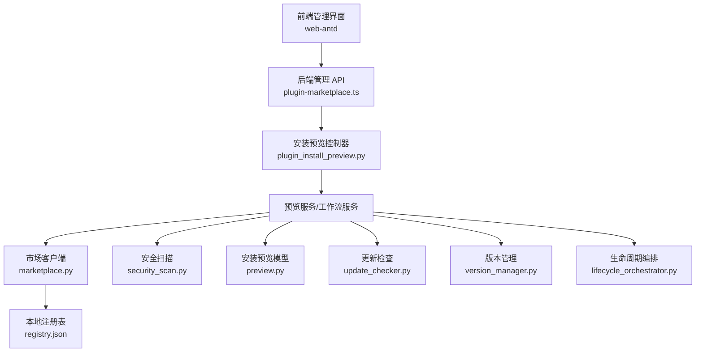
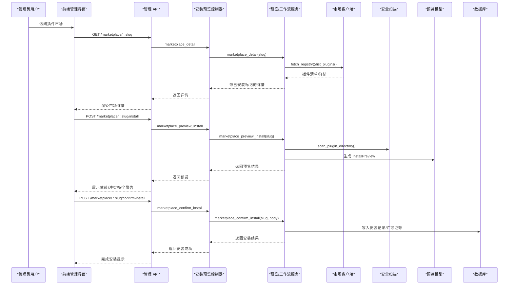
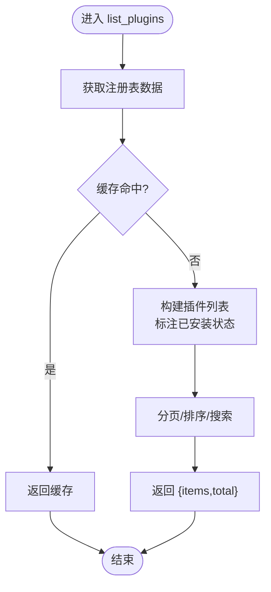
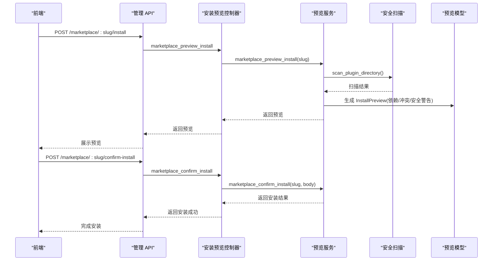
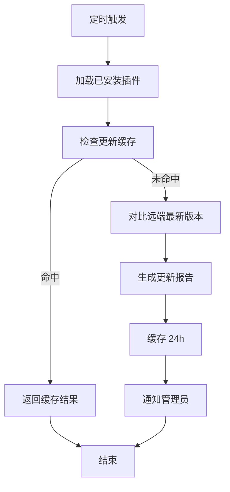
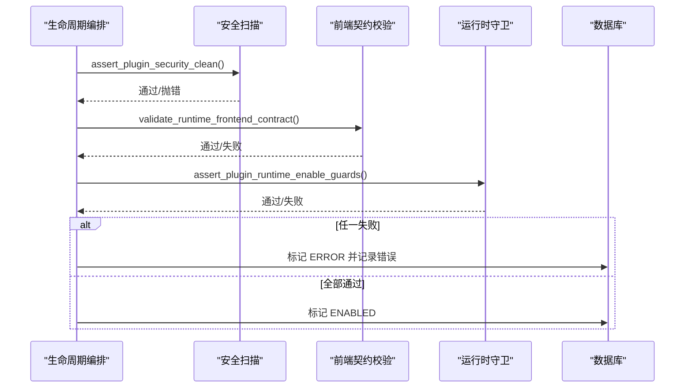
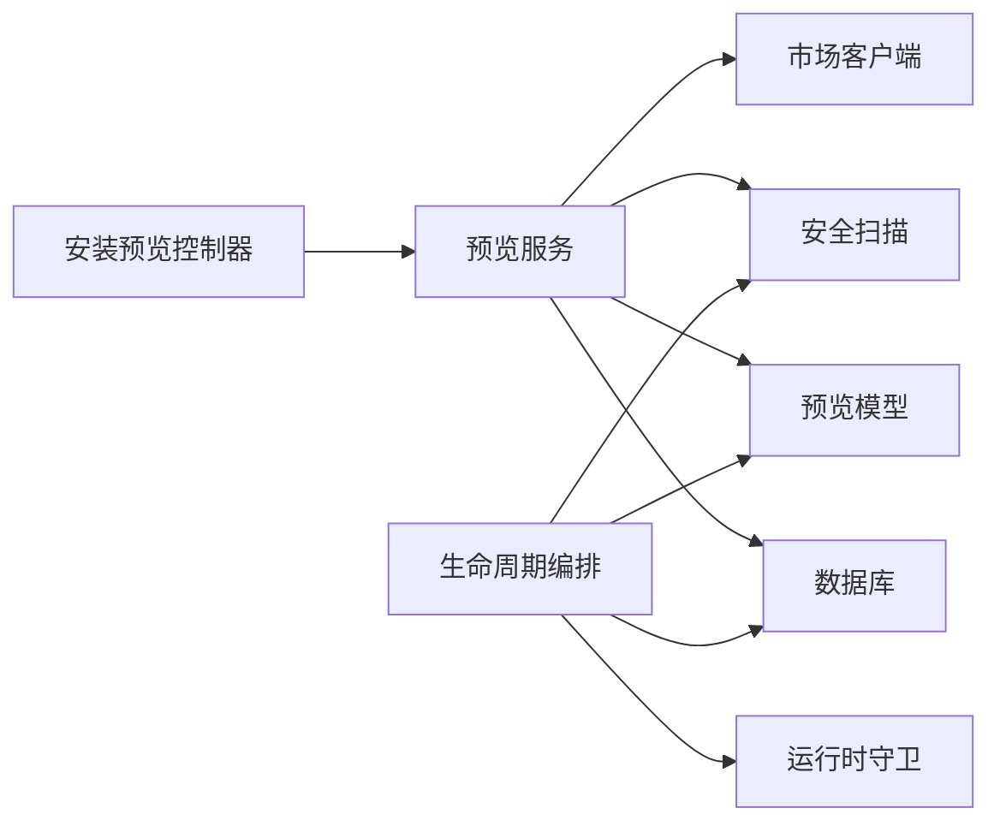

# 插件市场与分发

<cite>
**本文引用的文件**
- [backend/app/plugins/marketplace.py](file://backend/app/plugins/marketplace.py)
- [backend/app/api/admin/plugin_install_preview.py](file://backend/app/api/admin/plugin_install_preview.py)
- [frontend/apps/web-antd/src/api/admin/plugin-marketplace.ts](file://frontend/apps/web-antd/src/api/admin/plugin-marketplace.ts)
- [backend/app/plugins/update_checker.py](file://backend/app/plugins/update_checker.py)
- [backend/app/plugins/version_manager.py](file://backend/app/plugins/version_manager.py)
- [backend/app/plugins/lifecycle_orchestrator.py](file://backend/app/plugins/lifecycle_orchestrator.py)
- [backend/app/plugins/security_scan.py](file://backend/app/plugins/security_scan.py)
- [backend/app/plugins/preview.py](file://backend/app/plugins/preview.py)
- [backend/app/plugins/marketplace_registry/registry.json](file://backend/app/plugins/marketplace_registry/registry.json)
- [backend/app/api/admin/plugins.py](file://backend/app/api/admin/plugins.py)
- [backend/app/plugins/startup.py](file://backend/app/plugins/startup.py)
- [backend/tests/test_plugin_api_dispatcher_security.py](file://backend/tests/test_plugin_api_dispatcher_security.py)
- [backend/tests/test_plugin_version_manager_locking.py](file://backend/tests/test_plugin_version_manager_locking.py)
- [backend/tests/test_plugin_cli_pack_hardening.py](file://backend/tests/test_plugin_cli_pack_hardening.py)
- [backend/tests/test_plugin_cli_release_workflow.py](file://backend/tests/test_plugin_cli_release_workflow.py)
</cite>

## 目录
1. [简介](#简介)
2. [项目结构](#项目结构)
3. [核心组件](#核心组件)
4. [架构总览](#架构总览)
5. [组件详解](#组件详解)
6. [依赖关系分析](#依赖关系分析)
7. [性能考量](#性能考量)
8. [故障排查指南](#故障排查指南)
9. [结论](#结论)
10. [附录](#附录)

## 简介
本文件面向插件市场与分发系统的运营与技术团队，系统化阐述插件市场的架构设计、插件注册与审核机制、注册表维护与搜索索引、更新检查与版本管理、预览与演示环境、安全扫描与合规、以及下载统计与使用分析等运营能力。文档同时覆盖前端调用链路、后端控制流与安全断言，并提供可操作的排障建议与最佳实践。

## 项目结构
围绕插件市场与分发的关键代码分布在后端插件子系统与前端管理界面中：
- 后端插件子系统包含市场客户端、安装预览、更新检查、版本管理、生命周期编排、安全扫描与预览校验等模块。
- 前端通过管理 API 调用后端接口，实现市场浏览、安装预览、确认安装与更新检查等功能。

图表来源
- [frontend/apps/web-antd/src/api/admin/plugin-marketplace.ts:53-86](file://frontend/apps/web-antd/src/api/admin/plugin-marketplace.ts#L53-L86)
- [backend/app/api/admin/plugin_install_preview.py:67-136](file://backend/app/api/admin/plugin_install_preview.py#L67-L136)
- [backend/app/plugins/marketplace.py:140-174](file://backend/app/plugins/marketplace.py#L140-L174)
- [backend/app/plugins/security_scan.py:106-196](file://backend/app/plugins/security_scan.py#L106-L196)
- [backend/app/plugins/preview.py:469-515](file://backend/app/plugins/preview.py#L469-L515)
- [backend/app/plugins/update_checker.py:27-47](file://backend/app/plugins/update_checker.py#L27-L47)
- [backend/app/plugins/version_manager.py](file://backend/app/plugins/version_manager.py)
- [backend/app/plugins/lifecycle_orchestrator.py:315-385](file://backend/app/plugins/lifecycle_orchestrator.py#L315-L385)
- [backend/app/plugins/marketplace_registry/registry.json](file://backend/app/plugins/marketplace_registry/registry.json)

章节来源
- [frontend/apps/web-antd/src/api/admin/plugin-marketplace.ts:53-86](file://frontend/apps/web-antd/src/api/admin/plugin-marketplace.ts#L53-L86)
- [backend/app/api/admin/plugin_install_preview.py:67-136](file://backend/app/api/admin/plugin_install_preview.py#L67-L136)
- [backend/app/plugins/marketplace.py:140-174](file://backend/app/plugins/marketplace.py#L140-L174)

## 核心组件
- 市场客户端：负责从远端或本地注册表拉取插件清单，支持搜索、分类、排序与分页，并标注已安装状态。
- 安装预览控制器：提供市场详情、安装预览、确认安装等接口；并支持测试连接到市场与技能注册表。
- 更新检查器：每日检查已安装插件的新版本，缓存结果，仅做通知不自动更新。
- 版本管理器：负责升级/降级流程的锁与回滚一致性保障。
- 生命周期编排：在启用前执行安全扫描、前端契约校验与运行时守卫检查。
- 安全扫描：对插件后端源码进行静态扫描，识别高危调用与语法错误，失败即阻断。
- 预览模型：汇总依赖冲突、兼容性、能力声明与安全扫描警告，形成安装预览报告。
- 注册表：内置本地注册表作为回退与离线场景的数据源。

章节来源
- [backend/app/plugins/marketplace.py:140-174](file://backend/app/plugins/marketplace.py#L140-L174)
- [backend/app/api/admin/plugin_install_preview.py:67-136](file://backend/app/api/admin/plugin_install_preview.py#L67-L136)
- [backend/app/plugins/update_checker.py:27-47](file://backend/app/plugins/update_checker.py#L27-L47)
- [backend/app/plugins/version_manager.py](file://backend/app/plugins/version_manager.py)
- [backend/app/plugins/lifecycle_orchestrator.py:315-385](file://backend/app/plugins/lifecycle_orchestrator.py#L315-L385)
- [backend/app/plugins/security_scan.py:106-196](file://backend/app/plugins/security_scan.py#L106-L196)
- [backend/app/plugins/preview.py:469-515](file://backend/app/plugins/preview.py#L469-L515)
- [backend/app/plugins/marketplace_registry/registry.json](file://backend/app/plugins/marketplace_registry/registry.json)

## 架构总览
下图展示从前端到后端、再到市场与安全扫描的整体调用链与数据流。

图表来源
- [frontend/apps/web-antd/src/api/admin/plugin-marketplace.ts:53-86](file://frontend/apps/web-antd/src/api/admin/plugin-marketplace.ts#L53-L86)
- [backend/app/api/admin/plugin_install_preview.py:67-136](file://backend/app/api/admin/plugin_install_preview.py#L67-L136)
- [backend/app/plugins/marketplace.py:140-174](file://backend/app/plugins/marketplace.py#L140-L174)
- [backend/app/plugins/security_scan.py:106-196](file://backend/app/plugins/security_scan.py#L106-L196)
- [backend/app/plugins/preview.py:469-515](file://backend/app/plugins/preview.py#L469-L515)

## 组件详解

### 市场客户端与注册表
- 功能要点
  - 支持从远端注册表获取插件清单，失败时回退到本地注册表，并缓存以提升性能。
  - 提供搜索、分类、排序与分页查询，返回带“是否已安装”标记的列表。
- 数据来源
  - 远端注册表：用于线上插件聚合与分发。
  - 本地注册表：内置 JSON，作为离线/回退数据源。
- 复杂度与性能
  - 列表查询为内存过滤与分页，时间复杂度近似 O(n)；缓存命中可显著降低延迟。

图表来源
- [backend/app/plugins/marketplace.py:140-174](file://backend/app/plugins/marketplace.py#L140-L174)
- [backend/app/plugins/marketplace_registry/registry.json](file://backend/app/plugins/marketplace_registry/registry.json)

章节来源
- [backend/app/plugins/marketplace.py:140-174](file://backend/app/plugins/marketplace.py#L140-L174)
- [backend/app/plugins/marketplace_registry/registry.json](file://backend/app/plugins/marketplace_registry/registry.json)

### 安装预览与确认安装
- 前端调用链
  - 获取详情：GET /marketplace/:slug
  - 安装预览：POST /marketplace/:slug/install
  - 确认安装：POST /marketplace/:slug/confirm-install
- 后端处理
  - 控制器路由将请求委派给预览服务，后者执行安全扫描与依赖/兼容性校验，生成安装预览报告。
  - 确认安装阶段写入数据库并触发后续工作流。

图表来源
- [frontend/apps/web-antd/src/api/admin/plugin-marketplace.ts:53-86](file://frontend/apps/web-antd/src/api/admin/plugin-marketplace.ts#L53-L86)
- [backend/app/api/admin/plugin_install_preview.py:67-136](file://backend/app/api/admin/plugin_install_preview.py#L67-L136)
- [backend/app/plugins/security_scan.py:106-196](file://backend/app/plugins/security_scan.py#L106-L196)
- [backend/app/plugins/preview.py:469-515](file://backend/app/plugins/preview.py#L469-L515)

章节来源
- [frontend/apps/web-antd/src/api/admin/plugin-marketplace.ts:53-86](file://frontend/apps/web-antd/src/api/admin/plugin-marketplace.ts#L53-L86)
- [backend/app/api/admin/plugin_install_preview.py:67-136](file://backend/app/api/admin/plugin_install_preview.py#L67-L136)
- [backend/app/plugins/preview.py:469-515](file://backend/app/plugins/preview.py#L469-L515)

### 更新检查与版本管理
- 更新检查
  - 每日定时任务检查已安装插件的新版本，结果缓存 24 小时，仅做通知不自动更新。
- 版本管理
  - 升级过程使用插件级锁，确保并发安全与回滚一致性；失败时记录错误计数与消息。

图表来源
- [backend/app/plugins/update_checker.py:27-47](file://backend/app/plugins/update_checker.py#L27-L47)
- [backend/tests/test_plugin_version_manager_locking.py:17-41](file://backend/tests/test_plugin_version_manager_locking.py#L17-L41)

章节来源
- [backend/app/plugins/update_checker.py:27-47](file://backend/app/plugins/update_checker.py#L27-L47)
- [backend/tests/test_plugin_version_manager_locking.py:17-41](file://backend/tests/test_plugin_version_manager_locking.py#L17-L41)

### 生命周期编排与安全扫描
- 启用前安全扫描
  - 在启用插件前执行安全扫描，若发现警告则阻断并记录错误，防止高危插件上线。
- 前端契约校验
  - 校验插件前端合约，确保运行时前端侧能力与声明一致。
- 运行时守卫
  - 对启用动作进行守卫检查，结合许可证与权限策略决定是否允许启用。

图表来源
- [backend/app/plugins/lifecycle_orchestrator.py:315-385](file://backend/app/plugins/lifecycle_orchestrator.py#L315-L385)
- [backend/app/plugins/security_scan.py:155-187](file://backend/app/plugins/security_scan.py#L155-L187)

章节来源
- [backend/app/plugins/lifecycle_orchestrator.py:315-385](file://backend/app/plugins/lifecycle_orchestrator.py#L315-L385)
- [backend/app/plugins/security_scan.py:155-187](file://backend/app/plugins/security_scan.py#L155-L187)

### 预览功能与演示环境
- 预览内容
  - 依赖与冲突分析、兼容性与能力声明、安全扫描警告汇总，形成 InstallPreview 报告。
- 演示环境
  - 通过安装预览阶段的扫描与校验，提前暴露潜在问题，避免上线后风险。

章节来源
- [backend/app/plugins/preview.py:469-515](file://backend/app/plugins/preview.py#L469-L515)

### 审核与合规
- 审核机制
  - 市场安装采用“预览+确认”的双阶段流程，预览阶段完成安全扫描与依赖冲突检查，确认阶段才真正安装。
- 合规性
  - CLI 打包与发布流程中集成安全扫描，拒绝存在高危调用的插件打包；同时对插件名称与清单字段进行格式校验。

章节来源
- [backend/tests/test_plugin_cli_pack_hardening.py:151-191](file://backend/tests/test_plugin_cli_pack_hardening.py#L151-L191)
- [backend/tests/test_plugin_cli_release_workflow.py:633-666](file://backend/tests/test_plugin_cli_release_workflow.py#L633-L666)

### 下载统计与使用分析
- 当前仓库未提供专门的下载统计与使用分析模块。建议在市场客户端与安装确认流程中增加埋点与指标采集，以便后续扩展统计与分析能力。

章节来源
- [backend/app/plugins/marketplace.py:140-174](file://backend/app/plugins/marketplace.py#L140-L174)

### 评分系统与社区反馈
- 当前仓库未提供插件评分与评价模块。可在市场详情接口中扩展评分与评论相关字段，并在前端展示与提交。

章节来源
- [frontend/apps/web-antd/src/api/admin/plugin-marketplace.ts:53-86](file://frontend/apps/web-antd/src/api/admin/plugin-marketplace.ts#L53-L86)

### 分发策略与收益分配
- 当前仓库未提供插件定价、收益分配与开发者支持服务模块。可在插件清单的定价信息与许可证管理基础上扩展商业化能力。

章节来源
- [backend/app/plugins/startup.py:195-222](file://backend/app/plugins/startup.py#L195-L222)

## 依赖关系分析
- 组件耦合
  - 安装预览控制器依赖预览服务；预览服务依赖市场客户端、安全扫描与预览模型。
  - 生命周期编排依赖安全扫描、前端契约校验与运行时守卫。
- 外部依赖
  - 市场客户端依赖远端注册表与本地注册表；更新检查依赖数据库中已安装插件记录。
- 循环依赖
  - 代码组织上未见明显循环依赖；各模块职责清晰，通过服务层解耦。

图表来源
- [backend/app/api/admin/plugin_install_preview.py:67-136](file://backend/app/api/admin/plugin_install_preview.py#L67-L136)
- [backend/app/plugins/marketplace.py:140-174](file://backend/app/plugins/marketplace.py#L140-L174)
- [backend/app/plugins/security_scan.py:106-196](file://backend/app/plugins/security_scan.py#L106-L196)
- [backend/app/plugins/preview.py:469-515](file://backend/app/plugins/preview.py#L469-L515)
- [backend/app/plugins/lifecycle_orchestrator.py:315-385](file://backend/app/plugins/lifecycle_orchestrator.py#L315-L385)

章节来源
- [backend/app/api/admin/plugin_install_preview.py:67-136](file://backend/app/api/admin/plugin_install_preview.py#L67-L136)
- [backend/app/plugins/marketplace.py:140-174](file://backend/app/plugins/marketplace.py#L140-L174)
- [backend/app/plugins/lifecycle_orchestrator.py:315-385](file://backend/app/plugins/lifecycle_orchestrator.py#L315-L385)

## 性能考量
- 缓存策略
  - 市场客户端与更新检查均采用缓存，减少远端请求与数据库查询压力。
- 分页与过滤
  - 列表查询支持分页与排序，建议前端按需加载与懒加载，避免一次性渲染过多条目。
- 安全扫描成本
  - 扫描范围包括后端源码，建议在 CI/CD 阶段执行，避免在生产路径重复扫描。

章节来源
- [backend/app/plugins/marketplace.py:140-174](file://backend/app/plugins/marketplace.py#L140-L174)
- [backend/app/plugins/update_checker.py:27-47](file://backend/app/plugins/update_checker.py#L27-L47)
- [backend/app/plugins/security_scan.py:106-196](file://backend/app/plugins/security_scan.py#L106-L196)

## 故障排查指南
- 权限与能力门禁
  - 若插件 API 调用被拒绝，检查运行时门禁与能力声明是否匹配。
- 安全扫描失败
  - 若安装被阻断，查看扫描报告中的警告与语法错误，修复后重试。
- 版本升级锁
  - 升级过程中出现并发冲突，确认锁机制是否正确生效与释放。
- CLI 打包拒绝
  - 若打包被拒绝，检查是否存在高危调用或清单字段不符合规范。

章节来源
- [backend/tests/test_plugin_api_dispatcher_security.py:250-276](file://backend/tests/test_plugin_api_dispatcher_security.py#L250-L276)
- [backend/tests/test_plugin_cli_pack_hardening.py:151-191](file://backend/tests/test_plugin_cli_pack_hardening.py#L151-L191)
- [backend/tests/test_plugin_version_manager_locking.py:17-41](file://backend/tests/test_plugin_version_manager_locking.py#L17-L41)

## 结论
本系统通过“预览+确认”的安装流程、严格的安全扫描与生命周期守卫，有效降低了插件上线风险。市场客户端与注册表提供了稳定的分发与检索能力，更新检查与版本管理保障了运维效率。建议后续补充评分与评价、下载统计与商业化能力，以完善插件生态的运营闭环。

## 附录
- 前端 API 路径参考
  - 获取市场详情：GET /marketplace/:slug
  - 安装预览：POST /marketplace/:slug/install
  - 确认安装：POST /marketplace/:slug/confirm-install
  - 检查更新：GET /updates
- 关键后端模块
  - 市场客户端：backend/app/plugins/marketplace.py
  - 安装预览控制器：backend/app/api/admin/plugin_install_preview.py
  - 安全扫描：backend/app/plugins/security_scan.py
  - 生命周期编排：backend/app/plugins/lifecycle_orchestrator.py
  - 版本管理：backend/app/plugins/version_manager.py
  - 更新检查：backend/app/plugins/update_checker.py
  - 预览模型：backend/app/plugins/preview.py
  - 本地注册表：backend/app/plugins/marketplace_registry/registry.json
  - 管理端插件路由：backend/app/api/admin/plugins.py
  - 插件启动入库：backend/app/plugins/startup.py