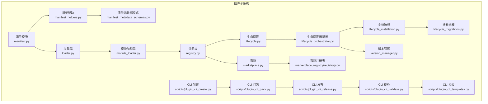
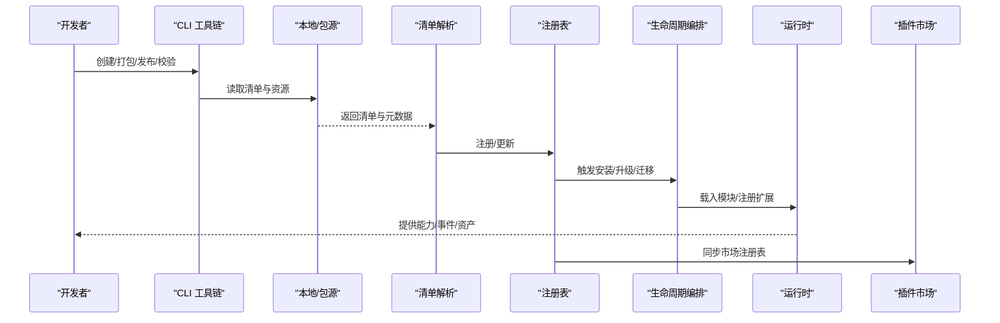
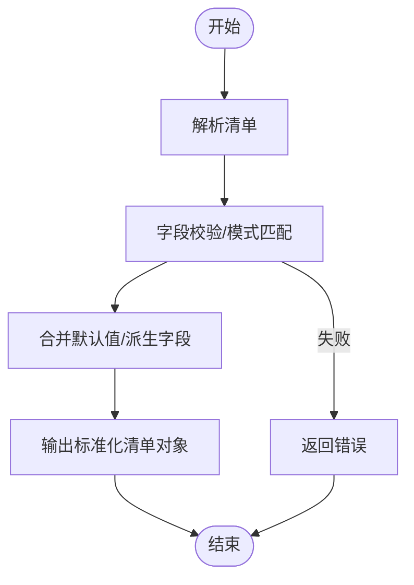
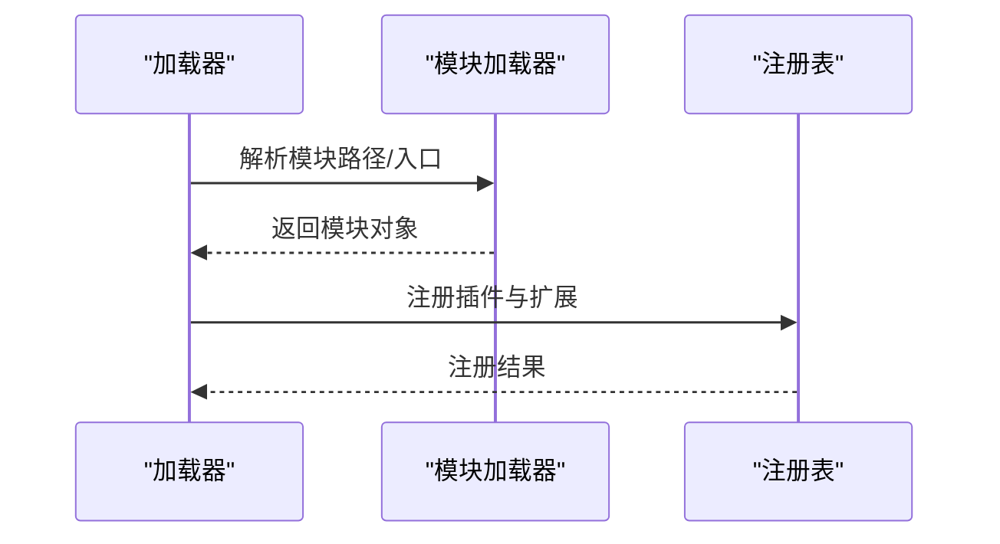
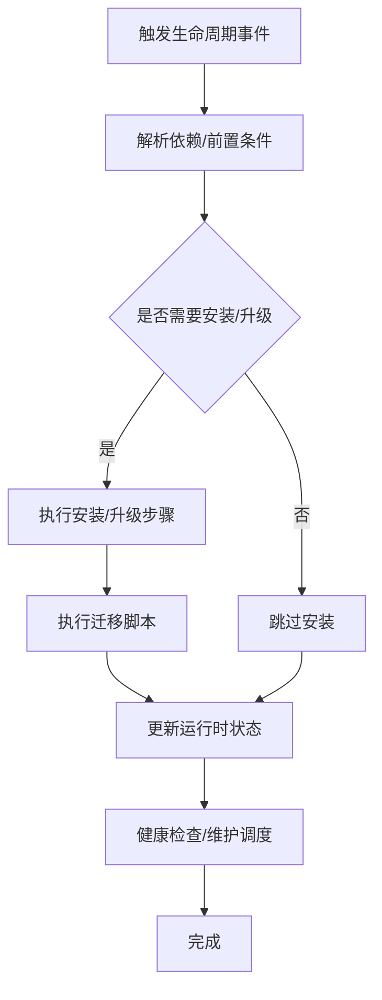
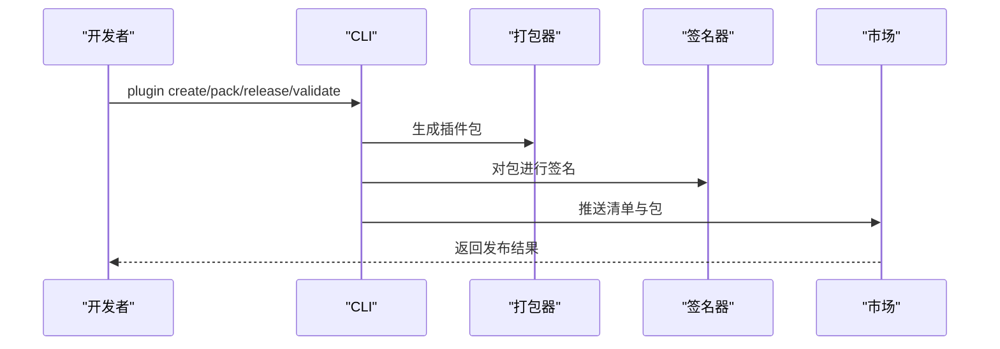
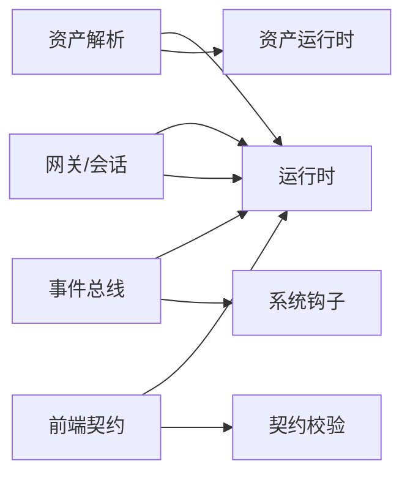
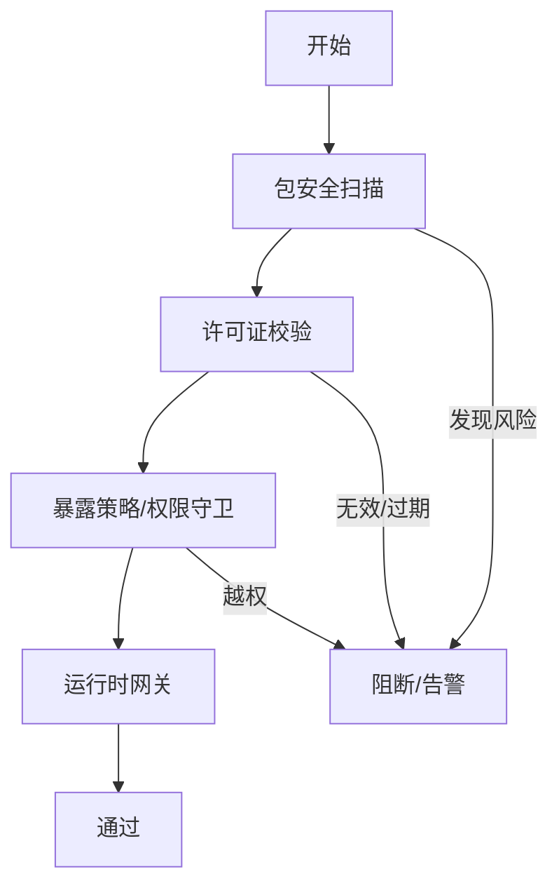
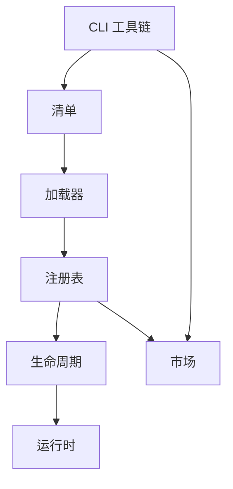

# 插件开发指南

<cite>

**本文引用的文件**
- [backend/app/plugins/manifest.py](file://backend/app/plugins/manifest.py)
- [backend/app/plugins/manifest_helpers.py](file://backend/app/plugins/manifest_helpers.py)
- [backend/app/plugins/manifest_metadata_schemas.py](file://backend/app/plugins/manifest_metadata_schemas.py)
- [backend/app/plugins/loader.py](file://backend/app/plugins/loader.py)
- [backend/app/plugins/module_loader.py](file://backend/app/plugins/module_loader.py)
- [backend/app/plugins/registry.py](file://backend/app/plugins/registry.py)
- [backend/app/plugins/lifecycle.py](file://backend/app/plugins/lifecycle.py)
- [backend/app/plugins/lifecycle_orchestrator.py](file://backend/app/plugins/lifecycle_orchestrator.py)
- [backend/app/plugins/lifecycle_installation.py](file://backend/app/plugins/lifecycle_installation.py)
- [backend/app/plugins/lifecycle_migrations.py](file://backend/app/plugins/lifecycle_migrations.py)
- [backend/app/plugins/version_manager.py](file://backend/app/plugins/version_manager.py)
- [backend/app/plugins/marketplace.py](file://backend/app/plugins/marketplace.py)
- [backend/app/plugins/marketplace_registry/registry.json](file://backend/app/plugins/marketplace_registry/registry.json)
- [backend/scripts/plugin_cli_create.py](file://backend/scripts/plugin_cli_create.py)
- [backend/scripts/plugin_cli_pack.py](file://backend/scripts/plugin_cli_pack.py)
- [backend/scripts/plugin_cli_release.py](file://backend/scripts/plugin_cli_release.py)
- [backend/scripts/plugin_cli_validate.py](file://backend/scripts/plugin_cli_validate.py)
- [backend/scripts/plugin_cli_templates.py](file://backend/scripts/plugin_cli_templates.py)
- [backend/app/plugins/crypto.py](file://backend/app/plugins/crypto.py)
- [backend/app/plugins/package_security.py](file://backend/app/plugins/package_security.py)
- [backend/app/plugins/asset_resolver.py](file://backend/app/plugins/asset_resolver.py)
- [backend/app/plugins/asset_runtime.py](file://backend/app/plugins/asset_runtime.py)
- [backend/app/plugins/frontend_contract.py](file://backend/app/plugins/frontend_contract.py)
- [backend/app/plugins/frontend_contract_checks.py](file://backend/app/plugins/frontend_contract_checks.py)
- [backend/app/plugins/health.py](file://backend/app/plugins/health.py)
- [backend/app/plugins/system_hooks.py](file://backend/app/plugins/system_hooks.py)
- [backend/app/plugins/update_checker.py](file://backend/app/plugins/update_checker.py)
- [backend/app/plugins/scheduler_refresh.py](file://backend/app/plugins/scheduler_refresh.py)
- [backend/app/plugins/dependencies.py](file://backend/app/plugins/dependencies.py)
- [backend/app/plugins/exposure_policy.py](file://backend/app/plugins/exposure_policy.py)
- [backend/app/plugins/event_bus.py](file://backend/app/plugins/event_bus.py)
- [backend/app/plugins/webhook_dispatcher.py](file://backend/app/plugins/webhook_dispatcher.py)
- [backend/app/plugins/context.py](file://backend/app/plugins/context.py)
- [backend/app/plugins/context_factory.py](file://backend/app/plugins/context_factory.py)
- [backend/app/plugins/context_primitives.py](file://backend/app/plugins/context_primitives.py)
- [backend/app/plugins/startup.py](file://backend/app/plugins/startup.py)
- [backend/app/plugins/runtime_gate.py](file://backend/app/plugins/runtime_gate.py)
- [backend/app/plugins/runtime_recovery.py](file://backend/app/plugins/runtime_recovery.py)
- [backend/app/plugins/runtime_registration.py](file://backend/app/plugins/runtime_registration.py)
- [backend/app/plugins/sio_auth.py](file://backend/app/plugins/sio_auth.py)
- [backend/app/plugins/sse.py](file://backend/app/plugins/sse.py)
- [backend/app/plugins/api_dispatcher.py](file://backend/app/plugins/api_dispatcher.py)
- [backend/app/plugins/_extension_registrar.py](file://backend/app/plugins/_extension_registrar.py)
- [backend/app/plugins/preview.py](file://backend/app/plugins/preview.py)
- [backend/app/plugins/progress.py](file://backend/app/plugins/progress.py)
- [backend/app/plugins/security.py](file://backend/app/plugins/security.py)
- [backend/app/plugins/security_scan.py](file://backend/app/plugins/security_scan.py)
- [backend/app/plugins/host_read_facade.py](file://backend/app/plugins/host_read_facade.py)
- [backend/app/plugins/license.py](file://backend/app/plugins/license.py)
- [backend/app/plugins/tenant_plan_preflight.py](file://backend/app/plugins/tenant_plan_preflight.py)
- [backend/app/plugins/backup.py](file://backend/app/plugins/backup.py)
- [backend/app/plugins/base.py](file://backend/app/plugins/base.py)
- [backend/app/plugins/exceptions.py](file://backend/app/plugins/exceptions.py)
- [backend/app/plugins/scope.py](file://backend/app/plugins/scope.py)
- [backend/app/plugins/feature_entitlement_guards.py](file://backend/app/plugins/feature_entitlement_guards.py)
- [backend/app/plugins/registry_read_layer.py](file://backend/app/plugins/registry_read_layer.py)
- [backend/app/plugins/registry_runtime_extensions.py](file://backend/app/plugins/registry_runtime_extensions.py)
- [backend/app/plugins/migration_paths.py](file://backend/app/plugins/migration_paths.py)
- [backend/app/plugins/lifecycle_runtime_state.py](file://backend/app/plugins/lifecycle_runtime_state.py)
- [backend/app/plugins/lifecycle_support.py](file://backend/app/plugins/lifecycle_support.py)
- [backend/app/plugins/lifecycle_guards.py](file://backend/app/plugins/lifecycle_guards.py)
- [backend/app/plugins/lifecycle_dependency_runtime.py](file://backend/app/plugins/lifecycle_dependency_runtime.py)
- [backend/app/plugins/lifecycle_orchestrator_maintenance.py](file://backend/app/plugins/lifecycle_orchestrator_maintenance.py)
- [backend/app/plugins/lifecycle_parts/facade_modules.py](file://backend/app/plugins/lifecycle_parts/facade_modules.py)
</cite>

## 目录
1. [简介](#简介)
2. [项目结构](#项目结构)
3. [核心组件](#核心组件)
4. [架构总览](#架构总览)
5. [详细组件分析](#详细组件分析)
6. [依赖关系分析](#依赖关系分析)
7. [性能考量](#性能考量)
8. [故障排查指南](#故障排查指南)
9. [结论](#结论)
10. [附录](#附录)

## 简介
本指南面向希望在本系统中开发、打包、签名与分发插件的开发者。内容覆盖插件项目初始化模板、项目结构与配置规范；插件清单文件编写、元数据定义与依赖声明；最佳实践、代码规范与安全考虑；打包、签名与分发流程；测试策略（单元与集成）；调试工具、日志与性能分析；版本管理、更新策略与兼容性维护；插件市场发布、审核与用户反馈机制；并提供可直接参考的实际开发示例与常见问题解决方案。

## 项目结构
后端插件子系统位于 backend/app/plugins，围绕“清单(manifest) → 注册表(registry) → 生命周期(lifecycle) → 运行时(runtime)”的主干流程组织，配套 CLI 工具链与市场能力。

图表来源
- [backend/app/plugins/manifest.py](file://backend/app/plugins/manifest.py)
- [backend/app/plugins/manifest_helpers.py](file://backend/app/plugins/manifest_helpers.py)
- [backend/app/plugins/manifest_metadata_schemas.py](file://backend/app/plugins/manifest_metadata_schemas.py)
- [backend/app/plugins/loader.py](file://backend/app/plugins/loader.py)
- [backend/app/plugins/module_loader.py](file://backend/app/plugins/module_loader.py)
- [backend/app/plugins/registry.py](file://backend/app/plugins/registry.py)
- [backend/app/plugins/lifecycle.py](file://backend/app/plugins/lifecycle.py)
- [backend/app/plugins/lifecycle_orchestrator.py](file://backend/app/plugins/lifecycle_orchestrator.py)
- [backend/app/plugins/lifecycle_installation.py](file://backend/app/plugins/lifecycle_installation.py)
- [backend/app/plugins/lifecycle_migrations.py](file://backend/app/plugins/lifecycle_migrations.py)
- [backend/app/plugins/version_manager.py](file://backend/app/plugins/version_manager.py)
- [backend/app/plugins/marketplace.py](file://backend/app/plugins/marketplace.py)
- [backend/app/plugins/marketplace_registry/registry.json](file://backend/app/plugins/marketplace_registry/registry.json)
- [backend/scripts/plugin_cli_create.py](file://backend/scripts/plugin_cli_create.py)
- [backend/scripts/plugin_cli_pack.py](file://backend/scripts/plugin_cli_pack.py)
- [backend/scripts/plugin_cli_release.py](file://backend/scripts/plugin_cli_release.py)
- [backend/scripts/plugin_cli_validate.py](file://backend/scripts/plugin_cli_validate.py)
- [backend/scripts/plugin_cli_templates.py](file://backend/scripts/plugin_cli_templates.py)

章节来源
- [backend/app/plugins/manifest.py](file://backend/app/plugins/manifest.py)
- [backend/app/plugins/registry.py](file://backend/app/plugins/registry.py)
- [backend/app/plugins/lifecycle.py](file://backend/app/plugins/lifecycle.py)
- [backend/app/plugins/marketplace.py](file://backend/app/plugins/marketplace.py)
- [backend/scripts/plugin_cli_create.py](file://backend/scripts/plugin_cli_create.py)
- [backend/scripts/plugin_cli_pack.py](file://backend/scripts/plugin_cli_pack.py)
- [backend/scripts/plugin_cli_release.py](file://backend/scripts/plugin_cli_release.py)
- [backend/scripts/plugin_cli_validate.py](file://backend/scripts/plugin_cli_validate.py)
- [backend/scripts/plugin_cli_templates.py](file://backend/scripts/plugin_cli_templates.py)

## 核心组件
- 清单与元数据：定义插件标识、版本、依赖、暴露接口、前端契约等，确保安装与运行期一致性。
- 加载与注册：从磁盘或包源解析清单，构建模块映射，注册到运行时。
- 生命周期：安装、升级、卸载、迁移、健康检查、维护等全周期编排。
- 市场与分发：市场注册表、发布校验、版本锁定与更新检查。
- 安全与合规：包安全扫描、许可证校验、暴露策略、权限守卫。
- 运行时支撑：资产解析与运行、事件总线、系统钩子、网关与会话通道。

章节来源
- [backend/app/plugins/manifest.py](file://backend/app/plugins/manifest.py)
- [backend/app/plugins/manifest_helpers.py](file://backend/app/plugins/manifest_helpers.py)
- [backend/app/plugins/manifest_metadata_schemas.py](file://backend/app/plugins/manifest_metadata_schemas.py)
- [backend/app/plugins/loader.py](file://backend/app/plugins/loader.py)
- [backend/app/plugins/module_loader.py](file://backend/app/plugins/module_loader.py)
- [backend/app/plugins/registry.py](file://backend/app/plugins/registry.py)
- [backend/app/plugins/lifecycle.py](file://backend/app/plugins/lifecycle.py)
- [backend/app/plugins/lifecycle_orchestrator.py](file://backend/app/plugins/lifecycle_orchestrator.py)
- [backend/app/plugins/lifecycle_installation.py](file://backend/app/plugins/lifecycle_installation.py)
- [backend/app/plugins/lifecycle_migrations.py](file://backend/app/plugins/lifecycle_migrations.py)
- [backend/app/plugins/version_manager.py](file://backend/app/plugins/version_manager.py)
- [backend/app/plugins/marketplace.py](file://backend/app/plugins/marketplace.py)
- [backend/app/plugins/marketplace_registry/registry.json](file://backend/app/plugins/marketplace_registry/registry.json)
- [backend/app/plugins/crypto.py](file://backend/app/plugins/crypto.py)
- [backend/app/plugins/package_security.py](file://backend/app/plugins/package_security.py)
- [backend/app/plugins/asset_resolver.py](file://backend/app/plugins/asset_resolver.py)
- [backend/app/plugins/asset_runtime.py](file://backend/app/plugins/asset_runtime.py)
- [backend/app/plugins/frontend_contract.py](file://backend/app/plugins/frontend_contract.py)
- [backend/app/plugins/frontend_contract_checks.py](file://backend/app/plugins/frontend_contract_checks.py)
- [backend/app/plugins/health.py](file://backend/app/plugins/health.py)
- [backend/app/plugins/system_hooks.py](file://backend/app/plugins/system_hooks.py)
- [backend/app/plugins/update_checker.py](file://backend/app/plugins/update_checker.py)
- [backend/app/plugins/scheduler_refresh.py](file://backend/app/plugins/scheduler_refresh.py)
- [backend/app/plugins/dependencies.py](file://backend/app/plugins/dependencies.py)
- [backend/app/plugins/exposure_policy.py](file://backend/app/plugins/exposure_policy.py)
- [backend/app/plugins/event_bus.py](file://backend/app/plugins/event_bus.py)
- [backend/app/plugins/webhook_dispatcher.py](file://backend/app/plugins/webhook_dispatcher.py)
- [backend/app/plugins/context.py](file://backend/app/plugins/context.py)
- [backend/app/plugins/context_factory.py](file://backend/app/plugins/context_factory.py)
- [backend/app/plugins/context_primitives.py](file://backend/app/plugins/context_primitives.py)
- [backend/app/plugins/startup.py](file://backend/app/plugins/startup.py)
- [backend/app/plugins/runtime_gate.py](file://backend/app/plugins/runtime_gate.py)
- [backend/app/plugins/runtime_recovery.py](file://backend/app/plugins/runtime_recovery.py)
- [backend/app/plugins/runtime_registration.py](file://backend/app/plugins/runtime_registration.py)
- [backend/app/plugins/sio_auth.py](file://backend/app/plugins/sio_auth.py)
- [backend/app/plugins/sse.py](file://backend/app/plugins/sse.py)
- [backend/app/plugins/api_dispatcher.py](file://backend/app/plugins/api_dispatcher.py)
- [backend/app/plugins/_extension_registrar.py](file://backend/app/plugins/_extension_registrar.py)
- [backend/app/plugins/preview.py](file://backend/app/plugins/preview.py)
- [backend/app/plugins/progress.py](file://backend/app/plugins/progress.py)
- [backend/app/plugins/security.py](file://backend/app/plugins/security.py)
- [backend/app/plugins/security_scan.py](file://backend/app/plugins/security_scan.py)
- [backend/app/plugins/host_read_facade.py](file://backend/app/plugins/host_read_facade.py)
- [backend/app/plugins/license.py](file://backend/app/plugins/license.py)
- [backend/app/plugins/tenant_plan_preflight.py](file://backend/app/plugins/tenant_plan_preflight.py)
- [backend/app/plugins/backup.py](file://backend/app/plugins/backup.py)
- [backend/app/plugins/base.py](file://backend/app/plugins/base.py)
- [backend/app/plugins/exceptions.py](file://backend/app/plugins/exceptions.py)
- [backend/app/plugins/scope.py](file://backend/app/plugins/scope.py)

## 架构总览
下图展示从“清单定义”到“运行时消费”的端到端路径，以及市场与 CLI 的协同。

图表来源
- [backend/app/plugins/manifest.py](file://backend/app/plugins/manifest.py)
- [backend/app/plugins/registry.py](file://backend/app/plugins/registry.py)
- [backend/app/plugins/lifecycle_orchestrator.py](file://backend/app/plugins/lifecycle_orchestrator.py)
- [backend/app/plugins/marketplace.py](file://backend/app/plugins/marketplace.py)
- [backend/app/plugins/marketplace_registry/registry.json](file://backend/app/plugins/marketplace_registry/registry.json)
- [backend/scripts/plugin_cli_create.py](file://backend/scripts/plugin_cli_create.py)
- [backend/scripts/plugin_cli_pack.py](file://backend/scripts/plugin_cli_pack.py)
- [backend/scripts/plugin_cli_release.py](file://backend/scripts/plugin_cli_release.py)
- [backend/scripts/plugin_cli_validate.py](file://backend/scripts/plugin_cli_validate.py)

## 详细组件分析

### 清单与元数据
- 清单模块负责解析与验证插件清单，提供标准化字段与默认值处理。
- 辅助模块提供清单转换、合并、校验等实用函数。
- 元数据模式定义了清单字段的类型约束、必填项与范围。

图表来源
- [backend/app/plugins/manifest.py](file://backend/app/plugins/manifest.py)
- [backend/app/plugins/manifest_helpers.py](file://backend/app/plugins/manifest_helpers.py)
- [backend/app/plugins/manifest_metadata_schemas.py](file://backend/app/plugins/manifest_metadata_schemas.py)

章节来源
- [backend/app/plugins/manifest.py](file://backend/app/plugins/manifest.py)
- [backend/app/plugins/manifest_helpers.py](file://backend/app/plugins/manifest_helpers.py)
- [backend/app/plugins/manifest_metadata_schemas.py](file://backend/app/plugins/manifest_metadata_schemas.py)

### 加载与注册
- 加载器负责从磁盘或包源定位清单，调用模块加载器构建模块映射。
- 注册表将已加载的插件注册到运行时，建立路由、事件与扩展点映射。

图表来源
- [backend/app/plugins/loader.py](file://backend/app/plugins/loader.py)
- [backend/app/plugins/module_loader.py](file://backend/app/plugins/module_loader.py)
- [backend/app/plugins/registry.py](file://backend/app/plugins/registry.py)

章节来源
- [backend/app/plugins/loader.py](file://backend/app/plugins/loader.py)
- [backend/app/plugins/module_loader.py](file://backend/app/plugins/module_loader.py)
- [backend/app/plugins/registry.py](file://backend/app/plugins/registry.py)

### 生命周期编排
- 生命周期编排器协调安装、升级、迁移、健康检查与维护任务。
- 安装流程负责依赖解析、文件部署与初始状态设置。
- 版本管理负责版本锁定、比较与回滚策略。

图表来源
- [backend/app/plugins/lifecycle_orchestrator.py](file://backend/app/plugins/lifecycle_orchestrator.py)
- [backend/app/plugins/lifecycle_installation.py](file://backend/app/plugins/lifecycle_installation.py)
- [backend/app/plugins/lifecycle_migrations.py](file://backend/app/plugins/lifecycle_migrations.py)
- [backend/app/plugins/version_manager.py](file://backend/app/plugins/version_manager.py)

章节来源
- [backend/app/plugins/lifecycle.py](file://backend/app/plugins/lifecycle.py)
- [backend/app/plugins/lifecycle_orchestrator.py](file://backend/app/plugins/lifecycle_orchestrator.py)
- [backend/app/plugins/lifecycle_installation.py](file://backend/app/plugins/lifecycle_installation.py)
- [backend/app/plugins/lifecycle_migrations.py](file://backend/app/plugins/lifecycle_migrations.py)
- [backend/app/plugins/version_manager.py](file://backend/app/plugins/version_manager.py)

### 市场与分发
- 市场模块负责与市场注册表同步，发布新版本与变更。
- CLI 工具链提供创建、打包、发布、校验的完整工作流。

图表来源
- [backend/app/plugins/marketplace.py](file://backend/app/plugins/marketplace.py)
- [backend/app/plugins/marketplace_registry/registry.json](file://backend/app/plugins/marketplace_registry/registry.json)
- [backend/scripts/plugin_cli_create.py](file://backend/scripts/plugin_cli_create.py)
- [backend/scripts/plugin_cli_pack.py](file://backend/scripts/plugin_cli_pack.py)
- [backend/scripts/plugin_cli_release.py](file://backend/scripts/plugin_cli_release.py)
- [backend/scripts/plugin_cli_validate.py](file://backend/scripts/plugin_cli_validate.py)

章节来源
- [backend/app/plugins/marketplace.py](file://backend/app/plugins/marketplace.py)
- [backend/app/plugins/marketplace_registry/registry.json](file://backend/app/plugins/marketplace_registry/registry.json)
- [backend/scripts/plugin_cli_create.py](file://backend/scripts/plugin_cli_create.py)
- [backend/scripts/plugin_cli_pack.py](file://backend/scripts/plugin_cli_pack.py)
- [backend/scripts/plugin_cli_release.py](file://backend/scripts/plugin_cli_release.py)
- [backend/scripts/plugin_cli_validate.py](file://backend/scripts/plugin_cli_validate.py)

### 运行时支撑
- 资产解析与运行：在运行时解析静态资源与动态资产，提供安全访问。
- 前端契约与校验：确保插件暴露的前端能力符合约定。
- 事件总线与系统钩子：统一事件分发与系统级扩展点。
- 网关与会话：支持 SocketIO 与 SSE 等实时通道。

图表来源
- [backend/app/plugins/asset_resolver.py](file://backend/app/plugins/asset_resolver.py)
- [backend/app/plugins/asset_runtime.py](file://backend/app/plugins/asset_runtime.py)
- [backend/app/plugins/frontend_contract.py](file://backend/app/plugins/frontend_contract.py)
- [backend/app/plugins/frontend_contract_checks.py](file://backend/app/plugins/frontend_contract_checks.py)
- [backend/app/plugins/event_bus.py](file://backend/app/plugins/event_bus.py)
- [backend/app/plugins/system_hooks.py](file://backend/app/plugins/system_hooks.py)
- [backend/app/plugins/sio_auth.py](file://backend/app/plugins/sio_auth.py)
- [backend/app/plugins/sse.py](file://backend/app/plugins/sse.py)

章节来源
- [backend/app/plugins/asset_resolver.py](file://backend/app/plugins/asset_resolver.py)
- [backend/app/plugins/asset_runtime.py](file://backend/app/plugins/asset_runtime.py)
- [backend/app/plugins/frontend_contract.py](file://backend/app/plugins/frontend_contract.py)
- [backend/app/plugins/frontend_contract_checks.py](file://backend/app/plugins/frontend_contract_checks.py)
- [backend/app/plugins/event_bus.py](file://backend/app/plugins/event_bus.py)
- [backend/app/plugins/system_hooks.py](file://backend/app/plugins/system_hooks.py)
- [backend/app/plugins/sio_auth.py](file://backend/app/plugins/sio_auth.py)
- [backend/app/plugins/sse.py](file://backend/app/plugins/sse.py)

### 安全与合规
- 包安全扫描：对插件包进行依赖与漏洞扫描。
- 许可证校验：确保许可证有效与过期策略执行。
- 暴露策略与权限守卫：控制插件能力的可见性与访问范围。
- 运行时恢复与网关：异常时的恢复与访问控制。

图表来源
- [backend/app/plugins/package_security.py](file://backend/app/plugins/package_security.py)
- [backend/app/plugins/license.py](file://backend/app/plugins/license.py)
- [backend/app/plugins/exposure_policy.py](file://backend/app/plugins/exposure_policy.py)
- [backend/app/plugins/feature_entitlement_guards.py](file://backend/app/plugins/feature_entitlement_guards.py)
- [backend/app/plugins/runtime_gate.py](file://backend/app/plugins/runtime_gate.py)
- [backend/app/plugins/runtime_recovery.py](file://backend/app/plugins/runtime_recovery.py)

章节来源
- [backend/app/plugins/package_security.py](file://backend/app/plugins/package_security.py)
- [backend/app/plugins/license.py](file://backend/app/plugins/license.py)
- [backend/app/plugins/exposure_policy.py](file://backend/app/plugins/exposure_policy.py)
- [backend/app/plugins/feature_entitlement_guards.py](file://backend/app/plugins/feature_entitlement_guards.py)
- [backend/app/plugins/runtime_gate.py](file://backend/app/plugins/runtime_gate.py)
- [backend/app/plugins/runtime_recovery.py](file://backend/app/plugins/runtime_recovery.py)

## 依赖关系分析
- 组件内聚：清单、加载、注册、生命周期、市场等模块职责清晰，耦合度低。
- 外部依赖：通过 CLI 工具链与市场注册表交互；运行时依赖事件总线、资产系统与系统钩子。
- 可能的循环依赖：当前结构以“清单→注册→生命周期→运行时”单向推进，未见明显循环依赖迹象。

图表来源
- [backend/app/plugins/manifest.py](file://backend/app/plugins/manifest.py)
- [backend/app/plugins/loader.py](file://backend/app/plugins/loader.py)
- [backend/app/plugins/registry.py](file://backend/app/plugins/registry.py)
- [backend/app/plugins/lifecycle.py](file://backend/app/plugins/lifecycle.py)
- [backend/app/plugins/marketplace.py](file://backend/app/plugins/marketplace.py)
- [backend/scripts/plugin_cli_create.py](file://backend/scripts/plugin_cli_create.py)
- [backend/scripts/plugin_cli_pack.py](file://backend/scripts/plugin_cli_pack.py)
- [backend/scripts/plugin_cli_release.py](file://backend/scripts/plugin_cli_release.py)
- [backend/scripts/plugin_cli_validate.py](file://backend/scripts/plugin_cli_validate.py)

章节来源
- [backend/app/plugins/manifest.py](file://backend/app/plugins/manifest.py)
- [backend/app/plugins/loader.py](file://backend/app/plugins/loader.py)
- [backend/app/plugins/registry.py](file://backend/app/plugins/registry.py)
- [backend/app/plugins/lifecycle.py](file://backend/app/plugins/lifecycle.py)
- [backend/app/plugins/marketplace.py](file://backend/app/plugins/marketplace.py)
- [backend/scripts/plugin_cli_create.py](file://backend/scripts/plugin_cli_create.py)
- [backend/scripts/plugin_cli_pack.py](file://backend/scripts/plugin_cli_pack.py)
- [backend/scripts/plugin_cli_release.py](file://backend/scripts/plugin_cli_release.py)
- [backend/scripts/plugin_cli_validate.py](file://backend/scripts/plugin_cli_validate.py)

## 性能考量
- 清单解析与缓存：对频繁访问的清单进行内存缓存，减少重复解析开销。
- 模块懒加载：仅在首次使用时加载插件模块，降低启动时间。
- 事件总线批处理：对高频事件进行批处理与去抖，避免风暴。
- 资产预热：对常用资产进行预热加载，缩短首响应延迟。
- 迁移与维护：将耗时操作拆分为多阶段任务，配合进度上报与恢复。

## 故障排查指南
- 安装失败：检查依赖解析与迁移脚本，查看生命周期运行日志。
- 运行时异常：启用运行时恢复与网关日志，定位具体模块与事件。
- 市场发布失败：核对清单校验与签名，检查市场注册表同步状态。
- 安全告警：审查包安全扫描报告与许可证状态，修正违规依赖。
- 前端契约不匹配：使用契约校验工具比对清单与前端暴露能力。

章节来源
- [backend/app/plugins/lifecycle_orchestrator.py](file://backend/app/plugins/lifecycle_orchestrator.py)
- [backend/app/plugins/runtime_recovery.py](file://backend/app/plugins/runtime_recovery.py)
- [backend/app/plugins/marketplace.py](file://backend/app/plugins/marketplace.py)
- [backend/app/plugins/package_security.py](file://backend/app/plugins/package_security.py)
- [backend/app/plugins/license.py](file://backend/app/plugins/license.py)
- [backend/app/plugins/frontend_contract_checks.py](file://backend/app/plugins/frontend_contract_checks.py)

## 结论
本指南基于现有插件子系统与 CLI 工具链，给出了从清单定义、加载注册、生命周期编排到市场分发与安全合规的完整开发路径。建议开发者遵循清单规范、最小权限原则与渐进式发布策略，并结合测试与监控体系保障质量与稳定性。

## 附录

### 插件项目初始化模板与结构
- 使用 CLI 创建插件项目骨架，包含清单模板、入口模块、资产目录与测试目录。
- 项目结构建议：清单文件、入口模块、扩展点定义、静态资源、测试用例、文档与 CHANGELOG。

章节来源
- [backend/scripts/plugin_cli_create.py](file://backend/scripts/plugin_cli_create.py)
- [backend/scripts/plugin_cli_templates.py](file://backend/scripts/plugin_cli_templates.py)

### 清单文件编写与元数据定义
- 必填字段：名称、版本、描述、许可证、作者、目标平台。
- 依赖声明：明确依赖的其他插件与外部库版本范围。
- 前端契约：声明暴露的菜单、页面、API 端点与事件。
- 运行时配置：参数默认值、环境变量与安全策略。

章节来源
- [backend/app/plugins/manifest.py](file://backend/app/plugins/manifest.py)
- [backend/app/plugins/manifest_helpers.py](file://backend/app/plugins/manifest_helpers.py)
- [backend/app/plugins/manifest_metadata_schemas.py](file://backend/app/plugins/manifest_metadata_schemas.py)
- [backend/app/plugins/frontend_contract.py](file://backend/app/plugins/frontend_contract.py)

### 打包、签名与分发流程
- 打包：收集清单、模块、资源与文档，生成压缩包。
- 签名：使用内置签名器对包进行数字签名，生成签名校验文件。
- 分发：通过 CLI 将包与清单推送到市场，同步注册表。

章节来源
- [backend/scripts/plugin_cli_pack.py](file://backend/scripts/plugin_cli_pack.py)
- [backend/app/plugins/crypto.py](file://backend/app/plugins/crypto.py)
- [backend/scripts/plugin_cli_release.py](file://backend/scripts/plugin_cli_release.py)
- [backend/app/plugins/marketplace.py](file://backend/app/plugins/marketplace.py)
- [backend/app/plugins/marketplace_registry/registry.json](file://backend/app/plugins/marketplace_registry/registry.json)

### 测试策略（单元与集成）
- 单元测试：针对清单解析、模块加载、契约校验与安全扫描的关键函数。
- 集成测试：模拟安装/升级/迁移全流程，验证注册表与运行时行为。
- 回归测试：对市场发布与更新检查进行回归验证。

章节来源
- [backend/tests/plugins/](file://backend/tests/plugins/)
- [backend/app/plugins/manifest.py](file://backend/app/plugins/manifest.py)
- [backend/app/plugins/loader.py](file://backend/app/plugins/loader.py)
- [backend/app/plugins/registry.py](file://backend/app/plugins/registry.py)
- [backend/app/plugins/lifecycle_orchestrator.py](file://backend/app/plugins/lifecycle_orchestrator.py)

### 调试工具、日志与性能分析
- 日志：启用插件子系统的详细日志级别，关注清单、加载、注册、生命周期与市场同步。
- 调试：使用断点与单元测试定位问题；利用运行时恢复与网关进行隔离排查。
- 性能：对高频事件与资产访问进行采样与指标采集，识别瓶颈。

章节来源
- [backend/app/plugins/health.py](file://backend/app/plugins/health.py)
- [backend/app/plugins/runtime_recovery.py](file://backend/app/plugins/runtime_recovery.py)
- [backend/app/plugins/runtime_gate.py](file://backend/app/plugins/runtime_gate.py)

### 版本管理、更新策略与兼容性维护
- 版本语义：遵循语义化版本，变更类型与影响评估。
- 更新策略：灰度发布、回滚策略与兼容性检查。
- 迁移路径：提供稳定的迁移脚本与数据兼容方案。

章节来源
- [backend/app/plugins/version_manager.py](file://backend/app/plugins/version_manager.py)
- [backend/app/plugins/lifecycle_migrations.py](file://backend/app/plugins/lifecycle_migrations.py)
- [backend/app/plugins/migration_paths.py](file://backend/app/plugins/migration_paths.py)

### 插件市场发布、审核与用户反馈
- 发布：通过 CLI 推送包与清单，等待市场同步。
- 审核：市场侧对清单、签名与安全扫描结果进行审核。
- 反馈：通过市场评论与工单收集用户反馈，持续改进。

章节来源
- [backend/app/plugins/marketplace.py](file://backend/app/plugins/marketplace.py)
- [backend/app/plugins/marketplace_registry/registry.json](file://backend/app/plugins/marketplace_registry/registry.json)

### 实际开发示例与常见问题
- 示例：参考现有插件目录结构与清单模板，快速搭建新插件。
- 常见问题：清单字段缺失、依赖冲突、前端契约不匹配、许可证无效、安装失败等，按模块逐一排查。

章节来源
- [backend/plugins/](file://backend/plugins/)
- [backend/app/plugins/manifest.py](file://backend/app/plugins/manifest.py)
- [backend/app/plugins/dependencies.py](file://backend/app/plugins/dependencies.py)
- [backend/app/plugins/frontend_contract.py](file://backend/app/plugins/frontend_contract.py)
- [backend/app/plugins/license.py](file://backend/app/plugins/license.py)
- [backend/app/plugins/lifecycle_installation.py](file://backend/app/plugins/lifecycle_installation.py)