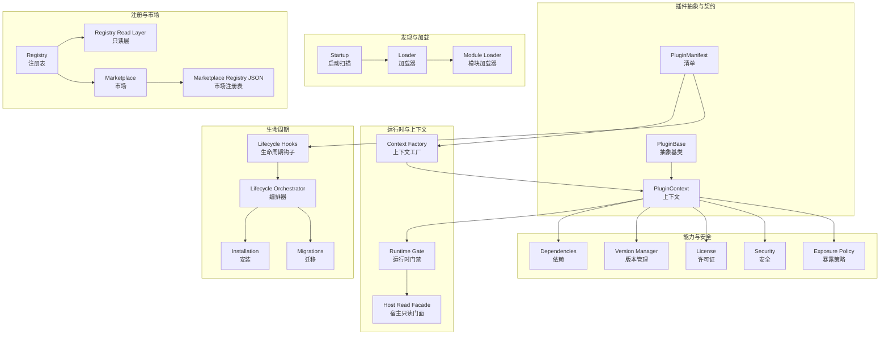
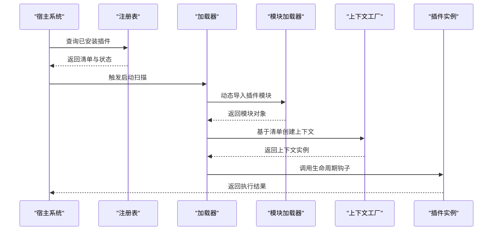
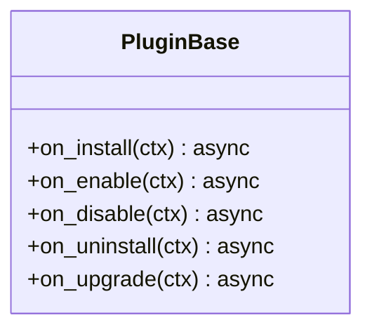
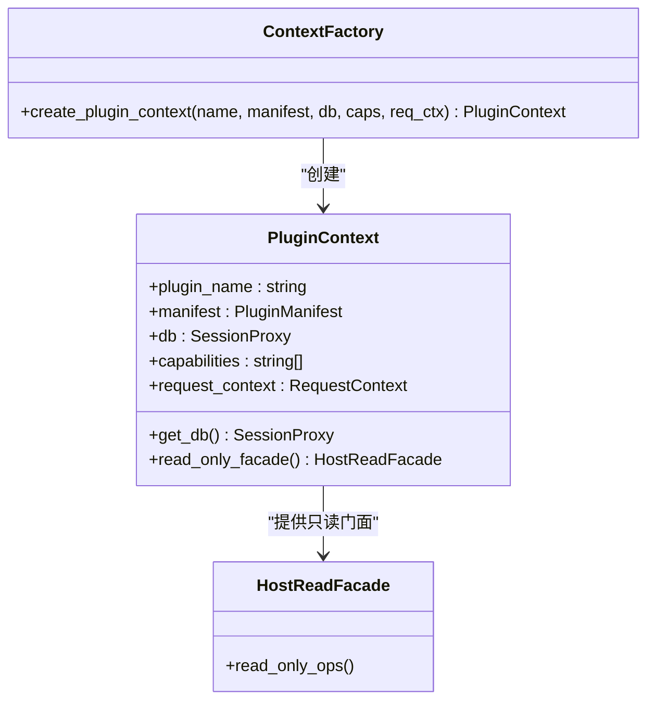
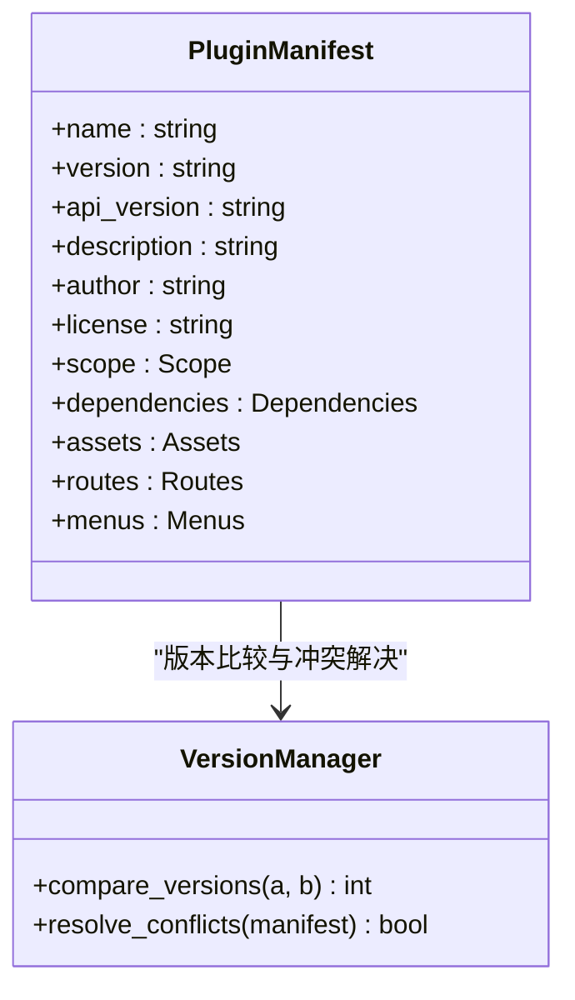
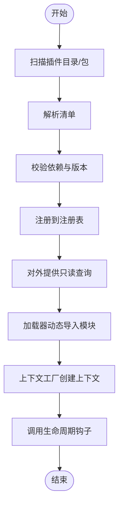
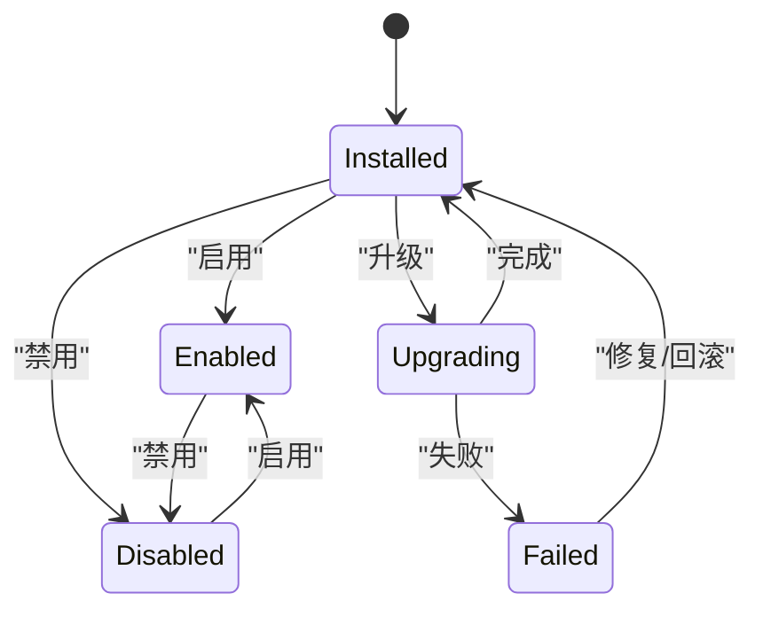
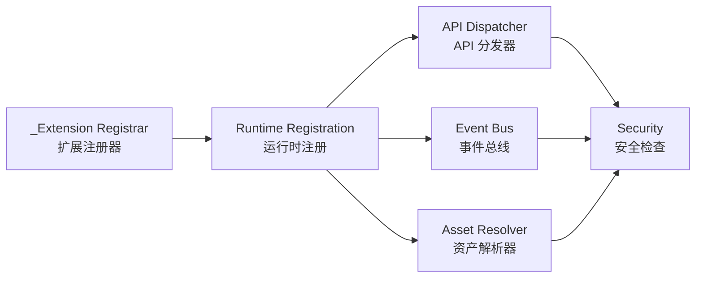
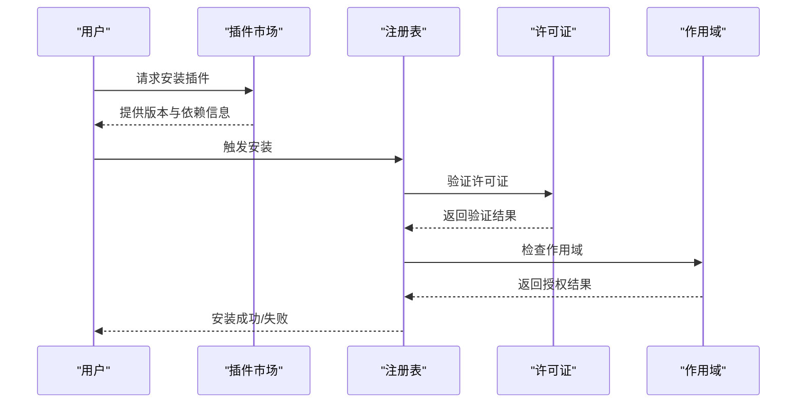
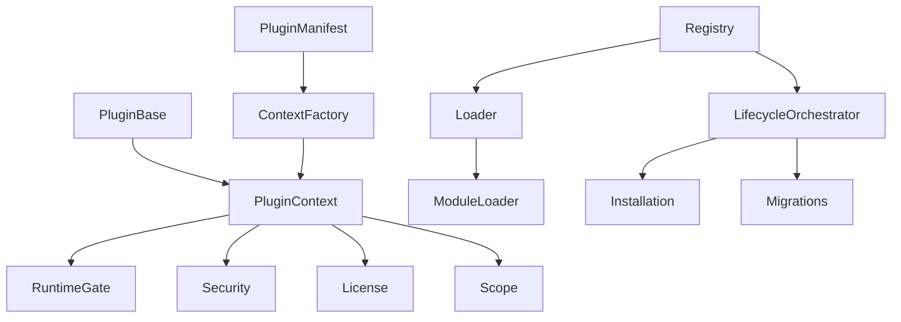

# 插件架构设计

<cite>
**本文档引用的文件**
- [base.py](file://backend/app/plugins/base.py)
- [context.py](file://backend/app/plugins/context.py)
- [context_factory.py](file://backend/app/plugins/context_factory.py)
- [manifest.py](file://backend/app/plugins/manifest.py)
- [registry.py](file://backend/app/plugins/registry.py)
- [loader.py](file://backend/app/plugins/loader.py)
- [lifecycle.py](file://backend/app/plugins/lifecycle.py)
- [lifecycle_orchestrator.py](file://backend/app/plugins/lifecycle_orchestrator.py)
- [dependencies.py](file://backend/app/plugins/dependencies.py)
- [version_manager.py](file://backend/app/plugins/version_manager.py)
- [startup.py](file://backend/app/plugins/startup.py)
- [asset_resolver.py](file://backend/app/plugins/asset_resolver.py)
- [api_dispatcher.py](file://backend/app/plugins/api_dispatcher.py)
- [event_bus.py](file://backend/app/plugins/event_bus.py)
- [marketplace.py](file://backend/app/plugins/marketplace.py)
- [marketplace_registry/registry.json](file://backend/app/plugins/marketplace_registry/registry.json)
- [_extension_registrar.py](file://backend/app/plugins/_extension_registrar.py)
- [runtime_registration.py](file://backend/app/plugins/runtime_registration.py)
- [runtime_gate.py](file://backend/app/plugins/runtime_gate.py)
- [host_read_facade.py](file://backend/app/plugins/host_read_facade.py)
- [license.py](file://backend/app/plugins/license.py)
- [scope.py](file://backend/app/plugins/scope.py)
- [security.py](file://backend/app/plugins/security.py)
- [exceptions.py](file://backend/app/plugins/exceptions.py)
</cite>

## 目录
1. [引言](#引言)
2. [项目结构](#项目结构)
3. [核心组件](#核心组件)
4. [架构总览](#架构总览)
5. [详细组件分析](#详细组件分析)
6. [依赖关系分析](#依赖关系分析)
7. [性能考量](#性能考量)
8. [故障排除指南](#故障排除指南)
9. [结论](#结论)
10. [附录](#附录)

## 引言
本文件面向插件架构设计，系统阐述插件抽象基类的设计理念、上下文系统与清单管理机制，文档化插件核心接口、抽象方法与生命周期钩子的设计原理；详解插件上下文的作用域、依赖注入与运行时环境；解释插件清单的结构、元数据管理与版本控制策略；并说明插件注册表的工作原理、插件发现机制与加载流程。最后总结架构决策的技术背景、设计权衡与扩展性考虑，并强调插件与核心系统的解耦设计与模块化原则。

## 项目结构
插件子系统位于 backend/app/plugins 目录，采用“功能域+版本化”的组织方式：
- 抽象与契约：base.py、context.py、manifest.py
- 运行时与上下文：context_factory.py、runtime_gate.py、host_read_facade.py
- 发现与加载：loader.py、module_loader.py、startup.py
- 注册与发现：registry.py、registry_read_layer.py、marketplace.py、marketplace_registry/registry.json
- 生命周期：lifecycle.py、lifecycle_orchestrator.py、lifecycle_installation.py、lifecycle_migrations.py
- 能力与安全：dependencies.py、version_manager.py、license.py、security.py、exposure_policy.py
- 扩展点：_extension_registrar.py、runtime_registration.py、api_dispatcher.py、event_bus.py、asset_resolver.py

图表来源
- [base.py:19-39](file://backend/app/plugins/base.py#L19-L39)
- [context.py](file://backend/app/plugins/context.py)
- [context_factory.py:24-43](file://backend/app/plugins/context_factory.py#L24-L43)
- [manifest.py](file://backend/app/plugins/manifest.py)
- [registry.py](file://backend/app/plugins/registry.py)
- [registry_read_layer.py](file://backend/app/plugins/registry_read_layer.py)
- [marketplace.py](file://backend/app/plugins/marketplace.py)
- [marketplace_registry/registry.json](file://backend/app/plugins/marketplace_registry/registry.json)
- [loader.py](file://backend/app/plugins/loader.py)
- [startup.py](file://backend/app/plugins/startup.py)
- [lifecycle.py](file://backend/app/plugins/lifecycle.py)
- [lifecycle_orchestrator.py](file://backend/app/plugins/lifecycle_orchestrator.py)
- [lifecycle_installation.py](file://backend/app/plugins/lifecycle_installation.py)
- [lifecycle_migrations.py](file://backend/app/plugins/lifecycle_migrations.py)
- [dependencies.py](file://backend/app/plugins/dependencies.py)
- [version_manager.py](file://backend/app/plugins/version_manager.py)
- [license.py](file://backend/app/plugins/license.py)
- [security.py](file://backend/app/plugins/security.py)
- [exposure_policy.py](file://backend/app/plugins/exposure_policy.py)

章节来源
- [base.py:1-39](file://backend/app/plugins/base.py#L1-L39)
- [context.py](file://backend/app/plugins/context.py)
- [manifest.py](file://backend/app/plugins/manifest.py)
- [registry.py](file://backend/app/plugins/registry.py)
- [loader.py](file://backend/app/plugins/loader.py)
- [startup.py](file://backend/app/plugins/startup.py)

## 核心组件
- 插件抽象基类 PluginBase：定义可选的生命周期钩子（安装、启用、禁用、卸载、升级），默认为空实现，便于插件按需覆盖。
- 插件上下文 PluginContext：承载运行时环境、数据库会话代理、能力授权、请求上下文等，是插件与宿主交互的唯一入口。
- 插件清单 PluginManifest：描述插件元数据、API 版本、依赖、许可、作用域等，用于注册、发现、版本控制与安全约束。
- 插件注册表 Registry：维护已安装插件的状态、版本、依赖关系与可见性，支持只读查询与运行时扩展。
- 插件加载器 Loader：负责从磁盘或包中发现并加载插件模块，结合模块加载器完成动态导入。
- 生命周期编排 Lifecycle Orchestrator：协调安装、升级、迁移、启用/禁用等操作，确保状态一致性与幂等性。

章节来源
- [base.py:19-39](file://backend/app/plugins/base.py#L19-L39)
- [context.py](file://backend/app/plugins/context.py)
- [manifest.py](file://backend/app/plugins/manifest.py)
- [registry.py](file://backend/app/plugins/registry.py)
- [loader.py](file://backend/app/plugins/loader.py)
- [lifecycle_orchestrator.py](file://backend/app/plugins/lifecycle_orchestrator.py)

## 架构总览
插件架构遵循“契约优先、版本化演进、最小权限、可发现可加载”的设计原则。通过抽象基类统一生命周期钩子，通过上下文工厂按清单 API 版本生成上下文实例，通过注册表与市场实现插件发现与版本管理，通过运行时门禁与安全策略保障隔离与权限控制。

图表来源
- [startup.py](file://backend/app/plugins/startup.py)
- [loader.py](file://backend/app/plugins/loader.py)
- [context_factory.py:34-43](file://backend/app/plugins/context_factory.py#L34-L43)
- [registry.py](file://backend/app/plugins/registry.py)

## 详细组件分析

### 插件抽象基类与生命周期钩子
- 设计理念：通过可选钩子减少插件实现成本，仅在需要时覆盖；默认空实现保证向后兼容与最小侵入。
- 生命周期钩子：
  - on_install：首次安装后调用，适合初始化资源、创建数据库表或写入默认配置。
  - on_enable：启用时调用，适合建立运行时连接或订阅事件。
  - on_disable：禁用时调用，适合释放资源或取消订阅。
  - on_uninstall：卸载前调用，适合清理持久化资源。
  - on_upgrade：版本升级后调用，适合执行迁移脚本或数据转换。
- 设计权衡：将业务逻辑与宿主生命周期解耦，避免插件直接依赖宿主内部细节。

图表来源
- [base.py:19-39](file://backend/app/plugins/base.py#L19-L39)

章节来源
- [base.py:19-39](file://backend/app/plugins/base.py#L19-L39)

### 插件上下文系统与依赖注入
- 作用域与隔离：PluginContext 将数据库会话代理、能力授权、请求上下文封装，限制插件对宿主内部的直接访问。
- 依赖注入：通过上下文工厂基于清单的 api_version 选择对应的上下文实现，当前支持 V1；保留版本化扩展机制。
- 运行时环境：上下文持有数据库会话代理、能力列表、请求上下文等，作为插件执行的沙箱环境。
- 安全边界：通过宿主只读门面与运行时门禁，限制插件对敏感资源的访问。

图表来源
- [context.py](file://backend/app/plugins/context.py)
- [context_factory.py:34-43](file://backend/app/plugins/context_factory.py#L34-L43)
- [host_read_facade.py](file://backend/app/plugins/host_read_facade.py)

章节来源
- [context.py](file://backend/app/plugins/context.py)
- [context_factory.py:24-43](file://backend/app/plugins/context_factory.py#L24-L43)
- [host_read_facade.py](file://backend/app/plugins/host_read_facade.py)

### 插件清单结构与元数据管理
- 清单字段：包含插件标识、名称、版本、API 版本、描述、作者、许可、作用域、依赖、前端资产、路由、菜单等。
- 元数据管理：通过清单辅助注册、发现、版本控制与安全策略；清单变更触发注册表更新与运行时扩展。
- 版本控制策略：通过版本管理器与生命周期编排器协同，确保升级过程中的数据迁移与兼容性检查。

图表来源
- [manifest.py](file://backend/app/plugins/manifest.py)
- [version_manager.py](file://backend/app/plugins/version_manager.py)

章节来源
- [manifest.py](file://backend/app/plugins/manifest.py)
- [version_manager.py](file://backend/app/plugins/version_manager.py)

### 插件注册表与发现机制
- 注册表职责：维护插件的安装状态、版本、依赖、可见性与作用域；提供只读查询接口供运行时使用。
- 发现机制：启动时扫描插件目录与包，解析清单并构建内存索引；支持从市场下载与本地安装两种来源。
- 加载流程：注册表确认依赖满足后，交由加载器进行动态导入；随后创建上下文并调用生命周期钩子。

图表来源
- [startup.py](file://backend/app/plugins/startup.py)
- [loader.py](file://backend/app/plugins/loader.py)
- [registry.py](file://backend/app/plugins/registry.py)
- [registry_read_layer.py](file://backend/app/plugins/registry_read_layer.py)

章节来源
- [registry.py](file://backend/app/plugins/registry.py)
- [registry_read_layer.py](file://backend/app/plugins/registry_read_layer.py)
- [startup.py](file://backend/app/plugins/startup.py)
- [loader.py](file://backend/app/plugins/loader.py)

### 生命周期编排与状态管理
- 编排器职责：协调安装、升级、迁移、启用/禁用等操作，确保状态一致性与幂等性；处理失败回滚与恢复。
- 状态机：通过运行时状态管理记录插件当前阶段，防止并发冲突与不一致状态。
- 维护模式：提供维护模式下的刷新与恢复流程，保障系统稳定性。

图表来源
- [lifecycle_orchestrator.py](file://backend/app/plugins/lifecycle_orchestrator.py)
- [lifecycle_runtime_state.py](file://backend/app/plugins/lifecycle_runtime_state.py)

章节来源
- [lifecycle.py](file://backend/app/plugins/lifecycle.py)
- [lifecycle_orchestrator.py](file://backend/app/plugins/lifecycle_orchestrator.py)
- [lifecycle_installation.py](file://backend/app/plugins/lifecycle_installation.py)
- [lifecycle_migrations.py](file://backend/app/plugins/lifecycle_migrations.py)

### 扩展点与运行时集成
- 扩展注册器：提供扩展点注册机制，允许插件在特定位置挂接处理器或中间件。
- 运行时注册：将插件提供的路由、菜单、事件处理器等注册到宿主系统。
- API 分发器：将外部请求分发到插件提供的处理器，同时应用安全与能力检查。
- 事件总线：支持插件发布/订阅事件，实现松耦合通信。
- 资产解析：解析插件前端资产路径，支持静态资源与路由映射。

图表来源
- [_extension_registrar.py](file://backend/app/plugins/_extension_registrar.py)
- [runtime_registration.py](file://backend/app/plugins/runtime_registration.py)
- [api_dispatcher.py](file://backend/app/plugins/api_dispatcher.py)
- [event_bus.py](file://backend/app/plugins/event_bus.py)
- [asset_resolver.py](file://backend/app/plugins/asset_resolver.py)
- [security.py](file://backend/app/plugins/security.py)

章节来源
- [_extension_registrar.py](file://backend/app/plugins/_extension_registrar.py)
- [runtime_registration.py](file://backend/app/plugins/runtime_registration.py)
- [api_dispatcher.py](file://backend/app/plugins/api_dispatcher.py)
- [event_bus.py](file://backend/app/plugins/event_bus.py)
- [asset_resolver.py](file://backend/app/plugins/asset_resolver.py)
- [security.py](file://backend/app/plugins/security.py)

### 市场与许可证管理
- 插件市场：提供插件下载、版本同步与依赖解析；支持离线与在线两种模式。
- 许可证：验证插件许可证有效性与过期时间，结合曝光策略控制功能开放范围。
- 作用域：根据租户/全局作用域决定插件可见性与可用性。

图表来源
- [marketplace.py](file://backend/app/plugins/marketplace.py)
- [license.py](file://backend/app/plugins/license.py)
- [scope.py](file://backend/app/plugins/scope.py)
- [marketplace_registry/registry.json](file://backend/app/plugins/marketplace_registry/registry.json)

章节来源
- [marketplace.py](file://backend/app/plugins/marketplace.py)
- [license.py](file://backend/app/plugins/license.py)
- [scope.py](file://backend/app/plugins/scope.py)
- [marketplace_registry/registry.json](file://backend/app/plugins/marketplace_registry/registry.json)

## 依赖关系分析
- 松耦合：插件通过抽象基类与上下文契约与宿主交互，避免直接依赖宿主内部实现。
- 可替换性：上下文工厂与运行时门禁支持多版本上下文与能力沙箱，便于演进与替换。
- 可观测性：事件总线与运行时状态管理提供可观测性与调试能力。
- 可靠性：生命周期编排器与恢复机制保障异常场景下的系统稳定。

图表来源
- [base.py:19-39](file://backend/app/plugins/base.py#L19-L39)
- [context.py](file://backend/app/plugins/context.py)
- [context_factory.py:24-43](file://backend/app/plugins/context_factory.py#L24-L43)
- [registry.py](file://backend/app/plugins/registry.py)
- [loader.py](file://backend/app/plugins/loader.py)
- [lifecycle_orchestrator.py](file://backend/app/plugins/lifecycle_orchestrator.py)
- [lifecycle_installation.py](file://backend/app/plugins/lifecycle_installation.py)
- [lifecycle_migrations.py](file://backend/app/plugins/lifecycle_migrations.py)
- [security.py](file://backend/app/plugins/security.py)
- [license.py](file://backend/app/plugins/license.py)
- [scope.py](file://backend/app/plugins/scope.py)

章节来源
- [dependencies.py](file://backend/app/plugins/dependencies.py)
- [version_manager.py](file://backend/app/plugins/version_manager.py)

## 性能考量
- 模块懒加载：通过模块加载器按需导入，降低启动时的内存与 CPU 开销。
- 缓存与索引：注册表维护内存索引，查询与依赖解析高效；建议定期刷新以保持一致性。
- 并发控制：生命周期编排器对并发安装/升级进行串行化，避免竞争条件。
- 资源回收：禁用/卸载时及时释放数据库连接与事件订阅，避免资源泄漏。

## 故障排除指南
- 安全错误：当插件尝试访问未授权的数据库表或会话时，运行时门禁会抛出安全异常；检查上下文的能力列表与许可证。
- 依赖冲突：版本管理器会检测并报告依赖冲突；根据提示调整插件版本或移除冲突插件。
- 生命周期异常：若升级失败，编排器会回滚到上一个稳定版本；检查迁移日志与状态表。
- 市场下载失败：检查网络与市场注册表配置；必要时切换到离线安装模式。

章节来源
- [exceptions.py](file://backend/app/plugins/exceptions.py)
- [runtime_gate.py](file://backend/app/plugins/runtime_gate.py)
- [security.py](file://backend/app/plugins/security.py)
- [lifecycle_orchestrator.py](file://backend/app/plugins/lifecycle_orchestrator.py)

## 结论
该插件架构通过抽象基类、上下文系统与清单管理实现了对插件生命周期的统一治理；通过注册表与市场机制实现了插件的可发现与可管理；通过运行时门禁与安全策略实现了最小权限与隔离；通过版本化上下文与编排器确保了演进与可靠性。整体设计在解耦与模块化方面表现突出，具备良好的扩展性与可维护性。

## 附录
- 最佳实践：仅在需要时覆盖生命周期钩子；严格遵循上下文能力边界；在清单中准确声明依赖与作用域；使用版本管理器进行升级前的兼容性检查。
- 扩展建议：引入插件间通信协议与事件契约；增强市场元数据与评分体系；完善灰度发布与回滚策略。