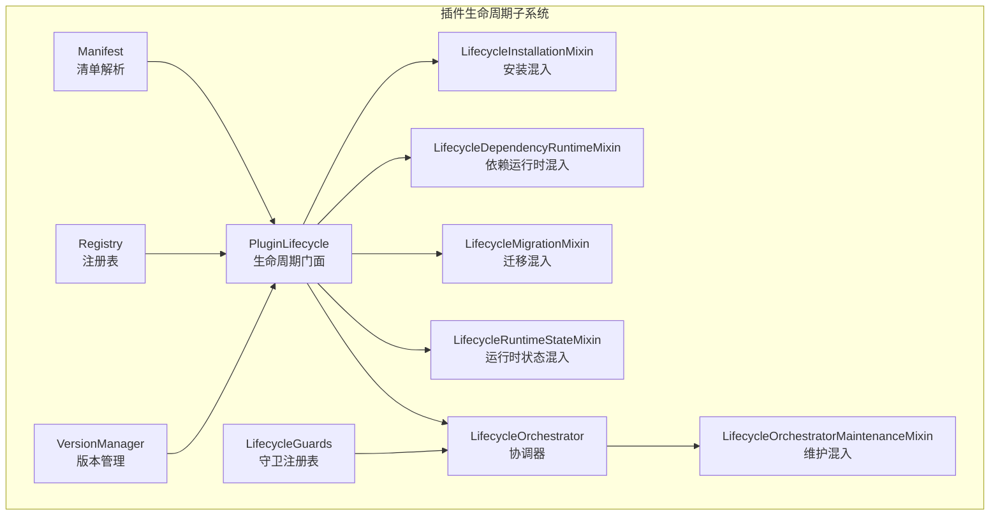
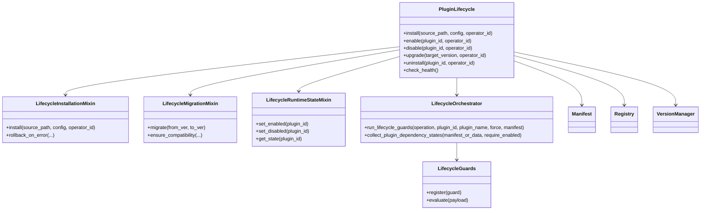
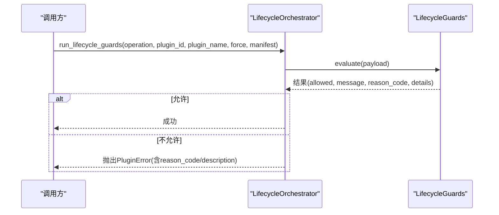
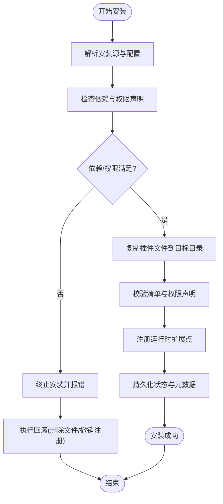
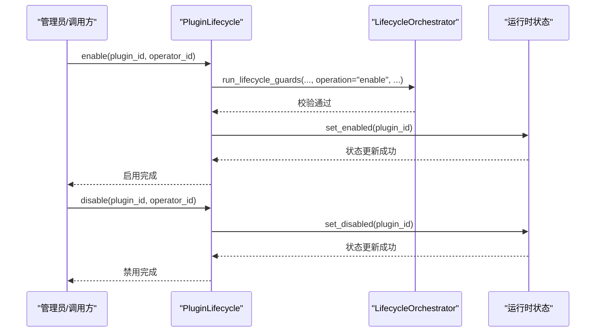
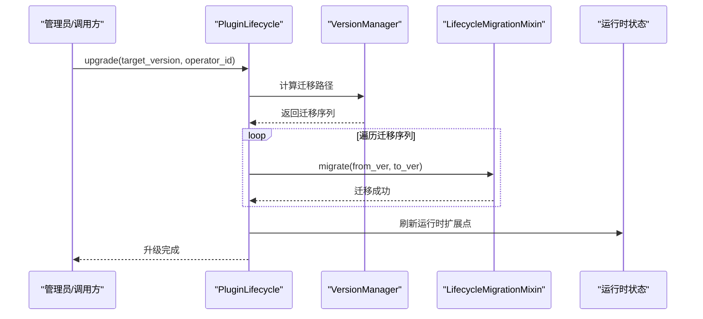
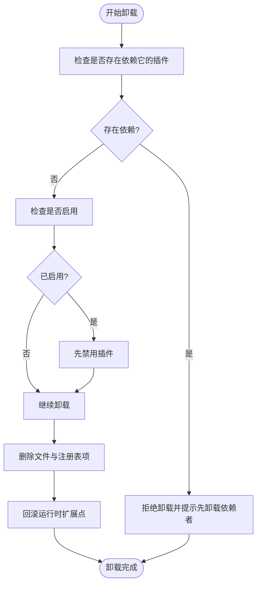
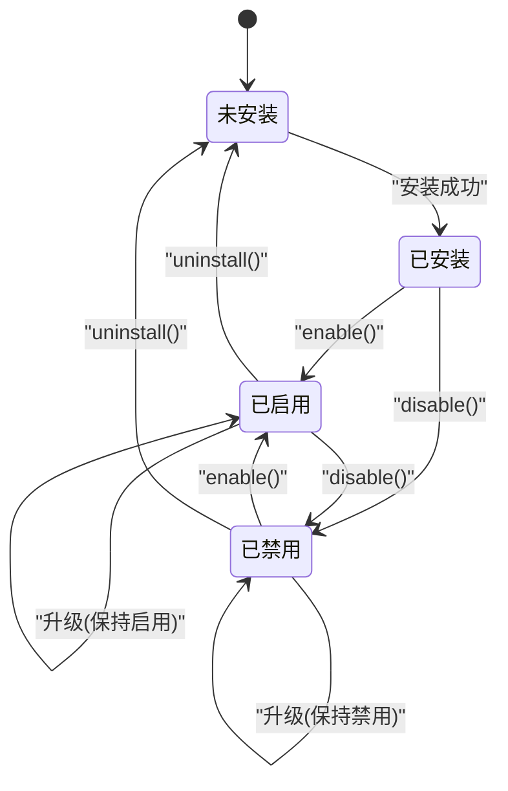
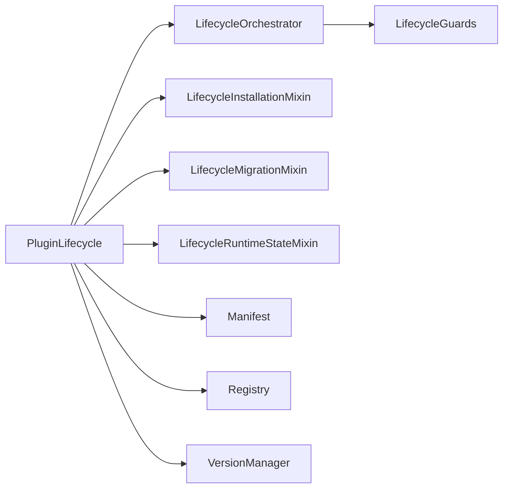

# 插件生命周期管理

<cite>
**本文引用的文件**
- [backend/app/plugins/lifecycle.py](file://backend/app/plugins/lifecycle.py)
- [backend/app/plugins/lifecycle_orchestrator.py](file://backend/app/plugins/lifecycle_orchestrator.py)
- [backend/app/plugins/lifecycle_orchestrator_maintenance.py](file://backend/app/plugins/lifecycle_orchestrator_maintenance.py)
- [backend/app/plugins/lifecycle_installation.py](file://backend/app/plugins/lifecycle_installation.py)
- [backend/app/plugins/lifecycle_migrations.py](file://backend/app/plugins/lifecycle_migrations.py)
- [backend/app/plugins/lifecycle_guards.py](file://backend/app/plugins/lifecycle_guards.py)
- [backend/app/plugins/lifecycle_runtime_state.py](file://backend/app/plugins/lifecycle_runtime_state.py)
- [backend/app/plugins/lifecycle_support.py](file://backend/app/plugins/lifecycle_support.py)
- [backend/app/plugins/registry.py](file://backend/app/plugins/registry.py)
- [backend/app/plugins/manifest.py](file://backend/app/plugins/manifest.py)
- [backend/app/plugins/version_manager.py](file://backend/app/plugins/version_manager.py)
- [backend/app/plugins/health.py](file://backend/app/plugins/health.py)
- [backend/app/plugins/startup.py](file://backend/app/plugins/startup.py)
- [backend/app/plugins/scheduler_refresh.py](file://backend/app/plugins/scheduler_refresh.py)
- [backend/app/plugins/runtime_recovery.py](file://backend/app/plugins/runtime_recovery.py)
- [backend/app/plugins/progress.py](file://backend/app/plugins/progress.py)
- [backend/app/plugins/exceptions.py](file://backend/app/plugins/exceptions.py)
- [backend/app/enums/plugin.py](file://backend/app/enums/plugin.py)
- [backend/tests/test_plugin_lifecycle_migrations.py](file://backend/tests/test_plugin_lifecycle_migrations.py)
- [backend/tests/test_plugin_lifecycle_guards.py](file://backend/tests/test_plugin_lifecycle_guards.py)
- [backend/tests/test_plugin_lifecycle_cleanup_safety.py](file://backend/tests/test_plugin_lifecycle_cleanup_safety.py)
- [backend/tests/test_plugin_version_manager_locking.py](file://backend/tests/test_plugin_version_manager_locking.py)
</cite>

## 目录
1. [简介](#简介)
2. [项目结构](#项目结构)
3. [核心组件](#核心组件)
4. [架构总览](#架构总览)
5. [详细组件分析](#详细组件分析)
6. [依赖关系分析](#依赖关系分析)
7. [性能考量](#性能考量)
8. [故障排除指南](#故障排除指南)
9. [结论](#结论)
10. [附录](#附录)

## 简介
本指南围绕插件生命周期管理，系统阐述从安装到卸载的完整流程，覆盖安装钩子、启用钩子、禁用钩子、升级钩子与卸载钩子的实现与调用时机；解释生命周期协调器的工作机制、状态转换与错误处理策略；说明插件迁移系统、数据迁移与版本兼容性管理；并提供生命周期支持工具、状态检查与健康监控能力，以及调试方法、故障排除与恢复策略，涵盖批量操作、并发处理与原子性保障。

## 项目结构
后端插件子系统位于 backend/app/plugins，采用“门面+混入式组合”的架构设计，将安装、依赖运行时、迁移、运行时状态等职责拆分为独立混入类，由 PluginLifecycle 组合装配，形成可扩展且高内聚的生命周期管理器。

图表来源
- [backend/app/plugins/lifecycle.py:108-113](file://backend/app/plugins/lifecycle.py#L108-L113)
- [backend/app/plugins/lifecycle_orchestrator.py:25-30](file://backend/app/plugins/lifecycle_orchestrator.py#L25-L30)
- [backend/app/plugins/lifecycle_installation.py:36-45](file://backend/app/plugins/lifecycle_installation.py#L36-L45)
- [backend/app/plugins/manifest.py](file://backend/app/plugins/manifest.py)
- [backend/app/plugins/registry.py](file://backend/app/plugins/registry.py)
- [backend/app/plugins/version_manager.py](file://backend/app/plugins/version_manager.py)

章节来源
- [backend/app/plugins/lifecycle.py:108-113](file://backend/app/plugins/lifecycle.py#L108-L113)
- [backend/app/plugins/lifecycle_orchestrator.py:25-30](file://backend/app/plugins/lifecycle_orchestrator.py#L25-L30)
- [backend/app/plugins/lifecycle_installation.py:36-45](file://backend/app/plugins/lifecycle_installation.py#L36-L45)

## 核心组件
- PluginLifecycle：生命周期门面，聚合安装、依赖运行时、迁移、运行时状态等混入，统一对外接口。
- LifecycleOrchestrator：生命周期协调器，负责守卫校验、依赖状态收集与前置条件断言。
- LifecycleInstallationMixin：安装与回滚流程编排，包含10步安装流程与回滚策略。
- LifecycleMigrationMixin：迁移流程编排，负责版本间数据迁移与兼容性处理。
- LifecycleRuntimeStateMixin：运行时状态管理，负责启用/禁用状态持久化与一致性。
- LifecycleGuards：生命周期守卫注册表，提供权限、依赖、许可等多维度守卫。
- Manifest/Registry/VersionManager：清单解析、注册表读写与版本管理，支撑生命周期决策。
- Health/Runtime Recovery/Scheduler Refresh：健康监控、运行时恢复与调度刷新，保障系统稳定性。

章节来源
- [backend/app/plugins/lifecycle.py:108-113](file://backend/app/plugins/lifecycle.py#L108-L113)
- [backend/app/plugins/lifecycle_orchestrator.py:25-30](file://backend/app/plugins/lifecycle_orchestrator.py#L25-L30)
- [backend/app/plugins/lifecycle_installation.py:36-45](file://backend/app/plugins/lifecycle_installation.py#L36-L45)
- [backend/app/plugins/lifecycle_migrations.py](file://backend/app/plugins/lifecycle_migrations.py)
- [backend/app/plugins/lifecycle_runtime_state.py](file://backend/app/plugins/lifecycle_runtime_state.py)
- [backend/app/plugins/lifecycle_guards.py](file://backend/app/plugins/lifecycle_guards.py)
- [backend/app/plugins/manifest.py](file://backend/app/plugins/manifest.py)
- [backend/app/plugins/registry.py](file://backend/app/plugins/registry.py)
- [backend/app/plugins/version_manager.py](file://backend/app/plugins/version_manager.py)
- [backend/app/plugins/health.py](file://backend/app/plugins/health.py)
- [backend/app/plugins/runtime_recovery.py](file://backend/app/plugins/runtime_recovery.py)
- [backend/app/plugins/scheduler_refresh.py](file://backend/app/plugins/scheduler_refresh.py)

## 架构总览
生命周期管理以 PluginLifecycle 为核心，通过混入式组合实现职责分离；协调器负责前置校验与依赖治理；安装与迁移混入分别处理静态资源与数据迁移；运行时状态混入确保启用/禁用状态一致；守卫注册表提供统一的校验入口；版本管理与清单解析为升级与兼容性提供基础。

图表来源
- [backend/app/plugins/lifecycle.py:108-113](file://backend/app/plugins/lifecycle.py#L108-L113)
- [backend/app/plugins/lifecycle_orchestrator.py:25-30](file://backend/app/plugins/lifecycle_orchestrator.py#L25-L30)
- [backend/app/plugins/lifecycle_installation.py:36-45](file://backend/app/plugins/lifecycle_installation.py#L36-L45)
- [backend/app/plugins/lifecycle_migrations.py](file://backend/app/plugins/lifecycle_migrations.py)
- [backend/app/plugins/lifecycle_runtime_state.py](file://backend/app/plugins/lifecycle_runtime_state.py)
- [backend/app/plugins/lifecycle_guards.py](file://backend/app/plugins/lifecycle_guards.py)
- [backend/app/plugins/manifest.py](file://backend/app/plugins/manifest.py)
- [backend/app/plugins/registry.py](file://backend/app/plugins/registry.py)
- [backend/app/plugins/version_manager.py](file://backend/app/plugins/version_manager.py)

## 详细组件分析

### 生命周期协调器与守卫
- 协调器职责
  - 运行生命周期守卫，根据操作类型（安装/启用/禁用/升级/卸载）进行权限与依赖校验。
  - 收集依赖状态，汇总依赖错误信息，断言启用前置条件。
- 守卫注册表
  - 提供统一的守卫评估入口，支持权限、依赖、许可、配额等多维校验。
- 错误处理
  - 当守卫返回不允许时，抛出带原因码与详情的插件错误，便于上层定位与提示。

图表来源
- [backend/app/plugins/lifecycle_orchestrator.py:31-61](file://backend/app/plugins/lifecycle_orchestrator.py#L31-L61)
- [backend/app/plugins/lifecycle_guards.py](file://backend/app/plugins/lifecycle_guards.py)

章节来源
- [backend/app/plugins/lifecycle_orchestrator.py:31-61](file://backend/app/plugins/lifecycle_orchestrator.py#L31-L61)
- [backend/app/plugins/lifecycle_guards.py](file://backend/app/plugins/lifecycle_guards.py)

### 安装流程（含回滚）
- 流程特征
  - 采用10步安装流程，包含源解析、依赖检查、文件落盘、清单校验、权限声明统计、运行时注册、状态更新与进度上报。
  - 失败即回滚，确保系统一致性与原子性。
- 关键步骤
  - 解析安装源与配置，生成临时目录与唯一标识。
  - 校验依赖与权限声明，必要时阻断安装。
  - 执行文件复制与清单注入，注册运行时扩展点。
  - 更新数据库状态，记录安装来源与版本状态。
- 回滚策略
  - 在异常发生时清理已落盘资源与注册表项，恢复至安装前状态。

图表来源
- [backend/app/plugins/lifecycle_installation.py:39-45](file://backend/app/plugins/lifecycle_installation.py#L39-L45)
- [backend/app/plugins/lifecycle_installation.py:36-45](file://backend/app/plugins/lifecycle_installation.py#L36-L45)

章节来源
- [backend/app/plugins/lifecycle_installation.py:36-45](file://backend/app/plugins/lifecycle_installation.py#L36-L45)

### 启用/禁用流程
- 启用
  - 调用协调器进行守卫校验与依赖状态断言。
  - 设置运行时状态为启用，触发运行时扩展点注册与资源加载。
- 禁用
  - 反向撤销启用阶段的注册与资源加载。
  - 更新状态为禁用，确保无残留副作用。

图表来源
- [backend/app/plugins/lifecycle_orchestrator.py:31-61](file://backend/app/plugins/lifecycle_orchestrator.py#L31-L61)
- [backend/app/plugins/lifecycle_runtime_state.py](file://backend/app/plugins/lifecycle_runtime_state.py)

章节来源
- [backend/app/plugins/lifecycle_orchestrator.py:31-61](file://backend/app/plugins/lifecycle_orchestrator.py#L31-L61)
- [backend/app/plugins/lifecycle_runtime_state.py](file://backend/app/plugins/lifecycle_runtime_state.py)

### 升级流程
- 版本管理
  - 使用版本管理器确定目标版本与迁移路径，避免跨大版本不兼容。
- 数据迁移
  - 在升级前后执行迁移混入，确保数据库结构与业务数据兼容。
- 运行时切换
  - 升级完成后重新注册运行时扩展点，确保新版本生效。

图表来源
- [backend/app/plugins/version_manager.py](file://backend/app/plugins/version_manager.py)
- [backend/app/plugins/lifecycle_migrations.py](file://backend/app/plugins/lifecycle_migrations.py)

章节来源
- [backend/app/plugins/version_manager.py](file://backend/app/plugins/version_manager.py)
- [backend/app/plugins/lifecycle_migrations.py](file://backend/app/plugins/lifecycle_migrations.py)

### 卸载流程
- 依赖检查
  - 若存在其他插件依赖该插件，拒绝卸载并提示先卸载依赖者。
- 安全卸载
  - 若插件处于启用状态，先禁用再卸载。
  - 删除文件与注册表项，回滚运行时扩展点。
- 清理与回滚
  - 异常时执行回滚，确保系统一致性。

图表来源
- [backend/app/plugins/lifecycle_orchestrator_maintenance.py:230-255](file://backend/app/plugins/lifecycle_orchestrator_maintenance.py#L230-L255)

章节来源
- [backend/app/plugins/lifecycle_orchestrator_maintenance.py:230-255](file://backend/app/plugins/lifecycle_orchestrator_maintenance.py#L230-L255)

### 生命周期状态模型与转换
- 状态枚举
  - 使用插件状态枚举定义启用/禁用/未安装等状态，确保跨模块一致。
- 状态转换
  - 安装成功 → 设置为启用或待启用。
  - 启用/禁用 → 更新运行时状态与注册表。
  - 升级 → 保持启用/禁用状态，但切换运行时实现。
  - 卸载 → 清理状态与资源。

图表来源
- [backend/app/enums/plugin.py](file://backend/app/enums/plugin.py)

章节来源
- [backend/app/enums/plugin.py](file://backend/app/enums/plugin.py)

### 迁移系统与版本兼容性
- 迁移路径
  - 基于版本管理器计算迁移路径，逐版本应用迁移脚本。
- 数据迁移
  - 迁移混入封装数据库与业务数据迁移逻辑，确保幂等与可回滚。
- 兼容性策略
  - 严格限制跨大版本升级，必要时强制预检查与备份。

章节来源
- [backend/app/plugins/lifecycle_migrations.py](file://backend/app/plugins/lifecycle_migrations.py)
- [backend/app/plugins/version_manager.py](file://backend/app/plugins/version_manager.py)
- [backend/tests/test_plugin_lifecycle_migrations.py](file://backend/tests/test_plugin_lifecycle_migrations.py)

### 生命周期支持工具与健康监控
- 进度上报
  - 通过进度发射器在安装/卸载等长耗时操作中上报步骤与状态。
- 健康检查
  - 提供健康检查接口，检测插件运行时状态与依赖可用性。
- 运行时恢复
  - 在异常场景下自动恢复运行时状态，减少人工干预。
- 调度刷新
  - 刷新定时任务与调度器，确保升级后任务正确绑定到新版本。

章节来源
- [backend/app/plugins/progress.py](file://backend/app/plugins/progress.py)
- [backend/app/plugins/health.py](file://backend/app/plugins/health.py)
- [backend/app/plugins/runtime_recovery.py](file://backend/app/plugins/runtime_recovery.py)
- [backend/app/plugins/scheduler_refresh.py](file://backend/app/plugins/scheduler_refresh.py)

## 依赖关系分析
- 组件耦合
  - PluginLifecycle 通过混入聚合多个职责，降低直接耦合。
  - 协调器与守卫注册表解耦，便于扩展新的校验规则。
- 外部依赖
  - 清单解析与注册表读写为生命周期决策提供依据。
  - 版本管理器与迁移系统为升级提供路径与数据保障。
- 潜在循环依赖
  - 通过延迟导入与门面模式避免循环依赖问题。

图表来源
- [backend/app/plugins/lifecycle.py:95-104](file://backend/app/plugins/lifecycle.py#L95-L104)
- [backend/app/plugins/lifecycle_orchestrator.py:20-22](file://backend/app/plugins/lifecycle_orchestrator.py#L20-L22)
- [backend/app/plugins/lifecycle_installation.py:29-31](file://backend/app/plugins/lifecycle_installation.py#L29-L31)
- [backend/app/plugins/lifecycle_migrations.py](file://backend/app/plugins/lifecycle_migrations.py)
- [backend/app/plugins/lifecycle_runtime_state.py](file://backend/app/plugins/lifecycle_runtime_state.py)
- [backend/app/plugins/lifecycle_guards.py](file://backend/app/plugins/lifecycle_guards.py)
- [backend/app/plugins/manifest.py](file://backend/app/plugins/manifest.py)
- [backend/app/plugins/registry.py](file://backend/app/plugins/registry.py)
- [backend/app/plugins/version_manager.py](file://backend/app/plugins/version_manager.py)

章节来源
- [backend/app/plugins/lifecycle.py:95-104](file://backend/app/plugins/lifecycle.py#L95-L104)

## 性能考量
- 并发与批量
  - 安装/升级/卸载支持批量操作，内部通过队列与锁控制并发，避免竞态。
- 原子性
  - 安装与卸载采用回滚策略，结合事务与文件系统原子操作，确保一致性。
- 运行时优化
  - 启用/禁用仅影响运行时扩展点，不阻塞主业务线程。
- 监控与可观测性
  - 进度上报与健康检查提供实时反馈，便于快速定位瓶颈。

## 故障排除指南
- 常见错误与定位
  - 依赖错误：通过依赖状态收集与汇总错误信息，定位缺失或版本不匹配的依赖。
  - 权限错误：通过守卫结果中的原因码与详情定位权限不足或声明不匹配。
  - 升级失败：检查迁移路径与数据一致性，必要时回滚至上一版本。
- 恢复策略
  - 使用运行时恢复模块自动修复状态不一致问题。
  - 对于安装/卸载失败，执行回滚清理并重试。
- 调试方法
  - 开启详细日志，关注安装/升级/卸载各步骤的错误堆栈。
  - 使用健康检查接口验证插件可用性与依赖状态。

章节来源
- [backend/app/plugins/lifecycle_orchestrator.py:63-72](file://backend/app/plugins/lifecycle_orchestrator.py#L63-L72)
- [backend/app/plugins/lifecycle_orchestrator_maintenance.py:230-255](file://backend/app/plugins/lifecycle_orchestrator_maintenance.py#L230-L255)
- [backend/app/plugins/runtime_recovery.py](file://backend/app/plugins/runtime_recovery.py)
- [backend/app/plugins/health.py](file://backend/app/plugins/health.py)
- [backend/tests/test_plugin_lifecycle_guards.py](file://backend/tests/test_plugin_lifecycle_guards.py)
- [backend/tests/test_plugin_lifecycle_cleanup_safety.py](file://backend/tests/test_plugin_lifecycle_cleanup_safety.py)

## 结论
该插件生命周期管理方案通过门面+混入的架构实现了职责清晰、可扩展与高可靠性的生命周期编排。协调器与守卫体系确保了安全与合规，安装/迁移/运行时状态管理提供了强一致与原子性保障，配合健康监控与恢复机制，能够有效支撑生产环境的稳定运行。

## 附录
- 相关测试参考
  - 生命周期迁移测试：验证迁移路径与数据一致性。
  - 生命周期守卫测试：验证权限与依赖校验逻辑。
  - 清理安全测试：验证安装/卸载失败后的回滚与清理。
  - 版本管理锁定测试：验证升级过程中的并发与锁控制。

章节来源
- [backend/tests/test_plugin_lifecycle_migrations.py](file://backend/tests/test_plugin_lifecycle_migrations.py)
- [backend/tests/test_plugin_lifecycle_guards.py](file://backend/tests/test_plugin_lifecycle_guards.py)
- [backend/tests/test_plugin_lifecycle_cleanup_safety.py](file://backend/tests/test_plugin_lifecycle_cleanup_safety.py)
- [backend/tests/test_plugin_version_manager_locking.py](file://backend/tests/test_plugin_version_manager_locking.py)