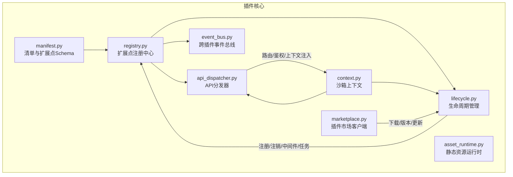
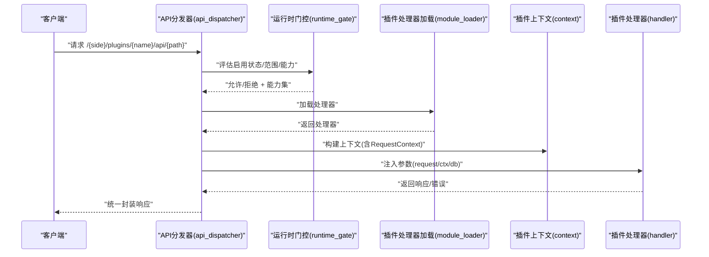
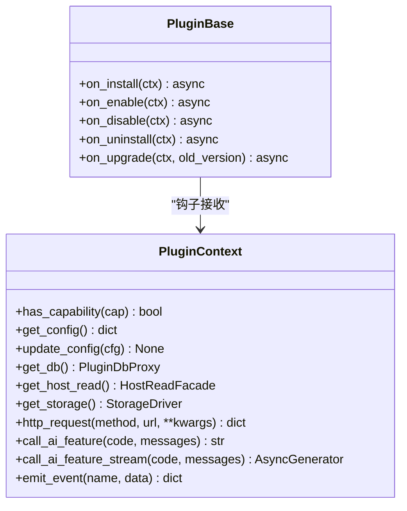
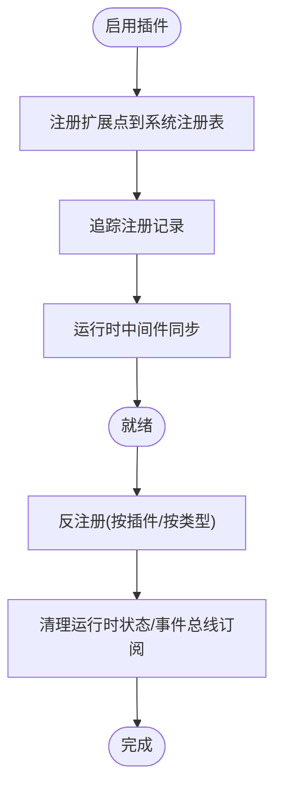
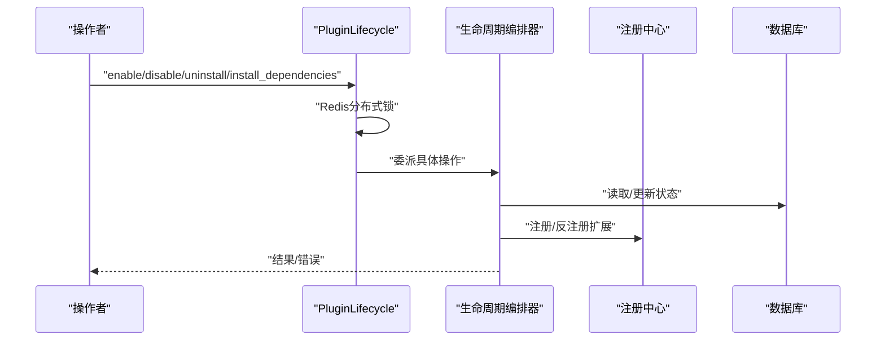
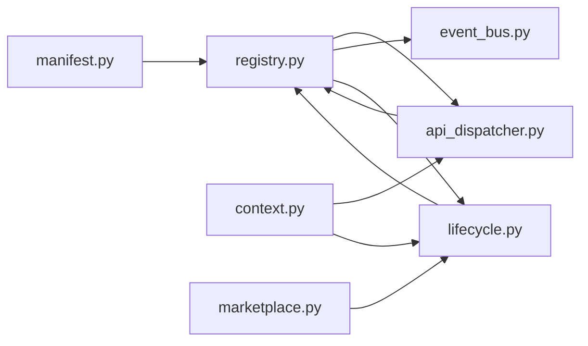

# 插件生态系统

<cite>
**本文档引用的文件**
- [backend/app/plugins/__init__.py](file://backend/app/plugins/__init__.py)
- [backend/app/plugins/base.py](file://backend/app/plugins/base.py)
- [backend/app/plugins/manifest.py](file://backend/app/plugins/manifest.py)
- [backend/app/plugins/lifecycle.py](file://backend/app/plugins/lifecycle.py)
- [backend/app/plugins/registry.py](file://backend/app/plugins/registry.py)
- [backend/app/plugins/event_bus.py](file://backend/app/plugins/event_bus.py)
- [backend/app/plugins/context.py](file://backend/app/plugins/context.py)
- [backend/app/plugins/api_dispatcher.py](file://backend/app/plugins/api_dispatcher.py)
- [backend/app/plugins/asset_runtime.py](file://backend/app/plugins/asset_runtime.py)
- [backend/app/plugins/marketplace.py](file://backend/app/plugins/marketplace.py)
</cite>

## 目录
1. [简介](#简介)
2. [项目结构](#项目结构)
3. [核心组件](#核心组件)
4. [架构总览](#架构总览)
5. [详细组件分析](#详细组件分析)
6. [依赖关系分析](#依赖关系分析)
7. [性能考量](#性能考量)
8. [故障排查指南](#故障排查指南)
9. [结论](#结论)
10. [附录](#附录)

## 简介
本文件面向插件开发者与维护者，系统性阐述本项目的插件生态系统：包括插件架构设计、生命周期管理、API 分发机制、事件总线、资源运行时、依赖管理、安装/启用/禁用/卸载流程、插件市场与版本更新策略，以及开发最佳实践、安全与性能优化建议。文档同时提供可视化图示与参考路径，帮助快速定位实现细节。

## 项目结构
插件系统位于 backend/app/plugins 目录，围绕“清单（manifest）—注册中心（registry）—上下文（context）—生命周期（lifecycle）—API 分发（dispatcher）—事件总线（event bus）—资源运行时（asset runtime）—市场（marketplace）”的主干链路组织，辅以模块化的扩展点与安全门控。

图表来源
- [backend/app/plugins/manifest.py:745-763](file://backend/app/plugins/manifest.py#L745-L763)
- [backend/app/plugins/registry.py:172-230](file://backend/app/plugins/registry.py#L172-L230)
- [backend/app/plugins/context.py:43-83](file://backend/app/plugins/context.py#L43-L83)
- [backend/app/plugins/lifecycle.py:108-129](file://backend/app/plugins/lifecycle.py#L108-L129)
- [backend/app/plugins/event_bus.py:44-78](file://backend/app/plugins/event_bus.py#L44-L78)
- [backend/app/plugins/api_dispatcher.py:56-58](file://backend/app/plugins/api_dispatcher.py#L56-L58)
- [backend/app/plugins/asset_runtime.py:31-40](file://backend/app/plugins/asset_runtime.py#L31-L40)
- [backend/app/plugins/marketplace.py:41-49](file://backend/app/plugins/marketplace.py#L41-L49)

章节来源
- [backend/app/plugins/__init__.py:1-46](file://backend/app/plugins/__init__.py#L1-L46)
- [backend/app/plugins/manifest.py:745-763](file://backend/app/plugins/manifest.py#L745-L763)
- [backend/app/plugins/registry.py:172-230](file://backend/app/plugins/registry.py#L172-L230)
- [backend/app/plugins/context.py:43-83](file://backend/app/plugins/context.py#L43-L83)
- [backend/app/plugins/lifecycle.py:108-129](file://backend/app/plugins/lifecycle.py#L108-L129)
- [backend/app/plugins/event_bus.py:44-78](file://backend/app/plugins/event_bus.py#L44-L78)
- [backend/app/plugins/api_dispatcher.py:56-58](file://backend/app/plugins/api_dispatcher.py#L56-L58)
- [backend/app/plugins/asset_runtime.py:31-40](file://backend/app/plugins/asset_runtime.py#L31-L40)
- [backend/app/plugins/marketplace.py:41-49](file://backend/app/plugins/marketplace.py#L41-L49)

## 核心组件
- 插件基类与生命周期钩子：定义 on_install/on_enable/on_disable/on_uninstall/on_upgrade 等钩子，插件按需覆盖。
- 清单与扩展点：通过 Pydantic Schema 校验 plugin.yaml，声明 API、任务、权限、前端页面、事件、Webhook、Socket.IO、中间件等扩展点。
- 注册中心：桥接插件扩展声明到系统现有注册表，追踪注册记录以便反注册；提供查询接口与运行时中间件同步。
- 沙箱上下文：统一插件与核心系统的交互入口，基于能力授权（capabilities）进行细粒度控制。
- 生命周期管理：集中管理安装、启用、禁用、卸载、依赖安装/卸载、修复、计划刷新等。
- API 分发器：统一插件 API 入口，按路径与方法匹配路由，注入 PluginContext，执行权限与能力校验。
- 事件总线：跨插件异步通知，支持超时隔离与死信队列。
- 资源运行时：统一鉴权插件静态资源访问，支持 Cookie/Token 方案与公开验证码场景。
- 插件市场：拉取市场索引、详情、README，下载 ZIP 包并进行安全校验与重试。

章节来源
- [backend/app/plugins/base.py:19-45](file://backend/app/plugins/base.py#L19-L45)
- [backend/app/plugins/manifest.py:745-763](file://backend/app/plugins/manifest.py#L745-L763)
- [backend/app/plugins/registry.py:172-230](file://backend/app/plugins/registry.py#L172-L230)
- [backend/app/plugins/context.py:43-83](file://backend/app/plugins/context.py#L43-L83)
- [backend/app/plugins/lifecycle.py:108-129](file://backend/app/plugins/lifecycle.py#L108-L129)
- [backend/app/plugins/api_dispatcher.py:56-58](file://backend/app/plugins/api_dispatcher.py#L56-L58)
- [backend/app/plugins/event_bus.py:44-78](file://backend/app/plugins/event_bus.py#L44-L78)
- [backend/app/plugins/asset_runtime.py:31-40](file://backend/app/plugins/asset_runtime.py#L31-L40)
- [backend/app/plugins/marketplace.py:41-49](file://backend/app/plugins/marketplace.py#L41-L49)

## 架构总览
插件系统采用“声明式清单 + 运行时门控 + 注册中心桥接”的架构。插件通过 manifest 声明扩展点，运行时经由注册中心注册到系统，API 请求由分发器统一接入，上下文提供能力授权，事件总线支撑跨插件通信，生命周期管理负责启停与依赖治理，市场提供安装与更新能力。

图表来源
- [backend/app/plugins/api_dispatcher.py:158-407](file://backend/app/plugins/api_dispatcher.py#L158-L407)
- [backend/app/plugins/context.py:668-707](file://backend/app/plugins/context.py#L668-L707)

章节来源
- [backend/app/plugins/api_dispatcher.py:158-407](file://backend/app/plugins/api_dispatcher.py#L158-L407)
- [backend/app/plugins/context.py:668-707](file://backend/app/plugins/context.py#L668-L707)

## 详细组件分析

### 插件基类与生命周期钩子
- 插件需继承 PluginBase 并按需覆盖生命周期钩子。
- 钩子均提供默认空实现，插件仅覆盖所需方法，降低实现复杂度。

图表来源
- [backend/app/plugins/base.py:19-45](file://backend/app/plugins/base.py#L19-L45)
- [backend/app/plugins/context.py:43-83](file://backend/app/plugins/context.py#L43-L83)

章节来源
- [backend/app/plugins/base.py:19-45](file://backend/app/plugins/base.py#L19-L45)
- [backend/app/plugins/context.py:43-83](file://backend/app/plugins/context.py#L43-L83)

### 清单与扩展点 Schema
- 清单通过 Pydantic Schema 校验，声明各类扩展点：
  - 技能（skills）、适配器（adapters）、存储驱动（storage_drivers）
  - API（admin/tenant/public）、Hook、定时任务（tasks）、通知模板（notifications）、权限（permissions）
  - 前端页面（pages）、头部组件（header_widgets）、浮动面板（floating_panels）、设置页签（settings_tabs）
  - Webhook、事件订阅（events）、Socket.IO 命名空间（socketio）
  - 消息队列消费者（consumers）、自定义扩展（custom）、ASGI 中间件（middleware）
- 清单还定义插件能力白名单（如 db:own_tables、http:outbound、storage:read/write、ai:call 等），用于上下文授权。

章节来源
- [backend/app/plugins/manifest.py:745-763](file://backend/app/plugins/manifest.py#L745-L763)
- [backend/app/plugins/manifest.py:780-800](file://backend/app/plugins/manifest.py#L780-L800)

### 注册中心与扩展点桥接
- 注册中心负责：
  - 将插件扩展声明桥接到系统注册表（适配器、Hook、存储、技能、事件、Webhook、任务、通知、权限、Socket.IO、前端插槽、消费者、中间件、自定义、菜单等）
  - 追踪每个插件注册的扩展，支持按类型或全量反注册
  - 提供运行时中间件同步（重建 FastAPI 中间件栈）
  - 提供查询接口（技能解析器/执行器、Webhook、通知、权限、前端插槽、消费者、自定义、中间件、菜单）
- 注册中心还负责清理插件运行时状态与事件总线订阅。

图表来源
- [backend/app/plugins/registry.py:172-230](file://backend/app/plugins/registry.py#L172-L230)
- [backend/app/plugins/registry.py:688-717](file://backend/app/plugins/registry.py#L688-L717)

章节来源
- [backend/app/plugins/registry.py:172-230](file://backend/app/plugins/registry.py#L172-L230)
- [backend/app/plugins/registry.py:688-717](file://backend/app/plugins/registry.py#L688-L717)

### 沙箱上下文与能力授权
- PluginContext 是插件与核心系统交互的唯一入口，所有方法在执行前检查能力授权。
- 支持：
  - 配置读取/更新（自动加解密）
  - 数据库代理（仅限插件自有表前缀）
  - 宿主只读门面
  - 存储驱动命名空间访问
  - HTTP 外出请求（SSRF 防护）
  - AI 功能调用（Agent 绑定解析、流式/非流式）
  - 通知发送（租户/收件人校验）
  - 事件发布（跨插件事件总线 + 同名 Hook 触发）

章节来源
- [backend/app/plugins/context.py:70-83](file://backend/app/plugins/context.py#L70-L83)
- [backend/app/plugins/context.py:86-170](file://backend/app/plugins/context.py#L86-L170)
- [backend/app/plugins/context.py:173-196](file://backend/app/plugins/context.py#L173-L196)
- [backend/app/plugins/context.py:225-289](file://backend/app/plugins/context.py#L225-L289)
- [backend/app/plugins/context.py:292-323](file://backend/app/plugins/context.py#L292-L323)
- [backend/app/plugins/context.py:484-519](file://backend/app/plugins/context.py#L484-L519)
- [backend/app/plugins/context.py:520-649](file://backend/app/plugins/context.py#L520-L649)
- [backend/app/plugins/context.py:669-742](file://backend/app/plugins/context.py#L669-L742)

### 生命周期管理
- 集中管理四类核心操作：安装、启用、禁用、卸载；并支持依赖安装/卸载、计划刷新、菜单覆盖、修复等。
- 使用 Redis 分布式锁防止并发启/停/卸载冲突；提供守卫（guards）与前置条件检查。
- 生命周期编排器负责依赖状态收集、权限激活、迁移、运行时状态管理等。

图表来源
- [backend/app/plugins/lifecycle.py:235-387](file://backend/app/plugins/lifecycle.py#L235-L387)
- [backend/app/plugins/lifecycle.py:108-129](file://backend/app/plugins/lifecycle.py#L108-L129)

章节来源
- [backend/app/plugins/lifecycle.py:108-129](file://backend/app/plugins/lifecycle.py#L108-L129)
- [backend/app/plugins/lifecycle.py:235-387](file://backend/app/plugins/lifecycle.py#L235-L387)

### API 分发器与路由匹配
- 统一插件 API 入口，支持 admin/tenant/public 三类路由。
- 路由匹配支持路径参数提取；按方法匹配；支持 public_routes 与权限动作门控。
- 运行时门控评估插件启用状态与范围；加载处理器并注入 request/ctx/db 参数；统一封装响应或错误。

章节来源
- [backend/app/plugins/api_dispatcher.py:158-407](file://backend/app/plugins/api_dispatcher.py#L158-L407)
- [backend/app/plugins/api_dispatcher.py:484-519](file://backend/app/plugins/api_dispatcher.py#L484-L519)
- [backend/app/plugins/api_dispatcher.py:554-666](file://backend/app/plugins/api_dispatcher.py#L554-L666)

### 事件总线（跨插件异步通知）
- PluginEventBus 提供跨插件异步通知，handler 并行执行、超时隔离、异常记录至死信队列。
- 支持订阅/取消订阅、批量取消、统计与健康页展示。

章节来源
- [backend/app/plugins/event_bus.py:44-78](file://backend/app/plugins/event_bus.py#L44-L78)
- [backend/app/plugins/event_bus.py:170-264](file://backend/app/plugins/event_bus.py#L170-L264)
- [backend/app/plugins/event_bus.py:284-316](file://backend/app/plugins/event_bus.py#L284-L316)

### 资源运行时与静态资源鉴权
- 统一鉴权插件静态资源访问，支持 Token/Cookie 方案；区分插件图标与公共验证码场景。
- 提供 Cookie 清理逻辑，避免历史鉴权残留。

章节来源
- [backend/app/plugins/asset_runtime.py:102-172](file://backend/app/plugins/asset_runtime.py#L102-L172)
- [backend/app/plugins/asset_runtime.py:174-224](file://backend/app/plugins/asset_runtime.py#L174-L224)
- [backend/app/plugins/asset_runtime.py:226-279](file://backend/app/plugins/asset_runtime.py#L226-L279)

### 插件市场与版本管理
- MarketplaceClient 支持：
  - 拉取插件索引与详情（Redis 缓存 + 本地回退）
  - README 多语言获取
  - 下载插件 ZIP 包（GitHub 限定、重试、大小限制、归档校验）
  - 检测已安装插件的可用更新
- 平台配置可调整索引源与缓存 TTL。

章节来源
- [backend/app/plugins/marketplace.py:41-49](file://backend/app/plugins/marketplace.py#L41-L49)
- [backend/app/plugins/marketplace.py:119-156](file://backend/app/plugins/marketplace.py#L119-L156)
- [backend/app/plugins/marketplace.py:306-414](file://backend/app/plugins/marketplace.py#L306-L414)
- [backend/app/plugins/marketplace.py:415-459](file://backend/app/plugins/marketplace.py#L415-L459)

## 依赖关系分析
- 插件清单（manifest）决定扩展点类型与约束；
- 注册中心（registry）将扩展点桥接至系统注册表并追踪；
- API 分发器（api_dispatcher）依赖运行时门控与上下文；
- 事件总线（event_bus）独立于 API，但与注册中心协作；
- 生命周期（lifecycle）依赖注册中心与数据库；
- 市场（marketplace）依赖 HTTP 客户端与平台配置。

图表来源
- [backend/app/plugins/manifest.py:745-763](file://backend/app/plugins/manifest.py#L745-L763)
- [backend/app/plugins/registry.py:172-230](file://backend/app/plugins/registry.py#L172-L230)
- [backend/app/plugins/api_dispatcher.py:56-58](file://backend/app/plugins/api_dispatcher.py#L56-L58)
- [backend/app/plugins/event_bus.py:44-78](file://backend/app/plugins/event_bus.py#L44-L78)
- [backend/app/plugins/lifecycle.py:108-129](file://backend/app/plugins/lifecycle.py#L108-L129)
- [backend/app/plugins/context.py:43-83](file://backend/app/plugins/context.py#L43-L83)
- [backend/app/plugins/marketplace.py:41-49](file://backend/app/plugins/marketplace.py#L41-L49)

章节来源
- [backend/app/plugins/manifest.py:745-763](file://backend/app/plugins/manifest.py#L745-L763)
- [backend/app/plugins/registry.py:172-230](file://backend/app/plugins/registry.py#L172-L230)
- [backend/app/plugins/api_dispatcher.py:56-58](file://backend/app/plugins/api_dispatcher.py#L56-L58)
- [backend/app/plugins/event_bus.py:44-78](file://backend/app/plugins/event_bus.py#L44-L78)
- [backend/app/plugins/lifecycle.py:108-129](file://backend/app/plugins/lifecycle.py#L108-L129)
- [backend/app/plugins/context.py:43-83](file://backend/app/plugins/context.py#L43-L83)
- [backend/app/plugins/marketplace.py:41-49](file://backend/app/plugins/marketplace.py#L41-L49)

## 性能考量
- 路由匹配与签名计算使用 LRU 缓存（路由正则编译）以减少重复开销。
- API 分发器在 DEBUG 模式下可热加载清单，生产模式使用 DB 快照以提升性能。
- 事件总线并行执行 handler，超时隔离，避免单点阻塞。
- 市场索引使用 Redis 缓存与本地回退，降低网络抖动影响。
- 生命周期操作使用 Redis 分布式锁，避免并发冲突导致的重复工作与资源竞争。

章节来源
- [backend/app/plugins/api_dispatcher.py:484-494](file://backend/app/plugins/api_dispatcher.py#L484-L494)
- [backend/app/plugins/api_dispatcher.py:685-691](file://backend/app/plugins/api_dispatcher.py#L685-L691)
- [backend/app/plugins/event_bus.py:38-42](file://backend/app/plugins/event_bus.py#L38-L42)
- [backend/app/plugins/marketplace.py:83-100](file://backend/app/plugins/marketplace.py#L83-L100)

## 故障排查指南
- API 分发器错误映射：将插件返回的错误标准化为统一错误码与状态码，便于前端与运维识别。
- 事件总线死信队列：记录失败事件，支持查询与清空，便于定位问题 handler。
- 资源运行时鉴权失败：检查 Token/Cookie、范围（admin/tenant）、插件启用状态。
- 市场下载失败：确认下载 URL、网络连通、大小限制与归档有效性；利用重试与缓存回退。
- 生命周期并发冲突：关注 409 错误与锁过期，避免同时启/停/卸载同一插件。

章节来源
- [backend/app/plugins/api_dispatcher.py:101-119](file://backend/app/plugins/api_dispatcher.py#L101-L119)
- [backend/app/plugins/api_dispatcher.py:135-156](file://backend/app/plugins/api_dispatcher.py#L135-L156)
- [backend/app/plugins/event_bus.py:284-310](file://backend/app/plugins/event_bus.py#L284-L310)
- [backend/app/plugins/asset_runtime.py:102-172](file://backend/app/plugins/asset_runtime.py#L102-L172)
- [backend/app/plugins/marketplace.py:348-414](file://backend/app/plugins/marketplace.py#L348-L414)
- [backend/app/plugins/lifecycle.py:61-91](file://backend/app/plugins/lifecycle.py#L61-L91)

## 结论
本插件生态系统以“声明式清单 + 运行时门控 + 注册中心桥接”为核心，结合严格的上下文授权、统一的 API 分发、跨插件事件总线、资源运行时鉴权与市场下载能力，形成高内聚、低耦合、可扩展、可治理的插件体系。遵循本文档的最佳实践与安全准则，可高效、稳定地开发与维护插件。

## 附录
- 开发最佳实践
  - 在 plugin.yaml 中明确声明扩展点与权限动作，避免运行时缺省。
  - 严格使用 PluginContext 的能力授权接口，避免越权访问。
  - API 处理器仅接受显式参数（request/ctx/db），减少隐式注入。
  - 使用事件总线进行跨插件解耦通信，避免强耦合。
  - 在 DEBUG 模式下利用热加载清单，生产模式使用 DB 快照。
- 安全与合规
  - HTTP 请求强制 30 秒超时与 SSRF 防护；禁止跟随重定向。
  - 存储访问限定命名空间；通知发送校验租户与收件人归属。
  - 市场下载仅允许 GitHub 源，进行大小限制与归档校验。
- 性能优化
  - 复用上下文与注册中心实例，减少对象创建。
  - 合理使用缓存（路由正则、市场索引），平衡新鲜度与性能。
  - 事件总线合理设置超时与并发，避免阻塞。