# 插件资源运行时

<cite>
**本文档引用的文件**
- [asset_resolver.py](file://backend/app/plugins/asset_resolver.py)
- [asset_runtime.py](file://backend/app/plugins/asset_runtime.py)
- [runtime_gate.py](file://backend/app/plugins/runtime_gate.py)
- [runtime_recovery.py](file://backend/app/plugins/runtime_recovery.py)
- [runtime_registration.py](file://backend/app/plugins/runtime_registration.py)
- [lifecycle_dependency_runtime.py](file://backend/app/plugins/lifecycle_dependency_runtime.py)
- [lifecycle_runtime_state.py](file://backend/app/plugins/lifecycle_runtime_state.py)
- [security.py](file://backend/app/plugins/security.py)
- [package_security.py](file://backend/app/plugins/package_security.py)
- [host_read_facade.py](file://backend/app/plugins/host_read_facade.py)
- [context.py](file://backend/app/plugins/context.py)
- [context_factory.py](file://backend/app/plugins/context_factory.py)
- [context_primitives.py](file://backend/app/plugins/context_primitives.py)
- [dependencies.py](file://backend/app/plugins/dependencies.py)
- [event_bus.py](file://backend/app/plugins/event_bus.py)
- [startup.py](file://backend/app/plugins/startup.py)
- [scheduler_refresh.py](file://backend/app/plugins/scheduler_refresh.py)
- [version_manager.py](file://backend/app/plugins/version_manager.py)
- [manifest.py](file://backend/app/plugins/manifest.py)
- [loader.py](file://backend/app/plugins/loader.py)
- [module_loader.py](file://backend/app/plugins/module_loader.py)
- [scope.py](file://backend/app/plugins/scope.py)
- [exposure_policy.py](file://backend/app/plugins/exposure_policy.py)
- [feature_entitlement_guards.py](file://backend/app/plugins/feature_entitlement_guards.py)
- [license.py](file://backend/app/plugins/license.py)
- [marketplace.py](file://backend/app/plugins/marketplace.py)
- [registry.py](file://backend/app/plugins/registry.py)
- [registry_read_layer.py](file://backend/app/plugins/registry_read_layer.py)
- [registry_runtime_extensions.py](file://backend/app/plugins/registry_runtime_extensions.py)
- [health.py](file://backend/app/plugins/health.py)
- [crypto.py](file://backend/app/plugins/crypto.py)
- [frontend_contract.py](file://backend/app/plugins/frontend_contract.py)
- [frontend_contract_checks.py](file://backend/app/plugins/frontend_contract_checks.py)
- [webhook_dispatcher.py](file://backend/app/plugins/webhook_dispatcher.py)
- [system_hooks.py](file://backend/app/plugins/system_hooks.py)
- [tenant_plan_preflight.py](file://backend/app/plugins/tenant_plan_preflight.py)
- [update_checker.py](file://backend/app/plugins/update_checker.py)
- [migration_paths.py](file://backend/app/plugins/migration_paths.py)
- [preview.py](file://backend/app/plugins/preview.py)
- [progress.py](file://backend/app/plugins/progress.py)
- [backup.py](file://backend/app/plugins/backup.py)
- [sio_auth.py](file://backend/app/plugins/sio_auth.py)
- [sse.py](file://backend/app/plugins/sse.py)
- [api_dispatcher.py](file://backend/app/plugins/api_dispatcher.py)
- [base.py](file://backend/app/plugins/base.py)
- [_extension_registrar.py](file://backend/app/plugins/_extension_registrar.py)
- [marketplace_registry/registry.json](file://backend/app/plugins/marketplace_registry/registry.json)
</cite>

## 目录
1. [引言](#引言)
2. [项目结构](#项目结构)
3. [核心组件](#核心组件)
4. [架构总览](#架构总览)
5. [详细组件分析](#详细组件分析)
6. [依赖关系分析](#依赖关系分析)
7. [性能考虑](#性能考虑)
8. [故障排查指南](#故障排查指南)
9. [结论](#结论)
10. [附录](#附录)

## 引言
本文件面向“插件资源运行时”系统，系统性阐述插件资源在宿主环境中的解析、托管、加载、门控、恢复、安全与隔离、依赖管理、生命周期控制等关键能力。文档以代码级分析为基础，结合可视化图示，帮助开发者与运维人员快速理解并高效使用该运行时。

## 项目结构
插件资源运行时位于后端应用的插件子系统中，围绕资源解析、运行时门控、恢复、注册、安全与隔离、上下文与依赖管理、市场与清单等模块协同工作。下图给出与运行时直接相关的核心模块视图：

```mermaid
graph TB
subgraph "插件运行时核心"
AR["资源解析器<br/>asset_resolver.py"]
ART["资源运行时<br/>asset_runtime.py"]
RG["运行时门控<br/>runtime_gate.py"]
RR["运行时恢复<br/>runtime_recovery.py"]
RReg["运行时注册<br/>runtime_registration.py"]
end
subgraph "生命周期与状态"
LDR["生命周期依赖运行时<br/>lifecycle_dependency_runtime.py"]
LRS["生命周期运行时状态<br/>lifecycle_runtime_state.py"]
end
subgraph "安全与隔离"
Sec["插件安全<br/>security.py"]
PSec["包安全<br/>package_security.py"]
Crypto["加密工具<br/>crypto.py"]
end
subgraph "上下文与依赖"
Ctx["上下文<br/>context.py"]
CtxF["上下文工厂<br/>context_factory.py"]
CtxP["上下文原语<br/>context_primitives.py"]
Deps["依赖注入<br/>dependencies.py"]
Bus["事件总线<br/>event_bus.py"]
end
subgraph "发现与调度"
Start["启动流程<br/>startup.py"]
Sched["调度刷新<br/>scheduler_refresh.py"]
VM["版本管理<br/>version_manager.py"]
end
subgraph "市场与清单"
Mani["清单<br/>manifest.py"]
Loader["加载器<br/>loader.py"]
MLoader["模块加载器<br/>module_loader.py"]
Scope["作用域<br/>scope.py"]
Expo["暴露策略<br/>exposure_policy.py"]
Ent["功能授权守卫<br/>feature_entitlement_guards.py"]
Lic["许可证<br/>license.py"]
MP["市场<br/>marketplace.py"]
Reg["注册表<br/>registry.py"]
RRL["注册表只读层<br/>registry_read_layer.py"]
RRE["注册表运行时扩展<br/>registry_runtime_extensions.py"]
end
AR --> ART
ART --> RG
RG --> RR
RReg --> ART
LDR --> ART
LRS --> ART
Sec --> ART
PSec --> ART
Crypto --> ART
Ctx --> ART
CtxF --> ART
CtxP --> ART
Deps --> ART
Bus --> ART
Start --> ART
Sched --> ART
VM --> ART
Mani --> Loader
Loader --> MLoader
Scope --> Art
Expo --> Art
Ent --> Art
Lic --> Art
MP --> Reg
Reg --> RRL
RRL --> RRE
```

图表来源
- [asset_resolver.py](file://backend/app/plugins/asset_resolver.py)
- [asset_runtime.py](file://backend/app/plugins/asset_runtime.py)
- [runtime_gate.py](file://backend/app/plugins/runtime_gate.py)
- [runtime_recovery.py](file://backend/app/plugins/runtime_recovery.py)
- [runtime_registration.py](file://backend/app/plugins/runtime_registration.py)
- [lifecycle_dependency_runtime.py](file://backend/app/plugins/lifecycle_dependency_runtime.py)
- [lifecycle_runtime_state.py](file://backend/app/plugins/lifecycle_runtime_state.py)
- [security.py](file://backend/app/plugins/security.py)
- [package_security.py](file://backend/app/plugins/package_security.py)
- [context.py](file://backend/app/plugins/context.py)
- [context_factory.py](file://backend/app/plugins/context_factory.py)
- [context_primitives.py](file://backend/app/plugins/context_primitives.py)
- [dependencies.py](file://backend/app/plugins/dependencies.py)
- [event_bus.py](file://backend/app/plugins/event_bus.py)
- [startup.py](file://backend/app/plugins/startup.py)
- [scheduler_refresh.py](file://backend/app/plugins/scheduler_refresh.py)
- [version_manager.py](file://backend/app/plugins/version_manager.py)
- [manifest.py](file://backend/app/plugins/manifest.py)
- [loader.py](file://backend/app/plugins/loader.py)
- [module_loader.py](file://backend/app/plugins/module_loader.py)
- [scope.py](file://backend/app/plugins/scope.py)
- [exposure_policy.py](file://backend/app/plugins/exposure_policy.py)
- [feature_entitlement_guards.py](file://backend/app/plugins/feature_entitlement_guards.py)
- [license.py](file://backend/app/plugins/license.py)
- [marketplace.py](file://backend/app/plugins/marketplace.py)
- [registry.py](file://backend/app/plugins/registry.py)
- [registry_read_layer.py](file://backend/app/plugins/registry_read_layer.py)
- [registry_runtime_extensions.py](file://backend/app/plugins/registry_runtime_extensions.py)

章节来源
- [asset_resolver.py](file://backend/app/plugins/asset_resolver.py)
- [asset_runtime.py](file://backend/app/plugins/asset_runtime.py)
- [runtime_gate.py](file://backend/app/plugins/runtime_gate.py)
- [runtime_recovery.py](file://backend/app/plugins/runtime_recovery.py)
- [runtime_registration.py](file://backend/app/plugins/runtime_registration.py)
- [lifecycle_dependency_runtime.py](file://backend/app/plugins/lifecycle_dependency_runtime.py)
- [lifecycle_runtime_state.py](file://backend/app/plugins/lifecycle_runtime_state.py)
- [security.py](file://backend/app/plugins/security.py)
- [package_security.py](file://backend/app/plugins/package_security.py)
- [context.py](file://backend/app/plugins/context.py)
- [context_factory.py](file://backend/app/plugins/context_factory.py)
- [context_primitives.py](file://backend/app/plugins/context_primitives.py)
- [dependencies.py](file://backend/app/plugins/dependencies.py)
- [event_bus.py](file://backend/app/plugins/event_bus.py)
- [startup.py](file://backend/app/plugins/startup.py)
- [scheduler_refresh.py](file://backend/app/plugins/scheduler_refresh.py)
- [version_manager.py](file://backend/app/plugins/version_manager.py)
- [manifest.py](file://backend/app/plugins/manifest.py)
- [loader.py](file://backend/app/plugins/loader.py)
- [module_loader.py](file://backend/app/plugins/module_loader.py)
- [scope.py](file://backend/app/plugins/scope.py)
- [exposure_policy.py](file://backend/app/plugins/exposure_policy.py)
- [feature_entitlement_guards.py](file://backend/app/plugins/feature_entitlement_guards.py)
- [license.py](file://backend/app/plugins/license.py)
- [marketplace.py](file://backend/app/plugins/marketplace.py)
- [registry.py](file://backend/app/plugins/registry.py)
- [registry_read_layer.py](file://backend/app/plugins/registry_read_layer.py)
- [registry_runtime_extensions.py](file://backend/app/plugins/registry_runtime_extensions.py)

## 核心组件
- 资源解析器：负责从插件清单与宿主环境中定位与解析静态/动态资源，生成可执行的资源描述。
- 资源运行时：承载资源的生命周期管理、上下文注入、依赖解析、事件分发与调度。
- 运行时门控：对资源访问进行权限与合规检查，确保在受控边界内执行。
- 运行时恢复：在异常或故障后进行状态恢复与自愈，保障服务连续性。
- 运行时注册：将插件资源纳入统一注册表，支持发现、查询与治理。
- 安全与隔离：通过包安全、加密与沙箱策略，限制插件对宿主的访问范围。
- 上下文与依赖：提供运行时上下文、依赖注入与事件总线，支撑插件间协作。
- 市场与清单：维护插件清单、版本与迁移路径，支持安装、升级与回滚。

章节来源
- [asset_resolver.py](file://backend/app/plugins/asset_resolver.py)
- [asset_runtime.py](file://backend/app/plugins/asset_runtime.py)
- [runtime_gate.py](file://backend/app/plugins/runtime_gate.py)
- [runtime_recovery.py](file://backend/app/plugins/runtime_recovery.py)
- [runtime_registration.py](file://backend/app/plugins/runtime_registration.py)
- [security.py](file://backend/app/plugins/security.py)
- [package_security.py](file://backend/app/plugins/package_security.py)
- [context.py](file://backend/app/plugins/context.py)
- [dependencies.py](file://backend/app/plugins/dependencies.py)
- [event_bus.py](file://backend/app/plugins/event_bus.py)
- [manifest.py](file://backend/app/plugins/manifest.py)
- [loader.py](file://backend/app/plugins/loader.py)
- [module_loader.py](file://backend/app/plugins/module_loader.py)
- [scope.py](file://backend/app/plugins/scope.py)
- [exposure_policy.py](file://backend/app/plugins/exposure_policy.py)
- [feature_entitlement_guards.py](file://backend/app/plugins/feature_entitlement_guards.py)
- [license.py](file://backend/app/plugins/license.py)
- [marketplace.py](file://backend/app/plugins/marketplace.py)
- [registry.py](file://backend/app/plugins/registry.py)
- [registry_read_layer.py](file://backend/app/plugins/registry_read_layer.py)
- [registry_runtime_extensions.py](file://backend/app/plugins/registry_runtime_extensions.py)

## 架构总览
下图展示插件资源运行时的整体架构与关键交互路径：

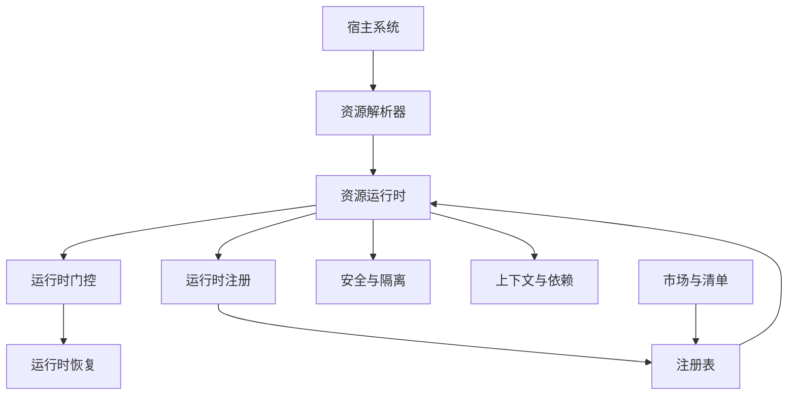

图表来源
- [asset_resolver.py](file://backend/app/plugins/asset_resolver.py)
- [asset_runtime.py](file://backend/app/plugins/asset_runtime.py)
- [runtime_gate.py](file://backend/app/plugins/runtime_gate.py)
- [runtime_recovery.py](file://backend/app/plugins/runtime_recovery.py)
- [runtime_registration.py](file://backend/app/plugins/runtime_registration.py)
- [security.py](file://backend/app/plugins/security.py)
- [package_security.py](file://backend/app/plugins/package_security.py)
- [context.py](file://backend/app/plugins/context.py)
- [dependencies.py](file://backend/app/plugins/dependencies.py)
- [marketplace.py](file://backend/app/plugins/marketplace.py)
- [registry.py](file://backend/app/plugins/registry.py)

## 详细组件分析

### 资源解析器（Asset Resolver）
职责
- 解析插件清单中的资源声明，识别静态资源与动态模块。
- 将资源映射到宿主可用的路径与加载策略，生成标准化的资源描述对象。
- 支持跨租户、跨作用域的资源可见性与暴露策略。

实现要点
- 清单驱动：基于清单元数据进行资源定位与类型判定。
- 暴露策略：结合暴露策略与作用域，决定资源是否公开与如何公开。
- 动态/静态分流：区分静态资源托管与动态模块加载，分别走不同的装载路径。

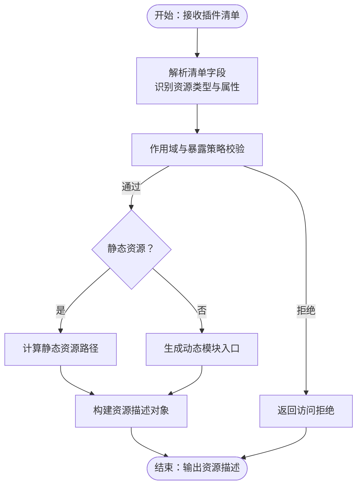

图表来源
- [asset_resolver.py](file://backend/app/plugins/asset_resolver.py)
- [exposure_policy.py](file://backend/app/plugins/exposure_policy.py)
- [scope.py](file://backend/app/plugins/scope.py)

章节来源
- [asset_resolver.py](file://backend/app/plugins/asset_resolver.py)
- [exposure_policy.py](file://backend/app/plugins/exposure_policy.py)
- [scope.py](file://backend/app/plugins/scope.py)

### 资源运行时（Asset Runtime）
职责
- 承载资源生命周期：初始化、激活、暂停、销毁。
- 注入上下文与依赖，协调事件总线与调度器。
- 管理资源与宿主之间的交互边界，确保隔离与安全。

关键流程
- 初始化：解析资源描述，准备上下文与依赖容器。
- 激活：建立事件通道、注册钩子、启动后台任务。
- 暂停/恢复：在门控允许下进入低功耗状态或恢复执行。
- 销毁：清理资源、释放锁与连接。

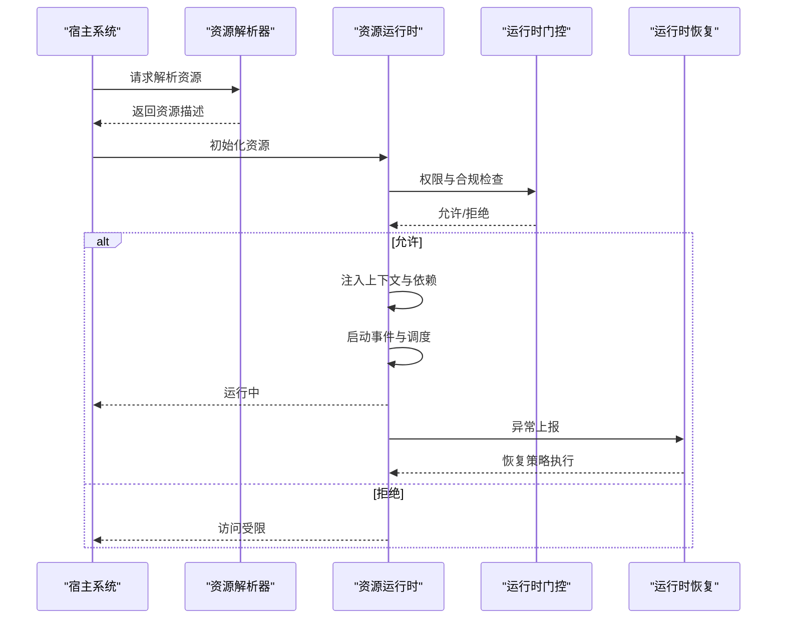

图表来源
- [asset_runtime.py](file://backend/app/plugins/asset_runtime.py)
- [runtime_gate.py](file://backend/app/plugins/runtime_gate.py)
- [runtime_recovery.py](file://backend/app/plugins/runtime_recovery.py)
- [context.py](file://backend/app/plugins/context.py)
- [dependencies.py](file://backend/app/plugins/dependencies.py)
- [event_bus.py](file://backend/app/plugins/event_bus.py)

章节来源
- [asset_runtime.py](file://backend/app/plugins/asset_runtime.py)
- [runtime_gate.py](file://backend/app/plugins/runtime_gate.py)
- [runtime_recovery.py](file://backend/app/plugins/runtime_recovery.py)
- [context.py](file://backend/app/plugins/context.py)
- [dependencies.py](file://backend/app/plugins/dependencies.py)
- [event_bus.py](file://backend/app/plugins/event_bus.py)

### 运行时门控（Runtime Gate）
职责
- 对资源访问进行实时门控，依据许可证、配额、租户策略与功能授权守卫进行判定。
- 提供细粒度的访问开关与速率限制，防止越权与滥用。

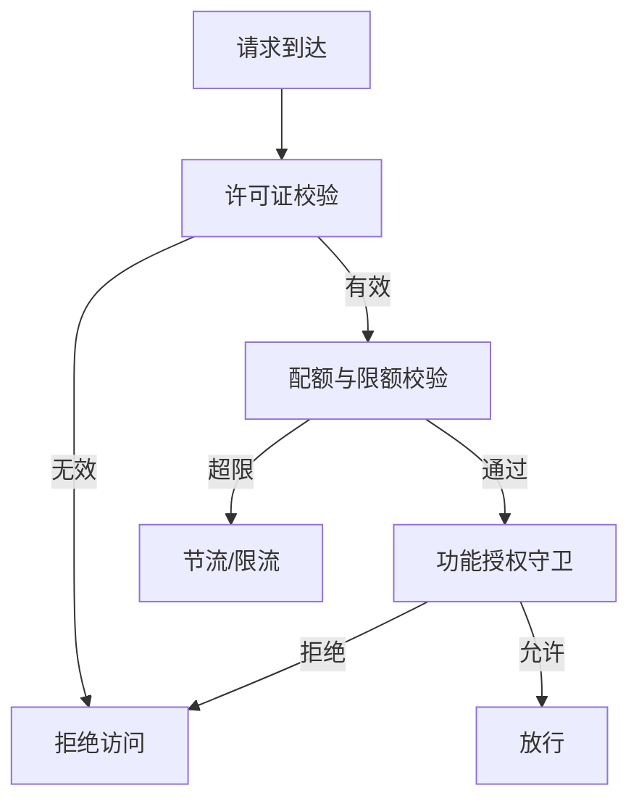

图表来源
- [runtime_gate.py](file://backend/app/plugins/runtime_gate.py)
- [license.py](file://backend/app/plugins/license.py)
- [feature_entitlement_guards.py](file://backend/app/plugins/feature_entitlement_guards.py)

章节来源
- [runtime_gate.py](file://backend/app/plugins/runtime_gate.py)
- [license.py](file://backend/app/plugins/license.py)
- [feature_entitlement_guards.py](file://backend/app/plugins/feature_entitlement_guards.py)

### 运行时恢复（Runtime Recovery）
职责
- 在异常或故障后进行状态恢复与自愈，包括重试、降级、回滚与重建。
- 提供健康检查与心跳机制，确保系统可观测性与可恢复性。

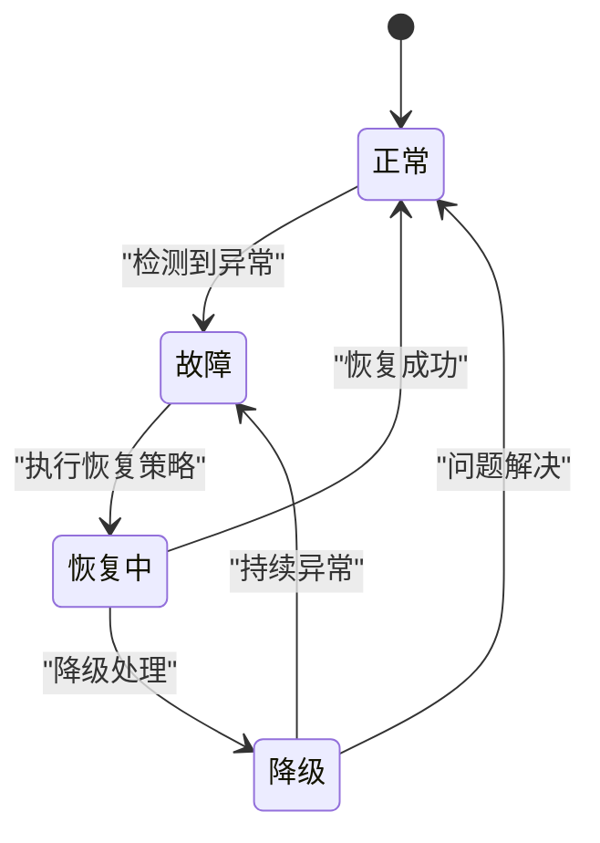

图表来源
- [runtime_recovery.py](file://backend/app/plugins/runtime_recovery.py)
- [health.py](file://backend/app/plugins/health.py)

章节来源
- [runtime_recovery.py](file://backend/app/plugins/runtime_recovery.py)
- [health.py](file://backend/app/plugins/health.py)

### 运行时注册（Runtime Registration）
职责
- 将插件资源注册到统一注册表，支持发现、查询与治理。
- 维护资源与租户、版本、许可证的关联关系。

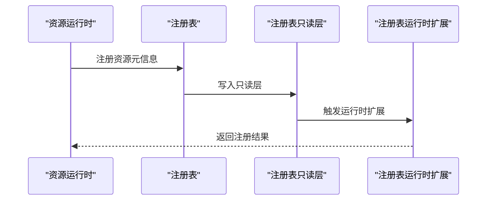

图表来源
- [runtime_registration.py](file://backend/app/plugins/runtime_registration.py)
- [registry.py](file://backend/app/plugins/registry.py)
- [registry_read_layer.py](file://backend/app/plugins/registry_read_layer.py)
- [registry_runtime_extensions.py](file://backend/app/plugins/registry_runtime_extensions.py)

章节来源
- [runtime_registration.py](file://backend/app/plugins/runtime_registration.py)
- [registry.py](file://backend/app/plugins/registry.py)
- [registry_read_layer.py](file://backend/app/plugins/registry_read_layer.py)
- [registry_runtime_extensions.py](file://backend/app/plugins/registry_runtime_extensions.py)

### 生命周期与状态（Lifecycle）
职责
- 管理插件资源的生命周期阶段：安装、激活、升级、卸载、迁移。
- 维护运行时状态，确保幂等与一致性。

图表来源
- [lifecycle_dependency_runtime.py](file://backend/app/plugins/lifecycle_dependency_runtime.py)
- [lifecycle_runtime_state.py](file://backend/app/plugins/lifecycle_runtime_state.py)
- [version_manager.py](file://backend/app/plugins/version_manager.py)
- [migration_paths.py](file://backend/app/plugins/migration_paths.py)

章节来源
- [lifecycle_dependency_runtime.py](file://backend/app/plugins/lifecycle_dependency_runtime.py)
- [lifecycle_runtime_state.py](file://backend/app/plugins/lifecycle_runtime_state.py)
- [version_manager.py](file://backend/app/plugins/version_manager.py)
- [migration_paths.py](file://backend/app/plugins/migration_paths.py)

### 安全与隔离（Security & Package Security）
职责
- 包安全扫描与策略执行，防止恶意或不合规包进入运行时。
- 加密与密钥管理，保护敏感配置与通信。
- 与宿主读取门面协作，限制插件对宿主资源的访问。

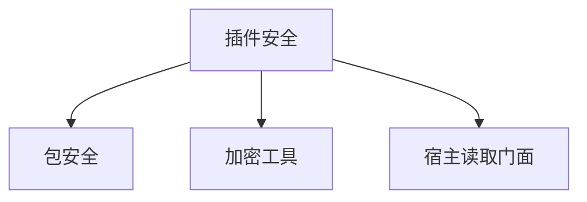

图表来源
- [security.py](file://backend/app/plugins/security.py)
- [package_security.py](file://backend/app/plugins/package_security.py)
- [crypto.py](file://backend/app/plugins/crypto.py)
- [host_read_facade.py](file://backend/app/plugins/host_read_facade.py)

章节来源
- [security.py](file://backend/app/plugins/security.py)
- [package_security.py](file://backend/app/plugins/package_security.py)
- [crypto.py](file://backend/app/plugins/crypto.py)
- [host_read_facade.py](file://backend/app/plugins/host_read_facade.py)

### 上下文与依赖（Context & Dependencies）
职责
- 提供运行时上下文与上下文工厂，按需创建与注入依赖。
- 通过依赖注入与事件总线，实现插件间的松耦合协作。

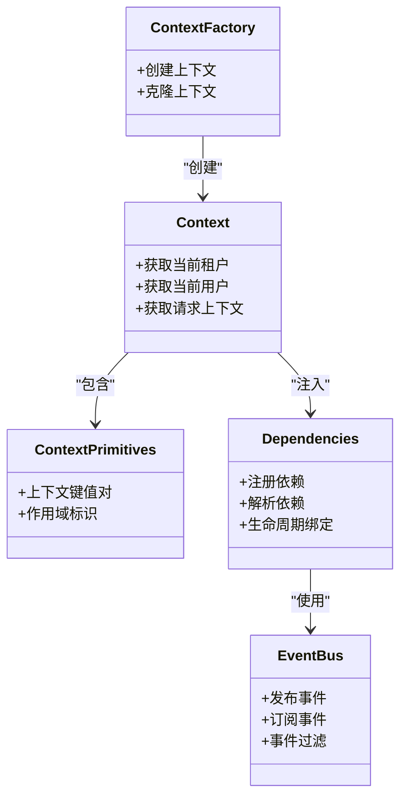

图表来源
- [context.py](file://backend/app/plugins/context.py)
- [context_factory.py](file://backend/app/plugins/context_factory.py)
- [context_primitives.py](file://backend/app/plugins/context_primitives.py)
- [dependencies.py](file://backend/app/plugins/dependencies.py)
- [event_bus.py](file://backend/app/plugins/event_bus.py)

章节来源
- [context.py](file://backend/app/plugins/context.py)
- [context_factory.py](file://backend/app/plugins/context_factory.py)
- [context_primitives.py](file://backend/app/plugins/context_primitives.py)
- [dependencies.py](file://backend/app/plugins/dependencies.py)
- [event_bus.py](file://backend/app/plugins/event_bus.py)

### 市场与清单（Marketplace & Manifest）
职责
- 维护插件市场与注册表，支持插件发现、安装与更新。
- 管理插件清单、版本与迁移路径，确保兼容性与可演进性。

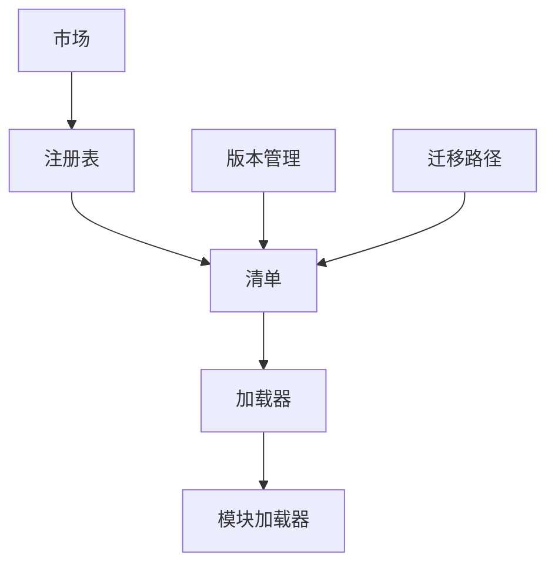

图表来源
- [marketplace.py](file://backend/app/plugins/marketplace.py)
- [registry.py](file://backend/app/plugins/registry.py)
- [manifest.py](file://backend/app/plugins/manifest.py)
- [loader.py](file://backend/app/plugins/loader.py)
- [module_loader.py](file://backend/app/plugins/module_loader.py)
- [version_manager.py](file://backend/app/plugins/version_manager.py)
- [migration_paths.py](file://backend/app/plugins/migration_paths.py)

章节来源
- [marketplace.py](file://backend/app/plugins/marketplace.py)
- [registry.py](file://backend/app/plugins/registry.py)
- [manifest.py](file://backend/app/plugins/manifest.py)
- [loader.py](file://backend/app/plugins/loader.py)
- [module_loader.py](file://backend/app/plugins/module_loader.py)
- [version_manager.py](file://backend/app/plugins/version_manager.py)
- [migration_paths.py](file://backend/app/plugins/migration_paths.py)

## 依赖关系分析
运行时各模块之间存在清晰的职责边界与依赖链路。以下图示展示主要依赖关系：

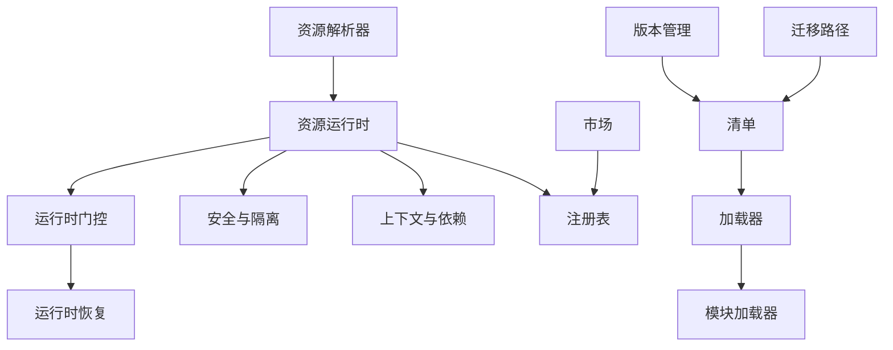

图表来源
- [asset_resolver.py](file://backend/app/plugins/asset_resolver.py)
- [asset_runtime.py](file://backend/app/plugins/asset_runtime.py)
- [runtime_gate.py](file://backend/app/plugins/runtime_gate.py)
- [runtime_recovery.py](file://backend/app/plugins/runtime_recovery.py)
- [security.py](file://backend/app/plugins/security.py)
- [context.py](file://backend/app/plugins/context.py)
- [dependencies.py](file://backend/app/plugins/dependencies.py)
- [registry.py](file://backend/app/plugins/registry.py)
- [marketplace.py](file://backend/app/plugins/marketplace.py)
- [manifest.py](file://backend/app/plugins/manifest.py)
- [loader.py](file://backend/app/plugins/loader.py)
- [module_loader.py](file://backend/app/plugins/module_loader.py)
- [version_manager.py](file://backend/app/plugins/version_manager.py)
- [migration_paths.py](file://backend/app/plugins/migration_paths.py)

章节来源
- [asset_resolver.py](file://backend/app/plugins/asset_resolver.py)
- [asset_runtime.py](file://backend/app/plugins/asset_runtime.py)
- [runtime_gate.py](file://backend/app/plugins/runtime_gate.py)
- [runtime_recovery.py](file://backend/app/plugins/runtime_recovery.py)
- [security.py](file://backend/app/plugins/security.py)
- [context.py](file://backend/app/plugins/context.py)
- [dependencies.py](file://backend/app/plugins/dependencies.py)
- [registry.py](file://backend/app/plugins/registry.py)
- [marketplace.py](file://backend/app/plugins/marketplace.py)
- [manifest.py](file://backend/app/plugins/manifest.py)
- [loader.py](file://backend/app/plugins/loader.py)
- [module_loader.py](file://backend/app/plugins/module_loader.py)
- [version_manager.py](file://backend/app/plugins/version_manager.py)
- [migration_paths.py](file://backend/app/plugins/migration_paths.py)

## 性能考虑
- 预加载与缓存：对常用静态资源与动态模块进行预热与缓存，减少首次访问延迟。
- 事件驱动与异步：通过事件总线与异步任务降低阻塞，提升并发吞吐。
- 门控与限流：在高负载场景下启用门控与限流，避免雪崩效应。
- 版本与迁移：采用渐进式升级与回滚策略，降低变更对性能的影响。
- 监控与指标：结合健康检查与指标采集，持续优化资源占用与响应时间。

## 故障排查指南
常见问题与处理建议
- 访问被拒：检查许可证、配额与功能授权守卫，确认租户策略与暴露策略。
- 资源不可见：核对作用域与暴露策略，确认注册表条目与运行时扩展。
- 运行异常：查看恢复日志与健康检查结果，确认恢复策略是否生效。
- 安全告警：审查包安全扫描报告与加密配置，确保密钥轮换与访问审计。

章节来源
- [runtime_gate.py](file://backend/app/plugins/runtime_gate.py)
- [runtime_recovery.py](file://backend/app/plugins/runtime_recovery.py)
- [package_security.py](file://backend/app/plugins/package_security.py)
- [health.py](file://backend/app/plugins/health.py)

## 结论
插件资源运行时通过“解析—运行—门控—恢复—注册—安全—上下文—市场—清单”的完整闭环，实现了对插件资源的全生命周期管理与安全可控的运行。其模块化设计与清晰的依赖关系，既保证了可扩展性，也为性能优化与故障恢复提供了坚实基础。

## 附录
- 市场注册表示例：[marketplace_registry/registry.json](file://backend/app/plugins/marketplace_registry/registry.json)
- 启动流程参考：[startup.py](file://backend/app/plugins/startup.py)
- 调度刷新参考：[scheduler_refresh.py](file://backend/app/plugins/scheduler_refresh.py)
- 前端契约与校验：[frontend_contract.py](file://backend/app/plugins/frontend_contract.py)、[frontend_contract_checks.py](file://backend/app/plugins/frontend_contract_checks.py)
- Webhook 分发：[webhook_dispatcher.py](file://backend/app/plugins/webhook_dispatcher.py)
- 系统钩子：[system_hooks.py](file://backend/app/plugins/system_hooks.py)
- 租户计划预检：[tenant_plan_preflight.py](file://backend/app/plugins/tenant_plan_preflight.py)
- 更新检查：[update_checker.py](file://backend/app/plugins/update_checker.py)
- 预览与进度：[preview.py](file://backend/app/plugins/preview.py)、[progress.py](file://backend/app/plugins/progress.py)
- 备份：[backup.py](file://backend/app/plugins/backup.py)
- 即时通讯认证：[sio_auth.py](file://backend/app/plugins/sio_auth.py)
- 服务器推送事件：[sse.py](file://backend/app/plugins/sse.py)
- API 分发器：[api_dispatcher.py](file://backend/app/plugins/api_dispatcher.py)
- 插件基类：[base.py](file://backend/app/plugins/base.py)
- 扩展注册器：[_extension_registrar.py](file://backend/app/plugins/_extension_registrar.py)