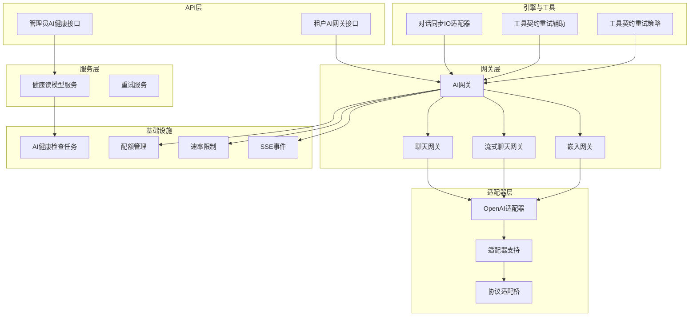
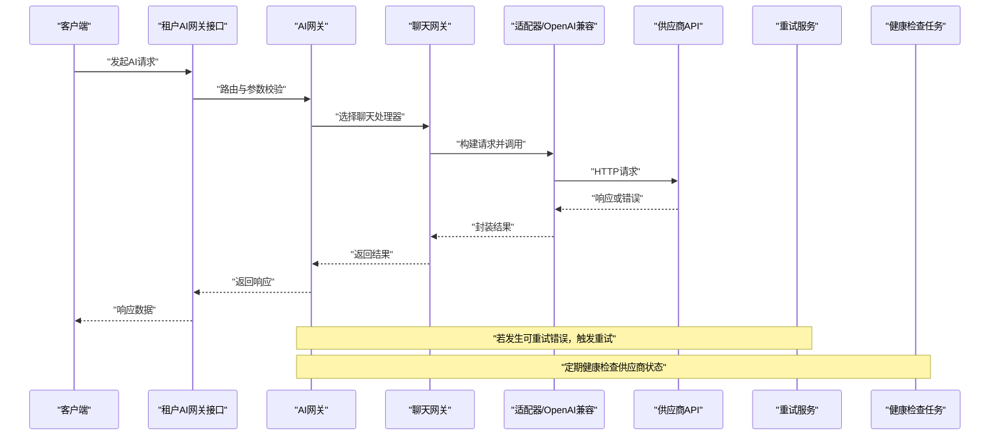
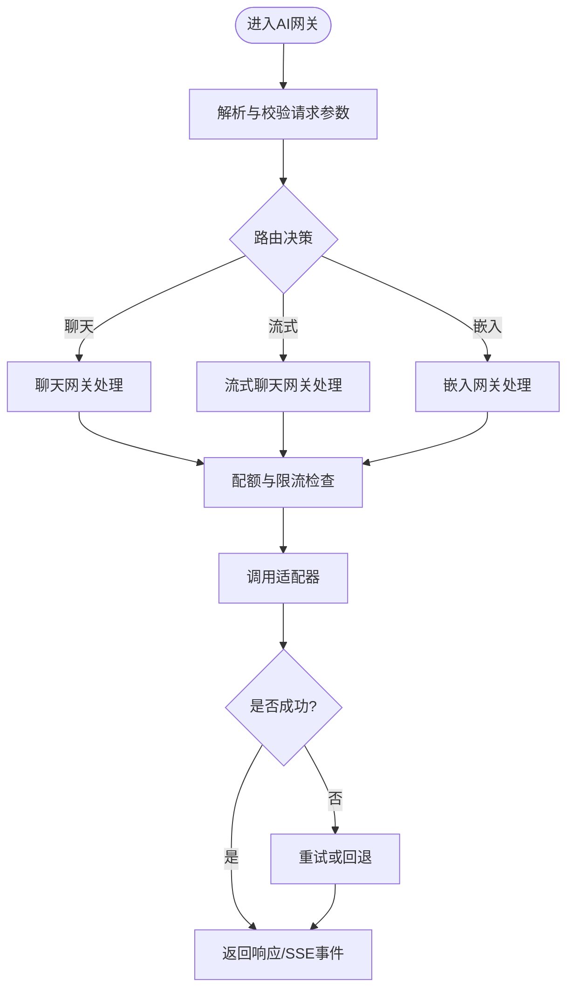
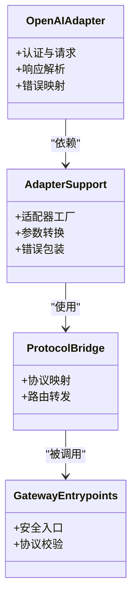
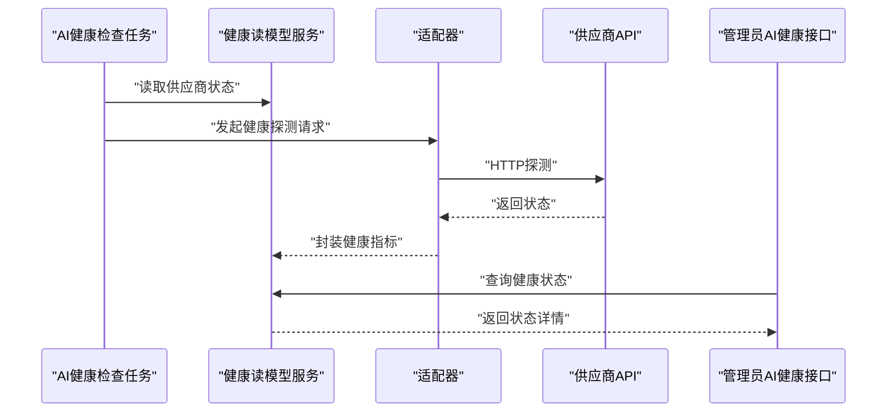
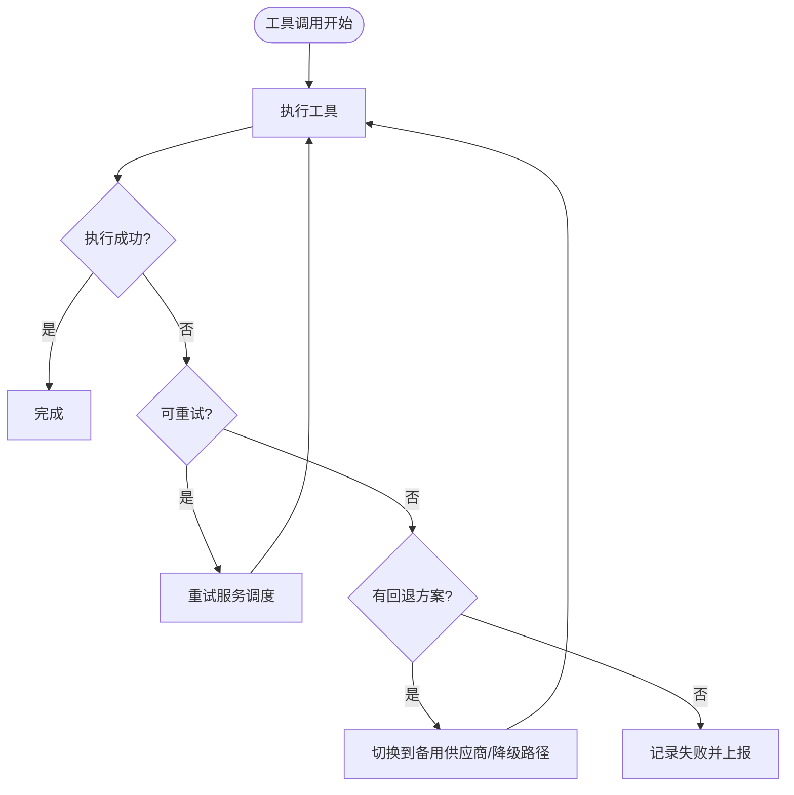
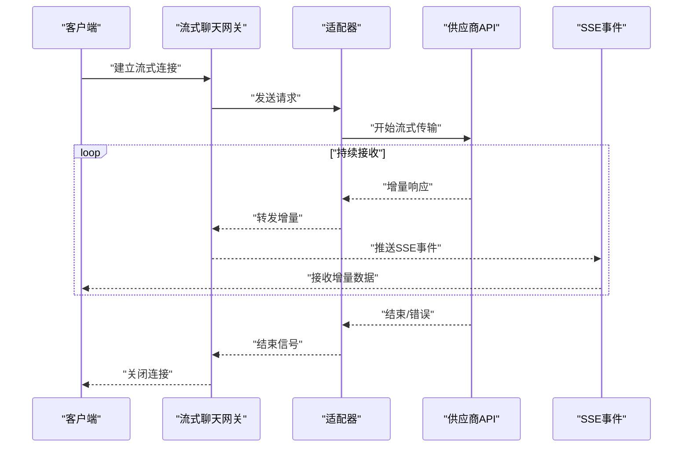
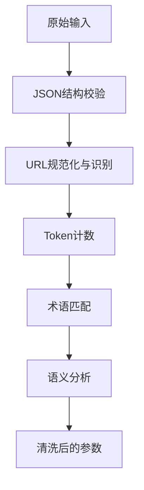
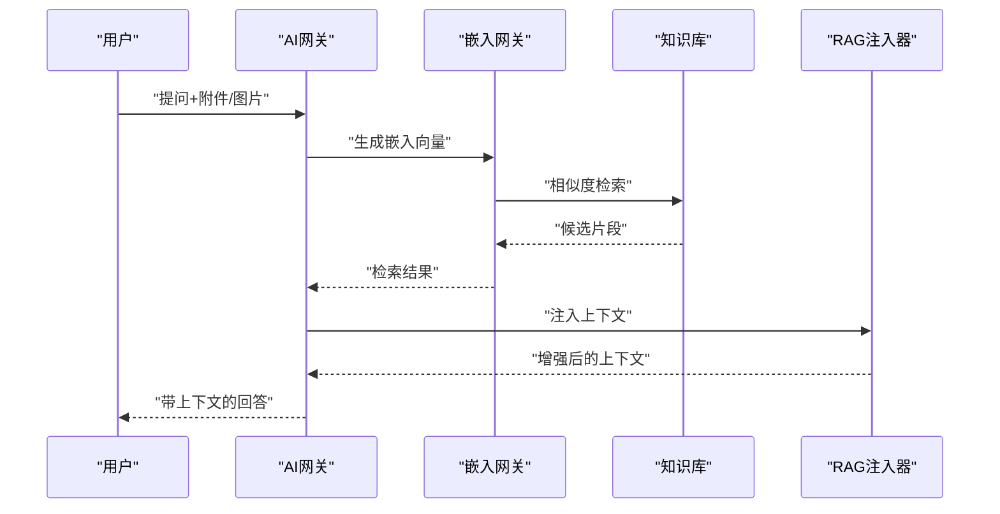
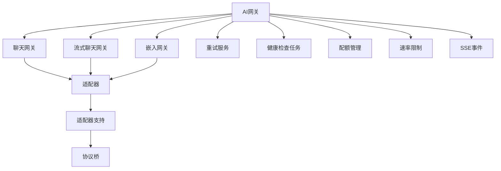

# AI集成故障排除

<cite>
**本文档引用的文件**
- [gateway.py](file://backend/app/ai/gateway.py)
- [chat_gateway.py](file://backend/app/ai/gateway_support/chat_gateway.py)
- [stream_chat_gateway.py](file://backend/app/ai/gateway_support/stream_chat_gateway.py)
- [embedding_gateway.py](file://backend/app/ai/gateway_support/embedding_gateway.py)
- [retry_service.py](file://backend/app/ai/retry_service.py)
- [retry_orchestrator.py](file://backend/app/ai/gateway_support/retry_orchestrator.py)
- [tool_contract_retry_helpers.py](file://backend/app/ai/engine/tool_contract_retry_helpers.py)
- [tool_contract_retry_policies.py](file://backend/app/ai/engine/tool_contract_retry_policies.py)
- [ai_health_check.py](file://backend/app/tasks/ai_health_check.py)
- [health_read_model_service.py](file://backend/app/services/ai/health_read_model_service.py)
- [ai_health.py](file://backend/app/api/admin/ai_health.py)
- [ai_gateway.py](file://backend/app/api/tenant/ai_gateway.py)
- [openai_adapter.py](file://backend/app/ai/adapters/openai_adapter.py)
- [adapter_support.py](file://backend/app/ai/gateway_support/adapter_support.py)
- [protocol_adapter_bridge.py](file://backend/app/ai/gateway_support/protocol_adapter_bridge.py)
- [gateway_entrypoints.py](file://backend/app/ai/adapters/openai_compatible/support/gateway_entrypoints.py)
- [rag_injector.py](file://backend/app/ai/rag_injector.py)
- [ai.py](file://backend/app/enums/ai.py)
- [exceptions.py](file://backend/app/ai/exceptions.py)
- [quota_manager.py](file://backend/app/ai/quota_manager.py)
- [agent_quota_manager.py](file://backend/app/ai/agent_quota_manager.py)
- [failover.py](file://backend/app/ai/failover.py)
- [rate_limiter.py](file://backend/app/ai/rate_limiter.py)
- [text_semantics.py](file://backend/app/ai/text_semantics.py)
- [text_semantics_json.py](file://backend/app/ai/text_semantics_json.py)
- [text_semantics_tokens.py](file://backend/app/ai/text_semantics_tokens.py)
- [text_semantics_urls.py](file://backend/app/ai/text_semantics_urls.py)
- [text_semantics_terms.py](file://backend/app/ai/text_semantics_terms.py)
- [sse.py](file://backend/app/ai/sse.py)
- [internal_ai_service.py](file://backend/app/ai/internal_ai_service.py)
- [conversation_sync_io_adapter.py](file://backend/app/ai/engine/conversation_sync_io_adapter.py)
</cite>

## 目录
1. [简介](#简介)
2. [项目结构](#项目结构)
3. [核心组件](#核心组件)
4. [架构总览](#架构总览)
5. [详细组件分析](#详细组件分析)
6. [依赖关系分析](#依赖关系分析)
7. [性能考虑](#性能考虑)
8. [故障排除指南](#故障排除指南)
9. [结论](#结论)
10. [附录](#附录)

## 简介
本技术文档面向AI集成场景中的故障排除与运维保障，聚焦以下关键问题：
- AI调用失败：参数校验、模型选择、响应解析与流式传输异常
- 适配器连接问题：供应商API密钥、网络连通性与配额限制
- 工具执行异常：工具契约、重试策略与失败回退
- 健康检查：供应商连接状态、密钥有效性与配额监控
- 流式响应：网络中断、超时配置与重试机制
- RAG检索：检索链路、嵌入向量与知识库访问异常

通过系统化的组件分析与可视化图示，帮助工程师快速定位问题根因并实施修复。

## 项目结构
后端AI子系统采用分层架构，围绕“网关(Gateway)”统一接入不同适配器(Adapters)，并通过健康检查、重试与限流等横切能力保障稳定性。关键目录与职责如下：
- adapters：适配器实现与协议桥接
- gateway_support：网关支持模块（聊天、流式聊天、嵌入、测试等）
- engine：引擎与工具执行相关逻辑
- services：服务层（如健康读模型）
- tasks：定时任务（如AI健康检查）
- api：对外接口（管理员与租户）
- enums：枚举定义（如AI模型、错误码）
- 其他支撑模块：配额、限流、文本语义分析、SSE等

图表来源
- [gateway.py](file://backend/app/ai/gateway.py)
- [chat_gateway.py](file://backend/app/ai/gateway_support/chat_gateway.py)
- [stream_chat_gateway.py](file://backend/app/ai/gateway_support/stream_chat_gateway.py)
- [embedding_gateway.py](file://backend/app/ai/gateway_support/embedding_gateway.py)
- [openai_adapter.py](file://backend/app/ai/adapters/openai_adapter.py)
- [adapter_support.py](file://backend/app/ai/gateway_support/adapter_support.py)
- [protocol_adapter_bridge.py](file://backend/app/ai/gateway_support/protocol_adapter_bridge.py)
- [retry_service.py](file://backend/app/ai/retry_service.py)
- [health_read_model_service.py](file://backend/app/services/ai/health_read_model_service.py)
- [ai_health_check.py](file://backend/app/tasks/ai_health_check.py)
- [quota_manager.py](file://backend/app/ai/quota_manager.py)
- [rate_limiter.py](file://backend/app/ai/rate_limiter.py)
- [sse.py](file://backend/app/ai/sse.py)

章节来源
- [gateway.py](file://backend/app/ai/gateway.py)
- [chat_gateway.py](file://backend/app/ai/gateway_support/chat_gateway.py)
- [stream_chat_gateway.py](file://backend/app/ai/gateway_support/stream_chat_gateway.py)
- [embedding_gateway.py](file://backend/app/ai/gateway_support/embedding_gateway.py)
- [openai_adapter.py](file://backend/app/ai/adapters/openai_adapter.py)
- [adapter_support.py](file://backend/app/ai/gateway_support/adapter_support.py)
- [protocol_adapter_bridge.py](file://backend/app/ai/gateway_support/protocol_adapter_bridge.py)
- [retry_service.py](file://backend/app/ai/retry_service.py)
- [health_read_model_service.py](file://backend/app/services/ai/health_read_model_service.py)
- [ai_health_check.py](file://backend/app/tasks/ai_health_check.py)
- [quota_manager.py](file://backend/app/ai/quota_manager.py)
- [rate_limiter.py](file://backend/app/ai/rate_limiter.py)
- [sse.py](file://backend/app/ai/sse.py)

## 核心组件
- AI网关：统一入口，路由到聊天、流式聊天、嵌入等子网关；负责参数预处理、配额与限流控制、SSE事件推送。
- 适配器与桥接：将平台协议抽象为统一接口，屏蔽供应商差异；支持OpenAI兼容适配器。
- 健康检查：定时任务与服务读模型组合，验证供应商连接、密钥有效性与配额状态。
- 重试与回退：工具契约重试策略与通用重试服务，结合失败回退策略提升可用性。
- 文本语义分析：对输入进行JSON、URL、Token、术语等多维语义分析，辅助参数校验与日志记录。
- 引擎与工具：对话同步IO适配器与工具契约重试辅助/策略，保障工具执行的稳定性。

章节来源
- [gateway.py](file://backend/app/ai/gateway.py)
- [openai_adapter.py](file://backend/app/ai/adapters/openai_adapter.py)
- [adapter_support.py](file://backend/app/ai/gateway_support/adapter_support.py)
- [protocol_adapter_bridge.py](file://backend/app/ai/gateway_support/protocol_adapter_bridge.py)
- [health_read_model_service.py](file://backend/app/services/ai/health_read_model_service.py)
- [ai_health_check.py](file://backend/app/tasks/ai_health_check.py)
- [tool_contract_retry_helpers.py](file://backend/app/ai/engine/tool_contract_retry_helpers.py)
- [tool_contract_retry_policies.py](file://backend/app/ai/engine/tool_contract_retry_policies.py)
- [conversation_sync_io_adapter.py](file://backend/app/ai/engine/conversation_sync_io_adapter.py)
- [text_semantics.py](file://backend/app/ai/text_semantics.py)
- [text_semantics_json.py](file://backend/app/ai/text_semantics_json.py)
- [text_semantics_tokens.py](file://backend/app/ai/text_semantics_tokens.py)
- [text_semantics_urls.py](file://backend/app/ai/text_semantics_urls.py)
- [text_semantics_terms.py](file://backend/app/ai/text_semantics_terms.py)

## 架构总览
下图展示从API到网关、适配器与供应商的完整调用链，以及健康检查与重试的关键节点。

图表来源
- [ai_gateway.py](file://backend/app/api/tenant/ai_gateway.py)
- [gateway.py](file://backend/app/ai/gateway.py)
- [chat_gateway.py](file://backend/app/ai/gateway_support/chat_gateway.py)
- [openai_adapter.py](file://backend/app/ai/adapters/openai_adapter.py)
- [retry_service.py](file://backend/app/ai/retry_service.py)
- [ai_health_check.py](file://backend/app/tasks/ai_health_check.py)

## 详细组件分析

### AI网关与聊天网关
- 职责：接收请求、参数预处理、路由到具体网关（聊天/流式/嵌入）、配额与限流控制、SSE事件推送。
- 关键流程：参数校验、模型选择、供应商路由、错误捕获与回退。
- 失败点：参数缺失/格式错误、模型不可用、供应商无响应、配额不足。

图表来源
- [gateway.py](file://backend/app/ai/gateway.py)
- [chat_gateway.py](file://backend/app/ai/gateway_support/chat_gateway.py)
- [stream_chat_gateway.py](file://backend/app/ai/gateway_support/stream_chat_gateway.py)
- [embedding_gateway.py](file://backend/app/ai/gateway_support/embedding_gateway.py)
- [quota_manager.py](file://backend/app/ai/quota_manager.py)
- [rate_limiter.py](file://backend/app/ai/rate_limiter.py)

章节来源
- [gateway.py](file://backend/app/ai/gateway.py)
- [chat_gateway.py](file://backend/app/ai/gateway_support/chat_gateway.py)
- [stream_chat_gateway.py](file://backend/app/ai/gateway_support/stream_chat_gateway.py)
- [embedding_gateway.py](file://backend/app/ai/gateway_support/embedding_gateway.py)
- [quota_manager.py](file://backend/app/ai/quota_manager.py)
- [rate_limiter.py](file://backend/app/ai/rate_limiter.py)

### 适配器与协议桥接
- OpenAI兼容适配器：封装供应商API调用，处理认证、请求构造与响应解析。
- 协议适配桥：将平台内部协议映射到适配器接口，确保扩展性与一致性。
- 网关入口：提供安全的协议入口点，避免直接暴露底层实现细节。

图表来源
- [openai_adapter.py](file://backend/app/ai/adapters/openai_adapter.py)
- [adapter_support.py](file://backend/app/ai/gateway_support/adapter_support.py)
- [protocol_adapter_bridge.py](file://backend/app/ai/gateway_support/protocol_adapter_bridge.py)
- [gateway_entrypoints.py](file://backend/app/ai/adapters/openai_compatible/support/gateway_entrypoints.py)

章节来源
- [openai_adapter.py](file://backend/app/ai/adapters/openai_adapter.py)
- [adapter_support.py](file://backend/app/ai/gateway_support/adapter_support.py)
- [protocol_adapter_bridge.py](file://backend/app/ai/gateway_support/protocol_adapter_bridge.py)
- [gateway_entrypoints.py](file://backend/app/ai/adapters/openai_compatible/support/gateway_entrypoints.py)

### 健康检查与供应商状态
- 定时任务：周期性探测供应商连接、密钥有效性与配额状态。
- 服务读模型：聚合健康状态，供API查询与仪表盘展示。
- 管理员接口：提供健康检查触发与状态查询。

图表来源
- [ai_health_check.py](file://backend/app/tasks/ai_health_check.py)
- [health_read_model_service.py](file://backend/app/services/ai/health_read_model_service.py)
- [ai_health.py](file://backend/app/api/admin/ai_health.py)
- [openai_adapter.py](file://backend/app/ai/adapters/openai_adapter.py)

章节来源
- [ai_health_check.py](file://backend/app/tasks/ai_health_check.py)
- [health_read_model_service.py](file://backend/app/services/ai/health_read_model_service.py)
- [ai_health.py](file://backend/app/api/admin/ai_health.py)
- [openai_adapter.py](file://backend/app/ai/adapters/openai_adapter.py)

### 重试与失败回退
- 工具契约重试：针对工具执行失败的策略化重试与幂等处理。
- 通用重试服务：统一的重试调度与指数退避策略。
- 回退策略：在主供应商不可用时切换到备用供应商或降级路径。

图表来源
- [tool_contract_retry_helpers.py](file://backend/app/ai/engine/tool_contract_retry_helpers.py)
- [tool_contract_retry_policies.py](file://backend/app/ai/engine/tool_contract_retry_policies.py)
- [retry_service.py](file://backend/app/ai/retry_service.py)
- [failover.py](file://backend/app/ai/failover.py)

章节来源
- [tool_contract_retry_helpers.py](file://backend/app/ai/engine/tool_contract_retry_helpers.py)
- [tool_contract_retry_policies.py](file://backend/app/ai/engine/tool_contract_retry_policies.py)
- [retry_service.py](file://backend/app/ai/retry_service.py)
- [failover.py](file://backend/app/ai/failover.py)

### 流式响应与SSE
- 流式聊天网关：支持持续输出，结合SSE向客户端推送增量数据。
- 超时与中断：在网络中断或超时情况下，需正确关闭连接并记录日志。
- 重试机制：在可恢复错误时自动重试，避免用户感知到抖动。

图表来源
- [stream_chat_gateway.py](file://backend/app/ai/gateway_support/stream_chat_gateway.py)
- [openai_adapter.py](file://backend/app/ai/adapters/openai_adapter.py)
- [sse.py](file://backend/app/ai/sse.py)

章节来源
- [stream_chat_gateway.py](file://backend/app/ai/gateway_support/stream_chat_gateway.py)
- [openai_adapter.py](file://backend/app/ai/adapters/openai_adapter.py)
- [sse.py](file://backend/app/ai/sse.py)

### 文本语义分析与参数校验
- JSON语义：校验输入JSON结构与字段完整性。
- Token与URL：识别与规范化URL，统计Token数量以辅助配额与成本估算。
- 术语与语义：术语匹配与上下文语义分析，辅助提示工程与参数优化。

图表来源
- [text_semantics.py](file://backend/app/ai/text_semantics.py)
- [text_semantics_json.py](file://backend/app/ai/text_semantics_json.py)
- [text_semantics_tokens.py](file://backend/app/ai/text_semantics_tokens.py)
- [text_semantics_urls.py](file://backend/app/ai/text_semantics_urls.py)
- [text_semantics_terms.py](file://backend/app/ai/text_semantics_terms.py)

章节来源
- [text_semantics.py](file://backend/app/ai/text_semantics.py)
- [text_semantics_json.py](file://backend/app/ai/text_semantics_json.py)
- [text_semantics_tokens.py](file://backend/app/ai/text_semantics_tokens.py)
- [text_semantics_urls.py](file://backend/app/ai/text_semantics_urls.py)
- [text_semantics_terms.py](file://backend/app/ai/text_semantics_terms.py)

### RAG检索与嵌入
- 检索注入：将检索结果注入到对话上下文中，增强回答质量。
- 嵌入网关：负责向量化与相似度检索，支持多模态输入。
- 知识库访问：权限与可见性控制，确保仅访问授权范围内的知识库。

图表来源
- [embedding_gateway.py](file://backend/app/ai/gateway_support/embedding_gateway.py)
- [rag_injector.py](file://backend/app/ai/rag_injector.py)

章节来源
- [embedding_gateway.py](file://backend/app/ai/gateway_support/embedding_gateway.py)
- [rag_injector.py](file://backend/app/ai/rag_injector.py)

## 依赖关系分析
- 组件耦合：网关层对适配器层存在强依赖；适配器依赖协议桥接；健康检查独立于业务调用但影响SLA。
- 外部依赖：供应商API、数据库、Redis缓存（用于配额与限流）。
- 横切关注：重试、回退、SSE、文本语义分析贯穿多个组件。

图表来源
- [gateway.py](file://backend/app/ai/gateway.py)
- [chat_gateway.py](file://backend/app/ai/gateway_support/chat_gateway.py)
- [stream_chat_gateway.py](file://backend/app/ai/gateway_support/stream_chat_gateway.py)
- [embedding_gateway.py](file://backend/app/ai/gateway_support/embedding_gateway.py)
- [openai_adapter.py](file://backend/app/ai/adapters/openai_adapter.py)
- [adapter_support.py](file://backend/app/ai/gateway_support/adapter_support.py)
- [protocol_adapter_bridge.py](file://backend/app/ai/gateway_support/protocol_adapter_bridge.py)
- [retry_service.py](file://backend/app/ai/retry_service.py)
- [ai_health_check.py](file://backend/app/tasks/ai_health_check.py)
- [quota_manager.py](file://backend/app/ai/quota_manager.py)
- [rate_limiter.py](file://backend/app/ai/rate_limiter.py)
- [sse.py](file://backend/app/ai/sse.py)

章节来源
- [gateway.py](file://backend/app/ai/gateway.py)
- [openai_adapter.py](file://backend/app/ai/adapters/openai_adapter.py)
- [adapter_support.py](file://backend/app/ai/gateway_support/adapter_support.py)
- [protocol_adapter_bridge.py](file://backend/app/ai/gateway_support/protocol_adapter_bridge.py)
- [retry_service.py](file://backend/app/ai/retry_service.py)
- [ai_health_check.py](file://backend/app/tasks/ai_health_check.py)
- [quota_manager.py](file://backend/app/ai/quota_manager.py)
- [rate_limiter.py](file://backend/app/ai/rate_limiter.py)
- [sse.py](file://backend/app/ai/sse.py)

## 性能考虑
- 配额与限流：在网关层统一控制，避免供应商侧过载与成本异常。
- 流式传输：合理设置缓冲与推送频率，减少延迟与内存占用。
- 重试退避：指数退避与抖动，避免雪崩效应。
- 文本语义分析：对大文本进行分片处理，避免单次分析耗时过长。
- 健康检查：异步化与去抖动，避免频繁探测造成供应商压力。

## 故障排除指南

### AI调用失败排查
- 参数格式不正确
  - 步骤：启用JSON与URL语义分析，检查必填字段与类型；查看文本语义日志。
  - 参考：[text_semantics_json.py](file://backend/app/ai/text_semantics_json.py)、[text_semantics_urls.py](file://backend/app/ai/text_semantics_urls.py)
- 模型选择错误
  - 步骤：确认模型能力与功能匹配；检查模型可用性与路由规则。
  - 参考：[gateway.py](file://backend/app/ai/gateway.py)、[ai.py](file://backend/app/enums/ai.py)
- 响应解析失败
  - 步骤：检查适配器响应解析逻辑与错误映射；查看供应商返回结构。
  - 参考：[openai_adapter.py](file://backend/app/ai/adapters/openai_adapter.py)

章节来源
- [text_semantics_json.py](file://backend/app/ai/text_semantics_json.py)
- [text_semantics_urls.py](file://backend/app/ai/text_semantics_urls.py)
- [gateway.py](file://backend/app/ai/gateway.py)
- [ai.py](file://backend/app/enums/ai.py)
- [openai_adapter.py](file://backend/app/ai/adapters/openai_adapter.py)

### 适配器连接问题排查
- 供应商连接状态验证
  - 步骤：运行健康检查任务，查看供应商连通性与可用性。
  - 参考：[ai_health_check.py](file://backend/app/tasks/ai_health_check.py)、[health_read_model_service.py](file://backend/app/services/ai/health_read_model_service.py)
- API密钥有效性检查
  - 步骤：通过适配器认证流程验证密钥；查看认证错误码与日志。
  - 参考：[openai_adapter.py](file://backend/app/ai/adapters/openai_adapter.py)
- 配额限制监控
  - 步骤：检查配额管理器与代理配额管理器状态；核对剩余额度与使用趋势。
  - 参考：[quota_manager.py](file://backend/app/ai/quota_manager.py)、[agent_quota_manager.py](file://backend/app/ai/agent_quota_manager.py)

章节来源
- [ai_health_check.py](file://backend/app/tasks/ai_health_check.py)
- [health_read_model_service.py](file://backend/app/services/ai/health_read_model_service.py)
- [openai_adapter.py](file://backend/app/ai/adapters/openai_adapter.py)
- [quota_manager.py](file://backend/app/ai/quota_manager.py)
- [agent_quota_manager.py](file://backend/app/ai/agent_quota_manager.py)

### 工具执行异常排查
- 工具契约重试
  - 步骤：启用工具契约重试辅助与策略，观察重试次数与退避行为。
  - 参考：[tool_contract_retry_helpers.py](file://backend/app/ai/engine/tool_contract_retry_helpers.py)、[tool_contract_retry_policies.py](file://backend/app/ai/engine/tool_contract_retry_policies.py)
- 失败回退
  - 步骤：配置回退策略，切换到备用供应商或降级路径。
  - 参考：[failover.py](file://backend/app/ai/failover.py)

章节来源
- [tool_contract_retry_helpers.py](file://backend/app/ai/engine/tool_contract_retry_helpers.py)
- [tool_contract_retry_policies.py](file://backend/app/ai/engine/tool_contract_retry_policies.py)
- [failover.py](file://backend/app/ai/failover.py)

### 流式响应问题诊断
- 网络中断处理
  - 步骤：在流式聊天网关中捕获连接中断，清理资源并记录事件。
  - 参考：[stream_chat_gateway.py](file://backend/app/ai/gateway_support/stream_chat_gateway.py)
- 超时配置
  - 步骤：调整适配器与SSE的超时阈值，避免误判。
  - 参考：[openai_adapter.py](file://backend/app/ai/adapters/openai_adapter.py)、[sse.py](file://backend/app/ai/sse.py)
- 重试机制
  - 步骤：在可恢复错误时自动重试，避免用户感知到抖动。
  - 参考：[retry_service.py](file://backend/app/ai/retry_service.py)

章节来源
- [stream_chat_gateway.py](file://backend/app/ai/gateway_support/stream_chat_gateway.py)
- [openai_adapter.py](file://backend/app/ai/adapters/openai_adapter.py)
- [sse.py](file://backend/app/ai/sse.py)
- [retry_service.py](file://backend/app/ai/retry_service.py)

### RAG检索问题排查
- 检索链路异常
  - 步骤：检查嵌入网关与检索注入器，确认向量生成与上下文注入流程。
  - 参考：[embedding_gateway.py](file://backend/app/ai/gateway_support/embedding_gateway.py)、[rag_injector.py](file://backend/app/ai/rag_injector.py)
- 嵌入向量计算异常
  - 步骤：验证输入文本预处理与向量维度；检查知识库可用性。
  - 参考：[embedding_gateway.py](file://backend/app/ai/gateway_support/embedding_gateway.py)
- 知识库访问失败
  - 步骤：核对权限与可见性配置，确保仅访问授权范围内的知识库。
  - 参考：[rag_injector.py](file://backend/app/ai/rag_injector.py)

章节来源
- [embedding_gateway.py](file://backend/app/ai/gateway_support/embedding_gateway.py)
- [rag_injector.py](file://backend/app/ai/rag_injector.py)

## 结论
通过将AI网关、适配器、健康检查、重试与回退、流式传输与SSE、文本语义分析以及RAG检索等组件协同治理，可以系统性地降低AI集成的故障率并提升稳定性。建议在生产环境中：
- 启用自动化健康检查与告警
- 配置合理的重试与回退策略
- 使用流式传输与SSE优化用户体验
- 加强参数校验与文本语义分析
- 对RAG检索进行端到端链路验证

## 附录
- 错误码与异常：参考AI异常定义与枚举，便于快速定位问题类别。
- 内部服务：内部AI服务用于系统内调用，确保一致的参数与错误处理。

章节来源
- [exceptions.py](file://backend/app/ai/exceptions.py)
- [ai.py](file://backend/app/enums/ai.py)
- [internal_ai_service.py](file://backend/app/ai/internal_ai_service.py)