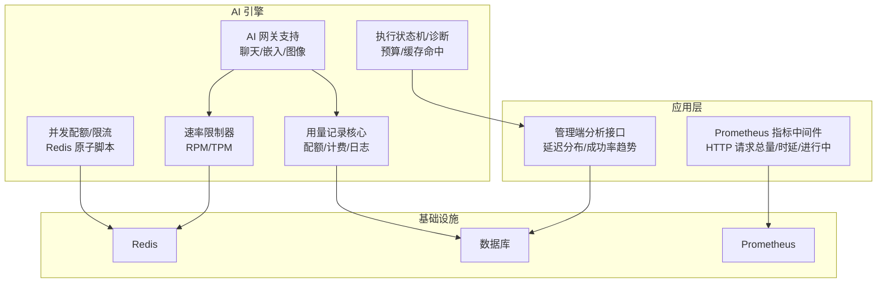
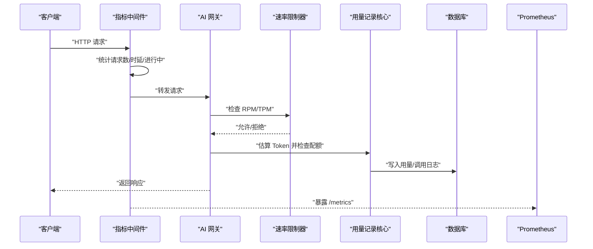
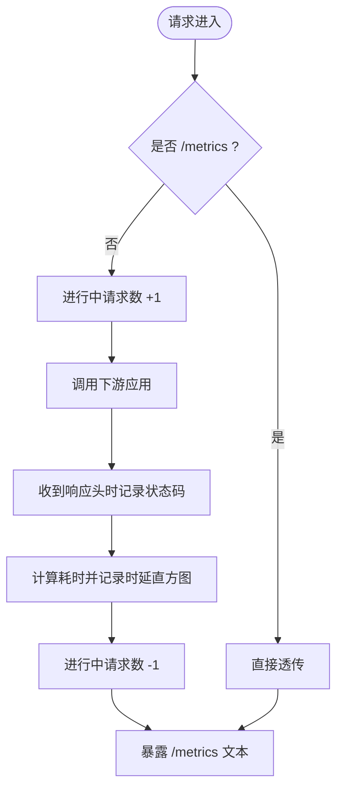
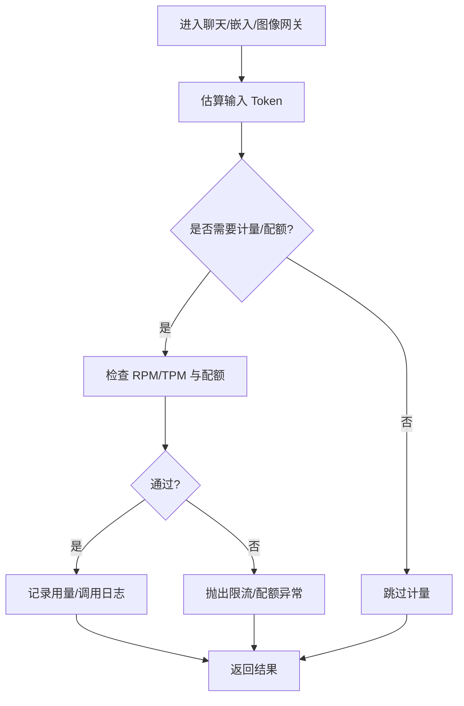
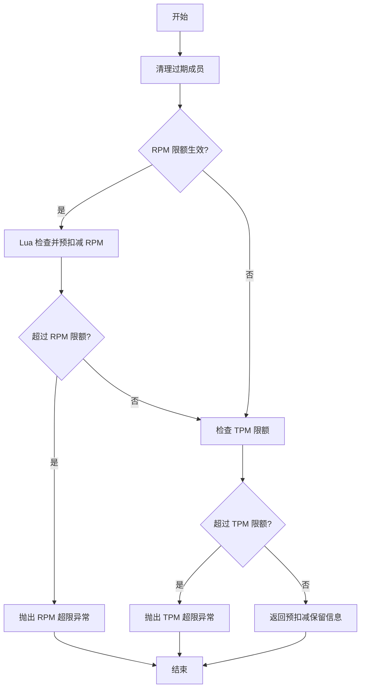
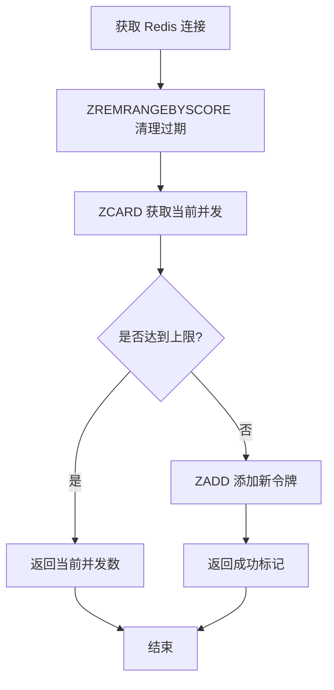
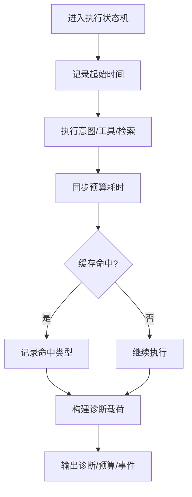
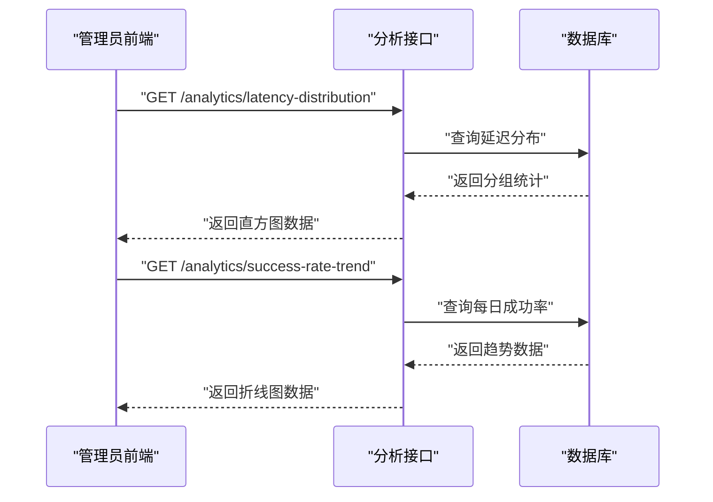
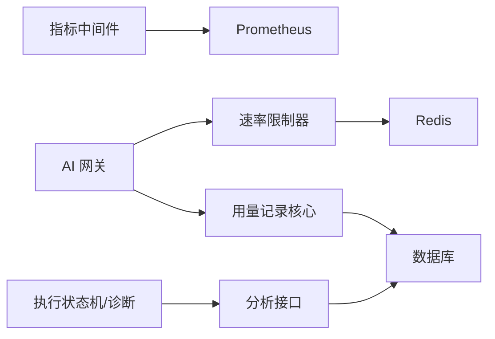

# 性能监控和基准测试

<cite>
**本文引用的文件**
- [prometheus_metrics.py](file://backend/app/middleware/prometheus_metrics.py)
- [main.py](file://backend/app/main.py)
- [chat_gateway.py](file://backend/app/ai/gateway_support/chat_gateway.py)
- [embedding_gateway.py](file://backend/app/ai/gateway_support/embedding_gateway.py)
- [image_gateway.py](file://backend/app/ai/gateway_support/image_gateway.py)
- [usage_recorder_core.py](file://backend/app/ai/usage_recorder_core.py)
- [rate_limiter.py](file://backend/app/ai/rate_limiter.py)
- [agent_quota_concurrency.py](file://backend/app/ai/agent_quota_concurrency.py)
- [execution_preflight_support.py](file://backend/app/ai/engine/execution_preflight_support.py)
- [execution_state_machine.py](file://backend/app/ai/engine/execution_state_machine.py)
- [turn_diagnostics.py](file://backend/app/ai/engine/turn_diagnostics.py)
- [analytics.py](file://backend/app/api/admin/analytics.py)
- [test_analytics_service.py](file://backend/tests/services/test_analytics_service.py)
- [test_ai_gateway_platform_logging.py](file://backend/tests/services/test_ai_gateway_platform_logging.py)
- [test_ai_real_dialogue_smoke_service.py](file://backend/tests/test_ai_real_dialogue_smoke_service.py)
</cite>

## 目录
1. [简介](#简介)
2. [项目结构](#项目结构)
3. [核心组件](#核心组件)
4. [架构总览](#架构总览)
5. [详细组件分析](#详细组件分析)
6. [依赖关系分析](#依赖关系分析)
7. [性能考量](#性能考量)
8. [故障排查指南](#故障排查指南)
9. [结论](#结论)
10. [附录](#附录)

## 简介
本文件面向性能监控与基准测试的专业需求，系统性梳理后端在响应时间、吞吐量、资源利用率、AI调用性能、插件性能与系统瓶颈识别等方面的实现与实践方法。内容覆盖指标采集与暴露、Prometheus指标配置与解读、告警规则与仪表板建议、负载与压力测试流程、AI调用延迟与成本分析、以及插件对整体性能的影响评估路径。

## 项目结构
后端以 FastAPI/ASGI 应用为核心，通过中间件统一采集 HTTP 指标，AI 调用链路贯穿网关、配额/速率限制、用量记录与日志，同时提供分析接口用于延迟分布与成功率趋势等可视化数据支撑。

图表来源
- [prometheus_metrics.py:114-168](file://backend/app/middleware/prometheus_metrics.py#L114-L168)
- [analytics.py:85-115](file://backend/app/api/admin/analytics.py#L85-L115)
- [chat_gateway.py:65-113](file://backend/app/ai/gateway_support/chat_gateway.py#L65-L113)
- [usage_recorder_core.py:121-170](file://backend/app/ai/usage_recorder_core.py#L121-L170)
- [rate_limiter.py:140-212](file://backend/app/ai/rate_limiter.py#L140-L212)
- [agent_quota_concurrency.py:40-78](file://backend/app/ai/agent_quota_concurrency.py#L40-L78)
- [execution_state_machine.py:246-439](file://backend/app/ai/engine/execution_state_machine.py#L246-L439)

章节来源
- [prometheus_metrics.py:114-168](file://backend/app/middleware/prometheus_metrics.py#L114-L168)
- [analytics.py:85-115](file://backend/app/api/admin/analytics.py#L85-L115)

## 核心组件
- 指标中间件：统一采集 HTTP 请求总量、时延分布、进行中的请求数，并暴露 /metrics 接口。
- 组件健康指标：周期刷新数据库与 Redis 健康状态，供告警规则消费。
- AI 网关：在调用前估算 Token，按需检查配额与速率限制，记录用量与调用日志。
- 速率限制器：基于 Redis 的原子 Lua 脚本实现 RPM/TPM 预扣减与检查。
- 并发配额：基于 Redis 的原子脚本实现租户/代理并发上限控制。
- 执行状态机与诊断：记录预算耗时、缓存命中、工具执行等性能关键点。
- 分析接口：提供延迟分布与成功率趋势，支撑仪表板与报表。

章节来源
- [prometheus_metrics.py:74-87](file://backend/app/middleware/prometheus_metrics.py#L74-L87)
- [main.py:556-593](file://backend/app/main.py#L556-L593)
- [chat_gateway.py:65-113](file://backend/app/ai/gateway_support/chat_gateway.py#L65-L113)
- [usage_recorder_core.py:121-170](file://backend/app/ai/usage_recorder_core.py#L121-L170)
- [rate_limiter.py:140-212](file://backend/app/ai/rate_limiter.py#L140-L212)
- [agent_quota_concurrency.py:40-78](file://backend/app/ai/agent_quota_concurrency.py#L40-L78)
- [execution_state_machine.py:246-439](file://backend/app/ai/engine/execution_state_machine.py#L246-L439)
- [analytics.py:85-115](file://backend/app/api/admin/analytics.py#L85-L115)

## 架构总览
下图展示从请求进入、指标采集、AI 调用、限流与配额、用量记录到分析接口的整体流程。

图表来源
- [prometheus_metrics.py:114-168](file://backend/app/middleware/prometheus_metrics.py#L114-L168)
- [chat_gateway.py:65-113](file://backend/app/ai/gateway_support/chat_gateway.py#L65-L113)
- [rate_limiter.py:140-212](file://backend/app/ai/rate_limiter.py#L140-L212)
- [usage_recorder_core.py:121-170](file://backend/app/ai/usage_recorder_core.py#L121-L170)

## 详细组件分析

### 指标中间件与组件健康
- 中间件职责：拦截 HTTP 请求，统计方法、路由、状态码、时延与进行中的请求数；对 /metrics 路径放行。
- 组件健康：定期探测数据库与 Redis 健康，设置健康标签，便于告警规则使用。

图表来源
- [prometheus_metrics.py:114-168](file://backend/app/middleware/prometheus_metrics.py#L114-L168)

章节来源
- [prometheus_metrics.py:74-87](file://backend/app/middleware/prometheus_metrics.py#L74-L87)
- [main.py:556-593](file://backend/app/main.py#L556-L593)

### AI 网关与用量记录
- Token 估算：根据消息内容或文本集合估算输入 Token 数。
- 配额与速率：按租户/模型维度检查 RPM/TPM 限额与配额，必要时进行预扣减。
- 用量记录：在成功/失败场景记录用量、调用日志与延迟等信息。

图表来源
- [chat_gateway.py:65-113](file://backend/app/ai/gateway_support/chat_gateway.py#L65-L113)
- [embedding_gateway.py:40-65](file://backend/app/ai/gateway_support/embedding_gateway.py#L40-L65)
- [image_gateway.py:45-68](file://backend/app/ai/gateway_support/image_gateway.py#L45-L68)
- [usage_recorder_core.py:121-170](file://backend/app/ai/usage_recorder_core.py#L121-L170)

章节来源
- [chat_gateway.py:65-113](file://backend/app/ai/gateway_support/chat_gateway.py#L65-L113)
- [embedding_gateway.py:40-65](file://backend/app/ai/gateway_support/embedding_gateway.py#L40-L65)
- [image_gateway.py:45-68](file://backend/app/ai/gateway_support/image_gateway.py#L45-L68)
- [usage_recorder_core.py:121-170](file://backend/app/ai/usage_recorder_core.py#L121-L170)

### 速率限制器（RPM/TPM）
- 原子 Lua 脚本：在 Redis 中完成清理过期、检查计数、预扣减与登记，避免竞态。
- 错误处理：超过限额时抛出异常，上层可据此回滚预扣减并记录告警。

图表来源
- [rate_limiter.py:140-212](file://backend/app/ai/rate_limiter.py#L140-L212)

章节来源
- [rate_limiter.py:140-212](file://backend/app/ai/rate_limiter.py#L140-L212)

### 并发配额与限流（Agent Concurrency）
- 原子脚本：先清理过期，再检查当前并发数，若未超限则原子添加令牌。
- 支持租户级与代理级并发上限，防止热点代理导致系统过载。

图表来源
- [agent_quota_concurrency.py:40-78](file://backend/app/ai/agent_quota_concurrency.py#L40-L78)

章节来源
- [agent_quota_concurrency.py:40-78](file://backend/app/ai/agent_quota_concurrency.py#L40-L78)

### 执行状态机与诊断（预算/缓存命中）
- 预算耗时：使用高精度计时器累计已用毫秒，作为执行预算的观测指标。
- 缓存命中：记录去重命中与不同缓存类型命中情况，辅助定位重复计算与缓存策略有效性。

图表来源
- [execution_state_machine.py:246-439](file://backend/app/ai/engine/execution_state_machine.py#L246-L439)
- [turn_diagnostics.py:105-139](file://backend/app/ai/engine/turn_diagnostics.py#L105-L139)

章节来源
- [execution_state_machine.py:246-439](file://backend/app/ai/engine/execution_state_machine.py#L246-L439)
- [turn_diagnostics.py:105-139](file://backend/app/ai/engine/turn_diagnostics.py#L105-L139)

### 分析接口与测试验证
- 管理端分析接口：提供延迟分布直方图与成功率趋势折线图，支持按日期范围与租户筛选。
- 测试验证：通过单元测试验证延迟分段统计、成功率趋势聚合与平台调用失败时的延迟记录行为。

图表来源
- [analytics.py:85-115](file://backend/app/api/admin/analytics.py#L85-L115)

章节来源
- [analytics.py:85-115](file://backend/app/api/admin/analytics.py#L85-L115)
- [test_analytics_service.py:133-168](file://backend/tests/services/test_analytics_service.py#L133-L168)
- [test_ai_gateway_platform_logging.py:224-342](file://backend/tests/services/test_ai_gateway_platform_logging.py#L224-L342)

## 依赖关系分析
- 指标中间件依赖 Prometheus 客户端导出格式，向 /metrics 暴露文本指标。
- AI 网关依赖速率限制器与用量记录核心，二者共同保障调用合规与可观测。
- 速率限制器与并发配额依赖 Redis 提供原子 Lua 能力。
- 分析接口依赖数据库查询，输出给前端可视化。

图表来源
- [prometheus_metrics.py:114-168](file://backend/app/middleware/prometheus_metrics.py#L114-L168)
- [chat_gateway.py:65-113](file://backend/app/ai/gateway_support/chat_gateway.py#L65-L113)
- [rate_limiter.py:140-212](file://backend/app/ai/rate_limiter.py#L140-L212)
- [usage_recorder_core.py:121-170](file://backend/app/ai/usage_recorder_core.py#L121-L170)
- [agent_quota_concurrency.py:40-78](file://backend/app/ai/agent_quota_concurrency.py#L40-L78)
- [analytics.py:85-115](file://backend/app/api/admin/analytics.py#L85-L115)

## 性能考量
- 响应时间
  - 中间件使用高精度计时器统计端到端时延，结合直方图桶位观察尾延迟。
  - 执行状态机记录预算耗时，辅助识别长尾与预算超支风险。
- 吞吐量
  - 通过“进行中请求数”与“请求数总量”指标衡量并发与速率变化。
  - 速率限制器的 RPM/TPM 预扣减减少无效排队，提升系统稳定吞吐。
- 资源利用率
  - Redis 原子脚本降低锁竞争与往返开销，提高并发控制效率。
  - 缓存命中（含去重与只读工具）减少重复计算，降低 CPU 与网络消耗。
- AI 调用性能
  - 估算 Token 与配额/速率检查前置，避免无效调用。
  - 失败路径记录延迟与失败原因，支撑成本与可用性分析。
- 插件性能影响
  - 插件生命周期与运行时门控由插件模块负责，建议结合执行状态机的工具执行事件与缓存命中进行关联分析。

## 故障排查指南
- 指标不可达或无数据
  - 检查中间件是否正确注册且未拦截 /metrics。
  - 确认 Prometheus 抓取目标与端口配置。
- 高延迟/尾延迟上升
  - 查看 HTTP 请求时延直方图与进行中请求数趋势。
  - 关注执行状态机预算耗时与缓存命中率变化。
- 限流/配额频繁触发
  - 核对 RPM/TPM 预扣减与检查逻辑，确认 Redis 原子脚本执行正常。
  - 检查用量记录核心的配额检查与回滚路径。
- 组件健康告警
  - 确认数据库与 Redis 健康探测定时刷新逻辑正常。
  - 关注告警规则中对健康指标的阈值设定。

章节来源
- [prometheus_metrics.py:114-168](file://backend/app/middleware/prometheus_metrics.py#L114-L168)
- [rate_limiter.py:140-212](file://backend/app/ai/rate_limiter.py#L140-L212)
- [usage_recorder_core.py:121-170](file://backend/app/ai/usage_recorder_core.py#L121-L170)
- [main.py:556-593](file://backend/app/main.py#L556-L593)

## 结论
该系统通过中间件统一采集 HTTP 指标、在 AI 调用链路前置速率与配额检查、结合用量记录与诊断信息，形成了从端到端到引擎内部的全链路性能观测闭环。配合分析接口与测试验证，可有效支撑延迟分布、成功率趋势等关键指标的持续监控与优化。建议在生产环境完善 Prometheus 抓取与告警规则，并将插件运行时性能纳入统一观测体系。

## 附录
- 负载与压力测试建议
  - 设计多场景：短文本对话、长上下文、批量嵌入、图像生成等。
  - 并发用户模拟：从基线并发逐步阶梯式加压，观察 P50/P95/P99 与错误率拐点。
  - 基准建立：固定模型与参数，记录稳定期的吞吐与延迟分布，形成基线。
- AI 调用成本评估
  - 结合用量记录中的 Token 估算与实际计费，计算每场景的成本曲线。
  - 对比不同供应商的延迟与价格，选择性价比最优方案。
- 插件性能影响分析
  - 将插件生命周期事件与工具执行事件纳入诊断载荷，结合缓存命中与预算耗时进行对比分析。