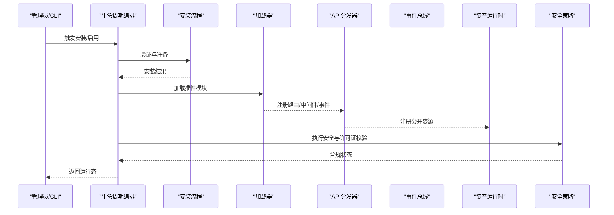
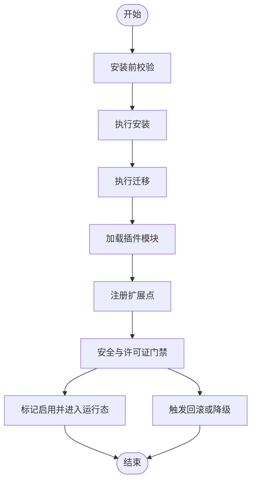
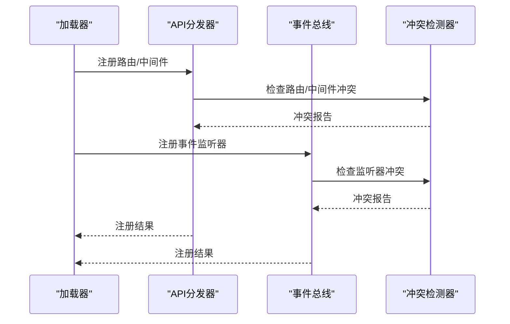
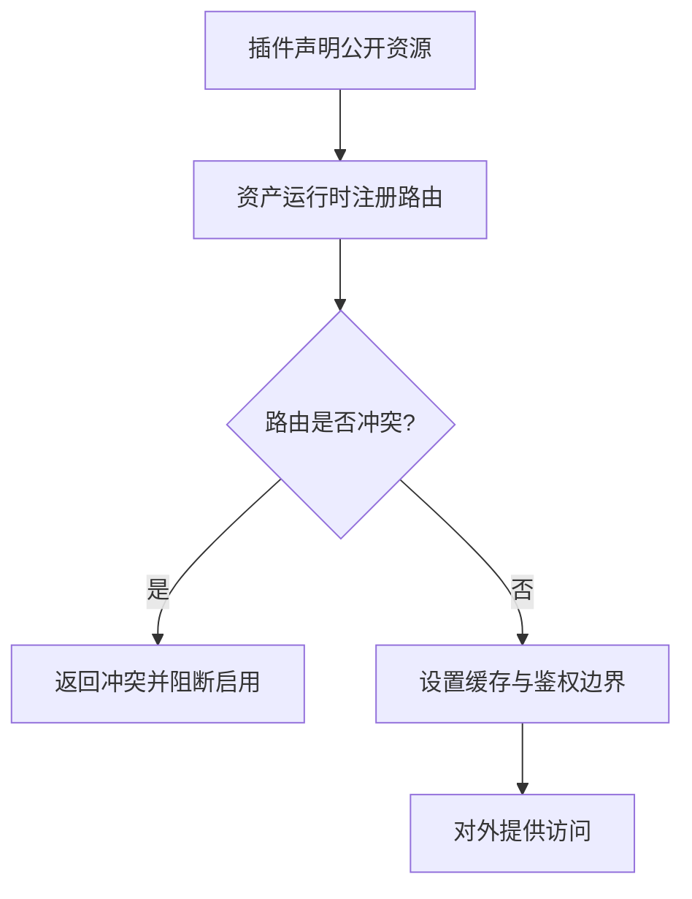
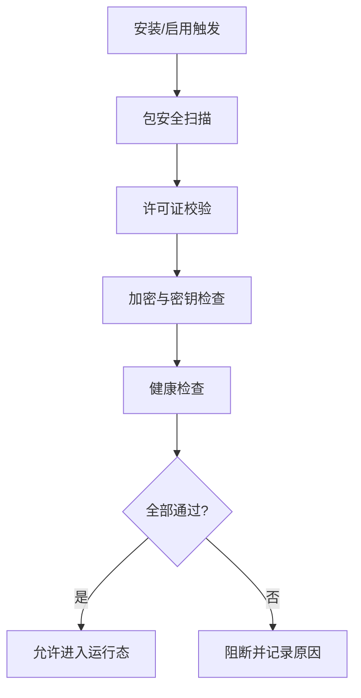
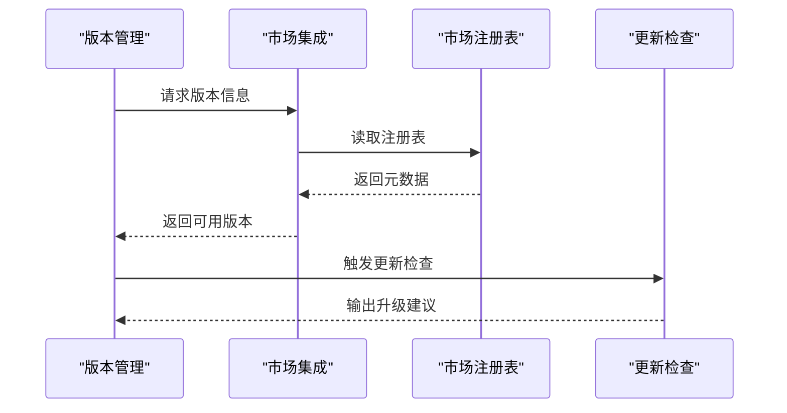
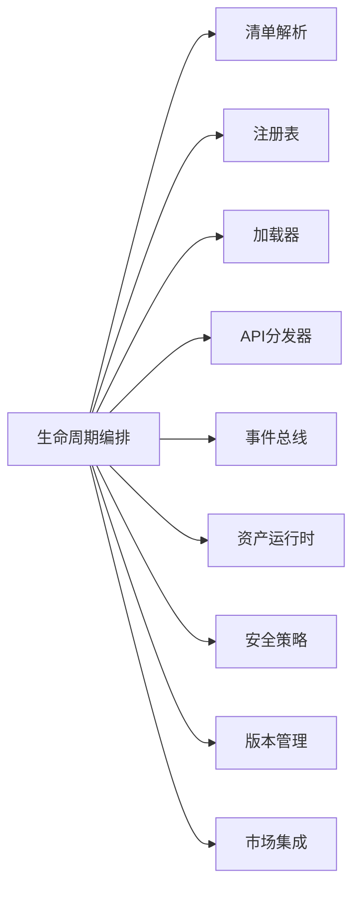

# 插件故障排除

<cite>
**本文档引用的文件**
- [backend/app/plugins/lifecycle.py](file://backend/app/plugins/lifecycle.py)
- [backend/app/plugins/lifecycle_orchestrator.py](file://backend/app/plugins/lifecycle_orchestrator.py)
- [backend/app/plugins/loader.py](file://backend/app/plugins/loader.py)
- [backend/app/plugins/module_loader.py](file://backend/app/plugins/module_loader.py)
- [backend/app/plugins/manifest.py](file://backend/app/plugins/manifest.py)
- [backend/app/plugins/registry.py](file://backend/app/plugins/registry.py)
- [backend/app/plugins/api_dispatcher.py](file://backend/app/plugins/api_dispatcher.py)
- [backend/app/plugins/event_bus.py](file://backend/app/plugins/event_bus.py)
- [backend/app/plugins/asset_runtime.py](file://backend/app/plugins/asset_runtime.py)
- [backend/app/plugins/runtime_recovery.py](file://backend/app/plugins/runtime_recovery.py)
- [backend/app/plugins/exceptions.py](file://backend/app/plugins/exceptions.py)
- [backend/app/plugins/security.py](file://backend/app/plugins/security.py)
- [backend/app/plugins/package_security.py](file://backend/app/plugins/package_security.py)
- [backend/app/plugins/version_manager.py](file://backend/app/plugins/version_manager.py)
- [backend/app/plugins/marketplace.py](file://backend/app/plugins/marketplace.py)
- [backend/app/plugins/dependencies.py](file://backend/app/plugins/dependencies.py)
- [backend/app/plugins/lifecycle_guards.py](file://backend/app/plugins/lifecycle_guards.py)
- [backend/app/plugins/lifecycle_installation.py](file://backend/app/plugins/lifecycle_installation.py)
- [backend/app/plugins/lifecycle_migrations.py](file://backend/app/plugins/lifecycle_migrations.py)
- [backend/app/plugins/lifecycle_runtime_state.py](file://backend/app/plugins/lifecycle_runtime_state.py)
- [backend/app/plugins/lifecycle_support.py](file://backend/app/plugins/lifecycle_support.py)
- [backend/app/plugins/startup.py](file://backend/app/plugins/startup.py)
- [backend/app/plugins/scheduler_refresh.py](file://backend/app/plugins/scheduler_refresh.py)
- [backend/app/plugins/webhook_dispatcher.py](file://backend/app/plugins/webhook_dispatcher.py)
- [backend/app/plugins/crypto.py](file://backend/app/plugins/crypto.py)
- [backend/app/plugins/host_read_facade.py](file://backend/app/plugins/host_read_facade.py)
- [backend/app/plugins/sso_auth.py](file://backend/app/plugins/sso_auth.py)
- [backend/app/plugins/sse.py](file://backend/app/plugins/sse.py)
- [backend/app/plugins/system_hooks.py](file://backend/app/plugins/system_hooks.py)
- [backend/app/plugins/tenant_plan_preflight.py](file://backend/app/plugins/tenant_plan_preflight.py)
- [backend/app/plugins/update_checker.py](file://backend/app/plugins/update_checker.py)
- [backend/app/plugins/preview.py](file://backend/app/plugins/preview.py)
- [backend/app/plugins/progress.py](file://backend/app/plugins/progress.py)
- [backend/app/plugins/backup.py](file://backend/app/plugins/backup.py)
- [backend/app/plugins/context.py](file://backend/app/plugins/context.py)
- [backend/app/plugins/context_factory.py](file://backend/app/plugins/context_factory.py)
- [backend/app/plugins/context_primitives.py](file://backend/app/plugins/context_primitives.py)
- [backend/app/plugins/exposure_policy.py](file://backend/app/plugins/exposure_policy.py)
- [backend/app/plugins/frontend_contract.py](file://backend/app/plugins/frontend_contract.py)
- [backend/app/plugins/frontend_contract_checks.py](file://backend/app/plugins/frontend_contract_checks.py)
- [backend/app/plugins/health.py](file://backend/app/plugins/health.py)
- [backend/app/plugins/license.py](file://backend/app/plugins/license.py)
- [backend/app/plugins/scope.py](file://backend/app/plugins/scope.py)
- [backend/app/plugins/security_scan.py](file://backend/app/plugins/security_scan.py)
- [backend/app/plugins/marketplace_registry/registry.json](file://backend/app/plugins/marketplace_registry/registry.json)
</cite>

## 目录
1. [简介](#简介)
2. [项目结构](#项目结构)
3. [核心组件](#核心组件)
4. [架构总览](#架构总览)
5. [详细组件分析](#详细组件分析)
6. [依赖关系分析](#依赖关系分析)
7. [性能考虑](#性能考虑)
8. [故障排除指南](#故障排除指南)
9. [结论](#结论)
10. [附录](#附录)

## 简介
本文件面向插件系统的故障排除与运维场景，系统性梳理插件在加载失败、API扩展冲突、资源运行时异常、生命周期异常（安装/启用/禁用）、API冲突（路由重复/中间件冲突/事件监听器覆盖）、依赖问题（Python包/版本/循环依赖）以及性能问题（内存/CPU/响应时间）等方面的诊断与处理方法。文档以代码级架构与模块职责为依据，提供可操作的排查步骤、可视化流程图与最佳实践。

## 项目结构
插件系统位于后端应用的插件子目录中，采用分层与功能域划分：生命周期编排、清单解析、注册表、API分发、事件总线、资产运行时、安全与合规、版本管理、市场集成等模块协同工作，形成完整的插件全生命周期管理能力。

```mermaid
graph TB
subgraph "插件核心模块"
L["生命周期编排<br/>lifecycle_orchestrator.py"]
LI["安装流程<br/>lifecycle_installation.py"]
LM["迁移流程<br/>lifecycle_migrations.py"]
LR["运行时状态<br/>lifecycle_runtime_state.py"]
LG["生命周期守卫<br/>lifecycle_guards.py"]
LS["生命周期支持<br/>lifecycle_support.py"]
end
subgraph "运行时与扩展"
M["清单解析<br/>manifest.py"]
R["注册表<br/>registry.py"]
MD["模块加载器<br/>module_loader.py"]
LO["插件加载器<br/>loader.py"]
AD["API分发器<br/>api_dispatcher.py"]
EB["事件总线<br/>event_bus.py"]
AR["资产运行时<br/>asset_runtime.py"]
RC["运行时恢复<br/>runtime_recovery.py"]
end
subgraph "安全与合规"
SEC["安全策略<br/>security.py"]
PS["包安全扫描<br/>package_security.py"]
CR["加密工具<br/>crypto.py"]
HP["健康检查<br/>health.py"]
end
subgraph "市场与生态"
MK["市场集成<br/>marketplace.py"]
MR["市场注册表<br/>marketplace_registry/registry.json"]
VM["版本管理<br/>version_manager.py"]
UP["更新检查<br/>update_checker.py"]
end
L --> LI
L --> LM
L --> LR
L --> LG
L --> LS
L --> M
L --> R
L --> MD
L --> LO
L --> AD
L --> EB
L --> AR
L --> RC
L --> SEC
L --> PS
L --> CR
L --> HP
L --> MK
MK --> MR
L --> VM
L --> UP
```

**图表来源**
- [backend/app/plugins/lifecycle_orchestrator.py](file://backend/app/plugins/lifecycle_orchestrator.py)
- [backend/app/plugins/lifecycle_installation.py](file://backend/app/plugins/lifecycle_installation.py)
- [backend/app/plugins/lifecycle_migrations.py](file://backend/app/plugins/lifecycle_migrations.py)
- [backend/app/plugins/lifecycle_runtime_state.py](file://backend/app/plugins/lifecycle_runtime_state.py)
- [backend/app/plugins/lifecycle_guards.py](file://backend/app/plugins/lifecycle_guards.py)
- [backend/app/plugins/lifecycle_support.py](file://backend/app/plugins/lifecycle_support.py)
- [backend/app/plugins/manifest.py](file://backend/app/plugins/manifest.py)
- [backend/app/plugins/registry.py](file://backend/app/plugins/registry.py)
- [backend/app/plugins/module_loader.py](file://backend/app/plugins/module_loader.py)
- [backend/app/plugins/loader.py](file://backend/app/plugins/loader.py)
- [backend/app/plugins/api_dispatcher.py](file://backend/app/plugins/api_dispatcher.py)
- [backend/app/plugins/event_bus.py](file://backend/app/plugins/event_bus.py)
- [backend/app/plugins/asset_runtime.py](file://backend/app/plugins/asset_runtime.py)
- [backend/app/plugins/runtime_recovery.py](file://backend/app/plugins/runtime_recovery.py)
- [backend/app/plugins/security.py](file://backend/app/plugins/security.py)
- [backend/app/plugins/package_security.py](file://backend/app/plugins/package_security.py)
- [backend/app/plugins/crypto.py](file://backend/app/plugins/crypto.py)
- [backend/app/plugins/health.py](file://backend/app/plugins/health.py)
- [backend/app/plugins/marketplace.py](file://backend/app/plugins/marketplace.py)
- [backend/app/plugins/marketplace_registry/registry.json](file://backend/app/plugins/marketplace_registry/registry.json)
- [backend/app/plugins/version_manager.py](file://backend/app/plugins/version_manager.py)
- [backend/app/plugins/update_checker.py](file://backend/app/plugins/update_checker.py)

**章节来源**
- [backend/app/plugins/lifecycle_orchestrator.py](file://backend/app/plugins/lifecycle_orchestrator.py)
- [backend/app/plugins/manifest.py](file://backend/app/plugins/manifest.py)
- [backend/app/plugins/registry.py](file://backend/app/plugins/registry.py)
- [backend/app/plugins/module_loader.py](file://backend/app/plugins/module_loader.py)
- [backend/app/plugins/loader.py](file://backend/app/plugins/loader.py)
- [backend/app/plugins/api_dispatcher.py](file://backend/app/plugins/api_dispatcher.py)
- [backend/app/plugins/event_bus.py](file://backend/app/plugins/event_bus.py)
- [backend/app/plugins/asset_runtime.py](file://backend/app/plugins/asset_runtime.py)
- [backend/app/plugins/runtime_recovery.py](file://backend/app/plugins/runtime_recovery.py)
- [backend/app/plugins/security.py](file://backend/app/plugins/security.py)
- [backend/app/plugins/package_security.py](file://backend/app/plugins/package_security.py)
- [backend/app/plugins/crypto.py](file://backend/app/plugins/crypto.py)
- [backend/app/plugins/health.py](file://backend/app/plugins/health.py)
- [backend/app/plugins/marketplace.py](file://backend/app/plugins/marketplace.py)
- [backend/app/plugins/marketplace_registry/registry.json](file://backend/app/plugins/marketplace_registry/registry.json)
- [backend/app/plugins/version_manager.py](file://backend/app/plugins/version_manager.py)
- [backend/app/plugins/update_checker.py](file://backend/app/plugins/update_checker.py)

## 核心组件
- 生命周期编排：协调安装、启用、运行、禁用、卸载等阶段，确保状态一致性与幂等性。
- 清单解析：校验与解析插件元数据，验证依赖、版本、暴露策略等。
- 注册表：维护已安装插件的索引与可见性，支持查询与变更。
- 模块加载器与加载器：动态导入插件模块，建立上下文与扩展点注册。
- API分发器：将插件扩展的路由/中间件/事件注入到主服务。
- 事件总线：跨插件事件广播与订阅，避免覆盖与冲突。
- 资产运行时：托管前端静态资源与公开路由，保障访问与缓存。
- 安全与合规：包安全扫描、许可证校验、加密与健康检查。
- 市场与生态：版本管理、更新检查、市场注册表同步。

**章节来源**
- [backend/app/plugins/lifecycle_orchestrator.py](file://backend/app/plugins/lifecycle_orchestrator.py)
- [backend/app/plugins/manifest.py](file://backend/app/plugins/manifest.py)
- [backend/app/plugins/registry.py](file://backend/app/plugins/registry.py)
- [backend/app/plugins/module_loader.py](file://backend/app/plugins/module_loader.py)
- [backend/app/plugins/loader.py](file://backend/app/plugins/loader.py)
- [backend/app/plugins/api_dispatcher.py](file://backend/app/plugins/api_dispatcher.py)
- [backend/app/plugins/event_bus.py](file://backend/app/plugins/event_bus.py)
- [backend/app/plugins/asset_runtime.py](file://backend/app/plugins/asset_runtime.py)
- [backend/app/plugins/security.py](file://backend/app/plugins/security.py)
- [backend/app/plugins/package_security.py](file://backend/app/plugins/package_security.py)
- [backend/app/plugins/version_manager.py](file://backend/app/plugins/version_manager.py)
- [backend/app/plugins/marketplace.py](file://backend/app/plugins/marketplace.py)

## 架构总览
下图展示插件从“安装预览—安装—启用—运行—禁用/卸载”的全链路流程，以及与API分发、事件总线、资产运行时、安全策略的交互。

**图表来源**
- [backend/app/plugins/lifecycle_orchestrator.py](file://backend/app/plugins/lifecycle_orchestrator.py)
- [backend/app/plugins/lifecycle_installation.py](file://backend/app/plugins/lifecycle_installation.py)
- [backend/app/plugins/loader.py](file://backend/app/plugins/loader.py)
- [backend/app/plugins/api_dispatcher.py](file://backend/app/plugins/api_dispatcher.py)
- [backend/app/plugins/event_bus.py](file://backend/app/plugins/event_bus.py)
- [backend/app/plugins/asset_runtime.py](file://backend/app/plugins/asset_runtime.py)
- [backend/app/plugins/security.py](file://backend/app/plugins/security.py)

## 详细组件分析

### 组件A：生命周期编排与安装流程
- 职责：统一调度安装、启用、运行、禁用、卸载；保证状态机一致与回滚路径。
- 关键点：安装前校验、迁移执行、运行时状态持久化、守卫规则拦截异常路径。
- 故障类型：安装失败、启用中断、状态不一致、回滚失败。

**图表来源**
- [backend/app/plugins/lifecycle_orchestrator.py](file://backend/app/plugins/lifecycle_orchestrator.py)
- [backend/app/plugins/lifecycle_installation.py](file://backend/app/plugins/lifecycle_installation.py)
- [backend/app/plugins/lifecycle_migrations.py](file://backend/app/plugins/lifecycle_migrations.py)
- [backend/app/plugins/lifecycle_guards.py](file://backend/app/plugins/lifecycle_guards.py)
- [backend/app/plugins/lifecycle_runtime_state.py](file://backend/app/plugins/lifecycle_runtime_state.py)

**章节来源**
- [backend/app/plugins/lifecycle_orchestrator.py](file://backend/app/plugins/lifecycle_orchestrator.py)
- [backend/app/plugins/lifecycle_installation.py](file://backend/app/plugins/lifecycle_installation.py)
- [backend/app/plugins/lifecycle_migrations.py](file://backend/app/plugins/lifecycle_migrations.py)
- [backend/app/plugins/lifecycle_guards.py](file://backend/app/plugins/lifecycle_guards.py)
- [backend/app/plugins/lifecycle_runtime_state.py](file://backend/app/plugins/lifecycle_runtime_state.py)

### 组件B：API扩展与冲突检测
- 路由重复：通过API分发器对新注册路由进行冲突检测，避免与已有路由/方法/参数签名重复。
- 中间件冲突：按注册顺序与作用域合并，若同作用域重复则拒绝或提示覆盖。
- 事件监听器覆盖：事件总线按优先级与唯一标识注册，重复监听器需显式替换或合并策略。
- 处理建议：启用前进行“扩展预检”，记录冲突详情与影响范围；提供“灰度发布”与“回滚”。

**图表来源**
- [backend/app/plugins/api_dispatcher.py](file://backend/app/plugins/api_dispatcher.py)
- [backend/app/plugins/event_bus.py](file://backend/app/plugins/event_bus.py)

**章节来源**
- [backend/app/plugins/api_dispatcher.py](file://backend/app/plugins/api_dispatcher.py)
- [backend/app/plugins/event_bus.py](file://backend/app/plugins/event_bus.py)

### 组件C：资源运行时与公开资产
- 公开路由与静态资源：资产运行时负责注册公开路由、缓存控制与访问鉴权边界。
- 异常类型：路由冲突、权限越界、资源缺失、缓存污染。
- 排查要点：核对公开路由前缀、资源路径映射、租户隔离策略。

**图表来源**
- [backend/app/plugins/asset_runtime.py](file://backend/app/plugins/asset_runtime.py)

**章节来源**
- [backend/app/plugins/asset_runtime.py](file://backend/app/plugins/asset_runtime.py)

### 组件D：安全与合规
- 包安全扫描：检查依赖包的安全漏洞与黑名单。
- 许可证校验：验证许可证有效性与使用范围。
- 加密与健康检查：敏感信息加密存储与运行健康自检。
- 排查要点：安全扫描报告、许可证状态、密钥轮换与健康指标。

**图表来源**
- [backend/app/plugins/package_security.py](file://backend/app/plugins/package_security.py)
- [backend/app/plugins/license.py](file://backend/app/plugins/license.py)
- [backend/app/plugins/crypto.py](file://backend/app/plugins/crypto.py)
- [backend/app/plugins/health.py](file://backend/app/plugins/health.py)

**章节来源**
- [backend/app/plugins/package_security.py](file://backend/app/plugins/package_security.py)
- [backend/app/plugins/license.py](file://backend/app/plugins/license.py)
- [backend/app/plugins/crypto.py](file://backend/app/plugins/crypto.py)
- [backend/app/plugins/health.py](file://backend/app/plugins/health.py)

### 组件E：版本管理与市场生态
- 版本管理：约束升级/降级路径，确保兼容性与迁移完整性。
- 市场集成：从市场注册表拉取最新元数据，校验签名与来源可信度。
- 更新检查：定期比对本地版本与市场版本，生成升级建议与风险评估。

**图表来源**
- [backend/app/plugins/version_manager.py](file://backend/app/plugins/version_manager.py)
- [backend/app/plugins/marketplace.py](file://backend/app/plugins/marketplace.py)
- [backend/app/plugins/marketplace_registry/registry.json](file://backend/app/plugins/marketplace_registry/registry.json)
- [backend/app/plugins/update_checker.py](file://backend/app/plugins/update_checker.py)

**章节来源**
- [backend/app/plugins/version_manager.py](file://backend/app/plugins/version_manager.py)
- [backend/app/plugins/marketplace.py](file://backend/app/plugins/marketplace.py)
- [backend/app/plugins/marketplace_registry/registry.json](file://backend/app/plugins/marketplace_registry/registry.json)
- [backend/app/plugins/update_checker.py](file://backend/app/plugins/update_checker.py)

## 依赖关系分析
- 模块耦合：生命周期编排作为中枢，向上游依赖清单解析与注册表，向下游依赖加载器、API分发器、事件总线与资产运行时。
- 外部依赖：市场注册表、包安全数据库、许可证服务、版本仓库。
- 循环依赖检测：通过模块加载器的拓扑排序与依赖图检测，避免循环导入；对插件间依赖进行白名单与版本约束。

**图表来源**
- [backend/app/plugins/lifecycle_orchestrator.py](file://backend/app/plugins/lifecycle_orchestrator.py)
- [backend/app/plugins/manifest.py](file://backend/app/plugins/manifest.py)
- [backend/app/plugins/registry.py](file://backend/app/plugins/registry.py)
- [backend/app/plugins/loader.py](file://backend/app/plugins/loader.py)
- [backend/app/plugins/api_dispatcher.py](file://backend/app/plugins/api_dispatcher.py)
- [backend/app/plugins/event_bus.py](file://backend/app/plugins/event_bus.py)
- [backend/app/plugins/asset_runtime.py](file://backend/app/plugins/asset_runtime.py)
- [backend/app/plugins/security.py](file://backend/app/plugins/security.py)
- [backend/app/plugins/version_manager.py](file://backend/app/plugins/version_manager.py)
- [backend/app/plugins/marketplace.py](file://backend/app/plugins/marketplace.py)

**章节来源**
- [backend/app/plugins/lifecycle_orchestrator.py](file://backend/app/plugins/lifecycle_orchestrator.py)
- [backend/app/plugins/manifest.py](file://backend/app/plugins/manifest.py)
- [backend/app/plugins/registry.py](file://backend/app/plugins/registry.py)
- [backend/app/plugins/loader.py](file://backend/app/plugins/loader.py)
- [backend/app/plugins/api_dispatcher.py](file://backend/app/plugins/api_dispatcher.py)
- [backend/app/plugins/event_bus.py](file://backend/app/plugins/event_bus.py)
- [backend/app/plugins/asset_runtime.py](file://backend/app/plugins/asset_runtime.py)
- [backend/app/plugins/security.py](file://backend/app/plugins/security.py)
- [backend/app/plugins/version_manager.py](file://backend/app/plugins/version_manager.py)
- [backend/app/plugins/marketplace.py](file://backend/app/plugins/marketplace.py)

## 性能考虑
- 内存占用：监控插件加载后的对象数量、闭包持有、事件监听器数量；对大对象进行懒加载与弱引用。
- CPU使用率：避免在启用阶段执行重计算；将初始化任务异步化并限制并发。
- 响应时间：API分发器与事件总线应采用轻量级路由匹配与事件派发；对热点路径进行缓存与限流。
- 运行时恢复：在异常后快速恢复关键服务，减少停机窗口。

[本节为通用指导，无需具体文件分析]

## 故障排除指南

### 插件加载失败
- 现象：启用时报错、模块导入失败、依赖缺失。
- 排查步骤：
  1) 查看生命周期编排日志，定位安装/启用阶段的错误节点。
  2) 检查清单解析是否通过，确认依赖与版本字段合法。
  3) 使用模块加载器的依赖图与拓扑排序，确认无循环导入。
  4) 核对包安全扫描与许可证状态。
- 相关文件路径：
  - [backend/app/plugins/lifecycle_orchestrator.py](file://backend/app/plugins/lifecycle_orchestrator.py)
  - [backend/app/plugins/manifest.py](file://backend/app/plugins/manifest.py)
  - [backend/app/plugins/module_loader.py](file://backend/app/plugins/module_loader.py)
  - [backend/app/plugins/package_security.py](file://backend/app/plugins/package_security.py)
  - [backend/app/plugins/license.py](file://backend/app/plugins/license.py)

**章节来源**
- [backend/app/plugins/lifecycle_orchestrator.py](file://backend/app/plugins/lifecycle_orchestrator.py)
- [backend/app/plugins/manifest.py](file://backend/app/plugins/manifest.py)
- [backend/app/plugins/module_loader.py](file://backend/app/plugins/module_loader.py)
- [backend/app/plugins/package_security.py](file://backend/app/plugins/package_security.py)
- [backend/app/plugins/license.py](file://backend/app/plugins/license.py)

### API扩展冲突
- 现象：路由重复、中间件覆盖、事件监听器冲突。
- 排查步骤：
  1) 在启用前调用冲突检测器，记录冲突详情与影响范围。
  2) 对重复路由/中间件/事件监听器，采用“显式覆盖”或“命名空间隔离”策略。
  3) 回滚冲突的扩展注册，保留安全基线。
- 相关文件路径：
  - [backend/app/plugins/api_dispatcher.py](file://backend/app/plugins/api_dispatcher.py)
  - [backend/app/plugins/event_bus.py](file://backend/app/plugins/event_bus.py)

**章节来源**
- [backend/app/plugins/api_dispatcher.py](file://backend/app/plugins/api_dispatcher.py)
- [backend/app/plugins/event_bus.py](file://backend/app/plugins/event_bus.py)

### 资源运行时异常
- 现象：公开路由不可达、权限越界、资源缺失。
- 排查步骤：
  1) 核对资产运行时的路由注册与前缀配置。
  2) 检查租户隔离策略与鉴权边界。
  3) 验证静态资源路径映射与缓存策略。
- 相关文件路径：
  - [backend/app/plugins/asset_runtime.py](file://backend/app/plugins/asset_runtime.py)

**章节来源**
- [backend/app/plugins/asset_runtime.py](file://backend/app/plugins/asset_runtime.py)

### 生命周期问题（安装/启用/禁用）
- 安装失败：检查安装流程的前置条件与回滚路径，确保迁移与状态持久化成功。
- 启用过程错误：关注扩展注册阶段的日志，定位具体模块与扩展点。
- 禁用时清理：确保事件监听器移除、路由注销、资源回收与会话清理。
- 相关文件路径：
  - [backend/app/plugins/lifecycle_installation.py](file://backend/app/plugins/lifecycle_installation.py)
  - [backend/app/plugins/lifecycle_migrations.py](file://backend/app/plugins/lifecycle_migrations.py)
  - [backend/app/plugins/lifecycle_runtime_state.py](file://backend/app/plugins/lifecycle_runtime_state.py)
  - [backend/app/plugins/lifecycle_guards.py](file://backend/app/plugins/lifecycle_guards.py)
  - [backend/app/plugins/lifecycle_support.py](file://backend/app/plugins/lifecycle_support.py)

**章节来源**
- [backend/app/plugins/lifecycle_installation.py](file://backend/app/plugins/lifecycle_installation.py)
- [backend/app/plugins/lifecycle_migrations.py](file://backend/app/plugins/lifecycle_migrations.py)
- [backend/app/plugins/lifecycle_runtime_state.py](file://backend/app/plugins/lifecycle_runtime_state.py)
- [backend/app/plugins/lifecycle_guards.py](file://backend/app/plugins/lifecycle_guards.py)
- [backend/app/plugins/lifecycle_support.py](file://backend/app/plugins/lifecycle_support.py)

### 插件依赖问题
- Python包依赖冲突：使用包安全扫描与版本锁定，避免不同插件依赖同一包的不同版本。
- 版本兼容性：通过版本管理与市场注册表校验，确保插件与平台版本兼容。
- 循环依赖检测：利用模块加载器的依赖图与拓扑排序，发现并修复循环导入。
- 相关文件路径：
  - [backend/app/plugins/package_security.py](file://backend/app/plugins/package_security.py)
  - [backend/app/plugins/version_manager.py](file://backend/app/plugins/version_manager.py)
  - [backend/app/plugins/marketplace_registry/registry.json](file://backend/app/plugins/marketplace_registry/registry.json)
  - [backend/app/plugins/module_loader.py](file://backend/app/plugins/module_loader.py)

**章节来源**
- [backend/app/plugins/package_security.py](file://backend/app/plugins/package_security.py)
- [backend/app/plugins/version_manager.py](file://backend/app/plugins/version_manager.py)
- [backend/app/plugins/marketplace_registry/registry.json](file://backend/app/plugins/marketplace_registry/registry.json)
- [backend/app/plugins/module_loader.py](file://backend/app/plugins/module_loader.py)

### 插件性能问题
- 内存占用过高：检查插件对象生命周期、事件监听器数量与缓存命中率。
- CPU使用率异常：避免在启用阶段执行重计算，异步化初始化任务。
- 响应时间过长：优化API分发器与事件总线的热点路径，增加限流与缓存。
- 相关文件路径：
  - [backend/app/plugins/api_dispatcher.py](file://backend/app/plugins/api_dispatcher.py)
  - [backend/app/plugins/event_bus.py](file://backend/app/plugins/event_bus.py)
  - [backend/app/plugins/asset_runtime.py](file://backend/app/plugins/asset_runtime.py)

**章节来源**
- [backend/app/plugins/api_dispatcher.py](file://backend/app/plugins/api_dispatcher.py)
- [backend/app/plugins/event_bus.py](file://backend/app/plugins/event_bus.py)
- [backend/app/plugins/asset_runtime.py](file://backend/app/plugins/asset_runtime.py)

## 结论
通过“生命周期编排—扩展注册—冲突检测—安全合规—版本与市场生态”的闭环体系，插件系统能够在安装、启用、运行、禁用各阶段保持稳定性与可观测性。针对常见故障，建议采用“预检—注册—回滚—恢复”的标准化流程，并结合日志、指标与自动化测试，持续提升插件系统的可靠性与可维护性。

[本节为总结，无需具体文件分析]

## 附录
- 建议的排障清单：
  - 安装/启用日志与回滚记录
  - 清单解析结果与依赖图
  - 冲突检测报告与覆盖策略
  - 资产运行时路由与鉴权配置
  - 安全扫描与许可证状态
  - 版本管理与市场元数据
  - 性能指标（内存/CPU/响应时间）

[本节为通用指导，无需具体文件分析]