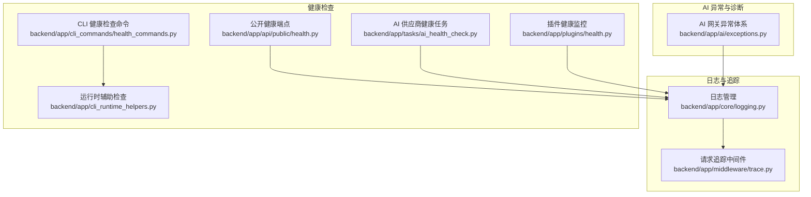
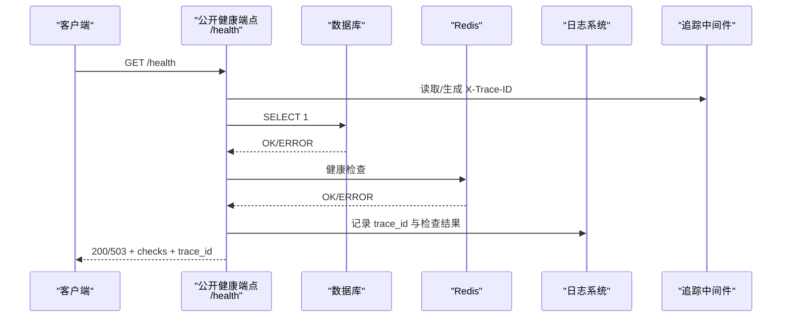
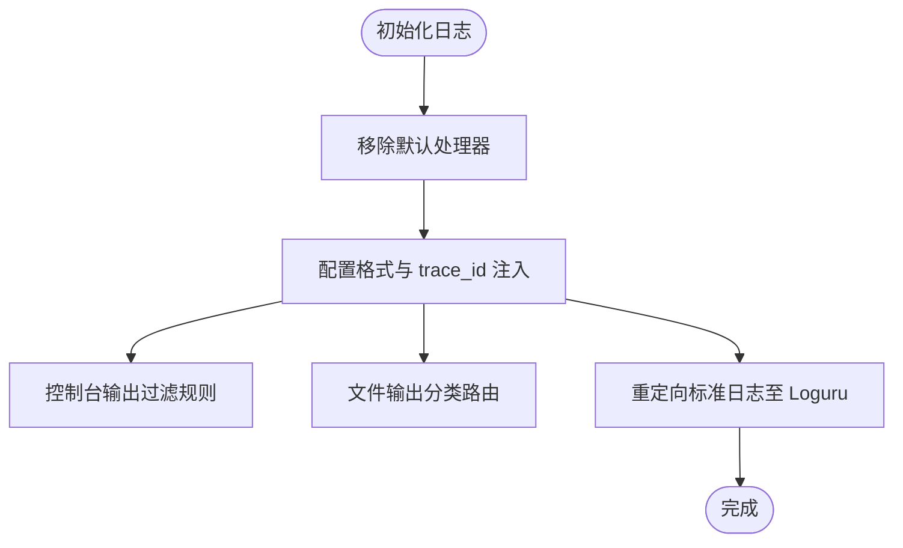
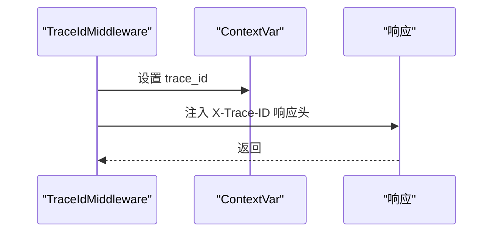
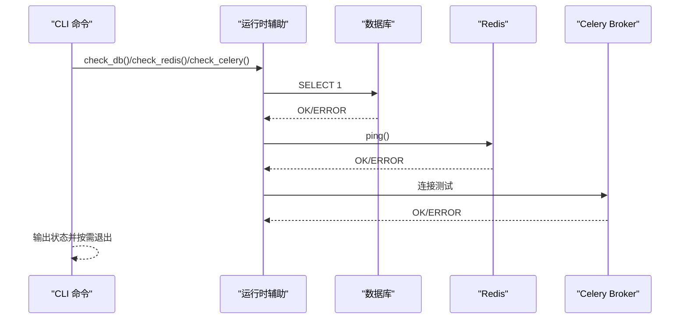
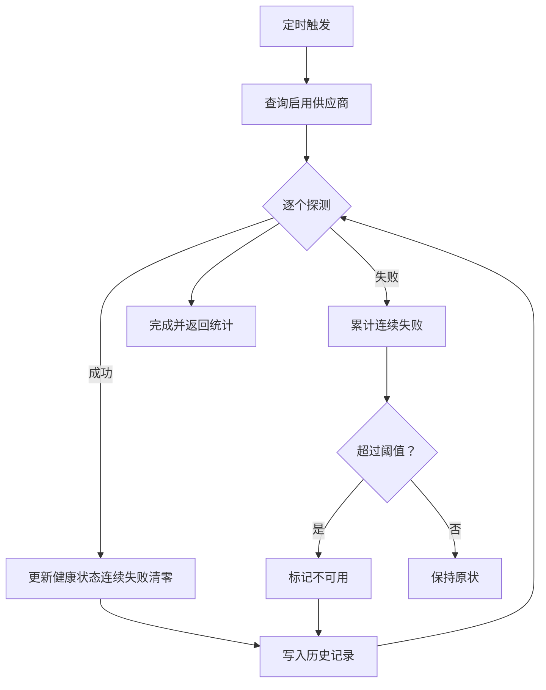
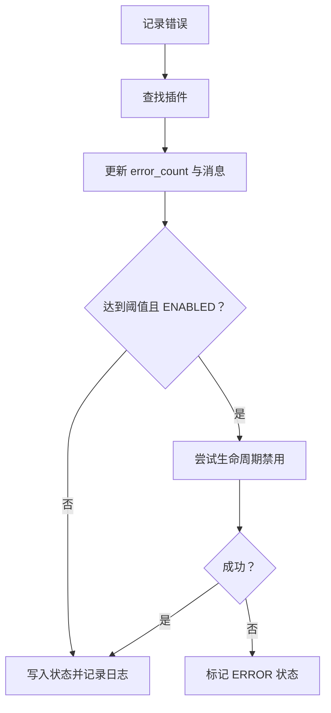
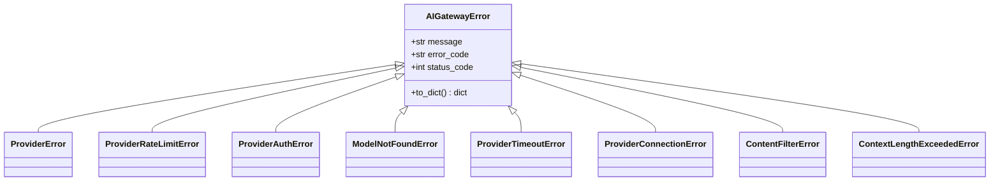
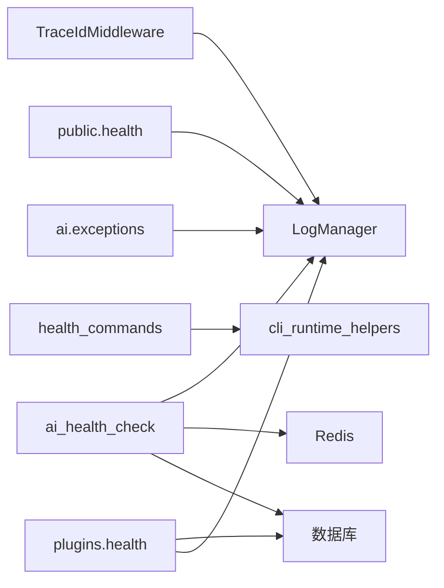

# 故障排除和调试

<cite>
**本文引用的文件**
- [backend/app/core/logging.py](file://backend/app/core/logging.py)
- [backend/app/middleware/trace.py](file://backend/app/middleware/trace.py)
- [backend/app/cli_commands/health_commands.py](file://backend/app/cli_commands/health_commands.py)
- [backend/app/cli_runtime_helpers.py](file://backend/app/cli_runtime_helpers.py)
- [backend/app/api/public/health.py](file://backend/app/api/public/health.py)
- [backend/app/tasks/ai_health_check.py](file://backend/app/tasks/ai_health_check.py)
- [backend/app/plugins/health.py](file://backend/app/plugins/health.py)
- [backend/app/ai/exceptions.py](file://backend/app/ai/exceptions.py)
</cite>

## 目录
1. [简介](#简介)
2. [项目结构](#项目结构)
3. [核心组件](#核心组件)
4. [架构总览](#架构总览)
5. [详细组件分析](#详细组件分析)
6. [依赖关系分析](#依赖关系分析)
7. [性能考量](#性能考量)
8. [故障排除指南](#故障排除指南)
9. [结论](#结论)
10. [附录](#附录)

## 简介
本文件面向开发与运维工程师，提供 NovusAI SaaS 项目的故障排除与调试技术文档。内容覆盖：
- 常见问题定位与解决方案
- 日志分析与诊断工具
- 性能瓶颈识别与系统监控
- AI 调用问题、插件冲突与数据库连接异常的排查流程
- 开发调试工具、断点调试与远程调试实践
- 系统健康检查、性能基准测试与压力测试指导
- 紧急故障处理、回滚策略与数据恢复程序
- 团队协作中的问题报告与解决流程

## 项目结构
后端采用分层与领域驱动设计，围绕“日志与追踪”“健康检查”“AI 异常统一化”“插件健康监控”等关键能力构建可观测性与可维护性。

图表来源
- [backend/app/core/logging.py:131-453](file://backend/app/core/logging.py#L131-L453)
- [backend/app/middleware/trace.py:58-108](file://backend/app/middleware/trace.py#L58-L108)
- [backend/app/cli_commands/health_commands.py:36-118](file://backend/app/cli_commands/health_commands.py#L36-L118)
- [backend/app/cli_runtime_helpers.py:163-201](file://backend/app/cli_runtime_helpers.py#L163-L201)
- [backend/app/api/public/health.py:21-53](file://backend/app/api/public/health.py#L21-L53)
- [backend/app/tasks/ai_health_check.py:55-112](file://backend/app/tasks/ai_health_check.py#L55-L112)
- [backend/app/plugins/health.py:41-194](file://backend/app/plugins/health.py#L41-L194)
- [backend/app/ai/exceptions.py:14-464](file://backend/app/ai/exceptions.py#L14-L464)

章节来源
- [backend/app/core/logging.py:131-453](file://backend/app/core/logging.py#L131-L453)
- [backend/app/middleware/trace.py:58-108](file://backend/app/middleware/trace.py#L58-L108)
- [backend/app/cli_commands/health_commands.py:36-118](file://backend/app/cli_commands/health_commands.py#L36-L118)
- [backend/app/cli_runtime_helpers.py:163-201](file://backend/app/cli_runtime_helpers.py#L163-L201)
- [backend/app/api/public/health.py:21-53](file://backend/app/api/public/health.py#L21-L53)
- [backend/app/tasks/ai_health_check.py:55-112](file://backend/app/tasks/ai_health_check.py#L55-L112)
- [backend/app/plugins/health.py:41-194](file://backend/app/plugins/health.py#L41-L194)
- [backend/app/ai/exceptions.py:14-464](file://backend/app/ai/exceptions.py#L14-L464)

## 核心组件
- 日志管理与统一格式：提供按模块/分类的独立日志文件、trace_id 注入、第三方库重定向、控制台与文件双通道输出、静默控制台输出等能力。
- 请求追踪中间件：在 ASGI 层注入/传播 X-Trace-ID，贯穿日志与下游服务，便于跨进程/跨服务关联。
- 健康检查体系：CLI 命令、公开健康端点、定时任务、插件健康监控，形成多维度连通性与可用性保障。
- AI 网关异常统一化：将不同供应商 SDK 的异常转换为统一类型，提供可序列化结构与可重试判定，降低上层复杂度。
- 插件健康监控：记录错误、阈值判断、自动降级与状态查询，配合平台配置实现弹性治理。

章节来源
- [backend/app/core/logging.py:131-453](file://backend/app/core/logging.py#L131-L453)
- [backend/app/middleware/trace.py:58-108](file://backend/app/middleware/trace.py#L58-L108)
- [backend/app/cli_commands/health_commands.py:36-118](file://backend/app/cli_commands/health_commands.py#L36-L118)
- [backend/app/api/public/health.py:21-53](file://backend/app/api/public/health.py#L21-L53)
- [backend/app/tasks/ai_health_check.py:55-112](file://backend/app/tasks/ai_health_check.py#L55-L112)
- [backend/app/plugins/health.py:41-194](file://backend/app/plugins/health.py#L41-L194)
- [backend/app/ai/exceptions.py:14-464](file://backend/app/ai/exceptions.py#L14-L464)

## 架构总览
下图展示“请求—追踪—日志—健康检查—异常统一”的闭环链路，以及 AI 供应商健康探测与插件健康监控的补充观测面。

图表来源
- [backend/app/api/public/health.py:21-53](file://backend/app/api/public/health.py#L21-L53)
- [backend/app/middleware/trace.py:74-108](file://backend/app/middleware/trace.py#L74-L108)
- [backend/app/core/logging.py:172-298](file://backend/app/core/logging.py#L172-L298)

章节来源
- [backend/app/api/public/health.py:21-53](file://backend/app/api/public/health.py#L21-L53)
- [backend/app/middleware/trace.py:74-108](file://backend/app/middleware/trace.py#L74-L108)
- [backend/app/core/logging.py:172-298](file://backend/app/core/logging.py#L172-L298)

## 详细组件分析

### 日志管理与追踪
- 日志分类与文件路由：按 app/error/db/task/queue/captcha/storage/auth/impersonate 等分类输出独立文件，便于快速定位。
- trace_id 注入：通过中间件 ContextVar 与 Loguru patcher，自动在每条日志附加 trace_id，支持跨服务关联。
- 第三方库重定向：将 SQLAlchemy、uvicorn、httpx 等标准日志接入 Loguru，统一格式与过滤。
- 控制台与文件输出：支持静默控制台输出、WebSocket 握手噪声抑制、数据库日志开关等。

图表来源
- [backend/app/core/logging.py:146-298](file://backend/app/core/logging.py#L146-L298)

章节来源
- [backend/app/core/logging.py:131-453](file://backend/app/core/logging.py#L131-L453)

### 请求追踪中间件
- 在 ASGI 层读取或生成 X-Trace-ID，设置到 scope.state 与 ContextVar，并在响应头回传，确保全链路可追踪。
- 避免 Ctrl+C 关闭时的 CancelledError 级联，提升优雅停机稳定性。

图表来源
- [backend/app/middleware/trace.py:74-108](file://backend/app/middleware/trace.py#L74-L108)

章节来源
- [backend/app/middleware/trace.py:58-108](file://backend/app/middleware/trace.py#L58-L108)

### 健康检查命令与端点
- CLI 命令：支持检查数据库、Redis、Celery Broker 连通性，输出状态并按失败数退出。
- 运行时辅助：提供数据库/Redis/Celery 连通性检测函数，便于在脚本或服务内复用。
- 公开健康端点：对外暴露 /health，检查 DB 与 Redis，返回统一结构并在异常时附带 trace_id。

图表来源
- [backend/app/cli_commands/health_commands.py:45-104](file://backend/app/cli_commands/health_commands.py#L45-L104)
- [backend/app/cli_runtime_helpers.py:163-201](file://backend/app/cli_runtime_helpers.py#L163-L201)

章节来源
- [backend/app/cli_commands/health_commands.py:36-118](file://backend/app/cli_commands/health_commands.py#L36-L118)
- [backend/app/cli_runtime_helpers.py:163-201](file://backend/app/cli_runtime_helpers.py#L163-L201)
- [backend/app/api/public/health.py:21-53](file://backend/app/api/public/health.py#L21-L53)

### AI 供应商健康任务
- 定时任务：每 5 分钟对启用的供应商执行轻量探测，记录响应时间与可用性，连续失败超过阈值标记不可用。
- 探测内容：基础连通性（/models）、工具调用探测（/responses，针对支持 function calling 的模型）。
- 结果落盘：写入 Redis 健康键与历史有序集合，供故障转移与监控消费。

图表来源
- [backend/app/tasks/ai_health_check.py:55-112](file://backend/app/tasks/ai_health_check.py#L55-L112)
- [backend/app/tasks/ai_health_check.py:115-303](file://backend/app/tasks/ai_health_check.py#L115-L303)

章节来源
- [backend/app/tasks/ai_health_check.py:55-112](file://backend/app/tasks/ai_health_check.py#L55-L112)
- [backend/app/tasks/ai_health_check.py:115-303](file://backend/app/tasks/ai_health_check.py#L115-L303)

### 插件健康监控
- 错误记录：记录插件错误并递增 error_count，保留最近错误消息与更新时间。
- 自动降级：当连续错误达到阈值且插件处于 ENABLED 状态时，尝试正常禁用；若失败则标记 ERROR 状态。
- 健康查询：返回状态、错误计数、错误消息、阈值、启用时间等信息。

图表来源
- [backend/app/plugins/health.py:47-168](file://backend/app/plugins/health.py#L47-L168)

章节来源
- [backend/app/plugins/health.py:41-194](file://backend/app/plugins/health.py#L41-L194)

### AI 网关异常统一化
- 异常层次：AIGatewayError 为基类，派生 ProviderError、ProviderRateLimitError、ProviderAuthError、ModelNotFoundError、ProviderTimeoutError、ProviderConnectionError、ContentFilterError、ContextLengthExceededError 等。
- 转换工具：convert_openai_error 将 OpenAI SDK 异常映射为统一类型，提取公共错误消息，支持 retry_after 与状态码透传。
- 可重试判定：is_retryable 基于异常类型与状态码判断是否可重试，指导上层退避与熔断策略。

图表来源
- [backend/app/ai/exceptions.py:14-464](file://backend/app/ai/exceptions.py#L14-L464)

章节来源
- [backend/app/ai/exceptions.py:14-464](file://backend/app/ai/exceptions.py#L14-L464)

## 依赖关系分析
- 日志系统依赖追踪中间件提供的 trace_id，确保跨模块日志可关联。
- 健康检查命令与端点依赖运行时辅助函数进行数据库/缓存连通性验证。
- AI 供应商健康任务依赖 Redis 存储健康状态与历史，依赖数据库查询供应商与密钥。
- 插件健康监控依赖数据库持久化插件状态，结合平台配置决定自动降级阈值。

图表来源
- [backend/app/middleware/trace.py:74-108](file://backend/app/middleware/trace.py#L74-L108)
- [backend/app/core/logging.py:172-298](file://backend/app/core/logging.py#L172-L298)
- [backend/app/cli_commands/health_commands.py:45-104](file://backend/app/cli_commands/health_commands.py#L45-L104)
- [backend/app/cli_runtime_helpers.py:163-201](file://backend/app/cli_runtime_helpers.py#L163-L201)
- [backend/app/api/public/health.py:21-53](file://backend/app/api/public/health.py#L21-L53)
- [backend/app/tasks/ai_health_check.py:55-112](file://backend/app/tasks/ai_health_check.py#L55-L112)
- [backend/app/plugins/health.py:47-168](file://backend/app/plugins/health.py#L47-L168)
- [backend/app/ai/exceptions.py:14-464](file://backend/app/ai/exceptions.py#L14-L464)

章节来源
- [backend/app/middleware/trace.py:74-108](file://backend/app/middleware/trace.py#L74-L108)
- [backend/app/core/logging.py:172-298](file://backend/app/core/logging.py#L172-L298)
- [backend/app/cli_commands/health_commands.py:45-104](file://backend/app/cli_commands/health_commands.py#L45-L104)
- [backend/app/cli_runtime_helpers.py:163-201](file://backend/app/cli_runtime_helpers.py#L163-L201)
- [backend/app/api/public/health.py:21-53](file://backend/app/api/public/health.py#L21-L53)
- [backend/app/tasks/ai_health_check.py:55-112](file://backend/app/tasks/ai_health_check.py#L55-L112)
- [backend/app/plugins/health.py:47-168](file://backend/app/plugins/health.py#L47-L168)
- [backend/app/ai/exceptions.py:14-464](file://backend/app/ai/exceptions.py#L14-L464)

## 性能考量
- 日志性能：开启文件输出与分类路由会带来磁盘 IO 压力，建议在生产环境合理设置保留周期与过滤规则；必要时使用静默控制台输出减少 stdout 压力。
- 追踪开销：trace_id 生成与 ContextVar 传递成本极低，但过多响应头可能影响边缘缓存命中率，建议仅在必要场景启用。
- 健康探测：AI 供应商健康任务为轻量探测，建议在高并发场景下控制并发与超时，避免对上游造成额外压力。
- 异常重试：基于 is_retryable 的退避策略可显著降低抖动，建议结合指数退避与熔断阈值使用。

## 故障排除指南

### 常见问题与解决方案
- 数据库连接异常
  - 使用 CLI 命令检查：backend/app/cli_commands/health_commands.py 提供 db 子命令；或在运行时调用 backend/app/cli_runtime_helpers.py 的 check_db。
  - 若失败，检查 DATABASE_HOST/PORT/NAME 与凭据；确认网络连通与防火墙策略。
  - 查看日志：backend/app/core/logging.py 的 DB 分类日志与 app 分类日志，结合 trace_id 定位请求路径。
- Redis 连接异常
  - 使用 CLI 命令 redis 子命令或运行时 check_redis；确认 REDIS_URL 与网络可达。
  - 查看 storage/auth 等分类日志，定位具体操作失败点。
- Celery Broker 连接异常
  - 使用 celery 子命令或运行时 check_celery；确认 BROKER_URL 与凭证。
  - 检查 worker 启动与心跳；关注队列积压与任务失败日志。
- AI 调用问题
  - 使用 AI 网关异常统一化：backend/app/ai/exceptions.py 将供应商异常转换为统一类型，便于上层处理。
  - 利用 is_retryable 判定是否可重试；结合 ProviderRateLimitError 的 retry_after 字段进行退避。
  - 对于内容过滤、上下文超限、模型不存在等问题，根据错误码与消息提示优化输入或切换模型。
- 插件冲突与异常
  - 使用插件健康监控：backend/app/plugins/health.py 记录错误并支持自动降级；通过 get_health_status 查询当前状态。
  - 调整平台配置 plugin_auto_disable_threshold 以平衡稳定性与可用性。
- 系统健康检查
  - 对外端点：backend/app/api/public/health.py 提供 /health；失败时附带 trace_id，便于关联日志。
  - 定时任务：backend/app/tasks/ai_health_check.py 定期探测供应商健康，结果写入 Redis，供故障转移使用。

章节来源
- [backend/app/cli_commands/health_commands.py:67-104](file://backend/app/cli_commands/health_commands.py#L67-L104)
- [backend/app/cli_runtime_helpers.py:163-201](file://backend/app/cli_runtime_helpers.py#L163-L201)
- [backend/app/core/logging.py:250-267](file://backend/app/core/logging.py#L250-L267)
- [backend/app/ai/exceptions.py:414-443](file://backend/app/ai/exceptions.py#L414-L443)
- [backend/app/plugins/health.py:170-193](file://backend/app/plugins/health.py#L170-L193)
- [backend/app/api/public/health.py:21-53](file://backend/app/api/public/health.py#L21-L53)
- [backend/app/tasks/ai_health_check.py:55-112](file://backend/app/tasks/ai_health_check.py#L55-L112)

### 调试技巧与诊断工具
- 日志分析
  - 使用日志分类快速定位：app/error/db/task/queue/captcha/storage/auth/impersonate。
  - 结合 trace_id 在 app/error 分类日志中检索完整请求链路。
  - 使用 suppress_console_logging 临时抑制控制台输出，聚焦文件日志分析。
- 追踪与关联
  - 在请求头携带 X-Trace-ID，响应头回传；在分布式环境中跨服务串联日志。
- 健康检查
  - CLI 与公开端点双通道验证；对失败项逐一复核。
  - AI 供应商健康任务与插件健康监控作为持续观测手段。

章节来源
- [backend/app/core/logging.py:58-70](file://backend/app/core/logging.py#L58-L70)
- [backend/app/middleware/trace.py:74-108](file://backend/app/middleware/trace.py#L74-L108)
- [backend/app/api/public/health.py:21-53](file://backend/app/api/public/health.py#L21-L53)
- [backend/app/tasks/ai_health_check.py:55-112](file://backend/app/tasks/ai_health_check.py#L55-L112)
- [backend/app/plugins/health.py:170-193](file://backend/app/plugins/health.py#L170-L193)

### 开发调试、断点调试与远程调试
- 断点调试：在日志与异常处设置断点，结合 trace_id 快速复现问题；注意在生产环境谨慎使用。
- 远程调试：通过 CLI 命令与运行时辅助函数在远端验证连通性；必要时在受控环境开启更详细的日志级别。
- 单元测试与集成测试：利用现有测试用例覆盖健康检查、异常转换与日志格式，确保变更不会引入回归。

### 系统健康检查、性能基准测试与压力测试
- 健康检查
  - 使用 CLI 命令与公开端点进行日常巡检；对失败项建立告警与工单。
- 性能基准测试
  - 以 AI 供应商健康任务为参考，评估上游响应时间分布与成功率；结合 Redis 历史记录分析趋势。
- 压力测试
  - 通过公开端点与定时任务模拟高并发；观察日志吞吐与延迟，识别瓶颈（数据库、缓存、网络）。

### 紧急故障处理、回滚策略与数据恢复程序
- 紧急处理
  - 立即启用只读模式或降级策略；关闭高风险功能（如特定插件或供应商）。
  - 使用插件健康监控的自动降级能力，隔离故障源。
- 回滚策略
  - 依据部署流水线的版本标签与镜像指纹进行回滚；回滚前后对比公开端点与健康任务结果。
- 数据恢复
  - 基于备份策略与迁移脚本进行数据恢复；恢复后运行 CLI 健康检查与公开端点验证。

### 团队协作中的问题报告与解决流程
- 问题报告
  - 提供 trace_id、受影响范围、发生时间、复现步骤与日志片段。
- 分析与定位
  - 使用日志分类与 trace_id 关联请求链路；结合健康检查结果定位根因。
- 解决与验证
  - 修复后在受控环境验证；通过 CLI 与公开端点再次确认；更新监控与告警策略。

## 结论
通过统一的日志与追踪、完善的健康检查体系、AI 异常统一化与插件健康监控，NovusAI SaaS 在可观测性与可维护性方面具备良好基础。建议在生产环境中持续完善自动化巡检、告警与演练机制，确保问题早发现、快恢复。

## 附录
- 常用命令与入口
  - CLI 健康检查：backend/app/cli_commands/health_commands.py
  - 运行时辅助：backend/app/cli_runtime_helpers.py
  - 公开健康端点：backend/app/api/public/health.py
  - AI 供应商健康任务：backend/app/tasks/ai_health_check.py
  - 插件健康监控：backend/app/plugins/health.py
  - 日志管理：backend/app/core/logging.py
  - 请求追踪：backend/app/middleware/trace.py
  - AI 异常统一化：backend/app/ai/exceptions.py