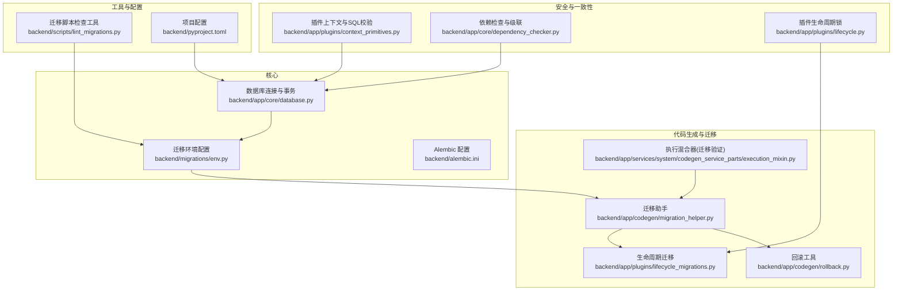
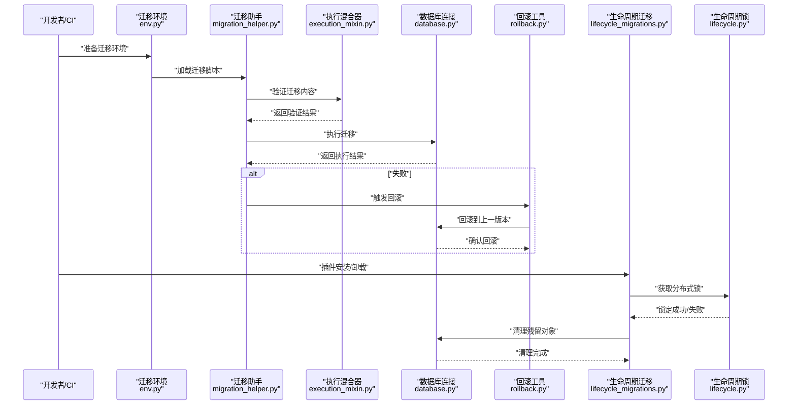
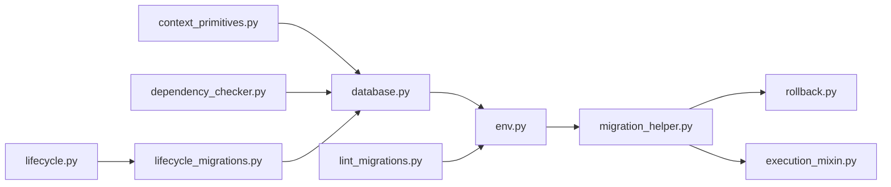
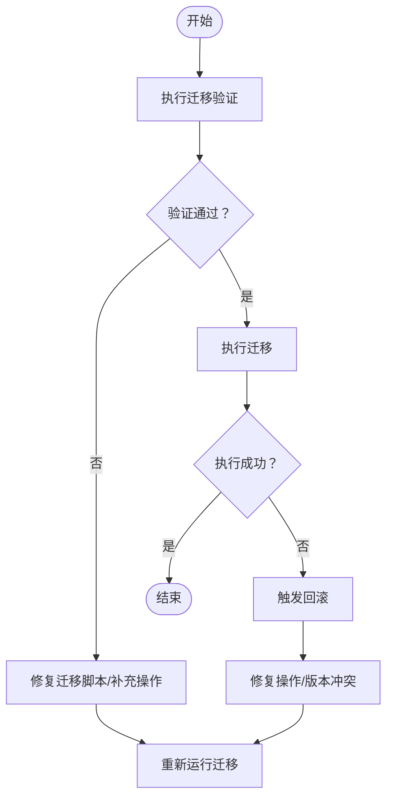

# 数据库故障排除

<cite>
**本文引用的文件**
- [backend/app/core/database.py](file://backend/app/core/database.py)
- [backend/migrations/env.py](file://backend/migrations/env.py)
- [backend/app/codegen/migration_helper.py](file://backend/app/codegen/migration_helper.py)
- [backend/app/codegen/rollback.py](file://backend/app/codegen/rollback.py)
- [backend/app/plugins/lifecycle_migrations.py](file://backend/app/plugins/lifecycle_migrations.py)
- [backend/app/plugins/lifecycle.py](file://backend/app/plugins/lifecycle.py)
- [backend/app/plugins/context_primitives.py](file://backend/app/plugins/context_primitives.py)
- [backend/app/services/system/codegen_service_parts/execution_mixin.py](file://backend/app/services/system/codegen_service_parts/execution_mixin.py)
- [backend/app/core/dependency_checker.py](file://backend/app/core/dependency_checker.py)
- [backend/scripts/lint_migrations.py](file://backend/scripts/lint_migrations.py)
- [backend/alembic.ini](file://backend/alembic.ini)
- [backend/pyproject.toml](file://backend/pyproject.toml)
</cite>

## 目录
1. [简介](#简介)
2. [项目结构](#项目结构)
3. [核心组件](#核心组件)
4. [架构总览](#架构总览)
5. [详细组件分析](#详细组件分析)
6. [依赖关系分析](#依赖关系分析)
7. [性能考虑](#性能考虑)
8. [故障排除指南](#故障排除指南)
9. [结论](#结论)
10. [附录](#附录)

## 简介
本文件面向数据库运维与开发工程师，系统化梳理数据库连接问题、查询性能瓶颈、数据一致性异常的诊断与修复方法；规范数据库迁移失败的排查流程（迁移脚本错误、版本冲突、回滚策略）；给出锁等待超时、死锁检测与事务冲突的解决方案；总结索引失效、查询计划异常与慢查询的优化手段；明确数据完整性检查、约束违反与外键冲突的修复步骤；并解释备份恢复与数据迁移过程中的常见错误处理。

## 项目结构
后端采用 Python/SQLAlchemy/Alembic 架构，数据库连接与事务管理集中在核心模块，迁移与回滚逻辑由代码生成器与生命周期迁移模块协同完成，插件上下文对 SQL 访问进行安全前置校验，依赖检查服务保障删除与级联操作的原子性与一致性。

**图表来源**
- [backend/app/core/database.py](file://backend/app/core/database.py)
- [backend/migrations/env.py](file://backend/migrations/env.py)
- [backend/app/codegen/migration_helper.py](file://backend/app/codegen/migration_helper.py)
- [backend/app/codegen/rollback.py](file://backend/app/codegen/rollback.py)
- [backend/app/plugins/lifecycle_migrations.py](file://backend/app/plugins/lifecycle_migrations.py)
- [backend/app/services/system/codegen_service_parts/execution_mixin.py](file://backend/app/services/system/codegen_service_parts/execution_mixin.py)
- [backend/app/plugins/context_primitives.py](file://backend/app/plugins/context_primitives.py)
- [backend/app/core/dependency_checker.py](file://backend/app/core/dependency_checker.py)
- [backend/app/plugins/lifecycle.py](file://backend/app/plugins/lifecycle.py)
- [backend/scripts/lint_migrations.py](file://backend/scripts/lint_migrations.py)
- [backend/alembic.ini](file://backend/alembic.ini)
- [backend/pyproject.toml](file://backend/pyproject.toml)

**章节来源**
- [backend/app/core/database.py](file://backend/app/core/database.py)
- [backend/migrations/env.py](file://backend/migrations/env.py)
- [backend/alembic.ini](file://backend/alembic.ini)

## 核心组件
- 数据库连接与事务管理：集中于核心模块，提供连接池、事务边界与嵌套事务支持，确保迁移与业务操作的原子性与一致性。
- 迁移与回滚：迁移助手负责生成与执行迁移，回滚工具提供安全回退路径；生命周期迁移模块在插件安装/卸载中清理残留对象。
- 安全与一致性：插件上下文对 SQL 执行进行访问控制与白名单校验；依赖检查服务在删除或恢复时自动处理外键级联与空值策略。
- 配置与工具：Alembic 配置与 env 文件定义迁移环境；lint 工具用于迁移脚本静态检查；生命周期锁避免并发修改冲突。

**章节来源**
- [backend/app/core/database.py](file://backend/app/core/database.py)
- [backend/app/codegen/migration_helper.py](file://backend/app/codegen/migration_helper.py)
- [backend/app/codegen/rollback.py](file://backend/app/codegen/rollback.py)
- [backend/app/plugins/lifecycle_migrations.py](file://backend/app/plugins/lifecycle_migrations.py)
- [backend/app/plugins/context_primitives.py](file://backend/app/plugins/context_primitives.py)
- [backend/app/core/dependency_checker.py](file://backend/app/core/dependency_checker.py)
- [backend/app/plugins/lifecycle.py](file://backend/app/plugins/lifecycle.py)
- [backend/scripts/lint_migrations.py](file://backend/scripts/lint_migrations.py)
- [backend/alembic.ini](file://backend/alembic.ini)

## 架构总览
下图展示数据库故障排除涉及的关键交互：迁移执行链路、安全校验前置、依赖检查与回滚、以及生命周期锁对并发冲突的防护。

**图表来源**
- [backend/migrations/env.py](file://backend/migrations/env.py)
- [backend/app/codegen/migration_helper.py](file://backend/app/codegen/migration_helper.py)
- [backend/app/services/system/codegen_service_parts/execution_mixin.py](file://backend/app/services/system/codegen_service_parts/execution_mixin.py)
- [backend/app/core/database.py](file://backend/app/core/database.py)
- [backend/app/codegen/rollback.py](file://backend/app/codegen/rollback.py)
- [backend/app/plugins/lifecycle_migrations.py](file://backend/app/plugins/lifecycle_migrations.py)
- [backend/app/plugins/lifecycle.py](file://backend/app/plugins/lifecycle.py)

## 详细组件分析

### 组件A：数据库连接与事务管理
- 设计要点
  - 提供连接池与事务边界管理，支持嵌套事务（savepoint），用于在清理/迁移过程中隔离局部异常，避免污染外层事务。
  - 在迁移清理阶段使用嵌套事务包裹关键清理 SQL，确保异常可回滚而不影响整体迁移。
- 故障定位
  - 连接失败：检查连接字符串、网络连通性、认证凭据与超时设置。
  - 事务异常：关注嵌套事务的 begin_nested 与回滚点设置，避免跨事务传播异常。
- 性能与稳定性
  - 合理配置连接池大小与超时；在高并发场景下优先使用只读事务与批量写入策略。

**章节来源**
- [backend/app/core/database.py](file://backend/app/core/database.py)
- [backend/app/plugins/lifecycle_migrations.py](file://backend/app/plugins/lifecycle_migrations.py)

### 组件B：迁移助手与回滚工具
- 设计要点
  - 迁移助手负责生成与执行迁移，回滚工具提供安全回退路径，确保版本升级失败时可回到稳定状态。
  - 执行混合器对迁移文件进行验证，若无 alembic 操作或缺少预期表变更，立即报错并标记阶段。
- 故障定位
  - 迁移失败：查看验证阶段输出与回滚日志，确认脚本是否包含有效操作。
  - 版本冲突：检查 alembic_version 表与目标版本，必要时强制合并或重置。
- 最佳实践
  - 在生产前进行预演迁移；对大表变更采用分批/在线DDL策略；保留回滚脚本与快照。

**章节来源**
- [backend/app/codegen/migration_helper.py](file://backend/app/codegen/migration_helper.py)
- [backend/app/codegen/rollback.py](file://backend/app/codegen/rollback.py)
- [backend/app/services/system/codegen_service_parts/execution_mixin.py](file://backend/app/services/system/codegen_service_parts/execution_mixin.py)

### 组件C：生命周期迁移与残留对象清理
- 设计要点
  - 生命周期迁移在插件安装/卸载时清理残留表，使用 LIKE 前缀匹配与 pg_tables 查询识别未被迁移覆盖的表。
  - 通过嵌套事务包裹清理逻辑，避免异常扩散至外层事务。
- 故障定位
  - 残留表导致迁移契约破裂：需人工核对残留表结构与用途，决定迁移修复或手工清理。
  - 清理失败：检查权限、模式名与 LIKE 转义规则。
- 修复步骤
  - 评估残留表是否仍被插件使用；如不再使用，按迁移契约补充缺失的迁移脚本并重新执行。

**章节来源**
- [backend/app/plugins/lifecycle_migrations.py](file://backend/app/plugins/lifecycle_migrations.py)

### 组件D：插件上下文与SQL访问控制
- 设计要点
  - 对 SQL 执行进行表名前缀检查与白名单校验，拦截潜在危险操作；已知限制包括字符串常量误判与函数调用漏检，建议结合 RLS 做最终防线。
  - ORM 查询通过 add/execute 的额外保护，进一步降低越权风险。
- 故障定位
  - 权限不足：检查用户角色与 RLS 策略；确认白名单是否覆盖目标表。
  - 误报/漏报：调整白名单与检测规则，结合审计日志定位。
- 修复步骤
  - 明确插件可访问的表集合；完善白名单与注释；启用 RLS 并定期审查策略。

**章节来源**
- [backend/app/plugins/context_primitives.py](file://backend/app/plugins/context_primitives.py)

### 组件E：依赖检查与级联删除/恢复
- 设计要点
  - 删除前检查依赖策略（阻断/忽略/级联/置空），在事务内原子执行，记录受影响行数与模型信息。
  - 支持从回收站恢复时的反向级联与字段复原。
- 故障定位
  - 级联删除过多：检查依赖图与策略配置，必要时改为“置空”以保留父记录。
  - 恢复失败：确认 is_deleted 状态与租户隔离条件。
- 修复步骤
  - 逐条核对依赖模型与外键字段；在测试环境模拟删除/恢复流程；必要时手工修正异常状态。

**章节来源**
- [backend/app/core/dependency_checker.py](file://backend/app/core/dependency_checker.py)

### 组件F：生命周期锁与并发冲突
- 设计要点
  - 使用 Redis 分布式锁，TTL 自动过期避免死锁；获取失败抛出 409 冲突错误，提示稍后重试。
  - Lua 脚本保证清理过期→检查→加锁的原子性。
- 故障定位
  - 锁冲突：多个实例同时修改同一插件；检查锁键与过期时间。
  - 死锁风险：长事务与锁粒度不当；缩短事务、降低锁持有时间。
- 修复步骤
  - 重试机制：指数退避重试；监控锁竞争指标；必要时拆分修改范围。

**章节来源**
- [backend/app/plugins/lifecycle.py](file://backend/app/plugins/lifecycle.py)

## 依赖关系分析

**图表来源**
- [backend/app/core/database.py](file://backend/app/core/database.py)
- [backend/migrations/env.py](file://backend/migrations/env.py)
- [backend/app/codegen/migration_helper.py](file://backend/app/codegen/migration_helper.py)
- [backend/app/codegen/rollback.py](file://backend/app/codegen/rollback.py)
- [backend/app/services/system/codegen_service_parts/execution_mixin.py](file://backend/app/services/system/codegen_service_parts/execution_mixin.py)
- [backend/app/plugins/context_primitives.py](file://backend/app/plugins/context_primitives.py)
- [backend/app/core/dependency_checker.py](file://backend/app/core/dependency_checker.py)
- [backend/app/plugins/lifecycle_migrations.py](file://backend/app/plugins/lifecycle_migrations.py)
- [backend/app/plugins/lifecycle.py](file://backend/app/plugins/lifecycle.py)
- [backend/scripts/lint_migrations.py](file://backend/scripts/lint_migrations.py)

**章节来源**
- [backend/app/core/database.py](file://backend/app/core/database.py)
- [backend/migrations/env.py](file://backend/migrations/env.py)
- [backend/app/codegen/migration_helper.py](file://backend/app/codegen/migration_helper.py)
- [backend/app/codegen/rollback.py](file://backend/app/codegen/rollback.py)
- [backend/app/services/system/codegen_service_parts/execution_mixin.py](file://backend/app/services/system/codegen_service_parts/execution_mixin.py)
- [backend/app/plugins/context_primitives.py](file://backend/app/plugins/context_primitives.py)
- [backend/app/core/dependency_checker.py](file://backend/app/core/dependency_checker.py)
- [backend/app/plugins/lifecycle_migrations.py](file://backend/app/plugins/lifecycle_migrations.py)
- [backend/app/plugins/lifecycle.py](file://backend/app/plugins/lifecycle.py)
- [backend/scripts/lint_migrations.py](file://backend/scripts/lint_migrations.py)

## 性能考虑
- 连接与事务
  - 合理设置连接池大小与空闲回收策略；避免长事务持有锁；使用只读事务与批量写入减少锁竞争。
- 查询优化
  - 识别慢查询：通过执行计划与统计信息定位索引缺失、过滤条件未走索引、全表扫描等问题；优先补充缺失索引，优化谓词选择性。
  - 避免隐式转换与函数运算导致的索引失效；使用参数化查询与合适的类型。
- 迁移性能
  - 大表变更采用在线DDL或分批策略；在维护窗口执行重建索引与大批量更新。
- 缓存与锁
  - 减少热点资源的锁粒度；使用 Redis 原子操作与 Lua 脚本降低竞争；合理设置 TTL 与重试退避。

## 故障排除指南

### 数据库连接问题
- 诊断步骤
  - 检查连接字符串与认证信息；验证网络连通性与防火墙策略；确认数据库服务状态与监听端口。
  - 查看连接池状态与超时配置；区分连接失败与查询超时。
- 修复建议
  - 更新凭据与白名单；调整连接池大小与超时；在应用侧增加重试与熔断。

**章节来源**
- [backend/app/core/database.py](file://backend/app/core/database.py)
- [backend/alembic.ini](file://backend/alembic.ini)

### 查询性能瓶颈与慢查询
- 诊断步骤
  - 采集慢查询日志与执行计划；检查索引使用情况与选择性；识别全表扫描、隐式转换与 N+1 查询。
- 优化建议
  - 补充缺失索引；改写复杂 WHERE/HAVING 子句；拆分大查询为多轮小查询；使用物化视图或汇总表。

**章节来源**
- [backend/app/plugins/context_primitives.py](file://backend/app/plugins/context_primitives.py)

### 数据一致性异常
- 诊断步骤
  - 核对外键约束与唯一约束；检查级联策略与软删除字段；确认租户隔离条件与回收站状态。
- 修复建议
  - 通过依赖检查服务执行级联/置空；恢复回收站数据时同步反向级联；补充缺失约束并回填数据。

**章节来源**
- [backend/app/core/dependency_checker.py](file://backend/app/core/dependency_checker.py)

### 迁移失败排查流程
- 通用流程
  - 预演迁移：在测试环境执行相同迁移，观察验证阶段输出与回滚日志。
  - 定位错误：根据阶段标记（如 validation）快速缩小范围；检查脚本是否包含 alembic 操作。
  - 回滚与重试：触发回滚工具回到上一稳定版本；修复后重试迁移。
- 版本冲突与残留对象
  - 检查 alembic_version 与目标版本；使用生命周期迁移清理残留表并补充缺失迁移。
- 工具辅助
  - 使用 lint 工具对迁移脚本进行静态检查，提前发现语法与风格问题。

**图表来源**
- [backend/app/services/system/codegen_service_parts/execution_mixin.py](file://backend/app/services/system/codegen_service_parts/execution_mixin.py)
- [backend/app/codegen/rollback.py](file://backend/app/codegen/rollback.py)
- [backend/app/plugins/lifecycle_migrations.py](file://backend/app/plugins/lifecycle_migrations.py)

**章节来源**
- [backend/app/services/system/codegen_service_parts/execution_mixin.py](file://backend/app/services/system/codegen_service_parts/execution_mixin.py)
- [backend/app/codegen/rollback.py](file://backend/app/codegen/rollback.py)
- [backend/app/plugins/lifecycle_migrations.py](file://backend/app/plugins/lifecycle_migrations.py)
- [backend/scripts/lint_migrations.py](file://backend/scripts/lint_migrations.py)

### 锁等待超时、死锁检测与事务冲突
- 诊断步骤
  - 观察锁等待日志与死锁报告；识别长事务与高冲突区域；检查锁粒度与并发策略。
- 解决方案
  - 缩短事务时间；降低锁持有范围；使用乐观并发控制；在生命周期锁中启用 TTL 自动过期。
- 预防措施
  - 将热点资源拆分；避免在事务中执行 I/O 密集操作；使用幂等设计与补偿机制。

**章节来源**
- [backend/app/plugins/lifecycle.py](file://backend/app/plugins/lifecycle.py)

### 索引失效与查询计划异常
- 诊断步骤
  - 对比执行计划与统计信息；检查谓词选择性与索引覆盖；识别函数运算与类型转换导致的失效。
- 优化建议
  - 重构 WHERE/HAVING 子句；补充复合索引；使用表达式索引或生成列；避免在 WHERE 中对列进行函数运算。

**章节来源**
- [backend/app/plugins/context_primitives.py](file://backend/app/plugins/context_primitives.py)

### 数据完整性检查与约束违反
- 诊断步骤
  - 核查外键、唯一性与非空约束；检查软删除与回收站状态；确认租户隔离条件。
- 修复步骤
  - 通过依赖检查服务执行级联/置空；恢复回收站数据时同步反向级联；补充缺失约束并回填数据。

**章节来源**
- [backend/app/core/dependency_checker.py](file://backend/app/core/dependency_checker.py)

### 备份恢复与数据迁移错误处理
- 通用流程
  - 备份：定期全量与增量备份，验证恢复路径；迁移：在维护窗口执行，预演与回滚演练。
- 常见问题
  - 恢复失败：检查备份完整性与目标环境兼容性；迁移中断：使用回滚工具回到稳定版本。
- 最佳实践
  - 制定标准化的备份/恢复与迁移流程；自动化校验与告警；建立演练与演练报告制度。

**章节来源**
- [backend/app/codegen/rollback.py](file://backend/app/codegen/rollback.py)
- [backend/app/codegen/migration_helper.py](file://backend/app/codegen/migration_helper.py)

## 结论
通过将数据库连接、迁移、安全与一致性控制、锁与并发治理、查询优化与备份恢复形成闭环，可以系统化地提升数据库的稳定性与可维护性。建议在生产环境中持续完善自动化检查与演练机制，并结合实际业务场景迭代优化策略。

## 附录
- 配置参考
  - Alembic 配置与 env 文件用于定义迁移环境与脚本路径。
  - 项目配置文件包含数据库驱动与连接参数。
- 工具参考
  - 迁移脚本静态检查工具用于提前发现潜在问题。

**章节来源**
- [backend/alembic.ini](file://backend/alembic.ini)
- [backend/pyproject.toml](file://backend/pyproject.toml)
- [backend/scripts/lint_migrations.py](file://backend/scripts/lint_migrations.py)