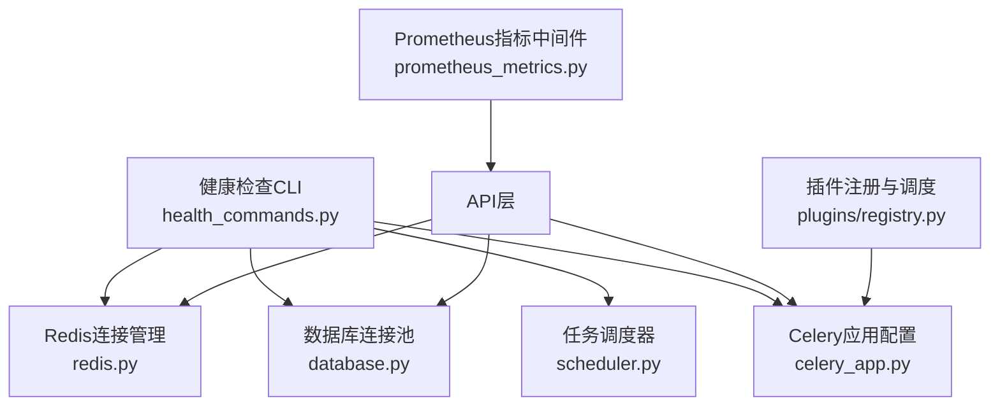
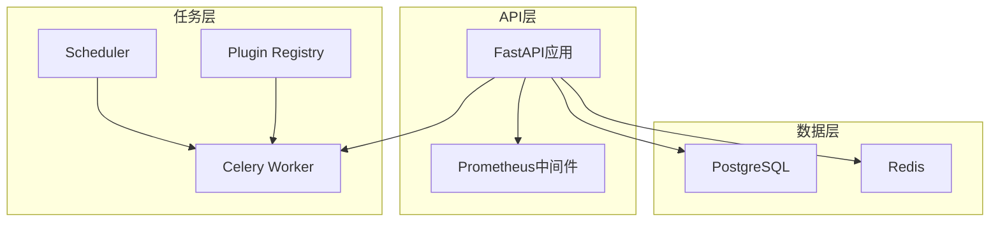
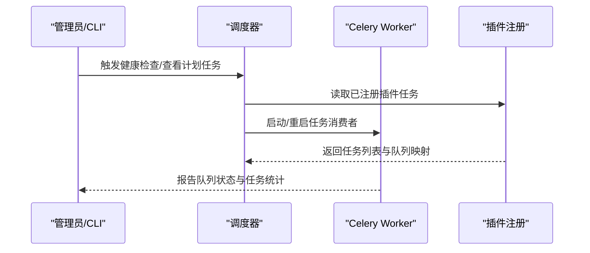
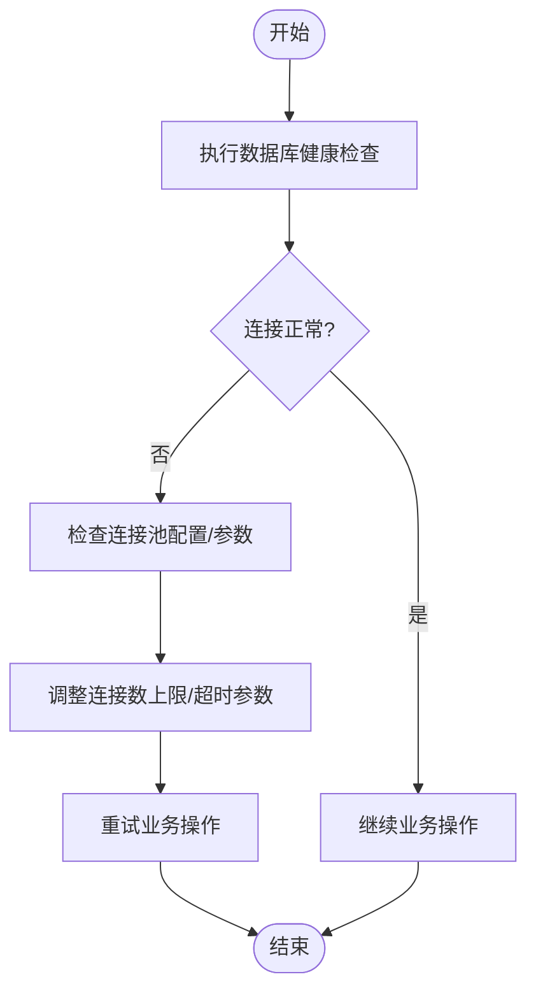
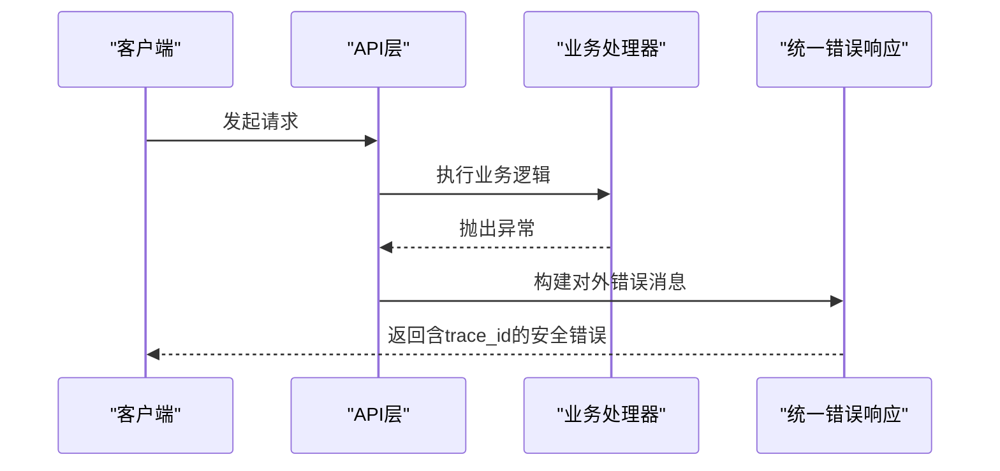
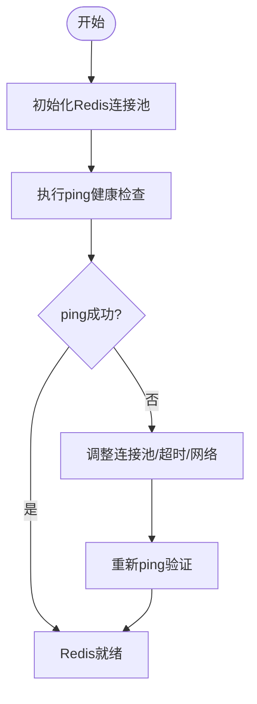
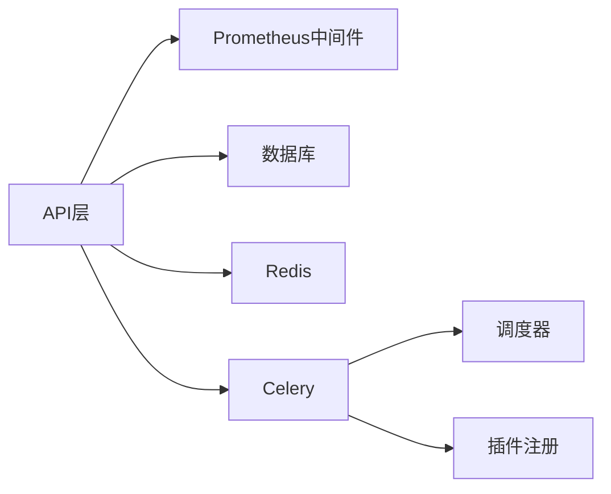

# 系统故障排除

<cite>
**本文引用的文件**
- [backend/app/cli_commands/health_commands.py](file://backend/app/cli_commands/health_commands.py)
- [backend/app/tasks/scheduler.py](file://backend/app/tasks/scheduler.py)
- [backend/app/celery_app.py](file://backend/app/celery_app.py)
- [backend/app/core/redis.py](file://backend/app/core/redis.py)
- [backend/app/core/database.py](file://backend/app/core/database.py)
- [backend/app/middleware/prometheus_metrics.py](file://backend/app/middleware/prometheus_metrics.py)
- [backend/app/core/response.py](file://backend/app/core/response.py)
- [backend/app/ai/engine/stream_error_utils.py](file://backend/app/ai/engine/stream_error_utils.py)
- [backend/app/ai/engine/stream_execution_runtime.py](file://backend/app/ai/engine/stream_execution_runtime.py)
- [backend/docs/storage/RUN_LOG_ANALYSIS.md](file://backend/docs/storage/RUN_LOG_ANALYSIS.md)
- [backend/tests/services/test_runtime_diagnostics_service.py](file://backend/tests/services/test_runtime_diagnostics_service.py)
- [backend/tests/test_trace_cli.py](file://backend/tests/test_trace_cli.py)
- [backend/tests/services/test_conversation_engine_exception_passthrough.py](file://backend/tests/services/test_conversation_engine_exception_passthrough.py)
- [backend/app/plugins/registry.py](file://backend/app/plugins/registry.py)
</cite>

## 目录
1. [简介](#简介)
2. [项目结构](#项目结构)
3. [核心组件](#核心组件)
4. [架构总览](#架构总览)
5. [详细组件分析](#详细组件分析)
6. [依赖关系分析](#依赖关系分析)
7. [性能考量](#性能考量)
8. [故障排除指南](#故障排除指南)
9. [结论](#结论)
10. [附录](#附录)

## 简介
本技术文档面向系统运维与开发工程师，聚焦于NovusAI SaaS后端系统的故障诊断与排障实践。内容覆盖任务调度异常、数据库连接问题、内存泄漏与进程崩溃的定位与修复；系统健康检查工具的使用（任务队列监控、数据库连接池状态检查、Redis连接验证）；错误日志分析方法（异常堆栈跟踪、系统资源监控、性能指标分析）；常见系统错误的快速修复步骤（服务重启、配置重载、临时方案）以及系统监控告警的设置与响应流程。

## 项目结构
后端采用Python/FastAPI + Celery + Redis + PostgreSQL架构。关键故障排查相关模块分布如下：
- 健康检查与CLI：命令行健康检查工具
- 任务调度：Celery应用配置、任务路由与调度器
- 数据库：连接池管理与健康检查
- 缓存：Redis连接池与健康检查
- 指标与日志：Prometheus中间件、统一错误响应与流式错误处理
- 插件：插件任务注册与周期性调度集成

图表来源
- [backend/app/cli_commands/health_commands.py](file://backend/app/cli_commands/health_commands.py)
- [backend/app/tasks/scheduler.py](file://backend/app/tasks/scheduler.py)
- [backend/app/celery_app.py](file://backend/app/celery_app.py)
- [backend/app/core/database.py](file://backend/app/core/database.py)
- [backend/app/core/redis.py](file://backend/app/core/redis.py)
- [backend/app/middleware/prometheus_metrics.py](file://backend/app/middleware/prometheus_metrics.py)
- [backend/app/plugins/registry.py](file://backend/app/plugins/registry.py)

章节来源
- [backend/app/cli_commands/health_commands.py](file://backend/app/cli_commands/health_commands.py)
- [backend/app/tasks/scheduler.py](file://backend/app/tasks/scheduler.py)
- [backend/app/celery_app.py](file://backend/app/celery_app.py)
- [backend/app/core/database.py](file://backend/app/core/database.py)
- [backend/app/core/redis.py](file://backend/app/core/redis.py)
- [backend/app/middleware/prometheus_metrics.py](file://backend/app/middleware/prometheus_metrics.py)
- [backend/app/plugins/registry.py](file://backend/app/plugins/registry.py)

## 核心组件
- 健康检查CLI：提供命令行入口进行系统健康检查，便于自动化巡检与运维脚本集成。
- Celery应用：集中配置序列化、时区、任务执行参数、多队列路由与任务自动发现。
- 调度器：负责周期性任务的注册、调度与运行状态管理。
- 数据库连接池：封装连接池生命周期、健康检查与关闭流程。
- Redis连接管理：提供连接池初始化、ping健康检查、客户端获取与关闭。
- 指标中间件：暴露Prometheus指标，便于外部监控系统抓取。
- 统一错误响应：构建对外安全的错误消息，包含trace_id与可选调试信息。
- 流式错误处理：识别流中断类错误，剥离trace_id后缀，保持对外一致性。
- 插件注册：动态注册插件任务并注入beat_schedule，支持周期性调度。

章节来源
- [backend/app/cli_commands/health_commands.py](file://backend/app/cli_commands/health_commands.py)
- [backend/app/celery_app.py](file://backend/app/celery_app.py)
- [backend/app/tasks/scheduler.py](file://backend/app/tasks/scheduler.py)
- [backend/app/core/database.py](file://backend/app/core/database.py)
- [backend/app/core/redis.py](file://backend/app/core/redis.py)
- [backend/app/middleware/prometheus_metrics.py](file://backend/app/middleware/prometheus_metrics.py)
- [backend/app/core/response.py](file://backend/app/core/response.py)
- [backend/app/ai/engine/stream_error_utils.py](file://backend/app/ai/engine/stream_error_utils.py)
- [backend/app/plugins/registry.py](file://backend/app/plugins/registry.py)

## 架构总览
系统通过API层接收请求，经由中间件（含Prometheus指标）进入业务逻辑；异步任务通过Celery分发到不同队列（高优先级、AI网关、定时任务、通知等），插件任务通过注册机制自动纳入调度。数据库与Redis作为持久化与缓存基础设施，均提供健康检查能力。

图表来源
- [backend/app/celery_app.py](file://backend/app/celery_app.py)
- [backend/app/tasks/scheduler.py](file://backend/app/tasks/scheduler.py)
- [backend/app/core/database.py](file://backend/app/core/database.py)
- [backend/app/core/redis.py](file://backend/app/core/redis.py)
- [backend/app/middleware/prometheus_metrics.py](file://backend/app/middleware/prometheus_metrics.py)
- [backend/app/plugins/registry.py](file://backend/app/plugins/registry.py)

## 详细组件分析

### 任务调度异常诊断
- 任务路由与队列
  - Celery应用定义了默认队列与多个专用队列（高优先级、AI网关、定时、通知），并通过routes将不同类型任务映射到对应队列，便于隔离与限流。
  - 队列与路由配置位于应用初始化阶段，确保任务正确投递与消费。
- 调度器
  - 调度器负责周期性任务的注册与运行，异常通常表现为任务未触发或延迟。
  - 排查要点：确认调度器是否启动、任务定义是否存在、时间表达式是否正确。
- 插件任务
  - 插件通过注册机制将任务名转换为“plugin.{name}.{task}”，并注入beat_schedule，支持周期性调度。
  - 异常可能来自插件未加载、任务名冲突或调度表达式无效。

图表来源
- [backend/app/tasks/scheduler.py](file://backend/app/tasks/scheduler.py)
- [backend/app/celery_app.py](file://backend/app/celery_app.py)
- [backend/app/plugins/registry.py](file://backend/app/plugins/registry.py)

章节来源
- [backend/app/celery_app.py](file://backend/app/celery_app.py)
- [backend/app/tasks/scheduler.py](file://backend/app/tasks/scheduler.py)
- [backend/app/plugins/registry.py](file://backend/app/plugins/registry.py)

### 数据库连接问题诊断
- 连接池管理
  - 数据库模块提供连接池生命周期管理，包含初始化、健康检查与关闭流程。
  - 健康检查通过ping或简单查询验证可用性，异常时返回False或抛出异常。
- 常见症状
  - 连接池耗尽、超时、事务失败、迁移失败。
- 诊断步骤
  - 使用健康检查接口确认连接池状态。
  - 查看连接数、空闲连接、最大连接数等指标。
  - 检查慢查询日志与锁等待情况。
  - 在维护窗口内重置连接池或重启数据库服务。

图表来源
- [backend/app/core/database.py](file://backend/app/core/database.py)

章节来源
- [backend/app/core/database.py](file://backend/app/core/database.py)

### 内存泄漏与进程崩溃排查
- 统一错误响应与trace_id
  - 统一错误响应模块在生产环境隐藏具体异常细节，仅保留trace_id以便追踪，避免敏感信息泄露。
  - 开发环境可开启调试，输出完整堆栈。
- 流式错误处理
  - 流式场景下，识别客户端断开、连接中断等“优雅中断”错误，剥离trace_id后缀，保持对外一致。
- 崩溃与OOM
  - 关注长时间运行任务的内存增长趋势，结合Prometheus指标观察CPU、内存、GC频率。
  - 对外错误消息中包含trace_id，便于日志关联与根因定位。

图表来源
- [backend/app/core/response.py](file://backend/app/core/response.py)
- [backend/app/ai/engine/stream_error_utils.py](file://backend/app/ai/engine/stream_error_utils.py)
- [backend/app/ai/engine/stream_execution_runtime.py](file://backend/app/ai/engine/stream_execution_runtime.py)

章节来源
- [backend/app/core/response.py](file://backend/app/core/response.py)
- [backend/app/ai/engine/stream_error_utils.py](file://backend/app/ai/engine/stream_error_utils.py)
- [backend/app/ai/engine/stream_execution_runtime.py](file://backend/app/ai/engine/stream_execution_runtime.py)

### Redis连接验证
- 连接池与健康检查
  - RedisManager提供连接池初始化、ping健康检查、客户端获取与关闭。
  - 健康检查通过ping命令验证连通性，异常时返回False。
- 常见问题
  - 连接超时、连接池耗尽、Key过期策略不当导致频繁重建连接。
- 诊断步骤
  - 使用health_check接口快速验证Redis可用性。
  - 检查连接池大小、超时参数与网络延迟。
  - 结合业务键空间与慢查询日志定位热点Key。

图表来源
- [backend/app/core/redis.py](file://backend/app/core/redis.py)

章节来源
- [backend/app/core/redis.py](file://backend/app/core/redis.py)

### 系统健康检查工具使用
- 命令行健康检查
  - 提供CLI入口进行系统健康检查，便于自动化巡检与运维脚本集成。
- 任务队列监控
  - 通过Celery提供的队列状态与任务统计接口，监控各队列积压、消费速率与失败率。
- 数据库连接池状态检查
  - 通过数据库模块的健康检查接口，确认连接池可用性与关键参数。
- Redis连接验证
  - 通过RedisManager.health_check接口，快速验证Redis可用性。

章节来源
- [backend/app/cli_commands/health_commands.py](file://backend/app/cli_commands/health_commands.py)
- [backend/app/celery_app.py](file://backend/app/celery_app.py)
- [backend/app/core/database.py](file://backend/app/core/database.py)
- [backend/app/core/redis.py](file://backend/app/core/redis.py)

### 错误日志分析方法
- 异常堆栈跟踪
  - 生产环境错误消息中包含trace_id，便于跨服务与日志系统关联。
  - 开发环境可启用调试模式以获取完整堆栈。
- 系统资源监控
  - 通过Prometheus中间件导出指标，结合外部监控系统（如Grafana）观察CPU、内存、磁盘、网络与数据库连接数。
- 性能指标分析
  - 关注任务执行时延、队列积压、数据库慢查询与Redis命中率等关键指标。
- 日志分析文档
  - 参考运行日志分析文档，掌握日志格式、字段含义与分析技巧。

章节来源
- [backend/app/core/response.py](file://backend/app/core/response.py)
- [backend/app/middleware/prometheus_metrics.py](file://backend/app/middleware/prometheus_metrics.py)
- [backend/docs/storage/RUN_LOG_ANALYSIS.md](file://backend/docs/storage/RUN_LOG_ANALYSIS.md)

### 常见系统错误快速修复步骤
- 服务重启
  - 通过健康检查CLI确认服务状态，必要时执行重启以恢复连接池与缓存状态。
- 配置重载
  - 修改Celery、数据库或Redis配置后，先进行健康检查，再平滑重载或重启相关进程。
- 临时方案
  - 降低并发、禁用高风险任务、切换备用上游服务或临时扩容资源。

章节来源
- [backend/app/cli_commands/health_commands.py](file://backend/app/cli_commands/health_commands.py)
- [backend/app/celery_app.py](file://backend/app/celery_app.py)
- [backend/app/core/database.py](file://backend/app/core/database.py)
- [backend/app/core/redis.py](file://backend/app/core/redis.py)

### 系统监控告警设置与响应流程
- 指标采集
  - 通过Prometheus中间件导出关键指标，包括任务执行时延、队列长度、数据库连接数、Redis可用性等。
- 告警规则
  - 队列积压超过阈值、任务失败率上升、数据库连接池耗尽、Redis不可达、进程CPU/内存异常等。
- 响应流程
  - 告警触发 → 自动化巡检（健康检查CLI）→ 快速修复（重启/重载/扩容）→ 回归测试 → 关闭告警。

章节来源
- [backend/app/middleware/prometheus_metrics.py](file://backend/app/middleware/prometheus_metrics.py)
- [backend/app/cli_commands/health_commands.py](file://backend/app/cli_commands/health_commands.py)

## 依赖关系分析
- 组件耦合
  - API层依赖中间件（Prometheus）、数据库与Redis。
  - Celery应用依赖调度器与插件注册，用于任务分发与周期性调度。
- 外部依赖
  - PostgreSQL（数据库）、Redis（缓存）、Celery（消息队列）。
- 循环依赖
  - 当前模块间无明显循环依赖迹象，职责边界清晰。

图表来源
- [backend/app/middleware/prometheus_metrics.py](file://backend/app/middleware/prometheus_metrics.py)
- [backend/app/core/database.py](file://backend/app/core/database.py)
- [backend/app/core/redis.py](file://backend/app/core/redis.py)
- [backend/app/celery_app.py](file://backend/app/celery_app.py)
- [backend/app/tasks/scheduler.py](file://backend/app/tasks/scheduler.py)
- [backend/app/plugins/registry.py](file://backend/app/plugins/registry.py)

章节来源
- [backend/app/middleware/prometheus_metrics.py](file://backend/app/middleware/prometheus_metrics.py)
- [backend/app/core/database.py](file://backend/app/core/database.py)
- [backend/app/core/redis.py](file://backend/app/core/redis.py)
- [backend/app/celery_app.py](file://backend/app/celery_app.py)
- [backend/app/tasks/scheduler.py](file://backend/app/tasks/scheduler.py)
- [backend/app/plugins/registry.py](file://backend/app/plugins/registry.py)

## 性能考量
- 任务执行参数
  - 通过Celery配置任务时延限制、软超时、预取倍数与并发度，平衡吞吐与稳定性。
- 连接池参数
  - 数据库与Redis连接池的最大连接数、超时与重试策略直接影响性能与稳定性。
- 指标观测
  - 利用Prometheus指标持续观测任务积压、执行时延、连接池利用率与Redis命中率。

章节来源
- [backend/app/celery_app.py](file://backend/app/celery_app.py)
- [backend/app/core/database.py](file://backend/app/core/database.py)
- [backend/app/core/redis.py](file://backend/app/core/redis.py)
- [backend/app/middleware/prometheus_metrics.py](file://backend/app/middleware/prometheus_metrics.py)

## 故障排除指南
- 任务调度异常
  - 检查队列路由与任务名称是否匹配；确认调度器与Worker状态；核对插件任务注册与表达式。
- 数据库连接问题
  - 使用健康检查接口验证连接池；调整连接数与超时参数；排查慢查询与锁竞争。
- 内存泄漏与进程崩溃
  - 关注长时间运行任务的内存增长；结合trace_id与堆栈定位异常点；必要时重启服务。
- Redis连接验证
  - 通过health_check快速验证；检查连接池与网络；优化键空间与过期策略。
- 日志与根因分析
  - 使用trace_id串联日志；参考运行日志分析文档；结合指标定位瓶颈。
- 快速修复
  - 服务重启、配置重载、临时降载或切换备用上游。

章节来源
- [backend/app/tasks/scheduler.py](file://backend/app/tasks/scheduler.py)
- [backend/app/celery_app.py](file://backend/app/celery_app.py)
- [backend/app/core/database.py](file://backend/app/core/database.py)
- [backend/app/core/redis.py](file://backend/app/core/redis.py)
- [backend/app/core/response.py](file://backend/app/core/response.py)
- [backend/docs/storage/RUN_LOG_ANALYSIS.md](file://backend/docs/storage/RUN_LOG_ANALYSIS.md)
- [backend/tests/services/test_runtime_diagnostics_service.py](file://backend/tests/services/test_runtime_diagnostics_service.py)
- [backend/tests/test_trace_cli.py](file://backend/tests/test_trace_cli.py)
- [backend/tests/services/test_conversation_engine_exception_passthrough.py](file://backend/tests/services/test_conversation_engine_exception_passthrough.py)

## 结论
通过健康检查CLI、任务队列监控、数据库与Redis健康检查、统一错误响应与trace_id追踪、Prometheus指标观测以及完善的日志分析流程，可以系统化地定位与解决系统级故障。建议将上述工具与流程纳入日常运维与应急响应标准操作程序（SOP），以提升故障响应效率与系统稳定性。

## 附录
- 相关测试用例可作为故障复现与回归验证的参考，帮助快速确认修复效果。

章节来源
- [backend/tests/services/test_runtime_diagnostics_service.py](file://backend/tests/services/test_runtime_diagnostics_service.py)
- [backend/tests/test_trace_cli.py](file://backend/tests/test_trace_cli.py)
- [backend/tests/services/test_conversation_engine_exception_passthrough.py](file://backend/tests/services/test_conversation_engine_exception_passthrough.py)